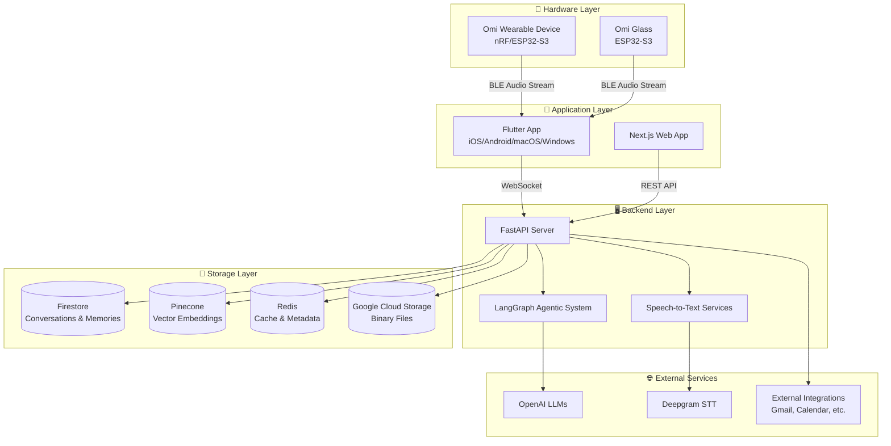
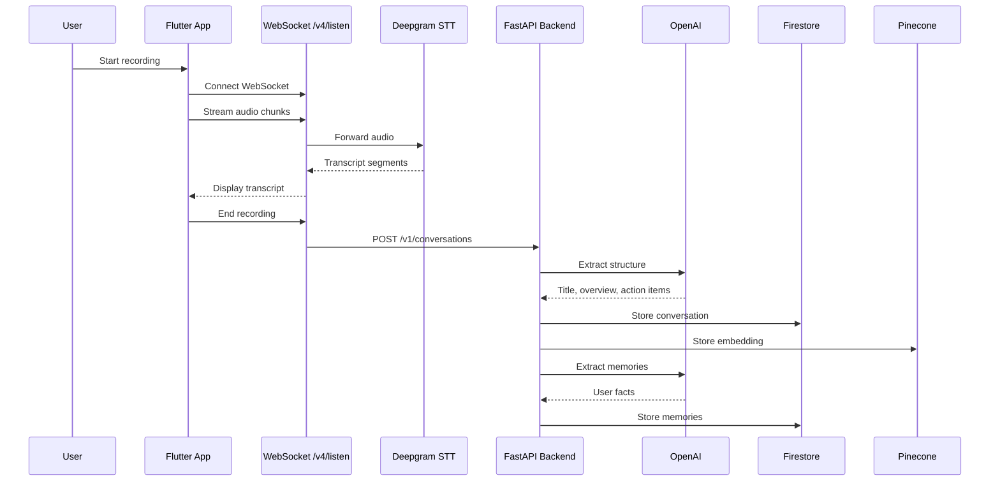
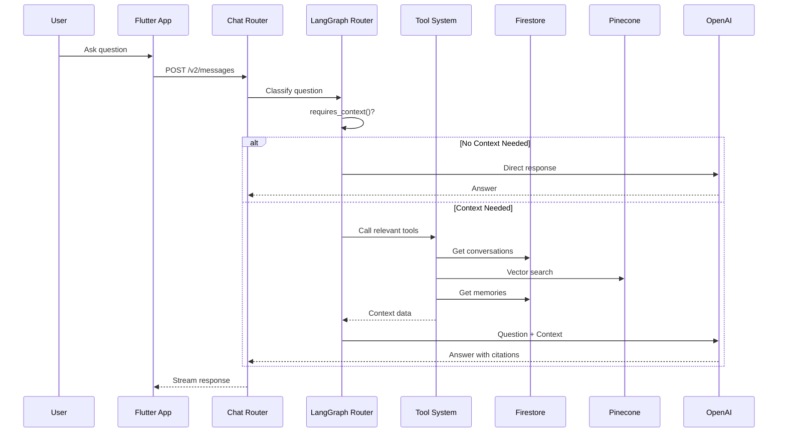

# Omi System Architecture

This document provides a comprehensive overview of the Omi system architecture to help Cursor agents understand the codebase structure and component relationships.

## System Overview

Omi is a multimodal AI wearable platform that captures conversations, extracts memories, and provides intelligent chat capabilities. The system consists of multiple components working together:

## Component Architecture

### 1. Backend (Python/FastAPI)

**Location**: `backend/`

The backend is organized into clear layers following a strict module hierarchy:

#### Module Hierarchy (lowest to highest)
1. **`database/`** - Database connections and data access
   - `conversations.py` - Firestore conversation CRUD
   - `memories.py` - Memory storage and retrieval
   - `vector_db.py` - Pinecone vector operations
   - `redis_db.py` - Redis caching
   - `action_items.py` - Task management
   - `goals.py` - Goals storage
   - `folders.py` - Conversation folders
   - `knowledge_graph.py` - Knowledge graph storage
   - `calendar_meetings.py` - Calendar meeting data
   - `users.py` - User data
   - `apps.py` - App data
   - `dev_api_key.py` - Developer API keys
   - `mcp_api_key.py` - MCP API keys
   - `notifications.py` - Notification data
   - `trends.py` - Analytics data
   - `tasks.py` - Task integration data
   - `daily_summaries.py` - Daily summary data
   - `wrapped.py` - Year-end summaries
   - `cache.py`, `cache_manager.py` - Caching layer
   - `redis_pubsub.py` - Redis pub/sub
   - `import_jobs.py` - Import job tracking
   - `user_usage.py` - Usage tracking
   - `announcements.py` - Announcements
   - `chat.py` - Chat message storage
   - `auth.py` - Authentication data
   - `mem_db.py` - Memory database helpers
   - `helpers.py` - Database helper functions
   
2. **`utils/`** - Utility functions and business logic
   - `llm/` - LLM client configurations and processing
     - `clients.py` - LLM client setup
     - `conversation_processing.py` - Conversation extraction
     - `memories.py` - Memory extraction
     - `chat.py` - Chat LLM calls
     - `goals.py` - Goals processing
     - `knowledge_graph.py` - Knowledge graph processing
     - `notifications.py` - Notification generation
     - `trends.py` - Trends analysis
     - `persona.py` - Persona processing
     - `app_generator.py` - App generation
     - `external_integrations.py` - External integration processing
     - `followup.py` - Follow-up questions
     - `openglass.py` - OpenGlass integration
     - `proactive_notification.py` - Proactive notifications
   - `retrieval/` - LangGraph agentic system and RAG
     - `graph.py` - LangGraph routing
     - `agentic.py` - Agentic chat path
     - `rag.py` - Retrieval-augmented generation
     - `safety.py` - Safety checks
     - `tools/` - Chat tools (22+ tools)
   - `conversations/` - Conversation processing pipeline
     - `process_conversation.py` - Main processing function
     - `memories.py` - Memory extraction from conversations
     - `location.py` - Geolocation processing
     - `merge_conversations.py` - Conversation merging
     - `postprocess_conversation.py` - Post-processing
     - `search.py` - Conversation search
   - `stt/` - Speech-to-text utilities
     - `streaming.py` - Real-time STT
     - `pre_recorded.py` - Pre-recorded audio processing
     - `speaker_embedding.py` - Speaker identification
     - `speech_profile.py` - Speech profiles
     - `vad.py` - Voice activity detection
     - `soniox_util.py` - Soniox integration
   - `other/` - Storage, webhooks, notifications
     - `storage.py` - GCS storage
     - `webhooks.py` - Webhook handling
     - `notifications.py` - Push notifications
     - `chat_file.py` - File handling
     - `endpoints.py` - Endpoint utilities
     - `jobs.py` - Background jobs
     - `task.py` - Task utilities
     - `timeout.py` - Timeout handling
     - `pattern.py` - Pattern matching
     - `hume.py` - Hume integration
   - `apps.py` - App management utilities
   - `app_integrations.py` - App integration logic
   - `chat.py` - Chat utilities
   - `audio.py` - Audio processing
   - `analytics.py` - Analytics
   - `agent.py` - Agent utilities
   - `aac.py` - AAC codec
   - `dev_api_keys.py` - Developer API key management
   - `mcp_api_keys.py` - MCP API key management
   - `encryption.py` - Encryption utilities
   - `onboarding.py` - Onboarding flow
   - `mentor_notifications.py` - Mentor notifications
   - `notifications.py` - Notification utilities
   - `pusher.py` - Pusher integration
   - `prompts.py` - Prompt templates
   - `scopes.py` - API scopes
   - `social.py` - Social features
   - `speaker_identification.py` - Speaker ID
   - `speaker_sample.py` - Speaker samples
   - `speaker_sample_migration.py` - Speaker sample migration
   - `stripe.py` - Stripe integration
   - `subscription.py` - Subscription management
   - `task_sync.py` - Task synchronization
   - `text_utils.py` - Text utilities
   - `translation.py` - Translation
   - `translation_cache.py` - Translation caching
   - `webhooks.py` - Webhook utilities
   - `imports/` - Import integrations
     - `limitless.py` - Limitless integration
   - `observability/` - Observability
     - `langsmith.py` - LangSmith integration
     - `langsmith_prompts.py` - LangSmith prompts
   - `wrapped/` - Year-end summaries
     - `generate_2025.py` - 2025 summary generation
   
3. **`routers/`** - API endpoints (FastAPI routers)
   - `transcribe.py` - WebSocket audio streaming
   - `conversations.py` - Conversation management
   - `chat.py` - Chat system with LangGraph
   - `memories.py` - Memory operations
   - `apps.py` - App management
   - `developer.py` - Developer API
   - `mcp_sse.py` - MCP over SSE
   - `mcp.py` - MCP REST API
   - `users.py` - User profile and settings
   - `oauth.py` - OAuth callbacks
   - `auth.py` - Authentication
   - `integrations.py` - Integrations
   - `task_integrations.py` - Task management integrations
   - `goals.py` - Goals API
   - `folders.py` - Folders API
   - `knowledge_graph.py` - Knowledge graph API
   - `workflow.py` - Workflow API
   - `calendar_meetings.py` - Calendar meetings API
   - `agents.py` - Agents API
   - `notifications.py` - Notifications
   - `firmware.py` - Firmware management
   - `updates.py` - App updates
   - `trends.py` - Analytics
   - `pusher.py` - Pusher integration
   - `speech_profile.py` - Speech profiles
   - `sync.py` - Sync operations
   - `imports.py` - Data imports
   - `payment.py` - Payment processing
   - `wrapped.py` - Year-end summaries
   - `announcements.py` - Announcements
   - `plugins.py` - Plugins
   - `custom_auth.py` - Custom authentication
   - `other.py` - Other endpoints
   
4. **`main.py`** - Application entry point

#### Key Backend Patterns

**Import Rules**: 
- All imports at module top level (never in functions)
- Higher-level modules import from lower-level modules
- Never import from `main.py` or routers in utils/database

**Data Flow**:
1. Audio → WebSocket (`/v4/listen`) → STT service → Transcript
2. Transcript → `process_conversation()` → LLM extraction → Firestore + Pinecone
3. Chat query → LangGraph router → Tool calls → Context retrieval → LLM response

**Storage Strategy**:
- **Firestore**: Primary database for conversations, memories, users
- **Pinecone**: Vector embeddings for semantic search
- **Redis**: Caching (speech profiles, enabled apps, user names)
- **GCS**: Binary files (audio, photos, speech profiles)

### 2. Flutter App (Dart)

**Location**: `app/`

**Architecture**:
- **State Management**: Provider pattern
- **Backend Integration**: REST API client + WebSocket for real-time
- **BLE Communication**: Bluetooth Low Energy for device connection
- **Platform Support**: iOS, Android, macOS, Windows

**Key Directories**:
- `lib/backend/` - API client and WebSocket handling
- `lib/services/` - Business logic services
- `lib/providers/` - State management
- `lib/pages/` - UI screens
- `lib/widgets/` - Reusable UI components
- `lib/utils/bluetooth/` - BLE device communication

**Localization**: All user-facing strings use `context.l10n.keyName` (ARB files in `lib/l10n/`)

### 3. Firmware (C/C++)

**Location**: `omi/`, `omiGlass/`

**Platforms**:
- **Omi Device**: nRF chips with Zephyr RTOS
- **Omi Glass**: ESP32-S3

**Key Features**:
- BLE services for audio streaming
- Audio codecs: Opus (default), PCM, Mu-law
- Battery service and device info service

**BLE Protocol**: See `docs/doc/developer/Protocol.mdx`

### 4. Web (Next.js/TypeScript)

**Location**: `web/`

**Components**:
- `web/frontend/` - Main web application
- `web/app/` - Additional web services
- `web/personas-open-source/` - AI personas platform

**Tech Stack**:
- Next.js 14+ with App Router
- TypeScript
- Tailwind CSS
- Radix UI / Shadcn/ui
- Firebase Auth & Firestore

### 5. Plugins/Apps

**Location**: `plugins/`

**Types**:
- **Python plugins** (`plugins/example/`) - FastAPI-based integrations
- **JavaScript plugins** (`plugins/apps-js/`) - Node.js integrations
- **Prompt-based apps** - No server required, just prompts

**Capabilities**:
- Memory triggers (webhook on memory creation)
- Real-time transcript processing
- Chat tools (custom tools for LangGraph)
- Audio streaming (raw audio processing)

### 6. SDKs

**Location**: `sdks/`

- **Python SDK** (`sdks/python/`) - For building integrations
- **Swift SDK** (`sdks/swift/`) - Native iOS integration
- **React Native SDK** (`sdks/react-native/`) - Cross-platform mobile

### 7. MCP Server

**Location**: `mcp/`

Model Context Protocol server enabling AI assistants (like Claude) to interact with Omi data.

## Data Flow Examples

### Conversation Recording Flow

### Chat Query Flow

## Key Design Patterns

### 1. Module Hierarchy
Strict import hierarchy prevents circular dependencies:
- Database → Utils → Routers → Main

### 2. Memory Management
Large objects (byte arrays, large dicts) are freed immediately after use with `del` or `.clear()`

### 3. Error Handling
- FastAPI exception handlers for consistent error responses
- Graceful degradation when optional services (Redis) unavailable

### 4. Caching Strategy
- Redis for frequently accessed metadata
- GCS for binary files
- Firestore for primary data

### 5. Real-time Processing
- WebSockets for bidirectional audio streaming
- Server-Sent Events (SSE) for MCP server
- Streaming responses for chat

## External Dependencies

### Required Services
- **Firebase**: Authentication, Firestore database
- **OpenAI**: LLM models for chat and extraction
- **Deepgram**: Primary STT service
- **Pinecone**: Vector database
- **Redis**: Caching (optional but recommended)

### Optional Services
- **Soniox/Speechmatics**: Alternative STT services
- **Google Calendar**: Calendar integration
- **Gmail**: Email integration
- **Whoop**: Health data
- **Notion**: Note-taking integration
- **GitHub**: Code repository integration

## Documentation References

- Backend Deep Dive: `docs/doc/developer/backend/backend_deepdive.mdx`
- Chat System: `docs/doc/developer/backend/chat_system.mdx`
- Storing Conversations: `docs/doc/developer/backend/StoringConversations.mdx`
- App Setup: `docs/doc/developer/AppSetup.mdx`
- Protocol: `docs/doc/developer/Protocol.mdx`
- API Overview: `docs/doc/developer/api/overview.mdx`
- Plugin Development: `docs/doc/developer/apps/Introduction.mdx`
- MCP: `docs/doc/developer/MCP.mdx`

## Related Files

- `.cursor/API_REFERENCE.md` - API endpoint reference
- `.cursor/DATA_FLOW.md` - Detailed data flow diagrams
- `.cursor/BACKEND_COMPONENTS.md` - Backend module reference
- `.cursor/FLUTTER_COMPONENTS.md` - Flutter app structure
- `.cursor/FIRMWARE_COMPONENTS.md` - Firmware architecture
