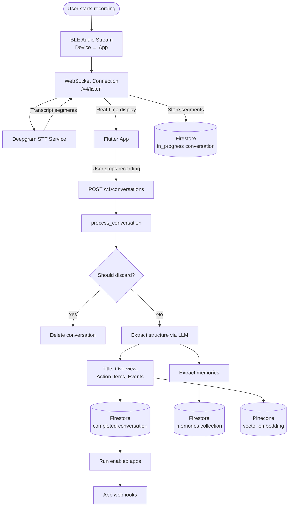
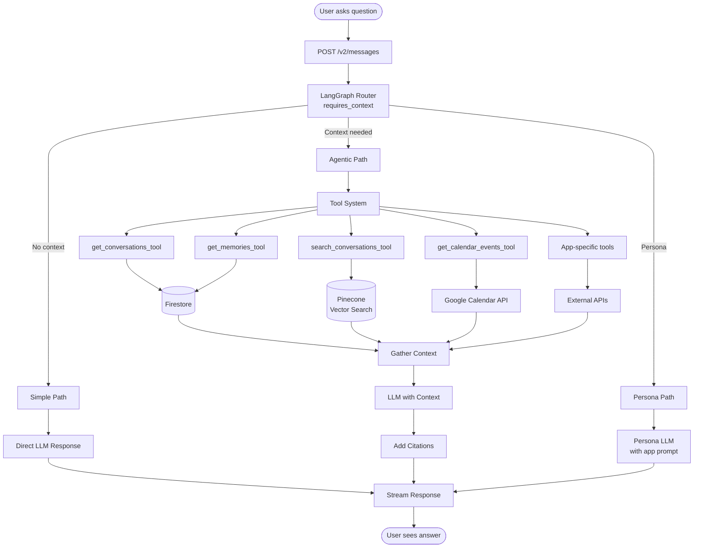
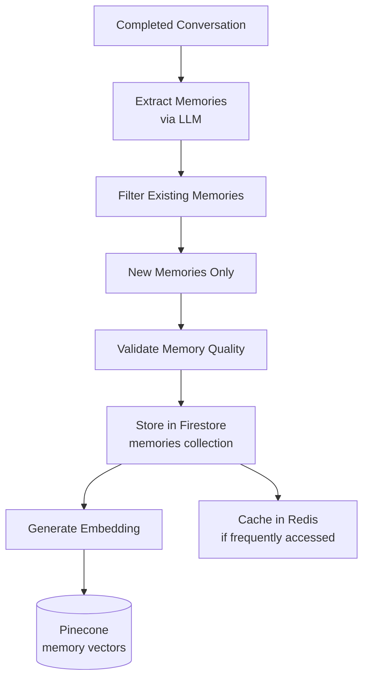
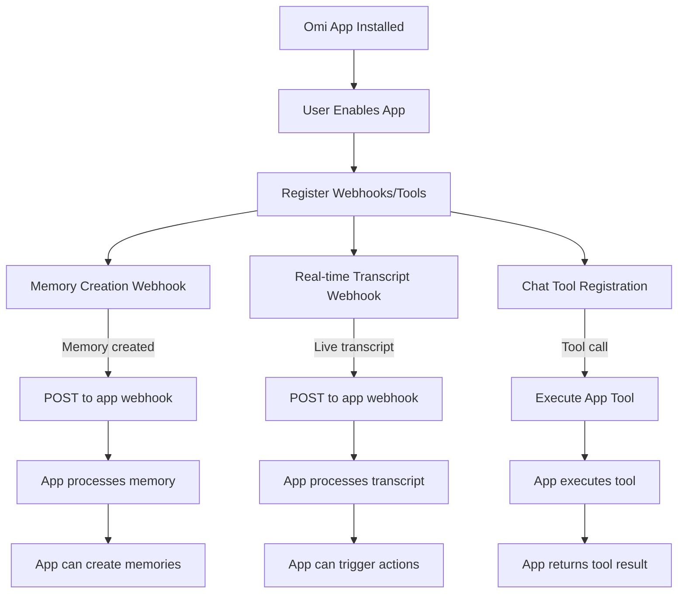
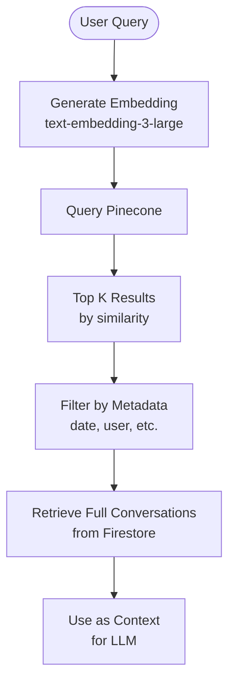
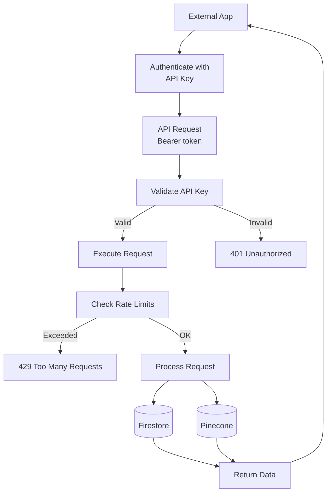

# Omi Data Flow Documentation

This document describes the data flows for key workflows in the Omi system.

## 1. Conversation Recording & Processing Flow

### Overview
When a user records a conversation, audio flows from the device through the app to the backend, where it's transcribed, processed, and stored.

### Detailed Steps

1. **Recording Initiation**
   - User starts recording in Flutter app
   - App connects to device via BLE
   - Audio stream begins

2. **WebSocket Connection**
   - App establishes WebSocket to `/v4/listen`
   - Backend creates "in_progress" conversation in Firestore
   - Audio chunks streamed continuously

3. **Real-time Transcription**
   - Backend forwards audio to Deepgram
   - Transcript segments returned in real-time
   - Segments displayed in app UI
   - Segments stored in Firestore as they arrive

4. **Recording Completion**
   - User stops recording
   - App sends `POST /v1/conversations` with empty body
   - Backend retrieves in-progress conversation

5. **Conversation Processing**
   - `process_conversation()` function called
   - LLM determines if conversation should be discarded
   - If kept, LLM extracts:
     - Title and overview
     - Action items
     - Calendar events
     - Memories (facts about user)

6. **Storage**
   - Conversation stored in Firestore with status "completed"
   - Vector embedding generated and stored in Pinecone
   - Memories stored in separate Firestore collection
   - Action items stored in action_items collection

7. **App Processing**
   - Enabled apps run on conversation data
   - Webhooks triggered for memory creation
   - Real-time transcript webhooks (if configured)

## 2. Chat Query Flow

### Overview
When a user asks a question in chat, the system routes it through LangGraph to determine if context is needed, then retrieves relevant information and generates a response.

### Detailed Steps

1. **Question Classification**
   - User sends message via `POST /v2/messages`
   - `requires_context()` function analyzes question
   - Routes to one of three paths:
     - **Simple**: General questions, greetings
     - **Agentic**: Questions needing user data
     - **Persona**: Questions for persona apps

2. **Simple Path**
   - Direct LLM call with system prompt
   - No tool calls needed
   - Fast response

3. **Agentic Path**
   - LangGraph ReAct agent activated
   - LLM decides which tools to call
   - Available tools (30+ core tools + dynamic app tools):
     - Conversation retrieval (date range, search)
     - Memory retrieval and search
     - Action item management (get, create, update)
     - Calendar operations (get, create, update, delete)
     - Health tools (Apple Health, Whoop)
     - Integration tools (Gmail, GitHub, Notion, Twitter, Perplexity)
     - File search
     - Notification settings
     - App-specific dynamic tools

4. **Tool Execution**
   - Tools execute in parallel when possible
   - Results gathered into context
   - Vector search in Pinecone for semantic similarity
   - Firestore queries for structured data

5. **Response Generation**
   - LLM receives question + context
   - Generates answer with citations
   - Citations link to source conversations `[1][2]`
   - Response streamed back to app

6. **Persona Path**
   - Uses app's configured `persona_prompt`
   - May have limited tool access
   - Character-consistent responses

## 3. Memory Extraction Flow

### Overview
Memories are extracted from conversations and stored separately for quick access.

### Memory Categories

- **Personal**: Facts about the user
- **Health**: Health-related information
- **Work**: Work-related facts
- **Relationships**: Information about people
- **Preferences**: User preferences and likes

## 4. App/Plugin Integration Flow

### Overview
Apps can integrate with Omi through webhooks, chat tools, and prompts.

### Integration Types

1. **Memory Triggers**
   - Webhook called when memory created
   - App can process and react to new memories
   - Example: Post to Slack when memory created

2. **Real-time Transcript**
   - Webhook receives transcript segments as they arrive
   - App can process live audio data
   - Example: Trigger smart home actions

3. **Chat Tools**
   - App defines custom tools for LangGraph
   - Tools available when app enabled
   - Example: "Create GitHub issue" tool

4. **Prompt-based Apps**
   - No server required
   - Customize chat or memory extraction prompts
   - Example: Fitness coach persona

## 5. Vector Search Flow

### Overview
Semantic search uses vector embeddings to find relevant conversations.

### Vector Search Parameters

- **Top K**: Number of results (typically 5-10)
- **Similarity Threshold**: Minimum similarity score
- **Metadata Filters**: Date range, user ID, etc.
- **Namespace**: Separate namespaces per user

## 6. Developer API Flow

### Overview
External applications can access Omi data via the Developer API.

### API Key Management

- Keys generated in Omi app (Settings → Developer)
- Keys prefixed with `omi_dev_`
- Rate limits: 100/min, 10,000/day
- Keys can be revoked at any time

## Related Documentation

- Architecture: `.cursor/ARCHITECTURE.md`
- API Reference: `.cursor/API_REFERENCE.md`
- Backend Components: `.cursor/BACKEND_COMPONENTS.md`
- Chat System: `docs/doc/developer/backend/chat_system.mdx`
- Storing Conversations: `docs/doc/developer/backend/StoringConversations.mdx`
