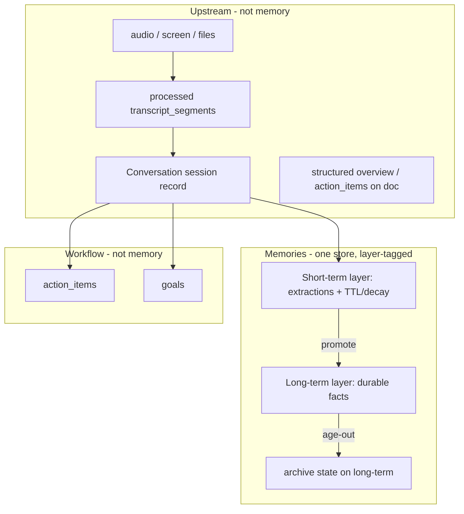

# Canonical Memory Domain Model + Seamless Rollout

> This plan supersedes the V17-gate-centric sweep template. We are not shipping "legacy vs V17"
> as a permanent state — we are collapsing both into **one canonical memory system** with clean
> layers and product-facing language, rolled out per-user and reversibly.

---

## ✅ VERIFIED CURRENT STATE — status reconciliation (2026-06-26, evidence-grounded)

> Independent re-verification of every WS claim against `git log`/`git show`/`rg`, per repo
> AGENTS.md (no trust without evidence). **Authoritative current summary — read this first.**
> The older §11/§11b audit logs below are preserved verbatim as history; where they disagree
> with this section, **this section is correct.**

### ⚠️ Branch reality (critical — the #1 thing to know)

**All rollout work lives on branch `memory-canonical-rollout` @ `e2cb8f508` (worktree
`/Users/dazheng/workspace/omi-memory-rollout`), committed locally only — nothing pushed/merged to `main`.**
This plan file's own worktree (`omi-memory-ingestion-pipeline`) is on branch
`codex/memory-ingestion-pipeline` @ `07967447d`, which is the **base** of the rollout branch and
**does NOT contain any of the work** — `rg -il v17 backend/` here still returns **280 files**.
So the "FULLY COMPLETE" state is real *on the rollout branch*, not on the branch where this doc sits.
Verified: `git merge-base --is-ancestor 07967447d e2cb8f508` → yes (HEAD is the rollout base).

### Workstream status (claimed → verified → evidence, checked on `memory-canonical-rollout`)

| WS | Claimed | **Verified** | Evidence |
|----|---------|--------------|----------|
| WS-A vocab/domain model | done | **DONE** | `models/memory_domain.py`; commit `d7ed5e948` exists |
| WS-E cohort router + seam | in_progress | **DONE (core); tail DEFERRED** | `memory_system.py`+`memory_service.py` present; `27187aeb3`; Wave 12 whitelist kill-switch `MEMORY_CANONICAL_USERS` (in `.env.template`). Operational tail (reverse-migration drill, observability) needs live cohort |
| WS-I write+read convergence | in_progress | **PARTIAL** | Extraction seam converged (process_conversation → memory_items). VERIFIED 2026-06-25 @ f8e44bfd2: GET /v3/memories reads canonical; POST /v3/memories still writes legacy (memories.py:187). Desktop Focus/manual/import paths bypass seam. WS-L routed reads/search/MCP-delete only — not creates. See WS-I.2 todos. |
| WS-B short-term lifecycle | done | **DONE** | `2804732c6`; promotion via audited apply path; maintenance cron exists, env-gated — **OPS/VERIFY** prod wiring |
| WS-C legacy→canonical backfill | pending | **DONE (non-destructive, library-only)** | `02c330045`; carry-forwards before real migration (below) |
| WS-D upstream boundary | done | **DONE** | docs + boundary-lock test; `562f250b8` |
| WS-J vectors + delete matrix | pending | **DONE; Q8 cascade NOT flipped** | `4b19a632e`; neutral `mem_*`/`memvec` vector ids; owner KEPT `cascade=False` |
| WS-L surface routing | pending | **DONE** | `1d9c05e91`; MCP/SSE/chat/dev/integration/persona via seam + cohort pinning |
| WS-G v17 naming retirement | pending | **DONE (language retirement)** | `rg -i v17` = **0** in `backend/`, `scripts/`, `firestore.rules`, `charts/`; `/memory/*` routes (`memory_product.py`); `V17_*`→`MEMORY_*`; 0 `v17_*` code modules; L2 modules neutral (`l2_promotion_*`) |
| WS-K client parity | pending | **PARTIAL** | backend additive `layer` field DONE (`577935342`); desktop badge built+committed (`79a0b81a5`,`3f4613901`,`cdcfe23c1`). **Flutter + conversation-delete cascade client fix DEFERRED** (`docs/memory/ws_k_client_parity.md`, needs-local-build) |
| WS-F new UI | pending | **PARTIAL** | desktop badge + popover done; broader UI/onboarding + Flutter deferred |
| WS-M atom keyword index | pending | **DONE (prod-inert)** | `utils/memory/atom_keyword_index.py`; Wave 13 |
| WS-N GraphRAG traversal | pending | **DONE (bounded read-only)** | `utils/memory/kg_graph_traversal.py` + `retrieval/tools/graph_tools.py`; Wave 14 (built over **Firestore KG, no live Neo4j**) |
| WS-O smart consolidation + KG write | pending | **P0 DONE locally; tail gaps remain** | O-W0–O-W5+O-W7 **DONE** on `memory-canonical-rollout` (local commits, not pushed): `canonical_consolidation.py`, batched LLM agent before promotion, KG write/invalidate, corroboration fields + backfill, entity triple **fields**, cross-source merge (agent contract), env-gated fast-track (`MEMORY_CANONICAL_PROMOTION_FAST_TRACK_ENABLED`, `user_asserted` only). **ACTIONABLE-CODE:** `subject_entity_id` extraction wiring, O-W6 partial legacy-stack removal, `review_queue` cascade/purge. **OPS/VERIFY:** prod cron, real-pass consolidation, LLM tuning, Firestore+Pinecone E2E. See **WS-O** status table. |
| WS-H legacy decommission | pending | **NOT DONE — DEFERRED by design** | legacy `database/memories.py` + `short_term_memories.py` still present; gated on full verified migration |
| current-map / inventory-doc | pending | **NOT DONE** | `docs/memory/current_state_map.md` was never generated |

### Discrepancies / things to flag (plan said X, reality is Y)

1. **Plan doc on wrong branch (above).** This worktree's branch has none of the work; still 280 v17 files.
2. **Imprecise hash→outcome labels** in the §11b "FULLY COMPLETE" block: the anchor hashes exist, but
   some don't match the outcome attributed to them (e.g. `b34588819` is labeled "removed `/v17` routes"
   but its actual subject is a *test-retarget* commit). The **outcomes are independently verified via `rg`**
   (0 `/v17`, 0 `V17_`, `/memory/*` live), so substance holds — only the per-hash captions are loose.
3. **Q8 cascade contradiction:** §10/§5 ratified "server-default `cascade=true` + fix clients", but the
   later owner decision (§11b "Owner decisions 2026-06-23" #2) **KEPT `cascade=False`** (revisit later).
   Treat `cascade=False` as the current decision; §10 Q8 ratification is superseded.
4. **WS-N Neo4j wording:** plan §WS-N specs Neo4j; the shipped tool reads the **Firestore** KG (no live
   Neo4j in this repo). Acknowledged in Wave 15; plan body text is partly stale.
5. **NOT independently re-verified by me:** the "`test.sh` green except libopus/fakeredis" claim — I did
   not re-run the full suite (heavy/env-gated). Per-wave `pytest` counts are taken from the audit log as
   reported, not re-executed. The L2-WIP entanglement noted in older §11b is **resolved** (L2 modules are
   now tracked/committed; rollout working tree is clean — verified `git status` empty).

### 🔭 Consolidated remaining / carry-forward (the open list)

- **Single-user go-live surface (owner-confirmed 2026-06-26):** whitelisted user needs canonical-correct
  REST `/v3/memories`, desktop, **agentic chat memory tools**, **conversation merge + cascade delete**,
  **manual KG rebuild + KG visibility**, **extraction-prompt context**, and account delete/purge — not
  REST+desktop only. See §5 blocker checklist (13 items, all PENDING FIX). Non-whitelisted isolation
  re-confirmed clean by review sweep.
- **WS-H decommission** — deferred; gated on full verified base migration (legacy stores intentionally retained).
- **Client runtime parity** — desktop conversation-delete `cascade` fix + Flutter `layer`/cascade are
  **documented only** (`docs/memory/ws_k_client_parity.md`); need a local build to land/verify (rules forbid shipping unverified client changes).
- **WS-E operational tail** — reverse-migration drill (`canonical→legacy`) + rollout observability
  (cohort counts, split-brain alarm, vector-orphan counter, parity-divergence canary): need a live canonical cohort.
- **WS-C before any real migration** — both-store dedup overlap check, admin CLI/runbook,
  cohort-flip-after-`verified=True` gate, provenance fidelity (category/user_asserted/visibility/created_at).
- **WS-O smart consolidation + KG write** — P0 **DONE** locally (`memory-canonical-rollout`, unit-tested): consolidation before promotion, KG write/invalidate, corroboration schema, agent merge/corroborate. **Remaining:** `subject_entity_id` extraction wiring (ACTIONABLE-CODE), O-W6 legacy-stack cleanup partial (ACTIONABLE-CODE), `review_queue` cascade/purge (ACTIONABLE-CODE), prod cron + E2E + LLM tuning (OPS/VERIFY). See WS-O gaps table.
- **WS-J residual** — `review_queue` cascade purge gap flagged during WS-O wiring (ACTIONABLE-CODE); legacy `v17mem:`/`memvec` vectors not
  enumerated on account-delete (canonical cohort empty today). KG selective invalidation **DONE** in WS-O O-W2.
- **Cohort pinning** — some internal gates (`canonical_memory_adapter`, `short_term_promotion` cron) still
  re-resolve per-call (fine while cohort static; wire before live flips).
- **⚠️ OWNER ACTION — cloud-resource renames (out of repo, not code):** Secret Manager
  (`v17-v3-get-...`/`v17-vector-repair-*` → `memory-*`), Cloud Run + Cloud Tasks queue/DLQ/SA
  (`v17-vector-repair-outbox-worker` → `memory-vector-repair-outbox-worker`), worker route, image-digest env,
  GCP projects (`omi-v17-dev`/`omi-v17-evidence-nonprod` → `omi-memory-*`), Firebase emulator project
  (`demo-v17-memory` → `demo-memory`). Code/contracts already renamed self-consistently; these only matter if/when provisioned.
- **Test-isolation (pre-existing):** strict filename-alpha collection ordering still needs WS-I heavy-import
  stubs preinstalled; the curated/`test.sh` ordering is green. Not a product regression.
- **Generate `docs/memory/current_state_map.md`** from §9 (never produced).
- **Nothing pushed/merged to `main`** — all local on `memory-canonical-rollout`.

### WS-I.2 — Write-convergence completion — ✅ product paths (2026-06-25, `feature/ws-i2-write-convergence`)

**Acceptance criterion:** for canonical-cohort users, **zero** live **product** code path calls
`memories_db.create_memory` / `save_memories` / `review_memory`; all writes land in `memory_items` with
server-authoritative `layer`. Regression guard test green. Legacy cohort byte-identical.

**Done:** metadata persistence (visibility/manual/tags/category), MCP canonical PATCH validation, review + preference_tools routing, async `run_blocking` for canonical creates, server re-read on batch/dev/MCP creates, strengthened guard (`preference_tools`, review, consolidation allowlist). **44 tests passed.**

**Deferred (consolidation wave):** `worker.py` `refine_memory` / `merge_contradict_memory` + `retrieve_candidates` legacy reads — allowlisted in guard. **Excluded:** `scripts/rag/memories.py` (offline).

---

## 0. Goals & non-negotiables

### Architecture invariant — single store / write convergence (platonic ideal)

- **One canonical store (`memory_items`).** Every writer — conversation extraction, POST `/v3/memories`,
  desktop Focus/screen-context, manual notes, integrations, MCP, dev API, all devices — routes through
  `MemoryService` for canonical-cohort users. No writer bypasses the seam.
- **Server owns lifecycle** (tier/layer, promotion, visibility). API contract ALWAYS includes `layer`
  for canonical memories.
- **Clients are projections** — eliminate `tierIsExplicit`; missing server tier is a server bug, not
  client state.
- **Source/surface** (`source`, `source_app`, `window_title`) is provenance metadata on one uniform
  memory object — must not fork storage path or lifecycle.

1. **One canonical system.** "Legacy" is a transient rollout state with a scheduled end, not a
   parallel architecture we maintain forever.
2. **Three clean layers, sharp boundaries:**
   `Raw inputs → Short-term (Layer 1) → Long-term (Layer 2) → Archive`.
   Raw inputs are **never** called "memory". Short-term and Long-term live **together in Memories**,
   distinguished by a **layer/tier field** on each record — not separate top-level stores.
3. **Conversations stay separate from Memories.** Do **not** merge Conversations and Short-term.
   Conversations are upstream session records; Memories are extracted facts with lifecycle.
4. **Workflow stays separate.** Action items (`action_items`) and goals (`goals`) remain first-class
   workflow domains — downstream of extraction, parallel to Memories, not inside them.
5. **Domain language, not engineering jargon.** Kill `V17`, `layer1/layer2`, `L1/L2` from product
   surfaces and (in phases) from code. Fold in all prior memory pipeline eras (§1.1). The vocabulary
   is **Short-term** and **Long-term memory**. No `v17` in production code paths after WS-H.
6. **Seamless, reversible, per-user rollout.** Existing users on the old system experience **zero**
   change. Opted-in users get the Short-term/Long-term experience. A user can be moved back.
7. **No split-brain.** A user reads and writes through exactly one system at a time; the routing
   decision is server-owned and explicit (never an implicit `None → legacy` fallback).

**Transitional reality (codebase today):** reads may already compose V17 projection while writes still
land in legacy `memories` (+ shadow `short_term`). Treat tri-store (`memories`, `short_term`,
`memory_items`) as an **interim state** until WS-I converges extraction/writes. Do not expand canonical
cohort until write path matches read path for that user.

---

## 1. Canonical domain model



**Definitions (the glossary the whole codebase converges on):**

| Term | Means | Lifecycle | Default-visible? |
|------|-------|-----------|------------------|
| **Conversation** | Persisted **session record** at `users/{uid}/conversations`: processed `transcript_segments`, session metadata (`structured`, `apps_results`), audio/photo linkage. Upstream of memory. | `in_progress` → `processing` → `completed`; user can delete whole session | N/A — Conversations tab, not Memories |
| **Capture session** | Ephemeral listen/recording window (WebSocket lifetime). For voice paths, **1:1 with a Conversation** stub created at listen start. Use this term when distinguishing runtime capture from the persisted record. | Ends when recording stops | N/A |
| **Raw input** | True source capture: audio in GCS, screenshots/files. Conversation docs hold **processed** transcripts (STT, diarization, speaker attribution) — not pristine raw audio/text. | Retained per recording/privacy policy | N/A — never surfaced as "memory" |
| **Short-term memory** (Layer 1) | Structured extractions in **Memories**, tagged `layer=short_term`. Observations tied to a source (usually a Conversation via `evidence[].source_id`). | Born on extraction; **TTL/decay**; **promoted** to Long-term or expires | Yes |
| **Long-term memory** (Layer 2) | Durable facts in **Memories**, tagged `layer=long_term` (e.g. "Name is David Zhang", "Based in Seattle"). | Promotion/consolidation or direct user assertion; may **age to Archive** | Yes |
| **Archive** | Aged-out long-term (`layer=archive` or terminal state); kept for recall but not shown by default. | Terminal unless explicitly resurfaced | No (explicit opt-in only) |
| **Workflow** | Action items and goals — task state, due dates, integrations, progress. **Not** memory layers. | Task: pending → done; Goal: active → ended | Yes (dedicated UX) |

**Session vs Conversation (do not conflate):**

| | **Conversation** | **Session** (informal) |
|---|---|---|
| **Exists in code?** | Yes — `Conversation` model, Firestore collection, API, UI | No persisted memory-domain type; overloaded elsewhere (`ChatSession`, auth session, focus session) |
| **Role** | Concrete session record for transcript/audio capture | Abstract provenance boundary or ephemeral capture window |
| **Relationship** | For voice/listen: capture session creates → Conversation doc | Memory extractions cite Conversation as `source_id` |
| **Merge with Memories?** | **No** — stays upstream | N/A |

**Unrelated "session" domains (do not conflate with Conversation):** `ChatSession` (AI chat),
`StoredFocusSession` (desktop focus/screen), auth/checkout/MCP protocol sessions.

**"Archive" is overloaded — disambiguate (three distinct meanings):**

| Use of "archive" | Means | Canonical handling |
|------------------|-------|--------------------|
| **`layer=archive`** | Aged-out long-term memory, kept for recall, hidden by default | The **only** product meaning of "archive" |
| `L1MemoryArchiveItem` / working-memory "archive" | A **processing-pipeline** extraction artifact (`working_memory.py`) | Internal only; rename per §1.1; **not** the product Archive layer |
| Audio / conversation retention "archive" | Raw-input storage/retention policy | Upstream (not memory); never `layer=archive` |

**Boundary rules:**
- **Memories** is one store; **layer** (`short_term` / `long_term` / `archive`) is a field on each
  record. Layer drives lifecycle, TTL, promotion, and UI badges — not which collection you query.
- **Conversations** are never Memories. No merge of Conversations tab into Memories.
- **Promotion** is an explicit Short-term → Long-term **layer transition** within Memories — audited,
  not a silent flag flip. **Tier plumbing (WS-B, ratified Q3):** batch-or-daily mechanical flip
  (`short_term_promotion.py`, threshold ≥25 OR ≥24h). **Consolidation intelligence (WS-O):**
  corroboration, contradiction resolution, cross-source dedup, and optional signal-based fast-track —
  separate from the mechanical scheduler.
- Non-durable / rejected extractions stay Short-term or are pruned; they never reach Long-term.
- **Workflow** (`action_items`, `goals`) is extracted from the same seam as Memories but stored
  separately. Long-term may absorb a *fact about* a commitment; the task/goal row stays in workflow.
- Conversation delete cascades to evidence tombstoning on linked Short-term items (`tombstone_source`).

**Old → new term map (authoritative; drives the naming sweep, WS-G):**

| Old / internal | Canonical |
|----------------|-----------|
| `layer 1`, `L1`, "extracted conversation" | **Short-term memory** (`layer=short_term`) |
| `layer 2`, `L2`, durable `memories` rows | **Long-term memory** (`layer=long_term`) |
| `V17`, "new memory system" | (drop the codename) the canonical system |
| `memory_items` + `short_term` + legacy `memories` | **One Memories store** with layer field (canonical cohort) |
| bare "session" in memory docs | **Conversation** (persisted) or **capture session** (ephemeral) |
| `action_items`, `goals` | **Workflow** — unchanged collections |

### 1.1 Prior memory pipeline eras — fold in and retire terminology

The migration must absorb **all prior memory systems and naming schemes**, not only the `v17`
codename. After WS-H, **`v17` must not appear in production code paths** (git history and archived
docs excepted). Benchmark-repo version labels (v10–v15) stay in `omi-ingestion-benchmark` only.

#### Production systems → canonical mapping

| Era | What it is | Key identifiers today | Canonical mapping | Disposition |
|-----|------------|----------------------|-------------------|-------------|
| **Legacy flat memories** | Original production store + extractor | `users/{uid}/memories`, `MemoryDB`, `new_memories_extractor`, `/v3/memories` | **Long-term** in unified Memories (`layer=long_term`) | **Migrate** → **Retire** store WS-H |
| **Legacy categories** | Old taxonomy on legacy rows | `core`, `hobbies`, `lifestyle`, `work`, `skills`, `learnings`, … | **Keep** as `category` metadata; UI filters use primary four (`interesting`, `system`, `manual`, `workflow`) | **Keep** (not layers) |
| **Shadow short_term** | Interim shadow write path | `users/{uid}/short_term`, `OMI_MEMORY_SHORT_TERM_SHADOW_ENABLED` | **Short-term** in unified Memories (`layer=short_term`) | **Fold** → **Retire** collection WS-H |
| **V17 product memory** | Tiered store + ledger | `memory_items`, `MemoryTier`, `memory_commits`, `v17_*` modules | **Canonical Memories store** | **Rename** modules WS-G; store becomes canonical |
| **V17 rollout modes** | Gradual rollout control | `off` / `shadow` / `write` / `read`, `V17_MODE`, `V17_MEMORY_ENABLED_USERS`, `memory_control/state` | **`MemorySystem`** + `resolve_memory_system(uid)` | **Collapse** WS-E |
| **`tier` product field** | V17 item field | `short_term` / `long_term` / `archive` on `memory_items` | **`layer`** (same semantics) | **Rename** API + clients WS-G |
| **`memory_reads.py`** | Merges legacy + shadow for reads | split-brain reader shim | Single Memories query by `layer` | **Retire** WS-H |

Normative reference (locked 2026-06-18): [`docs/epics/v17_memory_normative_architecture.md`](docs/epics/v17_memory_normative_architecture.md)
— product tiers are exactly `short_term`, `long_term`, `archive`; `context_only` is **not** a tier.

#### Internal pipeline jargon (do not expose as product language)

V17 introduced **L1/L2 as processing stages** — **not** the same as product Short-term/Long-term.
This is the highest-confusion overlap; WS-G must rename internal symbols without changing behavior.

| Internal term (retire in product/docs) | Code locations | Means | Canonical term |
|----------------------------------------|----------------|-------|----------------|
| **L1**, `L1MemoryArchiveItem`, `WorkingMemoryObservation` | `working_memory.py`, `v17_memory_contracts.py` | Working-memory / archive extraction candidates | **Working observation** or **short-term candidate** |
| **L2**, `L2MemoryRoute`, `durable_memory_patch*` | `l2_memory_routes.py`, `durable_memory_patches.py` | Durable synthesis / promotion routing | **Promotion proposal** / **consolidation route** |
| **`LifecycleState.working`** | `v17_memory_contracts.py` | In-flight extraction state | Internal only; not a product layer |
| **`context_only`** | projections, route hints | Processing outcome | **Not a tier** — normalize to **Archive** or non-default outcome per normative arch |
| **`processing_state`** | `pending` / `processed` / `blocked` | Item processing pipeline | **Keep** internal; separate from `layer` |
| **`status`** | `active` / `superseded` / `tombstoned` | Record lifecycle | **Keep**; distinct from `layer` |

#### Parallel extraction / benchmark (do not become product stores)

| System | Location | Relationship |
|--------|----------|--------------|
| **`memory_ingestion` pipeline** | `backend/utils/memory_ingestion/` | Benchmark-oriented extraction (`WorkingMemoryCandidate`, `working_memory_candidate.v1`). Align `source_type`; not a separate product store |
| **Benchmark v10–v15** | `omi-ingestion-benchmark` repo | Memory cards, L1 spike, L2 evidence packaging. Feeds `durable_memory_patches` via drift guard. **Benchmark-only** — never leak `v13`/`v14` into production domain |

#### Adjacent domains (not memory layers)

| System | Store / module | Disposition |
|--------|----------------|-------------|
| **Conversations** | `users/{uid}/conversations` | Upstream session records (§1) |
| **Action items / goals** | `action_items`, `goals` | Workflow — unchanged |
| **Knowledge graph** | Neo4j / `knowledge_graph.py` | Derived from long-term facts; invalidation on delete/reprocess (WS-J) |
| **Trends** | `trends_db` | Separate derived index from conversations |
| **Legacy conversation shims** | `plugins_results`, `processing_memory_id` | Mirrored from `apps_results` / `processing_conversation_id`; **retire** when old clients age out |

#### API surface consolidation

| API today | Role | After migration |
|-----------|------|-----------------|
| `/v3/memories` | Primary legacy REST | **Keep** route shape for parity; dispatch via `MemoryService` |
| `/v17/memory/search`, `/vector/search`, `/archive/search` | V17-specific reads | **Fold** into canonical memory API; drop `v17` path prefix |
| `/v1/mcp/memories`, `/v1/tools/memories` | Surface adapters | Route through seam (WS-L) |

No active `/v1` or `/v2` memories REST API — `/v3` is the legacy product surface.

#### Prior terminology retirement table (authoritative; extends §1 term map)

| Retire | Replace with | WS |
|--------|--------------|-----|
| `V17`, `v17_*` modules, `v17mem:` vector prefix (stored IDs — migrate per §10 Q5) | `memory` / `canonical_memory` / neutral vector IDs | WS-G, WS-J |
| `tier` (product field on items) | `layer` | WS-G, WS-F |
| `L1`, `L2`, `layer1`, `layer2` in **product/UI** context | **Short-term** / **Long-term** / **promotion** | WS-G, WS-F |
| `L1MemoryArchiveItem`, `WorkingMemoryObservation` in **docs/comments** | working observation / short-term candidate | WS-G |
| `durable_memory_patch`, `L2MemoryRoute` in **docs/comments** | promotion proposal / consolidation route | WS-G |
| `context_only` as a user-visible tier | Archive or internal processing outcome only | WS-B, WS-G |
| V17 rollout `off` / `shadow` / `write` / `read` | `MemorySystem = { legacy, canonical }` + cohort record | WS-E |
| `memory_items` collection name (optional) | `memories` or neutral canonical name (decide in WS-G) | WS-G |
| `plugins_results`, `processing_memory_id` | Already mirrored — document sunset timeline | WS-D |
| Legacy `category` values (`core`, `hobbies`, …) | Keep in DB; map to primary four in UI filters | WS-F |

#### Frozen legacy names (do NOT rename — external contract; sweep agents must skip)

These read like memory-domain terms but are **fossils from when "memory" meant "conversation"** or are
externally-observable API strings. WS-G must **not** "correct" them toward the canonical vocabulary.

| Frozen name | Where | What it actually is | Action |
|-------------|-------|---------------------|--------|
| `WebhookType.memory_created` (+ payload `conversation_to_dict`) | `utils/webhooks.py`, developer webhook config | Developer-facing webhook that fires on **Conversation** creation, ships a Conversation payload | **Keep string**; document as legacy alias of "conversation created"; deprecation path only via versioned webhook, never an in-place rename |
| `UsageHistoryType.memory_created_external_integration` | `utils/app_integrations.py` | Usage/billing event keyed off Conversation creation | **Keep string**; freeze for analytics/billing continuity (§ WS-G analytics rule) |
| `plugins_results`, `processing_memory_id` | conversation docs | Mirror of `apps_results` / `processing_conversation_id` | **Keep**; sunset only when old clients age out (WS-D) |

### 1.2 Canonical Memories record schema (normative — ratify in WS-A)

The single record shape every canonical-cohort store/client converges on. Lives in
`docs/memory/domain_model.md`; WS-A lands it as `models/memory_domain.py` + Swift mirror.

| Field | Type | Meaning | Notes |
|-------|------|---------|-------|
| `id` | string | Stable record id | Neutral scheme (no `v17mem:`); see §10 Q5 |
| `content` | string | The fact/observation text | — |
| `layer` | `short_term` \| `long_term` \| `archive` | **Product lifecycle layer**; drives UI badge, default visibility, TTL | The only axis users/clients see |
| `status` | `active` \| `superseded` \| `tombstoned` | **Record lifecycle**; non-`active` excluded from normal reads | Distinct from `layer` |
| `processing_state` | `pending` \| `processed` \| `blocked` | **Internal pipeline** state | Never surfaced to clients |
| `category` | legacy taxonomy value | Metadata only (`core`/`hobbies`/… → primary four in UI) | **Not** a layer |
| `evidence[]` | array of `{ source_type, source_id, … }` | Provenance; for voice paths `source_id` = Conversation id | Drives cascade/tombstone on Conversation delete |
| `source_id` | string | Primary upstream source (usually a Conversation) | Indexed for cascade |
| `promotion` | `{ from_layer, to_layer, reason, at, by }` \| null | **Audit record** of Short→Long transitions | Promotion is never a silent flag flip |
| `ttl` / `expires_at` | timestamp \| null | Short-term decay deadline | Null for long-term/archive |
| `created_at` / `updated_at` | timestamp | — | — |

`LifecycleState.working` is an **in-flight extraction state**, not a stored field on this record — it
exists only inside the extraction pipeline and resolves to a `layer` before the record is durable.

### 1.3 Legal state-combination matrix (normative — ratify in WS-A)

The four state axes are orthogonal but **not** freely combinable. Only these combinations are legal;
anything else is a bug a validator should reject.

| `layer` | legal `status` | legal `processing_state` | Default-visible read? |
|---------|----------------|--------------------------|------------------------|
| `short_term` | `active`, `superseded`, `tombstoned` | `pending`, `processed`, `blocked` | `active` + `processed` only |
| `long_term` | `active`, `superseded`, `tombstoned` | `processed` (must be settled before promotion) | `active` + `processed` only |
| `archive` | `active`, `tombstoned` | `processed` | **No** — explicit opt-in only |

Rules:
- **Promotion requires `processing_state=processed`** — a `pending`/`blocked` item never reaches `long_term`.
- `archive` items are **never `superseded`** (terminal) — they tombstone or are resurfaced.
- `status=tombstoned` overrides visibility at **every** layer (hard-excluded from default reads).
- `context_only` is **not** a value on any axis — normalize to `layer=archive` or a non-default outcome (§1.1).
- A read surface requesting `layer=archive` (§10 Q9) still honors `status` filtering.

---

## 2. Current-state map (where the model lives today)

The repo currently has **overlapping representations** across legacy split stores, V17 ledger, and
mid-investigation tier plumbing. This is the split-brain we are collapsing.

| Today | What it is | Canonical layer | Disposition |
|-------|-----------|-----------------|-------------|
| `users/{uid}/conversations` (`database/conversations.py`) | **Session record**: processed `transcript_segments` + derived `structured` / `apps_results` | **Upstream** (not memory) | Keep; never merge into Memories |
| `users/{uid}/short_term` (`database/short_term_memories.py`, `ShortTermMemory`) | Shadow short-term extractions (gated by `OMI_MEMORY_SHORT_TERM_SHADOW_ENABLED`) | **Short-term** in Memories | **Fold into unified Memories store** (`layer=short_term`); retire separate collection at decommission |
| `users/{uid}/memories` (`database/memories.py`, `MemoryDB`) | Legacy durable memories | **Long-term** in Memories | Legacy cohort store; backfill to unified Memories at migration (`layer=long_term`) |
| `users/{uid}/memory_items` + ledger/projection (`database/v17_collections.py`, `v17_*`) | V17 store with tier on items | **Memories** (short + long + archive) | **Canonical Memories store** for new cohort; shed `v17` name |
| `users/{uid}/action_items` (`database/action_items.py`) | Tasks/todos with completion, due dates, integrations | **Workflow** | Keep; downstream of extraction, not in Memories |
| `users/{uid}/goals` (`database/goals.py`) | User-declared objectives + progress | **Workflow** | Keep; reads Memories for advice, does not live inside Memories |
| `MemoryDB.memory_tier` on legacy `memories` | Per-record tier on legacy flat store | — | **Retire on legacy cohort** — all legacy rows are Long-term by definition (§8) |
| `V17_MODE` / `V17_MEMORY_ENABLED_USERS` / `memory_control/state` / gates | V17 rollout control sprawl | — | **Collapse into one `MemorySystem` cohort** (§3) |
| Desktop `ServerMemory.tier` / `tierIsExplicit` / `MemoryTierBadge` | Layer display + legacy-no-badge | — | Keep; `tier` → `layer`; badge only for canonical-cohort items |

**Inventory:** see **§9** for the full touchpoint inventory (~165 code files with `v17|memory_items`;
~280 including docs/readiness scripts). Generate and maintain `docs/memory/current_state_map.md`
from §9 as implementation starts.

---

## 3. The cohort switch — one flag, two experiences

Replace the V17 control sprawl with a **single server-owned, per-user, reversible** selector and a
**single routing seam** that *every* memory read and write passes through.

```
MemorySystem = { legacy, canonical }      # per-user, server-owned, reversible
```

- **Resolution:** `resolve_memory_system(uid) -> MemorySystem`. **Precedence:** `MEMORY_CANONICAL_USERS`
  env whitelist is the sole source of canonical cohort membership; absence from the whitelist →
  `legacy` (explicit default, no implicit None). Stale `memory_control/state.memory_system=canonical`
  does not override whitelist removal — empty whitelist = global kill-switch (everyone legacy).
- **Routing seam:** introduce `MemoryService` (read/write/search/delete) as the ONLY entry point
  used by routers/adapters. It dispatches to `LegacyMemoryBackend` or `CanonicalMemoryBackend`
  based on `resolve_memory_system(uid)`. Every router in §2 calls the seam, not stores directly.
- **Reversibility:** moving `canonical → legacy` is a routing change, not data loss; canonical data
  is retained. Moving `legacy → canonical` triggers backfill (WS-C). Both directions are drills.
- **Seamlessness contract:** for `legacy` users, the seam must produce **behavioral parity with
  today's legacy paths** — locked by golden tests (`/v3/memories`, chat retrieval, MCP). Note:
  V17-composed GET responses add headers/cursors; parity means **legacy cohort sees legacy shapes**,
  not byte-identical payloads across V17 adapter code paths.

This is the heart of "existing users feel nothing": the new code paths exist behind the seam and
are inert for the legacy cohort.

---

## 4. Workstreams (each independently shippable, behind the seam)

### WS-A — Domain foundation & vocabulary (no behavior change)
- Land the §1 glossary as the canonical names in a `models/memory_domain.py` (or Swift `MemoryLayer`)
  enum: `MemoryLayer = { shortTerm, longTerm, archive }`, plus docstrings for Conversation vs
  capture session vs Workflow.
- Introduce canonical names as **aliases** over existing types so nothing breaks yet.
- **Land the normative canonical Memories record schema** in `docs/memory/domain_model.md` (see §1.2).
  This is the single source of truth for the record shape — every backend/client converges on it.
- **Land the legal state-combination matrix** (see §1.3). The four state axes (`layer`, `status`,
  `processing_state`, `LifecycleState`) are orthogonal; only the combinations in §1.3 are legal.
- **Acceptance:** new vocabulary compiles and is referenced; record schema + state matrix ratified in
  `domain_model.md`; zero runtime change.

### WS-I — Write convergence & extraction seam (**blocks WS-B expansion**)
- **Problem:** `process_conversation.py` still writes legacy `memories` (+ shadow `short_term`); it
  does not write `memory_items`. External writers (`integration.py`, `developer.py`, desktop
  `createMemory`, `utils/conversations/memories.py`, etc.) bypass any future seam.
- Route **all memory writes** through `MemoryService` → `CanonicalMemoryBackend` for canonical cohort.
- Define reprocess idempotency: retract conversation-sourced items across **all** stores + vectors
  before re-extract (`/reprocess`, sync merge paths).
- Decide convergence mechanism: dual-write, outbox, or cutover (see §10 blocking questions).
- **Acceptance:** canonical-cohort extraction lands only in unified Memories; no new legacy rows;
  reprocess is idempotent; caller inventory in §9.3 complete.

### WS-B — Short-term layer inside unified Memories + lifecycle (**tier plumbing — DONE**)
- **Depends on WS-I** for canonical cohort writes.
- Canonical cohort writes Short-term extractions to the **unified Memories store** with
  `layer=short_term` (evolve from shadow `short_term` collection + V17 tier model).
- Lifecycle: extraction → Short-term; **TTL/decay** (read-policy hide); **promotion** to
  `layer=long_term` via **batch-or-daily tier flip only** (ratified Q3 — `short_term_promotion.py`).
  Does **not** dedup, merge, contradict-resolve, or rank — that is **WS-O**.
- Source: `utils/conversations/process_conversation.py` → Memories (Short-term); promotion job.
- Evidence links back to Conversation via `source_id`; conversation delete tombstones linked items.
- **Acceptance (shipped):** canonical-cohort conversation produces Short-term items; mechanical
  promotion flips tier on schedule; TTL hides expired. Legacy cohort unaffected.
- **NOT in WS-B:** smart consolidation, corroboration counters, KG write — **WS-O**.

### WS-C — Long-term + archive layers inside unified Memories
- One canonical **Memories** store for the canonical cohort (`memory_items`/ledger, de-V17-named)
  holding Short-term, Long-term, and Archive on the same records with layer transitions.
- Archive = terminal layer/state; excluded from default reads.
- Backfill: `legacy → canonical` maps legacy `memories` → `layer=long_term` (all legacy memories
  are Long-term by definition — §8).
- **Backfill safety spec (this is the riskiest operation — runbook required, not "idempotent" hand-wave):**
  - **Idempotency key** per legacy row (deterministic id derived from source) so re-runs never duplicate.
  - **Dedup** for users with both legacy `memories` and `memory_items` per §10 Q4 (decide before WS-C).
  - **Per-user transactional + resumable**: batch size + throttle bounded; progress checkpointed so a
    crash resumes mid-user, never re-scans the whole base.
  - **Dry-run mode** + **post-migration verification**: source/destination counts reconcile per user
    before that user's cohort flips to canonical reads.
  - **Partial-backfill rollback**: a failed/aborted backfill leaves the user safely on `legacy` with no
    half-migrated canonical state surfaced.
- **Acceptance:** canonical reads/writes/search filter by layer; archive hidden by default; backfill
  idempotent, resumable, dry-runnable, count-verified, and rollback-safe on partial failure.

### WS-J — Vectors, search & delete/privacy matrix
- Pinecone `ns2` shared by legacy (`{uid}-{memory_id}`) and V17 (`v17mem:{hash}`) IDs — migration
  plan for canonical items; wire `v17_vector_repair_outbox_worker`.
- Account delete (`users.py` `_purge_derived_user_data`) must purge **all** vector ID schemes.
- Conversation delete: **desktop currently omits `cascade=true`** (mobile passes it) — fix client
  parity or default server cascade so `ripple_source_deletion` / `tombstone_source` always run.
- Extend cascades to `memory_items`, `review_queue`, Neo4j KG invalidation on delete/reprocess.
- Retire `memory_reads.py` merge logic when unified store lands.
- **Hands off the keyword/exact-recall index to WS-M.** WS-J owns the vector index and the
  delete/purge matrix; the long-term-atom keyword index (WS-M) is a *peer derived index* that must be
  added to the same delete/reprocess matrix (§9.8) the moment it ships — never a store WS-J ignores.
- **Acceptance:** delete matrix documented and tested; no orphaned vectors or resurfacing facts;
  matrix has a reserved column for the WS-M keyword index (TBD until WS-M lands).

### WS-K — Client parity (Flutter + desktop)
- **Desktop:** `tier`→`layer` in `APIClient.swift`, `MemoryStorage.swift` / `RewindDatabase.swift`
  reconciliation, proactive-assistant local memory upload rules, conversation-delete cascade fix.
- **Flutter:** `app/lib/backend/schema/memory.dart` + `memories.dart` — no `layer` today; add when
  mobile joins canonical cohort (can trail desktop WS-F).
- **Web:** legacy `/v3` only — unchanged until web cohort (note in inventory).
- **Acceptance:** desktop canonical cohort E2E; Flutter parity tests stubbed for later wave.

### WS-L — Surface routing (MCP, chat, dev API, integrations)
- Migrate read/write/search through `MemoryService`: `mcp.py`, `mcp_sse.py`, `utils/mcp_memories.py`,
  `v17_chat_memory_adapter.py`, `developer.py`, `tools.py`, `tool_services/memories.py`,
  `integration.py`, `apps.py` (persona memories), desktop Rust `Backend-Rust` memory routes.
- Route grant enforcement through the seam; the cohort store stays `memory_control/state.memory_system`.
  **⚠ Do NOT feed `V17_MODE`/`V17_MEMORY_ENABLED_USERS` into `resolve_memory_system`** (overnight-review
  finding A — `canonical_memory_overnight_review_2026-06-23.md`). The landed WS-E resolver deliberately ignores V17 flags so the V17-read dogfood base
  stays `LEGACY` cohort. V17 read mode ≠ canonical cohort (canonical requires write convergence + backfill,
  which V17-read users do not have). Wiring V17_MODE into cohort resolution would mass-flip that base to
  `CANONICAL` with no backfill → split-brain. V17_MODE governs **read composition for the legacy cohort**
  during transition and is **retired in WS-G**, never used as a cohort-membership signal. Cohort membership
  is governed solely by `MEMORY_CANONICAL_USERS` (whitelist authoritative; absence → legacy).
- **Before routing MCP read/search through the seam**, restore legacy search parity in `_legacy_search_memories`
  (MCP `fetch_limit=min(limit*3,60)`, `user_review is False` + `invalid_at` filter, RRF rerank — Wave 2 cf#1),
  and fold the §1.3 "processed short_term stays default-visible" override (currently inline in
  `canonical_memory_adapter.read`) into a shared canonical filter so every surface inherits it, not re-implements
  it (finding B — `canonical_memory_overnight_review_2026-06-23.md`).
- Repoint readiness scripts (`v17_t22_t23_*`, `v17_p1_3_*`) to canonical contract tests.
- **Acceptance:** every surface in §9.6 routes through seam; grant/archive policy tests green.

### WS-D — Conversation / upstream boundary
- **Start in parallel with WS-I** (extraction seam *is* the boundary).
- Document and enforce: **Conversations are upstream session records, never Memories.**
- Clarify on the Conversation doc: `transcript_segments` = processed STT input to extraction;
  `structured` / `apps_results` = derived session artifacts (not memory stores).
- Single extraction seam: Conversation (and other raw inputs) → `{ Memories, action_items, goals }`.
- **Do not** merge Conversations into Memories or surface conversation docs as memory items.
- **Acceptance:** no code path treats a Conversation record as a Memory; one extraction seam;
  workflow collections unchanged.

### WS-E — Cohort router + reversible rollout (see §3)
- Implement `resolve_memory_system`, `MemoryService` seam, parity tests, kill-switch, and the
  reverse-migration drill. Absorb `V17_MODE`/enabled-users/control-state into the one selector.
- **Cohort resolution is per-operation and pinned at start.** Resolve `MemorySystem` once at the start
  of each request / extraction job; a mid-flight cohort flip **never** redirects an in-flight write.
  In-flight jobs complete against the system they started on; the flip applies to the next operation.
- **Rollout observability (live, not just CI):** ship dashboards + alerts as a deliverable —
  per-system cohort counts, promotion/decay rates, and two alarms: (a) **split-brain detector** — a
  canonical-cohort user receiving a fresh **legacy** write pages immediately; (b) **vector-orphan
  counter** (pairs with WS-J). Add a prod **parity-divergence canary** sampling legacy reads.
- **Acceptance:** legacy parity tests green; flipping a test user canonical↔legacy is a clean,
  reversible operation with no data loss; split-brain alarm fires in a forced-fault drill; in-flight
  job during a flip lands in exactly one store.

### WS-F — New-memory UI/UX (minimal, intuitive) — **canonical cohort only**
- **Desktop-first** (partially shipped: `MemoriesPage.swift` tier filters, `tierIsExplicit` badges).
- **Memories** tab shows Short-term + Long-term together; **badge = layer** (Short-term / Long-term).
  Badge only for canonical-cohort items — legacy users see no new chrome.
- **Conversations** tab unchanged — session timeline, transcript, playback.
- Add concise **info popovers** explaining Short-term (recent, decays/promotes) vs Long-term (durable).
- **Onboarding:** brief inline note for opted-in users only. No separate coachmark system.
- Files: `desktop/.../MemoriesPage.swift`, `APIClient.swift` (`tier`→`layer`), onboarding views.
  Flutter/mobile: follow in WS-K after desktop proves UX.
- **Acceptance:** opted-in desktop users see layer badges + onboarding; legacy UI unchanged.

### WS-G — Naming/code sweep (prior eras + V17 → canonical)
- Phased, mechanical rename guided by §1 term map and **§1.1 prior terminology retirement table**.
  Targets: `v17_*` modules, `tier`→`layer`, L1/L2 **processing** symbol names (not product layers),
  V17 rollout env flags, `/v17/memory/*` routes, vector ID prefix if decided (§10 Q5).
  **Alias-first, then rename in waves** by module group (config → database → utils → routers →
  clients), each wave its own PR with green tests. ~280 `v17` files — never big-bang.
  **Scope of `tier`→`layer`:** API/response/client **alias only** — the persisted Firestore field stays
  `tier` (`V17MemoryItem.tier`); do NOT rename the storage field (a separate, riskier data migration that
  may never be needed). Landed code already maps `tier↔layer` at the boundary (`models/memory_domain.py`).
  **Also reconcile the `status` axis (overnight-review finding J — `canonical_memory_overnight_review_2026-06-23.md`):**
  the physical `MemoryItemStatus` carries a 4th value `hidden` with no counterpart in the §1.3 status axis
  / `MemoryRecordStatus`. Not persisted by the canonical path today (WS-B TTL is read-policy only), but
  WS-G must either map `hidden`→`tombstoned`/`superseded` at the boundary or add `hidden` to §1.3 as a
  non-default-visible status — otherwise `assert_legal_state` would reject any record that ever stores it.
- **Do NOT touch frozen legacy names** (§1.1 "Frozen legacy names"): `WebhookType.memory_created`,
  `UsageHistoryType.memory_created_external_integration`, `plugins_results`, `processing_memory_id`.
- **Analytics/event-name freeze:** renames (`tier`→`layer`, new layer states) must **not** rename or
  drop existing PostHog/usage event keys or break funnels/dashboards. Keep external event + field names
  stable; map new states onto existing keys, or add new keys additively. Coordinate with §10 Q11 (billing).
- **Doc cleanup spans 4+ directories**, not just `docs/epics/`: also `docs/runbooks/v17-*`,
  `docs/rollout/v17-*`, `docs/v17_*`. Archive or supersede all with `docs/memory/domain_model.md`.
- **Acceptance:** product surfaces have zero `V17`/`layerN`/`L1`/`L2` language; internal identifiers
  renamed in completed waves; frozen names untouched; analytics keys unbroken; no `v17` in production
  code paths after WS-H.

### WS-H — Legacy decommission (land on ONE system)
- After canonical cohort is proven and the base is migrated: retire `LegacyMemoryBackend`, legacy
  `memories`-only paths, and the separate `short_term` collection. One Memories store + seam remain.
- **Acceptance:** legacy backend deleted; all users on canonical; single Memories store of record;
  Conversations and workflow collections unchanged; rollback runbook archived.

---

## 4b. Retrieval-quality follow-ups (post-consolidation — do NOT pull onto the critical path)

> These two workstreams come from the 2026-06-22 external memory-architecture review (append-only +
> hybrid BM25/vector + Memex + graph-of-atoms + GraphRAG). The review's substance is **already**
> largely implemented (event-sourced `memory_commits` ledger + rebuildable v3 projection = append-only;
> `utils/retrieval/hybrid.py` RRF + `utils/conversations/search.py` Typesense = hybrid; typed
> `RelationshipSnapshot`/`DerivedTriple` + Neo4j = graph-of-atoms). Only **two real gaps** remain, and
> both are **strictly gated behind the seam + write convergence** so we build them once, against one
> store, not three. Capturing them here so they are not lost; they expand **no** critical-path WS.

### WS-M — Hybrid exact-recall search for long-term atoms (gated: after WS-E + WS-I + WS-J)

- **Problem (verified):** long-term memory **atoms** get BM25 only as an *in-memory rerank over the
  top-N over-fetched vector candidates* (`rrf_rerank` in `utils/retrieval/hybrid.py`). An exact needle
  (confirmation number, rare account ID, one-off proper noun, contract term) that does **not** land in
  the vector candidate set is **unrecoverable** by keyword search. Conversations do not have this gap —
  they have a true keyword index via Typesense (`utils/conversations/search.py`). Memories do not.
- **Goal:** exact-token recall **parity** for canonical long-term atoms with the conversation keyword
  path: a literal-token query returns the matching atom even when it is outside the top-N vector set.
- **Scope (prescriptive):**
  1. **Index store:** reuse the existing Typesense deployment (`utils/conversations/search.py`
     client). Add a `memories` Typesense collection (distinct from `conversations`). Do **not** stand
     up a new search engine.
  2. **What gets indexed:** canonical-cohort Memories records with `layer=long_term`, `status=active`,
     `processing_state=processed` **only**. `short_term` and `archive` are **excluded** in v1
     (decision §10 Q12). Legacy-cohort users index **nothing** (no new chrome, mirrors WS-F gating).
  3. **Indexed fields:** `memory_id` (canonical id), `uid`, `content`, `category`, `layer`,
     `created_at`, plus a flattened `entity_terms` (canonical names + aliases from `EntityRef`) and
     `predicate`. `filter_by` always pins `userId:={uid}` and `layer:=long_term` and `status:=active`.
  4. **Retrieval seam:** `MemoryService.search(uid, query, ...)` for the canonical backend runs
     keyword (Typesense) **and** vector (Pinecone) in parallel, merges keyword-first/deduped via the
     `merge_conversation_search_ids` pattern, then orders the merged set with `rrf_rerank`. Reuse, do
     not fork, `utils/retrieval/hybrid.py`. No router calls Typesense or Pinecone directly.
  5. **Write/lifecycle:** index on canonical create + on Short→Long promotion; **remove** the keyword
     doc on supersession, tombstone, archive transition, conversation-delete cascade, and account
     delete. These are added as a **new column in the §9.8 delete/privacy matrix** (the column WS-J
     reserves). Rebuildable from the canonical store via a backfill job (mirror `migrations/005`/`006`
     vector backfills); rebuild must be idempotent and count-verified per user.
  6. **Privacy posture:** the keyword index holds the same plaintext exposure as today's conversation
     Typesense overview. It must inherit the identical data-protection level and purge guarantees;
     no atom may be indexed for a user whose protection level forbids the conversation index
     (decision §10 Q13).
- **Acceptance:**
  - A literal-needle query (e.g. a confirmation number present in exactly one long-term atom) returns
    that atom through `MemoryService.search` even when it is absent from the top-N vector candidates —
    proven by a regression test that disables the vector leg.
  - Keyword index is rebuildable from the canonical store; rebuild is idempotent + count-verified.
  - Delete/tombstone/archive/account-delete each purge the keyword doc (new §9.8 column green).
  - Legacy cohort indexes nothing; canonical cohort parity test green; no router bypasses the seam.

### WS-N — Graph-traversal retrieval / GraphRAG (deferred: starts only AFTER WS-H decommission)

- **Problem (verified):** the Neo4j knowledge graph exists and is rebuildable
  (`database/knowledge_graph.py`, `utils/llm/knowledge_graph.py:rebuild_knowledge_graph`), but chat
  retrieval is **flat agentic RAG** (`utils/retrieval/agentic.py` + `utils/retrieval/tools/`): no
  multi-hop traversal, no subgraph assembly feeding generation. Relationship questions ("how does my
  unemployment situation interact with joining Omi?") cannot traverse linked atoms.
- **Goal:** answer relationship / multi-hop questions via a **bounded, read-only** graph traversal that
  returns a connected subgraph of triples with their cited source atoms.
- **Why deferred to post-WS-H:** the KG must be derived from the **one canonical long-term store**, not
  a tri-store/legacy mix; building traversal before decommission means rebuilding the KG against a
  moving source and re-validating invalidation twice. The external review's own caution — "don't
  overcomplicate the graph too early" — maps exactly to this ordering.
- **Scope (prescriptive, v1 — intentionally minimal):**
  1. **New retrieval tool** `utils/retrieval/tools/graph_tools.py`, registered in the agentic tool set
     (`utils/retrieval/agentic.py`). Read-only; never writes the KG.
  2. **Traversal contract:** resolve query entities → fetch the **≤2-hop** neighborhood from Neo4j with
     a **fan-out cap** (e.g. ≤25 edges/node, hard subgraph cap ≤60 triples) → return triples joined to
     their backing canonical atom `content` + `memory_id` for citation. Hop budget and caps are config
     constants, not magic numbers (decision §10 Q14).
  3. **Source of truth:** traversal reads the KG built from canonical `layer=long_term` atoms only.
     KG invalidation on delete/reprocess is **inherited from WS-J** (KG already in its matrix); WS-N
     adds **no** new write path.
  4. **Explicitly out of scope for v1:** community detection, cluster summarization, precomputed
     subgraph summaries, `short_term` participation. Park as a v2 note; do not build.
- **Acceptance:**
  - A multi-hop eval query returns a connected subgraph whose triples each cite a real long-term atom;
    traversal respects the hop + fan-out caps (proven by a cap-stress test, no context blow-up).
  - KG used for traversal is rebuildable from the canonical store; delete/reprocess invalidation green
    (reuses WS-J matrix).
  - Tool is behind the seam/cohort; legacy users never hit it; v2 items remain unbuilt and documented.

### WS-O — Canonical Smart Consolidation + KG Write (**P0 shipped locally; tail gaps tracked**)

**Problem (pre-WS-O baseline on `memory-canonical-rollout`; P0 items below addressed locally — see gaps table for tail):**
- `_extract_memories_canonical` (`process_conversation.py:459-511`) — in-batch dedup + `tier=short_term` only; no `find_similar_memories`, no `resolve_memory_conflict`, no KG.
- Legacy path (`process_conversation.py:525-680`) — vector candidates, LLM conflict, supersede via `invalidate_memory`, KG via `extract_knowledge_from_memory`.
- Promotion (`short_term_promotion.py`) — batch-or-daily **tier flip only** (Q3); no dedup/merge/contradiction.
- KG invalidation — deferral log only (`canonical_memory_adapter.py:59-71`).
- Parked `consolidation/worker.py` — reads legacy `memories` + shadow `short_term` (`worker.py:39-77`); **zero prod canonical callers**; **NOT the basis for WS-O** (retired/legacy-only — see O-W6).
- `typed_resolver.py` — ~200 LOC deterministic pair-wise logic + tests; **explicitly NOT reused as decision logic** (the single LLM agent is the sole decider — see below).
- `status=superseded` exists (`product_memory.py:24`) but canonical extract never sets it.

**Depends on:** WS-I (write seam), WS-J (canonical vectors + `query_memory_vector_candidates`), WS-B (promotion hook for KG). **Blocks:** canonical cohort expansion beyond whitelist.

**Design principle:** **Extract liberally → consolidate via a single batched LLM agent → promote mechanically.** Layer-1 extraction stays fast. Consolidation does **NOT** run synchronously per extraction job — it is a **batched pass** triggered when there is "enough to consolidate" (a pending-consolidation threshold) **OR** at least once per day if more than one memory is pending. It rides the **same batch-or-daily cadence as the canonical short-term maintenance cron** and runs **before** promotion within that pass, so only consolidated facts get promoted.

**Per maintenance pass sequence:**
1. **Batched LLM consolidation** over pending `short_term` items (single agent, sole decider).
2. **Promotion** of survivors — mechanical tier flip, unchanged Q3 trigger.
3. **KG write** on newly `long_term` items.

**Single-decider rule (no deterministic decision logic):** A single LLM-driven consolidation agent runs **once per pass/day** and is the **sole decider** of all consolidation outcomes (duplicate / merge / refine / contradict / supersede / corroborate / coexist). There is **NO deterministic decision logic of any kind.** Deterministic code is allowed **only** to (a) retrieve candidate memories (vector search), (b) hydrate/format them, and (c) assemble the initial LLM context. Everything after context assembly is the agent's decision. The agent reasons over a **BATCH** of memories per pass (multi-memory reasoning), not one-pair-at-a-time, and emits structured decisions applied via `apply_long_term_patch_firestore` / `DurablePatchDecision`. This **supersedes** the earlier "typed_resolver first, LLM fallback" approach and **resolves the parked-consolidation-stack question** — the parked `typed_resolver.py` / `worker.py` are NOT the basis for WS-O; the agent is net-new.

#### Capability placement

| Capability | When | Primary code |
|------------|------|--------------|
| Contradiction / supersede | Batched consolidation pass (before promotion) | Single batched LLM consolidation agent decides → applied via `apply_long_term_patch` (`merge`/`update` + `supersedes`) |
| Corroboration | Same pass | Single batched LLM consolidation agent decides → applied via `apply_long_term_patch` (`skip_duplicate` / `add_evidence`); schema counters record it |
| Cross-source dedup | Same pass | Single batched LLM consolidation agent decides → applied via `apply_long_term_patch` (`merge`) |
| Review escalation | Same pass (P0) | Agent flags ambiguous/low-confidence contradiction → `review_conflict` → `review_queue` |
| KG write | Long_term materialization (long-term only) | `extract_knowledge_from_memory` at promotion + direct LT writes |
| KG invalidate | Retract / supersede / tombstone | Replace `invalidate_kg_for_memory_retraction` |
| Entity triples | Extract → MemoryItem (P1) | `subject_entity_id`, `predicate`, `arguments` — **fields DONE; extraction wiring gap #1** |
| Promotion smarts | P2 optional | Fast-track predicates; **not** default cron behavior |

#### Waves (see §5 ordering) — implementation status (`memory-canonical-rollout`, local commits, **not pushed**)

| Wave | P | **Status** | Deliverable | Acceptance |
|------|---|------------|-------------|------------|
| O-W0 | P0 | **DONE** | Candidate retrieval + context-assembly seam (`canonical_consolidation.py`): vector candidates + hydrate active items + format LLM context. **Deterministic gathering only — no decisions.** | Similar items returned; tombstoned/superseded excluded; legacy cohort no-op |
| O-W1 | P0 | **DONE** | **Batched LLM consolidation agent (sole decider)** — runs on batch-or-daily trigger, reasons over the pending `short_term` batch, emits structured decisions (merge/supersede/refine/duplicate/corroborate/coexist) applied via `apply_long_term_patch`; escalates ambiguous contradictions to `review_queue` | Supersede golden test (contradictory facts → 1 active, 1 superseded); search/MCP exclude superseded; **ambiguous case lands in `review_queue`**; idempotent re-run; **runs before promotion in the pass** |
| O-W2 | P0 | **DONE** | KG write on promotion (long_term) + real `invalidate_kg_for_memory_retraction` + citation pruning | Nodes/edges created with `memory_ids` on promote; retract prunes citations; traversal returns cited triples |
| O-W3 | P1 | **DONE** | Corroboration **storage** the agent populates (`corroboration_count`, `last_corroborated_at`, `confidence`, `superseded_by`) + backfill script | Duplicate increments survivor; no duplicate row; backfill for whitelisted user |
| O-W4 | P1 | **DONE (fields)** | Entity fields on MemoryItem (`subject_entity_id`, `predicate`, `arguments`) — schema persisted; **extraction wiring separate** (gap #1) | Triple fields on MemoryItem; KG can use stored triple once wired |
| O-W5 | P1 | **DONE** | Cross-source evidence merge (agent `add_evidence` / `merge` contract) | Same fact, 2 convos → 1 row, 2 evidence refs, `corroboration_count=2` |
| O-W6 | P2 | **ACTIONABLE-CODE** | **Retire parked legacy consolidation stack** (`consolidation/worker.py` / `typed_resolver.py`) — **PARTIAL:** `worker.py` retirement header + removed from write-convergence scan; `typed_resolver.py`, `database/memory_reads.py`, `save_short_term_memories`, `test_short_term_memory.py` portions remain (legacy-cohort tests) | Parked stack removed/quarantined; zero canonical callers; no legacy reads remain |
| O-W7 | P2 | **DONE** | Signal-aware promotion fast-track — env-gated (`MEMORY_CANONICAL_PROMOTION_FAST_TRACK_ENABLED`, default `false`); **`user_asserted` only** (Q4 resolved) | `user_asserted` → immediate promote when flag on |

**Parallel:** O-W4 ∥ O-W2/O-W3 (after schema design). **Sequential:** O-W0 → O-W1 → (O-W2 ∥ O-W3). **P0 = O-W0+O-W1+O-W2 (incl. review-queue escalation) — DONE locally; cohort expansion gated on gaps table + go-live checklist (§5).**

#### Remaining gaps & design postures (2026-06-26)

| # | Item | Status | Note |
|---|------|--------|------|
| 1 | `subject_entity_id` extraction wiring (`infer_subject_from_segments` → `write_canonical_extraction_memory` / `_materialize_memory_item`) | **ACTIONABLE-CODE** | Highest-value KG item; fields exist on MemoryItem but canonical extraction seam does not populate them yet |
| 2 | O-W6 legacy consolidation stack removal | **ACTIONABLE-CODE** | Partial — dedicated cleanup pass in flight |
| 3 | `review_queue` escalation wired (O-W1) but cascade/purge gap flagged | **ACTIONABLE-CODE** | Investigate + fix now |
| 4 | Promotion-without-consolidation | **DONE (wired)** + **OPS/VERIFY** | Consolidation runs **before** promotion in maintenance pass; confirm on real pass |
| 5 | Cron/scheduler prod wiring | **OPS/VERIFY** | Canonical short-term maintenance cron exists but env-gated; confirm prod intent |
| 6 | Consolidation latency (duplicates coexist until batched pass) | **BY DESIGN** | Batched cadence; owner decision |
| 7 | Sole-LLM-decider, no deterministic guardrails after context assembly | **BY DESIGN** | Owner decision |
| 8 | Cohort kill-switch staleness (canonical rows not backfilled to legacy on whitelist removal) | **BY DESIGN** | Owner accepted: removed users revert to legacy memories |
| 9 | Client parity (Flutter/cascade, Q8 `cascade=False`) | **DEFERRED** | WS-K / WS-F |
| 10 | Live LLM consolidation quality/cost tuning (~1 batched call/pass, ~8 candidates/item cap) | **OPS/VERIFY** | Not a coding task |
| 11 | Production verification on whitelisted user (real Firestore + Pinecone; unit tests mock apply layer) | **OPS/VERIFY** | Not a coding task |
| 12 | Branch not on `main` / not pushed (`memory-canonical-rollout` worktree only) | **OPS/VERIFY** | Deployment gate |

#### Schema additions (ratify in O-W3/O-W4)

| Field | Type | Notes |
|-------|------|-------|
| `corroboration_count` | int, default 0 | Independent evidence sources |
| `last_corroborated_at` | timestamp \| null | |
| `confidence` | float 0–1 \| null | Map from capture_confidence/veracity |
| `subject_entity_id` | string \| null | From `infer_subject_from_segments` — **field DONE; extraction wiring ACTIONABLE-CODE** (gap #1) |
| `predicate` | string \| null | From extractor |
| `arguments` | dict | Structured object refs |
| `superseded_by` | string \| null | On superseded rows |

#### Reuse inventory

**Reuse:** `apply_long_term_patch_firestore`, `DurablePatchDecision` (`merge`/`update`/`skip_duplicate`/`add_evidence`), `query_memory_vector_candidates` (`vector_db.py:433`), `extract_knowledge_from_memory` (`knowledge_graph.py:77`), `database/knowledge_graph.py`, `patch_adapter.py` supersede mutations, `review_queue` read/resolve routes, `short_term_promotion.py` shell. **NOT reused as logic:** `typed_resolver.py` (deterministic pair-wise decider — explicitly excluded). `resolve_memory_conflict` is kept **only as a prompt reference** for the agent, but the agent operates over a **BATCH** of memories per pass (multi-memory reasoning), not one-pair-at-a-time.

**New/rewrite:** `canonical_consolidation.py` (retrieval + context-assembly seam, **no decision logic**), the **batched LLM consolidation agent** (sole decider, net-new — not derived from the parked stack), real `invalidate_kg_for_memory_retraction`, `MemoryItem` schema fields, extraction→patch field plumbing, `review_conflict`→`review_queue` escalation wiring, `test_canonical_consolidation.py`.

#### Risks

- Whitelisted user: additive schema + optional `rebuild_knowledge_graph` backfill (single user today).
- Q7 retract-then-rewrite: batched consolidation runs in the maintenance pass after writes; pin `source_generation` at pass start; idempotent via patch idempotency keys.
- Double KG extract: track `kg_extracted` flag (legacy `set_memory_kg_extracted` pattern).
- Superseded LT + WS-M keyword index: remove keyword doc on supersede.
- LLM cost: single agent call per pass over a capped candidate batch (cap candidates, e.g. 8); batch-or-daily cadence bounds frequency; no per-conversation LLM calls.

---

## 5. Rollout sequence & gates

```
WS-A (vocab)
  → WS-E (MemoryService + resolve_memory_system + legacy parity tests)   # safety net
  → WS-I (write convergence) ∥ WS-D (upstream boundary docs)
  → WS-B (short-term layer) ∥ WS-C (long-term + archive) ∥ WS-J (vectors/delete)
  → WS-O (smart consolidation + KG write)  # P0 DONE locally; whitelist gated on §5 go-live surface + blocker checklist
  → WS-L (surface routing: MCP/chat/dev/integrations)
  → WS-F (desktop UI) ∥ WS-K (client parity hardening)
  → WS-G (rename waves, continuous)
  → expand canonical cohort in waves          # only after WS-I green for that user
  → WS-M (atom keyword/exact-recall index)    # gated: after WS-E + WS-I + WS-J; ships before full decommission
  → WS-H (decommission) when 100% migrated
  → WS-N (graph-traversal retrieval/GraphRAG) # DEFERRED: starts only after WS-H one-store
```

**WS-M and WS-N are NOT on the consolidation critical path.** No cohort-expansion gate, DoD item, or
blocking decision for WS-A–WS-L depends on them. They may slip indefinitely without blocking decommission.

**Gate at every expansion wave:**
- Legacy-cohort **behavioral parity** tests green (golden `/v3/memories`, chat, MCP, desktop).
- **WS-I:** canonical user writes land only in unified Memories (no new legacy rows).
- Canonical-cohort E2E: extract → short-term → promote → long-term → archive.
- Conversation delete tombstones linked evidence (**all clients** pass cascade or server defaults it).
- Vector purge/repair green on delete + reprocess drills.
- Reverse-migration drill (`canonical → legacy`): legacy reads legacy only; canonical data quiesced.
- Kill-switch returns all users to legacy instantly.

### Single-user go-live surface (whitelisted cohort — owner-confirmed 2026-06-26)

**Scope is NOT limited to REST `/v3/memories` + desktop.** For the whitelisted user, every surface below
must be **canonical-correct** (read/write/delete/retract/purge route through `MemoryService` for the
canonical cohort; no legacy-only paths that orphan canonical rows or leak stale facts).

| Surface | What must work | Key touchpoints |
|---------|----------------|-----------------|
| REST `/v3/memories` CRUD | Create/edit/delete/batch via canonical store | `routers/memories.py` |
| Desktop client | Layer badges, manual/import/Focus writes, local cache reconcile | WS-F / WS-K |
| **Agentic chat memory tools** | Read/search for RAG context | `utils/retrieval/tools/memory_tools.py` |
| **Conversation merge** | Delete/retract canonical items when conversations merge | `merge_conversations.py` |
| **Conversation cascade delete** | Tombstone/retract linked canonical evidence | `routers/conversations.py` |
| **Manual KG rebuild + KG visibility** | Rebuild/read KG from canonical long-term facts | `routers/knowledge_graph.py` |
| **Extraction prompt context** | "Facts you already know" grounded in canonical store | `utils/llms/memory.py` |
| Account delete / purge | Canonical store + vectors + KG pruned | `routers/users.py`, WS-J matrix |

**Non-whitelisted users:** code-review sweep 2026-06-26 re-confirmed **legacy isolation clean** — no
canonical routing leakage when uid ∉ `MEMORY_CANONICAL_USERS`.

### Go-live blocker checklist (review sweep 2026-06-26)

> Fixes in flight in parallel on `memory-canonical-rollout`. **All items PENDING FIX** until landed + verified.

| # | Blocker | Status |
|---|---------|--------|
| 1 | **Canonical read convergence — agentic chat tools:** `utils/retrieval/tools/memory_tools.py` still reads legacy | PENDING FIX |
| 2 | **Conversation merge:** `merge_conversations.py` deletes via legacy-only path; canonical items orphaned | PENDING FIX |
| 3 | **Cascade conversation delete:** `routers/conversations.py` runs legacy delete unconditionally before canonical retract | PENDING FIX |
| 4 | **Manual KG rebuild:** `routers/knowledge_graph.py` reads legacy store for canonical users | PENDING FIX |
| 5 | **Extraction prompt context:** `utils/llms/memory.py` legacy-only for canonical users | PENDING FIX |
| 6 | **Consolidation — partial-apply:** does not halt batch loop on partial apply failure | PENDING FIX |
| 7 | **Consolidation — LLM invoke:** uncaught exceptions can abort pass mid-batch | PENDING FIX |
| 8 | **Consolidation — fast-track:** bypasses batch gate when flag on (default off) | PENDING FIX |
| 9 | **Consolidation — corroboration:** count inflation across re-runs | PENDING FIX |
| 10 | **KG cleanup — delete/purge:** account-delete and memory-delete do not prune KG | PENDING FIX |
| 11 | **KG cleanup — partial prune:** leaves dangling edges after citation removal | PENDING FIX |
| 12 | **KG cleanup — content edit:** does not refresh KG on memory content change | PENDING FIX |
| 13 | **CI safety guards:** `test_memory_system_cohort.py`, `test_canonical_memory_vectors.py`, `test_no_module_level_sys_modules_stub.py` missing from `test.sh` | PENDING FIX |

### Go-live gate checklist (derived from WS-O gaps — 2026-06-26)

**Before whitelisting the single dogfood user:**

| # | Gate | Status bucket |
|---|------|---------------|
| 1 | `memory-canonical-rollout` merged/deployed to prod backend | OPS/VERIFY |
| 2 | All WS-O **ACTIONABLE-CODE** items closed (#1 extraction wiring, #2 O-W6 cleanup, #3 review_queue cascade) | ACTIONABLE-CODE |
| 3 | Maintenance cron env + scheduler wired for canonical short-term pass | OPS/VERIFY |
| 4 | One real maintenance pass: consolidation → promotion → KG write on a test uid | OPS/VERIFY |
| 5 | Legacy parity + write-convergence regression tests green on rollout branch | DONE (local) |
| 6 | **Go-live blocker checklist (review sweep 2026-06-26)** — all 13 items closed | PENDING FIX |

**Before any cohort expansion beyond the single whitelist:**

| # | Gate | Status bucket |
|---|------|---------------|
| 7 | Whitelisted-user E2E on real Firestore + Pinecone (not mocked apply layer) | OPS/VERIFY |
| 8 | LLM consolidation quality/cost reviewed on live traffic (batched call, ~8 candidates/item cap) | OPS/VERIFY |
| 9 | WS-K client parity or explicit defer sign-off (`cascade`, Flutter `layer`) | DEFERRED / owner |
| 10 | WS-E operational tail: reverse-migration drill + rollout observability on live cohort | OPS/VERIFY |
| 11 | §5 expansion-wave gates (parity tests, delete matrix, kill-switch drill) | OPS/VERIFY |

---

## 6. Definition of done

- [ ] §1 model + §1.1 retirement map + §1.2 record schema + §1.3 state-combination matrix ratified; `docs/memory/domain_model.md` is the single source of truth.
- [ ] All §10 blocking decisions ratified and recorded before their gated WS started.
- [ ] Canonical records validate against the §1.3 legal state matrix (illegal combinations rejected).
- [ ] Backfill is dry-runnable, resumable, count-verified, and rollback-safe on partial failure.
- [ ] Rollout observability live: cohort counts, split-brain alarm (forced-fault drill passes), vector-orphan counter, parity-divergence canary.
- [ ] Quota/billing semantics per layer decided (§10 Q11); analytics/usage event keys unbroken.
- [ ] Frozen legacy names (`memory_created` webhook, usage events, `plugins_results`, `processing_memory_id`) left intact.
- [ ] Every memory read/write flows through the `MemoryService` seam; no router touches stores directly.
- [ ] `resolve_memory_system` is the only cohort switch; `V17_MODE`/enabled-users/control-state absorbed.
- [ ] Legacy cohort: behavioral parity (golden tests for `/v3/memories`, chat, MCP, desktop).
- [ ] WS-I write convergence: no canonical cohort split-brain (reads and writes same store).
- [ ] Delete/privacy matrix (§9.8) tested: conversation delete, account delete, reprocess.
- [ ] All surfaces in §9.6 route through `MemoryService`.
- [ ] Canonical cohort: unified Memories store with layer-tagged lifecycle end-to-end; archive hidden by default.
- [ ] Conversations remain upstream; no Conversations ↔ Memories merge.
- [ ] Workflow (`action_items`, `goals`) unchanged as separate domains.
- [ ] Canonical UI: layer badges + info popovers in Memories + opted-in onboarding; legacy UI unchanged.
- [ ] Reverse migration + kill-switch drills documented and passing.
- [ ] Naming sweep complete on product surfaces; prior-era terms (`v17`, L1/L2 product jargon, `tier`) retired from production code.
- [ ] Legacy backend + split memory stores decommissioned; one canonical Memories system remains.

**Retrieval follow-ups (separate DoD — gated, off critical path):**

- [ ] **WS-M:** literal-needle query returns the matching long-term atom via `MemoryService.search` even with the vector leg disabled; keyword index rebuildable + idempotent + count-verified; delete/tombstone/archive/account-delete purge the keyword doc (§9.8 WS-M column green); legacy cohort indexes nothing.
- [ ] **WS-N:** multi-hop query returns a connected, atom-cited subgraph within hop + fan-out caps; KG rebuildable from canonical store; delete/reprocess invalidation green; v2 items (community detection, summaries) documented and unbuilt.

---

## 7. Open questions / risks

- **Promotion policy:** RESOLVED — Q3 batch-or-daily for tier flip (WS-B). Corroboration/contradiction/dedup → WS-O consolidation pass (DONE locally). Fast-track → WS-O O-W7 **RESOLVED:** `user_asserted` only, env-gated (`MEMORY_CANONICAL_PROMOTION_FAST_TRACK_ENABLED`, default `false`).

### WS-O design questions — all resolved (2026-06-26; implementation tail in WS-O gaps table)

1. Consolidation sync vs async — **RESOLVED:** batched pass, **not** sync per extraction. Triggered on a pending-consolidation threshold OR ≥ once/day if >1 memory pending; rides the batch-or-daily short-term maintenance cadence and runs **before** promotion in the pass.
2. LLM decision scope — **RESOLVED:** a **single batched LLM agent is the sole decider** of all outcomes; **no deterministic decision logic** (`typed_resolver.py` is NOT the decider). Deterministic code only retrieves candidates, hydrates, and assembles context; the agent reasons over the whole batch.
3. KG scope — **RESOLVED:** **long_term only**, built at promotion (no KG on ephemeral short_term facts).
4. Fast-track promotion (O-W7) — **RESOLVED:** **`user_asserted` only**; not `corroboration_count` / `confidence`. Env-gated, default off.
5. Entity resolution v1 — **RESOLVED:** persist **raw `subject_entity_id`** from diarization; **no `knowledge_nodes` alias table** in v1. Extraction wiring into canonical seam still **ACTIONABLE-CODE** (gap #1).
6. Review queue — **RESOLVED:** **P0**. The agent escalates ambiguous/low-confidence contradictions (e.g. low-veracity new vs high-veracity existing) via `review_conflict` → `review_queue` instead of force-resolving (read/resolve routes already exist). Cascade/purge on conversation delete → **ACTIONABLE-CODE** (gap #3).
- **Short-term TTL:** default decay window (e.g. 30 days, matching existing `DEFAULT_SHORT_TERM_TTL_DAYS`).
- **Backfill cost:** `legacy → canonical` mapping of large memory sets; do it lazily on opt-in vs batch.
- **Desktop local cache:** local DB must learn `layer` and reconcile from the canonical Memories backend
  (builds on the `tierIsExplicit` migration already shipped).
- **Rename blast radius:** 280 `v17` files — strict alias-first discipline to avoid churn/conflicts.
- **Tri-store interim:** V17-read + legacy-write may be acceptable for internal dogfood only — not for
  external canonical cohort expansion.

### Critique findings (subagent review, 2026-06-22)

Top gaps found in codebase vs plan:

| # | Gap | Severity | Owner WS |
|---|-----|----------|----------|
| 1 | Writes still land in legacy `memories` + shadow `short_term`, not unified store | **Blocker** | WS-I |
| 2 | `MemoryService` / `resolve_memory_system` not implemented; fragmented adapters | **Blocker** | WS-E |
| 3 | Pinecone `ns2` dual ID schemes; account delete may miss V17 vectors | **High** | WS-J |
| 4 | Flutter/mobile has no `layer` field; plan was desktop-only | **High** | WS-K |
| 5 | Desktop conversation delete omits `cascade=true` (mobile passes it) | **High** | WS-J, WS-K |
| 6 | Local desktop cache + proactive assistants write around seam | **Medium** | WS-K |
| 7 | Delete cascades incomplete (`memory_items`, review_queue, KG) | **Medium** | WS-J |
| 8 | Reprocess/sync idempotency across three stores not designed | **Medium** | WS-I |
| 9 | External integration write paths bypass seam | **Medium** | WS-L |
| 10 | Parity gate "byte-for-byte" unrealistic for V17-composed GET | **Low** | WS-E (fixed above) |

**Plan contradictions resolved in this revision:**
- §8 legacy "all long-term" vs `decide_initial_memory_tier()` writing `short_term` on legacy rows →
  legacy store may carry tier metadata but badges stay off; canonical store owns `layer` lifecycle.
- WS-D moved parallel with WS-I (boundary = extraction seam).
- Parity gates changed to behavioral parity for legacy cohort.

---

## 8. Course-correction note (reconciling prior work)

During investigation we added a per-record `memory_tier` field to the **legacy** `MemoryDB`
(`backend/models/memories.py`) plus desktop `tierIsExplicit` badge gating. Under the ratified model:

**Canonical cohort (unified Memories store):**
- Short-term and Long-term live **together** in Memories, distinguished by **`layer`** on each record.
- The desktop badge/`tierIsExplicit` plumbing maps to `layer`; badge shown only for canonical items.
- Promotion = layer transition within the same store, audited.

**Legacy cohort (flat `memories` collection only):**
- Every legacy memory is **Long-term** by definition (it predates Short-term). A per-record tier on
  this store can disagree with reality — **retire `memory_tier` as source of truth** for legacy rows.
- Legacy users see **no layer badge** (existing `tierIsExplicit` gating).

**Explicit non-goals (ratified in review):**
- Do **not** merge Conversations into Memories or Short-term.
- Do **not** move `action_items` or `goals` into Memories; they stay in Workflow.

**Net:** canonical backend uses `layer` on unified Memories; legacy tier field neutralized; UI layer
badges survive for canonical cohort only; Conversations and workflow collections untouched.

---

## 9. Implementation inventory

> Source for `docs/memory/current_state_map.md`. ~165 code files match `v17|memory_items`;
> ~280 including docs/epics/readiness scripts.

### 9.1 Critical path (land first)

| File / module | Why | WS |
|---------------|-----|-----|
| `utils/conversations/process_conversation.py` | Primary extraction seam; still writes legacy | WS-I, WS-B, WS-D |
| `routers/memories.py` | `/v3/memories` CRUD + V17 GET runtime | WS-E, WS-L |
| `utils/retrieval/tool_services/memories.py` | Chat memory tools | WS-L |
| `utils/mcp_memories.py` | MCP list/search | WS-L |
| `config/v17_memory.py` | Rollout flags → absorb into `MemorySystem` | WS-E |
| `desktop/.../APIClient.swift`, `MemoriesPage.swift` | Tier/layer UI (partially shipped) | WS-F, WS-K |
| `database/memories.py`, `short_term_memories.py`, `v17_collections.py` | Tri-store | WS-B, WS-C, WS-H |

### 9.2 Stores → disposition

| Store | Path | Disposition | WS |
|-------|------|-------------|-----|
| Conversations | `database/conversations.py` | **Keep** (upstream) | WS-D |
| Legacy memories | `database/memories.py` | **Migrate** → `layer=long_term`; **retire** WS-H | WS-C, WS-H |
| Shadow short_term | `database/short_term_memories.py` | **Fold** into unified; **retire** WS-H | WS-B, WS-H |
| memory_items + ledger | `v17_collections.py`, `product_memory_items.py` | **Canonical store**; de-V17 rename | WS-B, WS-C, WS-G |
| memory_reads.py | merge legacy + short_term | **Retire** WS-H | WS-B |
| action_items, goals | `database/action_items.py`, `goals.py` | **Keep** (workflow) | WS-D |
| review_queue | `database/review_queue.py` | **Keep**; wire to promotion | WS-B |
| Pinecone ns2 | `vector_db.py`, `v17_vector_*` | **Keep**; migrate IDs | WS-J |

### 9.3 Routers touching memory (**17 / 50**)

`memories.py`, `v17_memory_product.py`, `v17_memory_admin.py`, `mcp.py`, `mcp_sse.py`,
`developer.py`, `tools.py`, `conversations.py` (cascade/reprocess), `integration.py`,
`knowledge_graph.py`, `users.py` (account purge), `apps.py`, `payment.py`, `chat.py`, `goals.py`
→ all **migrate reads/writes through MemoryService** except conversations/goals workflow reads.

### 9.4 Utils & jobs

| Area | Files | WS |
|------|-------|-----|
| `utils/memory/` (58 files, `v17_*` adapters) | Rename + fold into canonical backend | WS-G, WS-L |
| `utils/consolidation/worker.py` | legacy-store only; **O-W6 PARTIAL** — retirement header + removed from write-convergence scan; `typed_resolver.py` + legacy read paths remain (ACTIONABLE-CODE) | WS-B (tier plumbing), WS-O O-W6 |
| `jobs/v17_short_term_lifecycle_worker.py` | TTL/decay on `layer=short_term` | WS-B |
| `utils/memory_ingestion/` | Benchmark pipeline; align source types | WS-A, WS-B |

### 9.5 Clients

| Client | Memory touchpoints | Layer today? | WS |
|--------|-------------------|--------------|-----|
| Desktop macOS | `MemoriesPage`, `APIClient`, `MemoryStorage`, `RewindDatabase`, proactive assistants | **Yes** (`tier`, `tierIsExplicit`) | WS-F, WS-K |
| Flutter app | `memories.dart`, `memory.dart`, `MemoriesProvider` | **No** | WS-K (later) |
| Web | `web/app` memories UI | **No** | WS-F (later) |
| Python CLI / plugins | `sdks/python-cli`, Zapier, mem0 | Legacy `/v3` | WS-L |

### 9.6 Surfaces → MemoryService (must route through seam)

MCP (`/v1/mcp/memories`), developer API (`/v1/dev/user/memories*`), tools REST
(`/v1/tools/memories`), chat adapter (`v17_chat_memory_adapter.py`), agentic RAG
(`retrieval/agentic.py`), desktop agent (`omi-tools-stdio.ts`), integrations
(`/v2/integrations/.../memories`), persona public memories (`apps.py`).

### 9.7 Parity test candidates

| Tier | Examples | WS |
|------|----------|-----|
| P0 legacy golden | `test_memories_create.py`, `test_mcp_search_memories.py`, `test_crud.py` (e2e), `test_short_term_memory.py` | WS-E |
| P1 adapter contract | `test_v17_chat_memory_adapter.py`, `test_v17_mcp_memory_adapter.py`, `test_v17_developer_memory_adapter.py` | WS-L |
| P2 lifecycle | `test_short_term_lifecycle.py`, `test_v17_short_term_lifecycle_worker.py` | WS-B |
| Desktop | `ServerMemoryV17DecodingTests.swift`, `MemoryTierFilterTests.swift` | WS-F |
| **New** | `MemoryService` golden fixtures, reverse-migration drill, kill-switch | WS-E |

### 9.8 Delete / privacy matrix (must test)

| Event | Legacy memories | short_term | memory_items | Vectors ns2 | review_queue | KG |
|-------|----------------|------------|--------------|-------------|--------------|-----|
| Conversation delete | ripple | tombstone | **TBD** | purge | **TBD** | **TBD** |
| Conversation reprocess | delete_for_conv | replace | **TBD** | re-upsert | **TBD** | **TBD** |
| Account delete | purge | purge | **TBD** | purge all schemes | **TBD** | **TBD** |
| User locks conversation | `is_locked` on memories | — | **TBD** | — | — | — |

Fill **TBD** cells in WS-J before canonical cohort expansion.

### 9.9 Config flags to absorb

`V17_MODE`, `V17_MEMORY_ENABLED_USERS`, `V17_BACKFILL_*`, `V17_V3_GET_ENABLED`,
`memory_control/state`, `OMI_MEMORY_SHORT_TERM_SHADOW_ENABLED` → single `MemorySystem` cohort
record + `resolve_memory_system(uid)`.

> **Reconciliation (overnight review, finding A — `canonical_memory_overnight_review_2026-06-23.md`):** "absorb" here means **retire** the V17
> read/write-composition flags (WS-G), **not** route them into `resolve_memory_system` as a cohort
> signal. Only `MEMORY_CANONICAL_USERS` governs cohort membership (whitelist authoritative; absence →
> legacy). Persisted `memory_control/state.memory_system` is audit/metadata only — it does not grant
> canonical without whitelist presence. `V17_MODE`/`V17_MEMORY_ENABLED_USERS` select read adapters for the **legacy**
> cohort during transition; equating them with `CANONICAL` would split-brain the dogfood base. The
> landed WS-E resolver already enforces this (V17 flags intentionally not consulted).

---

## 10. Blocking decisions (hard gates — a WS may NOT start until its gating decisions are ratified)

These are **gates, not musings.** Each must be decided and recorded in `docs/memory/domain_model.md`
before the WS in its **Blocks** column begins. The `decisions` todo owns ratifying all of them up front;
no agent may start a blocked WS against an unanswered question.

| # | Decision | Options / default | **Blocks (cannot start until decided)** |
|---|----------|-------------------|-----------------------------------------|
| 1 | **Write convergence** for `process_conversation` | dual-write / outbox / hard cutover | **WS-I** |
| 2 | **Interim split-brain** tolerance | V17-read + legacy-write — internal dogfood only? (default: yes, never external cohort) | **WS-I**, cohort expansion |
| 3 | **Promotion scheduler** Short→Long | batch-or-daily tier flip (ratified, WS-B) | **WS-B** (done) |
| 3b | **Promotion signals / fast-track** | **`user_asserted` only**, env-gated (`MEMORY_CANONICAL_PROMOTION_FAST_TRACK_ENABLED`, default `false`) — **RESOLVED** (WS-O O-W7) | **WS-O** O-W7 |
| 3c | **Consolidation intelligence** | single batched LLM agent (sole decider), batch-or-daily, runs before promotion — **DONE locally** (WS-O O-W0–O-W2) | **WS-O** |
| 4 | **Backfill dedup** (users with both stores) | hash / evidence / review | **WS-C** |
| 5 | **Vector strategy** | re-embed on promotion / reuse IDs / neutral prefix (default: neutral, drop `v17mem:`) | **WS-J**, WS-G |
| 6 | **API field name** | `layer` (plan default; desktop aliases `tier` during WS-G) | **WS-F**, WS-K |
| 7 | **Reprocess semantics** | full retract across all stores / evidence-level tombstone only | **WS-I** |
| 8 | **Conversation delete** | server-default `cascade=true` / fix all clients (default: server-default + fix clients) | **WS-J**, WS-K |
| 9 | **Archive reads** | which surfaces/APIs may request `layer=archive` | **WS-L**, WS-B |
| 10 | **Reverse migration UX** | what a flipped-back legacy user sees for canonical-only rows | **WS-E**, WS-H |
| 11 | **Quota/billing per layer** | do Short-term and Archive count toward memory limits/billing? (`payment.py`, usage events) | **WS-E**, WS-F |
| 12 | **WS-M indexed layers** | long_term+active only / also short_term / also archive (default: long_term+active only) | **WS-M** |
| 13 | **WS-M privacy posture** | keyword index inherits conversation-Typesense protection level + purge guarantees; skip users whose protection forbids the conversation index (default: inherit + skip) | **WS-M** |
| 14 | **WS-N traversal bounds** | hop budget + fan-out + subgraph caps as config constants; long_term-only source (default: ≤2 hops, ≤25 edges/node, ≤60 triples, long_term only) | **WS-N** |

---

## 11b. Morning review — overnight autonomous run (2026-06-23 → 06-24)

> Owner asleep; driving the rollout to completion. All work local on `memory-canonical-rollout`,
> nothing pushed/merged. Backfill is non-destructive (legacy retained). WS-H decommission NOT run.
> **Read this section first on waking.** Open issues/blockers requiring your judgment are listed here;
> per-wave detail is in §11 below.

### Decisions locked overnight (from your answers)
- §10 Q1–Q8 ratified (see §10 + domain_model.md). Q1 cutover = routing only; legacy data preserved.
- Backfill non-destructive; canonical↔legacy flip is pure routing; WS-H gated on full verified migration.

### Overnight run summary (read me first)
Drove the implementable rollout to local commits on `memory-canonical-rollout` (worktree `/Users/dazheng/workspace/omi-memory-rollout`). **Nothing pushed/merged.** Per wave: implement → independent review → fix blockers → coordinator re-verify (I re-ran tests myself, not just trusting subagents) → commit per file → audit in §11.
- **Committed waves:** WS-B (short-term lifecycle/promotion), WS-C (non-destructive backfill), WS-J (vectors + delete/privacy matrix), WS-L (surface routing: MCP/chat/dev-API/integration/persona), WS-I-hardening (atomic bump + redaction preserve), WS-G (finding-J status reconciliation + alias shims), WS-K (additive `layer` API field). Full memory suite **128 passed** in one process.
- **Reviews caught 3 real blockers I'd otherwise have shipped:** WS-C silent under-backfill (post-filter pagination), WS-J test-readiness + a false "all-pass" claim, WS-L MCP SSE legacy search regression (RRF/shape). All fixed + regression-tested before commit. Also self-found + fixed a full-suite test-isolation leak.
- **Needs your decision/sign-off:** Q8 cascade default flip (below); client runtime (desktop/Flutter) needs-local-build (`docs/memory/ws_k_client_parity.md`); the 3 overnight-review judgment calls (below). **Not run:** WS-H decommission, WS-M/WS-N (deferred, off critical path), full WS-G rename backlog.
- **Pre-existing, unrelated:** `bash test.sh` shows `test_user_speaker_embedding.py` failures (`routers.speech_profile` attr error) — NOT touched by this branch; flagging only so it doesn't look new.

### Open issues for your review
- **Overnight review of done waves (2026-06-23, reviewer + 3 subagents):** WS-A/B/D + inert WS-E reviewed,
  51 tests green, **no done-wave code bug to fix** (work is solid). Full writeup +
  round-2 multi-agent synthesis in **`canonical_memory_overnight_review_2026-06-23.md`**. Confirmed by all
  3 reviewers: (A) cohort resolution must NOT consume `V17_MODE` [patched into WS-L + §9.9 — please bless];
  (B/G) the §1.3 "processed short-term stays visible" override is per-adapter and **already drops processed
  short-term un-masked** in `v17_read_api.query_default_product_memory_items` — fold it into the shared
  `filter_default_product_memory_items` before WS-L finishes routing surfaces. New, needing your call:
  **(I, HARD PRE-EXPANSION GATE — RESOLVED 2026-06-23):** whitelist-authoritative kill-switch landed
  in WS-E hardening — `MEMORY_CANONICAL_USERS` is sole cohort signal; stale persisted `memory_system=canonical`
  ignored on whitelist removal; empty whitelist = everyone legacy instantly. Canonical-era rows not
  backfilled to legacy on removal (non-destructive staleness; legacy store retained). See §11 Wave 12.
  **(H)** cohort is
  re-resolved per-call, not pinned at request/job start (§4 WS-E mandate) — confirm the new
  `surface_routing.pin_memory_system` is actually wired; **(J)** `MemoryItemStatus.hidden` is term-drift vs
  the §1.3 status axis (patched into WS-G). All safe today because the prod cohort is empty; no code committed.
- **[NEEDS SIGN-OFF] Q8 conversation-delete `cascade` default (WS-J).** Ratified decision is server-default
  `cascade=true` + fix clients, but flipping `cascade: bool = Query(False)` → `True` is a wide-blast-radius
  behavior change for **all** users (desktop currently omits `cascade`, so today its deletes do NOT tombstone
  memory evidence). I did **not** flip it autonomously overnight. Left `Query(False)` with a `TODO(Q8-gated)`
  + characterization test. To land: approve the flip AND ship the desktop client fix (WS-K) together so deletes
  cascade consistently. Decide on waking.

### [NEEDS YOUR DECISION] Untracked L2-promotion WIP entangled in worktree (found 2026-06-24, full-retirement run)
- **What:** The worktree `/Users/dazheng/workspace/omi-memory-rollout` contains an in-progress, **untracked** L2-promotion feature that is unrelated to the v17 language retirement: `backend/jobs/l2_promotion_orchestrator.py`, `jobs/l2_promotion_selector.py`, `jobs/v17_l2_promotion_worker.py`, `utils/memory/l2_promotion_agent.py`, `utils/memory/promotion_bundle_builder.py`, `utils/memory/memory_tools.py`, `tests/unit/test_l2_promotion_agent_v2.py`, `tests/unit/test_memory_tools.py`, `docs/v17_l1_l2_promotion_plan.md`, plus **uncommitted edits** to tracked `utils/memory/v17_patch_adapter.py` and 3 `docs/epics/v17_memory_*.md`.
- **What happened:** The G1 import-flip worker erroneously committed 3 of these impl files (~1,100 lines) under "G1" commits. I **non-destructively untracked them** (commit `74150504d`, pushed) — content preserved in the working tree, branch now tracks only v17-cleanup. No history rewrite/force-push.
- **Decision needed:** Is the L2-promotion feature meant to land on THIS branch (then it should be committed properly as its own WS, reviewed), or is it a separate effort (then leave it untracked / move to its own branch)? Until you decide, I am keeping it untracked and instructing every cleanup worker to NOT stage or touch it (explicit `git add <paths>` only, never `-A`).
- **Risk it creates:** the symbol-promote wave (patch_adapter) and docs wave touch `v17_patch_adapter.py` / the epic docs, which currently have uncommitted L2 edits. Those waves are instructed to commit only their own scoped diffs and flag if a target file has pre-existing local modifications, rather than sweeping the WIP in.

### Full-retirement run status (2026-06-24, prod datastore confirmed EMPTY by owner via GCP)
- **Unblocked:** owner confirmed zero prod v17 memory data (Firestore `memory_items`, `v17mem:` vectors, vector metadata) → the only irreversible "bucket-D" migration is gone. Canonical vector path rewritten to **neutral `mem_*` IDs + `memory_layer`/`memory_schema_version` metadata from day one** (no dual-write/backfill); reviewed + hardened (idempotent-skip heal, Pinecone failure isolation). Locked the G0→SHIP wave order (see `docs/memory/ws_g_rename_execution_plan.md`).
- **Landed tonight:** neutral vectors + review fixes; G4 test-harness stub hygiene (curated ordering green; alpha-pair fixed); G1 canonical-seam import flips. Guardrails held: legacy memory path intact, Firestore `tier` field kept (API-aliased), genuinely-external frozen names (webhook/usage/analytics/`plugins_results`/`processing_memory_id`/`durable_memory_patch.v1` schema literal) untouched.
- **Known non-blocking test-isolation artifacts:** ~75 broad-collection errors and 2 `test_ws_i_write_convergence::test_v3_get_*` failures appear only under full unfiltered collection ordering (real curated/`test.sh` ordering is green); these are stub-leak ordering issues, not product regressions — scheduled into the test wave. Locally `langchain_core` is absent so isolated single-module runs of langchain-importing tests fail; the curated ordering stubs it.

### Carry-forward hardening tracked (not blocking, scheduled as waves)
- WS-I: external writers + MCP/tools not yet routed; `_bump_source_generation` non-atomic; `_persist_evidence` redaction-preserve. (Addressed in WS-L / WS-I-hardening waves below if reached.)
- **WS-C backfill (independent review surfaced 1 blocker + carry-forwards):**
  - BLOCKER (being fixed before commit): `_fetch_active_legacy_memories` paginated on `get_memories` (Firestore limit/offset THEN Python post-filter) and broke on `len(page) < page_size`, so a partially-filtered page could stop the scan early → **silent under-backfill** while `verified` still reported True. Fix: paginate on raw `get_non_filtered_memories` and apply the active filter in-backfill, plus a regression test that fails on the old logic.
  - Carry-forward (accepted, documented): (1) fingerprint is legacy **id-set only** → edited content under the same id is not re-copied to canonical (legacy retained, so not destructive — just staleness); (2) **both-store dedup gap** — hash id keys on `uid+legacy_id` only; pre-existing canonical rows at different ids aren't reconciled before a cohort flip — **needs an overlap check or runbook note before any real migration**; (3) provenance fidelity loss on copy: `category`→read-maps to `interesting`, `user_asserted=False`, `visibility=private`, `captured_at=now` (not legacy `created_at`); (4) **no admin CLI/runbook** — `backfill_user()` is library-only, prod-inert; an explicit runbook + cohort-flip-after-`verified=True` gate is required before running in prod; (5) committed-op-but-missing-item won't self-heal on re-run (reconciliation catches as `verified=False`).

---

## 11. Rollout audit log

### Wave 12 — WS-E kill-switch hardening (whitelist-authoritative resolver) — ✅ committed 2026-06-23

- **Scope:** make `MEMORY_CANONICAL_USERS` the **sole** source of canonical cohort membership in
  `resolve_memory_system`. Removed persisted `memory_control/state.memory_system=canonical` as a cohort
  grant — whitelist absence → `LEGACY` even with stale persisted canonical (global kill-switch = empty
  whitelist). Prod inert (empty whitelist today). Non-destructive on removal: legacy store retained;
  canonical-era rows not backfilled to legacy (accepted staleness per user decision).
- **Verification:** `pytest test_memory_service_parity.py::TestResolveMemorySystem` → **9 passed**; async scan clean.
- **Precedence rule:** (1) uid in `MEMORY_CANONICAL_USERS` → `CANONICAL`; (2) else → `LEGACY`.
- **Carry-forward:** reverse-migration drill + rollout observability still deferred (needs live cohort);
  callers already re-resolve per operation (routers/MemoryService call `resolve_memory_system` each op).

### Wave 5 — WS-B (short-term lifecycle + promotion) — ✅ committed 2026-06-24

- **Scope:** canonical-cohort-only short_term→long_term promotion (Q3 batch-or-daily: batch threshold default 25 env-overridable, OR ≥24h since last run) via the audited apply path; TTL hides expired short_term from default reads. Prod inert (empty cohort, no cron wired).
- **Implementation + 2 review rounds:** approved no-blockers; 3 should-fixes applied — (1) **update-path tier footgun fixed**: new explicit `DurableMemoryPatch.target_tier`; update preserves existing tier unless `target_tier` set (the `initial_tier=long_term` default no longer silently promotes generic updates); (2) negative promotability tests (expired + pending NOT promoted at batch threshold; sanity-checked to fail on guard removal); (3) `MemoryControlState` validator coerces naive Firestore timestamps to UTC instead of raising.
- **Reused:** `apply_long_term_patch_firestore`/`_materialize_memory_item`, `v17_short_term_lifecycle_worker` (fetch + transition records), `short_term_lifecycle.evaluate_short_term_lifecycle`, `resolve_memory_system`, `canonical_memory_adapter`.
- **Independent verification (coordinator-run):** `pytest` over all 7 memory-rollout test modules → **80 passed**.
- **Commits (branch `memory-canonical-rollout`):** `2804732c6` target_tier · `3959a182e` apply update+tz coerce · `0ed3d78e1` promotion audit field · `10be8aecc` apply-store existing_item · `61974dec6` short_term_promotion · `751c0b4f8`+`fdb1b4438`+`b3d516e6a` tests/test.sh.
- **Carry-forward:** TTL is read-policy + audit only (status stays `active` in storage; not mutated to `hidden` via apply) — fine for default reads, revisit if admin/export needs stored status to match visibility. No production scheduler/cron wired for promotion (intentional until cohort assignment).

### Wave 6 — WS-C (non-destructive legacy→canonical backfill) — ✅ committed 2026-06-24

- **Scope:** `legacy_backfill.backfill_user(uid, dry_run, resume)` copies active legacy memories into canonical `long_term` items (§8: all legacy = long_term) via the audited apply path. Non-destructive: only read helpers imported (`get_non_filtered_memories`), legacy rows retained as durable fallback. Idempotent (Q4 hash id `uid+legacy_id`), neutral vector id (Q5), resumable per-user checkpoint on `memory_control/state`, read-only dry-run, source/dest count reconciliation (`verified`+`discrepancy`). Prod inert (library-only, no cron/router wiring, canonical cohort empty).
- **Implementation + independent review:** review returned **BLOCK** on a real correctness bug → fixed before commit:
  - **Blocker (FIXED):** pagination scanned `get_memories` (Firestore limit/offset then Python post-filter) and stopped on `len(filtered_page) < page_size`, so a partially-filtered page could end the scan early → silent under-backfill while still reporting `verified=True`. Fix: paginate the RAW `get_non_filtered_memories` and apply the active filter in-process; end-of-data only on raw page length. Regression test fails on old logic (1 row) vs new (3 rows).
  - Should-fixes applied: dry-run no longer creates `memory_control/state` (`create_if_missing=False`); AST mutator guard broadened to attribute access (`save_memories`/`delete_*`/`update_*`/`invalidate_*`), not just imports.
- **Independent verification (coordinator-run):** read the pagination fix + regression test directly; `pytest test_ws_c_backfill.py` → **10 passed**; async scan clean.
- **Commits:** `02c330045` checkpoint fields · `257eb8e49` backfill module · `89a32b07a` tests · `1658cedb8` test.sh.
- **Carry-forward (see §11b):** fingerprint id-set only (content-edit staleness), both-store dedup gap (needs overlap check/runbook before real migration), provenance fidelity loss on copy (category/user_asserted/visibility/created_at), no admin CLI/runbook + cohort-flip-after-`verified` gate, committed-op-but-missing-item no self-heal. None destructive (legacy retained).

### Wave 7 — WS-J (vectors/search migration + delete/privacy matrix) — ✅ committed 2026-06-24

- **Scope:** neutral canonical vector id (Q5, `neutral_vector_id_for_memory`), canonical purge on account-delete (`purge_canonical_derived_user_data`, cohort-gated) and conversation cascade-delete (`MemoryService.retract_conversation_memories`, inside `if cascade:` + cohort-gated), deferred KG-invalidation hook, and a documented delete/privacy matrix. **Q8 cascade default deliberately NOT flipped** (see §11b open issues). Prod inert for legacy; legacy vector/delete paths byte-unchanged.
- **Implementation + independent review:** review returned **BLOCK** (test-readiness, not prod code): 3/8 tests failed under the heavy-import stub path (stub missing `delete_pinecone_memory_vectors_by_id`) and legacy-inertness tests mocked `resolve_memory_system` instead of using the real resolver. **Notably the implementer's first "8 passed" claim was wrong under the stub path** — caught by the reviewer + coordinator re-run (anti-fabrication). Fixes: stub function added + autouse re-stub for cross-module isolation; both legacy tests rewritten to use the REAL resolver + fake Firestore + empty env; new `MemoryService` legacy no-op test for the actual cascade gate; in-function `memory_system` import moved to module top (verified no circular import).
- **Coordinator independent verification:** read both prod-path diffs (`users.py` try/except-guarded purge; `conversations.py` cascade+cohort-gated retract) and confirmed legacy early-return with zero writes; `pytest` over WS-J + WS-C + parity + WS-I + WS-B → **52 passed**; async scan clean for changed files.
- **Commits:** `4b19a632e` vector_db helper · `ef4e0d933` adapter purge/neutral-id/KG-hook · `4962d543f` backfill import · `c379501ef` account-delete · `5d46c2030` cascade-delete · `5956e8e92` matrix doc · `baae79e6e` tests.
- **Carry-forward (see §11b):** Q8 cascade flip needs sign-off; V17 `vector_sync`/repair still emits `v17mem:` (WS-G); KG selective invalidation deferred (hook logs only); `review_queue` cascade purge not wired; legacy `v17mem:` vectors not enumerated on account-delete (cohort empty today).

### Wave 8 — WS-L (surface routing: MCP, chat/tools, developer API, integration, personas) — ✅ committed 2026-06-24

- **Scope:** route memory read/search/delete for MCP REST + SSE, chat/tools (`tool_services/memories.py`), developer API, integration, and persona prompts through `MemoryService`; cohort resolved per request; canonical via seam, legacy byte-equivalent. Landed prerequisites: shared §1.3 visibility filter (`canonical_visibility_filter.py`, overnight finding B) + legacy MCP search parity helper (`_legacy_search_memories_mcp`: fetch_limit, filters, RRF). **V17 flags are NOT a cohort signal** (finding A preserved).
- **Implementation + independent review:** review returned **BLOCK** on a real legacy regression → fixed before commit:
  - **Blocker (FIXED):** MCP **SSE** legacy `search_memories` had been re-routed through `search_mcp`, changing legacy result ORDER (RRF vs vector-only) and SHAPE (slim 4-field dict vs full Firestore docs) for current prod users. Fix: restored the SSE legacy `USE_LEGACY_SAFE` block byte-for-byte from HEAD; only the canonical cohort early-returns via `search_mcp`. Added an SSE legacy-parity regression test (vector-only order + full-doc shape) that fails on the broken routing and passes after restore.
  - Reviewer **cleared the four edited existing test files** as legitimate seam relocations (no weakened/vacuous assertions) — checked because editing prior tests is a reward-hacking risk.
- **Coordinator independent verification:** re-ran full batch → **106 passed**; read the SSE diff directly and confirmed the legacy block matches HEAD (only canonical early-return added above it); async scan clean for touched dirs.
- **Commits:** 15 on branch (`1d9c05e91` shared filter → `7ceda7f62` test.sh; SSE preserve at `80617e4b6`).
- **Carry-forward (see §11b):** MCP/developer create-edit canonical writes not routed (need evidence/apply path); canonical MCP list lacks category/sort filter parity (cohort empty); `pin_memory_system` defined but routers re-resolve per call (fine while cohort static; wire before live flips); `v17_read_api.py` doesn't yet use the shared §1.3 filter (V17-read path, not a legacy regression); Desktop Rust reads Firestore directly (no backend routing — WS-K/needs-local-build).

### Wave 9 — WS-I hardening (atomic bump + redaction preserve) — ✅ committed 2026-06-24

- **Scope (canonical-only, prod inert):** (1) `atomic_bump_source_generation` — Firestore `@transactional` read-modify-write on `memory_control/state`, so concurrent reprocess/retracts can't both read gen N and write N+1 (monotonic); `_bump_source_generation` delegates to it. (2) `_persist_evidence` carries forward `redaction_status`/`provenance_visibility`/`encryption_or_redaction_status` from the existing evidence doc on reactivation, so a previously-redacted fact stays redacted after reprocess (defaults only when absent).
- **Coordinator verification:** read the transaction primitive + preservation helper; `pytest` WS-I suites → **17 passed**; async scan clean. Honest limit (per implementer): `_FakeDb` can't simulate true parallel contention — tests prove the transactional code path + sequential monotonicity, not a live race.
- **Commits:** `7bf735bc9` atomic bump · `7b0bb44c8` redaction preserve · `516b8a661`+`655eedcaa` tests/test.sh.

### Wave 10 — WS-G (bounded: finding-J status reconciliation + alias shims) — ✅ committed 2026-06-24

- **Scope (bounded slice, NOT the full ~280-file sweep):** behavior-preserving only. (1) **Finding J:** added `physical_status_to_record_status()` in `memory_domain.py` mapping the physical `MemoryItemStatus.hidden` (no §1.3 counterpart) → canonical `TOMBSTONED` (same hard default-read exclusion; 1:1 for active/superseded/tombstoned; raises on unknown). Wired at ALL 5 `assert_legal_state` call sites (apply ×2, adapter, promotion, backfill) so a stored `hidden` can never crash the validator. Documented in §1.3. (2) additive neutral alias shims `models/product_memory.py` + `models/memory_contracts.py` re-exporting the `v17_*` modules — no file moves, no call-site churn.
- **Deliberately NOT touched (verified):** frozen names (`WebhookType.memory_created`, `UsageHistoryType.memory_created_external_integration`, `plugins_results`, `processing_memory_id`), PostHog/usage event keys, persisted Firestore `tier` field, and the API response `layer` field (reserved for WS-K to avoid concurrent-edit conflict). Chose boundary-map over adding `hidden` to §1.3 because `hidden` is a V17 physical-storage outcome, not a distinct product lifecycle state.
- **Coordinator verification:** confirmed all 5 `assert_legal_state` sites route through the mapper (grep) and the mapper raises on unknown; `pytest` memory_domain + aliases + apply/backfill/convergence/lifecycle → **66 passed**; async scan clean. No existing test assertions changed.
- **Commits:** `00b6967d2` mapper → `cfd4d3ea4` tests (8 commits).
- **Note:** the full `v17_*`/`tier`→`layer` product-surface rename remains a continuous WS-G backlog (never big-bang); only this correctness slice + 2 shims landed.

### Wave 11 — WS-K (backend-facing client parity) + test-isolation fix — ✅ committed 2026-06-24

- **WS-K backend slice:** additive `layer` `@computed_field` on `MemoryDB` (Q6), derived from `memory_tier` via `tier_to_layer` at serialization — NOT stored; `memory_tier` stays in the response; persisted Firestore `tier` untouched. Additive for all cohorts (legacy clients ignore the unknown field). **Desktop (Swift) + Flutter + the Q8 conversation-delete `cascade` client fix are DOCUMENTED only** in `docs/memory/ws_k_client_parity.md` (needs-local-build) — not shipped, because client runtime changes can't be exercised in this autonomous session (rules forbid shipping unverified client changes). Morning-review item.
- **Test-isolation fix (discovered during coordinator end-to-end verification):** the FULL single-process suite was RED — `test_ws_i_write_convergence._install_heavy_import_stubs` overwrote `sys.modules["database.vector_db"]` with a partial stub lacking `query_v17_memory_vector_candidates`, leaking across the process and breaking a later `routers.mcp_sse` import (failing the WS-L SSE parity test). **Production code was correct; WS-K was innocent** (each file passed alone). Fix is harness-only: incomplete `database.*` stubs switched to auto-attribute mock modules (`_AutoMockModule`) in `test_ws_i_write_convergence.py` + `test_ws_c_backfill.py`, plus a defensive stub-upgrade on `mcp_sse` load in `test_ws_l_surface_routing.py`. No assertion changed (SSE test still asserts vector-only order + full docs).
- **Coordinator verification:** full memory suite in ONE process → **128 passed**; troublesome orderings (`ws_i→ws_l`, `ws_k→ws_i→ws_l`) green; confirmed `query_v17_memory_vector_candidates` exists in the real `vector_db.py`.
- **Commits:** isolation `1603c4bb8`+`4d7a97cb3`+`a4fe12ad3`; WS-K `577935342` layer field · `f146b7c93` client doc · `90d0f0961`+`03000426b` tests/test.sh.

> Append-only record of executed waves for review later. All work lands on worktree branch
> `memory-canonical-rollout` (worktree `/Users/dazheng/workspace/omi-memory-rollout`), **committed
> locally only** — nothing pushed/merged to `main` without explicit go-ahead. This plan file is
> gitignored, so these notes are local reference, not part of the commits.

### Wave 1 — WS-A (domain foundation & vocabulary) — ✅ committed 2026-06-23

- **Scope:** additive canonical vocabulary + normative doc + state-matrix validator/tests. Zero runtime change.
- **Implementation:** background `implementation` agent. **Review:** background `reviewer` agent — approved, no blockers; one should-fix applied (added the three missing §1.1 subsections — parallel extraction/benchmark, adjacent domains, API surface consolidation — to `docs/memory/domain_model.md`).
- **Verification:** `pytest tests/unit/test_memory_domain.py` → 25 passed; black-clean; `import models.memory_domain` OK; diff additive-only (no production import of the new module; legacy `MemoryTier` untouched).
- **Commits (branch `memory-canonical-rollout`, base `07967447d`):**
  - `d7ed5e948` feat(memory): add canonical memory domain vocabulary — `backend/models/memory_domain.py`
  - `c23cc1309` docs(memory): land normative domain model — `docs/memory/domain_model.md`
  - `a3974e565` test(memory): lock §1.3 legal state matrix + tier/layer aliases — `backend/tests/unit/test_memory_domain.py`
  - `ee70609f9` test(memory): register test_memory_domain in test.sh — `backend/test.sh`
- **Deferred from WS-A (tracked):** Swift mirror of `MemoryLayer` (§1.2 mentions it; out of this slice) — fold into WS-K/WS-F desktop work.

### Wave 2 — WS-E (cohort router + MemoryService seam) — ✅ committed 2026-06-23 (partial: inert seam core)

- **Scope landed:** `resolve_memory_system(uid)` (server-owned, **explicit LEGACY default**; canonical
  only via `MEMORY_CANONICAL_USERS` env [empty in prod]; persisted `memory_system=canonical` is **not**
  a cohort grant — superseded by Wave 12 whitelist-authoritative hardening; V17 flags intentionally NOT
  consulted), `MemoryService` seam (`LegacyMemoryBackend` delegates to real `database.memories`/`vector_db`
  fns; `CanonicalMemoryBackend` raises `NotImplementedError`), legacy parity tests. **Additive + dormant**
  — zero production callers, every real user resolves LEGACY.
- **Implementation:** background `implementation` agent. **Review:** background `reviewer` agent — approved, no blockers. #1 safety certification (inert resolution + dormancy) verified: V17 read-mode user still resolves LEGACY; grep confirms 0 production callers.
- **Verification:** `pytest tests/unit/test_memory_service_parity.py` → 12 passed; black-clean; seam methods sync `def` (no event-loop blocking). (`import utils.memory.memory_service` needs full backend deps — pulls `database.memories` chain; passes in CI env, not the bare agent shell.)
- **Commits (branch `memory-canonical-rollout`):**
  - `27187aeb3` feat(memory): add MemorySystem cohort resolver — `backend/utils/memory/memory_system.py`
  - `082aff51b` feat(memory): add dormant MemoryService seam — `backend/utils/memory/memory_service.py`
  - `4af2afd4a` test(memory): legacy parity + inert-resolution tests — `backend/tests/unit/test_memory_service_parity.py`
  - `a2ea5aa9d` test(memory): register test in test.sh — `backend/test.sh`
- **Carry-forward (do NOT lose — required to fully close WS-E / before WS-L):**
  1. **Search parity vs MCP:** `_legacy_search_memories` omits MCP's `fetch_limit=min(limit*3,60)`, `user_review is False` + `invalid_at` filtering, and RRF rerank (`mcp.py:226-257`). Extend the legacy search path (or keep MCP-specific post-processing) BEFORE WS-L routes MCP through the seam, else MCP search silently regresses.
  2. **WS-E operational tail (deferred — needs canonical data + live infra):** kill-switch, reverse-migration drill (`canonical→legacy`), and rollout observability (cohort counts, split-brain alarm, vector-orphan counter, parity-divergence canary). Land alongside/after WS-I/WS-C when canonical data exists.
  3. **Untested seam ops:** write/delete/delete_all parity + locked-content truncation assertion + end-to-end canonical-routing-raises test.
  4. **Docs:** add `MEMORY_CANONICAL_USERS` to `.env.template`.
- **Status:** `cohort-router` todo = **in_progress** (seam core done; operational tail + carry-forwards remain).

### Wave 3 — WS-D (Conversation / upstream boundary) — ✅ committed 2026-06-23

- **Scope:** docs + boundary-lock test only; ZERO production change. Documents the single extraction seam (Conversation → {Memories, action_items, goals}) and locks "a Conversation is never stored/surfaced as a Memory".
- **Implementation + review:** background `implementation` agent, then `reviewer` (approved, no blockers). Reviewer verified test honesty (AST store-disjointness, functional fan-out capture, `_extract_memories_inner` payload checks) and doc symbol fidelity. 3 should-fixes applied via resumed implementer: trimmed brittle literal snapshots, **added external-integration (`extract_memories_from_text`) coverage** (closes the "no code path" gap), corrected a doc line citation.
- **Verification:** `pytest tests/unit/test_upstream_boundary.py` → 5 passed; black-clean; diff additive-only (`process_conversation.py` untouched).
- **Real seam confirmed (for later WS-I):** memories via `_extract_memories`→`new_memories_extractor`/`extract_memories_from_text`→`save_memories`; action_items via `_save_action_items`→`create_action_items_batch`; goals via `_update_goal_progress`. Source link = `conversation_id` + `evidence[].source_id`; delete cascade `delete_memories_for_conversation`→`ripple_source_deletion`→`tombstone_source`. **WS-I must preserve this fan-out + provenance.**
- **Commits (branch `memory-canonical-rollout`):**
  - `562f250b8` docs(memory): document Conversation->Memories upstream boundary — `docs/memory/domain_model.md`
  - `3058f1a09` test(memory): lock upstream boundary invariant — `backend/tests/unit/test_upstream_boundary.py`
  - `a352c9f6f` test(memory): register test in test.sh — `backend/test.sh`
- **Reported (not fixed — characterized as non-violations):** `MemoryDB.memory_id = conversation_id` (legacy provenance mirror; memory `id` is content-derived); `structured.action_items` on Conversation doc (session artifact, mirrored to workflow store). No path persists a full Conversation as a memory row.

---

## ⏸ PAUSE — sign-off gate before high-blast-radius waves (2026-06-23)

Waves WS-A, WS-E (inert seam), WS-D landed locally on `memory-canonical-rollout` — all **additive / zero production behavior change**, reversible by branch deletion. The next waves are the first that change real data paths and are **hard-to-reverse**; per repo safety rules they need explicit user sign-off + ratified §10 decisions before an agent starts:
- **WS-I (write convergence):** routes `process_conversation` extraction writes through the seam to a canonical store. Gated on Q1 (dual-write/outbox/cutover), Q2 (split-brain tolerance), Q7 (reprocess semantics). Also needs a real `CanonicalMemoryBackend` (currently a stub).
- **WS-B / WS-C (short/long/archive in unified store + backfill):** new store + the riskiest op (legacy→canonical backfill). Gated on Q3 (promotion trigger), Q4 (backfill dedup).
- **WS-J (vectors/search + delete matrix):** Q5 (vector ID strategy), Q8 (conversation-delete cascade).
Nothing here is pushed/merged to `main`.

### §10 decisions — RATIFIED 2026-06-23 (recorded in worktree `docs/memory/domain_model.md`, commit `894c3c9a9`)

Q1 **hard cutover** · Q2 **no split-brain** · Q3 **batch-or-daily promotion** · Q4 **hash dedup** ·
Q5 **neutral vector IDs** · Q6 **`layer`** · Q7 **full retract** · Q8 **server-default cascade + fix clients**.
Q9/Q10/Q11/Q12/Q13/Q14 not yet needed (WS-L/WS-F/WS-M/WS-N) — ratify before those waves.

### Wave 4 — WS-I (write + read convergence) — 🚧 IN PROGRESS (sign-off given, full WS-I)

- **Scope (per ratified Q1 cutover + Q2 no-split-brain):** make `CanonicalMemoryBackend` real for read+write
  by adapting existing V17 apply/read/ledger services; route `process_conversation` extraction writes by
  cohort (canonical→canonical-only, legacy→unchanged); route `/v3` GET reads by cohort; full-retract on
  reprocess (Q7); hash idempotency (Q4); neutral vector IDs (Q5). New extractions land `layer=short_term`.
  Promotion (Q3) deferred to WS-B. Canonical cohort empty in prod → zero production impact; legacy path byte-unchanged.
- **Implementation:** background `implementation` agent (allowed internal decomposition).
- **Review:** two review rounds. **Round 1 = DO-NOT-COMMIT** — caught 2 blockers: (1) a dropped `infer_subject_from_segments` import that would `NameError` memory extraction for **all** users (prod regression), (2) Q7 reprocess retract incompatible with deterministic op/evidence IDs → tombstoned memories couldn't be rewritten; plus a reward-hacked idempotency test. Fixed via resumed implementer (restore import; retract now bumps `source_generation` + reactivates evidence; read delegates to `filter_default_product_memory_items` + access policy; real apply-backed reprocess test). **Round 2 = APPROVED** — both blockers certified resolved, no new blockers (evidence reactivation correctly scoped; credential-labeled items still hidden), production-inert + `initial_tier` non-breaking re-certified.
- **Verification:** `pytest test_ws_i_write_convergence.py test_memory_service_parity.py` → 24 passed; async scan clean; black-clean. (Full `test.sh` not run.)
- **Reused existing V17 services:** `apply_long_term_patch_firestore`, `_materialize_memory_item`, `fetch_authoritative_product_memory_items`/`filter_default_product_memory_items`, vector purge outbox, `V17Collections`.
- **Commits (branch `memory-canonical-rollout`):** `fc9c08a2f` contracts.initial_tier · `f8268b569` apply materialize · `d9000ca22` canonical adapter · `53ff4c3b9` MemoryService canonical+retract · `f8eb161db` process_conversation cohort routing · `be726eeae` /v3 GET read routing · `5b388c1d7`+`f7694be48`+`5d1754776` tests/test.sh.
- **Carry-forward (do NOT lose):**
  1. **External writers NOT yet routed** — `integration.py`, `developer.py`, desktop `createMemory`, `utils/conversations/memories.py` still bypass the seam → WS-I not fully closed (write-convergence todo stays in_progress). Required before any external canonical cohort.
  2. **MCP/tools read+search not routed** (WS-L) — only `/v3` GET routed this wave.
  3. **Canonical `search` = keyword-over-read fallback**, not vector search → WS-J (+ WS-M keyword index).
  4. **`_bump_source_generation` is non-atomic** (read-modify-write) — concurrent same-uid reprocess can race/lose a bump → make transactional before external cohort.
  5. **`_persist_evidence` overwrites full evidence doc** — could clobber `redaction_status`/`provenance_visibility` if a security-redaction worker and canonical extraction share an `evidence_id` (theoretical until such a worker writes canonical evidence) → preserve redaction on rewrite.
  6. **Canonical extraction skips** conflict-resolution/supersession/KG at extract time — **Addressed by WS-O** (consolidation + KG on maintenance pass, O-W1+O-W2 DONE locally). **`subject_entity_id` populate at extract** still gap #1.
- **Status:** `write-convergence` todo = **in_progress** (primary seam routed + reads consistent for cohort; external writers + MCP/tools remain).
