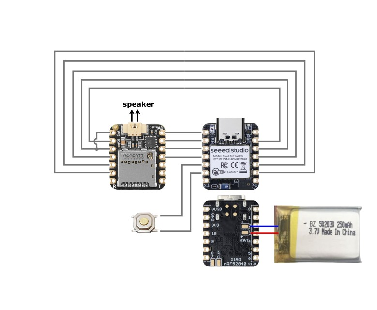

> ⚠️ WARNING: For the proper function of the speaker, the circuit diagram and assembly steps have been slightly modified. If you possess a device assembled before August 23, 2024, you need to modify it. Please refer to the [Speaker function correction for earlier models](#speaker-function-correction-for-earlier-models) section for detailed instructions.

> ⚠️ Disclaimer: This device is currently a developer version that has not been fully tested. Some new functionality may not be fully covered by the firmware.

# Omi Triangle v2

Omi Triangle v2 is an upgraded version of Omi Triangle v1, featuring added memory, a speaker, and a configurable momentary button.

**Circuit Diagram:**

---

# Assembly guide

Estimated Time: 50 min

# Table of contents

1. [Component List](#1-component-list)
2. [Tools and Materials](#2-tools-and-materials)
3. [Assembly Steps](#3-assembly-steps)
   - [Step 1: Prepare the Adafruit 5769 Board](#step-1-prepare-the-adafruit-5769-board)
   - [Step 2: Solder XIAO nRF52840 Sense to Adafruit 5769 Board](#step-2-solder-xiao-nrf52840-sense-to-adafruit-5769-board)
   - [Step 3: Attach the Button](#step-3-attach-the-button)
   - [Step 4: Solder Board Edges with Wire](#step-4-solder-board-edges-with-wire)
   - [Step 5: Solder the Speaker](#step-5-solder-the-speaker)
   - [Step 6: Solder the Battery](#step-6-solder-the-battery)
   - [Step 7: Clean the Board](#step-7-clean-the-board)
   - [Step 8: Assembly Preparation](#step-8-assembly-preparation)
   - [Step 9: Attach the Speaker to the Enclosure](#step-9-attach-the-speaker-to-the-enclosure)
   - [Step 10: Microphone Noise Isolation (Optional)](#step-10-microphone-noise-isolation-optional)
   - [Step 11: Assemble the Device](#step-11-assemble-the-device)
4. [Speaker function correction for earlier models](#speaker-function-correction-for-earlier-models)

---

## 1. Component list

- **[Seeed Studio XIAO nRF52840 Sense](https://www.seeedstudio.com/Seeed-XIAO-BLE-Sense-nRF52840-p-5253.html)**
- **[Adafruit 5769 Audio BFF Add-On for QT Py](https://www.adafruit.com/product/5769)**
- **[OWS-091630W50A-8 Speaker (8Ω, 1W, Top Port, 95dB)](https://www.digikey.com/en/products/detail/ole-wolff-electronics-inc/OWS-091630W50A-8/17636881)**
- **[502030 250mAh LiPo Battery](https://www.amazon.com/EEMB-Rechargeable-Connector-Parrott-Polarity/dp/B0B7R8CS2C)**
- **[4x4x1.5 SMD Button](https://www.amazon.com/4x4x1-5mm-Momentary-Tactile-Button-Switch/dp/B00FZLECO4)**
- **[28-30 AWG Wire, Solid Core](https://www.amazon.com/dp/B07G2SWB19)**
- **Micro SD Card (any)**
- **3d-printed enclosure**

The enclosure comes with two versions of the top cover:

1. "High tolerance" version: Provides a tight fit for the lid. While more pleasant to use, it may be more challenging to print (because you have to maintain fairly precise clearances).
2. "Low tolerance" version: Designed for gluing the lid in place.

It is recommended to print both versions and choose the most appropriate one based on your printing capabilities.

## 2. Tools and materials

- **[Soldering iron](https://pine64.com/product/pinecil-smart-mini-portable-soldering-iron/)**
- **[Solder wire](https://a.co/d/62oBw1u)**
- **[Soldering flux](https://a.co/d/gNpLJZa)**
- **[Micro wire cutter](https://a.co/d/6FFrCi5)**
- **Precision tweezers**
- **Craft knife**
- **Cyanoacrylate glue (aka super glue)**
- **Hot glue gun**
- **Thin double-sided tape**
- **Ruler or caliper**
- **Isopropyl alcohol and cotton swabs**
- **Optional: wire stripper**
- **Optional: [UV resin and UV light](https://a.co/d/4x64SlM)**
- **Optional: [Foam seal gasket 1/16 in thick](https://a.co/d/awwI9Hz)**
- **Optional: [1 mm hole punch](https://a.co/d/2ZA8CoM)**

## 3. Assembly steps

### Step 1: Prepare the Adafruit 5769 board

1. Identify the PicoBlade connector on the Adafruit 5769 board.

   

2. Using wire cutters, carefully cut off the top of the PicoBlade connector.

   

### Step 2: Solder XIAO nRF52840 Sense to Adafruit 5769 board

1. Place the two boards side-by-side on a clean, rigid surface. Use a napkin underneath to keep your work area clean.

2. Identify the top 6 pins that need to be soldered between the boards.

   

3. Apply a small amount of soldering flux to the pads you'll be soldering.

   

4. Set your soldering iron to the correct temperature (250°C is enough for lead-containing solder).

5. Apply solder to a first pad, spending about 3-4 seconds per contact. Be careful not to overheat the boards.

   

💡 Tip: Allow the solder to solidify for 2-3 seconds before moving the boards.

6. Check the flatness of the board connection. Resolder it if not flat. Otherwise it won't fit inside the case.

   
 
7. Apply solder to pads 2-6, spending about 3-4 seconds per contact. Be careful not to overheat the boards.

   
   

8. Check that the solder is visible from the other side of the boards to ensure a solid connection.

   

⚠️ Warning: Be careful not to touch any components other than the pads you're soldering to avoid damaging the boards.

💡 Tip: Use flux sparingly to avoid getting it near the microphone hole or inside the SD card slot.

### Step 3: Attach the button

1. Bend the button contacts as shown in the images below.

   
   

2. Apply a small amount of cyanoacrylate glue or UV resin to the bottom of the button.

⚠️ Warning: Be careful not to use too much glue, as excess could interfere with the button's functionality.

3. Carefully position the button on the board as shown in the image.

   
   
   

4. If using cyanoacrylate glue, apply firm pressure to the button until the glue sets.

5. If using UV resin, cure it with a UV light for the recommended time.

6. Once the glue has set, solder the button contacts to the underlying pads.

   

⚠️ Warning: Be careful not to short-circuit button contacts to a metal shell of the XIAO board.

### Step 4: Solder board edges with wire

1. Cut five pieces of solid-core wire, each at least 55 mm long.

2. Strip an equal amount of insulation from both ends of each wire, ensuring the unstripped length is exactly 34 mm.

   

⚠️ Warning: Ensure the unstripped wire length is exactly 34 mm to fit properly in the case. Shortening or lengthening it by even 1 mm will prevent proper fitting.

3. Cut an additional piece of wire with unstripped length of 5 mm. 

   

4. Insert the long wires into the holes and bend the ends as shown.

   
   

5. Insert the short wire into the 5V and 3v3 holes (as shown in the photo). Allow 1-2 mm distance between the board and the wire (as not shown in the photo). Bend the ends.

   
   
6. Apply a small amount of flux to each hole you'll be soldering.

7. Solder the wires from the front side. Solder each wire end, starting from the top. Hold the iron on each joint for 2-3 seconds.

   
   
   

8. Trim any excess wire flush with the board surface.

   
   

### Step 5: Solder the speaker

1. Apply a small amount of flux to the speaker connector pins on the board.

2. Solder each speaker wire to its corresponding pin on the board.

   
   

### Step 6: Solder the battery

1. Cut the black battery wire to a length of 33 mm, then strip 1 mm from the end.

2. Cut the red battery wire to a length of 37 mm, then strip 1 mm from the end.

   

2. Position the battery as shown in the image, with the wires oriented correctly.

3. Identify the positive (+) and negative (-) battery pads on the board.

4. Apply a small amount of flux to each battery pad.

5. Solder the red wire to the positive pad and the black wire to the negative pad.

   

⚠️ Warning: Incorrect battery polarity can instantly damage the microcontroller. Triple-check your connections before powering on.

### Step 7: Clean the board

Gently clean all soldered areas to remove flux residue. Pay extra attention to the area around the microphone hole. Use a dry cotton swab to absorb any excess alcohol.

Allow the board to air dry completely before proceeding.

⚠️ Warning: Be extremely gentle when cleaning near the microphone hole to avoid clogging it with debris or cotton fibers.

### Step 8: Assembly preparation

1. Using double-sided tape, attach the battery as shown in the photo. Center it against the board to ensure proper fit.

    
    
    

2. Ensure the distance between the battery and the board does not exceed 2 mm. If it does, check if the battery wires are overlapping with the board wires. Distance larger than 2 mm will result in improper fit of the board assembly.

    

3. Insert the micro SD card into the slot.

    

4. Apply the double-sided tape to the bottom side of the battery.

    

4. Place the board assembly inside the case, starting from the side shown in the photo.

    

### Step 9: Attach the speaker to the enclosure

📝 Note: There are two speaker-related chambers in this case, which need to be isolated from each other. This is done to eliminate the interference of sound waves from the two sides of the speaker, which lowers the volume and can cause distortions. The adhesive sealing rim at the front of the speaker serves as this isolation. Additionally, isolating the entire speaker unit from the other components in the case helps reduce microphone noise pollution.

1. Remove the protective layer from the adhesive rim of the speaker.

    

2. Position the speaker inside the enclosure as shown in the image. Press it firmly for the adhesive to set. You may additionaly secure with couple of drops of cyanoacrylate glue.

   

3. Tuck the speaker wires to the board.

4. Apply cyanoacrylate glue to the edges of the speaker cover seating as shown.

   

5. Press the speaker cover firmly into place.

6. Ensure the wire inlet to the speaker compartment is completely sealed.

   

### Step 10: Microphone noise isolation (Optional)

📝 Note: This step can help improve audio recording quality by reducing ambient noise picked up by the microphone.

1. Cut a small piece of foam seal gasket to fit over the microphone area. Punch it with a hole punch.

    

2. Carefully glue the foam over the microphone area on the board.

   

### Step 11: Assemble the device

1. Ensure all wires are neatly tucked in and not pinched. Ensure the board is sitting tightly inside the case, with nothing is sticking out of it.

2. If using the high-tolerance top cover:
   a. Align the cover with the bottom part.
   b. Gently snap the cover into place, ensuring all edges are secure.

3. If using the low-tolerance top cover:
   a. Apply small dots of hot glue sparingly around the edge of the bottom part. Focus on corners and a few points along each side.
   b. Carefully place the top cover onto the bottom part.
   c. Press gently and hold in place until the glue sets.

💡 Tip: Use just enough glue to secure the cover while allowing for potential future disassembly. Aim for a balance between a secure fit and ease of reopening if needed.

   

---

## Speaker function correction for earlier models

> The 5V contact on the board, originally intended for speaker power, does not provide voltage when the device is battery-powered. In fact, there is no 5V signal available at all in battery mode. This modification creates a jumper to utilize the 3.3V supply from the board, which is sufficient to drive the speaker in all power states.

For devices assembled before August 23, 2024, follow these steps to ensure proper speaker functionality:

1. Remove the top cover.
2. Extract the board assembly from the enclosure.
3. Detach the battery from the board assembly, taking care not to damage the connections.
4. Locate the wire closest to the USB port and cut it as shown in the image below.

    
    

5. Using the cut wire, create a jumper between the designated board pads as illustrated.

    

6. Solder the jumper wire securely between the 5V and 3v3 pads.

    

7. Ensure that the new jumper wire does not create any short circuits with surrounding components.
8. Reassemble the device by following Steps 8 and 11 from the main assembly instructions.