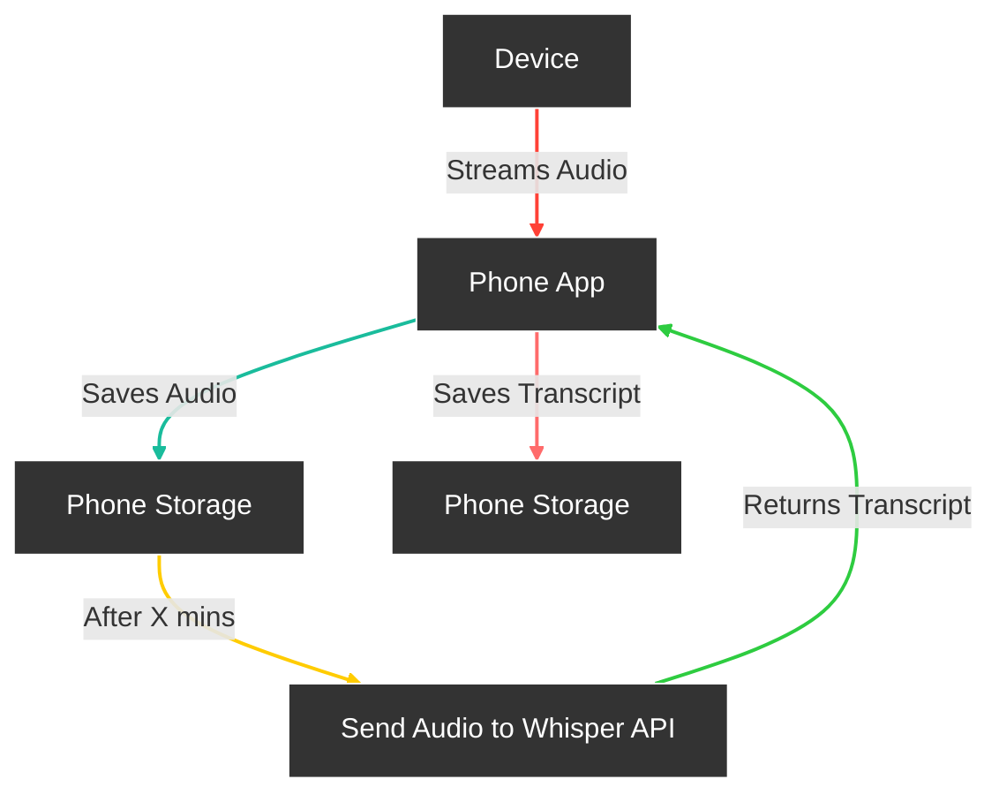
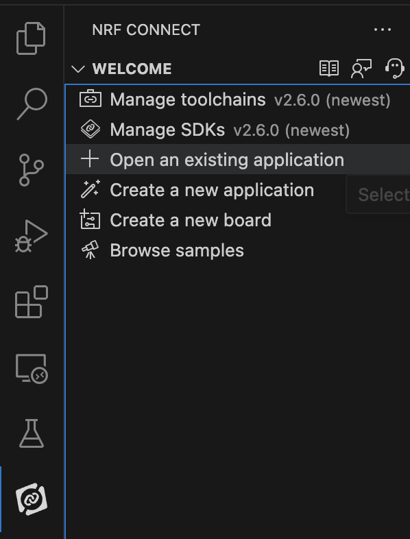
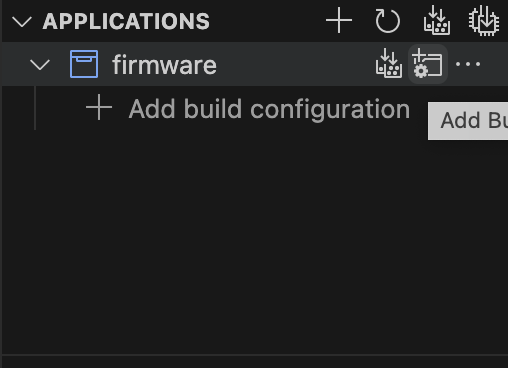
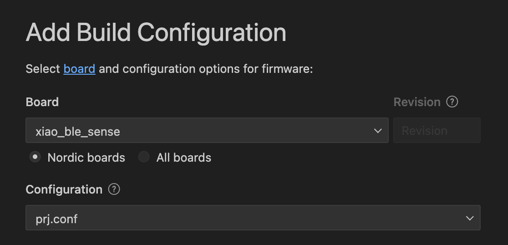
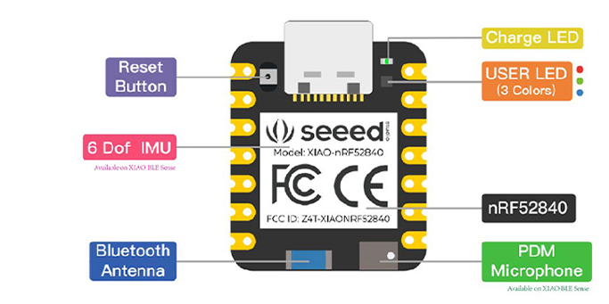

# Friend: Open-Source AI Wearable with 24h+ on single charge

<table>

  <tr>
    <td align="center"></td>
    <td align="center"></td>
  </tr>
  <tr>
    <td align="center">Assembled</td>
    <td align="center">Disassembled</td>
  </tr>
</table>

[](https://discord.gg/kEXXsnb5b3) &ensp;
[](https://opensource.org/licenses/MIT)


Friend is an AI wearable device that records everything you say, gives you proactive feedback and advice.

## Features

- **Real-Time AI Audio Processing**: Leverage powerful on-device AI capabilities for real-time audio analysis.
- **Low-powered Bluetooth**: Capture audio for 24h+ on a small button battery
- **Open-Source Software**: Access and contribute to the pin's software stack, designed with openness and community collaboration in mind.
- **Wearable Design**: Experience unparalleled convenience with ergonomic and lightweight design, perfect for everyday wear.

## How it works



## Structure

There are 2 different apps in these repositories located in different branches and folders. Our goal is to merge them into one big project.

- [Standalone Branch](https://github.com/BasedHardware/friend/tree/apps/AppStandalone) or Folder "": Standalone version of the app that doesn't require any hardware to use it.

- [AppWithWearable Branch](https://github.com/BasedHardware/friend/tree/apps/AppWithWearable) or Folder "AppWithWearable": Wearable-connected version of the app that requires the "Friend necklace" to use it.

- [Main Branch] Branch that contains firmware, hardware, designs and both apps

## Hardware Buying Guide (<$20 total)

- Board: Seeed Studio XIAO nRF52840 Sense | $15 on [Seedstudio](https://www.seeedstudio.com/Seeed-XIAO-BLE-Sense-nRF52840-p-5253.html) and $24 on [Amazon](https://www.amazon.com/Seeed-Studio-XIAO-nRF52840-Microcontroller/dp/B09T94SZ8K/ref=sr_1_2?dib=eyJ2IjoiMSJ9.i8MUToWd9xYaOg5PHVw2pyxS9i6YZMcZTG4DVV3lwRRKxy64YMOtO-LDhe63d90cDl7xEr3CeA2zN4P5c2G7nGgJl99_6yCVplKsFqtxJyfSQuCMUyZON27nWRtnp-uW1wazpgUV0lN5ds7FKkYz5HTI8bZoLnK2OnFuUet_S4Wsr20oABAovtdI2xrjVYyLaiqLzxrpZyveKDRk_TDpht0rztApuX-YrBb00GDQyFs.sZLkUFW18C8b3EnZpgVKEomXioMKdSLq0F17PikAwc0&dib_tag=se&keywords=nrf52840&qid=1711331537&sr=8-2&th=1) and also [link for Europe ](https://amzn.eu/d/3eG6gaA) and [India](https://robu.in/product/seeed-studio-xiao-ble-nrf52840/) | <$15/unit

- Rechargeable LiPo Battery| [solarbotics](https://www.solarbotics.com/product/17802) and also [link for europe ](https://www.amazon.com.be/-/en/400mAh-Battery-Endurance-Perfect-Airplanes/dp/B0CBDBNJF5) and [India](https://robu.in/product/400mah-pcm-protected-micro-li-po-battery-2/)| $3-$10

- Slider switch | $7 for 30+ units [on Amazon](https://www.amazon.com/Tnuocke-Vertical-Position-Latching-SS12F15-G5/dp/B099N3HFPG/ref=sr_1_2?dib=eyJ2IjoiMSJ9.vWYaZHNA7Z38_YnK7oxLKHvVPX-koqNn5CYGqZXKURCQso_zrAwckot4_h8c77Kgy2-m8FcrQymrZff0rlZIGdECJFA5Rwc5EQObrZ5wDb9zjnwVjonhSZfHlyM-KkJKO4_E6mKcC_I0vZg2vS1PBPkNSAXj9H9pTVK3D2iVtuoMNsxvAEwrYUPx3gYOiIjMOzJYoj8aHPmy2W1R4bWcPWp8IvhbO1GO29TT0jVE97U.ZavNMHkM9KYGMLSB_3DREpSJjhQ16_cjqOpo7aPAfHY&dib_tag=se&keywords=slider%2Bswitch&qid=1711332053&sr=8-2&th=1) and also [link for europe ](https://amzn.eu/d/9U0gjPB) but you only need one | <$1/unit | and [India](https://robu.in/product/4mm-spdt-1p2t-slide-switch-pack-of-10/)

- Wires. I didn't try [these ones ](https://www.amazon.com/dp/B09X4629C1)but they should work

- 3D-print design of the case is located [here](https://github.com/BasedHardware/friend/tree/main/3d-printing%20designs)

- For the cord you could tie a Knot with a thread of your choice or get the magnetic shoe laces from here which can be used as a [magnetic hook](https://www.amazon.com/Aiboxin-Upgraded-Version-Shoelaces-Magnetic/dp/B08526QVCS/) for easy wear
## Getting Started

Follow these steps to get started with your Friend.

### Install the app

1. Clone the repo `git clone https://github.com/BasedHardware/friend.git`
2. Choose which version of the app you want to install (see Structure).
   - Don't have the device? run `cd apps/AppStandalone` in terminal
   - Have the device/NRF Board? run `cd apps/AppWithWearable` in terminal
3. Install [Flutter](https://docs.flutter.dev/get-started/install/macos/mobile-ios?tab=download) and [CocoaPods](https://guides.cocoapods.org/using/getting-started.html)
4. Install your environment variables

   - For AppWithWearable, open file api_calls.dart located in `apps/AppWithWearable/lib/backend/api_requests ` Find "Whisper" and instead of "key", provide your own api-key for openai whisper for transcriptions to work

      

   then, go to apps/AppWithWearable/lib/custom_code/actions and in the "stream_api_response" file, add your openai key instead of "<key>"
   

   - For AppStandalone, update variables in in .env.template file

5. iOS: [Install XCode](https://apps.apple.com/us/app/xcode/id497799835?mt=12) then navigate to the iOS folder. You might need to launch Xcode to select a team and specify a bundle identifier.
   Android: Download/install [android Studio ](https://developer.android.com/studio) then navigate to the Android folder
   Don't run in web/simulator: Bluetooth will not work
6. Run `flutter clean ` then `flutter pub get` then `pod install`
7. When everything is installed, run `flutter run `, this should run your app on a selected device

**No-Code Alternative**:

- Don't have the device? [Clone this Flutterflow Project ](https://app.flutterflow.io/project/friend-0x9u40)
- Have the wearable device? [Copy this Flutterflow Project](https://app.flutterflow.io/project/friend-share-19bk3d)

# Install Firmware

Follow these steps to install the firmware:

1. Set up nRF Connect by following the tutorial in this video: [https://youtu.be/EAJdOqsL9m8](https://youtu.be/EAJdOqsL9m8?feature=shared)

2. In the nRF Connect Extension inside your VS Code, click "Open an existing application" and open the `firmware` folder from the root of this repo.

   

3. In the application panel of the extension, click the "Add Build Configuration" icon.

   

4. Choose the board as "xiao_ble_sense" and select the configuration as "prj.conf". Then, click "Build Configuration".

   

5. Once the build succeeds, you will find the `zephyr.uf2` file in the `firmware/build/zephyr` directory.

6. Double-click on the reset button of the device. The device will appear on your computer as a disk. Drag and drop the `zephyr.uf2` file into it.

   > **Note:** On a Mac, you might see an error message after dropping the file, indicating that the process did not complete. This is just a Mac-specific error; the firmware is successfully uploaded.

   

That's it! You have successfully installed the firmware on your device.

### Testing Audio Recording on Your Computer

Follow these steps to test audio recording on your computer using a Python script:

1. Open your terminal and navigate to the project's root directory.

2. Change to the "test" folder:

   ```
   cd test
   ```

3. Install the required Python modules:

   ```
   pip install -r requirements.txt
   ```

4. Run the Python script:

   ```
   python local_laptop_client.py
   ```

The recorded audio files will be stored periodically in the `test/recordings` directory.

That's it! You have now set up and tested audio recording on your computer.

### Assemble the device

**Step 0:** Make sure you have bought everything from the buying guide above

**Step 1:** You need to design the case using 3D printer. Find .stl file [here](https://github.com/BasedHardware/Friend/blob/main/assets/3d_printing_designs/Case%20with%20LiPo%20battery.stl). If you don't know how to do it, send this file to someone who has a 3d printer

**Step 2:**
Solder everything together like on the picture below. using a soldering kit. Don't have it? buy [this one for $9](https://a.co/d/0XdthUV)


**Step 3:**
Fit everything in the case. Biggest hole is for the usb port. In my example, I put the battery first, then the board and then the switch. If you will figure out a better solution, please contribute!


**Step 4:** Use hot glue to attach the lid to the case. You can also use a scotch tape first for testing purposes. Last, on the slider switch side, you'll find 2 small round holes. This is where the thread should go through.


Congratulations! you now have a fully working and assembled device!

## Contributing

[Join our Discord!](https://discord.gg/kEXXsnb5b3)
We welcome contributions from the community! If you're interested in improving Friend, our current biggest goal is to combine both apps together (AppStandalone with AppWithWearable).

- Standalone App brings great prompts and rich structure
- AppWithWearable brings simple bluetooth connecting functionality

## Support

For open-source support, please open an issue on GitHub and/or ask in our [Discord Community](https://discord.gg/kEXXsnb5b3). For commercial support, license inquiries, or any other questions, please contact us directly at [team@whomane.com](mailto:team@whomane.com).

## Disclaimer

Please note that the Friend is a prototype project and is provided "as is", without warranty of any kind. Use of the device should comply with all local laws and regulations concerning privacy and data protection.

Thank you for your interest in Friend, the open-source AI wearable. We're excited to see what you'll build with it!

## Licensing

Friend is available under MIT License
