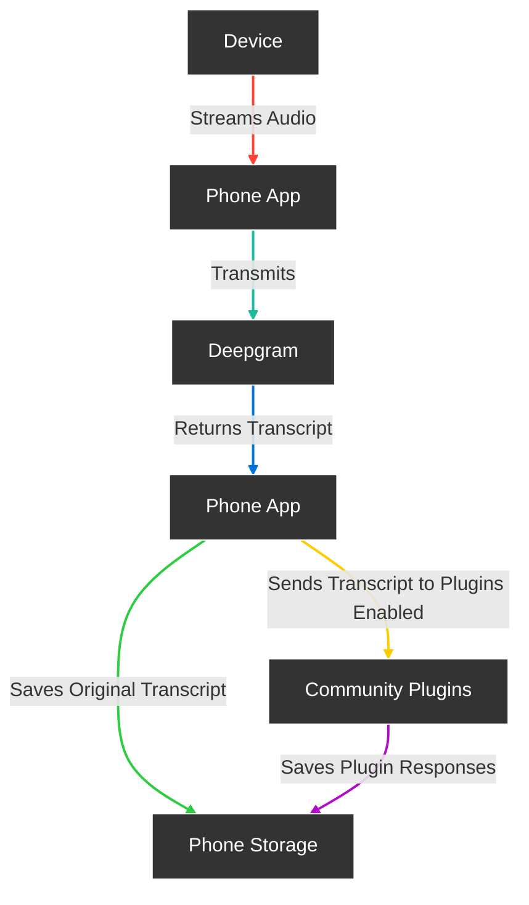

<div align="center">

# **Friend**

Open Source AI Wearable device that records everything you say, gives you proactive feedback and advice. 6+ days on single charge.


[](https://discord.gg/ZutWMTJnwA) &ensp;&ensp;&ensp;
[](https://opensource.org/licenses/MIT)&ensp;&ensp;&ensp;
[](https://github.com/BasedHardware/Friend)

<h3>

[Homepage](https://basedhardware.com/) | [Documentation](https://basedhardware.github.io/Friend/) | [Buy Assembled Device](https://www.kickstarter.com/projects/kodjima333/friend-open-source-ai-wearable-recording-device?ref=7wc2iz)

</h3>

</div>

## Features

- **Real-Time AI Audio Processing**: Leverage powerful on-device AI capabilities for real-time audio analysis.
- **Low-powered Bluetooth**: Capture audio for 24h+ on a small button battery
- **Open-Source Software**: Access and contribute to the pin's software stack, designed with openness and community collaboration in mind.
- **Wearable Design**: Experience unparalleled convenience with ergonomic and lightweight design, perfect for everyday wear.

## Get Started with our Documentation:

- [Introduction](https://basedhardware.github.io/Friend/)
- [App setup](https://basedhardware.github.io/Friend/get_started/Setup/)
- [Buying Guide](https://basedhardware.github.io/Friend/assembly/Buying_Guide/)
- [Build the device](https://basedhardware.github.io/Friend/assembly/Build_the_device/)
- [Install firmware](https://basedhardware.github.io/Friend/assembly/Install_firmware/)

## Contribution:

We welcome contributions from the community! If you are interested in improving Friend, check out our [current tasks](https://github.com/BasedHardware/Friend/issues)

We also want to give back to the community - and therefore, some of the tasks are paid bounties 💰! You can check which ones by the "Paid Bounty" label, [here](https://github.com/BasedHardware/Friend/issues?q=is:open+is:issue+label:%22Paid+Bounty+%F0%9F%92%B0%22)


## How it works



## Structure

There are 3 different apps in these repositories located in different branches and folders. Our goal is to merge them into one big project.

Folder "AppStandalone": Standalone version of the app that doesn't require any hardware to use it.

Folder "AppWithWearable": Wearable-connected version of the app that requires the "Friend necklace" to use it.

Folder "AppWithWearableReactNative": Wearable-connected version of the app that is built in React native

[Next Step: Read Getting Started →](https://basedhardware.github.io/Friend/get_started/Setup/)

# Getting Started

Follow these steps to get started with your Friend.

### Install the app

Before starting, make sure you have the following installed:

- Flutter SDK
- Dart SDK
- Xcode (for iOS)
- Android Studio (for Android)
- CocoaPods (for iOS dependencies)

### Setup Instructions

1. **Upgrade Flutter**:
   Before proceeding, make sure your Flutter SDK is up to date:
    ```
    flutter upgrade
    ```

2. **Get Flutter Dependencies**:
   From within `apps/AppStandalone`, install flutter packages:
    ```
    flutter pub get
    ```

3. **Install iOS Pods**:
   Navigate to the iOS directory and install the CocoaPods dependencies:
    ```
    cd ios
    pod install
    pod repo update
    ```

4. **Environment Configuration**:
   Create `.env` using template `.env.template`
    ```
    cd ..
    cat .env.template > .env
    ```

5. **API Keys**:
   Add your API keys to the `.env` file. (Sentry is not needed)

6. **Run Build Runner**:
   Generate necessary files with Build Runner:
    ```
    dart run build_runner build
    ```

7. **Run the App**:
    - Select your target device in Xcode or Android Studio.
    - Run the app.

[Next Step: Buying Guide →](https://basedhardware.github.io/Friend/assembly/Buying_Guide/)

## More links:

- [Contributing](https://basedhardware.github.io/Friend/info/Contribution/)
- [Roadmap and Tasks](https://github.com/BasedHardware/Friend/issues)
- [Support](https://basedhardware.github.io/Friend/info/Support/)
- [Our bluetooth Protocol Standard](https://docs.basedhardware.com/developer/Protocol/)
- [Plugins](https://docs.basedhardware.com/developer/Plugins/)

## Made by the Community, with -❤️-:

<a href="https://github.com/BasedHardware/Friend/graphs/contributors">
  
</a>

## Licensing

Friend is available under MIT License
