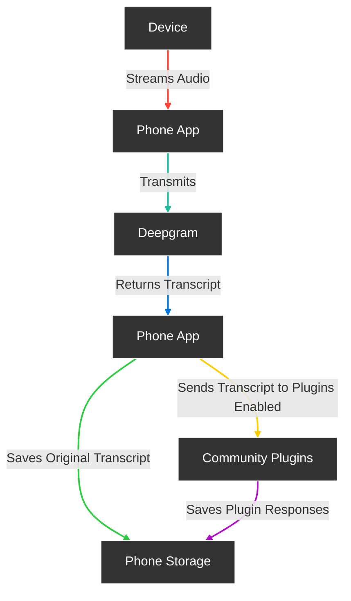

<div align="center">

# **Friend**

Meet Friend, the world’s leading open-source AI wearable that revolutionizes how you capture and manage conversations. Simply connect Friend to your mobile device and enjoy automatic, high-quality transcriptions of meetings, chats, and voice memos wherever you are.


[](https://discord.gg/ZutWMTJnwA) &ensp;&ensp;&ensp;
[](https://opensource.org/licenses/MIT)&ensp;&ensp;&ensp;
[](https://github.com/BasedHardware/Friend)

<h3>

[Homepage](https://basedhardware.com/) | [Documentation](https://docs.basedhardware.com/) | [Buy Assembled Device](https://basedhardware.com)

</h3>

</div>

## Features

- **Real-Time AI Audio Processing**: Leverage powerful on-device AI capabilities for real-time audio analysis.
- **Low-powered Bluetooth**: Capture audio for 24h+ on a small button battery
- **Open-Source Software**: Access and contribute to the pin's software stack, designed with openness and community collaboration in mind.
- **Wearable Design**: Experience unparalleled convenience with ergonomic and lightweight design, perfect for everyday wear.

## Get Started with our Documentation:

- [Introduction](https://docs.basedhardware.com/)
- [App setup](https://docs.basedhardware.com/get_started/Setup/)
- [Buying Guide](https://docs.basedhardware.com/assembly/Buying_Guide/)
- [Build the device](https://docs.basedhardware.com/assembly/Build_the_device/)
- [Install firmware](https://docs.basedhardware.com/assembly/Install_firmware/)

## To start developing:

* Check out our [contributions guide](https://docs.basedhardware.com/developer/Contribution/) 
* Check [current tasks](https://github.com/BasedHardware/Friend/issues)
* Check paid bounties [here](https://github.com/BasedHardware/Friend/issues?q=is:open+is:issue+label:%22Paid+Bounty+%F0%9F%92%B0%22)
* Join [Discord](https://discord.gg/ZutWMTJnwA)


## How it works



## Get the software

Get the Android app on [Google Play](https://play.google.com/store/apps/details?id=com.friend.ios)

Download the iOS app in [App Store](https://apps.apple.com/us/app/friend-ai-wearable/id6502156163)

iOS app beta on [TestFlight](https://testflight.apple.com/join/Ie8VQ847)

Latest firmware: [v1.0.3](https://github.com/BasedHardware/Friend/releases/tag/v1.0.3-firmware)

Or you can build your own app from the sources in `apps/AppWithWearable` and firmware from `firmware` folders.

[Next Step: Read Getting Started →](https://docs.basedhardware.com/get_started/Setup/)

# Getting Started

Follow these steps to get started with your Friend.

### Install the app

Before starting, make sure you have the following installed:

- Flutter SDK
- Dart SDK
- Xcode (for iOS)
- Android Studio (for Android)
- CocoaPods (for iOS dependencies)

### Setup Instructions

1. **Upgrade Flutter**:
   Before proceeding, make sure your Flutter SDK is up to date:
    ```
    flutter upgrade
    ```

2. **Get Flutter Dependencies**:
   From within `apps/AppWithWearable`, install flutter packages:
    ```
    flutter pub get
    ```

3. **Install iOS Pods**:
   Navigate to the iOS directory and install the CocoaPods dependencies:
    ```
    cd ios
    pod install
    pod repo update
    ```

4. **Environment Configuration**:
   Create `.env` using template `.env.template`
    ```
    cd ..
    cat .env.template > .env
    ```

5. **API Keys**:
   Add your API keys to the `.env` file. (Sentry is not needed)

6. **Run Build Runner**:
   Generate necessary files with Build Runner:
    ```
    dart run build_runner build
    ```

7. **Setup Firebase**:
   - Follow official [Firebase Docs](https://firebase.google.com/docs/flutter/setup) till Step 1
   - Run the following command to register the prod flavor of the app. The command will prompt you to select `configuration type`; under it, select `Target` and then `Runner`

      ```
      flutterfire config --out=lib/firebase_options_prod.dart --ios-bundle-id=com.friend-app-with-wearable.ios12 --android-app-id=com.friend.ios --android-out=android/app/src/prod/  --ios-out=ios/Config/Prod/
      ```
   - Similarly for dev environment

      ```
      flutterfire config --out=lib/firebase_options_dev.dart --ios-bundle-id=com.friend-app-with-wearable.ios12.develop --android-app-id=com.friend.ios.dev --android-out=android/app/src/dev/  --ios-out=ios/Config/Dev/
      ```
   - Generate SHA1/SHA256 Keys for your Keystore and add them to Firebase. Follow the steps mentioned in this [StackOverflow answer](https://stackoverflow.com/a/56091158) or the [Official Docs](https://support.google.com/firebase/answer/9137403?hl=en). This is required for Firebase Auth through Google OAuth to work.


8. **Run the App**:
    - Select your target device in Xcode or Android Studio.
    - Run the app.

[Next Step: Buying Guide →](https://docs.basedhardware.com/assembly/Buying_Guide/)

## More links:

- [Contributing](https://docs.basedhardware.com/developer/Contribution/)
- [Roadmap and Tasks](https://github.com/BasedHardware/Friend/issues)
- [Support](https://docs.basedhardware.com/info/Support/)
- [Our bluetooth Protocol Standard](https://docs.basedhardware.com/developer/Protocol/)
- [Plugins](https://docs.basedhardware.com/developer/Plugins/)

## Made by the Community, with -❤️-:

<a href="https://github.com/BasedHardware/Friend/graphs/contributors">
  
</a>

## Licensing

Friend is available under MIT License
