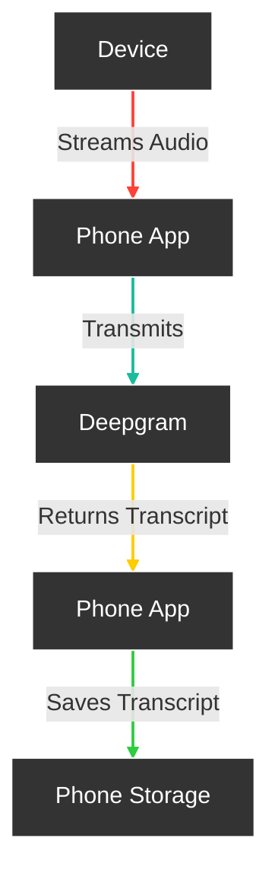

# **Friend**

Open Source AI Wearable device that records everything you say, gives you proactive feedback and advice. 24h+ on single charge.

 &ensp;&ensp;&ensp;
&ensp;&ensp;&ensp;

<h3>

[Homepage](https://basedhardware.com/) | [Documentation](https://basedhardware.github.io/Friend/) | [Buy Assembled Device](https://www.kickstarter.com/projects/kodjima333/friend-open-source-ai-wearable-recording-device?ref=7wc2iz)

</h3>

## Features

- **Real-Time AI Audio Processing**: Leverage powerful on-device AI capabilities for real-time audio analysis.
- **Low-powered Bluetooth**: Capture audio for 24h+ on a small button battery
- **Open-Source Software**: Access and contribute to the pin's software stack, designed with openness and community collaboration in mind.
- **Wearable Design**: Experience unparalleled convenience with ergonomic and lightweight design, perfect for everyday wear.

## Get Started with our Documentation:

- [Introduction](https://basedhardware.github.io/Friend/)
- [App setup](https://basedhardware.github.io/Friend/get_started/Setup/)
- [Buying Guide](https://basedhardware.github.io/Friend/assembly/Buying_Guide/)
- [Build the device](https://basedhardware.github.io/Friend/assembly/Build_the_device/)
- [Install firmware](https://basedhardware.github.io/Friend/assembly/Install_firmware/)

## How it works

## Structure

There are 3 different apps in these repositories located in different branches and folders. Our goal is to merge them into one big project.

Folder "AppStandalone": Standalone version of the app that doesn't require any hardware to use it.

Folder "AppWithWearable": Wearable-connected version of the app that requires the "Friend necklace" to use it.

Folder "AppWithWearableReactNative": Wearable-connected version of the app that is built in React native

[Next Step: Read Getting Started →](https://basedhardware.github.io/Friend/get_started/Setup/)

# Getting Started

Follow these steps to get started with your Friend.

### Install the app

1. Clone the repo `git clone https://github.com/BasedHardware/friend.git`
2. Choose which version of the app you want to install (see Structure).
   - Don't have the device? run `cd apps/AppStandalone` in terminal
   - Have the device/NRF Board? run `cd apps/AppWithWearable` in terminal
3. Install [Flutter](https://docs.flutter.dev/get-started/install/macos/mobile-ios?tab=download) and [CocoaPods](https://guides.cocoapods.org/using/getting-started.html)
4. Install your environment variables

   - For AppStandalone, update variables in in .env.template file
   - For AppWithWearable, you can set the api keys needed on the mobile App from the settings page itself

5. iOS: [Install XCode](https://apps.apple.com/us/app/xcode/id497799835?mt=12) then navigate to the iOS folder. You might need to launch Xcode to select a team and specify a bundle identifier.
   Android: Download/install [android Studio ](https://developer.android.com/studio) then navigate to the Android folder
   Don't run in web/simulator: Bluetooth will not work
6. Run `flutter clean ` then `flutter pub get` then `pod install`
7. When everything is installed, run `flutter run `, this should run your app on a selected device

[Next Step: Buying Guide →](https://basedhardware.github.io/Friend/assembly/Buying_Guide/)

## More links:

- [Contributing](https://basedhardware.github.io/Friend/info/Contribution/)
- [Support](https://basedhardware.github.io/Friend/info/Support/)

## Made by the Community, with -❤️-:

## Licensing

Friend is available under MIT License
