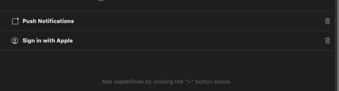
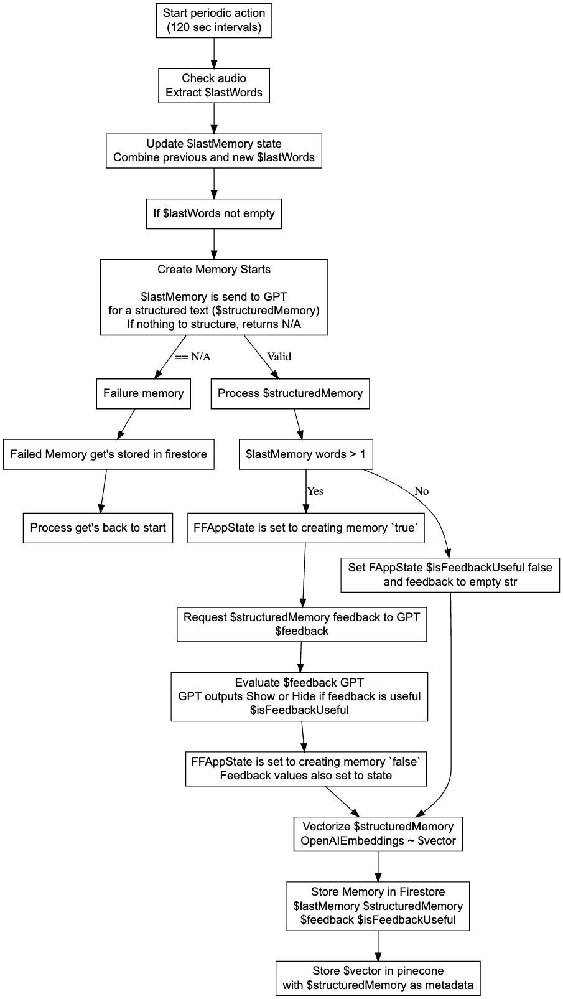

# Friend

A new Flutter project.

## Getting Started

FlutterFlow projects are built to run on the Flutter _stable_ release.

---

This guide walks you through the steps required to run the app locally on your machine. Please
follow the instructions carefully to ensure a smooth setup.

### Prerequisites

Before starting, make sure you have the following installed:

- Flutter SDK
- Dart SDK
- Xcode (for iOS)
- Android Studio (for Android)
- CocoaPods (for iOS dependencies)
- Firebase account and [Firebase CLI](https://firebase.google.com/docs/cli#install_the_firebase_cli)

### Setup Instructions

1. **Get Flutter Dependencies**:
     From within `apps/AppStandalone`, install flutter packages:
    ```
    flutter pub get
    ```

2. **Install iOS Pods**:
   Navigate to the iOS directory and install the CocoaPods dependencies:
    ```
    cd ios
    pod install
    pod repo update
    ```

3. **Environment Configuration**:
   Rename the environment configuration file:
    ```
    cd ..
    mv .env.template .env
    ```

4. **Firebase Project**:
    - Create a new project in [Firebase Console](https://console.firebase.google.com/).
    - Activate the FlutterFire CLI tool:
        ```
        dart pub global activate flutterfire_cli
        ```
    - Configure FlutterFire with your Firebase project:
        ```
        flutterfire configure
        ```
      Follow the prompts to select your project and target platforms (Android, iOS, Web).


5. **Pinecone Index**:
    - If you don't have one yet, create a new [Pinecone](https://www.pinecone.io/) account.
    - Navigate to the Pinecone Console and initiate a new index.
        - Define the index name.
        - Set the number of dimensions to `1,536`, as required for the `text-embedding-3-small` embeddings model.
        - Keep the remaining settings as default and proceed with creation.
        - Retrieve your index URL and namespace values, and update them in the environment variables file.

6. **API Keys**:
   Add your Firebase and other necessary API keys to the `.env` file.

7. **Run Build Runner**:
   Generate necessary files with Build Runner:
    ```
    dart run build_runner build
    ```

8. **Configure Xcode**:
    - Open your iOS project in Xcode:
        ```
        open ios/Runner.xcworkspace
        ```
    - Set up the imageNotification and main app:
        - For imageNotification:
            - Select a team in Xcode.
            - Set the identifier to `com.$your-username.friend-app-standalone.ImageNotification`.
        - For the main app:
            - Select a team in Xcode.
            - Set the identifier to `com.$your-username.friend-app-standalone`.
            - If you do not have a paid Apple Developer account, perform the following
              modifications:
                - Remove Notifications and Sign In with Apple capabilities.
                - Create an Entitlements file as shown below:
                  
                - Ensure the project builds without errors in Xcode:
                    ```
                     Product > Build
                    ```
                - Modify the routing on nav.dart (line 82) code to bypass login checks:
                    ```
                      FFRoute(
                        name: '_initialize',
                        path: '/',
                        builder: (context, _) => appStateNotifier.loggedIn
                           ? entryPage ?? const HomePageWidget()
                           : const Onboarding1Widget(),
                       )
                    ```
                  to
                    ```
                      FFRoute(
                        name: '_initialize',
                        path: '/',
                        builder: (context, _) => const HomePageWidget(),
                      ),
                    ```

9. **Run the App**:
    - Select your target device in Xcode or Android Studio.
    - Run the app.

By following these steps, you should be able to run the app on your local machine. If you encounter
any issues, please refer to the official Flutter and Firebase documentation, or check the community
forums for similar problems and solutions.

### Summarization Process Explanation


## Integration Tests

To test on a real iOS / Android device, first connect the device and run the following command from
the root of the project:

```bash
flutter test integration_test/test.dart
```

To test on a web browser, first launch `chromedriver` as follows:

```bash
chromedriver --port=4444
```

You may need to run this if you get the following error

Error

```
lib/env/env.dart:2:6: Error: Error when reading 'lib/env/env.g.dart': No such file or directory
part 'env.g.dart';
```

Command

```
flutter pub run build_runner build
```

Then from the root of the project, run the following command:

```bash
flutter drive \
  --driver=test_driver/integration_test.dart \
  --target=integration_test/test.dart \
  -d chrome
```

Find more information about running Flutter integration
tests [here](https://docs.flutter.dev/cookbook/testing/integration/introduction#5-run-the-integration-test)
.

Refer to this guide for instructions on running the tests
on [Firebase Test Lab](https://github.com/flutter/flutter/tree/main/packages/integration_test#firebase-test-lab)
.
