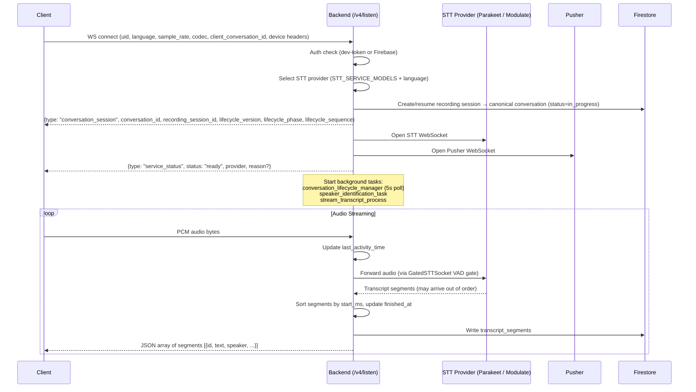
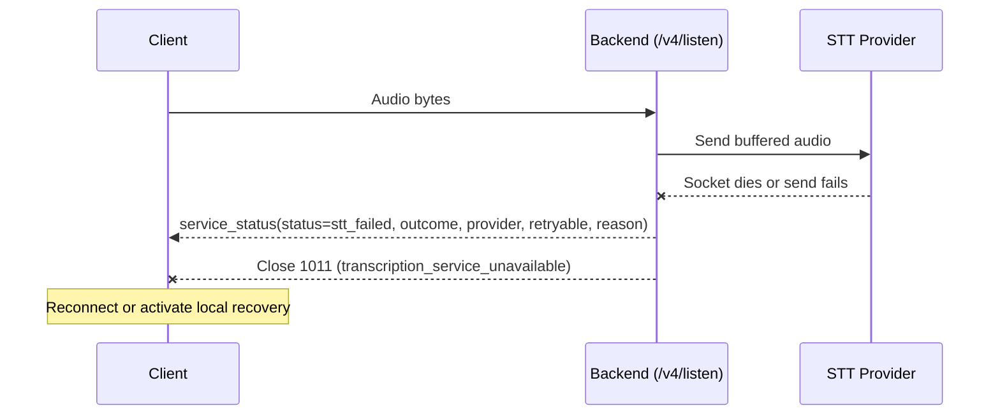
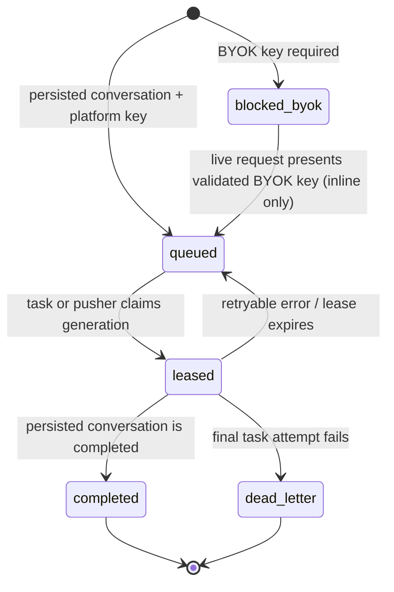
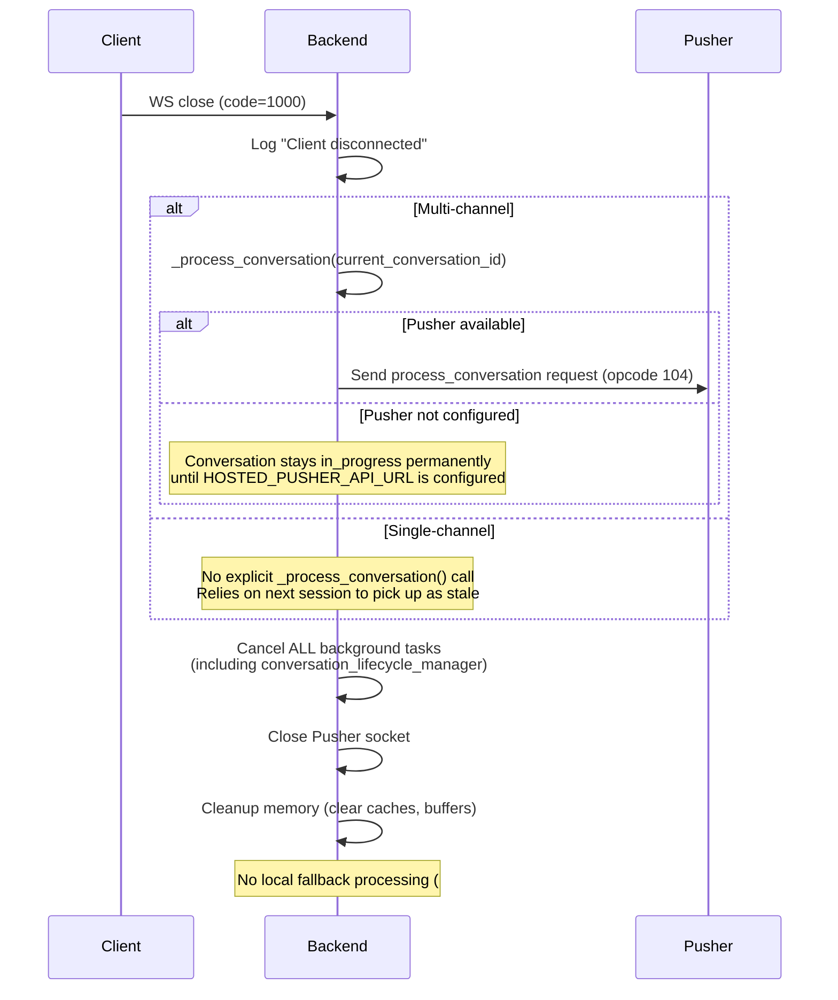
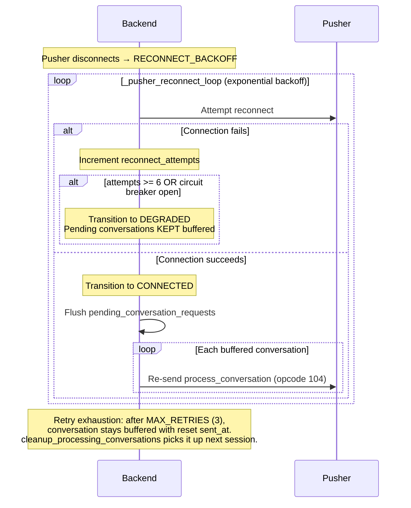
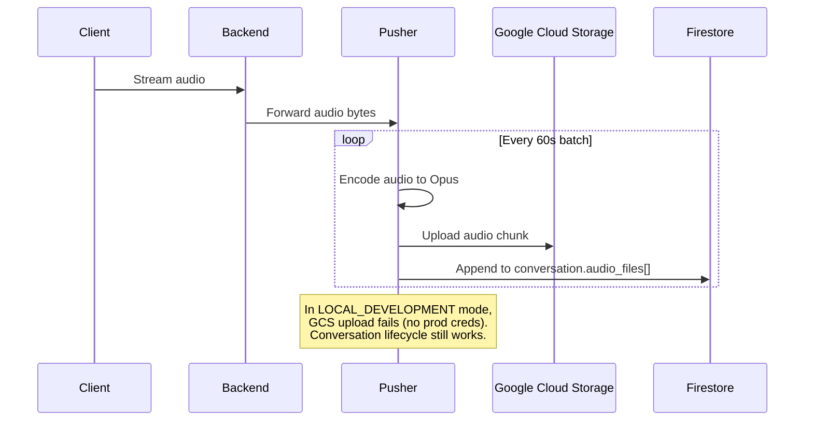

# Listen + Pusher Pipeline — Sequence Diagrams

> Last updated: 2026-09-26 (optional Parakeet final-pass shadow; conversation-wide speaker resolution for sync-captured conversations; Cloud Run sync shares the diarizer ILB via `HOSTED_SPEAKER_EMBEDDING_API_URL`; cross-device overlap linked without discard at finalization; provider-scoped speaker identity and bounded clustering; durable meeting receipt; bounded client-kind propagation; end-of-conversation wake-word command adjudication; private conversation start-location provenance; explicit finalization capability admission; semantic release probes; identity-bound Pusher promotion receipts; bounded sync empty-retry with phase-attributed failure telemetry)
>
> These diagrams document the real behavior observed during E2E testing with
> live services (backend, pusher, STT providers, embedding API). Update when the
> pipeline changes.

The backend-to-Pusher binary protocol accepts only opcodes `100` through `105`.
Audio frames (`101`) require the four-byte opcode, an eight-byte timestamp, and
PCM payload; JSON opcodes require an object payload, with transcript, finalization,
and speaker-sample fields validated before they enter background queues. Malformed
or unknown frames close the session with a protocol error instead of reaching
application processing. The backend-to-Pusher WebSocket query also carries the
bounded `client_kind` resolved from the listen connection headers. Pusher forwards
that bounded value to webhook delivery and inline finalization journey metrics;
it never forwards a raw client header as a metric label.

Transcript, speaker-sample, audio-webhook, and private-cloud queues are bounded.
Buffered audio also shares a per-session byte budget, so variable-size payloads
cannot bypass item-count limits. A failed or cancelled backend-to-Pusher send
retains the pending item for reconnect replay; buffers are cleared only after the
send completes. Finalization opcode `104` carries the durable job id and dispatch
generation, and Pusher claims that Firestore-owned job before processing.

After a finalization lease is acquired, `finalizer.py` may admit a Parakeet
**shadow** pass before canonical processing. Admission schedules a tracked task
on the finalizer host: the pusher GKE pod for live WebSocket handoff, or
backend-sync Cloud Run for a Cloud Tasks retry. The listen backend dispatches
finalization and does not run this pass. Shutdown cancels the tracked coroutine;
an active worker thread can run until process exit, then be lost with no shadow
retry. Keep the Cloud Run
shadow flag off until a separate durable task exists. Admission does not await
STT. The pass waits for the 60-second pusher upload flush,
reads only registered private-cloud chunks, transcribes each blob on its own
timestamp with 90-second Parakeet `/v2` slices, runs Omi speaker matching and
conversation-wide clustering, then compares the result with the streaming
record. It never edits the conversation or any user-visible transcript,
speaker, summary, memory, or translation. See
[`transcription-shadow.md`](transcription-shadow.md) for gates, metrics, storage,
and the known best-effort background-task limit.

## 1. Connection + Streaming + Transcription

The STT provider is selected at session start via `STT_SERVICE_MODELS` env var
(e.g., `modulate-velma-2,parakeet`). The first provider whose deployed model
supports the requested mode wins: Parakeet's live RNNT model is English-only,
so multilingual sessions and non-English single-language sessions use Modulate.
Listen startup loads transcription preferences once and uses its
multi-language setting to request Modulate auto-detection, avoiding a second
user-preference read on WebSocket startup. The separately deployed Parakeet
batch model retains its multilingual capability. A client Parakeet preference
can prioritize Parakeet only when that live-model capability matches; it never
overrides the selected service/language/model tuple. All providers implement the
`STTSocket` ABC and are wrapped by the universal `GatedSTTSocket` VAD gate.

Soniox streams final token deltas whose network-frame boundaries can split a
word. Its adapter retains the pending word across frames, preserving subword
text until whitespace, a speaker change, a gap of at least three seconds, or
the provider's `<end>`/`<fin>` marker establishes a boundary. A 4,096-character
limit bounds accumulation; non-final and translated tokens do not enter the
spoken transcript. Segment times use the provider's `start_ms` and `end_ms`,
minus speech-profile preroll, rather than extending to the next token's start.

When VAD requests finalization, Soniox queues a `{"type":"finalize"}` text
control after accepted audio. Receive completion and synchronous `finish()`
flush the last committed word exactly once; asynchronous draining awaits that
callback even when the provider completion deadline expires. Off-loop finish
and finalize calls schedule their work on the provider loop. These contracts
are exercised in `tests/unit/test_soniox_token_boundaries.py`, including the
downstream transcript merge that inserts spaces between distinct segments.

Segments buffered in `realtime_segment_buffers` are sorted by `start` time
before processing — this corrects non-deterministic WebSocket arrival order
from providers like Modulate whose internal parallelism can deliver shorter
utterances before longer ones.

Provider speaker labels are connection-local. Before a live segment enters a
conversation, listen stamps the actual `stt_provider` and an opaque
`speaker_id_scope`. The scope advances whenever the provider changes and is
new for every client reconnect. A conversation-local allocator hydrates the
persisted IDs, then maps `(speaker_id_scope, speaker label)` to the next small
integer `speaker_id`. Therefore Deepgram `SPEAKER_0`, Modulate `SPEAKER_00`, and
a reconnect that restarts either provider's numbering cannot share an identity.

The same boundaries also split one person into many ids: every reconnect,
failover, and uploaded sync chunk (`sync:{segment_id}`) restarts numbering, so a
3.6h pendant dinner measured 1874 ids for about five voices. Processing
therefore resolves speakers for the whole conversation before it summarizes
(`utils/conversations/speaker_resolution.py`, called from `process_conversation`
on every trigger). When every capture scope is a sync chunk, it embeds each
segment of at least 1s from the stored private cloud sync audio (each chunk blob
decoded on its own; merging chunks drifts where they overlap). Live scopes are not
resolved yet: live `started_at` can drift minutes from the arrival-stamped chunks
until the capture-position clock lands, and misplaced audio would merge the wrong
voices. It caches the embeddings, encrypted, at
`audio/{uid}/{conversation_id}/speaker-embeddings.v1.enc`, so sync updates embed
only new segments and conversation/account deletion purges the cache with the
audio. `utils/stt/conversation_speakers.py` then clusters the embeddings
(average-linkage AHC at cosine 0.70, then fragments within 0.60 of a voice with at
least 30s of speech are absorbed into it; calibrated on real pendant audio against
the owner's voiceprint), matches each voice's pooled centroid against enrolled
voiceprints at 0.50 + 0.10 margin (pooled owner voices measured 0.24-0.33, other
voices 0.63+, so the per-clip 0.65 would name a companion the owner), and merges
voices that match the same identity. Manual receipts constrain it: a
labeled `speaker_id` keeps its id and is one voice with every other id labeled as
the same person; two different labeled identities never merge. Every covered
segment gets `speaker_id_scope = conversation:{id}`, `speaker = SPEAKER_{id}`, and,
for a voiceprint match, `speaker_match_source = conversation_voice`. The result
rides the normal processing write (fenced by `sync_content_revision`), and the
conversation's `speaker_resolution` tells clients whether ids are people:
`resolved` (above), `capture` (one scope, no audio: capture's ids stand), or
`unavailable` (restarted numbering and no audio: count no ids). Its
`participant_speaker_ids` are voices with at least 10s of speech. The stage fails
open onto capture's ids; `CONVERSATION_SPEAKER_RESOLUTION_ENABLED=false` disables
it, and `CONVERSATION_SPEAKER_RESOLUTION_BUDGET_SECONDS` (45) and
`..._MAX_EMBEDDINGS` (1500) bound one run, which resumes from the cache next time.

Pre-recorded STT results from providers such as Modulate and Parakeet are
normalized before they are written as transcript segments. Consecutive entries
from the same speaker may be merged when their gap is under 30 seconds, but no
normalized segment may span more than 30 seconds. A provider entry that is
already longer than 30 seconds is split into contiguous equal-duration slices
before merging — each slice is at most 30 seconds — and its text is distributed
evenly across those slices, so timestamps stay proportional to the text they
carry. A slice is never emitted without text: an entry with fewer words than
slices is split into as many slices as it has words.

Post-processing stores the normalized result under the `prerecorded` transcript
model and exposes that key through the transcript comparison API. The former
`fal_whisperx` collection is a legacy read path only and is not the active
post-processing output.

Every `/v4/listen` stream receives a durable, user-scoped `recording_session`
resource before it creates or resumes a conversation. A client-generated
`client_conversation_id` remains that resource's ID when present; legacy
clients receive a server-generated UUID. The optional
`conversation_role=meeting` marker is supplied by desktop after a
machine-observed call-start boundary; omitted or invalid values remain
`ambient`. That bounded marker is durable session provenance committed at
OPEN; finalization does not rewrite it based on how long the session lasted.

Meeting treatment is a separate finalization decision. A desktop meeting that
was neither discarded nor created by a maximum-duration rotation is eligible
only when its durable `started_at` and `finished_at` span at least five minutes
and its non-empty transcript covers at least 60 seconds of speech. Speech time
is the union of valid segment intervals, so overlapping microphone and system-
audio transcriptions of the same remote speech count once. The backend uses the
result to gate the meeting Chat receipt and records the verdict, reason,
duration, and deduplicated speech input on the durable finalization job. The
conversation document carries only a read projection. Desktop completion
notifications consume that projection. The synchronous desktop upload route
writes the same deterministic completed-job receipt and returns its projection.
Short or mostly silent calls still finalize as ordinary conversations, with
their original role and provenance unchanged.

The resource atomically binds the recording to exactly one conversation, so
reconnects return the original canonical mapping rather than falling back to a
user-global Redis pointer.

The backend emits a `conversation_session` event carrying that recording
identity:

```json
{
  "type": "conversation_session",
  "conversation_id": "<uuid>",
  "recording_session_id": "<client_conversation_id>",
  "status": "in_progress",
  "lifecycle_version": 1,
  "lifecycle_phase": "in_progress",
  "lifecycle_sequence": 0
}
```

`conversation_session`, `memory_processing_started`, and `memory_created`
carry the same versioned envelope. Clients must accept an envelope only when
the recording and conversation IDs match their local session and the sequence
is higher than the last accepted sequence. The phase is part of the contract:
`in_progress`, then `processing`, then a terminal `completed`/`failed`/
`discarded`. Older events without the envelope retain the legacy identity and
timestamp compatibility path only.

`RECORDING_SESSION_MODE=dual_write` is the safe default: it persists and
compares the durable binding while preserving the legacy proposed route on a
mismatch. `shadow` has the same routing behavior for validation-only rollout;
`enforce` promotes the canonical durable binding and rejects durable-store
failures. Mapping conflicts, stale-event discards, and legacy fallback paths
use shared fallback telemetry for the cutover gate.
The resource contains only IDs, phase, sequence, schema version, and
timestamps; it never stores transcript content, credentials, or raw WebSocket
payloads.

The same recording ID is always a retry of its original generation: after a
terminal result the backend returns that canonical binding and its terminal
envelope instead of rebinding it. A silence or status rollover on a live
WebSocket receives a fresh server-generated recording ID and can therefore
bind a new conversation without mutating the terminal generation. If an
empty-generation cleanup wins the Firestore transaction race against buffered
STT segments or photos, the late write is fenced rather than recreating the
terminal parent; the listen handler opens one fresh generation and replays that
buffer once. The first-segment `started_at` value commits in that same content
transaction, so this recovery cannot leave a timestamp-only write behind.

Deleting an empty generation also sweeps its private-cloud audio, but only
when that generation never registered any. Emptiness is decided from
transcript segments, photos and `has_content`; `audio_files` is deliberately
not part of the test, so a recording whose STT produced nothing while the
provider was failing still reaches this delete with real audio registered on
it. Those bytes are the last surviving copy of that recording and are kept, at
the cost of leaving a prefix under `chunks/{uid}/{conversation_id}/` that no
Firestore row points at any more — the bucket has no lifecycle rule there, so
retained audio is retained until something reclaims it deliberately. Only a
generation with no registered audio is swept, because nothing else could have
referenced those chunks. The decision reads the snapshot the delete
transaction actually removed rather than re-fetching the document: a fetch
beforehand races the pusher's own registration write, and losing that race in
the other direction would delete a recording that had just become
referenceable.

When the private-cloud flush writes `audio_files` onto a conversation that a
mid-session delete removes between the flush's existence read and its commit,
`update_conversation` reports the owner as gone (returns `False`) instead of
raising: the flush then takes the same stop-syncing path as any other deleted
owner rather than surfacing `404 No document to update` as an ERROR on every
remaining flush of the session.

## Capture-device provenance

Every capture client with WebSocket-upgrade header support sends
`X-App-Platform` and `X-Device-Id-Hash` on `/v4/listen`. The backend records
that provenance on the conversation stub, allowing extracted canonical
memories to participate in the **This device** filter. Browsers cannot attach
custom upgrade headers, so `/v4/web/listen` carries the hash in its required
first auth message; the backend fixes its platform to `web` before creating
the conversation. Missing provenance remains unknown rather than being
assigned to a different device.

## Duplicate captures across devices

An Omi device paired to the phone app and the macOS app in the same room open
two independent `/v4/listen` streams, and each stream owns its own
conversation — cross-source sockets never share one, because the two captures
can legitimately hold different audio (a pendant in the room plus a headphone
meeting on the laptop, #5388). Multi-device recording therefore stays fully
enabled on every client; nothing is toggled off.

The durable `finalize_persisted_conversation` service attaches an advisory link
once completion is persisted and the fanout claim is owned (including completed
replays). Sync/REST callers use the same helper after successful completion
persistence in `process_conversation`. `duplicate_capture.link_duplicate_captures` reads completed conversations
for the same user through the existing `(status, finished_at)` query/index. Only
different, known sources with positive wall windows and neither side discarded
qualify. Overlap must be strictly greater than 60 seconds and greater than 0.5 of
the shorter window. Override with `CROSS_DEVICE_DEDUP_MIN_OVERLAP_SECONDS` and
`CROSS_DEVICE_DEDUP_MIN_OVERLAP_RATIO` (finite, nonnegative; ratio at most 1).
These wall windows compare simultaneous capture, not user-visible content duration.

The longer capture is primary, with lexicographic document ID breaking duration
ties. Either finalization order can link the shorter capture, even when it finished
first. A transaction rereads both documents and fences deletion, discard, status,
source, or window changes before updating only the secondary's `external_data`:

- `duplicate_capture_of`: the existing primary-conversation pointer.
- `cross_device_duplicate`: `primary_conversation_id`, `method=wall_clock_overlap`,
  `overlap_seconds`, and `overlap_ratio` (relative to the shorter window).

Existing external metadata is preserved. A preexisting duplicate pointer is left
alone, making retries idempotent. The primary is untouched. Unlike #13703's earlier
content-similarity policy, overlapping capture no longer triggers auto-discard or
suppresses summaries/derived effects. Overlap is a possible shared meeting; distinct
or complementary speech remains independently available. `processing_conversation_id`
is a lifecycle identity and the meeting receipt is a treatment verdict, so neither
is repurposed as a cross-capture group.

**Capture groups (one event, several surfaces).** A window match only proposes a
pair. For up to six window matches per finalization, the helper re-reads the
other capture's decrypted transcript and measures shared speech
(`utils/conversations/shared_speech.py`). Word trigrams are compared, and
containment is taken against the smaller transcript. Confirmation requires
all three of these, each overridable:

- at least 30 words on each side (`CROSS_DEVICE_GROUP_MIN_WORDS`);
- at least 15 shared trigrams (`CROSS_DEVICE_GROUP_MIN_SHARED_TRIGRAMS`);
- containment of at least 0.25 (`CROSS_DEVICE_GROUP_MIN_CONTAINMENT`).

In production, unrelated pairs of the same user from different surfaces
peaked at a containment of 0.13 (p99), while pairs that heard the same speech
landed between 0.2 and 0.8. Confirmed pairs join one group through
`database/capture_groups.py`, which is the only writer of:

- `capture_group`: `id`, `primary_id`, `revision`, and `members[]` (`id`,
  `source`, window, numeric evidence), identical on every member.
- `capture_group_exclusions`: the conversations a person separated this one
  from.

The group `id` is minted independently of any member, so the primary (the
longest window) can move without changing the event identity. A capture joins
an existing group through any member. Two different groups are never bridged
by one pair. The group is capped at 12 members. Every member is re-read inside
the transaction, so a discard, a deletion, a separation or a window change
fences the join.

Processing writes (`upsert_conversation_with_lifecycle`,
`persist_processing_result_with_lifecycle`) strip `capture_group`, so a stale
in-memory conversation cannot clobber membership. Deleting a conversation
removes it from its group first. `POST
/v1/conversations/{id}/capture-group/separate` leaves the group stickily; a
pair dissolves when one member leaves.

Grouping is presentation metadata only. Transcripts, summaries, discard state
and derived effects stay per capture. Clients render one row per group from
the members they have loaded and keep every member reachable.
`omi_product_event_total{event="capture_group_joined"}` counts the outcomes:
`applied`, `none` (window match without shared speech) and `conflict`. A
failure records `duplicate_capture_check → separate_captures` and never blocks
finalization.

The candidate read is bounded to 100 rows ordered by finish time; dense histories
or delayed finalization may exceed it. Saturation and lookup/write/config failures
emit shared degraded fallback telemetry. Successful new links log only numeric
overlap measurements, never UID, document IDs, or transcript. There is no backfill,
no index migration, and no automatic clearing of historical discard flags or links.
UI grouping, transcript merging, multi-capture chain consolidation, and link
reconciliation after later user edits/discards remain follow-ups.

## Conversation start location

Mobile clients may send one bounded `X-Omi-Conversation-Geolocation` header on
the authenticated WebSocket upgrade. It contains the position captured at
recording start, its capture timestamp/source, and optional accuracy. The
backend validates the coordinates and persists the snapshot on the initial
conversation document; it never logs the header. A last-known position is used
only when the client cannot obtain a fresh fix and the OS timestamp is no more
than 15 minutes old.

The same snapshot is stored with local WAL metadata and sent on a later
`/v2/sync-local-files` upload, so delayed/offline processing uses the recording's
own location instead of whichever user location happens to be newest. Existing
conversation location always wins. The 30-minute Redis user-location cache is
retained only for compatibility with older clients. Missing permission, invalid
coordinates, stale fixes, upload failure, and reverse-geocode failure all fail
open; raw valid coordinates remain usable even without an address.



### Speech-profile onboarding handshake

Question-based speech-profile sessions connect with `onboarding=enabled`. After
the mobile listener is subscribed, it sends `{"type":"start_onboarding"}`. The
backend answers with question index `0` and treats duplicate start messages as
no-ops, so the first prompt cannot be emitted before the client is able to
consume it. Subsequent answers or `{"type":"skip_question"}` advance the same
server-owned question index.

### Live STT observability

For backend-provider `/v4/listen` sessions, `omi_live_stt_accepted_total`
increments when the listener receives its first nontrivial audio frame. A
successful terminal is emitted only after a nonempty transcript has been
delivered to the client WebSocket. Provider failures finish the same attempt
through `terminate_live_stt_session`, preserving their bounded failure phase;
other attempts that end before delivery are classified during teardown as
`failure` or `cancelled`.

These metrics use only the closed `provider`, client `platform`, deployment
environment, outcome, and phase labels. They do not include transcript content,
user IDs, model revisions, or other high-cardinality request data. Custom-STT
sessions are excluded because the backend does not own their provider socket or
provider attempt lifecycle.

Session-level headline SLI (2026-09-26): teardown also emits exactly one
`omi_live_session_transcript_outcome_total{outcome}` per backend-STT session —
`transcribed` once any nonempty transcript batch reached the client,
`no_transcript` otherwise (STT-terminal sessions never get the short-session
excuse), and `too_short` for clean teardowns of sessions with under ~10 s of
audio or zero VAD speech. The unit is one accepted WebSocket, so a client
reconnect counts once per socket. Per-provider traffic lights complement it at
the connect seam: `omi_stt_provider_connect_total{provider,outcome,
error_class}` (recorded on both the legacy order and the configured chain),
`omi_stt_provider_circuit_open{provider,kind}` mirroring the process-local
breakers, and `omi_stt_provider_retired{provider}` exporting the deployment's
`STT_RETIRED_PROVIDERS` (default `deepgram`). See
`backend/docs/operational/windowed-live-stt.md` for the alerts.

The same authoritative attempt emits fail-open PostHog product events:
`Transcript Started` at first nontrivial audio and exactly one of `Transcript
Completed`, `Transcript Failed`, or `Transcript Cancelled`. Those events carry
the durable recording/conversation IDs, selected provider/model/language,
bounded source/platform, terminal phase, and session duration. The user
ID is used only as PostHog's `distinct_id`; transcript content and raw provider
errors are never included.

### Dev-only parity-pack capture

For local conformance debugging only, the listen runtime may write a restricted
local cassette. It starts after listen has selected its STT service and accepts
only an exact Firebase UID from `OMI_PARITY_PACK_ALLOWED_PRINCIPALS`. Capture is
off unless all of `OMI_ENV_STAGE=dev`, `OMI_PARITY_PACK_CAPTURE=1`, and an
absolute, outside-repository `OMI_PARITY_PACK_ROOT` are present. No Helm or
production setting enables it.

When enabled, the receiver records decoded client PCM (including each
multi-channel PCM stream), successfully forwarded STT audio, and provider
transcript callbacks. The runtime persists the anonymous cassette during
teardown. Events and raw audio retained in memory are bounded (1,000 events or
8 MiB of audio); once either limit is reached, remaining capture events are
dropped. Capture initialization, observation, and persistence errors are
isolated from the listen path.

### Terminal STT provider failure

Provider initialization failure, a latched dead provider socket, or an audio
send failure is terminal for the current client WebSocket. The backend first
awaits a bounded `service_status` event (`status=stt_failed`, semantic
`outcome`, provider, retryability, and one of the documented reason codes), then
closes the client with code 1011 and reason
`transcription_service_unavailable`.

The send boundary clears its local audio buffer only after the provider socket
accepts the chunk. On failure, the bytes remain in that buffer until normal
session teardown frees it; they are never cleared while the client connection
stays open and appears healthy. The client close is the recovery signal for
mobile and desktop reconnect/fallback logic. The backend deliberately does not
replace a provider socket in-session because maintaining transcript timestamp
continuity across that handoff requires a separate state model.

#### Provider re-admission pacing (serve-error bench)

A provider that dies mid-session (a typed serve error, e.g. Modulate/Velma
`modulate_serve_error`) benches its process-local selection circuit
(`utils/stt/provider_resilience.py`). The bench **escalates**: each further
serve death in an unbroken benching cycle doubles the window from the
baseline (180s default) up to 8x, and the ladder resets only on a full close
(a probe that actually served). While such a bench stands, re-closing the
breaker requires **serving evidence** — the probe session delivering a
transcript segment or the provider's done frame (`SafeModulateSocket`
health callbacks, attached by the connect seam) — never the 0.3s
post-connect liveness grace alone, which a doomed stream passes before the
fault kills it. The `/v3/speech-profile/stt-availability` pre-flight answers
from the same breaker, so an escalated window also extends the "primary
down" answer clients see; it flips true the moment the window lapses.
Operational detail: `backend/docs/operational/modulate-serve-error-bench-escalation.md`.



## 2. Conversation Lifecycle (Silence Timeout Path)

This is the normal path when the client stays connected but stops speaking.

Desktop can persist a transcript-only conversation as `processing` with
`deferred=true` and postpone LLM enrichment until the first open. That first
open claims the row with a Firestore transaction that clears `deferred`, sets
`status=processing`, and renews `processing_admitted_at` together. The flag is
the ownership fence: concurrent opens cannot both launch enrichment. If
enrichment fails, the lifecycle service atomically publishes
`status=completed, deferred=true`; the UI stops polling, and a later open can
claim the row for one clean retry. Routers must not split either transition
into independent field writes.

**Key design rule (#6061):** Listen NEVER processes conversations locally.
All conversation processing routes through pusher or the dedicated durable
finalizer worker. Before either handoff, listen persists a Firestore
finalization job. The legacy live pusher path claims that same job and
transfers it to pusher process-scoped ownership, so closing the originating
listener after the opcode-104 handoff cannot cancel it. When the durable
dispatch flag is enabled, Cloud Tasks wakes the worker using only the opaque
job id and generation. `pending_conversation_requests` remains a low-latency
reconnect aid, not the durable source of truth.

Pusher is therefore a canonical-memory mutation host, not only an audio relay.
The deployable-to-capability roster in
`backend/scripts/runtime_env_capability_contracts.py` declares every host that
can run persisted finalization. Runtime-manifest validation rejects a missing,
unknown, or disabled memory mode for those hosts, and Pusher repeats the same
static admission check at process startup before it serves traffic or starts
background work. A deploy that omits `MEMORY_ENABLED=on` is invalid even when
its image, readiness probe, and WebSocket protocol are otherwise healthy.

Before a job can become `completed`, the finalizer atomically claims a durable
fanout boundary with a persistent idempotency key. It passes that key to the
integration endpoint and records `fanout_status=completed` only after the
call returns. Lease recovery retries the same key, so a crash after an
integration call cannot silently drop fanout or create an unkeyed duplicate.

```mermaid
sequenceDiagram
    participant Client
    participant Backend as Backend
    participant Pusher
    participant OpenAI as OpenAI (LLM)
    participant Firestore

    Note over Client: Client stops sending audio<br/>(silence keepalive OK — doesn't update finished_at)

    loop conversation_lifecycle_manager (every 5s)
        Backend->>Firestore: Check finished_at on current conversation
        Note over Backend: If now() - finished_at >= conversation_timeout (120s)
    end

    Backend->>Backend: _process_conversation(conversation_id)
    alt Finalizer configured
        Backend->>Firestore: Transaction: finalization job queued + status=processing
        alt LISTEN_FINALIZATION_DISPATCH_MODE=inline
            Backend->>Pusher: Send process_conversation request + job lease (opcode 104)
        else LISTEN_FINALIZATION_DISPATCH_MODE=cloud_tasks
            Backend->>Cloud Tasks: Named task {job_id, dispatch_generation}
            Cloud Tasks->>Finalizer: OIDC-protected run handler
        end
        Backend->>Firestore: Create new stub conversation
    else Pusher not configured (HOSTED_PUSHER_API_URL unset)
        Note over Backend: Skip processing — conversation stays in_progress permanently.<br/>Pusher is required for conversation processing in production.
    end

    alt Pusher connected
        Pusher->>OpenAI: Generate title, overview, category, emoji, action_items
        OpenAI-->>Pusher: Structured data
        Pusher->>Firestore: Write structured data + set status=completed
        Pusher->>OpenAI: Extract memories
        Pusher->>Firestore: Save embedding vector
        Pusher-->>Backend: Opcode 201 (conversation processed callback)
        Backend-->>Client: {type: "memory_processing_started", recording_session_id, conversation_id, lifecycle_version, lifecycle_phase, lifecycle_sequence, memory: {...}}
        Backend-->>Client: {type: "memory_created", recording_session_id, conversation_id, lifecycle_version, lifecycle_phase, lifecycle_sequence, memory: {...}}
    else Pusher disconnected (RECONNECT_BACKOFF / DEGRADED)
        Note over Backend: Live request buffered in pending_conversation_requests;<br/>durable job remains recoverable by the reconciler
    end
```

Before discard and structured extraction, the finalizer renders a separate
segment-ID-labelled task transcript. A pure matcher marks evidence-backed
English `Hey Omi` / `Hey Omie` / `Hey Omni` forms inline, including adjacent segments within
two seconds and tokens welded to following words. The discard model still
adjudicates whether a short marked utterance is meaningful, and the structured
extractor still decides whether it is a concrete command; the marker never
creates a task by itself.

When and only when the matcher found a phrase, a separately framed,
extended-reasoning classifier receives the full marked transcript, matched
segment IDs, content-free extraction references, and speaker labels. Its
validated discrete verdict and the extractor must agree before an intersecting
item keeps `explicit_command`; rejection demotes the item to the confidence
floor and review path. A `task_command` verdict can promote an intersecting
non-explicit extraction, but it never synthesizes a missing item or changes
capture confidence. Non-intersecting ambient items are untouched. Question
verdicts are measured but deliberately produce nothing in v1 because the task
extractor and capture policy have no question-routing destination. This path
has no realtime wake-word state or notification surface.

With `MEETING_NOTES_RICH_CONTEXT_ENABLED`, notes, memory, and app prompts share
a normalized meeting roster in the CONVERSATION METADATA prefix: participant
names and organizations come from the resolved calendar or screen-derived
meeting context, and `spk` cluster binding follows the stricter roster guard.
A desktop meeting capture treats the remote audio channel as mixed — when more
than one remote participant could share it, that cluster stays `spk ?` rather
than attributing several people's words to one name. Background context (prior
meetings, people facts, goals, memories, and — under
`MEETING_NOTES_SCREEN_TEXT_CONTEXT_ENABLED` — screen text) is gathered
best-effort and appended only to the notes volatile suffix as BACKGROUND
CONTEXT; it never enters the shared prefix, the memory extractor, or app
prompts, and no single source failure can block the note.

### 2.1 Durable finalization ownership

`conversation_finalization_jobs/{job_id}` is the finalization ledger. It is
created atomically with the `in_progress → processing` transition and is keyed
by `(uid, conversation_id, finalization_revision)`. A task is a named,
at-least-once wake-up only; duplicate delivery, reconnect replay, and manual
reconciliation must first acquire the Firestore lease.

If reconciliation supersedes a queued or expired lease, it increments
`dispatch_generation` and enqueues the newer generation. Once both sides
negotiate result protocol `2`, any already-delivered live callback or Cloud Task
carrying the old generation is acknowledged and dropped: the live session
removes its pending request, and the durable task for the newer generation owns
recovery. Returning an old-generation rejection as a retryable error would
replay the same fenced payload indefinitely without consuming an attempt. The
pusher callback includes the rejected generation only when the listener
advertises result protocol `2` in opcode 104.
Either deployment order is data-safe: a v2 pusher talking to a legacy listener
retains the pre-fix non-terminal response shape, while a v2 listener talking to
a legacy pusher leaves the no-generation response on its bounded timeout path.
Mixed versions therefore retain the pre-fix retry behavior; rollout is complete
only after both backend-listen and pusher use protocol v2. Once both sides use
v2, the listener compares the rejected generation with its current pending
entry before dropping it, preventing a delayed generation-1 response from
deleting a newer generation-2 request.



The job and task payload never contain transcript text, raw BYOK keys, headers,
or raw exception text. `blocked_byok` is an explicit recovery state: durable
offline BYOK is not supported without a separately reviewed credential broker;
the worker must never silently use Omi keys.

A stale `in_progress` row with content can also be finalized by the opt-in
self-heal sweep as a `SERVER_RECOVERY` admission on the same conversation id —
never a new conversation — through this same durable job ledger. The recovery
run reuses normal persistence but is fenced by a pre-persist structured guard:
output carrying only the deterministic minimum raises before the
completed-status transaction, leaving the row's content and lifecycle state
for the existing dead-letter review workflow.

Eligible meeting receipts also carry the stable Chat intent ID and, after the
desktop kernel acknowledges its journal write, the materialization time. With
`MEETING_RECEIPT_RECONCILER_ENABLED=true`, the existing five-minute
finalization sweep re-drives receipts that are at least ten minutes old and
still lack an intent ID. The same sweep pages through historical completed
desktop meetings to seed missing receipts. The flag defaults off and is
declared on both backend-listen and Cloud Run backend.

See [Listen finalization jobs](./listen_finalization_jobs.mdx) for configuration,
replay, metrics, and the operational runbook.

### 2.2 Pusher release qualification

Image readiness is not finalization readiness. Development promotion records an
identity-bound receipt containing the source SHA, immutable image digest,
qualified contract fingerprint, rendered chart fingerprint, live Deployment
configuration, Deployment generation, and every ready Pusher pod identity. It
then sends the committed PCM fixture through the public authenticated
`/v4/listen` route and requires all three semantic observations from the same
capture: the expected transcript, an opcode-104 durable handoff attributable to
the candidate Pusher workload, and terminal completed-conversation readback.
`NOT_RUN`, missing, stale, contradictory, or identity-mismatched evidence is a
failed qualification.

Production promotion consumes that exact development receipt and immutable
digest; it does not rebuild the image. Before ordinary production mutation, a
separately protected isolated canary pairs a one-replica listener with a
one-replica candidate Pusher and routes the listener only to that Pusher. The
same authenticated real-audio probe must complete through the candidate and
produce its own identity-bound receipt. Canary resources are removed on both
success and failure. The normal rollout records a new live receipt after Helm
converges. Automatic rollback remains disabled until a previous release has an
explicit image, configuration, schema, and protocol compatibility attestation;
failure stops promotion instead of guessing that the previous revision is safe.

Finalization failures emit only the bounded
`omi_capture_finalization_failures_total{reason}` counter. Allowed reasons are
`memory_fence`, `memory_config`, `provider`, `stale`, and `processing`; raw
exceptions, user IDs, conversation IDs, and transcript content are excluded.
The production alert treats `memory_fence` or `memory_config` as an immediate
stop-the-line signal because they indicate that a finalization host cannot
honor its declared canonical-memory capability.

## 3. Disconnect Path

What happens when the WS connection closes.



**Teardown invariant:** flush any remaining multi-channel mix via `audio_bytes_send` **before** `pusher_close()` so `ListenPusherSession._flush()` can deliver tail audio to pusher.

## 3.1 Pusher Reconnect & Pending Flush

When pusher reconnects after a disconnection, all buffered conversations are replayed.



## 4. Speaker ID Lifecycle (2-Session Flow)

A manually taught voice is available after a usable embedding is stored and
profiles are refreshed at a new conversation boundary. The user's own voice is also identified via their speech
profile embedding (loaded at session start alongside person embeddings).

```mermaid
sequenceDiagram
    participant Client
    participant Backend as Backend
    participant Pusher
    participant EmbeddingAPI as Embedding API (wespeaker)
    participant GCS as Google Cloud Storage
    participant Firestore

    Note over Client: SESSION 1: Assign Speaker

    Client->>Backend: Stream audio (speech segments)
    Backend-->>Client: Transcript segments with speaker labels
    Client->>Backend: PATCH /v1/conversations/{id}/segments/assign-bulk {segment_ids, assign_type, value}
    Backend->>Firestore: Persist MANUAL decisions and generation atomically
    Backend-->>Client: Acknowledge saved assignment
    Client->>Backend: speaker_assigned notification with acknowledged segment_ids
    Backend->>Backend: Validate receipt and queue best-effort sample (opcode 105)
    Backend->>Pusher: Forward speaker sample request

    Note over Pusher: SPEAKER_SAMPLE_MIN_AGE = 120s<br/>SPEAKER_SAMPLE_PROCESS_INTERVAL = 15s

    loop Speaker sample queue (every 15s)
        Pusher->>Pusher: Check if sample age >= 120s
    end

    Pusher->>EmbeddingAPI: POST /v1/speakers/extract (audio bytes)
    EmbeddingAPI-->>Pusher: 256-d embedding vector
    Pusher->>Firestore: Store vector in person.speaker_embedding; sample paths in speech_samples[]

    Note over Client: SESSION 2: Auto-Label

    Client->>Backend: WS connect
    Backend->>Firestore: Load profiles (session start and next conversation boundary)
    Backend->>GCS: Load user speech profile WAV (if exists)
    Backend->>EmbeddingAPI: Extract user embedding from profile audio
    Note over Backend: Cache user embedding as 'user' sentinel
    Client->>Backend: Stream audio
    Backend->>EmbeddingAPI: Extract embedding from current speech
    EmbeddingAPI-->>Backend: 256-d embedding
    Backend->>Backend: Cosine distance vs cached embeddings (persons + user)
    Note over Backend: Match if distance <= 0.65 and runner-up margin >= 0.10; live evidence >= 5s, up to 3 clips
    alt Match is user's own voice
        Backend->>Backend: Set is_user=True on segments via speaker_to_person_map
    else Match is known person
        Backend-->>Client: {type: "speaker_label_suggestion", speaker_id, person_id, person_name, segment_id}
    else No enrolled voiceprint matches
        Backend->>Firestore: Persist speaker_identity_status=no_match
    end
```

All three REST assignment forms use `database.conversations.assign_conversation_speaker`.
It persists manual overrides/defaults, invalidates contributing profiles, and clears
client projections atomically. Live/sync writers overlay those decisions; live
writers preserve unseen appends and explicitly identify merged-away segments.
Manually curated conversations cannot be automatic sync bridge donors.

Enrollment remains **best-effort**. Pusher publishes `audio_files` during capture
as well as at finalization. REST tries immediately; the acknowledged socket path
queues a delayed attempt. A crash after the saved edit, missing/tail audio at the
attempt, or a failed extraction can still lose that attempt: there is no durable
job, lease, retry, or reconciliation worker. Reassigning the label can retry.
Stored MANUAL decisions include concrete segment IDs and a generation; automatic
matches and text suggestions do not create teaching receipts.

Owner display names share `database.auth.get_user_name`: Firebase display name,
Firestore `name`, then an explicit identity bullet on the first line of
`ai_user_profile.profile_text`. Only the first name is displayed; unknown-name
labels retain their caller defaults. Transcript prompts, chat prompts, API speaker
labels, and live/sync owner embedding caches use this resolution. Live matching
loads a stored owner embedding even when `speech_profile.wav` is absent; audio
recovery still requires that file. Matching evidence and distance margins are
unchanged. Text introductions matching the owner's first name (casefolded), or
English stopwords including "because" and "googling", cannot mint a person.
Existing people and stored conversation labels are not backfilled.

People's `voice_readiness` is derived from stored evidence: `ready` requires
verified v3 samples and a finite nonzero vector; `saved_sample_awaiting_embedding`
means audio exists but processing is still needed, not that a job is running;
`not_learned` means no samples; missing/legacy/malformed evidence is `unknown`.
Live v3 embedding recovery remains available. Offline matching pools distinct speaker intervals, longest first, into at most
three balanced WAVs of at most 10 seconds each. Short turns concatenate without
intervening silence; overlapping frames count once. Multiple queries use live's
normalized mean embedding and unchanged 0.65 threshold / 0.10 margin. The batch
floor stays at one second **total**, not live's five-second waiting policy.
Longest-segment speaker ordering and post-comparison person dedup stay intact.
`speaker_id_decision` keeps the legacy fields (`clip_seconds` is the longest
segment, historically capped at 10 seconds during extraction) and adds `segments`,
`clips`, actual `evidence_seconds`, distinct `available_seconds`, `failed_clips`,
`outcome`, and `evidence_policy=pooled_v1`. `omi_sync_speaker_decisions_total` has
only a bounded outcome label, including `insufficient_evidence`, `audio_error`,
and `embedding_error`; no evidence is silently skipped once matching is configured.

Accepted sync voice labels carry `speaker_match_source=sync_embedding` inside the
existing protected transcript payload. This is observational provenance, never
teaching or access authority. The manual assignment transaction clears it even on
confirmation; only after commit does `speaker_id_review` log the first manual
review and `omi_sync_speaker_reviewed_segments_total{outcome="confirmed|corrected"}`
count it. Retries see cleared provenance, and locked/deleted or failed writes emit
nothing. Manual receipt overlays also clear stale automatic provenance. Legacy and
text-only labels have unknown origin and are excluded. Metrics contain no IDs;
review logs may contain user, conversation and segment IDs but no transcript or
person name. This is a **segment-weighted, self-selected correction proxy**, not a
false-accept rate: unreviewed labels have unknown correctness, crash-after-commit
can lose events, and clients that replace metadata can reduce coverage. See
[sync speaker evidence](sync_speaker_evidence.md) for the measured baseline and
qualification experiment.
Offline sync on Cloud Run calls the same Embedding API through
`HOSTED_SPEAKER_EMBEDDING_API_URL`. That binding must be the diarizer
GCE-internal ILB hostname used by GKE backend-listen and pusher — not the
in-cluster `*.svc.cluster.local` URL that only in-cluster Parakeet can reach.

`is_user` remains the compatibility projection, while
`speaker_identity_status` preserves its evidence state: `user`, `not_user`,
`no_match`, or `unknown`. A failed enrollment match is `no_match`, not a
confident `not_user`; downstream identity-sensitive consumers must keep those
states distinct.

Parakeet embedding diarization does not use the enrollment threshold. Short
in-session clips use a clustering cosine-distance threshold of `0.60`, while
voiceprint acceptance uses `0.65` with a `0.10` runner-up margin. Clustering creates at most eight
centroids per stream. After the cap, a miss is merged into its nearest
centroid; the merge is reported as a degraded fallback (`omi_fallback_total`,
`reason=capacity_full`, or a log line in the standalone Parakeet image) and
the miss does not update that centroid's running mean, so a capped speaker
cannot drag another speaker's centroid away. The segment is never dropped and
no overflow speaker ID is invented. Backend-side defaults use
`SPEAKER_CLUSTERING_THRESHOLD` / `SPEAKER_CLUSTERING_MAX_SPEAKERS`; the
Parakeet service uses the `PARAKEET_`-prefixed equivalents.

### 4.1 Speaker tag prompts ("Is this you?" / "Who is this?")

`routers/speaker_tag_prompts.py` serves a small daily set of voices to confirm,
chosen by the pure `utils/speaker_tag_prompts/selection.py` from conversations
started in the last **48 hours** that have stored audio (`audio_files`, i.e.
private cloud sync was on). A candidate is one diarized speaker's longest clean
stretch: consecutive segments with no other voice between them, at least 5 s,
clipped to 10 s, never already decided by a manual receipt. Kinds:
`owner_check` (free: an automatic owner label, or the loudest unnamed voice in a
conversation with no owner segments or when the owner has no voiceprint),
`confirm_person` (an unreviewed automatic person match) and `identify` (an
unnamed voice); the last two need a paid plan (named speaker-ID). At most 4
prompts, 2 per conversation, 2 owner checks; answered prompt ids are remembered
for 7 days in `users/{uid}/speaker_tag_prompts/state`.

Pacing is server-owned: `POST /shown` starts a 20 h cooldown, three unanswered
sets in a row (`POST /dismiss`) back off to 7 days, and an empty scan is cached
for 2 h so repeated app opens do not rescan 30 conversations.

Answers apply through the same `assign_conversation_speaker` transaction as the
transcript tag sheet (scope: that diarized speaker in that conversation), so a
prompt answer is an ordinary manual receipt. Rejecting an automatic label writes
an explicit unknown decision. Voice learning stays behind existing gates:

- **Other people**: `extract_speaker_samples` (unchanged quality gates) — and
  that function now returns early when the user turned off
  `users/{uid}.save_other_voice_profiles` (default on). Every teaching path (tag
  sheet, tag prompts, live socket) reaches it, so the switch is enforced once.
- **Owner** ("That's me"): the confirmed clip must be the owner's only voice for
  5-10 s and pass `verify_and_transcribe_sample`; its embedding is pooled into
  `users/{uid}.speaker_embedding` as the normalized mean of the enrollment
  voiceprint (`speaker_embedding_base`, refreshed whenever another writer
  replaced `speaker_embedding` after the last pooling) plus the last 5
  confirmations (`owner_voice_confirmations`).

`GET /v1/speaker-tag-prompts/clip` streams at most 12 s of the user's own stored
audio as WAV (`speaker_tag_prompts:clip` rate limit). Instrumentation is
privacy-safe: Prometheus `omi_speaker_tag_prompt_{requests,served,sets,answers,
quality,voice_samples}_total` and `omi_voice_profile_setting_changes_total`
carry only closed-enum labels. `quality` turns answers into precision
(`owner_auto_confirmed|rejected`, `person_auto_confirmed|corrected`) and recall
(`owner_missed`, `person_missed_known`) observations — biased toward what was
asked, so compare trends per kind rather than reading absolute accuracy.

## 5. Private Cloud Sync (Audio Upload)

When `private_cloud_sync_enabled` is set for the user.



### Conversation playback artifact

At conversation completion (`process_conversation`, and `_finalize_sync_audio_files` for offline sync), an `audio-merge` Cloud Task (schema_version 2, name `amc-{conversation_id}-{fingerprint}`) builds **one dense per-conversation MP3** — `playback/{uid}/{conversation_id}/conversation.mp3` — containing only captured audio: intra-part gaps (&lt;90s) stay silence-filled, inter-part gaps (&gt;90s) are collapsed. The handler stamps the conversation doc with `conversation_audio`: a spans manifest (`{file_id, wall_offset, artifact_offset, len}` per part, wall offsets relative to `started_at` — the `TranscriptSegment.start` basis), both durations (`duration` = wall clock, `captured_duration` = audio only), and the `audio_files_fingerprint` it was built from.

Staleness is fingerprint-driven: when late chunks change `audio_files` (pusher batch flush after completion, offline sync, conversation merge), the stamped fingerprint no longer matches and both the call sites and the `/v1/sync/audio/{id}/urls` poll re-enqueue a rebuild under a new task name (defeating the named-task tombstone). `/urls` returns the artifact as a top-level `conversation_audio` object alongside the per-part `audio_files` list, which remains for older app versions.

### Audio timeline v2 (AUDIO_TIMELINE_V2, dev-only until promoted)

`AUDIO_TIMELINE_V2` admits **new eligible recordings only**: single-channel,
server-STT live capture on a fresh conversation. Existing sockets, resumed v1
conversations, multi-channel mixes, custom/BYOK STT, offline WAL sync and
manually merged rows always stay v1. The flag is read at the call boundary
(`config/audio_timeline.py`); flag off means the v1 wire, storage and
persistence behavior is byte-for-byte unchanged.

One coordinate. A per-listen-socket integer capture sample cursor
(`utils/audio_timeline.CaptureTimeline`) owns the order of decoded PCM16 mono.
The first anchor is the first accepted decoded frame; a later anchor is set
only at a measured inter-arrival hiatus (both wall estimate and monotonic gap
beyond 2 s — a wall-clock step can never mint an hour of recorded audio).
`conversation.started_at` is pinned once, transactionally with the typed
`audio_timeline: {version: 2}` marker, to the wall projection of the first
accepted audio sample of that conversation (fenced in
`update_conversation_segments`: once pinned, stale `started_at` writes are
ignored). Only a conversation admitted as v2 from its first audio may pin:
a resumed row adopts its persisted `started_at` (datetime, number, or ISO
string) as a non-pinnable projection origin and never gains the marker; a
row whose `started_at` cannot be parsed is locked to legacy projection for
its lifetime. The first segment of a v2 conversation may therefore start
after 0.

Provider times. Every selected provider socket — initial fallback and
send-path failover — gets its own epoch translator created at callback
creation. Sockets record only sends the provider accepted (pre-roll spans
included through the VAD gate; SafeDeepgram keepalives are never audio);
provider timestamps map through those spans to capture samples, then to the
wall axis, before `_enqueue_stt_segments`. Out-of-range, evicted,
straddling-generation, degenerate (`start >= end`, e.g. Modulate partials)
and collapsed intervals are dropped and counted — with bounded reasons
(`outside_accepted_sends`, `evicted_interval`, `zero_length`,
`collapsed_interval`) — never clamped onto a neighboring epoch or replayed
into a newer conversation. Two *different* provider times never clamp onto
one capture sample: the send map's edge tolerance accepts a single endpoint
overshoot past a span end (the provider's tail buffering), but an interval
that would collapse to one point fails closed instead of fabricating a
zero-length segment at a span edge (the 2026-09-26 dev collapse). The
windowed TDT leg enforces the same rule at the source
(`WindowedParakeetSocket._materialize`): emitted positions are the honest
window-relative mapping, its emission boundary is snapshotted in the
socket's own stream seconds *before* the callback rewrites `start`/`end`
onto other clocks, and TDT timestamps at/beyond the posted window duration
or re-detections of already-emitted audio are dropped and counted in
`omi_stt_window_emission_drops_total` rather than emitted at a fabricated
position. Ownership of recent
capture ranges is retained as coalesced same-conversation *runs* for 120 s of
capture time (a hard run cap is a pathological bound, not the working limit),
so a provider final trailing its audio by tens of seconds still resolves its
owner; a sample older than the oldest retained run fails closed (retention
may have trimmed the run and every boundary that contradicts the surviving
conversation), and the single-conversation fail-open applies only between
retained runs inside that horizon. A late batch whose owning conversation is
still `in_progress` is
persisted to that row (persist-only: no client delivery, realtime
integrations, onboarding or translation — the session's current conversation
owns the live socket, and the late row's finalization owns its
post-processing); a terminal or processing owner is fenced out and counted.
Diarization accounting (`Diarization Completed`) covers both persistence
modes. Deepgram's SDK delivers transcripts on its own thread; the receiver's
callbacks hop onto the listen event loop before touching timeline or send-map
state (`_run_on_listen_loop`), so all capture-clock mutation stays
single-threaded. The deferred callback runs on its own copy of the segment
list; a failure inside it is counted in `omi_audio_timeline_segments_total`
as `rejected` (with one bounded log line — exception type and segment count
only) instead of dying as a bare asyncio callback error.

Wire. The listen→pusher opt-in is the bounded `audio_timeline=2` WebSocket
query parameter on `/v1/trigger/listen`; a capable pusher answers with the
pusher→listen acknowledgment opcode **202** (`{"type":"audio_timeline_ack",
"version":2}`) before any v2 audio. An old pusher ignores the unknown query
key and stays silent: the listen session's bounded 4 s ack timeout then means
v1 for that new session. The ack is required again on every reconnect; if it
is missing mid-recording, the recording continues, transcripts and
finalization keep flowing, but audio is withheld (a coverage gap) and
audio-linked features are withheld for the gap — the recording is never
terminated and never silently downgraded. Opcode 101 keeps its 12-byte header
(`opcode | float64 timestamp | PCM`): the timestamp is the projected start of
the run's first sample, retained per buffered run (with its conversation
binding) from acceptance through replays and reconnects. Buffered runs are
flushed as one 101 frame per contiguous same-conversation group; a projected
gap larger than 1 ms between runs (a client stall that minted a capture
anchor, or withheld-then-resumed audio) splits the group so the stored bytes
never erase the gap while the header claims the first run's position. Opcode
103 is emitted ahead of each conversation boundary so the pusher flushes
rather than concatenating across rollovers.

Storage. v2 audio runs compare against the last accepted run's end with 1 ms
tolerance: a positive discontinuity flushes the partial 60 s chunk and closes
the pending per-conversation batch (never concatenating across a gap or
inside a batch), exact replays are ignored, partial overlaps are trimmed
after verifying the retained bytes, and conflicting bytes for an accepted
range fail closed. An overlap reaching past the live buffer is verified
against a bounded digest ledger of uploaded runs (`(start, end, sha256)` per
contiguous batch, recorded only after the batch's GCS upload succeeds — a
chunk evicted by the bounded queue or a batch dropped after exhausting its
retries leaves no entry); a range that can be neither byte-compared nor
digest-matched is a conflict — counted in
`omi_audio_timeline_replay_conflicts_total`, the unverified overlap is never
stored, and the frame's bytes past the accepted end continue the run from
that end so no new tail is lost. A failed upload retries on a later
process-interval tick (never in the same loop turn), keeping its batch
order in the ready lane; during shutdown the retry gate is skipped so the
drain stays bounded. Chunk
queues carry the authoritative PCM sample count; uploads stamp span metadata
(`v2_start`, `v2_samples`, `v2_sample_rate`) on the blob and refuse to
overwrite a colliding 3-decimal filename: identity is a SHA-256 of the
plaintext payload compared against the existing blob (decrypted first for
enhanced protection, whose ciphertext length can never prove or disprove a
retry), so an identical retry is an idempotent no-op and equal-size
conflicting content — or an existence probe or download that errors — fails
closed. Listing rehydrates spans; grouping splits
at actual uncovered ends or overlaps; `AudioFile.chunk_spans` exposes
validated contiguous coverage (absent on legacy files) and joins the artifact
fingerprint.

Consumers. `segment_wall_window` / `covered_window` / `coverage_outcome`
(`utils/audio_timeline.py`) are the one coordinate conversion and the
metadata-backed coverage check with the outcome vocabulary
`covered|missing|pending_upload|no_audio|unsupported` (counted in
`omi_audio_timeline_*` counters at bounded reconciliation points; labels
never carry UID, conversation id or content). Clips, speaker-tag prompt
selection and speaker-sample extraction serve v2 conversations only from
validated span coverage; a v1-only chunk list is a candidate, never proof.
Playback parts stay one contiguous span per part (grouping splits at every
real gap), preserving the released clients' strict-seek arithmetic.

#### Live speaker ID runs on the capture clock for every server-STT session

The clock itself is **not** flag-gated. Every single-channel server-STT
listen session runs the capture sample cursor, the per-provider-epoch
translators (rebuilt by `_rebuild_stt_socket_locked` on every mid-session
failover, including streams whose timestamps restart at zero) and the
capture-positioned `AudioRingBuffer`; `state.capture_timeline_v2` alone
admits the v2 persistence described above. With the flag off the translator
runs in clock-only mode: the non-passthrough callback still applies the
active VAD gate's `remap_segments` to provider timestamps exactly as
`make_stream_callback` did on main — the epoch translation only *attaches*
the private capture window without rewriting `start`/`end` — so
provider-native segment times, conversation ownership and the pusher wire
stay byte-identical to the flag-off baseline. Only the speaker-ID clip window
relocates onto the capture clock, which is what keeps live recognition
working after a Modulate→Soniox-style failover (the 2026-09-25 incident: the
legacy `first_audio + raw_start` window landed minutes before the 60 s ring
buffer and matching returned silently for the rest of the recording). With
the flag on, the send-map translation replaces the gate mapper; both never
apply. Introduction detection ("My name is …") runs on the merged segments in
clock-only mode exactly as without windows; only the duplicate embedding
enqueue is re-homed to the provider's raw segments, each carrying its capture
window — the live merge relabels merged turns with the absorbing segment id,
and the matcher's covered-audio subtraction already dedupes overlapping
re-sends. The capture-positioned `AudioRingBuffer` walks its per-write span
ledger on `extract`, so a clip window crossing a client stall returns the
audio on both sides of the gap, never the gap itself as audio. Multi-channel
and custom-STT sessions keep no capture clock.

`LIVE_SPEAKER_CAPTURE_CLOCK` (default on, read at the call boundary in
`config/audio_timeline.py`) is the runtime kill switch for this always-on
speaker path: a falsy value reverts both halves of the pair together — the
ring buffer returns to arrival-timestamped writes and clock-only segments
attach no capture window, so the matcher uses the legacy
`first_audio + provider-time` formula — without a deploy and without touching
the v2 persistence or the wire. It only applies to legacy (clock-only)
sessions: while a session's v2 persistence is on, its speaker queries and
persisted offsets project capture samples onto the wall axis, so the ring
buffer stays capture-positioned even with the switch off (arrival spans under
capture-clock queries would mismatch every speaker window for the whole
recording, not just one buffer length). Flipping it mid-session can mismatch
the retained ring-buffer spans for up to the buffer's duration; it is an
emergency lever, not a toggle.

Every early return before a live speaker-ID match decision — in
`speakers._match_unmapped` and in the callers that drop a queued detection —
emits exactly one bounded reason as the `omi_speaker_id_match_exits_total`
counter (label = reason only) plus one log line:
`window_outside_buffer` (the post-failover signature), `too_short`, `no_pcm`,
`stale_generation`, `already_mapped`. Pending evidence accumulation is not a
drop (it logs and decides on the next clip). `speaker_id_evidence` /
`speaker_id_decision` / the exit line carry `session=<recording session id>`
— never uid, never transcript content — so one user's report is attributable
without replaying the saved conversation. "That's me" outcomes are likewise
attributable: `store_owner_voice_sample` logs one
`owner sample outcome=… conversation=<id>` line per outcome next to the
existing counter.

## 6. Event Wire Protocol

### Server → Client (JSON over WS text frames)

| Type | Format | Example |
|------|--------|---------|
| Transcripts | JSON array | `[{id, text, speaker, speaker_id, speaker_id_scope, stt_provider, is_user, speaker_identity_status, start, end}, ...]` |
| Events | JSON object | `{type: "...", ...}` |
| Keepalive | Plain text | `"ping"` (not JSON — filter before parsing) |

### Event Types

| Event | Fields | When |
|-------|--------|------|
| `service_status` | `{type, status: "ready", provider?, reason?}` | After WS connect, services initialized. `provider` names the STT provider actually serving (absent for custom-STT sessions); `reason` is `fallback_from_<selected>` only when the fallback chain moved the session off the selected provider |
| `conversation_session` | `{type, conversation_id, recording_session_id?, status}` | Exact recording-to-conversation binding; identified clients require IDs to match |
| `memory_processing_started` | `{type, recording_session_id?, memory: {id, ...}}` | Conversation sent to pusher for LLM; only emitted for the listen session's current conversation |
| `memory_created` | `{type, recording_session_id?, memory: {id, structured: {title, overview, ...}}}` | LLM processing complete; only emitted for the listen session's current conversation |
| `speaker_label_suggestion` | `{type, speaker_id, person_id, person_name, segment_id}` | Speaker matched via embedding |

### Client → Server

| Type | Format | Notes |
|------|--------|-------|
| Audio | Binary frames | PCM16LE bytes |
| Silence keepalive | `b'\x00' * 320` | Resets `last_activity_time` but NOT `finished_at` |

## 7. Timing Constants

| Constant | Value | Location | Purpose |
|----------|-------|----------|---------|
| `conversation_timeout` | 120s (min) | `routers/listen/runtime.py` | Silence before lifecycle triggers |
| `last_activity_time` timeout | 90s | `routers/listen/runtime.py` | WS inactivity disconnect |
| `SPEAKER_SAMPLE_MIN_AGE` | 120s | pusher.py | Wait before extracting embedding (skipped on shutdown) |
| `SPEAKER_SAMPLE_PROCESS_INTERVAL` | 15s | pusher.py | Queue poll interval |
| `WS_RECEIVE_TIMEOUT` | 300s | `pusher.py`, `routers/listen/contracts.py` | No-data timeout on WebSocket receive; detects dead connections |
| `BG_DRAIN_TIMEOUT` | 30s | `pusher.py`, `routers/listen/contracts.py` | Grace period for background tasks to drain after disconnect before force-cancel |
| `lifecycle_manager` poll | 5s | `routers/listen/conversations.py` | Check `finished_at` interval |
| Pusher audio batch | 60s | pusher | GCS upload batch size |
| Speaker verification policy | 0.65 / 0.10 | `utils/stt/speaker_match.py` | Maximum cosine distance / minimum runner-up margin; live uses >=5s, <=3 clips |
| Speaker clustering threshold | 0.60 | `utils/stt/speaker_clustering.py`, `parakeet/speaker_math.py` | Short-clip in-session centroid cutoff |
| Speaker clustering cap | 8 | `utils/stt/speaker_clustering.py`, `parakeet/speaker_math.py` | Merge misses to nearest centroid after capacity |
| `PENDING_REQUEST_TIMEOUT` | 120s | `routers/listen/conversations.py` | Timeout before retrying a pending request |
| `MAX_RETRIES_PER_REQUEST` | 3 | `routers/listen/conversations.py` | Max retries before keeping buffered |
| `PUSHER_MAX_RECONNECT_ATTEMPTS` | 6 | `utils/listen_pusher_session.py` | Reconnect attempts before DEGRADED |
| `MAX_PENDING_REQUESTS` | 100 | `routers/listen/contracts.py` | Max buffered conversations per session |

## 8. WebSocket Task Supervision

`routers/listen/runtime.py` and `pusher.py` use an `asyncio.wait(FIRST_COMPLETED)` supervisor loop instead of `asyncio.gather()` to manage background tasks. This prevents ghost connections where a hung background task blocks cleanup forever.

**Supervisor exits on:**
- Client disconnect (receive task completes)
- Background task crash (exception)
- Lifetime task normal completion (e.g. heartbeat inactivity timeout)

**Supervisor re-waits on:**
- Finite task normal completion (e.g. `process_pending_conversations`, `speaker_identification_task`)

After supervisor exit, remaining tasks drain with `BG_DRAIN_TIMEOUT` (30s) before force-cancel. The connection gauge (`inc`/`dec`) is always paired in `try`/`finally`.

## Offline speech continuity

Sync uses the same default speech-gap boundary as realtime: silence of at least
120 seconds splits conversations. VAD-segment timestamps and last-word ends define
incoming intervals. Empty VAD or STT creates nothing and cannot bridge records.
A VAD-admitted segment whose provider response or normalized transcript is empty
gets exactly one identical bounded `prerecorded` retry; a second empty is valid
`expected_silence` — no conversation or partial-result writes, but the segment
still persists its processed markers so a Cloud Tasks redelivery skips it (a
completed job also persists its content ledger), while an exception on the
retry keeps normal failure classification.
Transactional intake joins connected sync-owned speech components independent of
arrival order, keeping existing IDs on append and redirects for genuine bridges.
Reconnect IDs do not partition membership. Missing explicit targets and empty live
stubs use ordinary temporal assignment; stubs remain untouched. Explicit targets
with real live transcript or photo content retain live attachment and identity.
Source, device and lock state isolate components; unknown device is its own partition.

`utils/conversation_continuity.py` owns the shared predicate. The remaining policy
input difference is that realtime can configure its timeout per session, while WALs
do not carry this setting and sync uses the default. Job leases, persistence fences,
encryption codecs and revision fencing remain in force. Bridge effects use existing
merge/delete helpers; original donor audio remains available for late uploads.
Sync failure telemetry is fixed-shape: segment and job log events carry a closed
pipeline-phase token and a bounded exception class, correlated by UUIDv4-only
`job_ref`/`attempt_ref` fields — never metric labels and never exception text,
audio, paths, or user identifiers.

The September 19 incident arose from legacy sync adopting a different empty
live-flap stub per WAL. Realtime reconnect reuse and empty-stub reaping remain
explicit follow-ups. See `utils/sync/ARCHITECTURE.md` for recovery and indexing limits.

### Transactional manual-speaker boundaries

Live capture passes fresh, unmerged STT segments to `update_conversation_segments(live_segments=...)`.
The transaction reads the current transcript and manual receipt, then merges only
its tail and the fresh batch. Any segment covered by a selected-ID decision or a
speaker-wide default blocks all concatenation and partial sentence transfer;
clears, training opt-outs, and legacy receipts receive identical protection.
Inference updates may change identity fields, but the current manual receipt wins.
The accepted transcript and `LiveTranscriptMerge` deletion delta return together;
only committed IDs drive live updates and `SegmentsDeletedEvent`.

Translation and inference flushes use `segment_update_fields`: they can update
existing IDs but cannot restore retired IDs or replace speech text/timestamps.
Both lifecycle processor writers reapply the current receipt before committing.
This preserves attribution while leaving summary refresh explicit; processor
content freshness for non-sync rows is a separate pre-existing limitation.
Protection migration re-encodes the receipt and transcript in one per-document
transaction; the stored level outranks a live caller's cached hint.

REST-to-listen cache invalidation remains deferred. A label changed elsewhere may
remain visually stale until the client reloads, a socket wake occurs, or an
accepted update covers that segment. The 30-second cache refresh alone does not
force a historical segment to be delivered again. The transactional merge remains protected
through that interval; the stale cache never authorizes changing labeled spans.
