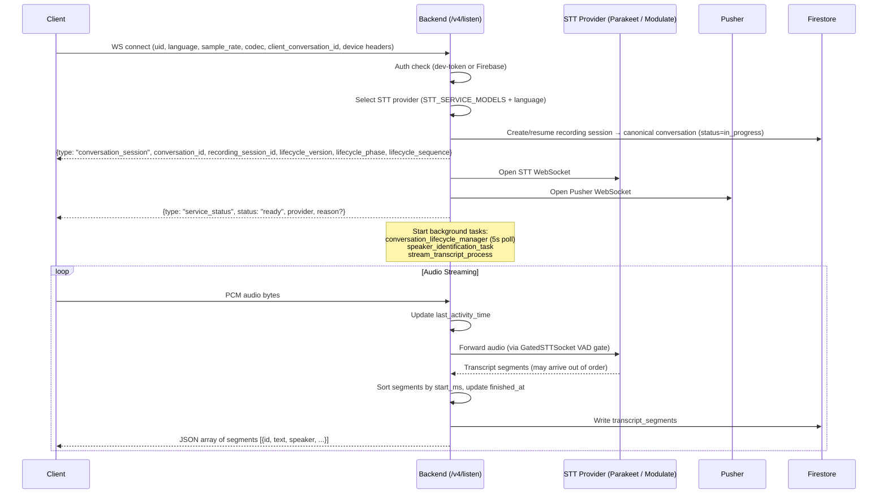
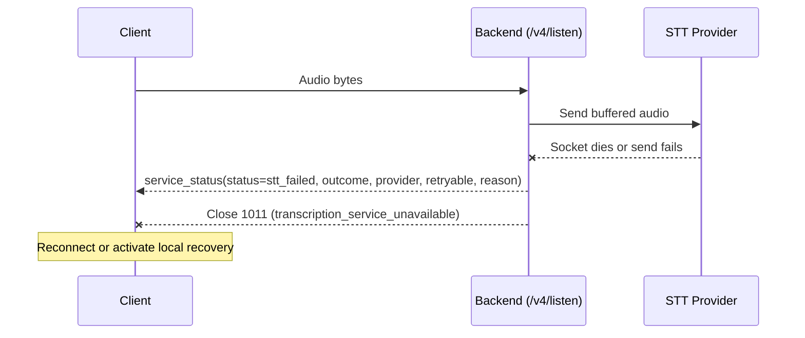
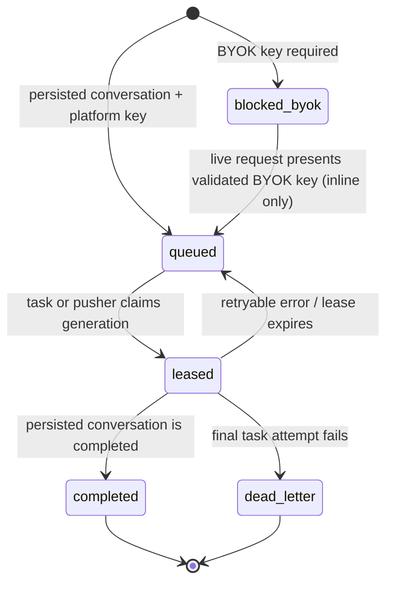
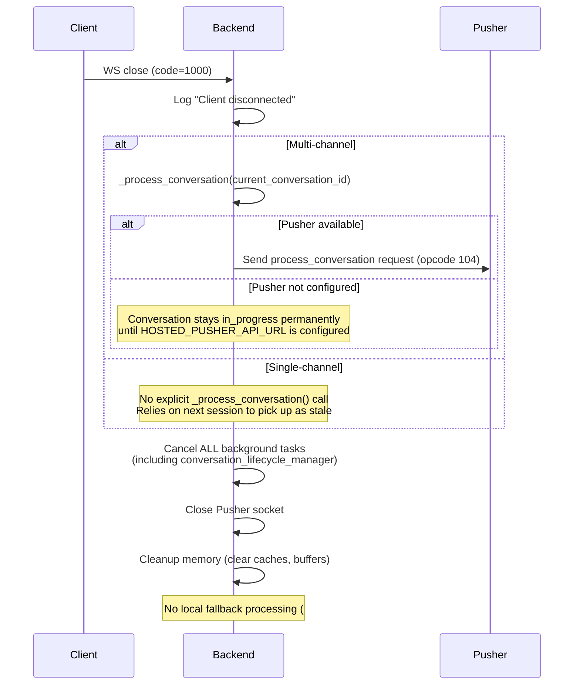
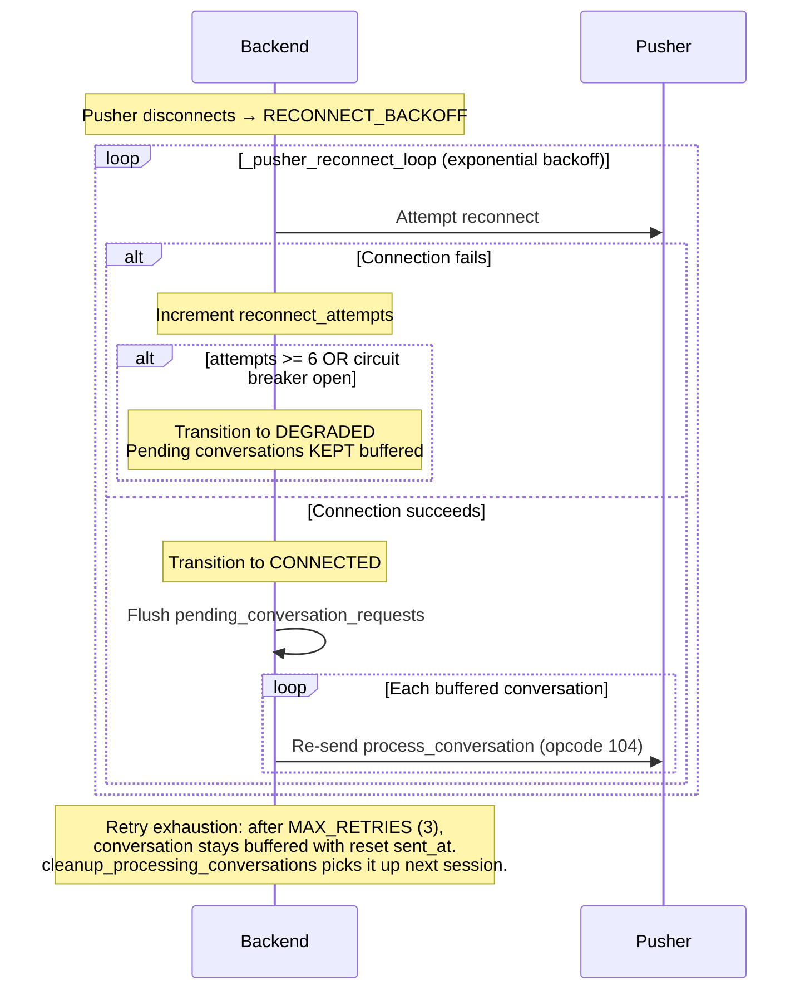
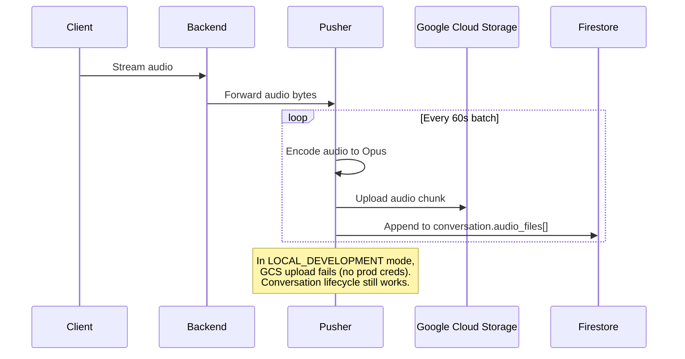

# Listen + Pusher Pipeline — Sequence Diagrams

> Last updated: 2026-09-30 (safety-WAL segments bind to their live rollover generation through `external_data.recording_origin_id`, staged by SYNC_LINEAGE_RESOLVE_UID_ALLOWLIST, kill switch SYNC_LINEAGE_RESOLVE_ENABLED=false; same-occasion smart merge at finalization (default on, kill switch CONVERSATION_SMART_MERGE_MODE=off); S1 capture-evidence exploratory dark write; live STT language profile, Soniox hints and conformance telemetry; optional Parakeet final-pass shadow; conversation-wide speaker resolution for sync-captured conversations; Cloud Run sync shares the diarizer ILB via `HOSTED_SPEAKER_EMBEDDING_API_URL`; cross-device overlap linked without discard at finalization; provider-scoped speaker identity and bounded clustering; durable meeting receipt; bounded client-kind propagation; end-of-conversation wake-word command adjudication; private conversation start-location provenance; explicit finalization capability admission; semantic release probes; identity-bound Pusher promotion receipts; bounded sync empty-retry with phase-attributed failure telemetry)
>
> These diagrams document the real behavior observed during E2E testing with
> live services (backend, pusher, STT providers, embedding API). Update when the
> pipeline changes.

The live calendar stamp includes the meeting title (an empty string when absent)
so it is a valid `CalendarMeetingContext` for finalization and summarization even
when its scheduled window makes continuity hydration unnecessary.

Live calendar-backed conversations with content retain their conversation across
silence until the stored `external_data.calendar_meeting_context.start_time` +
`duration_minutes` + 120 seconds of grace. The stored calendar event id owns this
window; screen-derived identity does not extend it, and meeting-treatment
eligibility does not gate it. Reconnect admission, continuation-pointer lookup,
and the active lifecycle loop use the same deadline. Source/device/lock partitions
and empty-generation deletion keep their existing checks; non-meeting recordings
keep the 120-second silence rule. The continuation transaction reads the complete
conversation metadata, including the stored calendar context, without decoding
transcripts; compressed rows use the durable `has_content` marker. If only an
existing calendar event id is available (partial meeting context, external
calendar event id, or a linked Google event), the same paths read that exact
`users/{uid}/meetings` document using the calendar source + event id natural key.
They never infer a meeting from an overlap query. Missing/mismatched records keep
the ordinary silence deadline; lookup faults emit fallback telemetry.

`PATCH /v1/conversations/{id}/assign-speaker/{speaker_id}` accepts optional paired
`start` / `end` query parameters in conversation-offset seconds. Only complete
segments inside `[start, end)` are assigned; segments crossing a boundary stay
unchanged. Range edits write segment-only manual receipts and never promote their
labels or rejections to a whole voice or a future rollover. Omitting the range
retains the existing whole-cluster assignment, including clearing older selected
overrides. Stable-id redirects select the range on the donor's original timeline.

The live path observes a run of at least ten distinct segments on one scoped
speaker plus three consecutive rejected voice matches. It emits one
`omi_live_speaker_collapse_total` increment and an `event=live_speaker_collapse`
log per run, with segment/match counts only. A different voice/provider scope or
conversation resets the observation; accepted matches reset the rejection count.
This signal does not change diarization, thresholds, provider choice or labeling.

Conversation responses project the internal receipt's `capture_evidence.coverage`
into optional `capture_coverage` (`mapped` / `incomplete` / `unknown`). Internal
source-position receipts remain excluded from the wire. Mobile conversation
detail shows the localized “Partial recording” chip only for `incomplete`; legacy,
unknown and mapped rows stay quiet. No conversation-list placeholder is added.

Phone safety-WAL uploads may carry the client recording id and audio interval.
Listen creates a new server recording id and conversation on a silence
rollover, while the phone tags all WALs with `client_conversation_id`, stored
on each live generation as `external_data.recording_origin_id`. Sync binds each
VAD segment to the one generation whose source, device, lock and interval
(5 s early, 60 s past its last word) hold it; donors resolve to their survivor,
and a strictly contained multi-canonical overlap decides in a fixed order — the
phone's stamp among rows a visible (not deleted, not discarded) covering
canonical proves, then the single canonical backed by a validated committed
live run covering or exactly adjoining the segment's decoded source frames
(ownership evidence only; the segment is still transcribed), then a lone
visible canonical — otherwise the segment keeps no target under
`ambiguous_pending`, rechecked against a fresh lineage read at most three
times before the retryable
failed-segment path — and straddles split. Missing or non-deciding frame
evidence (no decoded map, or none projected) is an ordinary abstain, not a
failure: two visible covering canonicals stay pending while a lone visible
canonical wins. Otherwise a segment keeps the phone's
`conversation_id` stamp or the unbound path, which never adopts a live row.
Bound segments lexically repeating a live window drop only when independent
source-frame evidence proves the repeat — a unique `sync_vad` receipt per
incoming segment whose touched frames the live row's `origin=live` snapshot
positively covers — or it is a same-capture exact retry: normalized identical
text at an identical absolute range or segment id, AND a shared nonempty
`sync:` scope with the stored line (a scope match alone never authorizes a
lexical drop); lexical or exact-range text alone never suppresses
(`SYNC_LINEAGE_LIVE_DEDUPE_ENABLED=false`, same allowlist). All-repeat uploads
acknowledge without writes or enrichment, and `SYNC_LINEAGE_RESOLVE_ENABLED`
off restores whole-batch binding. One level earlier, uploads carrying the
opt-in S1 source-position signal additionally trim source frames covered by a
committed live transcript proof before VAD/STT (`SYNC_WAL_AUDIO_COVERAGE_ENABLED`,
default on, same allowlist): only `committed_transcript_v1` envelopes authorize
trimming and receipt-only snapshots abstain, while the proof's receipt wall
anchors must independently reproduce the decoded WAL basename clock and
geometry within 2 s — a negative lifetime check that rejects stale or
competing reuse of a capture root rather than treating time agreement as
proof; recall stays conservative and very close cross-socket root resets
additionally rely on the independent app root-rotation release: kept frames become derivative WAVs under a
`.coverage/` sibling named by phone-clock offset — a kept interval may also
carry up to 0.25 s per side of already-received context frames (small bounded
duplication; non-contiguous captures are never concatenated) — while missing,
malformed, conflicting or out-of-bounds evidence retains the original audio,
and an upload without the claim costs no lookup. The lexical receipt matcher
stays disabled on this production seam — it is invoked with no WAL context
with which to prove live ranges — so only committed frame proof suppresses
audio; exact sync-scoped retries at intake remain unchanged, and the bounded
context margin conservatively preserves repeats. Derivatives are internally
marked `coverage_trimmed` so the 1 s VAD minimum admits genuinely new
sub-second slices; unmarked audio keeps the floor unchanged. The live-dedupe switch also gates the lineage
diagnostics added with it: on, a clean no-row lookup probes the recording id
once (`id_probe`, ceiling 16), each resolve line counts returned candidates
only, and stamp-fallback live appends bucket extent growth on `span_delta_bucket`
(`sync_lineage_append` or `sync_lineage_stamp_append`); off restores the main
query set and log format — no probe, no stage counts, no stamp-append marker
or line.
See `backend/utils/sync/ARCHITECTURE.md`.

Staged rollout: `SYNC_LINEAGE_RESOLVE_UID_ALLOWLIST` (comma-separated uids;
empty admits everyone) limits per-segment binding, the pinned live origin, the
live revision fence and the open-live enrichment deferral to listed owners; any
other uid behaves exactly as with the kill switch off, and the kill switch wins.
The listen origin stamp is metadata only and ignores the list, so widening finds
lineage stamped. Prod lists one uid on all five identical services (unset
admits everyone); dev leaves it unset. Refused eligible uploads log
`event=sync_lineage_resolve outcome=not_allowlisted` with no ids. The metric
comes from backend-sync, which is not scraped, so logs are the watch source.
`SYNC_LINEAGE_S1_REQUIRED` (default on; unset or blank on, explicit on-tokens
on, any unrecognized value including a typo off) additionally requires, inside
`lineage_resolution_requested` after the kill switch and the allowlist, a
complete validated S1 upload claim set for the exact uploaded basename set
under `CAPTURE_EVIDENCE_V1_DARK_WRITE`. Absent, invalid or incomplete claims
fall back to the pre-lineage whole-batch resolver even for admitted users, and
a post-decode mapping-count mismatch at the coordinator takes the same route
before VAD. Each refusal emits exactly one bounded
`omi_sync_lineage_resolve_total{outcome="s1_refused"}` increment and log line
with a closed reason (`no_claims`, `parse_failed`, `count_mismatch`,
`filename_mismatch`, `not_admitted`) and no ids, names or claim content;
claims rejected at the upload HTTP boundary reach the gate as `{}` and
classify as `no_claims`. Turning the gate off broadens eligibility back to the prior
ungated binding; it is not a lineage kill switch and never widens the
allowlist or bypasses `SYNC_LINEAGE_RESOLVE_ENABLED`. Prod declares `true` on
Cloud Run `backend`, `backend-sync`, `backend-sync-backfill` and
`backend-integration`.
Widen only after the 48 h log gates in `ARCHITECTURE.md`, then watch 24 h.
The full API `backend-integration` image also mounts sync and listen routes and carries the same gate. `desktop-backend` has a separate router set with neither site. Deploy renderers reject missing or divergent prod literals and chart drift. Persisted refresh debt from an admitted append survives narrowing without reappending speech; open live rows leave that refresh to finalization. Stage the chart before gated code, drain sync work across mixed writer revisions, and use only a compatible historical Helm release for rollback. See the deployment details in `utils/sync/ARCHITECTURE.md`.


The bounded lookup filters by both start and finish so an old stamp-extended
row cannot hide behind newer generations; a truncated overlap set proves no
binding. The read projects the lineage routing field paths only — widened to
each row's `capture_evidence` envelope solely when the tiebreak could decide
(safe-overlap admitted, dark write on, a decoded segment map present), under
the same document ceiling. With lineage enabled, sync defers enrichment for an open live row,
and fresh live speech advances the revision fence after sync has enriched it.
Sync preserves a pinned live origin when the WAL begins earlier; pre-pin
speech is retained but marked unplaced for playback. The index must include
`finished_at` as well as `started_at` before this query can serve; a missing
index degrades to the origin-row lookup plus stamp fallback.

The backend-to-Pusher binary protocol accepts only opcodes `100` through `105`.
Audio frames (`101`) require the four-byte opcode, an eight-byte timestamp, and
PCM payload; JSON opcodes require an object payload, with transcript, finalization,
and speaker-sample fields validated before they enter background queues. Malformed
or unknown frames close the session with a protocol error instead of reaching
application processing. The backend-to-Pusher WebSocket query also carries the
bounded `client_kind` resolved from the listen connection headers. Pusher forwards
that bounded value to webhook delivery and inline finalization journey metrics;
it never forwards a raw client header as a metric label.

Transcript, speaker-sample, audio-webhook, and private-cloud queues are bounded.
Buffered audio also shares a per-session byte budget, so variable-size payloads
cannot bypass item-count limits. A failed or cancelled backend-to-Pusher send
retains the pending item for reconnect replay; buffers are cleared only after the
send completes. Finalization opcode `104` carries the durable job id and dispatch
generation, and Pusher claims that Firestore-owned job before processing.

After a finalization lease is acquired, `finalizer.py` may admit a Parakeet
**shadow** pass before canonical processing. Admission schedules a tracked task
on the finalizer host: the pusher GKE pod for live WebSocket handoff, or
backend-sync Cloud Run for a Cloud Tasks retry. The listen backend dispatches
finalization and does not run this pass. Shutdown cancels the tracked coroutine;
an active worker thread can run until process exit, then be lost with no shadow
retry. Keep the Cloud Run
shadow flag off until a separate durable task exists. Admission does not await
STT. The pass waits for the 60-second pusher upload flush,
reads only registered private-cloud chunks, separates each blob at long runs of
digital silence, and transcribes up to 90-second Parakeet `/v2` windows on each
blob's own timestamp. A forced cut keeps 10 seconds of context so an utterance
crossing it can be recovered. The pass runs Omi speaker matching and
conversation-wide clustering, then compares the result with the streaming
record. It never edits the conversation or any user-visible transcript,
speaker, summary, memory, or translation. See
[`transcription-shadow.md`](transcription-shadow.md) for gates, metrics, storage,
and the known best-effort background-task limit.

## 1. Connection + Streaming + Transcription

### Segment-upload processing shape

Both `POST /v1/conversations/from-segments` and
`POST /v1/dev/user/conversations/from-segments` accept conversation source
provenance, including `workflow` and `external_integration`. Omitted or null
source defaults to `phone`. A session-id upload builds a stored `Conversation`;
an upload without a session id builds `CreateConversation`. Both summarize their
transcript segments regardless of the source label. Only an
`ExternalIntegrationCreateConversation` with integration provenance uses its
`text`, `text_source`, and `text_source_spec` fields for text-based processing.
Segment validation continues to return 422, and processing failures keep the
existing privacy-safe 5xx / BYOK 429 contract.

The STT provider is selected at session start via `STT_SERVICE_MODELS` env var
(e.g., `modulate-velma-2,parakeet`). The first provider whose deployed model
supports the requested mode wins: Parakeet's live RNNT model is English-only,
so multilingual sessions and non-English single-language sessions use Modulate.
Listen startup loads transcription preferences once and uses its
multi-language setting to request Modulate auto-detection, avoiding a second
user-preference read on WebSocket startup. The separately deployed Parakeet
batch model retains its multilingual capability. A client Parakeet preference
can prioritize Parakeet only when that live-model capability matches; it never
overrides the selected service/language/model tuple. All providers implement the
`STTSocket` ABC and are wrapped by the universal `GatedSTTSocket` VAD gate.

When `STT_ROUTING_MODE=shadow`, listen computes the cost-ordered, capability-
filtered primary against static selection and counts agreement without changing
connections. `on` applies that policy only to the stable UID cohort selected by
`STT_ROUTING_ON_PERCENT` (default zero). Fleet health is a binary gate on
classified provider errors and completed text, with shared
5%/25%/100% recovery trials. The existing Parakeet allocation hash and capacity
admission stay intact. Redis refresh/write work stays off connect with a 75 ms
default deadline; faults use local evidence and known benches, and router errors
restore the filtered configured order — for canary sessions that means the
permitted registry targets themselves (target IDs, endpoint breakers and
replay declarations intact, and only states carried by the cache outage demote
known restricted entries), for everyone else the filtered family chain — ramp-withdrawn or
account-quarantined targets are denied on every dial path, and an entirely
empty permitted set
raises a bounded chain-unavailable rather than dialing. No worst-provider
probes or score ranking remain in
the active router. Legacy first-text counters remain diagnostics rather than
additional health samples. Plain no-text and deadline-only outcomes are
censored: they neither bench nor promote. Serving/connect errors use a closed
provider-attributable reason set; later failures after a no-text diagnostic
remain observable. Failed recovery trials require the same failure-user
breadth as fleet benches; narrow failing cohorts retain their trial share with
bounded per-user voting windows, while healthy small cohorts can promote.
Promotion additionally needs 30/60 admitted outcomes from 10/20 distinct users
after a 300/600-second trial dwell on the Redis clock.
The cost-v8 evidence seam is `LiveLegOutcome.settle`: the serving decision
settles both source-leg fallback and router observation exactly once. A first
claim after client disconnect/inactive/shutdown excludes the death and preserves
prior text success; already claimed connected-client evidence remains valid. Liveness
reads and transport closes do not infer provider blame. Accepted provider deaths
and actual text have no VAD minimum. Receiver teardown is marked before tail
sends; idle/request timeouts, rotation, local capacity and audio/client causes
are censored. Connect rejection shares the accepted leg's outcome, without a
second writer. Pending hops settle on successor text, failure, cancellation or
owner close, with a 30-second telemetry-only degraded settlement bound.
Per-target healthy evidence admits three outcomes per UID fingerprint per
five-minute Redis-time window; trial user-vote rules remain. The bounded
settlements/observations counters must reconcile exactly; shared vote admission
and Redis write loss are separate metrics. Never-refreshed snapshots are NaN.
Health stages cannot empty an eligible chain;
all-degraded selection uses stage, observed provider error rate, then cost. The
terminal target keeps its full eligible share when no cheaper stage-100 target
can absorb the session. Explicit ramp/account/capability exclusions remain. Terminal
legs honor capacity signals and a five-second process-local cooldown after
`capacity_full`, without treating capacity as provider disruption. If every
candidate is capacity-blocked, one least-recently-refused candidate may dial
through its normal circuit/admission gate so a sole recovered target can serve.
Shared state is namespaced by deployment stage and a hashed endpoint/credential
identity (`cost-v8` cost and lease keys; `fleet-v2` splits endpoint-scoped
selection/probe/score keys from a credential-only account bench that survives
endpoint rotation); changed identity starts its scoped state fresh.
Endpoint attribution goes one level deeper: scores, selection benches and
probe leases partition by the actual serving endpoint, so evidence from one
custom registry endpoint never moves its siblings or the configured default,
while account quarantine stays credential-wide and dominates every sibling.
Endpoint connection breakers share that partition under a 64-identity bound
per process: the bound evicts only the oldest closed breaker, and while every
cached breaker is open or half-open a new endpoint identity is refused by the
same circuit/admission gate instead of resetting a live bench. Unlike the
shared Redis keys, the local selection-breaker identity excludes the
credential: rotating a key clears only account/quota state and retains an
unchanged endpoint's connect/serve outage evidence, while an endpoint or
stage change starts fresh scoped selection state.
While routing is off, connect snapshots report a neutral score and merge only
family account benches — selection benches and scores are ignored without
being erased. Per-language freshness is read for every bounded supported language at
each refresh — an unread language is unknown, not healthy.
Connect-refusal backoff is separate from account and selection-health benches:
three target-local 429/connect refusals within 10s cool the target for 2/4/8/10s.
If backoff suppresses every otherwise-admissible route before any real dial, one
earliest-cooldown-expiry target still receives a bounded attempt. A due probe
claims the exclusive probe slot; an early extra attempt does not claim that slot
or extend/escalate cooldown on refusal. Account, failed-target, capability,
window admission, and recovery time/attempt exclusions remain hard. The escape
emits the bounded connect-backoff `escape` event and shared fallback telemetry.
Global-stage pod cache views (including freshness/unknown state), scoped CAS
transition metrics, classified outcome counters and static/proposed pairs are
documented with exact PromQL in the runbook. See the [STT design](../utils/stt/ARCHITECTURE.md#cost-ordered-health-gated-live-routing)
and [live STT routing runbook](runbooks/live-stt-routing.md).

Router-promoted paid spillover validates each configured provider cap (integer
0–10000); malformed values deny promotion and preserve configured order with one
warning per provider per process. The recovery terminal-after-text alert aggregates
all `backend-listen-metrics` traffic, including stable and former-canary series;
the pinned recovery flag is enabled across production listen. See the
[routing runbook](runbooks/live-stt-routing.md#router-on-readiness-controls-default-off).

The adapter log statements routed through `sanitize_provider_error()` do
not echo raw provider or user text. Live-socket, batch, and auxiliary STT error paths
route exception strings and provider frames through
`sanitize_provider_error()`, which emits only a validated numeric status
(`code=`), a canonical diagnostic phrase or `[redacted]` (`diagnostic=`),
and a closed-set exception category (`exception_type=`), capped at 160
characters. Severity and the typed death/close classification are
unchanged — only the free-text payload is withheld, since provider bodies
can carry account details, signed URLs, paths, or transcript text even
when purely alphabetic. Raw provider text stays latched on `death_reason`
for classification and failover; router-boundary logging and rethrows
outside this patch can still surface it. The Deepgram SDK's own private
logging is unchanged.

Soniox streams final token deltas whose network-frame boundaries can split a
word. Its adapter retains the pending word across frames, preserving subword
text until whitespace, a speaker change, a gap of at least three seconds, or
the provider's `<end>`/`<fin>` marker establishes a boundary. A 4,096-character
limit bounds accumulation; non-final and translated tokens do not enter the
spoken transcript. Segment times use the provider's `start_ms` and `end_ms`,
minus speech-profile preroll, rather than extending to the next token's start.
Listen retains a normalized primary-language profile across failover. For a
non-English multilingual session, Soniox gets filtered primary-plus-English
`language_hints` while language identification remains enabled. A separately
allocated routing arm may try Soniox first; it falls through to the normal
provider chain on a failed connect. Push-to-talk, batch transcription,
multichannel, custom STT, and BYOK routing retain their existing behavior.
The Soniox adapter carries the agreed language of final
tokens as private metadata; the listen receiver removes it before persistence.

Audio-timeline v2 retains at most the configured segment-buffer limit in each
of its pending and unplaced fallback queues. If pending text fills the first
queue, new text enters the legacy transaction as unplaced, retaining its ID
and SEND conversation owner. A retry after an ambiguous commit filters IDs
already stored inside that transaction, plus the durable
`live_transcript_replay_receipt`: segment IDs absorbed by an earlier committed
merge no longer exist in the stored transcript, so the transaction also treats
the receipt's commit buckets as seen before planning the fresh batch. The
receipt is written in the same `transaction.update` as the merged transcript,
holds the newest two absorbing commits of at most 128 absorbed IDs each (256
total), is stored encrypted and zlib-compressed
independent of the document's data-protection level, and never leaves the
document — `prepare_conversation_for_read` drops it before any read response.
A pure replay or a write that absorbs nothing leaves the receipt
byte-identical; a replay that also carries fresh text keeps that text as its
own segments without rotating the buckets. A batch larger than 128 unique
incoming segments absorbs nothing so every supplied ID survives durably in the
transcript instead of overflowing a bucket. While a same-owner retry sits in
the unplaced fallback lane — whose wall-clock lag is unbounded — normal
absorbing writes for that owner defer back to the pending queue so they cannot
age a pending ambiguous ID out of the two-commit window; photos and other
owners still drain. Two commits cover the serial per-owner drain: at most one
ambiguous commit per owner can be unacknowledged behind the current batch, and
the extra retained bucket is conservative margin. The normal retry budget is
bounded (.5/1/2/4/8 s scheduled), while fallback lag is unbounded — the
same-owner deferral above, not a TTL assumption, keeps the window valid. A
document without the field has no historical absorbed-ID coverage; its first
absorbing commit starts the receipt. If both queues fill during a store
outage, admission raises an explicit capacity error and emits a metric; the
callback cannot buffer transcript indefinitely.

When VAD requests finalization, Soniox queues a `{"type":"finalize"}` text
control after accepted audio. Receive completion and synchronous `finish()`
flush the last committed word exactly once; asynchronous draining awaits that
callback even when the provider completion deadline expires. Off-loop finish
and finalize calls schedule their work on the provider loop. These contracts
are exercised in `tests/unit/test_soniox_token_boundaries.py`, including the
downstream transcript merge that inserts spaces between distinct segments.
The live transaction merges incoming words after applying current speaker
identity, so their `speaker_match_source` matches the saved tail. It still
reads manual speaker receipts inside the transaction before joining segments;
receipt-covered words remain separate.

The managed Soniox leg keeps active VAD gating: after speech it forwards the
four-second hangover, then withholds silence and sends a keepalive control every
10 seconds. A VAD boundary also queues `finalize`; the provider emits `<fin>`
after finalizing already received audio. Neither control carries PCM or adds a
send span. Soniox's [keepalive](https://soniox.com/docs/stt/rt/connection-keepalive)
and [manual finalization](https://soniox.com/docs/stt/rt/manual-finalization)
docs describe this lifecycle, but do not promise an exact timestamp shift across
a pause. Production final tokens observed 1–30 seconds beyond the cumulative
sent-PCM axis. This does not establish clock semantics: the default shadow
ledger reserves elapsed wall gaps only as a hypothesis, without registering
withheld audio as received. Compact placement stays authoritative. No PCM
silence is synthesized by the managed leg or adapter. Pre-roll and the hangover
are real receiver PCM and their spans are registered when admitted. Neither
keepalive nor finalize establishes that Soniox advances its audio clock.
The 5/9/34-second tests simulate the elapsed hypothesis; they do not prove
remote provider timing. A controlled timing probe remains necessary.


Segments buffered in `realtime_segment_buffers` are sorted by `start` time
before processing — this corrects non-deterministic WebSocket arrival order
from providers like Modulate whose internal parallelism can deliver shorter
utterances before longer ones.

Realtime mentor dispatch validates `MENTOR_PIPELINE=cohort` locally before
running `process_mentor_notification`, the shared paid/opt-in, buffering and
debounce admission. Only when admission returns conversation messages does the
cohort resolve the PostHog flag: `proactivity_v2` true dispatches the v2 mentor;
false, unknown or a flag error dispatches nothing (fail closed) — the legacy
mentor lane was deleted after v2 reached 100%. Any other env value invokes
neither path. The shared bounded flag cache, failure diagnostics and rollback
latency are defined in the
[proactivity v2 contract](proactivity_v2/CONTRACT.md#enablement-prerequisites).

Provider speaker labels are connection-local. Before a live segment enters a
conversation, listen stamps the actual `stt_provider` and an opaque
`speaker_id_scope`. The scope advances whenever the provider changes and is
new for every client reconnect. A conversation-local allocator hydrates the
persisted IDs, then maps `(speaker_id_scope, speaker label)` to the next small
integer `speaker_id`. Therefore Deepgram `SPEAKER_0`, Modulate `SPEAKER_00`, and
a reconnect that restarts either provider's numbering cannot share an identity.

The same boundaries also split one person into many ids: every reconnect,
failover, and uploaded sync chunk (`sync:{segment_id}`) restarts numbering, so a
3.6h pendant dinner measured 1874 ids for about five voices. Processing
therefore resolves speakers for the whole conversation before it summarizes
(`utils/conversations/speaker_resolution.py`, called from `process_conversation`
on every trigger). When every capture scope is a sync chunk, it embeds each
segment of at least 1s from the stored private cloud sync audio (each chunk blob
decoded on its own; merging chunks drifts where they overlap). Live scopes
resolve only under `LIVE_SPEAKER_SPAN_RESOLUTION` (default off): without it the
legacy gate still refuses live audio because `started_at` can drift minutes
from the arrival-stamped chunks; with it, each segment must prove placement
through sync chunks, the v2 marker, or a validated capture span (see
"Trusted capture-span placement and live speaker resolution" below), and
misplaced audio would merge the wrong voices. It caches the embeddings, encrypted, at
`audio/{uid}/{conversation_id}/speaker-embeddings.v1.enc`, so sync updates embed
only new segments and conversation/account deletion purges the cache with the
audio. `utils/stt/conversation_speakers.py` then clusters the embeddings
(average-linkage AHC at cosine 0.70, then fragments within 0.60 of a voice with at
least 30s of speech are absorbed into it; calibrated on real pendant audio against
the owner's voiceprint), matches each voice's pooled centroid against enrolled
voiceprints at 0.50 + 0.10 margin (pooled owner voices measured 0.24-0.33, other
voices 0.63+, so the per-clip 0.65 would name a companion the owner), and merges
voices that match the same identity. Manual receipts constrain it: a
labeled `speaker_id` keeps its id and is one voice with every other id labeled as
the same person; two different labeled identities never merge. Every covered
segment gets `speaker_id_scope = conversation:{id}`, `speaker = SPEAKER_{id}`, and,
for a voiceprint match, `speaker_match_source = conversation_voice`. The result
rides the normal processing write (fenced by `sync_content_revision`), and the
conversation's `speaker_resolution` tells clients whether ids are people:
`resolved` (above), `capture` (one scope, no audio: capture's ids stand), or
`unavailable` (restarted numbering and no audio: count no ids). Its
`participant_speaker_ids` are voices with at least 10s of speech. The stage fails
open onto capture's ids; `CONVERSATION_SPEAKER_RESOLUTION_ENABLED=false` disables
it, and `CONVERSATION_SPEAKER_RESOLUTION_BUDGET_SECONDS` (45) and
`..._MAX_EMBEDDINGS` (1500) bound one run, which resumes from the cache next time.
Every early exit records an anonymous reason (`no_audio`, `unaligned_audio`, or
`no_embeddings`) so a successful sync reprocess cannot conceal an unavailable
resolution. The Flutter transcript presents anonymous IDs as provisional when
the status is `unavailable`; those chunk-local IDs must not be displayed as
dozens of confirmed participants.

Pre-recorded STT results from providers such as Modulate and Parakeet are
normalized before they are written as transcript segments. Consecutive entries
from the same speaker may be merged when their gap is under 30 seconds, but no
normalized segment may span more than 30 seconds. A provider entry that is
already longer than 30 seconds is split into contiguous equal-duration slices
before merging — each slice is at most 30 seconds — and its text is distributed
evenly across those slices, so timestamps stay proportional to the text they
carry. A slice is never emitted without text: an entry with fewer words than
slices is split into as many slices as it has words.

Post-processing stores the normalized result under the `prerecorded` transcript
model and exposes that key through the transcript comparison API. The former
`fal_whisperx` collection is a legacy read path only and is not the active
post-processing output.

The mobile `/v2/voice-messages` route uses the same pre-recorded decode and VAD
boundary before it starts chat generation. If strict VAD finds no speech, the
SSE response ends with a typed `error:` frame whose error is `no_speech` and
whose outcome is `expected_silence`; it never completes as an empty HTTP 200.
The frame keeps the existing released-client-compatible prefix, uses a bounded
provider label, and does not record a chat-quota question because no visible
human message was created.

Every `/v4/listen` stream receives a durable, user-scoped `recording_session`
resource before it creates or resumes a conversation. A client-generated
`client_conversation_id` remains that resource's ID when present; legacy
clients receive a server-generated UUID. The optional
`conversation_role=meeting` marker is supplied by desktop after a
machine-observed call-start boundary; omitted or invalid values remain
`ambient`. That bounded marker is durable session provenance committed at
OPEN; finalization does not rewrite it based on how long the session lasted.

Meeting treatment is a separate finalization decision. A desktop meeting that
was neither discarded nor created by a maximum-duration rotation is eligible
only when its durable `started_at` and `finished_at` span at least five minutes
and its non-empty transcript covers at least 60 seconds of speech. Speech time
is the union of valid segment intervals, so overlapping microphone and system-
audio transcriptions of the same remote speech count once. The backend uses the
result to gate the meeting Chat receipt and records the verdict, reason,
duration, and deduplicated speech input on the durable finalization job. The
conversation document carries only a read projection. Desktop completion
notifications consume that projection. The synchronous desktop upload route
writes the same deterministic completed-job receipt and returns its projection.
Short or mostly silent calls still finalize as ordinary conversations, with
their original role and provenance unchanged.

The resource atomically binds the recording to exactly one conversation, so
reconnects return the original canonical mapping rather than falling back to a
user-global Redis pointer.

The backend emits a `conversation_session` event carrying that recording
identity:

```json
{
  "type": "conversation_session",
  "conversation_id": "<uuid>",
  "recording_session_id": "<client_conversation_id>",
  "status": "in_progress",
  "lifecycle_version": 1,
  "lifecycle_phase": "in_progress",
  "lifecycle_sequence": 0
}
```

`conversation_session`, `memory_processing_started`, and `memory_created`
carry the same versioned envelope. Clients must accept an envelope only when
the recording and conversation IDs match their local session and the sequence
is higher than the last accepted sequence. The phase is part of the contract:
`in_progress`, then `processing`, then a terminal `completed`/`failed`/
`discarded`. Older events without the envelope retain the legacy identity and
timestamp compatibility path only.

`RECORDING_SESSION_MODE=dual_write` is the safe default: it persists and
compares the durable binding while preserving the legacy proposed route on a
mismatch. `shadow` has the same routing behavior for validation-only rollout;
`enforce` promotes the canonical durable binding and rejects durable-store
failures. Mapping conflicts, stale-event discards, and legacy fallback paths
use shared fallback telemetry for the cutover gate.
The resource contains only IDs, phase, sequence, schema version, and
timestamps; it never stores transcript content, credentials, or raw WebSocket
payloads.

The same recording ID is always a retry of its original generation: after a
terminal result the backend returns that canonical binding and its terminal
envelope instead of rebinding it. A silence or status rollover on a live
WebSocket receives a fresh server-generated recording ID and can therefore
bind a new conversation without mutating the terminal generation. If an
empty-generation cleanup wins the Firestore transaction race against buffered
STT segments or photos, the late write is fenced rather than recreating the
terminal parent; the listen handler opens one fresh generation and replays that
buffer once. The first-segment `started_at` value commits in that same content
transaction, so this recovery cannot leave a timestamp-only write behind.

Deleting an empty generation also sweeps its private-cloud audio, but only
when that generation never registered any. Emptiness is decided from
transcript segments, photos and `has_content`; `audio_files` is deliberately
not part of the test, so a recording whose STT produced nothing while the
provider was failing still reaches this delete with real audio registered on
it. Those bytes are the last surviving copy of that recording and are kept, at
the cost of leaving a prefix under `chunks/{uid}/{conversation_id}/` that no
Firestore row points at any more — the bucket has no lifecycle rule there, so
retained audio is retained until something reclaims it deliberately. Only a
generation with no registered audio is swept, because nothing else could have
referenced those chunks. The decision reads the snapshot the delete
transaction actually removed rather than re-fetching the document: a fetch
beforehand races the pusher's own registration write, and losing that race in
the other direction would delete a recording that had just become
referenceable.

When the private-cloud flush writes `audio_files` onto a conversation that a
mid-session delete removes between the flush's existence read and its commit,
`update_conversation` reports the owner as gone (returns `False`) instead of
raising: the flush then takes the same stop-syncing path as any other deleted
owner rather than surfacing `404 No document to update` as an ERROR on every
remaining flush of the session.

## Capture-device provenance

Every capture client with WebSocket-upgrade header support sends
`X-App-Platform` and `X-Device-Id-Hash` on `/v4/listen`. The backend records
that provenance on the conversation stub, allowing extracted canonical
memories to participate in the **This device** filter. Browsers cannot attach
custom upgrade headers, so `/v4/web/listen` carries the hash in its required
first auth message; the backend fixes its platform to `web` before creating
the conversation. Missing provenance remains unknown rather than being
assigned to a different device.

## Duplicate captures across devices

An Omi device paired to the phone app and the macOS app in the same room open
two independent `/v4/listen` streams, and each stream owns its own
conversation — cross-source sockets never share one, because the two captures
can legitimately hold different audio (a pendant in the room plus a headphone
meeting on the laptop, #5388). Multi-device recording therefore stays fully
enabled on every client; nothing is toggled off.

The durable `finalize_persisted_conversation` service attaches an advisory link
once completion is persisted and the fanout claim is owned (including completed
replays). Sync/REST callers use the same helper after successful completion
persistence in `process_conversation`. `duplicate_capture.link_duplicate_captures` reads completed conversations
for the same user through the existing `(status, finished_at)` query/index. Different,
known sources qualify, and so does the same source when both captures share one
non-empty `client_device_id` (one physical device cannot record two different
conversations at once). An unknown device, or the same source on two devices, stays
separate. Neither side may be discarded, and both windows must be positive. Overlap must be strictly greater than 60 seconds and greater than 0.5 of
the shorter window. Override with `CROSS_DEVICE_DEDUP_MIN_OVERLAP_SECONDS` and
`CROSS_DEVICE_DEDUP_MIN_OVERLAP_RATIO` (finite, nonnegative; ratio at most 1).
These wall windows compare simultaneous capture, not user-visible content duration.

The longer capture is primary, with lexicographic document ID breaking duration
ties. Either finalization order can link the shorter capture, even when it finished
first. Same-source pairs do not receive this cross-device pointer; they are grouped
only when the shared-speech confirmation below passes. A transaction rereads both documents and fences deletion, discard, status,
source, or window changes before updating only the secondary's `external_data`:

- `duplicate_capture_of`: the existing primary-conversation pointer.
- `cross_device_duplicate`: `primary_conversation_id`, `method=wall_clock_overlap`,
  `overlap_seconds`, and `overlap_ratio` (relative to the shorter window).

Existing external metadata is preserved. A preexisting duplicate pointer is left
alone, making retries idempotent. The primary is untouched. Unlike #13703's earlier
content-similarity policy, overlapping capture no longer triggers auto-discard or
suppresses summaries/derived effects. Overlap is a possible shared meeting; distinct
or complementary speech remains independently available. `processing_conversation_id`
is a lifecycle identity and the meeting receipt is a treatment verdict, so neither
is repurposed as a cross-capture group.

**Capture groups (one event, several surfaces).** A window match only proposes a
pair. For up to six window matches per finalization, the helper re-reads the
other capture's decrypted transcript and measures shared speech
(`utils/conversations/shared_speech.py`). Word trigrams are compared, and
containment is taken against the smaller transcript. Confirmation requires
all three of these, each overridable:

- at least 30 words on each side (`CROSS_DEVICE_GROUP_MIN_WORDS`);
- at least 15 shared trigrams (`CROSS_DEVICE_GROUP_MIN_SHARED_TRIGRAMS`);
- containment of at least 0.25 (`CROSS_DEVICE_GROUP_MIN_CONTAINMENT`).

**Complementary containment (`CAPTURE_GROUP_CONTAINMENT_MODE`, default `shadow`).**
Sparse ASR substitutions and interleaved turns can break enough exact trigrams
to reject a complementary pair. The
containment detector (`utils/conversations/capture_containment.py`) covers that
complementary case: within the intersection of both wall windows it takes the
capture with fewer in-window words, aligns each of its `is_user` utterances
(8+ tokens) to a chronological bundle of one to three contiguous user segments
on the other side (both ends within 12 seconds, and each member must end no
later than the next begins), and accepts a pair only when
a bounded ordered longest-common-subsequence match covers at least 0.8 of the
utterance tokens and shares at
least two distinct adjacent bigrams. Overlapping same-track variants remain
competing candidates that can each be selected on their own; they are simply
never concatenated into one bundle. Only ordered subsequences count as
coverage — a fully reversed transcript still fails — while a partial reorder
keeps whatever ordered subsequence survives; this is not bag-of-words overlap.
The ordered LCS is optimal rather than the previous greedy difflib alignment,
so it can resolve some ambiguous token alignments more optimally; every
threshold remains shadow-mode and uncalibrated. A join additionally requires 40+ matched
words, 20+ distinct matched tokens, 3+ distinct matched utterances, 45+ seconds
of union duration of matched utterance intervals (not wall-span gaps), and
matched coverage of at least 0.8 of the smaller side — always exact matched
words divided by all in-window smaller-side words for the full population that
authorizes a join; only the shadow path extrapolates from the strided sample
described below. Every threshold is a deliberately conservative heuristic, not
calibrated on real account data. All inputs are bounded and every bound fails
closed with a specific label. The raw scan caps at 4,096 segments including
out-of-window text (`bounds_segments`); character and word totals
(524,288 / 64,000, `bounds_chars` / `bounds_words`) count only text wholly
inside the intersection, and valid out-of-window text is skipped before any
tokenization or accounting. Per-segment caps stay 2,048 characters, 128 words,
and 90 seconds (`bounds_segment_chars`, `bounds_segment_words`,
`bounds_segment_seconds`); candidate discovery fails at 16 bundles per
utterance (`bounds_candidates`). Layout violations report separately:
`layout_shape` for a malformed segment list, `layout_timing` for missing,
non-numeric or boolean times, `layout_non_finite` for NaN/inf or oversized
ints, `layout_out_of_window` for intervals wholly outside the capture window,
`layout_window_slop` beyond a ±2 s tolerance (within it, endpoints clamp to the
window), `layout_unplaced` for `audio_alignment` `unplaced` text, and
`layout_overlap_ratio` when one track's redundant overlap exceeds half its
placed duration — own-voice is one track, non-user tracks key on speaker id or
bounded spelling, and exact time+word duplicates dedup after the ratio counts
(one copy allowed, triples reject). Degenerate durations drop and count in the
clamped `dropped_segments` log field. Every in-window
string, including whitespace-only text, counts toward the character
budgets; missing or non-`is_user` attribution, malformed timing, and speech
outside the shared window are never evidence. Work per pair is additionally
bounded end to end: candidate windows are located by index lookups over the
sorted target starts rather than a full rescan, the two-shared-bigram half of
the acceptance conjunction (the pair still needs the 0.8 ordered-LCS coverage)
is evaluated before any alignment so lexically disjoint candidates never reach
the DP, and four pair-wide budgets — 4,096 bundle-check span attempts, 128
matcher calls, 16,384 summed compared tokens, and 262,144 summed LCS cells —
bound discovery and all alignments together, so even candidates that never
qualify cannot rescan the target; any projected overflow returns its specific
bound label (`bounds_bundle_checks`, `bounds_matcher_calls`, `bounds_tokens`,
`bounds_cells`) with no partial evidence. In `shadow` mode only, when the
smaller side carries more than 32 eligible utterances, the matcher inspects a
deterministic sample of at most 32 unique utterances strided evenly by
cumulative eligible word mass — quantile positions over the running word total,
including both endpoints, never a first-N prefix; repeated quantile hits on one
utterance retain their multiplicity as its coverage weight — and extrapolates
coverage as (sum of weight × per-utterance matched fraction / sum of weights) ×
(eligible/total in-window words); rejected matches contribute zero. When the
matcher inspects every eligible utterance, each weight equals the utterance's
word count and the estimator reduces to the original matched/total ratio. The
sampled coverage is a weighted heuristic estimate, not whole-transcript proof
and not a raw matched/smaller ratio. The numeric evidence keeps `smaller_words`
as the full in-window denominator while the matched fields count actual matched
words in the sampled utterances only. Modes: `off` runs nothing new, `shadow`
computes and logs the fixed content-free line
`event=capture_group_containment mode=… phase=… would_join=… reason=… jev_p=… basis=… dropped_segments=…`
(labels and numbers only — never transcript, identifiers, or errors), and `on`
authorizes the same `join_capture_group` writer with the detector's numeric
evidence and the existing expected windows and transcript fingerprints — but
only on a full-population decision: `on` never samples, so the matcher sees
every eligible utterance (the unchanged pair-wide budgets can still abstain),
the `basis` log label records `full` versus `sampled`, and the join condition
requires `basis=full` so a sampled estimate can never authorize membership. The
symmetric shared-speech path, its evidence, and its events are unchanged, and a
detector fault cannot inhibit it. The mode is declared `shadow` on all six
processing hosts — Cloud Run `backend`, `backend-sync`, `backend-sync-backfill`,
`backend-integration`, and GKE `backend-listen` and `pusher`. A successful Jev
same-scene shadow also logs a companion `phase=jev` line carrying the existing
score for per-flow comparison; it changes nothing in the Jev record.

The default-off `CAPTURE_JEV_SHADOW_ENABLED` experiment also submits up to six
overlapping pairs, including same-source and below-threshold pairs, to a bounded
background Jev worker after finalization. It records the shipped group outcome
and Jev's advice, and separately evaluates material re-summary when a capture
joins an existing group. It never changes membership or summary content. The
worker uses the existing trusted gateway lane, Redis daily caps, a uid cohort,
and a hard UTC expiry; see `docs/experiments/EXP-003-jev-capture-shadow.md`.

In production, unrelated pairs of the same user from different surfaces
peaked at a containment of 0.13 (p99), while pairs that heard the same speech
landed between 0.2 and 0.8. Confirmed pairs join one group through
`database/capture_groups.py`, which is the only writer of:

- `capture_group`: `id`, `primary_id`, `revision`, and `members[]` (`id`,
  `source`, window, numeric evidence), identical on every member.
- `capture_group_exclusions`: the conversations a person separated this one
  from.

The group `id` is minted independently of any member, so the primary (the
longest window) can move without changing the event identity. A capture joins
an existing group through any member. Two different groups are never bridged
by one pair. The group is capped at 12 members. Every member is re-read inside
the transaction, so a discard, a deletion, a separation or a window change
fences the join.

Processing writes (`upsert_conversation_with_lifecycle`,
`persist_processing_result_with_lifecycle`) strip `capture_group`, so a stale
in-memory conversation cannot clobber membership. Deleting a conversation
removes it from its group first. `POST
/v1/conversations/{id}/capture-group/separate` leaves the group stickily; a
pair dissolves when one member leaves.

Grouping is presentation metadata only. Transcripts, summaries, discard state
and derived effects stay per capture. Clients render one row per group from
the members they have loaded and keep every member reachable.
`omi_product_event_total{event="capture_group_joined"}` counts the outcomes:
`applied`, `none` (window match without shared speech) and `conflict`. A
failure records `duplicate_capture_check → separate_captures` and never blocks
finalization.

The candidate read is bounded to 100 rows ordered by finish time; dense histories
or delayed finalization may exceed it. Saturation and lookup/write/config failures
emit shared degraded fallback telemetry. Successful new links log only numeric
overlap measurements, never UID, document IDs, or transcript. There is no backfill,
no index migration, and no automatic clearing of historical discard flags or links.
UI grouping, transcript merging, multi-capture chain consolidation, and link
reconciliation after later user edits/discards remain follow-ups.


## Same-occasion folding across a silence split (smart merge)

The two-minute silence split can turn one occasion into several pendant
conversations. `utils/conversations/smart_merge.py` runs inside
`finalize_persisted_conversation` on both finalization hosts (pusher for the
live handoff, backend-sync for Cloud Tasks), only for `CAPTURE_END` jobs, after
the fanout claim is `claimed` and before duplicate-capture linking or any derived
effect. `CONVERSATION_SMART_MERGE_MODE` selects `merge` (the default when the
variable is unset or blank), `shadow` (decide and record, never merge) or `off`
(the kill switch: one env read, no I/O; an unrecognized value also means `off`);
`CONVERSATION_SMART_MERGE_UID_ALLOWLIST` optionally narrows the users.

The candidate is the newest visible conversation of the same source created
before this one, then the first row of the same device partition; a busy
immediate predecessor blocks the pair instead of being skipped. Deterministic
gates (source `omi`, recorded gap 120 s-60 min, speech gap at least 120 s, 25
words per side, no user-managed row, no wake word, no user-ended predecessor,
no custom-STT row, 3 h span, 4,000 segments, 12 fragments) run before one Jev question on the
`conversation_smart_merge` lane (3 s, one attempt). `p_same >= 0.35` merges;
any error keeps both. Every answered pair stores a server-only
`smart_merge_decision` (numbers and ids, no text) on the new conversation.
For a merge verdict, the decision is persisted before the absorb transaction
so a retry reuses the same score.

One more deterministic gate never reaches Jev: a discarded capture of the same
source and `client_device_id` whose `started_at`/`finished_at` interval
intersects the open gap — survivor `finished_at` to the donor's
`max(started_at, created_at)`, so the wall-clock rescue gap is covered too —
refuses the fold with `event=smart_merge decision=skip
reason=intervening_discarded`. Endpoint touches and rows wholly outside the
gap do not block, so a tombstone ending exactly at the survivor's finish still
lets future chains merge. One verified exemption: a deleted donor tombstone
that already redirected into this survivor, carries the donor ledger entry for
it, and is listed in the survivor's own fragment ledger or `sync_merged_from`
set is a constituent of the predecessor — its absorbed content is not an
independent discarded capture, and a drifted finish on it cannot fence the
survivor off forever. Every other discarded row, deleted or not, counts. The
scan reuses the same registered preceding query (and its
`conversations_discarded_source_status_created` index) with `discarded=True`,
no page limit, and a `created_at` upper bound of `datetime.max`, so barriers
older than the predecessor page still count and a capture whose ingestion
landed after the donor's `created_at` cannot hide — the gate never assumes
`created_at` ordering matches speech times.
The absorb transaction re-runs the identical interval check on its freshly
read rows before planning or any write, so a discard committed between the
decision and the absorb still rejects with the same reason. No flags or
thresholds changed.

`CONVERSATION_SMART_MERGE_WALLCLOCK_GAP_MODE` (`off` default, `shadow`, `on`;
unset/blank/unknown = `off`) relaxes the recorded/speech-gap window for one
narrow case: two rows proven to be generations of the same client recording.
Live creators stamp `external_data.recording_session_id` (per server rollover
generation) and `external_data.recording_origin_id` (the client's stable
recording id); proof requires both stamps nonempty on both rows plus equal
origin ids — generation ids are never equated — and the usual source,
device-partition and lock gates still apply. Under `on` the legacy gate runs
first and the wall-clock path is rescue-only: a pair the legacy gate accepts
keeps the exact legacy result (same reason, recorded and speech gaps, Jev
state and metrics as `off`), and the wall-clock check runs only on a legacy
skip. There the gap is `new.created_at` minus the newest fragment's own row
`finished_at`,
where "newest" is the maximum `finished_at` in the survivor's
`smart_merge.fragments` ledger (the ledger stays on the drifted speech axis,
so selection never trusts `started_at`). When that fragment is a donor
tombstone rather than the survivor, its full row is read once at decision
time — only when the rescue path actually runs — and re-read inside the
absorb transaction — reusing the flatten ancestry
read when possible — and the plan re-verifies lineage, wall times and span
against that fresh row, so a mutation such as a moved `finished_at` is
decided on the transaction's current data rather than the decision-time
read. The absorb transaction re-applies the same union rule — legacy pass
or wall-clock pass — so planning and the transaction cannot disagree.
Gaps of `0..3600` s are eligible, negative or malformed wall times get
the bounded `wallclock_gap_negative`/`wallclock_time_invalid` reasons, and
the 3 h span cap is measured on `created_at`/`finished_at`. The existing
`event=smart_merge` lines carry `gap_path=legacy` or `gap_path=wallclock`
under `on` (absent otherwise): the decision-time keep line names the gate
that admitted the pair at planning, while the absorb transaction's
merged/kept lines name the gate that admitted it on the transaction's
fresh rows. `shadow` keeps
the legacy verdict but asks Jev once with corrected timing for proven pairs
the legacy gate skipped, logging `event=smart_merge_wallclock_shadow` and
counting `omi_conversation_smart_merge_wallclock_shadow_total`. The setting
ships `off` in the shared base and `shadow` in both the dev and prod
overlays on all six smart-merge hosts (`backend`, `backend-sync`,
`backend-sync-backfill`, `backend-integration`, `backend-listen`,
`pusher`). No timestamp computation changes: `started_at` still anchors
rebasing and stored ledger fragments; only the decision-time gap and the
Jev state endpoints use server wall times. No further timestamp behavior
changes are intended here.

A merge keeps the earlier conversation's id. One transaction appends the new
transcript on the survivor's absolute timeline and turns the new row into the
sync bridge's redirect tombstone (`deleted`, `discarded`, `sync_merged_into`),
so the listen `memory_created` event for it carries `discarded=true`, detail
reads redirect to the survivor, and the survivor's deletion purges it. The new
conversation's own derived effects never run; the donor's search/vector rows
are retracted through the sync bridge seam, retained audio is copied when the
survivor keeps cloud audio, and the survivor is reprocessed once per merge
(`ProcessingTrigger.SMART_MERGE`) under a revision lease. A committed merge whose
cleanup or refresh fails fails the finalization attempt; every retry resumes the
donor, whatever the mode, before the fanout claim (which fences the discarded
donor and so closes the job), after checking its job epoch/generation/binding.
Stale or terminal jobs never resume. A failed refresh releases its unique invocation
lease; even same-job refreshes are exclusive. A processing receipt tied to both
merge and sync revisions lets a failed vector write retry without rerunning the
completed processing bundle. Deferred retraction keeps cleanup retryable. Late
repair WALs that target a donor append to its survivor (`utils/sync/assignment.py`). The absorb advances the survivor's
`sync_content_revision` to fence an older processor, and the refresh write
requires the current lease owner and revision.

`CONVERSATION_SMART_MERGE_FLATTEN_ENABLED` (unset or blank = on; only
true/on/1/yes enable it, everything else = off) lets a donor that already
absorbed sync-bridge ancestors merge: the same transaction re-points each
inherited tombstone one hop at the survivor, unions the ancestry into the
survivor's `sync_merged_from` under the twelve-fragment budget, and bumps each
re-pointed tombstone's `sync_content_revision` to fence in-flight receipts.
Any ancestor that is missing, foreign, malformed, cyclic, over budget, or
user-managed rejects the absorb with no writes; the decision-time
`sync_content_revision` snapshots fence a transcript that changed before
commit. An explicit sync target carrying `sync_merged_into` resolves in one
hop inside the assignment transaction only when the row is smart-merge
lineage (a smart-merge donor tombstone or a redirect to a smart-merge
survivor); ordinary sync tombstones keep the prior temporal fallback — a
deleted or discarded survivor supersedes, a longer chain or cycle conflicts —
so late uploads land on the survivor. Bridge cleanup and the flattened ancestors' transfer, retraction
and audio copy finish on the donor marker's persisted count even after the
flag is off. Absorbs and bounded rejection reasons count in
`omi_conversation_smart_merge_flatten_total`; the audit sibling carries the
content-free `flattened_ancestor_count` when the donor marker records one.
Apply the kill switch to the six hosts that run the finalizer or sync
assignment: Cloud Run backend, backend-sync, backend-sync-backfill,
backend-integration, and GKE backend-listen and pusher.

The same absorb transaction writes a content-free audit sibling,
`users/{uid}/smart_merge_audit/{donor_id}` (ids, decision numbers, model and
question version, ledger position; `expire_at` 60 days out with no TTL policy
active), outside every conversation cascade so the record of a merge survives
the survivor's deletion. Identifiers are bounded slash-free tokens; source, model,
question version and mode match server-known values. It costs two extra reads
(durable account-deletion marker and destructive-operation gate, only on the
absorbing path) and one extra write. Blocking/malformed authority or an invalid
projection commits the merge without the sibling. An authority RPC or audit
staging error rolls back and restarts the absorb without audit I/O; it never
continues on a transaction with a failed read. Merge policy stays unchanged.
`CONVERSATION_SMART_MERGE_AUDIT_ENABLED` (unset or blank = on; only
true/on/1/yes enable it, everything else = off) removes the extra I/O.
Apply the kill switch to GKE pusher and Cloud Run backend-sync, which host the
finalizer. Outcomes are logged as `event=smart_merge_audit outcome=...` and counted in
`omi_conversation_smart_merge_audit_total`; purged survivors are counted by age
since their last merge in `omi_conversation_smart_merge_survivor_deleted_total`.
This counts purges, including manual-merge source deletion, not user-confirmed
false merges. Account wipes/raw database deletes bypass this counter. The
`last_merged_at` stamp and deletion counter remain active when audit I/O is off.

## Conversation start location

Mobile clients may send one bounded `X-Omi-Conversation-Geolocation` header on
the authenticated WebSocket upgrade. It contains the position captured at
recording start, its capture timestamp/source, and optional accuracy. The
backend validates the coordinates and persists the snapshot on the initial
conversation document; it never logs the header. A last-known position is used
only when the client cannot obtain a fresh fix and the OS timestamp is no more
than 15 minutes old.

The same snapshot is stored with local WAL metadata and sent on a later
`/v2/sync-local-files` upload, so delayed/offline processing uses the recording's
own location instead of whichever user location happens to be newest. Existing
conversation location always wins. The 30-minute Redis user-location cache is
retained only for compatibility with older clients. Missing permission, invalid
coordinates, stale fixes, upload failure, and reverse-geocode failure all fail
open; raw valid coordinates remain usable even without an address.


```mermaid
sequenceDiagram
    participant Client
    participant Backend as Backend (/v4/listen)
    participant STT as STT Provider (Parakeet / Modulate)
    participant Pusher
    participant Firestore

    Client->>Backend: WS connect (uid, language, sample_rate, codec, client_conversation_id, device headers)
    Backend->>Backend: Auth check (dev-token or Firebase)
    Backend->>Backend: Select STT provider (STT_SERVICE_MODELS + language)
    Backend->>Firestore: Create/resume recording session → canonical conversation (status=in_progress)
    Backend-->>Client: {type: "conversation_session", conversation_id, recording_session_id, lifecycle_version, lifecycle_phase, lifecycle_sequence}
    Backend->>STT: Open STT WebSocket
    Backend->>Pusher: Open Pusher WebSocket
    Backend-->>Client: {type: "service_status", status: "ready", provider, reason?}

    Note over Backend: Start background tasks:<br/>conversation_lifecycle_manager (5s poll)<br/>speaker_identification_task<br/>stream_transcript_process

    loop Audio Streaming
        Client->>Backend: PCM audio bytes
        Backend->>Backend: Update last_activity_time
        Backend->>STT: Forward audio (via GatedSTTSocket VAD gate)
        STT-->>Backend: Transcript segments (may arrive out of order)
        Backend->>Backend: Sort segments by start_ms, update finished_at
        Backend->>Firestore: Write transcript_segments
        Backend-->>Client: JSON array of segments [{id, text, speaker, ...}]
    end
```

### Connect-time audio format admission

`validate_audio_format` (`backend/utils/transcribe_decisions.py`) runs before any
decoder or buffer is built. `sample_rate` must be one of 8000, 11025, 12000,
16000, 22050, 24000, 32000, 44100 or 48000 for every codec (opus narrows that
to opuslib's set, and bare `lc3` is refused); anything else closes the socket
with 1003. Released clients send 8000 (the query default, pcm8), 16000 and
48000 (phone calls). The query value sizes per-session buffers, so an
unbounded rate could allocate gigabytes and OOM-kill the listen pod;
`AudioRingBuffer` also caps its own capacity at 48 kHz as a second guard.

### Speech-profile onboarding handshake

Question-based speech-profile sessions connect with `onboarding=enabled`. After
the mobile listener is subscribed, it sends `{"type":"start_onboarding"}`. The
backend answers with question index `0` and treats duplicate start messages as
no-ops, so the first prompt cannot be emitted before the client is able to
consume it. Subsequent answers or `{"type":"skip_question"}` advance the same
server-owned question index.

### Live STT observability

For backend-provider `/v4/listen` sessions, `omi_live_stt_accepted_total`
increments when the listener receives its first nontrivial audio frame. A
successful terminal is emitted only after a nonempty transcript has been
delivered to the client WebSocket. Provider failures finish the same attempt
through `terminate_live_stt_session`, preserving their bounded failure phase;
other attempts that end before delivery are classified during teardown as
`failure` or `cancelled`.

Inbound codec decode failures drop that WebSocket frame and leave the session
open. `omi_listen_audio_decode_failures_total{codec,client_platform}` counts
each dropped frame with bounded labels. The receiver writes the first failure
with payload byte count, declared codec, sample rate, bounded source and platform, then one
`listen_audio_decode_streak_exceeded` event after 50 consecutive failures;
neither log includes audio bytes or transcript text.

These metrics use only the closed `provider`, client `platform`, deployment
environment, outcome, and phase labels. They do not include transcript content,
user IDs, model revisions, or other high-cardinality request data. Custom-STT
sessions are excluded because the backend does not own their provider socket or
provider attempt lifecycle.

`omi_stt_language_constraint_total` counts the actual forced, hinted or auto
mode at each adopted live connection. `omi_stt_output_language_segments_total`
counts in-profile, out-of-profile and undetermined finalized segments by
provider, bounded primary group, routing arm, and declared/learned profile source. Soniox final-token language
and an optional Velma final-utterance language take priority; otherwise the
receiver detects from at most 512 characters of segment text off-loop with a
24-letter minimum and 0.95 confidence floor. It logs one `live_stt_language_summary` at session close
with codes and counts only. No transcript text reaches these metrics or logs.
With `STT_LEARNED_LANGUAGE_PROFILE`, session close also schedules a bounded
20-session per-user code-count update. At least three sessions are needed before
the learned set routes a multilingual session; failures fall back to the declared
prior without stopping transcription or teardown.

Session-level headline SLI (2026-09-26): teardown also emits exactly one
`omi_live_session_transcript_outcome_total{outcome}` per backend-STT session —
`transcribed` once any nonempty transcript batch reached the client,
`no_transcript` otherwise (STT-terminal sessions never get the short-session
excuse), and `too_short` for clean teardowns of sessions with under ~10 s of
audio or zero VAD speech. The unit is one accepted WebSocket, so a client
reconnect counts once per socket. Per-provider traffic lights complement it at
the connect seam: `omi_stt_provider_connect_total{provider,outcome,
error_class}` (recorded on both the legacy order and the configured chain),
`omi_stt_provider_circuit_open{provider,kind}` mirroring the process-local
breakers, and `omi_stt_provider_retired{provider}` exporting the deployment's
`STT_RETIRED_PROVIDERS` (default `deepgram`). See
`backend/docs/operational/windowed-live-stt.md` for the alerts.

The new live-STT recovery behavior described below — enlarged replay retention,
paced prefix replay, the recovery controller, and its metrics — is gated by
`STT_FAILOVER_RECOVERY_ENABLED`, which defaults to `false` in code and remains
`false` for dev listen; prod listen chart/runtime values set it to `true`.
The mode is pinned once at session start; in-flight sessions
and successor legs keep it even if the environment changes, so toggling the
variable only affects new sessions (or replacement pods). When off, sessions
run the pre-recovery paths: the 135-second capture cap and legacy reconnect
budgets, plain `asyncio.Queue` provider send queues without writer pacing, the
legacy finalize/EOS order, and legacy circuit rejection semantics; the new
recovery metrics register but stay at zero. When on, including prod listen
after the stable Helm rollout, the recovery paths below apply. See the rollout
gate in
`backend/docs/operational/windowed-live-stt.md`.

Recovery-armed initial paid legs and recovered successors use the independent
paced tail, including when the replay prefix is empty. Its supervised pump
waits for bounded send-queue headroom; capture and disconnect observation
continue while wire delivery waits. A stalled writer still times out within
the adapter's two-second queue bound. On later failover without a window replay
ring, the old wrapper transfers its unwritten tail to the next successor before
abort, preserving capture timestamps and debiting confirmed writes. This path
retains the 26-second tail admission cap and 28-second packet residence bound;
overload/expired backlog keeps the existing failure/skipped-audio accounting. A synchronous enqueue that latches a typed
capacity failure retains that cause; it does not open a provider-outage circuit
as `send_failed`. Flag-off sends retain their original behavior.

A client disconnect with code 1006 is a cancellation unless separate terminal
STT or runtime failure evidence exists. Recovery's graceful drain eligibility
is separate from that label. Any-text attempt success is irreversible, so later
STT loss needs a session-close gate; see the comparison notes in
`backend/docs/runbooks/listen-stt-careful-rollout.md`.

For an allocated windowed-TDT session, listen retains a bounded 90-second
capture-positioned PCM ring. Delivered window segments advance its finalized
sample boundary. If the socket dies after accepting audio, the receiver starts
the replacement provider epoch at the first unfinished sample and replays that
audio before sending the current unsent chunk. Replay uses 1x audio-time pacing,
a 20-second prefix budget, and a 5-second setup bound. Its armed audio slot
absorbs sub-frame timer oversleep without accumulating drift; a slip of one
frame or longer discards missed-slot credit instead of bursting. A longer unanswered ring
is cut to its newest 20 seconds with a bounded skipped-seconds metric; this
explicit cut is not an emitted-text safe trim. Live ingestion continues into a
bounded 26-second ordered PCM tail, which drains before EOS on departure;
undelivered teardown cuts are metered. A replacement adopted while the
client is closing inherits the drain before its tail pump starts, still
inside the original shutdown deadline. On recovery-armed sessions an ordinary
client disconnect owns one absolute shutdown deadline: the receiver keeps
already-connected prefix and tail delivery, queued wire writes, EOS, and final
provider callbacks inside a 28-second delivery budget, then allows up to 2
seconds of bounded cancellation/abort cleanup, while the transcript consumer
stays alive until the bounded STT drain completes so last provider callbacks
persist before finalization. That overall ~30-second bound is shared by the
monitored persistence drain and the cancellation-acknowledgement wait on the
session supervisor, and teardown plus conversation finalization always run
afterwards; flag-off sessions keep the legacy supervision order unchanged. See
the replay pacing and latency contract in
`backend/docs/operational/windowed-live-stt.md`. A full ring triggers failover
before an unfinished sample can be evicted. The replacement epoch stitches
provider-local transcript times onto the original capture sample axis.
Parakeet's `/batch/metrics` exports total and live-lane pending count and oldest
queue wait. Listen resolves every ready GPU pod through the chart's headless
Service and polls them off the session-start path. A replica is busy at four
live requests pending or 0.75 seconds of oldest live wait; admission uses the
busy-plus-unknown share of the ready pool. Per-replica last-good live samples
survive a failed poll for at most 15 seconds.
Admission requires the configured minimum and a strict majority of ready replicas
to report fresh telemetry; busy plus unknown replicas reaching half the pool
stands down. A single hot pod in a larger healthy pool does not deny the fleet.
DNS failure and lost quorum still stand down; admission performs no I/O. The
window POST explicitly marks its live lane; unmarked requests remain backfill.
Each live POST also carries `X-Omi-STT-Timeout-Seconds`, the caller's remaining
POST budget sampled at local STT-semaphore admission. The service converts it
into a monotonic queue deadline — request start plus the lesser of the supplied
budget and an 8-second cap, defaulting to 8 when the header is absent; a
malformed, non-finite, or non-positive budget is rejected 400 before the upload
is written. Queued live requests are pruned when the caller cancels or the
deadline expires; owned uploads are unlinked only while still pending, since a
dispatched batch owns its files until GPU completion. An expired queued request
fails with a bounded 503 counted as a `queue_timeout` lane refusal. That expiry
is signalled on the wire with `error: 'queue_timeout'` in the JSON body and an
`X-Omi-STT-Error: queue_timeout` response header. Listen classifies only that
exact signal — a 503 carrying the header — as a `capacity_full` window death
with the bounded `queue_timeout` capacity subtype, so queue expiry fails over
without recording a serve circuit strike or inspecting the body. An unmarked
503 keeps the existing `provider_5xx` behavior. Old listen ignores the new
signal and records one serve failure for the 503, immediately opening its
process-local Parakeet serve-error circuit and failing over; it retains the
false-provider-failure risk until upgraded. New listen against old Parakeet
sees no marker and preserves that existing behavior. Deploy listen first, then
the Parakeet image through the existing `gcp_parakeet.yml` workflow, to avoid
introducing signalled queue expiry while old listeners remain. Backfill
requests ignore the header and never carry a deadline.
Within the 20-second replay audio budget, a partial replay retains un-emitted audio, including bytes accepted by
a replacement that dies before returning text, for the next vendor leg. The
ring continues across downstream providers; emitted capture positions trim it.
A failed replacement is excluded by its actual provider, including a rejection
at the final health check, and the receiver tries the remaining eligible chain.
Callbacks from an epoch retired for replay are fenced, including callbacks
queued on the listen loop, so the failed epoch cannot duplicate replayed words.
The retained window span bypasses downstream VAD gating and finalize signals
during replay: speech admitted with window gain cannot be discarded by a
different downstream VAD decision. Ordinary sends keep their existing gate.
Each adopted replacement gets 15 seconds of new capture headroom while it
processes a potentially full source backlog. The bounded target-and-time
recovery controller (unique targets within the shared episode) bounds
retention at 150 seconds; stalled un-emitted audio still fails over
before eviction. This ceiling grows from the original 90-second ring only
while a replacement is handling its replay obligation. As soon as transcript
progress leaves at most 75 seconds of capture, the cap returns to 90 seconds
without evicting pending audio, leaving the full 15-second headroom free.
A later replacement can reserve headroom again.
The ring survives until session teardown, but emitted text continuously settles
its contents; healthy continuous speech normally retains only its current tail.
150 seconds of mono PCM16 is 2.4 MB at 8 kHz, 4.8 MB at 16 kHz, or 14.4 MB
at 48 kHz. With the ordinary 30ms flush floor, owned Python ring objects add
about 0.565 MB per ring. At 60 sessions/pod and three post-failover sessions,
the conservative 16 kHz planning allowance for these changes is about 16 MiB of added
RSS (14 MiB of measured owned ring objects, plus shadow VAD and allocator margin). This is additional
to the old post-adoption path, which cleared the ring; it is not merely the
45-second increase. Provider queues and model memory are separate allocations.
Replacements with ordinary VAD disabled use a shadow gate
for replay accounting only: every byte is still forwarded, and it introduces
no finalize signals. Settled silence retains the same recent 15-second tail
instead of filling the ring on an otherwise healthy idle replacement.
Downstream capture-progress bookkeeping activates when each window-origin
replacement is created, even if the preceding epoch has fully settled the ring
and its replay snapshot is empty. New speech still remains pending until that
replacement emits text; silence trimming cannot discard it. A session that
never fails over does not track that extra progress.
`testing/bench_live_leg_send.py` compares real class implementations against a
pinned pre-PR Git revision using identical synthetic PCM and deterministic
dependencies; vendor I/O and ONNX inference are excluded. Its `--ring-memory`
mode measures retained ring objects at the normal 30ms flush floor.
Window POSTs mark their
request so `parakeet_prerecorded_requests_total` excludes live canary errors
while covering the batch path used by sync backfill.

Previously `stt_live_session ... outcome=exhausted` meant an individual
replacement hop died before producing text, even when selection continued.
These failed hops now emit `degraded` when another candidate is being tried;
`exhausted` is reserved for no remaining replacement path. Budget/auth deaths
map to `quota`/`auth`; other typed deaths (and untyped closes) map to `other`,
with a bounded log-only `subtype` (`modulate_serve_error`, `connection_lost`,
etc., or `untyped`). The shared fallback metric dimensions remain unchanged.
Only an actual failure to find a serving replacement terminates live STT,
emitting `stt_failed` and closing the client WebSocket with 1011; recovery then
requires a client reconnect. Configured and circuit-open candidate skipping
continues to be enforced by the connector.
A process-local full window and its five-second capacity cooldown are skipped
in static/shadow serving as well. A refused or circuit-open Parakeet primary
cannot block the remaining non-account rescue leg. Terminal rebuild failure
is latched under the receiver lock; replay-ring pressure uses the same
idempotent client-close path as an ordinary send failure. Queued audio and
monitor observations therefore cannot repeat an exhausted chain.
A managed session may make one additional Soniox connection after that leg's
previous transport loss (`connection_lost` or `send_failed`), only when its
local circuit is closed and no untried configured Deepgram rescue is available.
The failed window never re-arms. Rebuilds share the bounded target-and-time
recovery controller rather than counting distinct providers. Each 60s
episode ends on the first nonempty successor transcript or, for an adopted
but silent successor, on five continuous seconds of observed-connected dwell
after adoption; the connected-dwell proof clears only the deadline — pending
leg settlement still requires real text or the terminal path. A successor
dying before either proof keeps the original episode's remaining budget;
one dying after the release opens a fresh 60s episode, and a session is
bounded to twenty such episodes. The unique-target ledger, dial count, and
that single Soniox re-entry grant span all of a session's episodes.
Concurrent last-resort handshakes retain the configured circuit probe limit.
A session waits at most 12 seconds for an occupied non-account probe slot;
account benches and window shedding are never forced. At the 300ms default
liveness grace, 35 otherwise healthy serialized handshakes take about 10.5s,
excluding provider connection latency. Actual completed text still determines
recovery. Exhausted STT fallback children are exposed at zero on process start,
so a first burst after the first scrape is visible to Prometheus `increase()`.
Late upgrade rejection recovery also applies to control sessions that started
on Soniox or Modulate: an eligible next provider is attempted before terminal
closure. These sessions do not have the window replay ring, so preserving their
un-emitted cross-provider tail remains outside this change. A follow-up would
need a replay ring and emitted capture accounting for all managed sessions;
60 filled 90-second PCM16 rings at 16 kHz require about 165 MiB of payload
(about 186 MiB including normal ring objects), before allocator and VAD costs.
Before the first window transcript, 12 seconds after the active speech episode
starts or four consecutive empty speech-containing POSTs ends the Parakeet leg.
A fully answered-empty episode with less than one admitted second and at least
five trailing capture-silence seconds cancels that deadline and resets the
empty streak. New speech starts a fresh 12-second budget; unresolved audio or
an episode of one second or more retains its original deadline. The death path
replays all untranscribed capture from the 90-second ring to the next vendor;
the failed provider is excluded for that session. After first text, window
formation and emission continue without this startup bound.

The same authoritative attempt emits fail-open PostHog product events:
`Transcript Started` at first nontrivial audio and exactly one of `Transcript
Completed`, `Transcript Failed`, or `Transcript Cancelled`. Those events carry
the durable recording/conversation IDs, selected provider/model/language,
bounded source/platform, terminal phase, and session duration. The user
ID is used only as PostHog's `distinct_id`; transcript content and raw provider
errors are never included.

The separate `Listen Socket Zero Transcript` product event is diagnostic, not
the outage denominator. It is coalesced per UID in a five-minute process-local
window, carries only a 16-hex SHA-256 recording correlation plus the coalesced
count, and is bounded to 10,000 recent UIDs. Every socket still increments
`omi_live_session_transcript_outcome_total{outcome="no_transcript"}` before
coalescing; that Prometheus series remains the authoritative outage signal.

### Dev-only parity-pack capture

For local conformance debugging only, the listen runtime may write a restricted
local cassette. It starts after listen has selected its STT service and accepts
only an exact Firebase UID from `OMI_PARITY_PACK_ALLOWED_PRINCIPALS`. Capture is
off unless all of `OMI_ENV_STAGE=dev`, `OMI_PARITY_PACK_CAPTURE=1`, and an
absolute, outside-repository `OMI_PARITY_PACK_ROOT` are present. No Helm or
production setting enables it.

When enabled, the receiver records decoded client PCM (including each
multi-channel PCM stream), successfully forwarded STT audio, and provider
transcript callbacks. The runtime persists the anonymous cassette during
teardown. Events and raw audio retained in memory are bounded (1,000 events or
8 MiB of audio); once either limit is reached, remaining capture events are
dropped. Capture initialization, observation, and persistence errors are
isolated from the listen path.

### Terminal STT provider failure

Provider initialization failure, a latched dead provider socket, or an audio
send failure is terminal for the current client WebSocket. The backend first
awaits a bounded `service_status` event (`status=stt_failed`, semantic
`outcome`, provider, retryability, and one of the documented reason codes), then
closes the client with code 1011 and reason
`transcription_service_unavailable`.

The send boundary clears its local audio buffer only after the provider socket
accepts the chunk. On failure, the bytes remain in that buffer until normal
session teardown frees it; they are never cleared while the client connection
stays open and appears healthy. The client close is the recovery signal for
mobile and desktop reconnect/fallback logic. The backend deliberately does not
replace a provider socket in-session because maintaining transcript timestamp
continuity across that handoff requires a separate state model.

#### Provider re-admission pacing (serve-error bench)

A provider that dies mid-session (a typed serve error, e.g. Modulate/Velma
`modulate_serve_error`) benches its process-local selection circuit
(`utils/stt/provider_resilience.py`). The bench **escalates**: each further
serve death in an unbroken benching cycle doubles the window from the
baseline (180s default) up to 8x, and the ladder resets only on a full close
(a probe that actually served). While such a bench stands, re-closing the
breaker requires **serving evidence** — the probe session delivering a
transcript segment or the provider's done frame (`SafeModulateSocket`
health callbacks, attached by the connect seam) — never the 0.3s
post-connect liveness grace alone, which a doomed stream passes before the
fault kills it. The `/v3/speech-profile/stt-availability` pre-flight answers
from the same breaker, so an escalated window also extends the "primary
down" answer clients see; it flips true the moment the window lapses.
Operational detail: `backend/docs/operational/modulate-serve-error-bench-escalation.md`.


```mermaid
sequenceDiagram
    participant Client
    participant Backend as Backend (/v4/listen)
    participant STT as STT Provider

    Client->>Backend: Audio bytes
    Backend->>STT: Send buffered audio
    STT--xBackend: Socket dies or send fails
    Backend-->>Client: service_status(status=stt_failed, outcome, provider, retryable, reason)
    Backend--xClient: Close 1011 (transcription_service_unavailable)
    Note over Client: Reconnect or activate local recovery
```

## 2. Conversation Lifecycle (Silence Timeout Path)

This is the normal path when the client stays connected but stops speaking.

Desktop can persist a transcript-only conversation as `processing` with
`deferred=true` and postpone LLM enrichment until the first open. That first
open claims the row with a Firestore transaction that clears `deferred`, sets
`status=processing`, and renews `processing_admitted_at` together. The flag is
the ownership fence: concurrent opens cannot both launch enrichment. If
enrichment fails, the lifecycle service atomically publishes
`status=completed, deferred=true`; the UI stops polling, and a later open can
claim the row for one clean retry. Routers must not split either transition
into independent field writes.

**Key design rule (#6061):** Listen NEVER processes conversations locally.
All conversation processing routes through pusher or the dedicated durable
finalizer worker. Before either handoff, listen persists a Firestore
finalization job. The legacy live pusher path claims that same job and
transfers it to pusher process-scoped ownership, so closing the originating
listener after the opcode-104 handoff cannot cancel it. When the durable
dispatch flag is enabled, Cloud Tasks wakes the worker using only the opaque
job id and generation. `pending_conversation_requests` remains a low-latency
reconnect aid, not the durable source of truth.

Pusher is therefore a canonical-memory mutation host, not only an audio relay.
The deployable-to-capability roster in
`backend/scripts/runtime_env_capability_contracts.py` declares every host that
can run persisted finalization. Runtime-manifest validation rejects a missing,
unknown, or disabled memory mode for those hosts, and Pusher repeats the same
static admission check at process startup before it serves traffic or starts
background work. A deploy that omits `MEMORY_ENABLED=on` is invalid even when
its image, readiness probe, and WebSocket protocol are otherwise healthy.

Before a job can become `completed`, the finalizer atomically claims a durable
fanout boundary with a persistent idempotency key. It passes that key to the
integration endpoint and records `fanout_status=completed` only after the
call returns. Lease recovery retries the same key, so a crash after an
integration call cannot silently drop fanout or create an unkeyed duplicate.

```mermaid
sequenceDiagram
    participant Client
    participant Backend as Backend
    participant Pusher
    participant OpenAI as OpenAI (LLM)
    participant Firestore

    Note over Client: Client stops sending audio<br/>(silence keepalive OK — doesn't update finished_at)

    loop conversation_lifecycle_manager (every 5s)
        Backend->>Firestore: Check finished_at on current conversation
        Note over Backend: If now() - finished_at >= conversation_timeout (120s)
    end

    Backend->>Backend: _process_conversation(conversation_id)
    alt Finalizer configured
        Backend->>Firestore: Transaction: finalization job queued + status=processing
        alt LISTEN_FINALIZATION_DISPATCH_MODE=inline
            Backend->>Pusher: Send process_conversation request + job lease (opcode 104)
        else LISTEN_FINALIZATION_DISPATCH_MODE=cloud_tasks
            Backend->>Cloud Tasks: Named task {job_id, dispatch_generation}
            Cloud Tasks->>Finalizer: OIDC-protected run handler
        end
        Backend->>Firestore: Create new stub conversation
    else Pusher not configured (HOSTED_PUSHER_API_URL unset)
        Note over Backend: Skip processing — conversation stays in_progress permanently.<br/>Pusher is required for conversation processing in production.
    end

    alt Pusher connected
        Pusher->>OpenAI: Generate title, overview, category, emoji, action_items
        OpenAI-->>Pusher: Structured data
        Pusher->>Firestore: Write structured data + set status=completed
        Pusher->>OpenAI: Extract memories
        Pusher->>Firestore: Save embedding vector
        Pusher-->>Backend: Opcode 201 (conversation processed callback)
        Backend-->>Client: {type: "memory_processing_started", recording_session_id, conversation_id, lifecycle_version, lifecycle_phase, lifecycle_sequence, memory: {...}}
        Backend-->>Client: {type: "memory_created", recording_session_id, conversation_id, lifecycle_version, lifecycle_phase, lifecycle_sequence, memory: {...}}
    else Pusher disconnected (RECONNECT_BACKOFF / DEGRADED)
        Note over Backend: Live request buffered in pending_conversation_requests;<br/>durable job remains recoverable by the reconciler
    end
```

Before discard and structured extraction, the finalizer renders a separate
segment-ID-labelled task transcript. A pure matcher marks evidence-backed
English `Hey Omi` / `Hey Omie` / `Hey Omni` forms inline, including adjacent segments within
two seconds and tokens welded to following words. The discard model still
adjudicates whether a short marked utterance is meaningful, and the structured
extractor still decides whether it is a concrete command; the marker never
creates a task by itself.

The shared prompt prefix separately reports whether the capture carries model-usable source content: transcript text beyond the compact `[<segment-id> <cluster>]` turn headers, or a nonblank described photo. `get_conversation_notes` returns an empty `Structured` without constructing the notes model when a capture is metadata- or header-only; actual screen frames under the rich-context flag still count as content on their own. The volatile task instructions travel as a user message, not system — Vertex maps system messages to `systemInstruction`, so an all-system request would reach Gemini with empty `contents`. Ordinary empty captures are rule-discarded before this point; a restored blank capture keeps `relevance_discarded=False` and falls back to the deterministic minimum title without a model call.

When and only when the matcher found a phrase, a separately framed, extended-reasoning classifier receives the full marked transcript, matched segment IDs, content-free extraction references, and speaker labels. Its validated discrete verdict and the extractor must agree before an intersecting item keeps `explicit_command`; rejection demotes the item to the confidence floor and review path.
A `task_command` verdict can promote an intersecting non-explicit extraction, but it never synthesizes a missing item or changes capture confidence. Non-intersecting ambient items are untouched.
Question verdicts are measured but deliberately produce nothing in v1 because the task extractor and capture policy have no question-routing destination. This path has no realtime wake-word state or notification surface.

After `_write_action_items` persists extracted tasks, its background
`auto_sync_action_items_batch` worker exports them to the configured default
task integration. Cloud exports are independent: each item retains one result
in input order, and a read, OAuth refresh, or export-marker failure does not
erase earlier successes or skip later items. Per-item exceptions emit bounded
degraded telemetry and a generic failure; shared configuration failures still
stop the batch and cancellation propagates. Apple Reminders retains its single
push. This is best-effort export, not a durable retry queue: the worker does not
automatically repeat an uncertain provider create after a failed marker write.

Automatic `SMART_MERGE` and `SYNC_UPDATE` refreshes with prior tasks use
`utils/conversations/action_item_refresh.py`: existing documents (including Apple
links, completion, edited descriptions/dates, folders, manual assignments and
provenance) are untouched, even when extraction omits them. Only missing exact
normalized identities are appended. Repeated identical descriptions pair by
occurrence, within this conversation only; segment-anchor shadow pairs never act.
A bounded conversation receipt (`action_item_refresh`, generation + hashed keys
and task ids) retains aliases after edits and suppresses recreation after hard
deletion. Soft-deleted rows also suppress recreation. **Hard deletions and original
titles edited before the first receipt are unknowable**; a delete-time identity
tombstone would close that historical gap, but is outside this change.

Before smart-merge or sync-bridge donor cleanup, an atomic transaction transfers donor task ids
to the survivor without delivery. Exact matches are annotated with
`refresh_duplicate_of`; both live rows remain visible because equal descriptions
cannot prove their completion, edits, folders or external links are interchangeable.
Only a user-deleted survivor target (soft deletion or missing receipt target) suppresses
a matching donor. Donor provenance and user/external fields stay on their own rows.
Pending donor delivery markers are retired atomically on transfer, so survivor refresh
cannot export or reschedule them. Donor deletion receipts transfer too. Existing
duplicate external objects are not deleted or reconciled.
Transactions read current rows before writes and retry conflicts, check the
conversation sync revision and account generation, and never fall back to replace
on error. Bounds are 200 task documents, 200 identity hashes and 400 alias slots;
overflow fails closed for that conversation: further automatic additions or donor
cleanup can remain blocked until explicitly resolved. Manual task creation and other
conversations are unaffected; rollback restores the destructive legacy behavior and
must not be treated as a lossless capacity recovery. No receipt pruning is introduced.
Pure planning and database/orchestration live in separate small modules.

New tasks persist atomically with the receipt, then receive vectors, then a durable
one-time delivery claim. Exported, completed, deleted, Apple-linked or pending
Apple tasks are not delivered. The worker rereads current rows before delivery.
Retries before a claim recover pending tasks; **a crash after a claim or ambiguous
provider failure can leave an unexported task**. This is at-most-once submission,
not provider exactly-once delivery; no new outbox sweeper is introduced. Other task
export paths and a user mutation after the final read remain outside this fence.

`ACTION_ITEM_REFRESH_PRESERVE_ENABLED` is default on (blank/unset/on/true/yes/1/enabled);
false or any unknown value restores legacy replacement and donor cleanup for future
work. It does not undo prior transfers. Declare it on backend, backend-sync,
backend-sync-backfill, backend-integration, pusher and backend-listen. The content-free
`event=action_item_identity mode=preserve` log and `omi_action_item_refresh_total`
count kept_existing, added_new, transferred_from_donor, skipped_duplicate and disabled.

For N existing rows and A additions, reconciliation reads two control/conversation
documents, N projected query results and N full rows, plus A collision reads; it writes
A new tasks and one receipt. An empty query is billed at least one read. Pending P
rows add P vector-payload reads, P+2 transactional claim reads, up to P claim writes,
and up to P worker reads (plus unchanged external integration reads/writes). Donor
transfer adds one donor conversation read and a second query/full-read pair, and
writes one patch per donor plus the survivor receipt. Retries multiply these counts;
cache invalidation is unchanged infrastructure. Unscoped triggers and flag-off add
no Firestore reads. First-time scoped processing probes for existing rows, then uses
the unchanged legacy writer/delivery order.

Legacy processing (`USER_REPROCESS`, `SERVER_RECOVERY`, first processing without
prior rows/receipt, or preservation disabled) replaces the conversation's tasks. A new item whose description has the
same exact canonical form (width/typography normalized, ordinary text case-folded,
sentence punctuation and whitespace collapsed; internal punctuation, numeric signs,
numeric compatibility symbols and Unicode joiners retained; code-bearing descriptions
retain case) as a prior
row of the same conversation keeps that row's id and export
marker (`utils/conversations/action_item_identity.py`), so its cloud task-app
copy (Todoist, Asana, ClickUp, Google Tasks) is not created again; reworded or
new items are delivered as before. Apple Reminders keeps the previous behavior:
an Apple-linked or pending row (`apple_reminder_id` set, `export_platform` =
`apple_reminders`, or `sync_requested` set) never lends its id, so a reprocess
pushes a second reminder. Pending pushes use fresh ids too, so a delayed client
callback cannot attach an old Apple copy to the replacement row. The old Omi
local notification is cancelled; the old Apple Reminders copy is left alone,
as on main.
The Reminders sync is last-writer-wins on Omi `updated_at` vs the reminder's
`lastModifiedDate`, and the replaced row has no edit timestamp, so a kept link
would let the extraction overwrite a title or due date the user edited in
Reminders; the duplicate keeps that edited copy. With prior rows, delivery is
queued only after the task vectors are written. An unexpected planner error
falls back to the kill-switch plan (`outcome=planner_error`).
`ACTION_ITEM_IDENTITY_PRESERVE_ENABLED` (unset = on, any unrecognized value =
off) restores recreate-under-fresh-ids; `event=action_item_identity` logs the
per-replace counts and the processing `trigger`. A measurement-only anchor shadow
on the same line counts how many prior rows the exact rule left unmatched pair
strictly one-to-one with an unmatched new item by shared stored
`provenance[].transcript_segment_ids` for this conversation (`anchor_pairs`;
other overlaps are `anchor_ambiguous`). It only logs: the prior-row read gains the
`provenance` field and nothing written, deleted or delivered changes. A shadow
failure logs `shadow=error`; `ACTION_ITEM_IDENTITY_ANCHOR_SHADOW_ENABLED`
(unset = on, any unrecognized value = off) turns it and the extra field off.
The measurement rejects oversized inputs rather than sampling: at most 512 rows
per side, 65,536 candidate comparisons, 64 provenance entries per row, 512 cited
segment ids per row, 65,536 distinct segment references in total and 256 characters
per segment id. Exceeding a limit logs `shadow=error shadow_error=budget_exceeded`
with zero shadow counts; exclude those lines from coverage ratios. Graph degree
counts use linear space. Malformed evidence containers are unanchored; iterators
are never consumed. Error labels are a fixed set (`RuntimeError`, `TypeError`,
`ValueError`, `AssertionError`, `KeyError`, `Exception`, `budget_exceeded`, `none`).
The projection can increase bytes materially for large provenance arrays even
though query/document counts do not change. Legacy missing-completion harvests
retain the lean projection and may understate anchor coverage.

With `MEETING_NOTES_RICH_CONTEXT_ENABLED`, notes, memory, and app prompts share
a normalized meeting roster in the CONVERSATION METADATA prefix: participant
names and organizations come from the resolved calendar or screen-derived
meeting context, and `spk` cluster binding follows the stricter roster guard.
A desktop meeting capture treats the remote audio channel as mixed — when more
than one remote participant could share it, that cluster stays `spk ?` rather
than attributing several people's words to one name. Background context (prior
meetings, people facts, goals, memories, and — under
`MEETING_NOTES_SCREEN_TEXT_CONTEXT_ENABLED` — screen text) is gathered
best-effort and appended only to the notes volatile suffix as BACKGROUND
CONTEXT; it never enters the shared prefix, the memory extractor, or app
prompts, and no single source failure can block the note.

The default-off `MEETING_NOTES_EPISODE_EVIDENCE_ENABLED` switch also requires
sticky percentage admission (default0). Kept captures gather the existing rich
inputs only after relevance; discard behavior and consent gates stay unchanged.
Typed speech, screen/OCR, messages and background evidence share source IDs,
times and actors. Connected non-speech evidence can explain the episode but
must never be presented as speech; unrelated screen content stays excluded.
Claims are optional and default off; sharing is the owner's whole-note decision.
David locked deterministic selection with C7/no effort override and C6/xhigh at
1500 speech words and two admitted source kinds. One bounded repair addresses
vacuity/provenance/presentation; residual violations retain the best usable note.
Detail reads filter stale claim spans; list/search omit the metadata. Memory and
app prompts retain their existing gates. See `utils/conversations/EPISODE_EVIDENCE.md`
and `utils/conversations/EPISODE_ROLLOUT.md` for mapping, acceptance and ramp.
Extended writer budgets apply only in existing leased finalizers; synchronous
requests keep their prior bound. C6 is clamped115s by the shared gateway, with
one C7 fallback. No outer lifecycle, lease or request deadline changes; see
[`EPISODE_DEADLINES.md`](../utils/conversations/EPISODE_DEADLINES.md).

Meeting-context merges retain `participant_sources` alongside the legacy combined
participant list. Shaped notes consume its separate `expected_calendar` and
`observed_screen_listing` sets, including after context serialization. A name may
appear in both sets; a screen-only name is never promoted to an expected invitee.
Neither set establishes attendance. Legacy roster rendering remains unchanged.

Approved meeting screenshots feed the same pass. The Mac adjudicates frames
before it finalizes (admission accepts an in_progress/processing conversation
once its transcript fixes a trusted content window), and the judge stores
`visible_participant_names` and `screen_summary` on approved frame docs only.
Under `MEETING_NOTES_SCREEN_TEXT_CONTEXT_ENABLED`, tile names join the roster as
`screen_activity` participants where no better source named them and each frame
adds a SCREEN MOMENTS line to BACKGROUND CONTEXT; under
`MEETING_NOTES_SCREEN_FRAMES_CONTEXT_ENABLED`, up to four frames (≤1024 px JPEG,
6 s total GCS read budget) ride the notes call as image parts. Frame docs record
`storage_bucket`; every host reads only docs whose bucket equals its own
`BUCKET_SCREEN_FRAMES` (legacy docs belong to `based-hardware-dev-screen-frames`),
so a notes host without that env reads no frame evidence at all.

The Mac closes the listen socket before that evidence pass lands, and teardown
admits finalization at once. So the shared finalizer (pusher, Cloud Tasks, and
therefore `POST /finalize`) waits, bounded by `MEETING_NOTES_EVIDENCE_WAIT_SECONDS`
(code default 0; 25 on dev and prod finalizer hosts), before processing a desktop
`conversation_role == 'meeting'` capture on `capture_end`/`client_finalize`. It
proceeds as soon as this bucket's adjudication marker is set for the
conversation's current trusted content window. It skips the wait when the host
has no `BUCKET_SCREEN_FRAMES`, the account's screenshot setting is off, or the
conversation has no trusted content window at the first poll (`no_window`: no
pass can be stamped for it). The wait is async (a poll is one `db_executor` read), fails open, and
counts `meeting_notes_evidence_wait_total{outcome}`.

### 2.1 Durable finalization ownership

`conversation_finalization_jobs/{job_id}` is the finalization ledger. It is
created atomically with the `in_progress → processing` transition and is keyed
by `(uid, conversation_id, finalization_revision)`. A task is a named,
at-least-once wake-up only; duplicate delivery, reconnect replay, and manual
reconciliation must first acquire the Firestore lease.

If reconciliation supersedes a queued or expired lease, it increments
`dispatch_generation` and enqueues the newer generation. Once both sides
negotiate result protocol `2`, any already-delivered live callback or Cloud Task
carrying the old generation is acknowledged and dropped: the live session
removes its pending request, and the durable task for the newer generation owns
recovery. Returning an old-generation rejection as a retryable error would
replay the same fenced payload indefinitely without consuming an attempt. The
pusher callback includes the rejected generation only when the listener
advertises result protocol `2` in opcode 104.
Either deployment order is data-safe: a v2 pusher talking to a legacy listener
retains the pre-fix non-terminal response shape, while a v2 listener talking to
a legacy pusher leaves the no-generation response on its bounded timeout path.
Mixed versions therefore retain the pre-fix retry behavior; rollout is complete
only after both backend-listen and pusher use protocol v2. Once both sides use
v2, the listener compares the rejected generation with its current pending
entry before dropping it, preventing a delayed generation-1 response from
deleting a newer generation-2 request.


```mermaid
stateDiagram-v2
    [*] --> queued: persisted conversation + platform key
    [*] --> blocked_byok: BYOK key required
    queued --> leased: task or pusher claims generation
    leased --> completed: persisted conversation is completed
    leased --> queued: retryable error / lease expires
    leased --> dead_letter: final task attempt fails
    blocked_byok --> queued: live request presents validated BYOK key (inline only)
    completed --> [*]
    dead_letter --> [*]
```

The job and task payload never contain transcript text, raw BYOK keys, headers,
or raw exception text. `blocked_byok` is an explicit recovery state: durable
offline BYOK is not supported without a separately reviewed credential broker;
the worker must never silently use Omi keys.

A stale `in_progress` row with content can also be finalized by the always-on
backend reconciliation sweep (or the opt-in self-heal sweep) as a
`SERVER_RECOVERY` admission on the same conversation id —
never a new conversation — through this same durable job ledger. The recovery
run reuses normal persistence but is fenced by a pre-persist structured guard:
kept output carrying only the deterministic minimum raises before the
completed-status transaction. An explicit relevance discard is a valid
terminal outcome without rich structure only when the sweep verifies its
persisted server-recovery verdict and preserved transcript and audio IDs. With
`LISTEN_FINALIZATION_RECOVERY_MINIMUM_TERMINAL_ENABLED`, a clear rule-level
ordinary discard (empty transcript, filler, mic check) skips the paid notes
model and is recorded as an explicit server-recovery discard, the same verdict
capture-end processing reaches; it stays restorable through Show discarded.
That discard requires strict decoding of the stored transcript and never
writes its blob or compression marker. The persistence transaction rechecks
protected structure, user title and `sync_relevance_user_kept`. A post-admission
edit or restore refuses the discard before any content or decision write and
takes the existing typed-minimum terminal path: the row remains visible,
the job is dead-lettered, and self-heal reports `dead_letter` rather than
verifying a contradictory discard. The finalizer also carries the stored
restore marker into relevance assessment, so a restored row never receives
a discard decision.
Any other minimal result ends the job on its first occurrence instead of
retrying the same content. That lease-fenced terminal write sets a still-bound
conversation to completed and visible with its transcript retained; explicit
reprocess remains available. Provider and parser failures
stay on the ordinary retry budget. Turning the flag off restores the previous
retry behavior.

Every terminal that moves a `processing` row into the default list (this
dead-letter, BYOK abandonment and crash-orphan recovery) leaves it titled. In
the same transaction it decodes the snapshot's transcript with the read path's
own uid-keyed decode (strict: a blob that fails authentication is no
transcript), and replaces an empty generated title with
`deterministic_minimum_title` (the first sentence, else `Recording · 3:14 PM`
in the user's zone). A real or user title is never touched. The legacy
1 MiB orphan terminal is the one exception: its write must only shrink the
document. Only the dead-letter sets `summary_retryable=true`, and only after
a transient failure (`final_attempt_failed` / `processing_failed`) on a row
whose summarizer input is usable (decoded transcript text, or a photo with a
description) and that has no earlier summary. The title and marker only grow
the document, so they are added only when its estimated size stays under the
1 MiB ceiling; a row at the ceiling still commits the status-only terminal. A
blank `user_title` is no override on read or in the processing persists that
re-apply it; the user-facing title writes are unchanged. Clients then offer "Summary failed · Retry", which
calls `/reprocess`. `recovery_structure_unavailable` never sets it, because the
model ran and a retry gives the same answer. Enrichment and the free-tier
terminal persist clear the marker with an explicit null.

Live listen sessions also hold a five-minute lease on their user-scoped
`recording_sessions` document. Accepted decoded audio renews it at most once a
minute. Session opening writes the binding and the conversation's bound
recording-session ID in one Firestore transaction, so recovery cannot observe
a committed session without its conversation-side fence marker. A
`SERVER_RECOVERY` admission reads that session document in the same Firestore
transaction as the conversation and refuses an `in_progress`, unexpired,
identity-matching lease. Lease renewal and recovery admission therefore
conflict atomically; a sweep cannot finalize an audio-bearing conversation
that a live socket still owns.

Eligible meeting receipts also carry the stable Chat intent ID and, after the
desktop kernel acknowledges its journal write, the materialization time. With
`MEETING_RECEIPT_RECONCILER_ENABLED=true`, the existing five-minute
finalization sweep re-drives receipts that are at least ten minutes old and
still lack an intent ID. The same sweep pages through historical completed
desktop meetings to seed missing receipts. The flag defaults off and is
declared on both backend-listen and Cloud Run backend.

See [Listen finalization jobs](./listen_finalization_jobs.mdx) for configuration,
replay, metrics, and the operational runbook.

### 2.2 Pusher release qualification

Image readiness is not finalization readiness. Development promotion records an
identity-bound receipt containing the source SHA, immutable image digest,
qualified contract fingerprint, rendered chart fingerprint, live Deployment
configuration, Deployment generation, and every ready Pusher pod identity. It
then sends the committed PCM fixture through the public authenticated
`/v4/listen` route and requires all three semantic observations from the same
capture: the expected transcript, an opcode-104 durable handoff attributable to
the candidate Pusher workload, and terminal completed-conversation readback.
`NOT_RUN`, missing, stale, contradictory, or identity-mismatched evidence is a
failed qualification.

Production promotion consumes that exact development receipt and immutable
digest; it does not rebuild the image. Before ordinary production mutation, a
separately protected isolated canary pairs a one-replica listener with a
one-replica candidate Pusher and routes the listener only to that Pusher. The
same authenticated real-audio probe must complete through the candidate and
produce its own identity-bound receipt. Canary resources are removed on both
success and failure. The normal rollout records a new live receipt after Helm
converges. Automatic rollback remains disabled until a previous release has an
explicit image, configuration, schema, and protocol compatibility attestation;
failure stops promotion instead of guessing that the previous revision is safe.

Finalization failures emit only the bounded
`omi_capture_finalization_failures_total{reason}` counter. Allowed reasons are
`memory_fence`, `memory_config`, `provider`, `stale`, and `processing`; raw
exceptions, user IDs, conversation IDs, and transcript content are excluded.
The production alert treats `memory_fence` or `memory_config` as an immediate
stop-the-line signal because they indicate that a finalization host cannot
honor its declared canonical-memory capability.

## 3. Disconnect Path

What happens when the WS connection closes.


```mermaid
sequenceDiagram
    participant Client
    participant Backend as Backend
    participant Pusher

    Client->>Backend: WS close (code=1000)
    Backend->>Backend: Log "Client disconnected"

    alt Multi-channel
        Backend->>Backend: _process_conversation(current_conversation_id)
        alt Pusher available
            Backend->>Pusher: Send process_conversation request (opcode 104)
        else Pusher not configured
            Note over Backend: Conversation stays in_progress permanently<br/>until HOSTED_PUSHER_API_URL is configured
        end
    else Single-channel
        Note over Backend: No explicit _process_conversation() call<br/>Relies on next session to pick up as stale
    end

    Backend->>Backend: Cancel ALL background tasks<br/>(including conversation_lifecycle_manager)
    Backend->>Backend: Close Pusher socket
    Backend->>Backend: Cleanup memory (clear caches, buffers)

    Note over Backend: No local fallback processing (#6061).<br/>Pusher is required for conversation processing.<br/>Without it, conversations stay in_progress permanently.
```

**Teardown invariant:** flush any remaining multi-channel mix via `audio_bytes_send` **before** `pusher_close()` so `ListenPusherSession._flush()` can deliver tail audio to pusher.

## 3.1 Pusher Reconnect & Pending Flush

When pusher reconnects after a disconnection, all buffered conversations are replayed.


```mermaid
sequenceDiagram
    participant Backend as Backend
    participant Pusher

    Note over Backend: Pusher disconnects → RECONNECT_BACKOFF

    loop _pusher_reconnect_loop (exponential backoff)
        Backend->>Pusher: Attempt reconnect
        alt Connection fails
            Note over Backend: Increment reconnect_attempts
            alt attempts >= 6 OR circuit breaker open
                Note over Backend: Transition to DEGRADED<br/>Pending conversations KEPT buffered
            end
        else Connection succeeds
            Note over Backend: Transition to CONNECTED
            Backend->>Backend: Flush pending_conversation_requests
            loop Each buffered conversation
                Backend->>Pusher: Re-send process_conversation (opcode 104)
            end
        end
    end

    Note over Backend: Retry exhaustion: after MAX_RETRIES (3),<br/>conversation stays buffered with reset sent_at.<br/>cleanup_processing_conversations picks it up next session.
```

## 4. Speaker ID Lifecycle (2-Session Flow)

A manually taught voice is available after a usable embedding is stored and
profiles are refreshed at a new conversation boundary. The user's own voice is also identified via their speech
profile embedding (loaded at session start alongside person embeddings).

```mermaid
sequenceDiagram
    participant Client
    participant Backend as Backend
    participant Pusher
    participant EmbeddingAPI as Embedding API (wespeaker)
    participant GCS as Google Cloud Storage
    participant Firestore

    Note over Client: SESSION 1: Assign Speaker

    Client->>Backend: Stream audio (speech segments)
    Backend-->>Client: Transcript segments with speaker labels
    Client->>Backend: PATCH /v1/conversations/{id}/segments/assign-bulk {segment_ids, assign_type, value}
    Backend->>Firestore: Persist MANUAL decisions and generation atomically
    Backend-->>Client: Acknowledge saved assignment
    Client->>Backend: speaker_assigned notification with acknowledged segment_ids
    Backend->>Backend: Validate receipt and queue best-effort sample (opcode 105)
    Backend->>Pusher: Forward speaker sample request

    Note over Pusher: SPEAKER_SAMPLE_MIN_AGE = 120s<br/>SPEAKER_SAMPLE_PROCESS_INTERVAL = 15s

    loop Speaker sample queue (every 15s)
        Pusher->>Pusher: Check if sample age >= 120s
    end

    Pusher->>EmbeddingAPI: POST /v1/speakers/extract (audio bytes)
    EmbeddingAPI-->>Pusher: 256-d embedding vector
    Pusher->>Firestore: Store vector in person.speaker_embedding; sample paths in speech_samples[]

    Note over Client: SESSION 2: Auto-Label

    Client->>Backend: WS connect
    Backend->>Firestore: Load profiles (session start and next conversation boundary)
    Backend->>GCS: Load user speech profile WAV (if exists)
    Backend->>EmbeddingAPI: Extract user embedding from profile audio
    Note over Backend: Cache user embedding as 'user' sentinel
    Client->>Backend: Stream audio
    Backend->>EmbeddingAPI: Extract embedding from current speech
    EmbeddingAPI-->>Backend: 256-d embedding
    Backend->>Backend: Cosine distance vs cached embeddings (persons + user)
    Note over Backend: Match if distance <= 0.65 and runner-up margin >= 0.10; live evidence >= 5s, up to 3 clips
    alt Match is user's own voice
        Backend->>Backend: Set is_user=True on segments via speaker_to_person_map
    else Match is known person
        Backend-->>Client: {type: "speaker_label_suggestion", speaker_id, person_id, person_name, segment_id}
    else No enrolled voiceprint matches
        Backend->>Firestore: Persist speaker_identity_status=no_match
    end
```

All three REST assignment forms use `database.conversations.assign_conversation_speaker`.
It persists manual overrides/defaults, invalidates contributing profiles, and clears
client projections atomically; live/sync writers overlay decisions, keep unseen
appends, and identify merged-away segments. When a sync bridge retires an ID already
open on a client, its tombstone is followed on detail reads. Manually curated
conversations are never sync bridge donors, and a same-stream rollover carries the
active scope's winning manual decisions as `source:'carried'` generation-1 entries.
Assignment follows the same owner-scoped redirect inside its transaction. A donor speaker number is translated through its
stable segment IDs before updating the survivor, because bridge allocation
can give that number to another voice. A missing or user-deleted survivor
remains a 404; missing selected segments fail instead of labeling another
speaker. The returned conversation carries the survivor ID for client refresh.

Manual assignments normally commit bounded person/owner teaching jobs beside the receipt. The ledger (`database/speaker_learning_jobs.py`) caps 32 jobs,
200 segment ids, 256 KiB of serialized document, five attempts, two-minute leases and seven-day eligibility. Preparation/staging failures omit bookkeeping;
confirmed aborts involving bookkeeping get one fresh label-only transaction that recomputes current authority, evidence and owner retraction. Ambiguous commit
failures propagate. Immediate teaching remains fail-open. Person reads reconcile each ledger once per request; live sample rates persist; missing ledgers lazily
admit receipted legacy work once. Manual attempts claim their newest matching job; audio publish/finalization/sync/reprocess run ≤5 jobs per 45 s pass with
30/120/600/3600 s backoff, no timers/scheduler. Authority/quality fences stay unchanged; `omi_speaker_learning_jobs_total` reports queued/retried/stored/terminal.
Only runnable authorized work is `pending`; other failures stay `unknown`. Expiry needs later access; clients still collapse unknown/timeout into more-speech.

Legacy person teaching, owner confirmations and speaker-tag preview clips use `utils/speaker_audio.py` through one shared pure gate in `utils/conversations/audio_placement.py`:
strict `locate` requires a real `started_at` and trusts only a fully validating v2 manifest or a `sync:`-scoped contributor union covering the window; other clocks answer
`untrusted_clock` and may cut provisional candidates (a legacy preview can still seed from `created_at`) only behind the mandatory transcript verification, while `unplaced`,
`invalid_window` and `missing_origin` refuse. Because legacy provider and stored-audio clocks may differ, flagged-off `SPEAKER_TEACHING_TEXT_PLACEMENT` adds a text-anchored
re-cut on `text_mismatch` alone — person teaching only when exactly one fully decoded ≥10 s interval failed, owner on the existing ≥5 s clip — searching ±10 s (≤32 s of audio),
one STT pass plus one final verification (≤44 audio-seconds under a shared 30 s STT deadline that suppresses internal provider retries), and refusing ambiguous or
segment-granular word times. Main's manifest timestamp selection is retained. Authoritative spans use strict sample placement: newest selected blobs fill positions first, earlier
overlaps fill holes, and gaps/truncation always reject. No padding or rounding tolerance is permitted in this policy. Filename-only chunks and unverified legacy/live batches use
main's exact merger and trim for the selected window, preserving its samples and format priority. These clips are labelled `compatibility/uncertain_timing`, never proven `covered`.
Pooled teaching skips unavailable windows and includes only their contributors. The 10 s floor, text-containment (0.9), dominant-speaker (0.7), embedding and voiceprint
publication gates are unchanged. Existing voiceprints survive rejected attempts. No entitlement or deployed flag setting changes; future manual merges rebase segments from source wall-clock origins.

One session shares listing and decoded cache across all legacy pooled windows.
Both policies have identical limits: 32 actual download attempts including SDK
transient retries, 64 MiB reserved transfer bytes including failed attempts,
and a 30 s admission deadline. There is no budget escape. Exhaustion returns
no clip with `download_limit`. The SDK default transient predicate/backoff
retries each leaf with the remaining timeout; transient errors are never
negative-cached. Only missing objects and decode failures are negative-cached.
Downloads use the existing 32-slot semaphore and bounded byte ranges; unknown
sizes that reach the byte allowance reject rather than decode a partial object.
Listing is capped at 10,000 objects, 1,000 per page; each page has a 1 s request
and retry timeout. The deadline is checked while iterating and after decoding.
The 30 s value bounds admission, not preemption of a running SDK request or
native decode. A final listing request/retry can overrun it by up to 2 s;
CPU decode and transport scheduling cannot be assigned a strict wall-time
upper bound by this synchronous API. No elapsed-time latency was measured.
Person teaching retains 30 s / 12 windows and one embedding; the default-off text-placement path alone can add its bounded search and re-verification.

`omi_speaker_clip_coverage_total` uses bounded `outcome`, `reason` and `caller`
labels: `complete`, `gap`, `uncertain_timing`, `download_limit`, `decode_failed`,
`download_failed`, `missing_blob`, `invalid_window`; callers are `teaching`,
`owner_confirmation`, `preview`, `unknown`. No user content enters labels.

Owner display names share `database.auth.get_user_name`: Firebase display name,
Firestore `name`, then an explicit identity bullet on the first line of
`ai_user_profile.profile_text`. Only the first name is displayed; unknown-name
labels retain their caller defaults. Transcript prompts, chat prompts, API speaker
labels, and live/sync owner embedding caches use this resolution. Live matching
loads a stored owner embedding even when `speech_profile.wav` is absent; audio
recovery still requires that file. Matching evidence and distance margins are
unchanged. Text introductions matching the owner's first name (casefolded), or
English stopwords including "because" and "googling", cannot mint a person.
Existing people and stored conversation labels are not backfilled.

People's `voice_readiness` is derived from stored evidence: `ready` requires
verified v3 samples and a finite nonzero vector; `saved_sample_awaiting_embedding`
means audio exists but processing is still needed, not that a job is running;
`not_learned` means no samples; missing/legacy/malformed evidence is `unknown`.
Live v3 embedding recovery remains available. Offline matching pools distinct speaker intervals, longest first, into at most
three balanced WAVs of at most 10 seconds each. Short turns concatenate without
intervening silence; overlapping frames count once. Multiple queries use live's
normalized mean embedding and unchanged 0.65 threshold / 0.10 margin. The batch
floor stays at one second **total**, not live's five-second waiting policy.
Longest-segment speaker ordering and post-comparison person dedup stay intact.
The sync pipeline and pusher shadow pass share these speaker identity helpers in
`utils/sync/speaker_identity.py`; the pusher must not import the sync pipeline's local VAD stack.
`speaker_id_decision` keeps the legacy fields (`clip_seconds` is the longest
segment, historically capped at 10 seconds during extraction) and adds `segments`,
`clips`, actual `evidence_seconds`, distinct `available_seconds`, `failed_clips`,
`outcome`, and `evidence_policy=pooled_v1`. `omi_sync_speaker_decisions_total` has
only a bounded outcome label, including `insufficient_evidence`, `audio_error`,
and `embedding_error`; no evidence is silently skipped once matching is configured.

Accepted sync voice labels carry `speaker_match_source=sync_embedding` inside the
existing protected transcript payload. This is observational provenance, never
teaching or access authority. The manual assignment transaction clears it even on
confirmation; only after commit does `speaker_id_review` log the first manual
review and `omi_sync_speaker_reviewed_segments_total{outcome="confirmed|corrected"}`
count it. Retries see cleared provenance, and locked/deleted or failed writes emit
nothing. Manual receipt overlays also clear stale automatic provenance. Legacy and
text-only labels have unknown origin and are excluded. Metrics contain no IDs;
review logs may contain user, conversation and segment IDs but no transcript or
person name. This is a **segment-weighted, self-selected correction proxy**, not a
false-accept rate: unreviewed labels have unknown correctness, crash-after-commit
can lose events, and clients that replace metadata can reduce coverage. See
[sync speaker evidence](sync_speaker_evidence.md) for the measured baseline and
qualification experiment.
Offline sync on Cloud Run calls the same Embedding API through
`HOSTED_SPEAKER_EMBEDDING_API_URL`. That binding must be the diarizer
GCE-internal ILB hostname used by GKE backend-listen and pusher — not the
in-cluster `*.svc.cluster.local` URL that only in-cluster Parakeet can reach.

`is_user` remains the compatibility projection, while
`speaker_identity_status` preserves its evidence state: `user`, `not_user`,
`no_match`, or `unknown`. A failed enrollment match is `no_match`, not a
confident `not_user`; downstream identity-sensitive consumers must keep those
states distinct.

Parakeet embedding diarization does not use the enrollment threshold. Short
in-session clips use a clustering cosine-distance threshold of `0.60`, while
voiceprint acceptance uses `0.65` with a `0.10` runner-up margin. Clustering creates at most eight
centroids per stream. After the cap, a miss is merged into its nearest
centroid; the merge is reported as a degraded fallback (`omi_fallback_total`,
`reason=capacity_full`, or a log line in the standalone Parakeet image) and
the miss does not update that centroid's running mean, so a capped speaker
cannot drag another speaker's centroid away. The segment is never dropped and
no overflow speaker ID is invented. Backend-side defaults use
`SPEAKER_CLUSTERING_THRESHOLD` / `SPEAKER_CLUSTERING_MAX_SPEAKERS`; the
Parakeet service uses the `PARAKEET_`-prefixed equivalents.

### 4.1 Speaker tag prompts ("Is this you?" / "Who is this?")

`routers/speaker_tag_prompts.py` serves a small daily set of voices to confirm,
chosen by `utils/speaker_tag_prompts/selection.py` from conversations
started in the last **48 hours** that have stored audio (`audio_files`, i.e.
private cloud sync was on). A candidate is one diarized speaker's longest clean
stretch: consecutive segments with no other voice between them, at least 5 s,
clipped to 10 s, never already decided by a manual receipt. Kinds:
`owner_check` (free: an automatic owner label, or the loudest unnamed voice in a
conversation with no owner segments or when the owner has no voiceprint),
`confirm_person` (an unreviewed automatic person match) and `identify` (an
unnamed voice); the last two need a paid plan (named speaker-ID). At most 4
prompts, 2 per conversation, 2 owner checks; answered prompt ids are remembered
for 7 days in `users/{uid}/speaker_tag_prompts/state`.

Before offering a prompt, selection checks the exact clip window against v2
validated chunk spans or conservative legacy `audio_files` bounds. Legacy file
durations are estimates; the padded `conversation_audio.spans` playback length
is never treated as proof of recorded speech. The top four eligible candidates
are cut and transcribed; the resulting words must match the overlapping
single-speaker transcript through `verify_and_transcribe_sample`. A failed or
unavailable verification removes that candidate. Verdicts are cached for 12 h
under a hash of the owner, conversation, window, expected text, language and
audio manifest; a positive verdict also records the decoded clip digest, so a
same-timestamp blob replacement must verify again. Transient failures cache
for 5 min. The clip endpoint repeats
the coverage check and requires the same content verdict before returning WAV.
This applies to legacy live and merged sync rows as well as v2 rows.

Pacing is server-owned: `POST /shown` starts a 20 h cooldown, three unanswered
sets in a row (`POST /dismiss`) back off to 7 days, and an empty scan is cached
for 2 h so repeated app opens do not rescan 30 conversations.

Answers apply through the same `assign_conversation_speaker` transaction as the
transcript tag sheet, and `POST /v1/conversations/{id}/speakers/{speaker_id}/reject`
writes that same ledger (optionally per `segment_ids` of that speaker).
`someone_else` with a `person_id`/`name` labels that person. Every negative
answer writes `rejection: {kind, person_id}` on the receipt decision —
`not_person` earns `AUTO_CORRECTED` once per conversation, `not_a_person`
stores an ignored-voice marker (`ignored_voices`, newest 200) — and the voice is
filtered from live matching, resolution, and prompt selection until a newer
positive decision wins. A segment's `speaker_label_source` projects provenance:
`manual`/`carried` under a winning decision, `auto` for match-only evidence.

The same transaction keeps each person's `label_evidence` tally
(`models/person_confidence.py`, `utils/person_evidence.py`): hand labels, card confirms and picks,
hand-confirmed automatic matches, and corrections of an automatic match to that
person, each counted once per conversation. `GET /v1/users/people` derives the
person's `confidence` band (confirmed / likely / unverified) and reasons from it;
automatic matches alone never raise the band. `scripts/backfill_person_label_evidence.py`
seeds the tally from existing receipts (dry run by default, resumable, idempotent).

**Pinned-speaker prior** (`PINNED_SPEAKER_PRIOR_ENABLED`, default off). People
can be pinned (`PATCH /v1/users/people/{person_id}/pinned`). With the flag on,
live (`routers/listen/speakers.py`) and sync (`utils/sync/speaker_identity.py`)
matching record up to three `voice_candidates` (close / possible / weak) on
unlabeled segments, and a rejected decision whose best candidate is pinned and
within 0.05 above the threshold (margin met) or 0.04 short of the margin (under
the threshold) is flagged `suggest`. Live emits it as a suggestion event; selection
turns it into an "Is this <name>?" prompt and ranks "Who is this?" candidates by
voice match, pinned first within a level. Auto-label threshold and margin never change. Voice learning stays behind existing gates:

- **Other people**: `extract_speaker_samples` (unchanged quality gates) — and
  that function now returns early when the user turned off
  `users/{uid}.save_other_voice_profiles` (default on). Every teaching path (tag
  sheet, tag prompts, live socket) reaches it, so the switch is enforced once.
- **Owner** ("That's me" prompt or `is_user` tag-sheet assignment): the
  confirmed clip is the longest clean same-voice run, 5-10 s of distinct owner
  speech, passing `verify_and_transcribe_sample`; its embedding pools into
  `users/{uid}.speaker_embedding` as the normalized mean of the enrollment
  voiceprint (`speaker_embedding_base`, refreshed when another writer replaced
  `speaker_embedding` after the last pooling) plus the last 5 confirmations.

`GET /v1/speaker-tag-prompts/clip` streams at most 12 s of the user's own stored
audio as WAV (`speaker_tag_prompts:clip` rate limit). Instrumentation is
privacy-safe: Prometheus `omi_speaker_tag_prompt_{requests,served,skipped,sets,answers,
quality,voice_samples}_total` and `omi_voice_profile_setting_changes_total`
carry only closed-enum labels. `quality` turns answers into precision
(`owner_auto_confirmed|rejected`, `person_auto_confirmed|corrected`) and recall
(`owner_missed`, `person_missed_known`) observations — biased toward what was
asked, so compare trends per kind rather than reading absolute accuracy.

### People-stats aggregate cache

`GET /v1/users/people?include_stats=true` aggregates the newest conversations (locked/discarded excluded, `started_at` else `created_at`, per-segment `person_id`/`start`/`end`/`speaker_match_source`) into one `person_id -> {conversation_count, last_heard_at, talk_seconds, auto_conversation_count}` map per call. `database.people_stats_cache` caches only that map — Person rows and signed speech-sample URLs stay fresh reads. Entries live at `users/{uid}/people_stats/v1/{generation}/{scan_cap}` in the generic Redis cache (60 s TTL, 262144-byte serialized cap on read and write; oversize/corrupt/nonfinite payloads are misses). A per-uid generation token at `people_stats:v1:{uid}:generation` (86400 s TTL, fetch-or-create via `SET NX`) namespaces every entry: a writer-side bump retires all outstanding entries at once, so the 60 s entry TTL is only a safety cap for a failed invalidation — normal writes invalidate immediately. `collect_people_stats` resolves generation and entry before consuming the scan iterator, so a hit performs zero Firestore reads; it re-checks the generation before writing. If invalidation happens after that check, a fill may still be written under the retired key, which is unreachable. A `ListReadBudget`-truncated scan is never stored — only a full capped pass is cached. For N repeat loads within one unchanged 60 s generation, one capped scan serves all N: a fully populated first scan means a hit avoids all 1000 conversation reads (raw reads can reach 2000 because tombstones and invisible rows consume the document budget without yielding). Every operation fails open to the uncached scan; generation and invalidation failures log uid + error type and count `other`/`cached`->`uncached`/`connection_lost`/`recovered`.

Durable mutation boundaries bump the generation outside the Firestore transaction, before best-effort search-index observers: conversation lifecycle upsert/persist/create, `update_conversation`, delete, status transition/claim, discard/restore, `finished_at`, manual speaker assignment, segment rewrites (manual, inferred, streaming), sync assignment, per-batch unlocks, smart-merge absorption, empty-generation cleanup, and finalization intent creation (which accepts snapshot-bound extra updates). Intentionally not hooked: deadletter/orphan/BYOK completions that only touch status/title on an already-counted row, first-open obligation patches (folder/apps), sync-bridge/listen-continuation/recording-session marker writes, text/summary/events/photos/translation-only helpers, person CRUD/renaming/pinning/evidence (presentation reads stay fresh), and speech-sample signed URLs. A writer that changes visibility, timestamps, segments, attribution, or delete/merge state must hook in; without one the stale map is evicted only by the 60 s entry TTL.

Hard deletion invalidates the People cache immediately after the parent document is deleted, before proactivity source cleanup. A cleanup failure must not leave the committed deletion hidden behind a stale aggregate.

## 5. Private Cloud Sync (Audio Upload)

When `private_cloud_sync_enabled` is set for the user.


```mermaid
sequenceDiagram
    participant Client
    participant Backend as Backend
    participant Pusher
    participant GCS as Google Cloud Storage
    participant Firestore

    Client->>Backend: Stream audio
    Backend->>Pusher: Forward audio bytes

    loop Every 60s batch
        Pusher->>Pusher: Encode audio to Opus
        Pusher->>GCS: Upload audio chunk
        Pusher->>Firestore: Append to conversation.audio_files[]
    end

    Note over Pusher: In LOCAL_DEVELOPMENT mode,<br/>GCS upload fails (no prod creds).<br/>Conversation lifecycle still works.
```

### Offline upload status ownership

`GET /v2/sync-local-files/{job_id}` reads the job without mutating it, checks
the authenticated owner, and only then attempts stale Cloud Tasks recovery
under the worker's run lease. An old progress timestamp alone cannot fail
an active worker, override standby, or replace a concurrent completed result.
Inline coordinators retain their own terminal-write authority. The recovery
and retained-audio limits are documented in the
[two-lane sync runbook](runbooks/sync-two-lane.md).

### Conversation playback artifact

At conversation completion (`process_conversation`, and `_finalize_sync_audio_files` for offline sync), an `audio-merge` Cloud Task (schema_version 2, name `amc-{conversation_id}-{fingerprint}`) builds **one dense per-conversation MP3** — `playback/{uid}/{conversation_id}/conversation.mp3` — containing only captured audio: intra-part gaps (&lt;90s) stay silence-filled, inter-part gaps (&gt;90s) are collapsed. The handler stamps the conversation doc with `conversation_audio`: a spans manifest (`{file_id, wall_offset, artifact_offset, len}` per part, wall offsets relative to `started_at` — the `TranscriptSegment.start` basis), both durations (`duration` = wall clock, `captured_duration` = audio only), and the `audio_files_fingerprint` it was built from.

Staleness is fingerprint-driven: when late chunks change `audio_files` (pusher batch flush after completion, offline sync, conversation merge), the stamped fingerprint no longer matches and both the call sites and the `/v1/sync/audio/{id}/urls` poll re-enqueue a rebuild under a new task name (defeating the named-task tombstone). `/urls` returns the artifact as a top-level `conversation_audio` object alongside the per-part `audio_files` list, which remains for older app versions.

### Audio timeline v2 (AUDIO_TIMELINE_V2, dev-only until promoted)

The flag-off capture clock exposes `omi_audio_timeline_segments_total{mode="legacy",outcome="mapped|rejected"}`
for the accepted-send denominator and `omi_audio_timeline_rejects_total{mode="legacy|v2",reason="...",provider="..."}`
for bounded reject reasons. Reject and mapped children appear on events only;
idle exporters no longer pre-create their mode × provider × send path × reason
products. Use the scrape target's `up` to check exporter liveness.
`omi_audio_timeline_mapped_total{mode="legacy|v2",provider="..."}`
attributes successful mappings to the same closed provider set (Modulate,
Soniox, Deepgram, Parakeet, unknown). Callback failures are separate batch
events in `omi_audio_timeline_callback_errors_total`; they do not inflate the
segment reject denominator. These counts contain no user or session labels.
A mapped legacy segment follows the existing v1 timestamp path, including the
active gate's remap for non-passthrough providers; the mapping only attaches a
private capture window for live speaker identification.

`SONIOX_CAPTURE_AXIS_DIAGNOSTICS=false` is measurement only. When enabled,
each actual Soniox socket retains queued/written PCM sample counts and two
monotonic clock anchors, with no audio or transcript retention. It measures raw
original final-token ends before preseconds subtraction, idle-reopen offset,
VAD remap or managed leg rebase. `omi_soniox_capture_axis_delta_seconds` has
bounded reference/phase/write_state/queue labels: token minus written/queued PCM,
connection/first-write elapsed time, queued minus the compact managed ledger,
and optional provider `total_audio_proc_ms`/`final_audio_proc_ms` minus written
PCM. Those processing fields are measured as reported, without assigning them
clock semantics. Each observation is one response with original final tokens
(maximum final-token end), rather than a persisted segment or distinct ID.
Processing-field observations can also occur on responses without tokens.
Signed buckets are seconds; use bucket/count distributions, not rate of signed
sums. `inflight` marks a wire write awaiting completion: only `settled` events
can establish overshoot beyond successfully written PCM. Successful text
keepalive/finalize/end and binary audio frames have bounded sibling event counts;
control frames add zero samples. The sibling
`omi_soniox_capture_axis_comparison_total` joins wire overshoot (greater than
100 ms), exact queued/compact-ledger conservation, phase, write state and queue on the
same response. `queue=drained|backlogged` compares written and queued samples exactly
at response receipt. `settled` alone can still have backlog. Query
`ledger="equal",queue="drained",write_state="settled"` on the joint counter for
conserved, drained PCM; every delta histogram also has the queue discriminator.
Histogram marginals do not additionally select ledger equality. The full static
label Cartesian product is at most 1,150 series per process including `_created`:
56 histogram children x 16 samples, 96 comparison children x 2, six event children
x 2 and 25 validation-detail children x 2. The 100 ms threshold is diagnostic only. Numeric overshoot
samples log at most four times per socket and once per minute per process;
no audio, text or identity is logged. Missing ledgers and diagnostic errors count
separately. Constructor, binding, queue/write accounting, response, getter, metric
and log failures disable diagnostics for that actual socket and attempt one bounded
`diagnostic_error` increment without changing connection, PCM or parsing. If the
error collector itself fails, transport still proceeds. All four new families
(including HELP/TYPE) are hidden from scrapes while the switch is OFF, even after
an ON observation; existing families keep their registration and data. Admission
remains pinned at socket construction; runtime OFF hides old samples immediately
but new socket construction/restart is needed to remove existing socket state.
Initial and idle-reopened transports have separate phase labels;
reopened ledger references subtract the exact configured provider resume offset.
Elapsed-axis `on` deliberately reports the compact ledger as unavailable.

The same switch adds `omi_audio_timeline_elapsed_validation_detail_total` with
`map_refused|no_gate|invalid_interval|vad_uncovered|classified`, leaving the old
validation metric unchanged. `map_refused` includes outside-send, discontinuity
and collapsed candidates; `vad_uncovered` includes decisions evicted from the
2048-chunk retention. This decomposition cannot retrospectively explain the
supplied production `unknown` aggregate. None of these metrics changes capture
placement or enables the elapsed hypothesis.

`SONIOX_WIRE_LEDGER` defaults to `false` in code. Production listen and pusher
declarations are enabled; other services and dev stay off. New
managed Soniox transports snapshot it. ON carries receiver-observed capture
spans through the VAD output, replay and idle-onset queues, and registers them
only after the actual binary WebSocket write succeeds. Every emitted sample
consumes compact provider time; missing, malformed, partly unknown or
out-of-receiver capture spans reserve an unplaceable provider interval. A
prefix emitted before binding is also unplaceable. Later known sends cannot
slide backward across that interval. Failed writes grant no capture proof.
Repeated manual finalization advances Soniox's processed-audio axis without
wire PCM. Synthetic probes at the production 16 kHz configuration measured
strict advancement to the next 120 ms boundary, including a further 120 ms for
an exact-boundary or no-audio finalize. The base wire ledger uses reported
positions; the separately gated ordered-finalize path below verifies the measured
quantum. ON sends every audio and control frame exactly as OFF does,
including VAD-pause finalize, keepalive, terminal end and planned idle drain.
No acknowledgment wait, altered pacing or transcription latency policy is added.

The provider cursor is separate from the emitted-PCM ledger. With
`SONIOX_ORDERED_FINALIZE=false`, only a final
`<fin>` response to the sole outstanding finalize, received before any subsequent
audio write begins, may anchor the cursor. Both `total_audio_proc_ms` and
`final_audio_proc_ms` must report the same nonnegative integer position, exactly
representable at the configured rate and no earlier than the cursor. The delta
reserves a provider-only hole with no capture or ownership proof. Token endpoints
and ordinary progress responses never authorize padding. A write begun before
acknowledgment, even if it completes afterward, is unplaceable; subsequent PCM
remains unplaceable until a later uncontested finalize establishes an anchor.
A single valid acknowledgement racing PCM preserves control association and
may recover at a later uncontested checkpoint. Duplicate or unsolicited `<fin>`,
combined `<fin>`s, overlapping controls whose identity is unprovable, malformed
progress or a contradictory/regressing/repeated position permanently lose
association on that socket. A repeated exact position cannot distinguish a
duplicate from a new zero-padding control; it is conservatively refused.
After loss, no number of sole-pending, PCM-conserving reports can grant capture.
Only a fresh transport with a new local clock (including idle reopen) recovers;
the wire carries no independently verifiable control IDs. On reported-only
clocks, legacy reported-hole/display-origin bookkeeping continues after loss
so visible timing and idle rebase match main. That cursor is never capture
proof: uncertainty stays latched and all later sends carry no capture spans.
Every successful binary write still counts as emitted PCM regardless of origin.
The switch selects the compact-with-reported-holes axis over the experimental
elapsed axis and retains strict observed-send containment. Unknown text persists
without an audio window. OFF retains the admission-time ledger exactly.

`SONIOX_ORDERED_FINALIZE` is one additional default-off switch, effective only
with the wire ledger, production Soniox endpoint/model (`stt-rt-v5`) and mono
pcm_s16le at 16 kHz. Controlled synthetic probes covered sub-boundary offsets,
back-to-back finalizes and five finalizes in flight: all 28 individual `<fin>`
reports and 18 post-finalize speech starts matched the ordered padding model.
For local provider cursor P, sending a finalize reserves the provider-only hole
through `(floor(P / 1920) + 1) * 1920`, including another full quantum at an
exact boundary. PCM/control bytes, FIFO ordering, pacing and finalize policy
stay unchanged. No transport or transcript wait is introduced.

A queue of at most 64 predictions matches each subsequent single `<fin>` to its
own sent control. Both integer progress fields must equal that predicted
position; current PCM count at acknowledgement time is irrelevant. Capture maps
for subsequent successful writes use the predicted origin, but intervals after
the earliest unverified checkpoint remain unplaced until verification. This
prevents persisting a speculative window before a later mismatch. Tokens already
emitted while unverified retain text without a window; no historical repair is
attempted. A mismatch discards the mapped suffix starting at that checkpoint,
including coalesced-span tails, and permanently refuses subsequent sends on
that socket. PCM conservation and a sole pending control cannot prove identity
after association loss. No reported-only recovery or model reanchor is allowed
on that transport, including a clean-looking report below a rejected prediction.
Missing acknowledgements, failed writes, queue overflow, duplicate/unsolicited
acknowledgements and multi-`<fin>` responses also fail closed; the latter cannot
associate multiple controls with a single shared progress position. Ordinary
progress frames and token times never authorize padding. Teardown invalidates
pending capture maps before flushing tokens; idle reopen uses a fresh clock.

`omi_soniox_ordered_finalize_checkpoints_total{outcome="verified|mismatch|unverified"}`
is registered only when the new switch is effective. Every outcome now counts
one successfully written control, including controls sent after loss: verified
counts matched FIFO reports; mismatch settles the entire queue cleared by an
unassociable report; unverified settles each discarded prediction at overflow
(64 queued controls plus the overflow control), teardown, or later writes on a
locked transport. Failed writes do not count as sent or settled. It mirrors the
ordered-mode settlements of the complete gate below; it is not a frame counter.
The existing clean/raced/missing-ack family still describes wire ordering;
a raced checkpoint can now be verified and produce known windows. Positive holes
are reserved at send time on this path, so their existing counters include
predictions (which may subsequently be disproven); they are never PCM or capture.
Both switches OFF retain exact main behavior and metric deltas. With the wire
ledger ON and ordered OFF, the correctness repair only removes unsafe capture
grants; new gate metrics describe that conservative change.

`other_refused` counts refused translator candidates outside retained raced-PCM
attribution, not a single causal cohort. It includes nonnumeric/nonfinite and
zero/reversed intervals, missing/unknown send origins, padding holes or outside
accepted sends (including early token-edge jitter), provider/capture or wall gaps,
collapsed intervals and compacted/evicted proof. Historical races outside the
bounded diagnostic history also land here. On the new path, unverified predictions
can temporarily land here. Existing capture-window attribution and outside-send
geometry counters further describe these reasons; this aggregate alone cannot
split a production count into causes. A whole continuous capture window across
a hole/gap, or without receiver evidence, is not provable. Race verification can
recover some candidates even when this label obscured their race attribution;
zero-duration source text does not prove an audio duration in clock-only mode.

Idle reopen freezes its provider offset after the old writer and receiver drain,
including any acknowledged provider-only padding. The replacement transport starts
a fresh local clock. Its diagnostic origin uses emitted PCM independently;
provider padding is never called queued, written or ledger PCM. The diagnostic
ledger reference includes emitted samples with unknown capture origins.
Idle callbacks preserve the full rebased native token interval for capture
translation. The previous socket's visible endpoint can exceed an uncertain
reopen origin; clipping against that endpoint must never shorten the interval
tested for containment. Clock-only translation applies the identical OFF/ON
visible monotonic clamp afterward, including for refused tokens. Projected mode
keeps its own wall projection. Private visible-time metadata is consumed before
the receiver sees the result; a cross-gap token remains without a capture window.
Pusher carries an inert mirror declaration; managed Soniox sockets run in listen.

Wire-ledger rollout uses ON-only bounded counters, independent of the existing
capture-axis diagnostics gate. OFF creates no collectors and changes no values
even if a previous ON socket registered them in the same process:

| Counter | Semantics |
| --- | --- |
| `omi_soniox_wire_ledger_finalize_checkpoints_total{outcome="clean\|raced\|missing_ack"}` | Each begun finalize control settles once. `clean` is a sole, uncontested, exact nonregressing position, including zero padding; `raced` includes subsequent/in-flight audio, overlapping controls and invalid/missing positions on a received `<fin>`; `missing_ack` settles outstanding controls when the receive loop ends, including timeout/cancellation. Unsolicited/duplicate acknowledgments settle no controls. |
| `omi_soniox_wire_ledger_provider_holes_total` | Positive reported holes actually registered on the bound logical epoch, including pre-binding padding registered once at bind. |
| `omi_soniox_wire_ledger_provider_hole_samples_total` | Total registered hole samples; convert with the configured wire rate, independently of emitted PCM. |
| `omi_soniox_wire_ledger_intervals_total{outcome="known\|unplaceable_by_race\|other_refused"}` | One outcome per translator candidate, before persistence/merging. `known` grants an observed-send window. A refused native interval overlapping PCM emitted while the finalize clock was uncertain is `unplaceable_by_race`; unknown origins, provider padding, capture gaps and other refusals are `other_refused` unless they also overlap that uncertainty. |

Race attribution retains at most 4096 coalesced provider intervals per epoch.
Checkpoint telemetry settlement never resets pending provider controls or
anchors later queued audio. Finalizes begun after receive termination count
as missing acknowledgments immediately; repeated teardown counts nothing twice.
It cannot authorize a window. Late refusals beyond this attribution history
fall into `other_refused`; the capture map still fails closed independently.
Unbound emitted prefixes remain unknown-origin refusals. New socket clocks
start fresh after idle reopen; prior logical-epoch race history stays available
for delayed intervals. These are local evidence cohorts, not provider-confirmed
source-word boundaries or counts of distinct persisted segments.

The complete rollout gate is active on both reported and ordered wire clocks,
with fixed `mode="reported|ordered"` labels only:

| Metric | Unit and settlement |
| --- | --- |
| `omi_soniox_wire_ledger_controls_total{mode,outcome="sent\|verified\|mismatch\|unverified"}` | `sent` counts successful finalize WebSocket writes. Each settles exactly once: verified identity/position, mismatch on loss (entire cleared queue), or unverified on a normal PCM race, overflow, teardown or a later control on a locked transport. Acks inside a send await defer settlement until that write succeeds; failed writes count neither sent nor settled. At drained transport closure, sent equals the sum of the three settled outcomes. During operation their difference is pending successful controls, never a failure fraction. |
| `omi_soniox_wire_ledger_association_lost_total{mode}` | One irreversible association-loss event per socket, including ambiguous acks, queue overflow or failed transport writes; never one per later ack. Ordinary teardown with missing acks is unverified, not a new loss event. |
| `omi_soniox_wire_ledger_sockets{mode,state="placeable\|pending\|uncertain\|association_lost"}` | Active socket occupancy. Pending is the ordered suffix fence awaiting verification; uncertain is a reported PCM race; association_lost is locked until a fresh transport. Close releases occupancy exactly once; late queued writes cannot re-enter it. Integrate pending/uncertain/lost occupancy over time for socket-seconds of refused coverage. |
| `omi_soniox_wire_ledger_recoveries_total{mode}` | Ordered pending queue fully verified, or reported uncertainty recovered with intact association. Association-lost sockets have no same-socket recovery. Fresh clocks start placeable; inspect idle/reconnect counts separately. |

Stop rollout on **any mismatch or association-lost delta > 0 pending diagnosis**,
any false known window, or unexplained missing-ack/overflow cohort growth. There
is zero tolerated mismatch percentage. Compare sent and settled units for both
modes over intervals including drain; use the old clean/raced/missing_ack cohorts
to distinguish ordering from verification. Conserving actual PCM, candidate
refusals/known fraction, distinct and committed coverage, fallback occupancy and
independently inspected known placements are all required together. A lower
refusal rate alone is never success. Prior proven prefix windows stay valid;
new PCM on a locked socket loses known coverage through its remaining lifetime,
and pending ordered suffixes are discarded. Text and wire bytes remain intact.
The anomaly frequency and fleet coverage cost require these new cohorts; no
production-data reads or fleet-rate estimate are implied by synthetic tests.
There is no expected reduction in `wire=past` or
`total_audio_proc_ms` minus written PCM: ON retains every finalize frame and
provider-only padding. R12's finalize-suppression drift-collapse criterion is
superseded. No production cohort or enablement is established by local tests.

`SONIOX_ELAPSED_AXIS=off|shadow|on` defaults to `shadow`. In shadow, Soniox
keeps the compact send axis for all placement and speaker windows, exactly as
`off` does. A separate elapsed-axis map supplies metrics only; it never gates
window attachment, changes provider PCM, or changes transcript fields. `on`
selects the unverified elapsed axis; operators must require a live timing probe
and validation before selecting it;
`off` disables the candidate map. Each Soniox candidate and mapped Modulate
control segment increments `omi_audio_timeline_elapsed_validation_total` by
`provider` and `outcome=on_speech|on_silence|partial|unknown`. The comparison
uses bounded raw VAD decisions by capture sample, not the provider send map;
missing/evicted decisions or unmappable candidates count as `unknown`. Speech
decisions are stored by input chunk; if a chunk contains both speech and silence
VAD windows, any overlapping candidate counts as `partial` rather than claiming
speech for the whole chunk. Buffered VAD windows can straddle input chunks or
cover only part of one, while the Boolean result is assigned to the whole
chunk. Thus `on_speech` and `on_silence` can disagree with the exact samples
of a candidate, even when `partial` is not reported. Also, a positive provider
interval starting exactly at the latest accepted send's end can receive a
one-sample tail if its final arrives before the next send; a later send can
reveal a capture gap and make that same start unplaceable. This boundary
placement depends on callback order. A shadow calculation failure disables
validation for that provider epoch and increments
`omi_audio_timeline_elapsed_shadow_errors_total` once; compact placement and
accepted sends continue. VAD can
misclassify speech, so the metric is independent placement evidence rather
than a substitute for a provider pause/finalize/keepalive timing probe.

V2 keeps every emitted provider segment as text. Intervals crossing a VAD
discontinuity, missing their owner, or arriving after owner closure are retained
as `audio_alignment=unplaced` on their proven send owner. If no owner is
provable, the current row is an explicit, counted degraded fallback. Their persisted
`start=end=-1` cannot resolve to a v2 audio span in released clients, which
seek by `start` alone. They are excluded from clip and speaker embedding work.
The v2 persistence drain retries uncommitted text with stable IDs and bounded
backoff. A successful owner write is excluded from later retries even if a
different owner or photo write fails in the same drain; photos retry separately.
After five failed v2 retries, each still-uncommitted segment moves once to
the legacy segment transaction with its original ID and SEND owner, at
`start=end=-1` and `audio_alignment=unplaced`. The fallback queue remains in
the session drain with an eight-second retry delay if that transaction is also
unavailable. The listen supervisor has a bounded shutdown drain, so this
in-memory queue cannot survive a process loss during a simultaneous legacy
store outage; a durable external dead-letter would be needed for that stronger
guarantee. No v2 marker or speaker clip is created by the fallback.
Mapped rows retain their accepted capture-run start for live merging; rows
across a skipped VAD gap stay separate so merging cannot invent a wider window.
The expected remaining speaker-recognition gap is the fraction of segments
without a proven capture window; production per-reason and per-provider counts
are still needed to size that gap before any v2 production flag change.

`AUDIO_TIMELINE_V2` admits **new eligible recordings only**: single-channel,
server-STT live capture on a fresh conversation. Existing sockets, resumed v1
conversations, multi-channel mixes, custom/BYOK STT, offline WAL sync and
manually merged rows always stay v1. The flag is read at the call boundary
(`config/audio_timeline.py`); flag off preserves v1 transcript coordinates and wire behavior.
Legacy storage additionally retains known private capture windows as described below.

One coordinate. A per-listen-socket integer capture sample cursor
(`utils/audio_timeline.CaptureTimeline`) owns the order of decoded PCM16 mono.
The first anchor is the first accepted decoded frame; a later anchor is set
only at a measured inter-arrival hiatus (both wall estimate and monotonic gap
beyond 2 s — a wall-clock step can never mint an hour of recorded audio).
`conversation.started_at` is pinned once, transactionally with the typed
`audio_timeline: {version: 2}` marker, to the wall projection of the first
accepted audio sample of that conversation (fenced in
`update_conversation_segments`: once pinned, stale `started_at` writes are
ignored). Only a conversation admitted as v2 from its first audio may pin:
a resumed row adopts its persisted `started_at` (datetime, number, or ISO
string) as a non-pinnable projection origin and never gains the marker; a
row whose `started_at` cannot be parsed is locked to legacy projection for
its lifetime. The first segment of a v2 conversation may therefore start
after 0.

Provider times. Every selected provider socket — initial fallback and
send-path failover — gets its own epoch translator created at callback
creation. Sockets record only sends the provider accepted (pre-roll spans
included through the VAD gate; the legacy direct socket still records sends
when VAD is disabled or fails to initialize; SafeDeepgram keepalives are never audio);
provider timestamps map through those spans to capture samples, then to the
wall axis, before `_enqueue_stt_segments`. A zero-duration provider point
inside an accepted send gets a one-sample capture window and a `recovered`
counter. Out-of-range, evicted, reversed and collapsed intervals retain
their transcript text at a zero-duration capture anchor with persisted
`audio_alignment: unplaced`; they carry no speaker-ID window and cannot
qualify for an audio-backed speaker prompt. `rejected` and `unplaced` count
these cases, with bounded reasons (`outside_accepted_sends`,
`evicted_interval`, `zero_length`, `collapsed_interval`). The clock never
clamps them onto a neighboring epoch. Straddling-generation segments still
follow the owner fence. Two *different* provider times never clamp onto
one capture sample: the send map's edge tolerance accepts a single endpoint
overshoot past a span end (the provider's tail buffering), but an interval
that would collapse to one point fails closed instead of fabricating a
zero-length segment at a span edge (the 2026-09-26 dev collapse). The
windowed TDT leg enforces the same rule at the source
(`WindowedParakeetSocket._materialize`): emitted positions are the honest
window-relative mapping, its emission boundary is snapshotted in the
socket's own stream seconds *before* the callback rewrites `start`/`end`
onto other clocks, and TDT timestamps at/beyond the posted window duration
or re-detections of already-emitted audio are dropped and counted in
`omi_stt_window_emission_drops_total` rather than emitted at a fabricated
position. The window replay ring uses that emitted anchor, mapped through
the provider epoch's accepted-send spans onto capture samples, as its trim
floor. It retains every later capture sample during an in-flight POST and
replays from the floor on failover; VAD-gated gaps do not move the provider
anchor onto the wrong capture position. A 90-second ring overrun fails the
window leg before accepting another chunk if un-emitted speech still needs
the space. The window socket's VAD speech spans are pruned with its POST
anchor; rapid VAD flicker coalesces adjacent spans within the 1,024-entry
bound while retaining every speech sample. Near the PCM buffer limit, a long
unfinished TDT tail at the context cap is forced out if an earlier tiny
segment would advance the anchor slower than one POST pace; earlier and normally
progressing windows keep their sentence boundary. Because VAD can admit fewer
provider seconds than the capture ring retains, the window also cuts a held
TDT tail when projected capture lag reaches two thirds of the 90-second ring.
The remaining third is headroom for another paced POST; it is not a guarantee
that a cut can advance the anchor. Empty responses provide no held tail to cut,
and very short text can make insufficient progress. A stalled leg still fails
over before replay audio is evicted. `capacity_full` fallback logs carry a
bounded `subtype` identifying PCM buffer, replay ring, or admission capacity
without adding a metric label.

When no admitted speech is awaiting an answer, the ring retains **15 seconds**
of recent VAD-negative capture before trimming settled silence. This is the
full default streaming replay horizon, rather than the 300 ms VAD pre-roll,
and preserves a generous recent margin for VAD misses. Silence alone cannot
fill the 90-second window ring. A fresh 40 ms blip after a full silence ring
previously admitted 280 ms with pre-roll and failed on the next packet,
before the 12-second first-text deadline (armed on speech send) was due.

Managed window sessions retain the original VAD end-of-speech POST and
1.5-second provider-silence / 2-second wall-idle paths for ordinary utterances
with **at least one second of unresolved VAD-admitted speech**. This uses the
existing startup short-episode boundary, excluding retained answered-empty
context: a prior answered clip cannot make a new blip eligible. Pause POSTs
keep sentence anchoring; an empty managed idle answer also keeps its anchor,
PCM and exact replay so a mid-utterance decode can recover with more context.
The first-text rescue remains 12 seconds from the episode's first speech;
there is no new forced-POST timer or POST-relative deadline extension.

Short fragments below that boundary bypass the ordinary pause/idle
paths and wait for **5 seconds of trailing capture silence** before their
stranded flush. This exceeds ordinary 1.5–4 second pauses and leaves seven
seconds of the startup budget for pacing and the POST. If speech resumes
before selection, it stays in the same sentence-anchored context. Direct
socket callers retain their explicit finalize, idle and close behavior.
An ordinary utterance that remains unresolved after those earlier POSTs can
still use the existing long-silence accounting path; restoring cadence does
not remove its answered-empty replay retention.

A stranded clip shorter than 1.5 seconds receives zero padding for its POST;
timestamp validation, embeddings and replay still use its original duration
and PCM. A successful **empty** answer advances only pending-speech accounting,
not the POST or emitted-text anchor. Its PCM remains in TDT context for later
speech, and its capture audio remains in fallback replay until the normal
90-second capture age expires it. Answered-empty TDT context expires
conservatively 90 capture seconds after the answer, preventing repeated noisy
blips from growing the PCM buffer indefinitely. A short pause does not authorize
any of these transitions. No unposted speech floor is discarded.

Replay retention and pending capacity have separate sample boundaries, both
mapped through the provider epoch's accepted-send spans. Answered history can
age out while new speech is pending, but no unresolved sample can be evicted
to make room. Ring-pressure cuts use the pending span, excluding retained
answered history. A stalled POST still fails through the existing replay path,
and a late answer from the dead leg emits nothing. The 12-second deadline and
four-POST empty-streak limits still rescue real speech, even after an empty
stranded answer. Only a fully answered, quiet episode of **less than one second
of VAD-admitted provider audio** retires its startup timer and empty streak.
This one-second bound is conservative relative to the observed 280ms blip:
pre-roll counts as admitted audio, and no unresolved or in-flight fragment is
exempted regardless of size. The cancellation allowance is additionally bounded
by **three seconds of
unique VAD-admitted speech answered empty since the last emitted text**. Empty
POSTs with overlapping context count each admitted sample once. Neither a
cancelled timer, a new episode, long silence nor context aging resets this
budget. At or above three seconds, keep the current episode's deadline and
empty streak; subsequent short episodes cannot renew it. Only actual emitted
text resets the budget; parsed text held for sentence anchoring does not.
Three seconds permits isolated 280ms admissions but rescues several short
real utterances: eleven such blips (3.08s), four 760ms episodes (3.04s), or
five 600ms episodes (exactly 3s). No PCM, POST anchor or replay boundary changes
in this transition. Speech resuming while a POST is in flight remains protected.

On later speech, a new deadline starts immediately on admission rather than
waiting to cross a floor. The existing first-text histogram continues to
measure from the **session's first VAD speech**, including prior answered
blips and quiet intervals, so its bake baseline retains the original semantics.
`first_text_deadline` fallback logs carry `vad_admitted_seconds` (lifetime),
`posts`, `empty_posts`, `answered_empty_stranded_flushes`,
`seconds_since_first_speech` (original admission), `episode_admitted_seconds`,
`seconds_since_deadline_speech` (active budget), and
`answered_empty_admitted_seconds` (the cumulative cancellation allowance).
The immutable snapshot is
taken before pump cancellation and carried through the existing replay hop.
Seconds are bounded to 86,400 and counts to 1,000,000; non-finite seconds use
`-1`. All values are log fields only, never customer content or metric labels.

A stranded flush is one-shot for each silence period, re-armed only by new VAD
speech. Thus the additional flush rate is bounded by one per blip plus at least
five seconds of capture silence, as well as the existing wall POST pacing.
`omi_stt_window_stranded_flushes_total{outcome}` counts `performed`,
`answered_empty`, and `answered_text`; answers describe parsed server output,
not necessarily emitted text. These three fixed values have no user/session
labels. A failed/cancelled attempt has no answer increment. Retained empty
history and its context-expiry endpoints remain bounded by the capture horizon.

Replay-cut diagnostics count coalesced requests
(`omi_stt_window_replay_cut_requests_total`), forced tails actually emitted with
replay-anchor progress (`omi_stt_window_replay_cut_performed_total`), and skipped
or deferred attempts (`omi_stt_window_replay_cut_skipped_total{reason}`). The
fixed reasons are `post_in_flight`, `post_pacing`, `no_text_yet`, `no_held_tail`,
and `other` (for example, unusable timestamps). A request can be deferred and
subsequently performed; these counters are not mutually exclusive outcomes.
An already pending request is not counted again for each capture chunk. A
natural sentence/idle emission is `no_held_tail`, rather than a pressure cut.

Before `replay_ring_cap` cancels the pump, listen snapshots numeric state and
carries it onto the existing recovered fallback event: `un_emitted_capture_seconds`
(projected protected capture span including the unsent overflow chunk),
`vad_admitted_seconds` (accepted VAD output in the existing ring, including
hangover, excluding gated gaps and the unsent chunk), `seconds_since_text`
(monotonic wall time, `-1` before any text), `posts_since_anchor`,
`empty_posts_since_anchor`, `post_in_flight`, `empty_streak`, `cut_pending`, and
`pacing_wait`. POST counts include head-recovery requests and reset only when
the emitted replay anchor advances, not when an empty result slides the POST
anchor. Empty streak continues diagnostically after first text, while its
failover limit remains startup-only. Log seconds are capped at 86,400 and
counts at 1,000,000; these values never become metric labels. No transcript,
audio, user or session identifier is recorded by these diagnostics.

`has_untranscribed_speech()` checks startup speech or VAD spans remaining after
the current POST anchor; it does not mean the audio has never been posted, nor
is it a ledger of every capture sample retained behind an empty-result slide.
An answered-empty POST is not proof that admitted audio contains no words:
TDT can return empty on a mid-utterance start. A long-silence stranded answer
therefore settles capacity without eagerly discarding its context or replay
copy. Other empty context-cap slides retain their existing pending-speech
protection. Retaining replay gives the replacement leg an opportunity to recover
words that Parakeet never emitted. Ownership of recent
capture ranges is retained as coalesced same-conversation *runs* for 120 s of
capture time (a hard run cap is a pathological bound, not the working limit),
so a provider final trailing its audio by tens of seconds still resolves its
owner; a sample older than the oldest retained run fails closed (retention
may have trimmed the run and every boundary that contradicts the surviving
conversation), and the single-conversation fail-open applies only between
retained runs inside that horizon. A late batch whose owning conversation is
still `in_progress` is
persisted to that row (persist-only: no client delivery, realtime
integrations, onboarding or translation — the session's current conversation
owns the live socket, and the late row's finalization owns its
post-processing); a terminal or processing owner is fenced out and counted.
Diarization accounting (`Diarization Completed`) covers both persistence
modes. Deepgram's SDK delivers transcripts on its own thread; the receiver's
callbacks hop onto the listen event loop before touching timeline or send-map
state (`_run_on_listen_loop`), so all capture-clock mutation stays
single-threaded. The deferred callback runs on its own copy of the segment
list; a failure inside it is counted in `omi_audio_timeline_segments_total`
as `rejected` (with one bounded log line — exception type and segment count
only) instead of dying as a bare asyncio callback error.

Wire. The listen→pusher opt-in is the bounded `audio_timeline=2` WebSocket
query parameter on `/v1/trigger/listen`; a capable pusher answers with the
pusher→listen acknowledgment opcode **202** (`{"type":"audio_timeline_ack",
"version":2}`) before any v2 audio. An old pusher ignores the unknown query
key and stays silent: the bounded 4 s ack timeout then leaves the negotiated
socket *uncertain* — it accepted the query but cannot prove span framing. A
new session discards it: the uncertain socket is closed (a close failure
leaves the session disconnected rather than downgrading on it), a replacement
connects without the `audio_timeline` query, and only that plain v1 socket
receives the buffered runs — so fallback storage is spanless by construction,
and the replacement rebinds the conversation before its first audio. If no
replacement can be established the session stays disconnected and the buffer
is retained for a later attempt. The ack is required again on every
reconnect; if it is missing mid-recording after v2 already ran active, the
recording continues, transcripts and
finalization keep flowing, but audio is withheld (a coverage gap) and
audio-linked features are withheld for the gap — the recording is never
terminated and never silently downgraded. The suspended session keeps
reading that same socket: a late ACK that passes the identical wire
validation on the still-installed socket lifts the suspension and flushes
the retained runs with their pinned positions, while a malformed,
unsupported-version, or foreign-socket ACK is ignored. Opcode 101 keeps its
12-byte header
(`opcode | float64 timestamp | PCM`): the timestamp is the projected start of
the run's first sample, retained per buffered run (with its conversation
binding) from acceptance through replays and reconnects. Buffered runs are
flushed as one 101 frame per contiguous same-conversation group; a projected
gap larger than 1 ms between runs (a client stall that minted a capture
anchor, or withheld-then-resumed audio) splits the group so the stored bytes
never erase the gap while the header claims the first run's position. Opcode
103 is emitted ahead of each conversation boundary so the pusher flushes
rather than concatenating across rollovers. The announcement is socket-local:
every newly installed socket — including each replacement after a reconnect —
rebinds the current conversation before its first 101, so audio buffered
across a same-conversation reconnect keeps its binding instead of waiting for
a new conversation boundary.

The dev qualification probe sends the same 17-word release fixture eight
times (136 expected words) at the fixture's 100 ms PCM cadence, then
near-silence while finalization completes. The paced send takes about 39 s;
the terminal readback allows 240 s within the five-minute probe token lifetime.
The base probe checks that the completed client conversation contains the
fixture phrase and has at least four passes' words (68), while bounding that one
conversation to at most 120% of all eight sends. Late STT flushes can land in
a rollover generation; the observed client conversation held about six passes
in run 35583992730, leaving two passes of headroom at this lower bound. The
136 words remain a diagnostic total sent. Its receipt and CI status line
report the observed and expected counts and the failure stage without text.
Candidate-pod attribution is checked after terminal readback even if the
durable fixture phrase is missing, so a transcript mismatch still reports
whether the candidate Pusher handled the finalization handoff. Passing still
requires both candidate attribution and the durable transcript checks.
Its separate opt-in alignment scenario sends the fixture twice (34 expected
words), with delivered silence and an inter-arrival gap between sends. The
shadow pass uses the first stored chunk as its time origin; its result records
the scalar difference between that origin and `conversation.started_at` so a
text-estimated remap shift can be checked against the capture clock. The two
offsets should have opposite signs when the live and stored audio clocks
refer to the same samples; the result also exposes the v2 marker verdict.
The shadow annotation remap verifies each target's text against its live source,
or an exact sequential text partition, before carrying speaker receipts and
summary references. Sequential filler is unresolved even when its time overlaps.

Storage. v2 audio runs compare against the last accepted run's end with 1 ms
tolerance: a positive discontinuity flushes the partial 60 s chunk and closes
the pending per-conversation batch (never concatenating across a gap or
inside a batch), exact replays are ignored, partial overlaps are trimmed
after verifying the retained bytes, and conflicting bytes for an accepted
range fail closed. An overlap reaching past the live buffer is verified
against a bounded digest ledger of uploaded runs (`(start, end, sha256)` per
contiguous batch, recorded only after the batch's GCS upload succeeds — a
chunk evicted by the bounded queue or a batch dropped after exhausting its
retries leaves no entry); a range that can be neither byte-compared nor
digest-matched is a conflict — counted in
`omi_audio_timeline_replay_conflicts_total`, the unverified overlap is never
stored, and the frame's bytes past the accepted end continue the run from
that end so no new tail is lost. A failed upload retries on a later
process-interval tick (never in the same loop turn), keeping its batch
order in the ready lane; during shutdown the retry gate is skipped so the
drain stays bounded. Chunk
queues carry the authoritative PCM sample count; uploads stamp span metadata
(`v2_start`, `v2_samples`, `v2_sample_rate`) on the blob and refuse to
overwrite a colliding 3-decimal filename: identity is a SHA-256 of the
plaintext payload compared against the existing blob (decrypted first for
enhanced protection, whose ciphertext length can never prove or disprove a
retry), so an identical retry is an idempotent no-op and equal-size
conflicting content — or an existence probe or download that errors — fails
closed. Listing rehydrates spans; grouping splits
at actual uncovered ends or overlaps; `AudioFile.chunk_spans` exposes
validated contiguous coverage (absent on legacy files) and joins the artifact
fingerprint.

Ambiguous sends are reconciled before replay only on a negotiated
audio-timeline socket. A run's identity fields are fixed into an envelope —
resolved conversation, exact opcode-101 header timestamp, PCM and projected
start — before its first send attempt; the only mutation it ever undergoes
is trimming a verified committed prefix, it is not a literally frozen value.
On a socket whose pusher acknowledged the timeline, a send that raises
(including cancellation) marks only that envelope uncertain; it is replayed
verbatim, in order, and is never recombined with newer audio or retimed, so
the legacy header arithmetic stays identical for unambiguous sends. On a
legacy socket the same failure discards only that attempted envelope — its
bytes are counted once in
`omi_listen_pusher_audio_discarded_bytes_total{reason="legacy_uncertain_send"}`
and it is never retained or replayed; envelopes never attempted (a failed
conversation announcement or a later 101 in the same flush) stay retained
normally. Legacy spanless storage carries zero replay inference:
`storage.reconcile_audio_chunk_prefix` returns no proof and performs no
listing, existence, or download I/O when `require_spans=False`, so a
legacy retry behaves like the literal main uploader and streams its payload
verbatim — including an overwrite at the same 3-decimal filename key.
Before a spans resend, the producer verifies how many leading
bytes are already committed through `storage.reconcile_audio_chunk_prefix`
(a bounded plaintext compare that decrypts enhanced-protection objects
first): it walks adjacent committed spans across rebatching while every
overlapping PCM byte is compared. Verified bytes are
skipped and the retained tail keeps its
position shifted by exactly the trimmed samples; on the negotiated span
path, unverifiable or raced evidence resends the whole envelope verbatim —
zero proof is never permission to discard, so a concurrent commit landing
after a zero-proof span query can still double-store. The uploader runs the
same reconciliation independently for span-bearing uploads, so a rebatch or
a replayed `A+B` resend stores only the genuinely new tail; span objects
are written create-only
(`if_generation_match=0`) with precondition races re-reconciled within
bounded attempts and refuse existence/content collisions, while legacy
writes are not atomic and never probe. The storage helper itself takes no
span or upload argument: it performs no listing, existence, or download I/O
when `require_spans=False`, so spanless calls return zero proof
unconditionally. Only on the negotiated span path does the stable timestamp
plus verified payload act as bounded occurrence identity, not a universal
producer id: a resend whose only plausible covering span evidence is
unreadable, unpinned, or ambiguous cannot be proven and can still
double-store; spanless legacy payloads carry no such identity and stream
verbatim, overwriting at the same key like the literal main uploader.

Consumers. `segment_wall_window` / `covered_window` / `coverage_outcome`
(`utils/audio_timeline.py`) are the one coordinate conversion and the
metadata-backed coverage check with the outcome vocabulary
`covered|missing|pending_upload|no_audio|unsupported` (counted in
`omi_audio_timeline_*` counters at bounded reconciliation points; labels
never carry UID, conversation id or content). Clips, speaker-tag prompt
selection and speaker-sample extraction serve v2 conversations only from
validated span coverage; a v1-only chunk list is a candidate, never proof.
Playback parts stay one contiguous span per part (grouping splits at every
real gap), preserving the released clients' strict-seek arithmetic.

#### Span-bearing storage decoupled from v2 text (AUDIO_TIMELINE_SPANS)

`AUDIO_TIMELINE_SPANS` (default off, read at the call boundary in
`config/audio_timeline.py` and pinned for the recording's life) admits
span-bearing private-cloud storage on the same eligible sessions as v2 —
single-channel server-STT — **without** adopting v2 text projection. The
listen side sends the existing `audio_timeline=2` capability and honors
projected `101` starts only after the pusher acknowledges; before an ack the
session keeps legacy byte semantics and never claims spans it cannot prove.
Ack loss mid-recording uses the same suspend/withhold/resume lane as v2: the
buffered run keeps its projected position until a capable socket returns, and
text delivery is unaffected. On the pusher the negotiated protocol is the only
signal — the pusher's own declared flag does not turn an unnegotiated legacy
socket into spans — so a spans session's chunks carry `v2_start`/`v2_samples`/
`v2_sample_rate` blob metadata and `AudioFile.chunk_spans` exactly as v2
chunks do; `omi_audio_timeline_chunks_written_total{reason="with_spans"|
"without_spans"}` counts each successful upload completion — a completion
denominator, not a unique-object count, since an idempotent retry can
complete the same stored object more than once. Provider
text keeps the clock-only path end to end: provider-native `start`/`end`,
the private `audio_capture_start`/`audio_capture_end` window, and no
`audio_timeline` marker or `started_at` pin. v2 and spans are independent
admissions; `AUDIO_TIMELINE_V2` on implies nothing about the spans flag and
vice versa. For a storage-only rollout `AUDIO_TIMELINE_V2` must stay false:
only then does the text path keep legacy provider-native semantics. The
admission mode a session took is pinned for that recording's life, so
mid-recording flag flips never retcon stored or projected audio.

#### Trusted capture-span placement and live speaker resolution

`LIVE_SPEAKER_SPAN_RESOLUTION` (default off) is the consumer half, independent
of the storage flag. `audio_placement.locate(..., capture_spans=True)` is a
pure function that returns the trusted reason `capture_span` only when every
link holds: the contributor is not sync-scoped, the text window is union-
covered by mapped segments, `audio_capture_start`/`audio_capture_end` are
complete, finite and ordered, the implied capture window agrees with the
segments' own offsets/durations within the strict 1 ms coverage tolerance,
and the stored span manifest proves the whole capture interval. Manifest
caveat: the entire `audio_files` manifest must pass the v2 validator — every
chunk needs a finite span paired with its timestamp — before any capture
window is trusted, and the window itself must be fully span-covered. A mixed
manifest where some objects carry spans and some do not, a spanless legacy
object, a coverage hiatus, or a capture window straddling an uncovered gap all
refuse with `untrusted_clock`; nothing is ever synthesized from arrival
timestamps. This deliberately leaves some real mixed recordings unavailable.
Sync scopes keep their `sync` reason and the v2 marker still wins wherever it
exists, so span-bearing mixed live+sync conversations resolve.

A span overlap is not union coverage. When two separate `chunk_spans` entries
intersect — nested, identical, or chained across more than two — their
intersection names audio that could have come from either stored object, and
choosing one silently could crop the wrong PCM. `prepare_audio_coverage`
indexes each manifest once into validated merged coverage plus merged
ambiguity intervals, and `locate` refuses any requested window touching an
ambiguity interval — `uncovered_audio` on the v2 path, `untrusted_clock` on
the capture-span or saved-sync path — while windows fully outside it still
place. There is no source-equivalence exception: every cross-entry overlap is
treated conservatively, including byte-identical ranges, and adjacent
half-open runs keep the ordinary 1 ms coverage tolerance. Because the refusal
lives in the shared gate it protects speaker resolution and clip extraction
alike.

Sync provenance is stamped, never inferred. When resolution rewrites a
`sync:`-scoped segment onto its own `conversation:` scope it first records a
private `audio_source` marker — `{'type':'sync','start','end'}` with absolute
endpoints — which persists like the capture fields: absent from JSON dumps,
generated client schemas, client projections and integration redaction. A
later run trusts that marker exactly like a `sync:` scope only while its
endpoints still equal the segment's position on the conversation origin
within the 1 ms tolerance: a merged donor re-based onto the survivor clock
keeps its absolute endpoints and still validates, while retimed, malformed or
non-sync markers — and live capture fields alone — carry no weight. Ordinary
text merges keep the marker only when both sides hold valid sync sources on
the same clock offset whose endpoints match each segment's own duration,
with contiguous or overlapping absolute windows; a one-sided, inconsistent
or gapped merge clears it rather than lending one side's proof to the other.
The marker's reach is strictly additive: it is only ever stamped while a live
`sync:` scope is visible, so rows resolved before it existed carry none —
nothing back-fills or re-infers them. After cache loss a resolved segment
that also carries live capture fields may rebuild its embedding under the
consumer-OFF arithmetic only while the marker validates against the current
origin and the segment stays placed, finite and ordered — retimed, malformed,
non-sync and genuinely capture-derived histories still refuse. Nor does the
marker prove
the bytes there belong to one upload: a manifest whose spans overlap the
saved window still refuses.

With the consumer flag on, conversation speaker resolution embeds every
non-Omi embeddable segment only from a `locate()` window — sync, v2, or
trusted capture span — and refuses before the first diarizer call if any
required segment is unplaceable. Placement cost is paid once per
conversation, not per segment: the stage builds one `PreparedAudioCoverage`
index (validated union coverage plus the ambiguity intervals above) and each
`locate` call probes it with bisect instead of rescanning the manifest. With
the consumer flag off the same lookups run as a bounded shadow for metrics.
The manifest is first counted from the raw file entries — one per file plus
the larger of its `chunk_spans`/`chunk_timestamps` lengths — and a manifest
over `MAX_PLACEMENT_SPANS` (10 000), or a shadow already past its
`ADVISORY_PLACEMENT_SECONDS` (0.25 s) budget, is skipped before any
serialization: the `audio_files` models are never dumped. Admitted manifests
are prepared with the same bounds inside `prepare_audio_coverage`
(deadline checked per file, per span, and around the sort and sweep; any
exceeded bound yields an unvalidated index, never a partial one), and at most
`MAX_ADVISORY_PLACEMENTS` (1500) segments are measured. Reaching any bound
stops measurement only, never presents a skipped segment as placed, and the
legacy embedding deadline is extended by the entire real advisory elapsed —
counting, dumps, preparation and lookups alike — so the shadow cannot alter
legacy pending embeddings, status, cache or provider counts. On the
consumer-ON path preparation and the per-segment loop share the stage
deadline, so an unfinished preparation or placement fails closed as
unavailable before any provider call rather than trusting a partial
placement. Capture-derived embeddings are cached under
keys prefixed `capture-span:` while sync, v2 and legacy-compatible entries
keep the bare segment id; the cache holds at most one selected key per
segment because stale keys are pruned against the current selection, so a
segment never carries a legacy key and a capture key simultaneously. The v1
cache format stays readable, existing bare-id entries on own/legacy scopes
are reused without re-embedding, and a shifted capture endpoint re-embeds
only the affected entry. One nuance: when an own- or legacy-scope segment is
newly placed on the capture clock but already holds a duration-matching bare
entry — output this stage itself wrote under an earlier resolution — that
entry is reused as cached compatibility rather than treated as a capture-
sourced embed; live scopes never get that reuse.
Before the first diarizer call the consumer takes one bounded actual blob
inventory — after placement, before any embedding or cache upload — and
proves it end to end: every listed object must carry a positive generation
and correspond to a manifest timestamp/span pair in strict whole-manifest
correspondence (including objects outside the requested windows — a
conservative refusal that accepts an availability cost), and every pending
trusted window must map onto unambiguous actual coverage. All listed objects
are then prefetched within the session budget (at most 32 downloads, 64 MiB,
30 seconds) with each download pinned to its listed generation and decoded
to PCM before a single embedding call: a span's declared duration must match
the decoded duration, a spanless object's extent is its actual decoded end,
and any positive overlap between distinct objects — including identical
extents — refuses. A late-arriving chunk, a missing or extra object, a
duplicate, a malformed entry, missing generation (as on storage providers
that do not expose one), or a span whose decoded sample count mismatches all
refuse the whole read with `unverified_inventory`/`unaligned_audio` before
any embedding or cache upload; a generation that changes between listing and
download fails the pinned fetch rather than substituting replacement PCM.
`omi_audio_placement_total{reason=...}` counts every advisory `locate` per
attempt — including with the consumer flag off, where the bounded shadow
lookups run purely for measurement and cannot alter the legacy resolution —
and
`omi_conversation_speaker_resolution_reasons_total{outcome,reason}` breaks
each stage outcome down by `legacy|capture_span|sync|v2|mixed|cached|none`
or the first refusal reason.

With the consumer ON, clip selection is strictly additive: compute the exact
legacy midpoint-chunk clip first from the invocation's generation-pinned decoded
cache. If it contains at least one second of verified PCM, embed those same bytes
with the existing cuts, duration and cache key. A cache miss cannot replace that
evidence with a longer clip. Only otherwise try adjacent-chunk assembly from the
same cache. Recovery cuts inward on each half-open sample grid, snaps only
floating arithmetic roundoff, and caps all pieces together at 240,000 samples
(15 seconds at 16 kHz). Only a leading or trailing missing edge of at most the
existing 1 ms coverage tolerance may be trimmed; at least one second of PCM
must remain. Assembly refuses internal gaps beyond 1 microsecond wall-axis
roundoff, without padding or interpolation. A gap outside an embeddable base
subclip does not withdraw that subclip. Live, sync and v2 placements share this
policy after inventory admission; consumer OFF retains legacy midpoint clips.
Existing embedding/cache formats, keys and download/time/embedding caps stay intact.

For `outcome="no_embeddings"`, `reason` is exactly one of `all_short`, `no_eligible`,
`chunk_boundary`, `clip_too_short`, `embed_failed`, `budget`, `max_embeddings`,
`invalid_vector`, `missing_vector`, or `no_clip`. Primary precedence is no eligible
IDs/speakers, all short eligible speech, invalid vectors, budget/cap, embedding
failures, chunk boundary, short clip, missing keyed vector, then no clip. The existing
one-per-run anonymous log includes `reason`, `stop`, `embeddable`, `pending`,
`cache_hits`, `new_embeddings`, `valid_vectors`, `clip_skips`, `embed_failures`, and
numeric eligible/short/speech/ID/speaker/attempt/vector/stale counts for mixed causes.
No transcript, path, cache key, provider error body or user identifier is logged.
Reason labels measure processing outcomes, not unique conversations or voice accuracy.
Invalid cached vectors are counted but retain the existing cache policy.

Rollback is safe in both directions. Turning the consumer flag back off after
a resolution has written `capture-span:` cache keys does not silently re-embed
those segments at legacy coordinates: on decode, any key with that prefix
makes the stage return `unaligned_audio`/`capture_span` immediately — no
pruning, no upload, no embeddings — leaving the original cache bytes intact
for the next ON run. Kill switches compose:
`CONVERSATION_SPEAKER_RESOLUTION_ENABLED=false` disables the stage entirely,
`LIVE_SPEAKER_CAPTURE_CLOCK=false` stops new capture windows being written,
and `AUDIO_TIMELINE_SPANS=false` stops new span-bearing uploads.

Rollout sequencing: ship `AUDIO_TIMELINE_SPANS` on backend-listen and pusher
together (the pusher honors protocol 2 for either mode, so an older pusher
that never acks just gets legacy chunks), let recordings accumulate
span-bearing storage, watch `omi_audio_placement_total` shadow counts for
`capture_span` versus refused reasons on the real manifest mix, then enable
`LIVE_SPEAKER_SPAN_RESOLUTION` on the processing services once coverage is
acceptable. Conversation processing runs on the four Cloud Run services
(`backend`, `backend-sync`, `backend-sync-backfill`, `backend-integration`)
plus the GKE listen/pusher pair; no Cloud Run *job* consumes this flag.
Services that only process need only the consumer flag; the storage flag
matters only on the listen/pusher pair that writes the audio.

#### Live speaker ID runs on the capture clock for every server-STT session

The clock itself is **not** flag-gated. Every single-channel server-STT
listen session runs the capture sample cursor, the per-provider-epoch
translators (rebuilt by `_rebuild_stt_socket_locked` on every mid-session
failover, including streams whose timestamps restart at zero) and the
capture-positioned `AudioRingBuffer`; `state.capture_timeline_v2` alone
admits the v2 persistence described above. With the flag off the translator
runs in clock-only mode: the non-passthrough callback still applies the
active VAD gate's `remap_segments` to provider timestamps exactly as
`make_stream_callback` did on main — the epoch translation only *attaches*
the private capture window without rewriting `start`/`end` — so
provider-native segment times, conversation ownership and the pusher wire
stay unchanged. Known windows also persist as private `audio_capture_start` and
`audio_capture_end` (absolute Unix seconds); unknown windows add no fields.
These fields are absent from generated client schemas and live/pusher frames.
Text absorption unions only overlapping or touching windows; gaps, missing windows
or partial sentence redistribution clear them without changing text or public times. With
the flag on, the send-map translation replaces the gate mapper; both never
apply. Introduction detection ("My name is …") runs on the merged segments in
clock-only mode exactly as without windows; only the duplicate embedding
enqueue is re-homed to the provider's raw segments, each carrying its capture
window — the live merge relabels merged turns with the absorbing segment id,
and the matcher's covered-audio subtraction already dedupes overlapping
re-sends. The capture-positioned `AudioRingBuffer` walks its per-write span
ledger on `extract`, so a clip window crossing a client stall returns the
audio on both sides of the gap, never the gap itself as audio. Multi-channel
and custom-STT sessions keep no capture clock. The counter `omi_live_audio_capture_windows_total{outcome="persisted|unavailable",reason="known_window|missing_window|merge_unavailable"}` observes committed legacy segment versions after text merging, not distinct segments or provider tokens; identity-only history rewrites are excluded. Existing provider-reject metrics explain missing mappings. Capture-window presence does not prove durable legacy chunk alignment: burst arrival and wall-clock jumps can still disagree with arrival-stamped chunks. Consumers must validate placement/coverage; no buffer-retention or v2 rollout change is part of this additive write.

`LIVE_SPEAKER_CAPTURE_CLOCK` (default on, read at the call boundary in
`config/audio_timeline.py`) is the runtime kill switch for this always-on
speaker path: a falsy value reverts both halves of the pair together — the
ring buffer returns to arrival-timestamped writes and clock-only segments
attach no capture window, disabling new private-window writes as well as capture-based matching,
without a deploy; already-stored windows remain. The v2 persistence and wire stay unchanged.
It only applies to legacy (clock-only)
sessions: while a session's v2 persistence is on, its speaker queries and
persisted offsets project capture samples onto the wall axis, so the ring
buffer stays capture-positioned even with the switch off (arrival spans under
capture-clock queries would mismatch every speaker window for the whole
recording, not just one buffer length). Flipping it mid-session can mismatch
the retained ring-buffer spans for up to the buffer's duration; it is an
emergency lever, not a toggle.

Live matching records bounded exits in `omi_speaker_id_match_exits_total` and evidence/decision logs;
owner learning records `omi_speaker_tag_prompt_voice_samples_total`, including `stale_assignment`.
Automatic non-owner naming (voiceprints and introductions) requires `named_speaker_prompts_allowed`.
Live checks once per conversation (upgrade/downgrade observed at rotation/reconnect); sync/shadow
reuse one batch snapshot, even with zero prints. Processing/history check once per request.
Free users load only the owner print. Owner recognition, manual edits, rejection-only card answers,
same-stream receipt carry, and teaching from free manual tags remain available on every plan.
Owner teaching requires current receipt consent; a card grants teaching only to its exact generation.
Corrections retract intersecting owner contributions and rebuild from the base and remaining sources;
legacy provenance retracts at conversation granularity. Retries retain one contribution per conversation.
Owner and person publication fence source existence and generation; person publication rechecks consent.
Owner clip coordination uses `sync_executor`; history competes against all usable prints, including owner.

Provider segment IDs are normalized once at `TranscriptProcessor.enqueue`
admission: a raw segment arriving with a missing or empty `id` is minted a
uuid before the batch splits across the segment buffer, the capture-window
map, and the raw speaker-detection queue — shared raw identity is
established before the typed/raw fanout, so event construction can never
see a null `segment_id` (the live merge may still relabel a merged turn
with the absorbing segment's id, as described above). Matcher failures stay
privacy-safe: a `ValidationError` raised while building the wire event logs
only the model title plus the first structural error's `loc` and `type`
(`validation_model`/`validation_loc`/`validation_type`) — never input
values, field contents, or transcript text.

## 6. Event Wire Protocol

### Server → Client (JSON over WS text frames)

| Type | Format | Example |
|------|--------|---------|
| Transcripts | JSON array | `[{id, text, speaker, speaker_id, speaker_id_scope, stt_provider, is_user, speaker_identity_status, start, end}, ...]` |
| Events | JSON object | `{type: "...", ...}` |
| Keepalive | Plain text | `"ping"` (not JSON — filter before parsing) |

### Event Types

| Event | Fields | When |
|-------|--------|------|
| `service_status` | `{type, status: "ready", provider?, reason?}` | After WS connect, services initialized. `provider` names the STT provider actually serving (absent for custom-STT sessions); `reason` is `fallback_from_<selected>` only when the fallback chain moved the session off the selected provider |
| `conversation_session` | `{type, conversation_id, recording_session_id?, status}` | Exact recording-to-conversation binding; identified clients require IDs to match |
| `memory_processing_started` | `{type, recording_session_id?, memory: {id, ...}}` | Conversation sent to pusher for LLM; only emitted for the listen session's current conversation |
| `memory_created` | `{type, recording_session_id?, memory: {id, structured: {title, overview, ...}}}` | LLM processing complete; only emitted for the listen session's current conversation |
| `speaker_label_suggestion` | `{type, speaker_id, person_id, person_name, segment_id, suggested_person_id?}` | Speaker matched via embedding. With `PINNED_SPEAKER_PRIOR_ENABLED`, a pinned near-miss arrives with an empty `person_id` (a suggestion, never a label) and `suggested_person_id` naming the pinned person; the field is omitted otherwise |

### Client → Server

| Type | Format | Notes |
|------|--------|-------|
| Audio | Binary frames | PCM16LE bytes |
| Silence keepalive | `b'\x00' * 320` | Resets `last_activity_time` but NOT `finished_at` |

## 7. Timing Constants

| Constant | Value | Location | Purpose |
|----------|-------|----------|---------|
| `conversation_timeout` | 120s (min) | `routers/listen/runtime.py` | Silence before lifecycle triggers |
| `last_activity_time` timeout | 90s | `routers/listen/runtime.py` | WS inactivity disconnect |
| `SPEAKER_SAMPLE_MIN_AGE` | 120s | pusher.py | Wait before extracting embedding (skipped on shutdown) |
| `SPEAKER_SAMPLE_PROCESS_INTERVAL` | 15s | pusher.py | Queue poll interval |
| `WS_RECEIVE_TIMEOUT` | 300s | `pusher.py`, `routers/listen/contracts.py` | No-data timeout on WebSocket receive; detects dead connections |
| `BG_DRAIN_TIMEOUT` | 30s | `pusher.py`, `routers/listen/contracts.py` | Grace period for background tasks to drain after disconnect before force-cancel |
| `lifecycle_manager` poll | 5s | `routers/listen/conversations.py` | Check `finished_at` interval |
| Pusher audio batch | 60s | pusher | GCS upload batch size |
| Speaker verification policy | 0.65 / 0.10 | `utils/stt/speaker_match.py` | Maximum cosine distance / minimum runner-up margin; live uses >=5s, <=3 clips |
| Speaker clustering threshold | 0.60 | `utils/stt/speaker_clustering.py`, `parakeet/speaker_math.py` | Short-clip in-session centroid cutoff |
| Speaker clustering cap | 8 | `utils/stt/speaker_clustering.py`, `parakeet/speaker_math.py` | Merge misses to nearest centroid after capacity |
| `PENDING_REQUEST_TIMEOUT` | 120s | `routers/listen/conversations.py` | Timeout before retrying a pending request |
| `MAX_RETRIES_PER_REQUEST` | 3 | `routers/listen/conversations.py` | Max retries before keeping buffered |
| `PUSHER_MAX_RECONNECT_ATTEMPTS` | 6 | `utils/listen_pusher_session.py` | Reconnect attempts before DEGRADED |
| `MAX_PENDING_REQUESTS` | 100 | `routers/listen/contracts.py` | Max buffered conversations per session |

## 8. WebSocket Task Supervision

`routers/listen/runtime.py` and `pusher.py` use an `asyncio.wait(FIRST_COMPLETED)` supervisor loop instead of `asyncio.gather()` to manage background tasks. This prevents ghost connections where a hung background task blocks cleanup forever.

**Supervisor exits on:**
- Client disconnect (receive task completes)
- Background task crash (exception)
- Lifetime task normal completion (e.g. heartbeat inactivity timeout)

**Supervisor re-waits on:**
- Finite task normal completion (e.g. `process_pending_conversations`, `speaker_identification_task`)

The pending-conversation sweep (`pending_convos`) isolates each earlier conversation it finalizes: a row whose finalization raises is logged (`Listen pending finalization failed stage=...`) and left for the next session's sweep, and the remaining rows still run. It must never crash the supervisor, because a row that fails every time (for example a document at Firestore's 1 MiB limit) would otherwise end every reconnect for that user seconds after it starts. The log carries a bounded `reason=` (`document_size_limit`, `expired_transaction`, `contention`, `other`) and `document=` kind, never the Firestore message, which names the document by its uid-bearing path. Contention and expired transactions are transient and are retried by a later sweep. A rejection at the 1 MiB ceiling that names the row's own document is permanent, so instead of retrying it on every reconnect the lifecycle owner closes the row `in_progress` -> `completed` (`close_oversized_in_progress_conversation`): the two-byte-shorter status is the one write such a document still accepts, the transcript is kept as stored, and the deterministic title is added only if it fits. It is fenced in-transaction on the row still being `in_progress` with no durable job, not discarded/deleted/deferred, untouched for an hour (`update_time`), and estimated within 64 KiB of the ceiling; any refusal leaves the row as it was and logs `close=<outcome>`. The closed row has no generated summary, memories or action items.

After supervisor exit, remaining tasks drain with `BG_DRAIN_TIMEOUT` (30s) before force-cancel. The connection gauge (`inc`/`dec`) is always paired in `try`/`finally`.

## Offline speech continuity

Sync uses the same default speech-gap boundary as realtime: silence of at least
120 seconds splits conversations. VAD-segment timestamps and last-word ends define
incoming intervals. Empty VAD or STT creates nothing and cannot bridge records.
A VAD-admitted segment whose provider response or normalized transcript is empty
gets exactly one identical bounded `prerecorded` retry; a second empty is valid
`expected_silence` — no conversation or partial-result writes, but the segment
still persists its processed markers so a Cloud Tasks redelivery skips it (a
completed job also persists its content ledger), while an exception on the
retry keeps normal failure classification.
Transactional intake joins connected sync-owned speech components independent of
arrival order, keeping existing IDs on append and redirects for genuine bridges.
Reconnect IDs do not partition membership. Missing explicit targets and empty live
stubs use ordinary temporal assignment; stubs remain untouched. Explicit targets
with real live transcript or photo content retain live attachment and identity.
Source, device and lock state isolate components; unknown device is its own partition.

Compatibility is equality of all three fields: two locked captures are compatible,
so locked chunks merge, append to a locked explicit target and deduplicate on retry
exactly as unlocked ones do. A mismatch means a field differs.

`SYNC_ASSIGNMENT_RECOVERY_ENABLED` defaults on (unknown/blank values disable it).
An explicit target whose source, device or lock state differs from the upload falls
back to compatible temporal assignment, and the target remains untouched. This
can retain speech already present in an incompatible live row as a second conversation:
dedupe is scoped to compatible selected rows, not cross-device transcript similarity.
With the flag off the mismatch is rejected (`SyncAssignmentConflict`,
`provenance_mismatch`). In both modes a stored retry anchor whose source, device or
lock state changed after it was written is rejected rather than replaced; an
unchanged anchor is an ordinary retry. The flag is pinned on in both runtime
overlays for every main.py service.

Classified persistence failures (`provenance_mismatch` and `redirect_cycle`
conflicts, the recognized Firestore document-size marker, and the data-shape
exception classes) count as strikes in the repeat-failure cap: three matching
failures of the same content within 24 hours pause it for 24 hours, after which it
is admitted again automatically. Nothing pauses on the first occurrence and nothing
pauses permanently. A batch with at least one classified failure earns the strike
even when sibling segments succeeded; differing fingerprints in one batch share the
`persistence:mixed` token. Sibling checkpoints and partial results are kept, the
failed-job response retains local WAL audio, and completion is never reported.
Unknown Firestore 400s, expired transactions, contention and transport failures are
never strikes. `sync_assignment_target` reports bounded `mismatch` tokens (`lock`
only when lock state differs); `sync_persistence_exception` reports `firestore_error`
and `firestore_doc_kind` (`conversation`, `donor`, `sync_day_index`, `sync_recent`,
`other` or `none`, derived from the rejected document's collection segments, never
its ids). Persistence failures use provider/model `unknown` and `sync_persistence_failed`,
preserving STT provider attribution for STT failures only.

A temporal merge only grows the canonical conversation, so a long run of adjacent
chunks can reach Firestore's 1 MiB document limit. `assign_in_transaction` plans the
whole write without writing, estimates the encoded canonical with Firestore's
documented storage-size rules (`utils/firestore_document_size.py`), and when a growing write
would exceed `SYNC_CONVERSATION_BYTE_BUDGET` (900 KiB) it re-plans in the same
transaction with that conversation excluded: it is never the chunk's target, donor or
bridge, every retry, deletion, provenance, receipt and smart-merge fence re-runs, and
only the speech the full plan found new moves on, to the next eligible conversation or
a new one (`sync_assignment_target outcome=size_rollover trigger=estimate`, one event
per committed plan, with an `excluded` count). The decision comes only from the
complete encoded plan, so a write that fits behaves exactly as before. Each accepted
rollover is re-checked until it fits; a chain of full conversations costs one plan per
row, which only an account at the ceiling pays. An
identical retry plans the same rollover and deduplicates into it. A dedupe-only retry
still writes in place. When no safe home exists (the new row would overwrite a
tombstone, be empty, or break a fence) the original write stands
(`outcome=size_rollover_unavailable`). If a commit is still rejected for size, and the
message names a conversation (or no document), `assign_sync_conversation` retries once
with it marked full (`outcome=size_limit_retry`, then `trigger=commit_limit`); a
second rejection, or one naming an index document, fails as before and earns a strike.

`utils/conversation_continuity.py` owns the shared predicate. The remaining policy
input difference is that realtime can configure its timeout per session, while WALs
do not carry this setting and sync uses the default. Job leases, persistence fences,
encryption codecs and revision fencing remain in force. Bridge effects use existing
merge/delete helpers; original donor audio remains available for late uploads.
Sync failure telemetry is fixed-shape: segment and job log events carry a closed
pipeline-phase token and a bounded exception class, correlated by UUIDv4-only
`job_ref`/`attempt_ref` fields — never metric labels and never exception text,
audio, paths, or user identifiers.

The September 19 incident arose from legacy sync adopting a different empty
live-flap stub per WAL. Realtime reconnect reuse and empty-stub reaping remain
explicit follow-ups. See `utils/sync/ARCHITECTURE.md` for recovery and indexing limits.

### Transactional manual-speaker boundaries

Live capture passes fresh, unmerged STT segments to `update_conversation_segments(live_segments=...)`.
The transaction reads the current transcript and manual receipt, then merges only
its tail and the fresh batch, after applying the receipt to both so compared
provenance is post-decision. Every attempt also rebuilds the
`live_transcript_replay_receipt` commit buckets from the document — never from
caller state — so a retry after a lost acknowledgement cannot merge the same
words twice; a present-but-malformed receipt fails the transaction closed
without writing. Each absorbing commit appends its absorbed IDs as one bucket
of at most 128, retaining only the newest two buckets, and the receipt is
rewritten only when a merge absorbs new
IDs. A segment covered by a selected-ID decision blocks all
concatenation and partial sentence transfer. A speaker-wide default is a boundary:
that speaker's segments only append to each other in chronological order (no sentence
repair, no late arrivals), and never exchange words with another speaker. Clears,
training opt-outs, and legacy receipts receive identical protection.
Inference updates may change identity fields, but the current manual receipt wins.
The accepted transcript and `LiveTranscriptMerge` deletion delta return together;
only committed IDs drive live updates and `SegmentsDeletedEvent`.

Translation and inference flushes use `segment_update_fields`: they can update
existing IDs but cannot restore retired IDs or replace speech text/timestamps.
Both lifecycle processor writers reapply the current receipt before committing.
The processor also reads and applies that receipt to its in-memory transcript
before building the summary prompt, including when audio-based speaker resolution
is unavailable. The mobile detail page regenerates an existing summary after
four seconds without a newly acknowledged speaker edit, or when the detail page
closes. Saves still in flight keep their conversation ID and regenerate once
after the final successful acknowledgement, even if the detail page was disposed.
The reprocess response carries `X-Omi-Speaker-Receipt-Summary: 1` only after
the processor successfully reads and applies the manual receipt (including a
confirmed empty receipt); a failed receipt read or application sends no header.
Without it, the detail page keeps the explicit retry action. Processor content
freshness for non-sync rows remains a separate limitation.
Protection migration re-encodes the receipt and transcript in one per-document
transaction; the stored level outranks a live caller's cached hint.

REST-to-listen cache invalidation remains deferred. A label changed elsewhere may
remain visually stale until the client reloads, a socket wake occurs, or an
accepted update covers that segment. The 30-second cache refresh alone does not
force a historical segment to be delivered again. The transactional merge remains protected
through that interval; the stale cache never authorizes changing labeled spans.

### S1 capture evidence dark write (exploratory)

`CAPTURE_EVIDENCE_V1_DARK_WRITE` defaults off on backend, mobile and macOS. When
on, the phone WAL allocates a frame ordinal once before either delivery. The
client sends a `capture_evidence_frame` JSON control record immediately before
the corresponding `/v4/listen` binary frame. Version 1 carries
`capture_root` (UUID), `clock_epoch` (nonnegative integer), `source_frame`
(nonnegative integer) and `byte_length`. The authenticated listen socket checks
the next binary frame length and records a bounded frame-to-decoded-sample map
in its existing transcript write. Unpaired, malformed and multi-channel frames
remain unknown; wall time never becomes a source key.

Safety WAL uploads may send the internal `X-Omi-Capture-Evidence` JSON header:
`{"version":1,"files":[{"name":"...bin","capture_root":"<uuid>","clock_epoch":0,"source_frame_start":0,"frame_count":100,"rate_hz":16000,"codec":"pcm16","channel":"mono"}]}`.
The header is optional and limited to 4 KiB/20 files. The signed-in account
scopes the claim; the server validates file names, frame counts, decoded sample
rate and mono channel against the uploaded bytes. Its existing pre-VAD job
update records verified ranges. A VAD derivative retains its original WAV
sample offset, and each STT span maps to original WAL frame plus within-frame
offset. Assignment combines bounded receipts from every contributing track;
overflow or an unsupported transform marks coverage incomplete or unknown.
From-segments accepts a bounded list of original desktop local segment IDs and
millisecond-relative positions before the client merges/compacts them. This is
stable local-artifact lineage, not proof of source-audio or cross-device clock
alignment. Fixed-label
counters report receipt attempts. Flag-off omits all new wire and stored fields.
No new Firestore operations, authoritative replay suppression, scene grouping
or effects are introduced by this stage. Exact mixed-channel audio and legacy
uploads remain unsupported.

`LISTEN_COMMITTED_CAPTURE_COVERAGE_ENABLED` defaults on (typos off), but still
requires separate `CAPTURE_EVIDENCE_V1_DARK_WRITE` admission. Live transcript
writes now piggyback only whole source frames covered by the fresh transcript's
recognized provider word/token intervals (each <=2s, mapped independently, gaps
never filled), cumulatively acknowledged per generation (512 stored notes,
512 callback entries inspected), and anchored by receipt wall times plus
bounded root/epoch high-water history. Proof and speech land in
one transaction; a span-only segment or invalid/missing word metadata adds no
new coverage, and when no usable proof remains — receipt or history conflicts,
bounds overflow, failed commits — the committed-coverage unknown envelope
persists instead of authorizing suppression. Flag off writes the legacy
receipt-only snapshot; receipt-only evidence never authorizes audio or lexical
suppression. The committed-coverage consumer and S1-gated lineage binding are
not enabled by this producer alone; deploying the producer requires the backend-listen image and matching dev/prod Helm values with `LISTEN_COMMITTED_CAPTURE_COVERAGE_ENABLED=true`; S1 admission and the root-rotating mobile build are separate coordinator decisions. Matching pusher env is inert co-host configuration; pusher does not execute the producer and no pusher rollout is required for committed proof.

### Translation admission and output truthfulness

After connect preferences load, `TranscriptProcessor` construction binds the
existing `LiveLanguageProfile.expected` to the coordinator. These are spoken-language
priors, not reading preferences. `TRANSLATION_PROFILE_GATE_ENABLED=true` defers short
out-of-profile detections locally. Expected foreign detections require agreement
between raw and filler-cleaned local reads; expected foreign clauses can still
override an English-dominant mixed turn. A >=40-letter, >=0.95-confidence sample
on both reads establishes an unlisted language for that conversation. Without a
profile, short Latin-script guesses defer until substantial evidence arrives; a
clear non-Latin script can establish its language sooner. This may delay genuine
short Latin-script speech without a profile. Deferrals never poison shared negative
caches. Provider-echoed target codes alone cannot write a negative cache entry for
unchanged foreign source text. Conversation changes discard queued work and prior evidence.
The phone-call interpreter bypasses the profile admission gate to preserve short
foreign replies; it still applies the output guard before writing a badge.

`TRANSLATION_OUTPUT_GUARD_ENABLED=true` rejects empty/case-only rewrites and conservative
near-copies before cache publication and segment persistence, including legacy cache hits.
Token-multiset Dice >=0.80 requires independent target-output evidence and either English
grammatical edits or separately confirmed target-language lexical edit spans. Foreign
edits in mostly English text remain translatable. This is a bounded heuristic, not a
semantic guarantee; either flag can be disabled independently for recall rollback.
`omi_translation_decisions_total{target_lang,decision,reason}` records admission/guard
decisions; `omi_translation_skip_total` counts skip, defer and rejection reasons. Neither
counter measures shown badges or fleet correctness. No user text enters labels or logs.
Historical translations, client rendering, STT routing and billing are unchanged.

The backend-only [on-demand translation contract](translation-on-demand.md)
adds socket-local `client_state` demand with an optional renewable lease,
source-fenced display materialization, and an explicit bounded detail-read
request. Per the owner decision of 2026-09-29 these switches ship enabled
(default on) with kill switches back to legacy behavior. Current clients send
visibility edges but do not renew a lease or opt into detail translation.

### Jev population measurement (EXP-004)

Conversation processing assigns stable per-conversation keep-all selection and
otherwise uses the existing per-user Jev relevance ramp (`relevance_arm`).
The owner flip flag is universal when enabled (INV-MEM-5); owner *measurement*
stays candidate-sampled. Existing live flags are dev-on, prod-off; dev pins
relevance and universal owner live percentages to zero for shadow coverage.
Owner percentage permits only 100 (everyone) or 0 (off); invalid/intermediate
values fail closed. Malformed keep-all percentages select no conversations;
malformed Jev percentages admit no Jev users. The ambiguous model tier can be
policy-kept by `CONVERSATION_RELEVANCE_KEEP_ALL_PERCENT`; deterministic
rules, restores, calendar retention and plan gates retain their precedence.

Both processing hosts submit advisory relevance/owner questions through
`utils/conversations/jev_shadow.py` after the relevant live decision. Percentages
sample conversation IDs for relevance and conversation+full-scoring hashes for
owner (candidate, speaker-labelled evidence/context, question owner name and
pipeline subject metadata). Same text with different evidence remains distinct.
Defaults are off, and Redis atomically dedupes these identities and caps
daily calls (60000 per lane). Owner hash selection sees the complete eligible
batch before submission and selects at most eight unique candidates; eight owner
slots and two relevance slots bound queued/active work on a ten-worker pool. IO stays in the worker; slow or unavailable services drop measurement without
changing the conversation or memory. All durable `users/{uid}/jev_shadow` records
are text-free and have a 60-day expiry. Owner records carry integer candidate
position/population metadata: original extraction index and unique eligible
scoring identities before percentage filtering and the cap. First-write-wins records preserve scores and expiry
on retries; aborted concurrent commit losers count as `deduped` while preserving
the transactional deletion fence. Late commits after a worker timeout are valid and counted once by
(uid, document ID), separately from attempt metrics. Drops are coverage losses.
The protocol and TTL deployment prerequisite
are in [EXP-004](./experiments/EXP-004-jev-relevance-owner-ramp.md).

### Empty-title presentation and diagnosis

Flutter's presentation-only fallback uses the shared transcript parity fixtures and,
without text, the localized Recording label plus `OmiDateFormat` in local time.
It never changes `structured.title` or the title editor's value. The existing
`Conversation Untitled Rendered` event measures use of this clock fallback;
compare within a build. It fires at most once per conversation and surface per
app session (subject to the session budget), **not once per newly created
empty-title conversation**. Old recording dates and repeated sessions prevent
using it as a daily creation count.

`recovery_structure_unavailable` means no rich structure survived, not a provider
timeout. Provider exceptions leave `_get_structured` through the existing typed
processing-failure retry path. The `selfheal_guard` refusal log now includes a
bounded `structure_reason`: `transcript_decode_failed` or `no_enriched_structure`.
Neither field contains transcript content. Do not retry unreadable blobs as
provider outages. The existing `omi-journey-capture-fail` alert
uses the durable terminal projection; inspect the current alert manifest for
its 30-minute denominator and dwell rather than adding a raw-count page.

### Soniox idle transport

`SONIOX_IDLE_CLOSE_SECONDS` is default-off (unset, zero, invalid or negative
values preserve the existing adapter and keepalive wire behavior). Prod listen
sets `45` after a 3h51m canary; every other service leaves it unset. Positive
values below `20` seconds clamp to `20`, with
one warning per process. `SONIOX_IDLE_REARM_SECONDS` defaults to `60` seconds
and cannot be set below `60`: after a successful reopen, the socket stays
connected for at least that interval even if VAD flaps. Non-finite or invalid
rearm values use `60`. `SONIOX_IDLE_MAX_CLOSES_PER_HOUR` defaults to `12` planned
closes per logical session in a rolling monotonic hour; invalid or non-positive
values use `12`. Both legacy and managed connectors retain one receiver-owned
budget through provider leg rotation/recovery. When either limit blocks a close, the transport stays open and
continues normal audio/keepalive handling. Expired hourly slots rearm naturally
without resetting the silence timer. Only active VAD on a Soniox leg participates; shadow,
VAD-off, Modulate and Deepgram continue their existing paths.

The first raw VAD silence decision starts a monotonic timer. After the threshold
and the normal VAD hangover, a skipped-silence chunk schedules a planned close:
queue `finalize` behind admitted audio, queue the empty end-of-audio frame, drain
final tokens for at most two seconds, then close/abort the paid transport. The
logical leg stays alive and owns its pending text through that drain; this is
neither a provider death nor a recovery episode or router health observation.

On the next onset, VAD returns its retained original PCM pre-roll followed by the
onset chunk. The serving send boundary holds that packet until the old receive
loop has finished, opens the same captured endpoint/config, then admits those
bytes once in that order. Dial time adds transcript onset latency; capture keeps
its original positions. Provider timestamps restart at zero on the new socket;
its callback rebases onto the next accepted provider position in the existing
capture send ledger (including the elapsed-axis mode), or cumulative admitted
audio when that ledger is absent. WallTimeMapper / the capture ledger then
projects wall and capture positions. A socket epoch also resets local speaker
IDs so a restarted provider ID cannot impersonate an earlier speaker. A
failed dial enters the ordinary failover boundary; its retained admitted onset
packet bypasses re-scoring on the replacement and queues behind any recovery
tail. Only capture spans already proven admitted by replay are removed, so
pre-roll survives without duplicate delivery. Account/config rejections remain
real failures even if they arrive during the planned drain.
Shutdown while closed never opens a socket just to finalize the session.

The `omi_soniox_idle_*` close/reopen/failure counters, reopen latency histogram
and estimated connected-seconds avoided counter register only for flag-on
Soniox transports. Avoided seconds measure the actual closed interval, excluding
the close drain. These are estimated connection savings, not vendor invoices.
The fake-mode local soak establishes byte preservation and lifecycle behavior;
it does not measure real provider handshake latency or acoustic quality.

### Accepted replay sends and translator coverage

`LIVE_CAPTURE_WINDOW_TRANSLATOR_SENDS` defaults to `false` in code, the runtime
env overlays and listen/pusher Helm values. ON records successful raw replay
prefix sends before both the paced recovery pump and the legacy cross-provider
rebuild adopt a live-tail wrapper. Managed legs already account for replay and
are excluded from this extra wrapper. The prefix's compact provider axis begins
at zero and continues into tail sends; original capture sample references are
retained. No provider elapsed-axis selection or guessed callback offset is added.
The existing unpaced same-provider reconnect already wraps its prefix.

ON also registers a managed leg's accepted PCM immediately after `raw.send`
returns exactly `True`, before a subsequent `finalize` can fail. That failure
still fails the send boundary and follows the existing recovery policy. False,
raised and unobserved sends grant no new proof. Repaired epochs require complete
provider sample coverage and a strict wall projection; tolerance-sized overshoot,
VAD holes, wall hiatuses and compacted anchors remain unplaced with text kept.
Stored/public schemas, STT selection, transport pacing and audio storage stay
unchanged. OFF preserves the previous ordering and replay send path. The shared
send mapper always treats an exact exclusive end as belonging to the preceding
send and refuses capture gaps, duplicates or reorders within a window; this
correctness repair also applies with the switch OFF. Turning the
switch off prevents new repair registrations; accepted evidence already recorded
in an epoch is retained until that epoch ends.

### Live capture-window attribution

`omi_audio_timeline_outside_sends_total{provider,send_path,subreason}` adds bounded
geometry to `translator_outside_accepted_sends`: `empty_map`, `before_first_send`,
`after_last_send`, `interior_hole`, or `evicted`. These describe the retained send
ledger, not an inferred provider fault. Empty maps can indicate missing replay
registration; after-last refusals can be either an omitted prefix or actual
overshoot. Existing refusal, past-send, and stored-segment counters keep their
names, labels and counting semantics. This sibling counter counts outside-send
rejected segment translations, independently of persisted rows. A callback with
N refused segments increments it N times; retries recount. It stores no session
identifiers.


`omi_live_audio_capture_windows_total` keeps its existing labels and committed-version
semantics. The additive `omi_live_audio_capture_attribution_total{population,reason}`
counts the same versions (`population="version"`) and first stored segment IDs
(`population="segment"`) separately. An absorbed provider fragment that never exists
as a stored segment is not a distinct segment. The transaction snapshot, including
its replay receipt, determines first commits; no session ID is a metric label.
Counters observe acknowledged successful writes, not an exactly-once durable ledger.

Reasons are bounded in `config/live_capture.py`: translator refusals, send-map eviction,
anchor compaction, merge unknown side/gap/invalid window, partial redistribution,
custom STT, multi-channel, kill switch, and missing metadata. `inherited_unknown`
identifies an already unknown stored contributor counted again; the original cause
is not reconstructed after restart. A merge reason takes precedence over a fresh
contributor's refusal. Attribution travels in transaction-local metadata and is never
stored in a transcript or exposed through the public conversation API.

### Delayed-final capture retention

`LIVE_CAPTURE_WINDOW_RETENTION` defaults **off** in code, runtime overlays and GKE
values. Off retains 64 capture anchors and 4096 accepted-send spans. On admits
512 anchors and 16384 spans per map (including the Soniox shadow map). Clocks/maps
snapshot their bounds at construction, so disabling the switch affects new clocks
and provider epochs; existing ledgers remain bounded by their admitted limits.
No PCM, text or IDs are added to these ledgers. Retained rows still originate only
from decoded receiver observations and successful accepted sends. Compaction,
eviction, discontinuity and invalid-interval refusals remain fail-closed beyond the
new limits. Ownership history, audio format, embedding cache keys and resolution
status policy do not change. This flag cannot repair unknown merged text or fill
VAD gaps; measure first-commit attribution before promoting it.

### Half-open capture-window projection

`LIVE_CAPTURE_WINDOW_STRICT_PROJECTION` is independent of retention and defaults
**off** in code and every runtime declaration. ON projects legacy windows as
half-open sample intervals: an exclusive end exactly at a wall anchor uses the
preceding interval, and an interval crossing any positive observed wall
discontinuity refuses its capture window (`translator_discontinuous_interval`).
Compacted anchors still refuse. This applies within the original 64-anchor horizon
as well as old retained anchors. OFF preserves the former endpoint projection,
including its hiatus weakness. V2 translation always uses the same strict helper;
`AUDIO_TIMELINE_V2` stays off. Transcript text survives refusals; no gap is filled.

### Receiver-proven live merge unions

`LIVE_CAPTURE_WINDOW_MERGE_UNION` defaults **off** in code and every deployment
surface. With ON, each translated known piece can carry a private fixed-size
snapshot of its provider epoch, strict half-open window and contiguous accepted
send run. Accepted runs coalesce only when both provider and capture sample axes
are adjacent; strict wall anchors split the run. A positive-gap text union is
known only if both pieces have matching window proofs from the same epoch and
one snapshot covers the entire union. Received silence counts as audio; failed
or missing sends, VAD skips, wall hiatuses, compacted anchors and epoch changes
cannot be bridged. Legacy endpoint projection is not upgraded by this switch.

The transcript processor retains only one proven mutable tail per conversation,
up to 32 recent conversations, for this session. Each transaction validates its
snapshot window against that sidecar before merging. Successful writes return
the new tail proof separately from storage. Restarts, older tails, changed
transaction windows and uncertain write acknowledgements can reduce recovery;
no provider connection or raw audio is retained, and no epoch identifier or proof
enters stored transcripts, client projections or inbound diagnostic cassettes.
The receiver omits the proof from the copy sent to diagnostic capture while keeping
it on live transport. OFF preserves legacy text/window payloads and counters.

ON never changes row count, text, order, speakers or timing. It only retains the
union capture window when two known windows merge across a positive gap fully
covered by the receiver's accepted-send proof. Every merge involving an unknown
side keeps legacy absorption and clearing, regardless of punctuation, titles,
callback boundaries or row size. No row splitting or sentence-boundary heuristic
is introduced by this switch. Partial cross-speaker redistribution still clears
both windows because it lacks per-word proof. Manual protection, speaker scopes
and durable replay receipts retain precedence. Recovered unions
use the existing `known_window` attribution; there is no new metric label.
Capture placement and conversation-wide resolution still require stored-audio
span validation. The preservation and retention switches remain independent.

### Preserve original live provider pieces

`LIVE_CAPTURE_WINDOW_MERGE_PRESERVATION` is an independent default-off gate in the
live transaction planner. When enabled, a merge with a known capture window stops
if the other contributor is unknown or its known window is disjoint. Partial
sentence redistribution also stops when either original piece has a known window.
Original provider text, IDs, speakers, times and capture windows remain paired;
contiguous/overlapping whole-piece unions still work. Both unknown pieces retain
today's text merging, and manual protection/decisions retain precedence. Sync and
other combine callers do not opt in. No word boundaries or windows are invented.

This changes visible turn segmentation while enabled. It prevents future sticky
unknown survivors and preserves windows during partial repairs, but cannot recover
proof for already merged unknown text. A provider interval crossing a VAD gap still
refuses in the translator. The resolver must still validate every candidate against
stored span-bearing audio; field availability alone is not a resolved conversation.


Completed conversations retain meeting-treatment audit receipts and notes on the
conversation surface. Finalization, reprocessing, and receipt backfill do not post
capture or meeting-note cards into Chat; rich conversation links remain available
in agent replies to a user message.

Malformed allocation values encountered by the configured live-STT chain's
hard-permission pass produce `ProviderChainUnavailable` with a bounded five-second
retry in ON, SHADOW and OFF modes. No provider is dialed and no provider-failure
vote is written when permission cannot be established. The selection seam emits
`router_error` and `config_incomplete` diagnostics without the raw configuration
value. The kill switch retains the same permission checks.

### Internal voice-match score snapshots

`SPEAKER_MATCH_SCORES_ENABLED` defaults on for `OMI_ENV_STAGE=dev|local|offline`
and off otherwise. Production explicitly pins it true at merge+deploy on
backend-listen, pusher, backend, backend-sync, backend-sync-backfill and
backend-integration (the main image also serves developer processing there).
Rollback: set the flag false on all six hosts. Explicit `true|1|on|yes` enables
it on any host. Capture,
sync and conversation resolution snapshot existing cosine comparisons without
new model calls, audio reads or Firestore operations. Jev does not consume them.

Python-mode segment dumps carry transient `speaker_match_scores`; existing
conversation writes fold them into a conversation-level blob and remove them
from stored segments. The blob retains at most 16 speaker/scope keys per stage
(48 rows total), rounded to three decimals. The encoded field, including
compression and encryption, is capped at 8 KiB; stage-order tail rows
are omitted when needed. Its maximum Firestore field growth is 8,214 bytes
(8,192-byte value plus field name and string terminator), and protobuf field
growth is at most 8,224 bytes. Encoding failures
omit scores while committing content, with shared fallback telemetry. Partial
trims report `scores_trimmed`; only complete omission reports `scores_omitted`.
Score exceptions also cannot interrupt model construction or speaker assignment.
Diagnostics import shared telemetry only at call time, preserving package-stub
import isolation. Invalid decoded shapes are discarded before model validation.
Every Conversation entry point also drops raw or invalid optional score values
before typed validation. Manual assignment returns scores through the validated
UID-aware decode path, so committed assignment/rejection edits cannot fail their
response because of a stored score blob.
Capacity guards on existing documents delete an old score blob to reclaim space.
Partial text edits, assignments and translation materialization use the same
already-read document for that guard.
Processing transactions merge the current stored capture/sync rows ahead of stale
snapshot rows, while replacing resolution rows with a fresh result. A successful
resolution with no comparisons clears the old stage; an explicit empty snapshot
survives encoding so the processing transaction cannot restore stale rows. Sync bridges
aggregate decoded donor score lists before the existing encoding/write; manual
and smart merges do the same. Unscoped donor keys receive their source conversation
scope so equal speaker IDs do not collapse. Identity-merged resolution rows sum
constituent evidence, use minimum constituent distances, and record merged/scored
cluster counts and aggregation tags; the margin remains the representative decision. Manual
capture decisions retain the already computed comparison with the manual outcome,
including `manual_rejected` with no accepted identity. Existing
write snapshots also omit scores above the 900 KiB document budget, avoiding
new reads or score-triggered size-limit failures. Protection migration deletes
old optional scores if re-encryption fails rather than retaining plaintext.
Keys are stage-local; resolution
IDs must not be joined to capture/sync IDs without segment provenance. Margin
is nearest vs runner-up, and null denotes missing/non-finite evidence. Resolution
seconds count actual embedded PCM durations saved alongside the existing encrypted
embedding cache; older caches lack that duration and report null, without replay.

Unlike the coarse plaintext `speaker_resolution` status, these distances and
person references are biometric-adjacent evidence. They use the existing compressed
JSON codec and per-user encryption for enhanced protection, including protection
level migrations. Standard protection stores compressed JSON. Both segment and
conversation fields are excluded from OpenAPI, JSON responses, list/detail dict
views and integration/webhook payloads; backend Python
models retain the evidence before relevance and for offline reads. No backfill runs.
