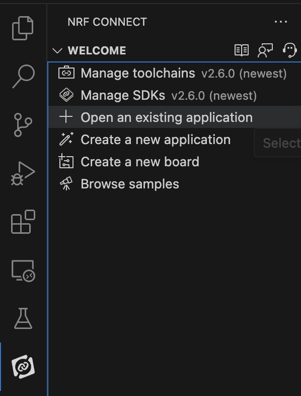

# Install firmware

If you purchased an unassembled Friend device or built it yourself using our hardware guide, follow the steps below to flash the firmware:

{: .note }
Important: If you purchased an assembled device please skip this step

1. Set up nRF Connect by following the tutorial in this video: [https://youtu.be/EAJdOqsL9m8](https://youtu.be/EAJdOqsL9m8)
2. In the nRF Connect Extension inside your VS Code, click “Open an existing application” and open the firmware folder from the root of this repo.

