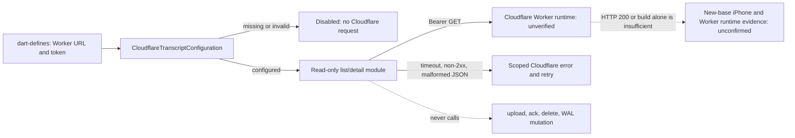

# ADR: Cloudflareセルフホスト差分をadapter境界へ隔離する

## Context

Omiのcapture、WAL、sync、会話UIは多数のOSS更新と接続する。旧スパイクの一括変更を再適用すると、Worker実装、個人端末設定、OSSの同期状態機械が結合し、upstream追随コストとデータ損失リスクを上げる。

## Decision

1. `app/lib/self_hosted/cloudflare/` をCloudflare契約の唯一の所有者にする。ここには API client、DTO、Provider、一覧/詳細画面を置く。
2. `app/lib/self_hosted/sync/` に `SelfHostedWalSyncAdapter` を置く。adapter は将来、既存WALが生成した確定ファイルを転送依頼としてWorkerへ渡せる契約面だけを持ち、WALの生成・削除・Omiの既存同期状態を所有しない。
3. OSSファイルの変更は接続点に限定する：Provider composition と Conversations入口である。`LocalWalSyncImpl` のアップロード委譲は Worker のupload/ack契約確定後の次sliceに限り、captureは既存所有権を保つ。
4. 個人Firebase、署名、entitlementは `docs/operational/` のlocal overlay契約に限定し、repositoryのtracked product configurationへ入れない。
5. l10nの手書き正本はARBだけとする。生成Dartは最新upstream上で `flutter gen-l10n` を実行してARBから再生成し、旧forkの生成Dartをコピーまたはcherry-pickしない。生成l10nを独立した製品laneや手書きの製品差分として扱わない。

## Threat model

## Consequences

- upstream更新の衝突は薄い接続点に局所化する。
- Worker APIの互換性は独立したhermetic contract testsで検出できる。
- 初回最小sliceは既存WALのupload/ack/deleteを呼ばない。設定を表すno-op adapterを置くだけで、Workerの成功・WALのterminal状態・同期完了は一切変更しない。
- Cloudflare modeとOmi modeが同時に動くか、どのWAL lifecycleが最終所有者かは次sliceでWorker APIのidempotencyと実機証跡をもって確定する。

## Alternatives rejected

- 旧スパイクの `brainbase_ingest` 一括移植：巨大な直接変更面と個人設定が混ざるため採用しない。
- Cloudflare APIを既存 `backend/http/api/conversations.dart` に追加：OSS会話APIの責務とWorker契約が混ざるため採用しない。
- ネットワーク送信をcapture callbackで同期実行：録音耐久性をネットワークへ従属させるため採用しない。

## Evidence boundary

Graphifyでは `ConversationsPage`、`LocalWalSyncImpl`、`CaptureController`、`WalSyncs` を同期/会話接続点として確認した。Worker runtime、実機、デプロイの成否はこのADRでは未確認である。

## Current slice status

Cloudflare transcriptのread moduleとConversations入口だけを実装する。WAL adapterは設定無効時を含むcontract/test seamであり、`LocalWalSyncImpl` からの呼出し、Worker upload、ack、削除は未実装である。新baseのiPhone E2Eも未実施で、このPRの受入条件ではない。旧スパイクの端末またはWorker証拠は設計参照に限り、新baseの成功として扱わない。

## Release, rollback, and observability

- このPRはWorker deployを実行しない。`dart-define` のURL/tokenが未設定または不正なら機能は無効で、Cloudflare requestを送らず既存Omi会話表示を維持する。
- 失敗modeはHTTP非2xx、timeout、不正JSON、非object session/chunk、session id欠落、malformed chunkであり、read moduleの非秘密値例外としてCloudflare画面へ閉じる。read-onlyのためdata write、WAL upload、ack、deleteは起こらない。
- rollbackはdefinesを除去して無効化するか、薄いProvider/Conversations接続点をrevertする。Workerまたは既存WALの状態をrollback対象にしない。
- 観測はhermetic contract/widget testと画面上のscoped errorまでである。build成功またはHTTP 200だけをE2E完了とせず、リリース主張には新baseのWorker runtimeとiPhone経路の別証跡が必要であり、現時点では両方 `未確認` である。
