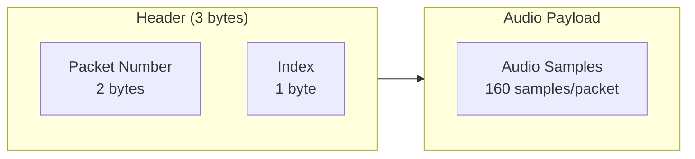

## Overview

This document describes the Bluetooth Low Energy (BLE) protocol used to communicate between the Omi app and device. Use this reference when building custom apps or SDKs.

---

## BLE Discovery

The official app discovers the device by scanning for BLE devices with the name `Omi`.

---

## BLE Services

The Omi wearable implements three BLE services:

<CardGroup cols={3}>
  <Card title="Battery Service" icon="battery-full">
    Standard BLE battery level monitoring
  </Card>
  <Card title="Device Info Service" icon="circle-info">
    Device metadata and firmware version
  </Card>
  <Card title="Audio Service" icon="microphone">
    Audio streaming and codec configuration
  </Card>
</CardGroup>

---

## Battery Service

<Note>
Battery notifications require firmware v1.5 or later. Earlier versions (1.0.x) do not support notifications.
</Note>

| Property | Value |
|----------|-------|
| Service UUID | `0x180F` (standard) |
| Characteristic UUID | `0x2A19` (Battery Level) |
| Supports Notifications | Yes (firmware v1.5+) |

This is the standard [BLE Battery Service](https://www.bluetooth.com/specifications/specs/battery-service).

---

## Device Information Service

<Note>
Available since firmware version 1.0.3
</Note>

| Property | Value |
|----------|-------|
| Service UUID | `0x180A` (standard) |

This is the standard [BLE Device Information Service](https://www.bluetooth.com/specifications/specs/device-information-service/).

### Characteristics

| Characteristic | UUID | Value |
|----------------|------|-------|
| Manufacturer Name | `0x2A29` | "Based Hardware" |
| Model Number | `0x2A24` | "Omi" |
| Hardware Revision | `0x2A27` | "Seeed Xiao BLE Sense" |
| Firmware Revision | `0x2A26` | e.g., "1.0.3" |

---

## Audio Streaming Service

This is the main service for streaming audio from the device to the app.

| Property | Value |
|----------|-------|
| Service UUID | `19B10000-E8F2-537E-4F6C-D104768A1214` |

### Characteristics

| Characteristic | UUID | Purpose |
|----------------|------|---------|
| Audio Data | `19B10001-E8F2-537E-4F6C-D104768A1214` | Audio stream from device |
| Codec Type | `19B10002-E8F2-537E-4F6C-D104768A1214` | Audio codec identifier |

---

## Codec Types

The codec type characteristic determines how to decode the audio data:

| Value | Codec | Sample Rate | Bit Depth |
|-------|-------|-------------|-----------|
| `0` | PCM | 16 kHz | 16-bit mono |
| `1` | PCM | 8 kHz | 16-bit mono |
| `10` | Mu-law | 16 kHz | 8-bit mono |
| `11` | Mu-law | 8 kHz | 8-bit mono |
| `20` | Opus | 16 kHz | 16-bit mono |

<Info>
Starting with firmware v1.0.3, the default codec is **Opus**. Earlier versions used PCM 16-bit at 8 kHz.
</Info>

---

## Audio Data Format

Audio data is sent as BLE notifications on the Audio Data characteristic.

### Packet Structure



<AccordionGroup>
  <Accordion title="Header Format" icon="file-lines">
    Each value update includes a 3-byte header:

    | Bytes | Field | Description |
    |-------|-------|-------------|
    | 0-1 | Packet Number | Overall packet counter (0-65535, wraps around) |
    | 2 | Index | Position of this value within the current packet |
  </Accordion>
  <Accordion title="Packet Fragmentation" icon="puzzle-piece">
    Each audio packet contains 160 samples. If the packet exceeds `(negotiated BLE MTU - 3 bytes)`, it will be split across multiple value notifications.

    **Example:** PCM 16-bit at 16 kHz
    - 160 samples × 2 bytes = 320 bytes per packet
    - On iOS devices, this typically results in:
      - Notification 1: packet n, index 0, 251 bytes
      - Notification 2: packet n+1, index 1, 75 bytes
  </Accordion>
  <Accordion title="Byte Order" icon="arrows-left-right">
    All audio data is sent in **little-endian** format.
  </Accordion>
</AccordionGroup>

---

## Implementation Example

```python
# Example: Parsing audio packet header
def parse_audio_header(data: bytes):
    packet_number = int.from_bytes(data[0:2], 'little')
    index = data[2]
    audio_data = data[3:]
    return packet_number, index, audio_data
```

---

## Related

<CardGroup cols={2}>
  <Card title="Python SDK" icon="python" href="/doc/developer/sdk/python">
    Python SDK with Opus decoding
  </Card>
  <Card title="Swift SDK" icon="swift" href="/doc/developer/sdk/swift">
    Native iOS SDK
  </Card>
  <Card title="React Native SDK" icon="react" href="/doc/developer/sdk/ReactNative">
    Cross-platform mobile SDK
  </Card>
  <Card title="Firmware" icon="microchip" href="/doc/developer/firmware/Compile_firmware">
    Compile custom firmware
  </Card>
</CardGroup>
