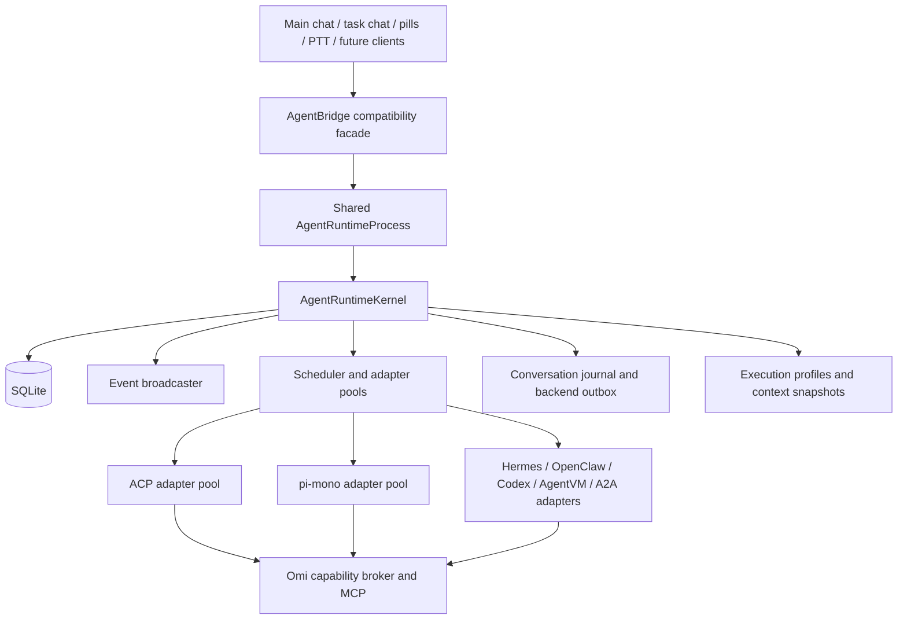

# Omi Agent Control Plane and Subagent Architecture Specification

**Status:** Locked for phased implementation
**Date:** 2026-06-23
**Phase 1 implementation baseline:** `desktop/macos/agent` TypeScript runtime
**Normative terms:** **MUST**, **MUST NOT**, **SHOULD**, and **MAY** are requirements levels.

This document is the long-term source of truth for Omi's agent control plane and subagent architecture. Future implementation plans and tickets should reference this document instead of redefining the same session, run, adapter, event, and migration semantics.

For the short enforceable contract used by reviewers and guard tests, see
[agent-control-plane-invariants](/doc/developer/agent-control-plane-invariants).

## 1. Executive decision

Omi is the agent control plane. ACP, pi-mono, Hermes, OpenClaw, Codex, AgentVM, A2A agents, and future runtimes are execution adapters beneath it.

The canonical product object is an Omi `AgentSession`. Every user turn or delegated objective is an Omi `AgentRun`. Every concrete execution or retry of that run is a `RunAttempt`. Runtime-native session IDs are opaque `AdapterBinding` data and are never Omi session IDs.

Phase 1 MUST evolve the existing `desktop/macos/agent` TypeScript runtime into the first `omi-agentd`. It MUST NOT begin with a Rust rewrite or a separate new service.

The implementation MUST introduce a durable runtime kernel above the existing harness abstractions. The current `HarnessAdapter` interface is a useful transitional driver API, but it is not the control-plane boundary and MUST be demoted below the kernel.

## 2. Non-negotiable invariants

1. `task_id`, `session_id`, `run_id`, `attempt_id`, and adapter-native session IDs are distinct identifiers.
2. An Omi session ID never changes because the selected adapter changes, an adapter process restarts, a native session becomes stale, or execution moves to another runtime node.
3. Every accepted user query creates exactly one `AgentRun`.
4. Every time control is handed to an adapter for that run, the kernel creates a `RunAttempt`.
5. Retries and failover create new attempts under the same run; follow-up user messages create new runs in the same session.
6. UI objects do not own process, session, or lifecycle authority. UI state is a projection of kernel state.
7. Exactly one runtime attempt has execution authority for a run at a time.
8. A runtime-native session ID exists only in `adapter_bindings` and compatibility fields explicitly named `adapterSessionId` or `legacyAdapterSessionId`.
9. Silence, unchanged terminal output, UI dismissal, or process disappearance never means success.
10. Run completion is determined only by a terminal kernel state persisted by the control plane.
11. Cancellation acknowledgement means the kernel accepted and dispatched the cancellation request; it MUST NOT falsely claim that an adapter stopped unless the adapter confirmed or the worker terminated.
12. Omi long-term memory and agent-session history remain separate systems. Agent output may produce memory candidates, but agents do not directly establish canonical memories.
13. Phase 1 MUST NOT create another in-memory session authority alongside the kernel.
14. Owner authority for control operations comes from Omi request context. Tool-supplied `ownerId` values are guards only; they may reject a request but MUST NOT become the active owner.
15. Request-scoped control and tool-relay paths MUST carry `clientId` and `requestId` together. A bare `requestId` is not globally unique under concurrent clients.
16. Request and client IDs are correlation, never execution authority; physical tool execution requires a persisted run/attempt invocation claim.
17. A session's adapter, model profile, working directory, credential scope, and execution role are one immutable, generation-numbered profile. Defaults apply only to future sessions.
18. Every accepted run pins one kernel-rendered ContextSnapshot. Swift supplies typed source data, not prompt policy or capability authority.
19. Every canonical conversation has one sequence-addressed kernel journal. Swift is a projection/physical transport. Backend chat is a downstream mirror and an event-triggered feed for genuinely remote turns; stable-ID reconciliation may propose imports, but only the journal mutates canonical history.
20. Voice lifecycle state changes only through `VoiceTurnCoordinator` and its reducer; microphone, provider, playback, and journal objects are physical drivers.

## 3. Pre-Phase-1 findings and Phase 1 baseline

Before Phase 1, the desktop agent implementation had several independent lifecycle authorities:

- `desktop/macos/agent/src/index.ts` owns ACP process state, a session-key map, one active session, one active abort controller, and recursive retry behavior.
- `PiMonoAdapter` owns synthetic `pi-session-*` identifiers and process-global conversational state.
- `AgentBridge.swift` owns a Node process and one uncorrelated message continuation.
- Each `TaskChatState` creates a separate `AgentBridge`, persists an ACP-native ID as `acpSessionId`, and treats it as the continuity identity.
- Each floating pill creates a separate `ChatProvider` and therefore a separate Node process to gain parallelism.
- `TaskAgentStatusRegistry` and pill state maintain separate in-memory status authorities.

Specific correctness issues that Phase 1 was required to fix:

- Outbound messages lacked request, run, attempt, and event correlation.
- Starting a new ACP query aborts the prior global active query.
- ACP retries recursively call `handleQuery`, hiding whether a fresh execution occurred.
- ACP process exit clears all in-memory session mappings.
- pi-mono advertises session resume even though its synthetic sessions do not survive a process restart.
- Task chat stored adapter-native ACP IDs in message rows and had no canonical Omi session identity.
- Cancellation is an uncorrelated notification with no acknowledgement contract.
- Parallel floating pills achieve isolation by multiplying UI-owned processes rather than using a scheduler and worker pool.

The post-Phase-1 baseline is the local TypeScript control plane in `desktop/macos/agent`: `AgentRuntimeKernel`
owns canonical session/run/attempt lifecycle, `AgentStore` persists that lifecycle in SQLite, ACP and pi-mono
execute through `RuntimeAdapter`, Swift uses `AgentRuntimeProcess` plus projection stores rather than owning
runtime authority, and local control tools operate through the kernel. Runtime-native IDs remain adapter bindings
or explicitly named compatibility fields; they are not Omi session IDs.

## 4. Target architecture



### 4.1 Process boundary

Phase 1 uses one long-lived Node process per signed-in desktop app instance. Swift owns that process through a shared `AgentRuntimeProcess`; individual `AgentBridge` values become lightweight client handles.

The Node daemon may own multiple bounded adapter subprocesses. Consolidating lifecycle authority into one daemon does not require forcing every run through one underlying model process.

Before the first owner-scoped RPC, every harness sends the signed-in owner to
the daemon. Managed pi-mono sessions may establish it with `refresh_token`;
local ACP, Hermes, OpenClaw, and Codex sessions use the token-free `refresh_owner`
handshake. The daemon's startup placeholder owner is never request authority.

### 4.2 Worker pools

The adapter registry MUST support bounded worker pools because the current ACP and pi-mono implementations are effectively single-flight per process.

- A worker handles at most one active attempt at a time in Phase 1.
- ACP bindings MAY share an idle worker sequentially, but concurrent prompts require separate workers until the ACP implementation supports safe multiplexing.
- A live pi-mono binding MUST be pinned to one worker because pi-mono state is process-global and switching session keys currently restarts or replaces process state.
- UI surfaces MUST NOT create or own workers.
- When all workers are busy, the kernel queues runs rather than spawning without limit.
- The initial global worker cap SHOULD match the current practical desktop parallelism ceiling. Use eight active workers by default, configurable through `OMI_AGENT_MAX_WORKERS`.

Pinned process-local bindings MUST follow the lifecycle invariants in section 10.4 rather than being treated as incidental worker flags.

## 5. Decision: kernel versus `HarnessAdapter`

### 5.1 Required design

Phase 1 MUST introduce `AgentRuntimeKernel` above the current `HarnessAdapter` interface.

`HarnessAdapter` MUST NOT become the canonical session or lifecycle API. It lacks:

- Omi session, run, and attempt identity;
- durable persistence;
- native-session adoption and resume fidelity;
- ordered events and replay;
- cancellation acknowledgement;
- retry/failover semantics;
- artifacts, delegations, grants, scheduling, and status projection.

### 5.2 Transitional implementation

Create a new lower-level interface:

```ts
export interface RuntimeAdapter {
  readonly adapterId: string;
  readonly capabilities: AdapterCapabilities;

  start(): Promise<void>;
  stop(): Promise<void>;

  openBinding(input: OpenBindingInput): Promise<OpenedBinding>;
  resumeBinding(input: ResumeBindingInput): Promise<OpenedBinding>;

  executeAttempt(
    context: AdapterAttemptContext,
    sink: AdapterEventSink,
    signal: AbortSignal
  ): Promise<AdapterAttemptResult>;

  cancelAttempt(context: CancelAttemptContext): Promise<CancelDispatchResult>;
  closeBinding?(binding: AdapterBindingHandle): Promise<void>;
}
```

The adapter contract uses Omi IDs only for correlation; adapters never create or persist those IDs.

Implementation rules:

- `PiMonoAdapter` MAY remain unchanged initially and be composed by a `HarnessAdapterShim` that implements `RuntimeAdapter`.
- ACP process and JSON-RPC logic MUST be extracted from `index.ts` into an `AcpRuntimeAdapter`.
- Existing `HarnessAdapter` types MUST be explicitly documented as adapter-native. Rename `PromptResult.sessionId` to `adapterSessionId` when call sites are migrated.
- `index.ts` MUST become bootstrap and transport wiring, not contain runtime-specific lifecycle branches.

## 6. Canonical domain model

### 6.1 `AgentSession`

A durable, user-visible conversational or work identity. A session can contain many runs and can acquire multiple historical adapter bindings.

Examples:

- one backend chat conversation;
- one task chat identified by `task_id`;
- one floating-pill investigation;
- one delegated research session.

### 6.2 `AgentRun`

One accepted unit of user or parent-agent intent in a session. Every compatibility `query(...)` invocation creates a new run.

### 6.3 `RunAttempt`

One concrete execution of a run by one adapter worker. Attempts make retries, stale binding replacement, authentication restarts, and failover explicit.

### 6.4 `AdapterBinding`

The opaque relationship between an Omi session and a runtime-native session. Bindings have generations and resume fidelity:

- `native`: the runtime can resume its own durable state;
- `reconstructed`: Omi can reconstruct sufficient context from canonical data;
- `none`: native state does not survive worker/process loss.

ACP bindings are normally `native`. Current pi-mono bindings are `none`.

### 6.5 `AgentEvent`

An ordered lifecycle, output, tool, progress, usage, approval, artifact, or delegation event.

### 6.6 `Artifact`

A concrete result such as a report, file, patch, screenshot, structured output, or checkpoint.

### 6.7 `Delegation`

A durable parent-to-child relationship connecting parent and child sessions/runs.

### 6.8 `Grant`

A recorded capability decision scoped to a session or run. Phase 1 records the existing legacy permission behavior without requiring a new approval UI.

## 7. Identifier format

Use UUIDv4 generated by the TypeScript runtime and prefix each identifier:

- `ses_<uuid>`
- `run_<uuid>`
- `att_<uuid>`
- `evt_<uuid>`
- `bind_<uuid>`
- `art_<uuid>`
- `del_<uuid>`
- `grant_<uuid>`

Remove hyphens from the UUID payload. Ordering comes from event sequence and timestamps, not lexical ID order.

## 8. Phase 1 SQLite storage

### 8.1 Database location and engine

Swift MUST pass an explicit state directory to the Node daemon. The database file is:

```text
$OMI_AGENT_STATE_DIR/omi-agentd.sqlite3
```

Use the bundled Node 22 runtime's `node:sqlite` `DatabaseSync` API behind a small `AgentStore` interface. Do not add a native SQLite npm dependency in Phase 1.

Because Node's `node:sqlite` API is still under active development across Node 22 minor versions, startup and packaging MUST include a runtime probe using the exact bundled Node binary. The probe MUST import `node:sqlite`, create an in-memory `DatabaseSync`, apply the Phase 1 schema, run a transaction, and fail loudly if the bundled runtime does not support the required API or SQL features. Do not rely only on a generic "Node 22+" version check.

Initialize:

```sql
PRAGMA journal_mode = WAL;
PRAGMA foreign_keys = ON;
PRAGMA synchronous = NORMAL;
PRAGMA busy_timeout = 5000;
```

All lifecycle transitions and their corresponding durable events MUST be committed in the same transaction.

### 8.2 Complete minimal schema

```sql
CREATE TABLE IF NOT EXISTS schema_migrations (
  version INTEGER PRIMARY KEY,
  applied_at_ms INTEGER NOT NULL
) STRICT;

CREATE TABLE sessions (
  session_id TEXT PRIMARY KEY,
  owner_id TEXT NOT NULL,
  agent_definition_id TEXT NOT NULL DEFAULT 'omi.generalist@1',
  title TEXT,
  status TEXT NOT NULL CHECK (status IN ('open', 'archived', 'closed')),
  surface_kind TEXT NOT NULL,
  external_ref_kind TEXT,
  external_ref_id TEXT,
  legacy_client_scope TEXT,
  legacy_session_key TEXT,
  default_adapter_id TEXT NOT NULL,
  default_cwd TEXT,
  model_profile TEXT,
  metadata_json TEXT NOT NULL DEFAULT '{}' CHECK (json_valid(metadata_json)),
  created_at_ms INTEGER NOT NULL,
  updated_at_ms INTEGER NOT NULL,
  last_activity_at_ms INTEGER NOT NULL,
  CHECK ((external_ref_kind IS NULL) = (external_ref_id IS NULL)),
  CHECK ((legacy_client_scope IS NULL) = (legacy_session_key IS NULL))
) STRICT;

CREATE UNIQUE INDEX sessions_external_ref_uq
  ON sessions(owner_id, external_ref_kind, external_ref_id)
  WHERE external_ref_kind IS NOT NULL;

CREATE UNIQUE INDEX sessions_legacy_alias_uq
  ON sessions(owner_id, legacy_client_scope, legacy_session_key)
  WHERE legacy_client_scope IS NOT NULL;

CREATE INDEX sessions_recent_idx
  ON sessions(owner_id, last_activity_at_ms DESC);

CREATE TABLE runs (
  run_id TEXT PRIMARY KEY,
  session_id TEXT NOT NULL REFERENCES sessions(session_id) ON DELETE CASCADE,
  parent_run_id TEXT REFERENCES runs(run_id) ON DELETE SET NULL,
  client_id TEXT NOT NULL,
  request_id TEXT NOT NULL,
  idempotency_key TEXT,
  status TEXT NOT NULL CHECK (status IN (
    'queued', 'starting', 'running', 'waiting_input', 'waiting_approval',
    'cancelling', 'succeeded', 'failed', 'cancelled', 'timed_out', 'orphaned'
  )),
  mode TEXT NOT NULL CHECK (mode IN ('ask', 'act')),
  input_json TEXT NOT NULL CHECK (json_valid(input_json)),
  system_prompt_hash TEXT,
  model_profile TEXT,
  requested_model_id TEXT,
  cwd TEXT,
  final_text TEXT,
  result_json TEXT CHECK (result_json IS NULL OR json_valid(result_json)),
  error_code TEXT,
  error_message TEXT,
  input_tokens INTEGER,
  output_tokens INTEGER,
  cache_read_tokens INTEGER,
  cache_write_tokens INTEGER,
  cost_usd REAL,
  created_at_ms INTEGER NOT NULL,
  started_at_ms INTEGER,
  completed_at_ms INTEGER,
  updated_at_ms INTEGER NOT NULL,
  UNIQUE(client_id, request_id)
) STRICT;

CREATE UNIQUE INDEX runs_idempotency_uq
  ON runs(session_id, idempotency_key)
  WHERE idempotency_key IS NOT NULL;

CREATE INDEX runs_session_recent_idx
  ON runs(session_id, created_at_ms DESC);

CREATE INDEX runs_status_idx
  ON runs(status, created_at_ms);

CREATE TABLE adapter_bindings (
  binding_id TEXT PRIMARY KEY,
  session_id TEXT NOT NULL REFERENCES sessions(session_id) ON DELETE CASCADE,
  adapter_id TEXT NOT NULL,
  binding_generation INTEGER NOT NULL CHECK (binding_generation > 0),
  adapter_native_session_id TEXT,
  adapter_instance_id TEXT,
  resume_fidelity TEXT NOT NULL CHECK (resume_fidelity IN ('native', 'reconstructed', 'none')),
  status TEXT NOT NULL CHECK (status IN ('active', 'stale', 'invalid', 'closed')),
  cwd TEXT,
  model_id TEXT,
  system_prompt_hash TEXT,
  metadata_json TEXT NOT NULL DEFAULT '{}' CHECK (json_valid(metadata_json)),
  created_at_ms INTEGER NOT NULL,
  updated_at_ms INTEGER NOT NULL,
  last_used_at_ms INTEGER,
  invalidated_at_ms INTEGER,
  UNIQUE(session_id, adapter_id, binding_generation)
) STRICT;

CREATE UNIQUE INDEX adapter_bindings_one_active_uq
  ON adapter_bindings(session_id, adapter_id)
  WHERE status = 'active';

CREATE UNIQUE INDEX adapter_bindings_native_uq
  ON adapter_bindings(adapter_id, adapter_native_session_id)
  WHERE adapter_native_session_id IS NOT NULL AND status != 'closed';

CREATE INDEX adapter_bindings_session_idx
  ON adapter_bindings(session_id, adapter_id, binding_generation DESC);

CREATE TABLE run_attempts (
  attempt_id TEXT PRIMARY KEY,
  run_id TEXT NOT NULL REFERENCES runs(run_id) ON DELETE CASCADE,
  attempt_no INTEGER NOT NULL CHECK (attempt_no > 0),
  status TEXT NOT NULL CHECK (status IN (
    'queued', 'starting', 'running', 'waiting_input', 'waiting_approval',
    'cancelling', 'succeeded', 'failed', 'cancelled', 'timed_out', 'orphaned'
  )),
  adapter_id TEXT NOT NULL,
  adapter_instance_id TEXT NOT NULL,
  runtime_node_id TEXT NOT NULL DEFAULT 'desktop-local',
  binding_id TEXT REFERENCES adapter_bindings(binding_id) ON DELETE SET NULL,
  adapter_native_run_id TEXT,
  resume_from_attempt_id TEXT REFERENCES run_attempts(attempt_id) ON DELETE SET NULL,
  checkpoint_artifact_id TEXT,
  retry_reason TEXT,
  retryable INTEGER NOT NULL DEFAULT 0 CHECK (retryable IN (0, 1)),
  cancellation_requested_at_ms INTEGER,
  cancellation_dispatched_at_ms INTEGER,
  cancellation_acknowledged_at_ms INTEGER,
  started_at_ms INTEGER,
  completed_at_ms INTEGER,
  error_code TEXT,
  error_message TEXT,
  metadata_json TEXT NOT NULL DEFAULT '{}' CHECK (json_valid(metadata_json)),
  created_at_ms INTEGER NOT NULL,
  updated_at_ms INTEGER NOT NULL,
  UNIQUE(run_id, attempt_no)
) STRICT;

CREATE INDEX run_attempts_run_idx
  ON run_attempts(run_id, attempt_no DESC);

CREATE INDEX run_attempts_active_idx
  ON run_attempts(status, created_at_ms);

CREATE TABLE events (
  event_seq INTEGER PRIMARY KEY AUTOINCREMENT,
  event_id TEXT NOT NULL UNIQUE,
  session_id TEXT NOT NULL REFERENCES sessions(session_id) ON DELETE CASCADE,
  run_id TEXT REFERENCES runs(run_id) ON DELETE CASCADE,
  attempt_id TEXT REFERENCES run_attempts(attempt_id) ON DELETE CASCADE,
  type TEXT NOT NULL,
  retention_class TEXT NOT NULL DEFAULT 'core' CHECK (retention_class IN ('core', 'transient')),
  visibility TEXT NOT NULL DEFAULT 'ui' CHECK (visibility IN ('ui', 'internal')),
  payload_json TEXT NOT NULL DEFAULT '{}' CHECK (json_valid(payload_json)),
  created_at_ms INTEGER NOT NULL
) STRICT;

CREATE INDEX events_session_cursor_idx
  ON events(session_id, event_seq);

CREATE INDEX events_run_cursor_idx
  ON events(run_id, event_seq)
  WHERE run_id IS NOT NULL;

CREATE INDEX events_attempt_cursor_idx
  ON events(attempt_id, event_seq)
  WHERE attempt_id IS NOT NULL;

CREATE TABLE artifacts (
  artifact_id TEXT PRIMARY KEY,
  session_id TEXT NOT NULL REFERENCES sessions(session_id) ON DELETE CASCADE,
  run_id TEXT REFERENCES runs(run_id) ON DELETE SET NULL,
  attempt_id TEXT REFERENCES run_attempts(attempt_id) ON DELETE SET NULL,
  kind TEXT NOT NULL,
  role TEXT NOT NULL CHECK (role IN ('input', 'result', 'checkpoint', 'tool_output', 'log', 'other')),
  uri TEXT NOT NULL,
  display_name TEXT,
  mime_type TEXT,
  content_hash TEXT,
  size_bytes INTEGER,
  metadata_json TEXT NOT NULL DEFAULT '{}' CHECK (json_valid(metadata_json)),
  created_at_ms INTEGER NOT NULL
) STRICT;

CREATE INDEX artifacts_run_idx
  ON artifacts(run_id, created_at_ms)
  WHERE run_id IS NOT NULL;

CREATE TABLE delegations (
  delegation_id TEXT PRIMARY KEY,
  parent_session_id TEXT NOT NULL REFERENCES sessions(session_id) ON DELETE CASCADE,
  parent_run_id TEXT NOT NULL REFERENCES runs(run_id) ON DELETE CASCADE,
  child_session_id TEXT NOT NULL REFERENCES sessions(session_id) ON DELETE CASCADE,
  child_run_id TEXT NOT NULL REFERENCES runs(run_id) ON DELETE CASCADE,
  mode TEXT NOT NULL CHECK (mode IN ('call', 'spawn', 'continue')),
  status TEXT NOT NULL CHECK (status IN ('pending', 'running', 'succeeded', 'failed', 'cancelled')),
  objective TEXT NOT NULL,
  request_json TEXT NOT NULL DEFAULT '{}' CHECK (json_valid(request_json)),
  result_artifact_id TEXT REFERENCES artifacts(artifact_id) ON DELETE SET NULL,
  created_at_ms INTEGER NOT NULL,
  completed_at_ms INTEGER,
  UNIQUE(child_run_id)
) STRICT;

CREATE INDEX delegations_parent_idx
  ON delegations(parent_run_id, created_at_ms);

CREATE TABLE grants (
  grant_id TEXT PRIMARY KEY,
  session_id TEXT NOT NULL REFERENCES sessions(session_id) ON DELETE CASCADE,
  run_id TEXT REFERENCES runs(run_id) ON DELETE CASCADE,
  capability TEXT NOT NULL,
  operation TEXT NOT NULL,
  resource_pattern TEXT NOT NULL,
  effect TEXT NOT NULL CHECK (effect IN ('allow', 'deny')),
  source TEXT NOT NULL CHECK (source IN ('legacy_default', 'policy', 'user', 'system')),
  constraints_json TEXT NOT NULL DEFAULT '{}' CHECK (json_valid(constraints_json)),
  created_at_ms INTEGER NOT NULL,
  expires_at_ms INTEGER,
  revoked_at_ms INTEGER
) STRICT;

CREATE INDEX grants_lookup_idx
  ON grants(session_id, run_id, capability, operation, created_at_ms DESC);
```

### 8.3 Intentionally omitted Phase 1 tables

Do not add separate tables for messages, approvals, model profiles, runtime nodes, workspaces, leases, or checkpoints in Phase 1.

- Completed text and structured results are stored on `runs`.
- Streaming and tool history are stored in `events`.
- Checkpoints are artifacts with `role = 'checkpoint'`.
- Runtime-node placement is recorded on each attempt.
- Approval requests are events; legacy decisions are grants.

Add dedicated tables only after their access patterns require them.

### 8.4 Startup reconciliation

On daemon startup:

1. Open and migrate the database.
2. Mark every attempt in `starting`, `running`, `waiting_input`, `waiting_approval`, or `cancelling` as `orphaned` unless its adapter can prove the execution is still alive.
3. Mark its run `orphaned` if no other non-terminal attempt exists.
4. Clear persisted `adapter_instance_id` values because worker instance IDs are process-local.
5. Mark active `resume_fidelity = 'none'` bindings stale.
6. Preserve native-resumable ACP bindings as active but unpinned.
7. Emit durable reconciliation events.

Phase 1 does not automatically retry orphaned runs on startup. The UI may offer resume/retry later.

## 9. Run and attempt semantics

### 9.1 Creation boundary

When a query is accepted:

1. Resolve or create the canonical session.
2. Insert one run with `status = 'queued'`.
3. Emit `run.queued`.
4. Schedule execution.
5. Immediately before adapter-specific binding/session work begins, insert attempt 1 with `status = 'starting'`.

### 9.2 When to create another attempt

Create a new attempt under the same run when:

- an adapter-native resume fails and execution is retried with a fresh binding;
- `session/set_model`, `session/prompt`, or equivalent fails due to a stale native session and the kernel retries;
- authentication causes the adapter process/session to be rebuilt and the run is re-entered;
- the selected worker crashes and the run is retried;
- execution fails over to another adapter, model, runtime node, or checkpoint;
- the user explicitly invokes a future `runs.retry(run_id)` operation.

Do not create a new attempt for:

- internal network retries hidden inside an adapter while the same adapter execution remains authoritative;
- a follow-up message, which is a new run;
- UI reattachment or event replay;
- tool calls inside the same model turn.

### 9.3 Retry rules

- Only one non-terminal attempt may exist per run.
- Attempt numbers are monotonically increasing from 1.
- A failed attempt records `retryable`, `retry_reason`, and any error.
- The next attempt records `resume_from_attempt_id` and optionally `checkpoint_artifact_id`.
- Run usage and cost are the sum of all attempts, not only the successful attempt.
- The run becomes terminal only after success, cancellation, timeout, or retry exhaustion.
- The current recursive `handleQuery(msg)` retry behavior MUST be replaced with an explicit loop in the kernel.

## 10. Adapter-binding lifecycle

### 10.1 Resolution order

For a run using adapter `A`:

1. Find the active binding for `(session_id, A)`.
2. Confirm it is compatible with required `cwd`, system-prompt hash, and adapter constraints.
3. If compatible, use or resume it.
4. If no binding exists and a compatibility request supplies `legacyAdapterSessionId`, adopt that ID as binding generation 1.
5. If native resume fails, mark the binding stale and create the next generation.
6. If the runtime cannot resume, create a fresh native binding and record the declared resume fidelity.

### 10.2 ACP

- ACP native IDs are stored only in `adapter_bindings.adapter_native_session_id`.
- Successful `session/resume` establishes or revalidates a `native` binding.
- A stale native session failure creates a new attempt and a new binding generation.
- Process restart does not delete the Omi session or run history.

### 10.3 pi-mono

- Current synthetic `pi-session-*` IDs are opaque process-local binding IDs.
- `PiMonoAdapter.supportsFeature(SESSION_RESUME)` MUST return `false` in Phase 0/1.
- pi-mono bindings use `resume_fidelity = 'none'` until true persistence or reconstruction exists.
- On worker restart, the prior binding becomes stale and a new generation is created.
- A pi-mono worker may have only one live pinned binding in Phase 1.

### 10.4 Pinned-worker lifecycle invariants

Process-local adapters such as pi-mono MUST model pinned binding ownership explicitly. The implementation may use
different names, but the following lifecycle states are normative:

- `ReservedForBinding`: a worker lease is opening, resuming, or replacing an adapter binding.
- `PinnedAwaitingExecution`: binding resolution succeeded and the binding is waiting for the run's execution lease.
- `Executing`: the worker is executing the authoritative attempt for the binding.
- `IdlePinned`: the binding is active in the store and pinned to an idle worker.
- `Protected`: an active binding is temporarily non-evictable because execution or replacement handoff is in progress.
- `Evicted`: a worker has released a process-local binding for reassignment.
- `Stale`: the store records that a process-local binding must not be resumed.
- `Closed`: the binding is permanently closed and no longer a continuity candidate.

Invariants:

1. A `resume_fidelity = 'none'` active binding MUST either be pinned to its process-local worker or be in a bounded protected handoff to execution.
2. A newly opened or resumed process-local binding MUST NOT be evicted between binding resolution and the execution lease for the same attempt.
3. Evicting an active process-local binding for replacement MUST mark the old binding stale before a replacement open can fail.
4. Failed binding resolution MUST NOT leak protected pins or waiters; retries must either observe a valid pinned binding, mark it stale, or fail loudly with capacity.
5. Worker-pool capacity checks MUST treat currently protected idle pins as unavailable rather than assuming they are evictable.
6. Reassigning a single process-local worker MUST preserve owner, request, run, attempt, and binding correlation; it MUST NOT silently move a live binding to another owner or run.

## 11. Event model

### 11.1 Canonical event envelope

```json
{
  "protocolVersion": 2,
  "eventId": "evt_...",
  "cursor": 184,
  "sessionId": "ses_...",
  "runId": "run_...",
  "attemptId": "att_...",
  "requestId": "swift-request-uuid",
  "type": "tool.completed",
  "timestampMs": 1782240000000,
  "payload": {}
}
```

### 11.2 Required event types

Lifecycle:

```text
session.created
session.updated
run.queued
run.starting
run.running
run.waiting_input
run.waiting_approval
run.cancellation_requested
run.cancelling
run.succeeded
run.failed
run.cancelled
run.timed_out
run.orphaned
attempt.created
attempt.started
attempt.failed
attempt.orphaned
attempt.cancel_dispatch
attempt.cancelled
binding.created
binding.resumed
binding.stale
binding.replaced
```

Output and work:

```text
message.delta
message.completed
progress.updated
tool.started
tool.updated
tool.completed
tool.failed
artifact.created
usage.updated
input.requested
input.provided
approval.requested
approval.resolved
delegation.created
delegation.completed
```

### 11.3 Persistence policy

- Persist all lifecycle, tool terminal, artifact, usage summary, input/approval, and delegation events.
- Stream token deltas immediately, but persist coalesced text chunks no more frequently than every 100 ms.
- Compact coalesced chunks into `message.completed` after a message finishes.
- Do not normalize or persist private chain-of-thought. Adapter thought streams become safe progress summaries or remain compatibility-only transient UI data.
- Event `cursor` is `events.event_seq` for durable events. Ephemeral deltas carry the latest durable cursor plus an in-memory sequence.

## 12. Cancellation contract

### 12.1 Kernel API

```ts
interface CancelRunResult {
  accepted: boolean;
  runId: string;
  attemptId?: string;
  dispatchAttempted: boolean;
  adapterAcknowledged: boolean;
  status: RunStatus;
}
```

### 12.2 Required behavior

1. Persist `run.cancellation_requested` and set the run to `cancelling`.
2. Invoke `RuntimeAdapter.cancelAttempt` for the active attempt.
3. Record whether cancellation was dispatched and whether the adapter explicitly acknowledged it.
4. Return `cancel_ack` to Swift immediately after the kernel transaction and dispatch result.
5. Mark the run `cancelled` only when the adapter execution exits, confirms cancellation, or the worker is terminated after a bounded grace period.
6. Drop or quarantine late adapter events after a terminal attempt state.

ACP cancellation is currently a one-way `session/cancel` notification. Therefore Phase 1 reports `dispatchAttempted = true` and `adapterAcknowledged = false` unless the ACP runtime provides a confirming response. Kernel acknowledgement remains truthful.

The compatibility facade MAY return partial text for a cancelled query, but the canonical terminal status remains `cancelled`, never `succeeded`.

## 13. Exact `AgentBridge.query(...)` compatibility facade

### 13.1 Swift source compatibility

Keep the existing public call shape and add optional canonical fields. Existing callers continue compiling.

```swift
func query(
  prompt: String,
  systemPrompt: String,
  sessionKey: String? = nil,                 // legacy alias only
  omiSessionId: String? = nil,               // canonical
  surfaceRef: AgentSessionSurfaceRef? = nil, // canonical resolver
  cwd: String? = nil,
  mode: String? = nil,
  model: String? = nil,
  resume: String? = nil,                     // legacy adapter-native ID only
  imageData: Data? = nil,
  ...callbacks...
) async throws -> QueryResult
```

`resume` remains temporarily supported but MUST be renamed in internal protocol data to `legacyAdapterSessionId`.

`QueryResult` becomes:

```swift
struct QueryResult {
  let text: String
  let costUsd: Double
  let omiSessionId: String
  let runId: String
  let attemptId: String
  let adapterSessionId: String?
  let terminalStatus: String
  let inputTokens: Int
  let outputTokens: Int
  let cacheReadTokens: Int
  let cacheWriteTokens: Int

  @available(*, deprecated, message: "Use omiSessionId or adapterSessionId explicitly")
  var sessionId: String { adapterSessionId ?? omiSessionId }
}
```

The deprecated computed `sessionId` preserves old adapter-native behavior for unconverted call sites. New code MUST use `omiSessionId`.

### 13.2 Shared Swift process owner

`AgentBridge.start()` MUST no longer spawn its own Node process. It registers a client handle with a shared `AgentRuntimeProcess` actor.

`AgentRuntimeProcess` owns:

- one Node daemon process;
- stdin/stdout/stderr pipes;
- request-to-stream routing;
- tool-call routing;
- auth event routing;
- process restart and health;
- a subscription stream for canonical events.

Each `AgentBridge` owns:

- a stable `clientId` for the lifetime of the handle;
- a default adapter ID derived from its existing `harnessMode` initializer;
- at most one active request for source compatibility;
- callbacks for its active request.

Different bridges may execute concurrently through the shared process.

### 13.3 Session resolution order

For every compatibility query, the facade resolves a session in this order:

1. Use `omiSessionId` if supplied and valid for the current owner.
2. Else resolve by `surfaceRef` using `(owner_id, external_ref_kind, external_ref_id)`.
3. Else resolve by legacy alias `(owner_id, legacy_client_scope, sessionKey)`.
4. Else create a session and persist the supplied surface or legacy alias.

A `sessionKey` is never an adapter-native session ID. It is only a compatibility alias.

Legacy main-chat mappings created before provider boundaries were persisted may
initially carry the old ACP default. Before their first run or adapter binding,
the resolver MAY repair that empty mapping to the active main-chat provider
boundary. Once either execution record exists, the persisted boundary remains
immutable and mismatched provider requests fail closed.

### 13.4 Stable surface references

Canonical surfaces MUST supply:

| Surface | `surface_kind` | External reference |
|---|---|---|
| Main chat | `main_chat` | `chat:<backend-chat-session-id>` or `chat:default` |
| Task chat | `task_chat` | `task:<task_id>` |
| Floating pill | `floating_pill` | `pill:<pill-uuid>` |
| Workstream thread | `workstream` | `workstream:<workstream_id>` |

Once a task has a workstream, task chat is a scoped view into the workstream
conversation. Multiple tasks in the same workstream MUST NOT resolve separate
sessions. `task:<task_id>` mappings may remain only as migration shims and are
scheduled for removal with the smart-tasks compatibility burn-down.

Onboarding, Chat Lab, and other surfaces MAY temporarily use legacy aliases until migrated.

### 13.5 Workstream product continuity

The local TypeScript kernel remains execution authority. Backend workstream
state supplies bounded context: current-state summary, selected material events,
current task, logical artifact heads, and provenance. A continuation checkpoint
may reconstruct that product context on another runtime, but MUST NOT copy an
adapter transcript or claim the source runtime's run/attempt status.

Context provenance uses the backend `EvidenceRef` vocabulary (`kind`, `id`,
optional `version`, `scope`, optional `device_id`, and optional
`excerpt_hash`). Local-screen refs are device-local. Cross-runtime export fails
closed unless device-local or sensitive evidence has a resolved
`export_workstream_continuation` dispatch. The exported checkpoint replaces
sensitive content with its redacted representation and strips source-runtime
approval state. Redacted previews do not repeat private summaries, and
sensitive snippets require a resolved matching context dispatch. `lastEventSequence` is the canonical
workstream-journal sequence; it is never derived from local runtime events.

Logical workstream artifacts are immutable versions. A head identifies the
current version; each new version cites evidence and records the artifact it
supersedes. Prior versions remain inspectable. Supplied run/attempt IDs must
belong to the resolved workstream; an attempt-only artifact derives and stores
its run ID so run inspection and events remain connected.

Desktop task Candidates are delivery outbox rows until the backend returns a
canonical Candidate ID and receipt. The stable local delivery key is the
idempotency key. After receipt, the row becomes `forwarded` (or reflects a
terminal backend resolution), leaves the local review queue, and only projects
subsequent canonical resolution.

The delivery proposal matches the strict backend Candidate union, including
`supersede`; legacy `delete` maps to canonical `cancel`. Pre-contract local rows
start blocked until account-generation reconciliation, and terminal historical
rows never become deliverable. Creation and resolution receipts are stored
separately so projection does not erase delivery evidence.

Task-session migration moves turns and inspectable artifact history to the
workstream conversation, stales legacy native bindings so reconstruction is
truthful, and returns legacy session IDs plus compatibility mappings for the
Ticket 14 removal pass. Re-running a completed mapping is a no-op.

### 13.6 Wire protocol v2

Inbound query:

```json
{
  "type": "query",
  "protocolVersion": 2,
  "requestId": "swift-request-uuid",
  "clientId": "bridge-client-uuid",
  "adapterId": "acp-claude",
  "sessionId": "ses_optional",
  "surfaceKind": "task_chat",
  "externalRefKind": "task",
  "externalRefId": "task-id",
  "legacyClientScope": "task-chat",
  "legacySessionKey": "task-id",
  "legacyAdapterSessionId": "optional-acp-id",
  "prompt": "...",
  "systemPrompt": "...",
  "cwd": "...",
  "mode": "act",
  "model": "..."
}
```

Every outbound query-scoped message includes:

```text
protocolVersion
requestId
sessionId       # canonical Omi session ID
runId
attemptId
eventId, when durable
```

Final result:

```json
{
  "type": "result",
  "protocolVersion": 2,
  "requestId": "...",
  "sessionId": "ses_...",
  "runId": "run_...",
  "attemptId": "att_...",
  "adapterSessionId": "opaque-native-id",
  "terminalStatus": "succeeded",
  "text": "...",
  "costUsd": 0.12,
  "inputTokens": 100,
  "outputTokens": 80,
  "cacheReadTokens": 0,
  "cacheWriteTokens": 0
}
```

Cancellation request:

```json
{
  "type": "interrupt",
  "protocolVersion": 2,
  "requestId": "swift-request-uuid",
  "clientId": "bridge-client-uuid"
}
```

Cancellation acknowledgement:

```json
{
  "protocolVersion": 2,
  "type": "cancel_ack",
  "requestId": "swift-request-uuid",
  "sessionId": "ses_...",
  "runId": "run_...",
  "attemptId": "att_...",
  "accepted": true,
  "dispatchAttempted": true,
  "adapterAcknowledged": false
}
```

### 13.6 Request and control context propagation

Every owner-scoped control operation runs under a canonical Omi control context:

```ts
type ControlContext = {
  ownerId: string;       // Omi/Firebase owner from the active request context
  clientId: string;      // bridge/client handle identity
  requestId: string;     // request identity scoped by clientId
  sessionId?: string;    // canonical Omi session ID
  runId?: string;        // canonical Omi run ID
  attemptId?: string;    // canonical Omi attempt ID
  adapterId?: string;    // runtime adapter handling the request
  source: "jsonl" | "omi-tools" | "mcp" | "kernel";
}
```

Rules:

- `ownerId` is authority only when it comes from the active Omi request/control context.
- A tool-supplied or adapter-supplied `ownerId` is only a guard. If present, it must match the active context owner or the operation is rejected.
- No owner-scoped path may fall back to process-global mutable owner state when `clientId`/`requestId` context is expected but absent.
- Internal maps and queues MUST key request-scoped state by `(clientId, requestId)`, not `requestId` alone.
- `runId`-only interrupt or control requests MUST still prove owner visibility through the active context or an explicit matching owner guard.
- JSONL query, interrupt, warmup, and binding-invalidation handlers MUST resolve
  the active daemon owner before transport mutation and reject a stale or forged
  owner guard.
- Swift app surfaces that manage existing agents outside an active query MUST use the dedicated `direct_control_tool`
  JSONL envelope. It requires a signed-in `ownerId` guard, but that request lifetime never authorizes child work. A
  long-lived run receives a kernel-issued run/attempt capability; the control-effect lease revalidates owner, run,
  attempt, and immutable execution profile before every physical effect and aborts in-flight work on revocation.
- Swift captures one immutable runtime-owner authorization snapshot at public
  operation admission and carries it through daemon startup, every awaited RPC,
  response routing, UI callbacks, and downstream mutation. Re-reading the same
  uid is not equivalent: authorization generation changes on every real owner
  transition, including sign-out and sign-in to the same account.
- Effective-owner replacement sends correlated `revoke_owner_runtime` and waits
  for `owner_runtime_revoked`. Node deauthorizes the previous owner before it
  synchronously terminalizes runs, pending tool claims, and bindings. Swift then
  drains physical tool tasks and confirms the child has exited before defaults
  expose the replacement owner. Nack, timeout, malformed receipt, or teardown
  failure may not fail open to the next owner.
- Multi-agent admission records each child as soon as the kernel accepts it. If
  a later sibling fails, the handler immediately cancels every admitted child;
  any cleanup failure returns the admitted run IDs and cancellation receipts.
- Query-scoped tool relay messages MUST carry all available Omi correlation fields: `protocolVersion`, `clientId`, `requestId`, `sessionId`, `runId`, `attemptId`, adapter IDs, and explicitly named adapter-native compatibility fields. Request/client IDs remain tracing fields; only the persisted invocation claim authorizes execution.
- Adapter subprocess environments and adapter-to-daemon relay messages are one contract. If the daemon sets `OMI_REQUEST_ID` and `OMI_CLIENT_ID`, the adapter relay MUST serialize them onto any tool-use message that depends on request ownership.
- Long-lived adapter workers MUST NOT rely on launch-time environment variables as per-attempt context. They MUST refresh active run/attempt capability context through a per-attempt channel before execution, and relay tools MUST read that channel when emitting invocation messages.
- Missing run/attempt authority for an owner-scoped physical effect is a hard error even when request correlation is present. An operation may omit it only when it is explicitly unscoped and safe by design.

The local implementation may store this as plain objects rather than a named class, but tests MUST assert the complete context survives each boundary:

1. Swift JSONL query/control message.
2. Node compatibility facade.
3. Adapter `executeAttempt` context.
4. MCP server environment construction.
5. Adapter tool relay back to the daemon.
6. Kernel control-tool dispatch.

### 13.7 Async request lifecycle cleanup

Each async request or relay path MUST complete exactly once:

- query continuations complete with result, error, cancellation, send failure, process exit, or timeout;
- direct control-tool requests complete with result, scoped error, send failure, process exit, or timeout;
- adapter tool relay calls complete with result, abort, timeout, pipe close, or process exit.

Cleanup MUST remove request maps before or atomically with resuming continuations/promises. Late results after cleanup
MUST be dropped or logged without reauthorizing a request. Tests SHOULD use fake adapters, temp state, and deterministic
continuations to cover these terminal paths without depending on wall-clock ordering.

Run/attempt or owner revocation also terminalizes every pending tool invocation:
`prepared` becomes `failed`, while `dispatched` becomes `outcome_unknown`.
Swift completion arriving afterward cannot restore durable success.

### 13.8 v1 compatibility window

For one release, the Node facade SHOULD accept current v1 `query`, `interrupt`, `warmup`, and `invalidate_session` messages.

- v1 `id` maps to `requestId`.
- v1 `sessionKey` maps to a legacy alias.
- v1 `resume` maps only to `legacyAdapterSessionId`.
- v1 messages use the process default adapter.
- The v1 path still creates canonical sessions, runs, attempts, and events.
- Do not maintain a separate v1 session map.

## 14. Existing task-chat journal migration

### 14.1 Interpretation

`task_chat_messages` is a read-only legacy source. Its `acpSessionId` values are adapter-native ACP session IDs; they MUST NOT be copied into `sessions.session_id` or reinterpreted as Omi IDs. New task/workstream turns use the kernel conversation journal and `TaskChatState` is only its projection.

### 14.2 Migration strategy

Use lazy, idempotent import on first workstream-chat access:

1. Resolve one canonical `surface_kind=workstream` conversation for the owner and workstream.
2. Read immutable legacy rows in bounded `(createdAt, rowId)` pages across every task linked to that workstream.
3. Import each row through the journal API with a stable legacy identity; journal deduplication makes retries and restart safe.
4. Checkpoint only after the terminal page has been accepted. The legacy table remains untouched and rollback-readable.
5. Migrate any prior task-scoped kernel conversation through the canonical journal migration transaction, preserving typed blocks, resources, revisions, outbox delivery state, sequence, and current visibility.
6. Treat historical `acpSessionId` values only as legacy adapter-binding hints where native ACP resume is still required; they never become journal/session identity.

### 14.3 Legacy-store boundary

- `TaskChatMessageStorage` exposes only the bounded, cursor-based `legacyMessagePage` import reader; it has no generic projection/search or message-write API.
- No new path may write `task_chat_messages` or `acpSessionId`.
- Task chat, main chat, floating chat, voice, notifications, and agent lifecycle all enter the same journal mutation API with distinct surface scopes.
- The local task/workstream journal remains local-only where product policy requires it; this is a delivery policy, not a second durable writer.

No new `agentSessionId` column is required in the legacy task-message database because canonical surface/session mapping is durable in `omi-agentd`.

The current action-item `chatSessionId = task.id` marker is a separate legacy scheduler/deduplication field. It MUST NOT be repurposed to store an Omi agent session ID.

## 15. Canonical status projection

The kernel is the only status authority.

### 15.1 Swift projection store

Add one `AgentRuntimeStatusStore` or equivalent observable projection fed by canonical events. It indexes:

```text
session_id -> latest run
run_id -> status, progress, active attempt, usage, error
surface external reference -> session_id
```

### 15.2 Surface migration

- `ChatProvider.isSending` becomes a local presentation cache derived from its active run and MUST be reconciled from kernel events.
- `TaskAgentStatusRegistry` becomes a compatibility view over the projection store, then is removed.
- `AgentPill.status` becomes a projection of the pill session's latest run.
- Dismissing a pill detaches/archives the view and explicitly cancels its active run only when current product behavior requires cancellation; it does not terminate the daemon.
- Closing task chat does not determine run completion.
- A task-agent run completing does not automatically mark the user's action item complete.

## 16. Delegation APIs and tools

### 16.1 Kernel operations

The kernel should expose operations equivalent to:

```text
delegate_agent
list_agent_sessions
get_agent_run
send_agent_message
cancel_agent_run
inspect_agent_artifacts
update_agent_artifact_lifecycle
```

### 16.2 Implementation decision

Phase 1 did not build capability-manifest code generation in the first persistence/kernel slice.

Implement the tools as thin, hand-written TypeScript wrappers against the kernel in one module with one set of Zod schemas. They MUST NOT be independently reimplemented in Swift, MCP, and each adapter.

Required sequence:

1. Stabilize session/run/attempt/event APIs.
2. Implement `list_agent_sessions`, `get_agent_run`, `cancel_agent_run`, and `inspect_agent_artifacts`.
3. Implement `send_agent_message`; it creates a new run in an existing session.
4. Implement `delegate_agent` after child session/run/delegation creation is transactional and the scheduler supports it.
5. Generate MCP, Swift, documentation, and permission metadata from a capability manifest in the later capability-consolidation phase.

The Phase 1 baseline includes seven hand-written local control tools: `list_agent_sessions`, `get_agent_run`,
`cancel_agent_run`, `inspect_agent_artifacts`, `update_agent_artifact_lifecycle`, `send_agent_message`, and
`delegate_agent`. `send_agent_message` creates a follow-up run in an existing Omi session. `delegate_agent`
creates or continues a distinct child Omi session linked to a parent run and records the delegation through
kernel-owned state.

Observe/manage-by-id tools (`list_agent_sessions`, `get_agent_run`, `cancel_agent_run`,
`inspect_agent_artifacts`, and `update_agent_artifact_lifecycle`) are cross-surface capabilities for desktop chat
and PTT/realtime. Creation/continuation tools (`send_agent_message`, `delegate_agent`) remain desktop-chat-only
until realtime has an equally explicit creation UX, control envelope, and correlation policy.

For PTT/realtime, `AgentControlService` resolves an opaque `agentRef` to only the canonical `runId` required by
strict run-scoped tools. A completed `get_agent_run` result supplies its bounded final output as untrusted data for
the coordinator to summarize; raw canonical identifiers remain hidden from user-facing speech.

### 16.3 Delegation semantics

- `call`: create a child session/run and suspend the parent until a structured result is available.
- `spawn`: create an asynchronous canonical child session/run and immediately return handles. This is not the
  legacy floating-pill `spawn_agent` tool and does not create or manage floating UI.
- `continue`: create another run in an existing child session.

A child result returns a summary, artifacts, verified effects, usage, and open questions. The parent does not receive the entire child transcript by default.

### 16.4 Delegation versus floating-pill tools

`delegate_agent` is the canonical control-plane delegation path. It creates or continues an Omi child
`AgentSession`, `AgentRun`, and `Delegation` through kernel-owned state.

The existing `spawn_agent` and `manage_agent_pills` tools remain the floating-bar UI workflow for now. They start and
manage circular floating agent pills and MUST NOT be documented as aliases for canonical delegation. Conversely,
`delegate_agent` spawn mode returns canonical child handles and MUST NOT imply that a floating pill appears.

Until a later UX migration, models should choose explicitly:

- use `delegate_agent` for canonical child runs that need durable session/run/delegation tracking;
- use `spawn_agent` for the legacy floating-pill product surface and other-app/background UI workflow;
- use `manage_agent_pills` only to list, dismiss, or clear floating pill UI state.

Any status bridge between these surfaces is projection-only. Kernel sessions, runs, attempts, artifacts, and
delegations remain the source of truth for control-plane state.

## 17. Phase 0 permission policy

Phase 0 MUST NOT be blocked by a redesign of approvals.

### 17.1 Preserve behavior, isolate semantics

Create a named `LegacyPermissionPolicy` and route existing permission decisions through it.

For the initial release it MAY preserve:

- ACP auto-selection of the currently used allow option, including `allow_always` when that is the existing behavior;
- existing pi-mono tool policy;
- the legacy tmux path's permission bypass until that path is retired.

However:

- every automatic ACP decision MUST emit an `approval.resolved` or equivalent audit event;
- once the store is present, each run MUST receive an explicit `legacy_default` grant record describing the broad legacy authority;
- new adapters MUST explicitly opt into this policy rather than inheriting it accidentally;
- no code outside the policy module may make ad hoc approval decisions;
- the product MUST label this mode as legacy/high-trust internally.

### 17.2 Dangerous semantics that remain

The following remain dangerous and are deliberate temporary debt:

- selecting `allow_always` can create broader runtime state than a run-scoped Omi grant represents;
- `--dangerously-skip-permissions` bypasses runtime checks in the legacy tmux path;
- user-installed pi-mono extensions execute inside the adapter subprocess trust boundary.

These do not block Phase 1, but the architecture MUST contain and audit them. Do not expand their scope to Hermes, OpenClaw, or future adapters by default.

## 18. Model and context policy

### 18.1 Logical model profiles

Product code SHOULD move from provider-specific model IDs to logical profiles:

```text
main_reasoner
worker
router
verifier
vision
summarizer
```

Phase 1 may continue accepting explicit model IDs through the compatibility facade, but the run stores both `model_profile` and `requested_model_id` when available.

### 18.2 Context boundary

- A delegated child receives minimal explicit context, not the complete parent transcript by default.
- Omi memories are retrieved through scoped Omi tools/MCP.
- Agent outputs may create `memory_candidate` artifacts with provenance and uncertainty.
- The memory ingestion pipeline decides whether a candidate becomes a canonical memory.
- Canonical memories created from agent work record the originating run ID.

## 19. Standards and future adapters

These standards remain edge protocols, not Omi's internal domain model:

- ACP: interactive coding-harness adapter.
- MCP: capability and context plane.
- A2A: remote/federated agent adapter.
- Hermes: use its richer native gateway adapter where needed; ACP is a compatibility option.
- OpenClaw: preserve the distinction between native subagents and ACP harness sessions.
- AgentVM: becomes another runtime node and placement target.

No external standard may redefine Omi session, run, attempt, grant, or artifact identity.

## 20. Smallest implementation sequence

### Step 0 — protocol and compatibility scaffolding

1. Add protocol v2 fields: `protocolVersion`, `requestId`, `clientId`, canonical IDs, and `cancel_ack`.
2. Continue accepting current v1 messages for one release.
3. Introduce `LegacyPermissionPolicy` without changing current user-facing permission behavior.
4. Set pi-mono `SESSION_RESUME` capability to false.
5. Add bounded timeouts and cleanup for pending request/tool maps where possible without changing product flow.

**Exit condition:** Existing UI still works, messages are correlated, and cancellation has a truthful kernel-level acknowledgement shape.

### Step 1 — durable store and domain types

1. Add the SQLite schema and migration runner.
2. Add typed repositories and transactional lifecycle methods.
3. Add startup reconciliation.
4. Add ID generation.

**Exit condition:** Sessions, runs, attempts, bindings, and events survive daemon restart in tests.

### Step 2 — adapter extraction

1. Define `RuntimeAdapter`.
2. Extract ACP process/protocol code from `index.ts` into `AcpRuntimeAdapter`.
3. Wrap the current `PiMonoAdapter` with a `RuntimeAdapter` shim.
4. Add adapter registry, bounded workers, and single-flight enforcement per worker.

**Exit condition:** Both ACP and pi-mono can open/resume bindings, execute an attempt, stream events, and dispatch cancellation through the same adapter contract.

### Step 3 — runtime kernel

1. Implement session resolution.
2. Implement run/attempt state machine.
3. Implement binding generations.
4. Replace recursive retries with explicit attempts.
5. Persist and publish events.
6. Derive canonical run status.

**Exit condition:** A transport-independent kernel test can execute a query through fake adapters and observe durable IDs, retries, events, and cancellation.

### Step 4 — JSONL compatibility facade

1. Map current `query` behavior to session resolution plus a new run.
2. Translate adapter events into current `text_delta`, tool, thinking/progress, result, and error messages with correlation fields.
3. Translate current `interrupt` to `runs.cancel`.
4. Keep `warmup` as a scheduler hint, not session authority.
5. Keep `invalidate_session` as binding invalidation, not Omi session deletion.

**Exit condition:** Current `AgentBridge.query(...)` behavior passes compatibility tests while all execution flows through the kernel.

### Step 5 — shared Swift runtime process

1. Replace per-`AgentBridge` process ownership with shared `AgentRuntimeProcess` ownership.
2. Route responses by `requestId` instead of one global continuation.
3. Preserve one active request per `AgentBridge` handle initially.
4. Expose canonical result fields and event subscriptions.

**Exit condition:** Main chat, task chat, and two floating pills can execute concurrently through one daemon without response mixing.

### Step 6 — canonical surface identities

1. Main chat passes a stable chat surface reference.
2. Task chat passes `task_id`, lazily adopts the latest legacy ACP ID, and stores Omi and ACP IDs separately.
3. Floating pills pass their pill UUID as the external reference.
4. All three surfaces subscribe to canonical status.
5. `TaskAgentStatusRegistry` becomes a projection adapter rather than an authority.

**Exit condition:** Main chat, task chat, and pills can be closed/reopened or detached without losing canonical session/run identity, and status is read from the kernel.

### Step 7 — delegation controls

Phase 1 baseline:

1. Read/control tools run against the kernel.
2. `send_agent_message` creates a follow-up run in an existing Omi session.
3. Transactional delegation and `delegate_agent` create or continue child Omi sessions.
4. Artifact metadata is exposed through local kernel tools; richer product UI for artifacts remains a later phase.

## 21. First code files to change

The first ten files are:

1. `desktop/macos/agent/src/protocol.ts`
2. `desktop/macos/agent/src/runtime/types.ts` — new
3. `desktop/macos/agent/src/runtime/sqlite-store.ts` — new
4. `desktop/macos/agent/src/runtime/kernel.ts` — new
5. `desktop/macos/agent/src/runtime/compatibility-facade.ts` — new
6. `desktop/macos/agent/src/adapters/interface.ts`
7. `desktop/macos/agent/src/adapters/acp.ts` — new extraction from `index.ts`
8. `desktop/macos/agent/src/adapters/pi-mono.ts`
9. `desktop/macos/agent/src/index.ts`
10. `desktop/macos/Desktop/Sources/Chat/AgentBridge.swift`

The immediate next wave is:

- `desktop/macos/Desktop/Sources/Chat/AgentRuntimeProcess.swift` — new if not initially nested in `AgentBridge.swift`
- `desktop/macos/Desktop/Sources/Providers/ChatProvider.swift`
- `desktop/macos/Desktop/Sources/ProactiveAssistants/Assistants/TaskAgent/TaskChatState.swift`
- `desktop/macos/Desktop/Sources/Rewind/Core/TaskChatMessageStorage.swift`
- `desktop/macos/Desktop/Sources/FloatingControlBar/AgentPill.swift`
- `desktop/macos/Desktop/Sources/ProactiveAssistants/Assistants/TaskAgent/TaskAgentStatusRegistry.swift`
- `desktop/macos/Desktop/Sources/ProactiveAssistants/Assistants/TaskAgent/TaskChatCoordinator.swift`

`index.ts` MUST shrink to bootstrap, adapter registration, JSONL parsing, and shutdown. It MUST NOT retain separate ACP and pi-mono session managers after the migration.

## 22. First tests to add or update

### 22.1 TypeScript tests

1. **`sqlite-store.test.ts`**
   - migrations are idempotent;
   - WAL/foreign-key setup is applied;
   - data survives reopen;
   - external-ref and active-binding uniqueness constraints hold;
   - transactional state plus event writes are atomic.

2. **`session-resolution.test.ts`**
   - canonical ID lookup wins;
   - task/main/pill external references resolve stably;
   - legacy aliases resolve without becoming adapter IDs;
   - owner isolation is enforced.

3. **`run-attempt-lifecycle.test.ts`**
   - one query creates one run and one attempt;
   - stale resume creates attempt 2 under the same run;
   - follow-up creates a new run;
   - only one active attempt is allowed;
   - usage aggregates across attempts.
   - pinned process-local bindings cannot be evicted between binding resolution and execution;
   - eviction stale-marks bindings before replacement resolution can fail;
   - failed binding resolution does not leak protected worker state.

4. **`adapter-binding.test.ts`**
   - legacy ACP ID adoption creates generation 1;
   - resume failure marks it stale and creates generation 2;
   - ACP binding is `native`;
   - pi-mono binding is `none` and becomes stale after restart.

5. **`event-stream.test.ts`**
   - durable cursors are monotonic;
   - replay after cursor is ordered;
   - concurrent runs do not mix events;
   - coalesced deltas compact into message completion.

6. **`cancellation.test.ts`**
   - cancellation request is persisted before dispatch;
   - `cancel_ack` is emitted exactly once;
   - dispatch and adapter acknowledgement are distinct;
   - late events after terminal cancellation are ignored;
   - partial text does not turn cancellation into success.

7. **`compatibility-facade.test.ts`**
   - current v1 query maps to canonical session/run/attempt;
   - `resume` becomes an ACP binding only;
   - current outbound callbacks still receive expected message types;
   - `invalidate_session` invalidates a binding, not the Omi session.
   - owner isolation is enforced for missing IDs, duplicate request IDs, duplicate request IDs across clients, and run-id-only interrupts.

8. **Update `pi-mono-adapter.test.ts`**
   - `SESSION_RESUME` is false;
   - worker binding pinning is enforced;
   - abort dispatch result is represented honestly.
   - pi-mono refreshes the active request/run/attempt context before each long-lived worker execution;
   - pi-mono `callSwiftTool` serializes request/client/run/attempt correlation from the active context channel for long-lived workers, falling back to `OMI_*` environment variables only when no active context file is present.

9. **`control-context-property.test.ts`**
   - generate owner/client/request/run/attempt combinations across query, interrupt, control-tool, and relay paths;
   - assert owner-scoped operations either use the active Omi owner or reject;
   - assert tool-supplied `ownerId` never becomes authority;
   - assert request context maps are keyed by `(clientId, requestId)`.

10. **`worker-pool-state-machine.test.ts`**
   - exercise the pinned-worker states listed in section 10.4;
   - assert no DB-active `resume_fidelity = 'none'` binding can be orphaned from its pinned worker;
   - assert protected pins are temporary and never block stale replacement forever.

11. **Replace `session-lifecycle.test.ts` replication tests**
   - test the real kernel and fake adapter instead of copying `index.ts` control flow.

### 22.2 Swift tests

1. **Agent runtime multiplexing**
   - two `AgentBridge` handles share one daemon;
   - events are routed by request ID;
   - interrupting one request does not interrupt another.

2. **Task-chat legacy migration**
   - latest `acpSessionId` becomes an ACP binding;
   - canonical session is resolved by task ID;
   - Omi session ID is never written into `acpSessionId`;
   - stale ACP resume retains the same Omi session.

3. **Status projection**
   - main chat, task chat, and pill statuses follow canonical run events;
   - UI close/dismiss does not fabricate terminal success;
   - process restart produces `orphaned` status rather than silent completion.

4. **Protocol v2 parsing**
   - result exposes Omi, run, attempt, and adapter IDs separately;
   - cancellation acknowledgement parses correctly;
   - deprecated `sessionId` retains legacy native behavior.

## 23. Phase 1 acceptance criteria

These acceptance criteria describe the Phase 1 baseline contract and remain the regression guard for the merged
implementation:

1. Every main-chat, task-chat, and floating-pill query returns durable Omi `session_id`, `run_id`, and `attempt_id` values.
2. Restarting the Node daemon preserves canonical sessions, runs, bindings, events, and terminal statuses.
3. ACP and pi-mono both execute through `RuntimeAdapter` and the kernel.
4. ACP native IDs and pi-mono synthetic IDs appear only as adapter bindings or explicitly named compatibility fields.
5. Current task `acpSessionId` data lazily migrates without being reinterpreted as an Omi ID.
6. Recursive retry logic is removed; retries create visible attempts.
7. Every query-scoped outbound message is correlated by request, session, run, and attempt.
8. Cancellation produces an explicit acknowledgement and a truthful terminal state.
9. Multiple bridges/pills can run through one shared daemon without event mixing.
10. Canonical status drives main chat, task chat, and pills; UI registries are projections only.
11. Existing permission behavior remains available through a named, auditable legacy policy.
12. `index.ts` no longer contains independent ACP and pi-mono lifecycle authorities.

## 24. Explicitly deferred

The following are not Phase 1 blockers:

- a new user-facing approval UX;
- cloud synchronization and cross-device leases;
- AgentVM placement and failover;
- Hermes, OpenClaw, and A2A adapters;
- automatic context reconstruction across adapters;
- durable pi-mono native resume;
- automatic memory ingestion from child results;
- Rust control-plane implementation;
- complete event sourcing or CQRS.

Phase 2 may accept local consolidation that reuses Phase 1 authority without changing the architecture:

- local capability-manifest consolidation for the existing Omi control tools from one canonical source;
- artifact write/lifecycle APIs over the existing `artifacts` table;
- a minimal desktop artifact projection that exposes references and metadata already owned by the kernel;
- prompt and discoverability alignment that keeps canonical `delegate_agent` delegation distinct from the existing
  floating-pill tools.

Still deferred beyond that local consolidation:

- broad capability generation across cloud directories, remote runtimes, and future standards;
- full artifact browser UX, arbitrary artifact-content browsing, cloud artifact sync, and cross-device artifact leases.
- migrating floating pills into canonical child-session projections or replacing the legacy floating-pill tool UX.

## 25. Long-term direction

After Phase 1, Omi should add a cloud agent directory and relay that owns global routing, runtime registration, single-writer leases, compact status synchronization, and optional artifact synchronization. The local TypeScript daemon remains a runtime node. AgentVM becomes another node. Failover creates a new attempt from a checkpoint rather than moving a live process invisibly.

The durable abstraction remains:

> A globally addressable Omi `AgentSession`, containing durable `AgentRun`s and explicit `RunAttempt`s, executed by selected runtime adapters under Omi-owned grants, with ordered events and concrete artifacts.
