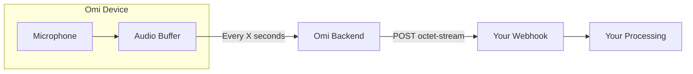

## Overview

Omi allows you to stream audio bytes from your DevKit directly to your backend or any external service. This enables custom audio processing like:

<CardGroup cols={2}>
  <Card title="Custom Speech Recognition" icon="microphone">
    Use your own ASR models instead of Omi's default transcription
  </Card>
  <Card title="Voice Activity Detection" icon="waveform-lines">
    Implement custom VAD logic for specialized use cases
  </Card>
  <Card title="Audio Analysis" icon="chart-line">
    Extract features, spectrograms, or embeddings in real-time
  </Card>
  <Card title="Cloud Storage" icon="cloud-arrow-up">
    Store raw audio for later processing or compliance
  </Card>
</CardGroup>



---

## Technical Specifications

| Specification | Value |
|---------------|-------|
| **HTTP Method** | POST |
| **Content-Type** | `application/octet-stream` |
| **Audio Format** | Raw PCM16 (16-bit signed, little-endian) |
| **Bytes per Sample** | 2 |
| **Sample Rate** | 16,000 Hz (DevKit1 v1.0.4+, DevKit2) or 8,000 Hz (DevKit1 v1.0.2) |
| **Channels** | Mono (1 channel) |

<Note>
The sample rate is passed as a query parameter so your endpoint can handle different device versions.
</Note>

---

## Setup Guide

<Steps>
  <Step title="Create Your Endpoint" icon="server">
    Create a webhook that accepts POST requests with binary audio data.

    **Request format:**
    ```
    POST /your-endpoint?sample_rate=16000&uid=user123&timestamp=1703520000
    Content-Type: application/octet-stream
    Body: [raw PCM16 audio bytes]
    ```

    **Query Parameters:**
    | Parameter | Type | Description |
    |-----------|------|-------------|
    | `sample_rate` | int | Audio sample rate in Hz (8000 or 16000) |
    | `uid` | string | User identifier |
    | `timestamp` | int | *(Optional)* Unix timestamp of when audio was recorded. Present for offline sync, absent for realtime streaming. |

    Your endpoint should:
    - Accept `application/octet-stream` content type
    - Read query parameters (`sample_rate`, `uid`, and optionally `timestamp`)
    - Process the raw bytes (buffer, save, or analyze)
    - Return 200 OK quickly to avoid timeouts

    <Tip>
    The `timestamp` parameter is included when syncing offline recordings (e.g., from Limitless pendant).
    For realtime streaming, you can use the request time as the audio timestamp.
    </Tip>
  </Step>
  <Step title="Configure in Omi App" icon="mobile">
    1. Open the Omi App
    2. Go to **Settings** → **Developer Mode**
    3. Scroll to **Realtime audio bytes**
    4. Enter your webhook URL
    5. Set the **Every x seconds** field (e.g., `10` for 10-second chunks)
  </Step>
  <Step title="Test Your Integration" icon="flask">
    Start speaking while wearing your Omi device. Audio bytes should arrive at your webhook at the configured interval.

    <Tip>
    Use [webhook.site](https://webhook.site) to verify data is arriving before implementing your processing logic.
    </Tip>
  </Step>
</Steps>

---

## Working with Audio Bytes

### Converting to WAV

The received bytes are raw PCM16 audio. To create a playable WAV file, prepend a WAV header:

```python
import struct
import wave
import io

def create_wav(audio_bytes: bytes, sample_rate: int) -> bytes:
    """Convert raw PCM16 bytes to WAV format."""
    buffer = io.BytesIO()

    with wave.open(buffer, 'wb') as wav_file:
        wav_file.setnchannels(1)  # Mono
        wav_file.setsampwidth(2)  # 16-bit = 2 bytes
        wav_file.setframerate(sample_rate)
        wav_file.writeframes(audio_bytes)

    buffer.seek(0)
    return buffer.read()
```

### Accumulating Chunks

If you need continuous audio (not chunked), accumulate bytes across requests:

```python
from collections import defaultdict

# Store audio by session
audio_buffers = defaultdict(bytes)

@app.post("/audio")
async def receive_audio(request: Request, uid: str, sample_rate: int):
    audio_bytes = await request.body()

    # Accumulate audio for this user
    audio_buffers[uid] += audio_bytes

    # Process when you have enough audio (e.g., 60 seconds)
    if len(audio_buffers[uid]) >= sample_rate * 2 * 60:  # 2 bytes per sample
        process_audio(audio_buffers[uid], sample_rate)
        audio_buffers[uid] = bytes()

    return {"status": "ok"}
```

---

## Example: Save to Google Cloud Storage

A complete example that saves audio files to Google Cloud Storage.

<Steps>
  <Step title="Create GCS Bucket" icon="bucket">
    Follow the [Saving Audio Guide](/doc/developer/savingaudio) steps 1-5 to create a bucket with proper permissions.
  </Step>
  <Step title="Fork the Example Repository" icon="code-fork">
    Fork [github.com/mdmohsin7/omi-audio-streaming](https://github.com/mdmohsin7/omi-audio-streaming)
  </Step>
  <Step title="Clone and Deploy" icon="cloud-arrow-up">
    Clone the repository and deploy to your preferred cloud provider (GCP, AWS, DigitalOcean) or run locally with ngrok.

    The repository includes a Dockerfile for easy deployment.
  </Step>
  <Step title="Set Environment Variables" icon="key">
    Configure these environment variables during deployment:

    | Variable | Description |
    |----------|-------------|
    | `GOOGLE_APPLICATION_CREDENTIALS_JSON` | GCP service account credentials (base64 encoded) |
    | `GCS_BUCKET_NAME` | Your GCS bucket name |
  </Step>
  <Step title="Configure Omi App" icon="mobile">
    Set the endpoint in Developer Settings → Realtime audio bytes:
    ```
    https://your-deployment-url.com/audio
    ```
  </Step>
  <Step title="Verify" icon="check">
    Audio files should now appear in your GCS bucket every X seconds (based on your configured interval).
  </Step>
</Steps>

---

## Processing Ideas

<AccordionGroup>
  <Accordion title="Custom Speech Recognition" icon="microphone">
    Feed audio to your own ASR models for specialized vocabulary or languages:

    ```python
    import whisper

    model = whisper.load_model("base")

    @app.post("/audio")
    async def transcribe(request: Request, sample_rate: int):
        audio_bytes = await request.body()
        wav_data = create_wav(audio_bytes, sample_rate)

        # Save temporarily and transcribe
        with tempfile.NamedTemporaryFile(suffix=".wav") as f:
            f.write(wav_data)
            f.flush()
            result = model.transcribe(f.name)

        return {"text": result["text"]}
    ```
  </Accordion>
  <Accordion title="Voice Activity Detection" icon="waveform-lines">
    Detect speech vs. silence for custom endpointing:

    ```python
    import webrtcvad

    vad = webrtcvad.Vad(3)  # Aggressiveness 0-3

    def detect_speech(audio_bytes: bytes, sample_rate: int) -> bool:
        # webrtcvad needs 10, 20, or 30ms frames
        frame_duration = 30  # ms
        frame_size = int(sample_rate * frame_duration / 1000) * 2

        speech_frames = 0
        total_frames = 0

        for i in range(0, len(audio_bytes), frame_size):
            frame = audio_bytes[i:i + frame_size]
            if len(frame) == frame_size:
                if vad.is_speech(frame, sample_rate):
                    speech_frames += 1
                total_frames += 1

        return speech_frames / total_frames > 0.5 if total_frames else False
    ```
  </Accordion>
  <Accordion title="Audio Embeddings" icon="diagram-project">
    Extract embeddings for speaker identification or audio similarity:

    ```python
    from speechbrain.pretrained import EncoderClassifier

    classifier = EncoderClassifier.from_hparams(
        source="speechbrain/spkrec-ecapa-voxceleb"
    )

    def get_embedding(wav_path: str):
        return classifier.encode_batch(
            classifier.load_audio(wav_path)
        )
    ```
  </Accordion>
  <Accordion title="Real-time Sentiment" icon="face-smile">
    Analyze emotional tone from audio features:

    ```python
    import librosa
    import numpy as np

    def extract_features(audio_bytes: bytes, sample_rate: int):
        # Convert bytes to numpy array
        audio = np.frombuffer(audio_bytes, dtype=np.int16).astype(np.float32)
        audio = audio / 32768.0  # Normalize

        # Extract features
        mfccs = librosa.feature.mfcc(y=audio, sr=sample_rate, n_mfcc=13)
        energy = librosa.feature.rms(y=audio)

        return {
            "mfcc_mean": mfccs.mean(axis=1).tolist(),
            "energy_mean": float(energy.mean()),
        }
    ```
  </Accordion>
</AccordionGroup>

---

## Best Practices

<CardGroup cols={2}>
  <Card title="Respond Quickly" icon="bolt">
    Return 200 OK immediately, process async. Slow responses may cause timeouts.
  </Card>
  <Card title="Handle Missing Data" icon="triangle-exclamation">
    Network issues may cause gaps. Design your processing to handle incomplete audio.
  </Card>
  <Card title="Buffer Appropriately" icon="layer-group">
    Choose chunk interval based on your use case. Larger chunks = fewer requests but higher latency.
  </Card>
  <Card title="Monitor Usage" icon="chart-line">
    Audio streaming generates significant data. Monitor storage and bandwidth costs.
  </Card>
</CardGroup>

<Warning>
Audio data is sensitive. Ensure your endpoint is secured with HTTPS and implement appropriate access controls.
</Warning>

---

## Related Documentation

<CardGroup cols={2}>
  <Card title="Integration Apps" icon="plug" href="/doc/developer/apps/Integrations">
    Overview of webhook-based integrations
  </Card>
  <Card title="Saving Audio" icon="floppy-disk" href="/doc/developer/savingaudio">
    Guide to storing audio in cloud storage
  </Card>
  <Card title="Real-time Transcription" icon="closed-captioning" href="/doc/developer/backend/transcription">
    How Omi's built-in transcription works
  </Card>
  <Card title="Apps Introduction" icon="puzzle-piece" href="/doc/developer/apps/Introduction">
    Overview of all Omi app types
  </Card>
</CardGroup>
