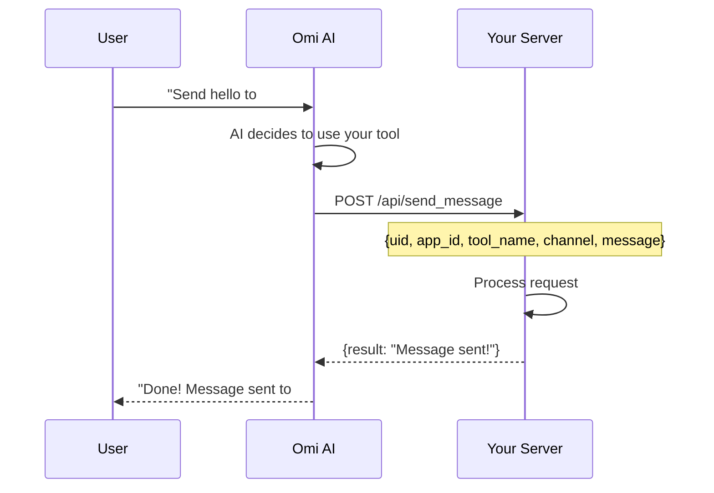

## Overview

**Chat Tools** allow your app to provide custom functions that become available in Omi chat when users install your app. These tools enable the AI assistant to interact with your service directly through natural language conversations.

<CardGroup cols={3}>
  <Card title="Custom Actions" icon="wand-magic-sparkles">
    Define tools that perform actions on external services
  </Card>
  <Card title="Natural Language" icon="comments">
    Users interact with tools through normal conversation
  </Card>
  <Card title="Automatic Discovery" icon="magnifying-glass">
    Tools become available when users install your app
  </Card>
</CardGroup>

**Example:** A Slack integration app might provide tools to:
- Send messages to Slack channels
- List available channels
- Search messages in Slack

When a user installs your app, these tools automatically become available in their Omi chat, allowing them to say things like "Send a message to #general saying hello" or "What Slack channels do I have?"

<Info>
Chat Tools require your app to have the `external_integration` capability enabled. They are not a separate capability, but rather a feature that works with external integration apps.
</Info>

---

## How Chat Tools Work



<Steps>
  <Step title="User Chats with Omi">
    User makes a request in natural language
  </Step>
  <Step title="AI Decides to Use Tool">
    Omi's AI determines your tool is the best way to fulfill the request
  </Step>
  <Step title="Omi Calls Your Endpoint">
    POST request with `uid`, `app_id`, `tool_name`, plus extracted parameters
  </Step>
  <Step title="Your Server Processes">
    Execute the action and return a result
  </Step>
  <Step title="User Sees Result">
    Omi displays your response to the user
  </Step>
</Steps>

---

## Part 1: Implementing Chat Tools

### Step 1: Create Tool Endpoints

Your backend server needs to expose endpoints that Omi will call when tools are invoked.

<AccordionGroup>
  <Accordion title="Endpoint Requirements" icon="list-check">
    Your endpoints should:

    - Accept POST requests with JSON payload (or GET with query parameters)
    - Receive these standard fields:
      - `uid`: User ID
      - `app_id`: Your app ID
      - `tool_name`: Name of the tool being called
      - Plus any tool-specific parameters
    - Return JSON with either:
      - `result`: Success message (string)
      - `error`: Error message (string)
  </Accordion>
</AccordionGroup>

#### Example: Send Message Tool

```python
from flask import Flask, request, jsonify
import requests

app = Flask(__name__)

@app.route('/api/send_message', methods=['POST'])
def send_message():
    """
    Tool endpoint: Send a message to a Slack channel

    Expected payload:
    {
        "uid": "user_id",
        "app_id": "slack_app_id",
        "tool_name": "send_slack_message",
        "channel": "#general",
        "message": "Hello from Omi!"
    }
    """
    data = request.json

    # Validate required parameters
    if not data:
        return jsonify({'error': 'Missing request body'}), 400

    uid = data.get('uid')
    channel = data.get('channel')
    message = data.get('message')

    if not uid:
        return jsonify({'error': 'Missing uid parameter'}), 400
    if not channel:
        return jsonify({'error': 'Missing required parameter: channel'}), 400
    if not message:
        return jsonify({'error': 'Missing required parameter: message'}), 400

    # Get user's authentication token (from your database)
    slack_token = get_user_token(uid)
    if not slack_token:
        return jsonify({
            'error': 'Slack not connected. Please connect your Slack account.'
        }), 401

    # Call external API (e.g., Slack API)
    slack_response = requests.post(
        'https://slack.com/api/chat.postMessage',
        headers={'Authorization': f'Bearer {slack_token}'},
        json={'channel': channel, 'text': message}
    )

    if slack_response.json().get('ok'):
        return jsonify({
            'result': f'Successfully sent message to {channel}'
        })
    else:
        return jsonify({
            'error': f"Failed to send message: {slack_response.json().get('error')}"
        }), 400
```

#### Example: Search Tool

```python
@app.route('/api/search_messages', methods=['POST'])
def search_messages():
    """
    Tool endpoint: Search for messages

    Expected payload:
    {
        "uid": "user_id",
        "app_id": "slack_app_id",
        "tool_name": "search_slack_messages",
        "query": "meeting notes",
        "channel": "#general"  # optional
    }
    """
    data = request.json

    uid = data.get('uid')
    query = data.get('query')
    channel = data.get('channel')

    if not uid:
        return jsonify({'error': 'Missing uid parameter'}), 400
    if not query:
        return jsonify({'error': 'Missing required parameter: query'}), 400

    # Get user's authentication token
    slack_token = get_user_token(uid)
    if not slack_token:
        return jsonify({
            'error': 'Slack not connected. Please connect your Slack account.'
        }), 401

    # Build search query
    search_query = query
    if channel:
        search_query = f'in:{channel} {query}'

    # Call external API
    slack_response = requests.get(
        'https://slack.com/api/search.messages',
        headers={'Authorization': f'Bearer {slack_token}'},
        params={'query': search_query}
    )

    if slack_response.json().get('ok'):
        messages = slack_response.json().get('messages', {}).get('matches', [])
        if not messages:
            return jsonify({
                'result': f'No messages found for "{query}"'
            })

        results = []
        for msg in messages[:5]:
            results.append(f"- {msg.get('text', '')[:100]} (in #{msg.get('channel', {}).get('name', 'unknown')})")

        return jsonify({
            'result': f'Found {len(messages)} messages:\n' + '\n'.join(results)
        })
    else:
        return jsonify({
            'error': f"Failed to search messages: {slack_response.json().get('error')}"
        }), 400
```

### Step 2: Handle Authentication

If your tools require user authentication:

<CardGroup cols={3}>
  <Card title="Store Tokens Securely" icon="lock">
    Save OAuth tokens in a secure database associated with `uid`
  </Card>
  <Card title="Validate Authentication" icon="shield-check">
    Check if user has connected their account before processing
  </Card>
  <Card title="Return Helpful Errors" icon="message">
    If auth is missing, return a clear error message
  </Card>
</CardGroup>

```python
def get_user_token(uid: str) -> Optional[str]:
    """Get user's authentication token from database"""
    # In production, fetch from secure database
    return user_tokens.get(uid)

@app.route('/api/send_message', methods=['POST'])
def send_message():
    data = request.json
    uid = data.get('uid')

    # Check authentication
    token = get_user_token(uid)
    if not token:
        return jsonify({
            'error': 'Account not connected. Please connect your account in app settings.'
        }), 401

    # Proceed with tool execution
    # ...
```

### Step 3: Error Handling Best Practices

<Tip>
Always return helpful error messages that guide users on how to fix the issue.
</Tip>

```python
# Good error messages
return jsonify({'error': 'Slack not connected. Please connect your Slack account.'}), 401
return jsonify({'error': 'Missing required parameter: channel'}), 400
return jsonify({'error': 'Channel not found. Please check the channel name.'}), 404

# Avoid exposing sensitive information
# ❌ Bad: return jsonify({'error': f'Database connection failed: {db_password}'}), 500
# ✅ Good: return jsonify({'error': 'Service temporarily unavailable. Please try again later.'}), 500
```

---

## Part 2: Adding Chat Tools in Omi App Store

Chat tools are defined via a **manifest endpoint** hosted on your server. When you create or update your app in the Omi App Store, Omi will automatically fetch the tool definitions from your manifest URL.

<CardGroup cols={2}>
  <Card title="Single Source of Truth" icon="database">
    Tool definitions live on your server
  </Card>
  <Card title="Easy Updates" icon="rotate">
    Modify your manifest and re-save the app to refresh
  </Card>
  <Card title="Full Control" icon="sliders">
    Define parameters with JSON Schema
  </Card>
  <Card title="Version Control" icon="code-branch">
    Track changes in your codebase
  </Card>
</CardGroup>

### Step 1: Create the Manifest File

Create a JSON file at `/.well-known/omi-tools.json` on your server:

```json
{
  "tools": [
    {
      "name": "send_slack_message",
      "description": "Send a message to a Slack channel. Use this when the user wants to send a message, post an update, or notify a channel in Slack.",
      "endpoint": "/api/send_message",
      "method": "POST",
      "parameters": {
        "properties": {
          "channel": {
            "type": "string",
            "description": "The Slack channel to send to (e.g., '#general')"
          },
          "message": {
            "type": "string",
            "description": "The message text to send"
          }
        },
        "required": ["channel", "message"]
      },
      "auth_required": true,
      "status_message": "Sending message to Slack..."
    },
    {
      "name": "search_slack_messages",
      "description": "Search for messages in Slack. Use this when the user wants to find specific messages or look up past conversations.",
      "endpoint": "/api/search_messages",
      "method": "POST",
      "parameters": {
        "properties": {
          "query": {
            "type": "string",
            "description": "Search query"
          },
          "channel": {
            "type": "string",
            "description": "Optional channel to search in"
          }
        },
        "required": ["query"]
      },
      "auth_required": true,
      "status_message": "Searching Slack..."
    }
  ]
}
```

### Step 2: Host the Manifest

Make sure your manifest is accessible via HTTPS. Common locations:

- `https://your-app.com/.well-known/omi-tools.json` (recommended)
- `https://your-app.com/omi/manifest.json`
- `https://your-app.com/api/tools-manifest`

### Step 3: Add Manifest URL in Omi App Store

<Steps>
  <Step title="Open Omi App">
    Navigate to Apps → Create App (or edit an existing app)
  </Step>
  <Step title="Select Capability">
    Choose External Integration capability
  </Step>
  <Step title="Enter Manifest URL">
    In the **Chat Tools Manifest URL** field, enter:
    ```
    https://your-app.com/.well-known/omi-tools.json
    ```
  </Step>
  <Step title="Submit">
    Omi will automatically fetch your tool definitions
  </Step>
</Steps>

<Note>
**Endpoint URLs in Manifest**: You can use relative paths (e.g., `/api/send_message`) in your manifest. Omi will automatically resolve them using your `App Home URL` as the base URL.
</Note>

---

## Manifest Schema Reference

| Field | Type | Required | Description |
|-------|------|----------|-------------|
| `name` | string | Yes | Unique tool identifier (e.g., `send_slack_message`) |
| `description` | string | Yes | Detailed description for the AI to understand when/how to use the tool |
| `endpoint` | string | Yes | URL endpoint (can be relative or absolute) |
| `method` | string | No | HTTP method (default: `POST`) |
| `parameters` | object | No | JSON Schema defining tool parameters |
| `auth_required` | boolean | No | Whether user auth is required (default: `true`) |
| `status_message` | string | No | Message shown to user when tool is called |

### Parameters Schema

```json
{
  "parameters": {
    "properties": {
      "param_name": {
        "type": "string | integer | boolean | array | object",
        "description": "Description of what this parameter does"
      }
    },
    "required": ["param_name"]
  }
}
```

### Example: FastAPI Manifest Endpoint

```python
from fastapi import FastAPI

app = FastAPI()

@app.get("/.well-known/omi-tools.json")
async def get_omi_tools_manifest():
    return {
        "tools": [
            {
                "name": "search_songs",
                "description": "Search for songs on Spotify",
                "endpoint": "/tools/search_songs",
                "method": "POST",
                "parameters": {
                    "properties": {
                        "query": {"type": "string", "description": "Search query"},
                        "limit": {"type": "integer", "description": "Max results"}
                    },
                    "required": ["query"]
                },
                "auth_required": True,
                "status_message": "Searching Spotify..."
            },
            {
                "name": "add_to_playlist",
                "description": "Add a song to a playlist",
                "endpoint": "/tools/add_to_playlist",
                "method": "POST",
                "parameters": {
                    "properties": {
                        "song_name": {"type": "string", "description": "Song name"},
                        "artist_name": {"type": "string", "description": "Artist name"},
                        "playlist_name": {"type": "string", "description": "Playlist name"}
                    },
                    "required": ["song_name"]
                },
                "auth_required": True,
                "status_message": "Adding to playlist..."
            }
        ],
        "chat_messages": {
            "enabled": True,
            "target": "app",
            "notify": False
        }
    }
```

---

## Sending Chat Messages Proactively

Your app can send messages directly to a user's chat without waiting for them to invoke a tool. This is useful for:

- Sending results from long-running background tasks
- Proactive notifications based on external events
- Asynchronous updates from your service

### Enabling Chat Messages

Add the `chat_messages` configuration to your manifest:

```json
{
  "tools": [...],
  "chat_messages": {
    "enabled": true,
    "target": "app",
    "notify": false
  }
}
```

| Field | Type | Default | Description |
|-------|------|---------|-------------|
| `enabled` | boolean | `false` | Whether your app can send chat messages |
| `target` | string | `"app"` | Where messages appear: `"app"` (app-specific chat) or `"main"` (main chat) |
| `notify` | boolean | `false` | Whether to send a push notification with the message |

### Sending Messages via API

Once enabled, use the notification API to send messages:

```bash
curl -X POST https://api.omi.me/v1/integrations/notification \
  -H "Authorization: Bearer YOUR_APP_API_KEY" \
  -H "Content-Type: application/json" \
  -d '{
    "uid": "user_firebase_id",
    "aid": "your_app_id",
    "message": "Your task has completed! Here are the results..."
  }'
```

### API Request Fields

| Field | Type | Required | Description |
|-------|------|----------|-------------|
| `uid` | string | Yes | The user's Firebase UID |
| `aid` | string | Yes | Your app's ID |
| `message` | string | Yes | The message content to send |

### Example: Background Task Completion

```python
import httpx

async def send_task_result(uid: str, result: str):
    """Send task completion message to user's chat."""
    async with httpx.AsyncClient() as client:
        response = await client.post(
            "https://api.omi.me/v1/integrations/notification",
            headers={
                "Authorization": f"Bearer {APP_API_KEY}",
                "Content-Type": "application/json",
            },
            json={
                "uid": uid,
                "aid": APP_ID,
                "message": result,
            },
        )
        return response.status_code == 200
```

### Rate Limits

Chat messages are rate-limited to prevent notification fatigue:

- **Maximum**: 10 messages per hour per app per user
- **Response**: HTTP 429 with `Retry-After` header when exceeded

<Warning>
Abuse of chat messages (spam, excessive notifications) may result in your app being removed from the store.
</Warning>

---

## Tool Definition Best Practices

<AccordionGroup>
  <Accordion title="Tool Names" icon="tag">
    Use descriptive, action-oriented names:

    | Good | Bad |
    |------|-----|
    | `send_slack_message` | `slack1` |
    | `list_slack_channels` | `do_stuff` |
    | `search_slack_messages` | `msg` |
  </Accordion>
  <Accordion title="Descriptions" icon="file-lines">
    Write detailed descriptions that help the AI understand:

    - **When to use**: "Use this when the user wants to..."
    - **Required parameters**: List what's needed
    - **What it does**: Clear explanation of the action

    **Example:**
    ```
    Send a message to a Slack channel. Use this when the user wants to
    send a message, post an update, or notify a channel in Slack.
    Required parameters: channel (e.g., '#general') and message (the text to send).
    ```
  </Accordion>
  <Accordion title="HTTP Methods" icon="code">
    Choose the appropriate method:

    | Method | Use For |
    |--------|---------|
    | `POST` | Creating resources or sending data (most common) |
    | `GET` | Retrieving data (parameters as query params) |
    | `PUT/PATCH` | Updating resources |
    | `DELETE` | Deleting resources |
  </Accordion>
  <Accordion title="Status Messages" icon="spinner">
    Provide custom messages shown during tool execution:

    - "Searching Slack..."
    - "Sending message..."
    - "Creating calendar event..."

    If not provided, Omi generates a default based on the tool name.
  </Accordion>
</AccordionGroup>

---

## Request and Response Format

### Request Format

**POST Request:**
```json
{
  "uid": "user_firebase_id",
  "app_id": "your_app_id",
  "tool_name": "send_slack_message",
  "channel": "#general",
  "message": "Hello from Omi!"
}
```

**GET Request:**
```
GET /api/search?uid=user_id&app_id=app_id&tool_name=search_slack_messages&query=meeting
```

### Response Format

<Tabs>
  <Tab title="Success" icon="check">
    ```json
    {
      "result": "Successfully sent message to #general"
    }
    ```
    HTTP Status: `200`
  </Tab>
  <Tab title="Error" icon="xmark">
    ```json
    {
      "error": "Slack not connected. Please connect your Slack account."
    }
    ```
    HTTP Status: `400`, `401`, or `500`
  </Tab>
</Tabs>

---

## Best Practices

<CardGroup cols={2}>
  <Card title="Clear Responses" icon="message">
    Keep responses concise but informative

    - ✅ "Successfully sent message to #general"
    - ❌ "OK"
  </Card>
  <Card title="Helpful Errors" icon="circle-exclamation">
    Guide users on how to fix issues

    - ✅ "Slack not connected. Please connect your account."
    - ❌ "Error 401"
  </Card>
  <Card title="Secure Auth" icon="lock">
    Store tokens encrypted and implement token refresh for long sessions
  </Card>
  <Card title="Rate Limiting" icon="gauge-high">
    Protect your endpoints from abuse
  </Card>
</CardGroup>

### Rate Limiting Example

```python
from functools import wraps
from flask import request, jsonify
import time

request_counts = {}

def rate_limit(max_requests=100, window=60):
    def decorator(f):
        @wraps(f)
        def wrapper(*args, **kwargs):
            uid = request.json.get('uid')
            key = f"{uid}_{f.__name__}"
            now = time.time()

            if key in request_counts:
                requests, first_request = request_counts[key]
                if now - first_request < window:
                    if requests >= max_requests:
                        return jsonify({'error': 'Rate limit exceeded'}), 429
                    request_counts[key] = (requests + 1, first_request)
                else:
                    request_counts[key] = (1, now)
            else:
                request_counts[key] = (1, now)

            return f(*args, **kwargs)
        return wrapper
    return decorator

@app.route('/api/send_message', methods=['POST'])
@rate_limit(max_requests=100, window=60)
def send_message():
    # ...
```

---

## Testing Your Tools

<Steps>
  <Step title="Test Endpoints Directly">
    Use curl or Postman before adding to your app:

    ```bash
    curl -X POST https://your-server.com/api/send_message \
      -H "Content-Type: application/json" \
      -d '{
        "uid": "test_user_id",
        "app_id": "slack-integration",
        "tool_name": "send_slack_message",
        "channel": "#general",
        "message": "Test message"
      }'
    ```
  </Step>
  <Step title="Create the App">
    Add your tool definitions in the Omi App Store
  </Step>
  <Step title="Install the App">
    Install it in your test account
  </Step>
  <Step title="Connect Your Account">
    If auth is required, click the connect button in app settings
  </Step>
  <Step title="Test in Chat">
    Try using the tools naturally:
    - "Send a message to #general saying hello"
    - "What Slack channels do I have?"
    - "Search Slack for messages about the project"
  </Step>
</Steps>

---

## Troubleshooting

<AccordionGroup>
  <Accordion title="Tool Not Appearing in Chat" icon="eye-slash">
    - Verify the app is installed and enabled (`enabled: true`)
    - Check that `chat_tools` array is properly formatted
    - Ensure endpoints are accessible and return proper responses
    - Verify the app has `external_integration` capability
  </Accordion>
  <Accordion title="Tool Calls Failing" icon="circle-xmark">
    - Check endpoint logs for errors
    - Verify authentication is working
    - Ensure response format matches specification
    - Test endpoints directly with curl/Postman
    - Check that required parameters are being sent
  </Accordion>
  <Accordion title="AI Not Using Your Tool" icon="robot">
    - Improve tool description to be more specific about when to use it
    - Add examples in the description
    - Ensure tool name is descriptive
    - Make sure the description clearly states when the tool should be used
  </Accordion>
</AccordionGroup>

---

## Complete Example

<Card title="Slack Integration Example" icon="slack" href="/doc/developer/apps/examples/Slack">
  See a complete working example that demonstrates OAuth authentication, multiple chat tools, handling invocations, and error handling
</Card>

---

## Related Documentation

<CardGroup cols={2}>
  <Card title="Developer API" icon="code" href="/doc/developer/api">
    Access your own personal Omi data programmatically
  </Card>
  <Card title="Data Import APIs" icon="file-import" href="/doc/developer/apps/Import">
    Create conversations and memories via REST API
  </Card>
  <Card title="Integration Apps" icon="plug" href="/doc/developer/apps/Integrations">
    Learn about external integrations
  </Card>
  <Card title="OAuth Guide" icon="key" href="/doc/developer/apps/Oauth">
    Set up authentication for your app
  </Card>
  <Card title="Submit Your App" icon="rocket" href="/doc/developer/apps/Submitting">
    Publish your app to the store
  </Card>
  <Card title="Notifications" icon="bell" href="/doc/developer/apps/Notifications">
    Send push notifications to users
  </Card>
</CardGroup>
