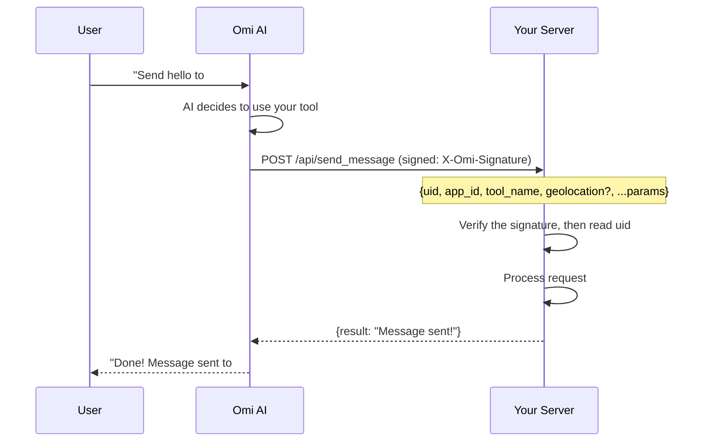

## Overview

**Chat Tools** allow your app to provide custom functions that become available in Omi chat when users install your app. These tools enable the AI assistant to interact with your service directly through natural language conversations.

<CardGroup cols={3}>
  <Card title="Custom Actions" icon="wand-magic-sparkles">
    Define tools that perform actions on external services
  </Card>
  <Card title="Natural Language" icon="comments">
    Users interact with tools through normal conversation
  </Card>
  <Card title="Automatic Discovery" icon="magnifying-glass">
    Tools become available when users install your app
  </Card>
</CardGroup>

**Example:** A Slack integration app might provide tools to:
- Send messages to Slack channels
- List available channels
- Search messages in Slack

When a user installs your app, these tools automatically become available in their Omi chat, allowing them to say things like "Send a message to #general saying hello" or "What Slack channels do I have?"

<Info>
Chat Tools require your app to have the `external_integration` capability enabled. They are not a separate capability, but rather a feature that works with external integration apps.
</Info>

---

## How Chat Tools Work


```mermaid
sequenceDiagram
    participant U as User
    participant O as Omi AI
    participant Y as Your Server

    U->>O: "Send hello to #general"
    O->>O: AI decides to use your tool
    O->>Y: POST /api/send_message (signed: X-Omi-Signature)
    Note over Y: {uid, app_id, tool_name, geolocation?, ...params}
    Y->>Y: Verify the signature, then read uid
    Y->>Y: Process request
    Y-->>O: {result: "Message sent!"}
    O-->>U: "Done! Message sent to #general"
```

<Steps>
  <Step title="User Chats with Omi">
    User makes a request in natural language
  </Step>
  <Step title="AI Decides to Use Tool">
    Omi's AI determines your tool is the best way to fulfill the request
  </Step>
  <Step title="Omi Calls Your Endpoint">
    A request with `uid`, `app_id`, `tool_name` and the extracted parameters, signed with your app's secret
  </Step>
  <Step title="Your Server Verifies, Then Processes">
    Check the `X-Omi-Signature` header, then execute the action and return a result
  </Step>
  <Step title="User Sees Result">
    Omi displays your response to the user
  </Step>
</Steps>

---

## Verify Every Tool Call

Anyone who knows a user's `uid` can send your tool endpoint a request that looks exactly like one from Omi. So never act on `uid` until you have checked that Omi sent the request: give your app a signing secret, and verify the `X-Omi-Signature` header on every call. Verify first, then read `uid`.

### Getting a secret

Your app has one signing secret for its webhooks and its chat-tool calls. Open your app from **Connectors**, click **Edit**, and use **Webhook signing** in the **External Integration** section, or call `POST /v1/apps/{app_id}/webhook-signing-secret`. The secret (`whsec_...`) is shown **once**, so copy it into your server's secret manager. Rotating keeps the previous secret valid for 24 hours; see [Verifying Webhook Signatures](/doc/developer/apps/Integrations#verifying-webhook-signatures) for rotation and deletion.

<Note>
An app without a secret receives tool calls unsigned, exactly as before. Create the secret first, then deploy the endpoint that rejects unsigned calls.
</Note>

### What a signed call carries

| Header | Value |
|--------|-------|
| `X-Omi-Signature` | `t=<unix seconds>,v2=<hex HMAC-SHA256>`. During a rotation window there are two `v2=` entries, one per secret. |
| `X-Omi-Event` | `chat_tool` |
| `X-Omi-Delivery` | A unique id for this call |

Tool calls use the `v2` scheme. Webhook deliveries use `v1`, which signs only the body and `uid`. A webhook verifier rejects a tool call and a tool-call verifier rejects a webhook, by design.

### The signed string

`v2` signs the whole request, so a captured call cannot be replayed with different arguments, sent to another of your tools, or switched between GET and POST. The signature is HMAC-SHA256, keyed with your secret, over these parts in this order. Each of the first seven is followed by one newline (`\n`, byte `0x0A`):

1. `v2`
2. the `t` value from the header, in decimal digits
3. the `X-Omi-Delivery` value
4. the `X-Omi-Event` value
5. the HTTP method in uppercase (`GET`, `POST`, ...)
6. the canonical path
7. the canonical query (empty if there is no query string)
8. the raw request body, byte for byte (empty for GET)

**Canonical query.** Take every `name=value` pair in the query string, decoded the way HTML forms are (`+` is a space). Percent-encode the name and the value as UTF-8 bytes, keeping only `A-Z`, `a-z`, `0-9`, `-`, `.`, `_` and `~`, with uppercase hex. So a space becomes `%20` and `+` becomes `%2B`. Sort the pairs by encoded name, keeping repeated names in the order they arrived, and join them as `name=value` with `&`. A name without `=` has an empty value, so `?flag` and `?flag=` are the same request. Omi sends the query in exactly this form, so the raw query of a call you receive is already canonical.

**Canonical path.** The path Omi called, which is the path of your tool's endpoint URL, with each `/`-separated segment percent-decoded and then encoded by the same rule. If your tool paths use only letters, digits, `-`, `.`, `_`, `~` and `/`, this is simply the path. The host, scheme and port are not signed, so TLS termination and internal hostnames do not matter.

`uid` is not a separate part: it is inside the signed query (GET) or body (POST).

For example, with the secret `whsec_example_secret_do_not_use`, this GET call:

```
GET /api/tools/search_notes?app_id=01KAPP&limit=5&query=caf%C3%A9%20%26%20tea%2Bmilk&tags=b&tags=a&tool_name=search_notes&uid=u1AbC
X-Omi-Signature: t=1760000000,v2=0157d30339830cdd2fb5511bb6068af79ba301437c4da0751a887f612e2ea8ed
X-Omi-Event: chat_tool
X-Omi-Delivery: 6f1c2a9e-4b7d-4e2a-9c1f-0d3b5a7e8f21
```

signs these bytes (shown with each `\n` written out; the body is empty):

```
v2\n1760000000\n6f1c2a9e-4b7d-4e2a-9c1f-0d3b5a7e8f21\nchat_tool\nGET\n/api/tools/search_notes\napp_id=01KAPP&limit=5&query=caf%C3%A9%20%26%20tea%2Bmilk&tags=b&tags=a&tool_name=search_notes&uid=u1AbC\n
```

A POST to `/tools/like_tweet` with the body `{"tweet_id":"1850000000000000000","uid":"u1AbC","app_id":"01KAPP","tool_name":"like_tweet"}` and the same `t` and delivery id signs `v2\n1760000000\n6f1c2a9e-4b7d-4e2a-9c1f-0d3b5a7e8f21\nchat_tool\nPOST\n/tools/like_tweet\n\n` followed by the body (note the empty query line), giving `v2=9d3ed16fc991fc13e7ad331370b40bce79b174cc60865b7c919033e7c6163452`. If your code produces these two values, it matches Omi. These timestamps are old, so check the computed hex rather than the freshness test.

### Verifying (Python)

`body` must be the raw request **bytes**, never a parsed and re-serialized object. Pass the query as the decoded `(name, value)` pairs with repeated names kept in order: `request.args.items(multi=True)` in Flask, `request.query_params.multi_items()` in FastAPI.

```python
import functools
import hashlib
import hmac
import json
import os
import time
from urllib.parse import quote, unquote_to_bytes

from flask import Flask, g, jsonify, request

TOLERANCE_SECONDS = 300
OMI_SIGNING_SECRET = os.environ['OMI_SIGNING_SECRET']

app = Flask(__name__)


def _encode(value):
    # Keeps A-Z a-z 0-9 - . _ ~ ; everything else becomes %XX (uppercase) of its UTF-8 bytes.
    return quote(value, safe='')


def omi_signed_message(timestamp, delivery, event, method, path, query_pairs, body):
    """The exact bytes a v2 signature covers."""
    for part in (delivery, event, method):
        if not part or not part.isascii() or not part.isprintable():
            raise ValueError('malformed header')
    canonical_path = '/'.join(_encode(unquote_to_bytes(segment)) for segment in path.split('/')) or '/'
    pairs = sorted(((_encode(n), _encode(v)) for n, v in query_pairs), key=lambda pair: pair[0])
    canonical_query = '&'.join(f'{n}={v}' for n, v in pairs)  # sorted() is stable: repeated names keep order
    lines = ['v2', str(timestamp), delivery, event, method.upper(), canonical_path, canonical_query]
    return ''.join(line + '\n' for line in lines).encode('ascii') + bytes(body)


def verify_omi_request(headers, method, path, query_pairs, body, secret):
    if not isinstance(body, (bytes, bytearray)):
        return False
    timestamp, signatures = None, []
    for part in headers.get('X-Omi-Signature', '').split(','):
        key, _, value = part.strip().partition('=')
        if key == 't' and value.isascii() and value.isdigit():
            timestamp = int(value)
        elif key == 'v2' and value:
            signatures.append(value)
    if timestamp is None or not signatures:
        return False
    if abs(time.time() - timestamp) > TOLERANCE_SECONDS:
        return False  # stale or from the future: treat as a replay
    try:
        message = omi_signed_message(
            timestamp,
            headers.get('X-Omi-Delivery', ''),
            headers.get('X-Omi-Event', ''),
            method,
            path,
            query_pairs,
            body,
        )
    except (UnicodeError, ValueError):
        return False
    expected = hmac.new(secret.encode('utf-8'), message, hashlib.sha256).hexdigest().encode('ascii')
    return any(hmac.compare_digest(expected, candidate.encode('utf-8')) for candidate in signatures)


def require_omi_signature(view):
    """Reject anything Omi did not sign; put the verified payload in g.omi_call."""

    @functools.wraps(view)
    def wrapper(*args, **kwargs):
        body = request.get_data()  # raw bytes, before any JSON parsing
        query_pairs = list(request.args.items(multi=True))
        if not verify_omi_request(request.headers, request.method, request.path, query_pairs, body, OMI_SIGNING_SECRET):
            return jsonify({'error': 'Invalid Omi signature'}), 401
        g.omi_call = json.loads(body) if body else dict(query_pairs)
        return view(*args, **kwargs)

    return wrapper
```

If you build on the [Omi plugin SDK](https://github.com/BasedHardware/omi/tree/main/plugins/omi-plugin-sdk), `omi_plugin_sdk.verify_request(headers, body, secret, method=..., path=..., query=...)` does the same check.

### Verifying (Node)

Same rules. Use a raw body parser on the tool routes and read the path and query from `req.originalUrl` (`req.url` and `req.path` are relative to the router). Take the path exactly as it arrived: `new URL(...)` resolves `..` segments and turns `\` into `/`, so a request for a different path could verify as this one. Parse the query with `URLSearchParams`, never `req.query`: Express's `qs` parser turns `a[b]=1` into objects and repeated keys into arrays.

```ts
import { createHmac, timingSafeEqual } from "node:crypto";
import express from "express";

const TOLERANCE_SECONDS = 300;

// encodeURIComponent leaves ! ' ( ) * alone; the canonical form encodes them too.
const encode = (value: string) =>
  encodeURIComponent(value).replace(/[!'()*]/g, (c) => "%" + c.charCodeAt(0).toString(16).toUpperCase());

function canonicalQuery(params: URLSearchParams): string {
  const pairs = [...params].map(([name, value]) => [encode(name), encode(value)]);
  pairs.sort((a, b) => (a[0] < b[0] ? -1 : a[0] > b[0] ? 1 : 0)); // stable: repeated names keep their order
  return pairs.map(([name, value]) => `${name}=${value}`).join("&");
}

function canonicalPath(rawPath: string): string {
  return rawPath.split("/").map((segment) => encode(decodeURIComponent(segment))).join("/") || "/";
}

// The path and query exactly as sent; no URL parsing, which would resolve ".." and "\".
function splitTarget(originalUrl: string): [string, string] {
  const mark = originalUrl.indexOf("?");
  return mark === -1 ? [originalUrl, ""] : [originalUrl.slice(0, mark), originalUrl.slice(mark + 1)];
}

export function verifyOmiRequest(req: express.Request, body: Buffer, secret: string): boolean {
  try {
    const delivery = req.header("X-Omi-Delivery") ?? "";
    const event = req.header("X-Omi-Event") ?? "";
    let timestamp: number | undefined;
    const signatures: string[] = [];
    for (const part of (req.header("X-Omi-Signature") ?? "").split(",")) {
      const [key, ...rest] = part.trim().split("=");
      const value = rest.join("=");
      if (key === "t" && /^\d+$/.test(value)) timestamp = Number(value);
      else if (key === "v2" && value) signatures.push(value);
    }
    if (timestamp === undefined || signatures.length === 0) return false;
    if (Math.abs(Date.now() / 1000 - timestamp) > TOLERANCE_SECONDS) return false; // stale or future: replay
    if (![delivery, event].every((part) => /^[\x20-\x7e]+$/.test(part))) return false;
    const [rawPath, rawQuery] = splitTarget(req.originalUrl);
    const head = ["v2", String(timestamp), delivery, event, req.method.toUpperCase(),
      canonicalPath(rawPath), canonicalQuery(new URLSearchParams(rawQuery))].map((line) => line + "\n").join("");
    const expected = Buffer.from(createHmac("sha256", secret).update(head).update(body).digest("hex"));
    return signatures.some((candidate) => {
      const given = Buffer.from(candidate);
      return given.length === expected.length && timingSafeEqual(expected, given);
    });
  } catch {
    return false; // a malformed %-escape in the URL
  }
}

const app = express();
const OMI_SIGNING_SECRET = process.env.OMI_SIGNING_SECRET!;

// express.raw keeps req.body as the exact bytes Omi sent; express.json() would re-serialize them.
app.use("/tools", express.raw({ type: "*/*", limit: "1mb" }));

app.all("/tools/:name", (req, res) => {
  const body = Buffer.isBuffer(req.body) ? req.body : Buffer.alloc(0); // a GET has no body
  if (!verifyOmiRequest(req, body, OMI_SIGNING_SECRET)) {
    return res.status(401).json({ error: "Invalid Omi signature" });
  }
  const call = req.method === "GET"
    ? Object.fromEntries(new URLSearchParams(splitTarget(req.originalUrl)[1]))
    : JSON.parse(body.toString("utf8"));
  return res.json({ result: `Verified call from ${call.uid}` }); // only now is uid trustworthy
});
```

### Behind a proxy

- **Path.** Verify against the path Omi called. FastAPI's `request.url.path` includes a mount prefix, and Express's `req.originalUrl` is the full original URL. If something in front of your server strips or rewrites the path (a path prefix, a gateway stage, a platform rewrite), pass the public path as a constant instead. Never build it from a client-supplied header.
- **Query.** Proxies may re-encode or reorder the query; the canonical form absorbs that, as long as you decode it the way HTML forms are decoded.
- **Body.** Read the raw bytes before any JSON parsing.

### Replays and untrusted arguments

The five-minute window stops old calls from being replayed. Inside it, someone holding a captured call could send it again unchanged. For tools that change something (post, delete, pay), remember each `X-Omi-Delivery` value for five minutes and refuse a repeat. The id is signed, so it cannot be swapped for a fresh one.

<Warning>
A valid signature proves that Omi sent the call on behalf of `uid`. It does not make the arguments safe: they come from the AI model and the user. Validate them like any other input.
</Warning>

---

## Part 1: Implementing Chat Tools

### Step 1: Create Tool Endpoints

Your backend server needs to expose endpoints that Omi will call when tools are invoked.

<AccordionGroup>
  <Accordion title="Endpoint Requirements" icon="list-check">
    Your endpoints should:

    - Verify `X-Omi-Signature` before reading anything from the request (see [Verify Every Tool Call](#verify-every-tool-call))
    - Accept POST requests with JSON payload (or GET with query parameters)
    - Receive these standard fields:
      - `uid`: User ID
      - `app_id`: Your app ID
      - `tool_name`: Name of the tool being called
      - `geolocation` (optional): User's cached location, see [Geolocation](#geolocation) below
      - Plus any tool-specific parameters
    - Return JSON with either:
      - `result`: Success message (string)
      - `error`: Error message (string)
  </Accordion>
</AccordionGroup>

#### Example: Send Message Tool

The examples use the `require_omi_signature` decorator from [Verify Every Tool Call](#verify-every-tool-call): it rejects anything Omi did not sign and puts the verified payload in `g.omi_call`.

```python
from flask import Flask, g, jsonify
import requests

app = Flask(__name__)

@app.route('/api/send_message', methods=['POST'])
@require_omi_signature
def send_message():
    """
    Tool endpoint: Send a message to a Slack channel

    Expected payload:
    {
        "uid": "user_id",
        "app_id": "slack_app_id",
        "tool_name": "send_slack_message",
        "channel": "#general",
        "message": "Hello from Omi!"
    }
    """
    data = g.omi_call  # verified by require_omi_signature

    uid = data.get('uid')
    channel = data.get('channel')
    message = data.get('message')

    if not uid:
        return jsonify({'error': 'Missing uid parameter'}), 400
    if not channel:
        return jsonify({'error': 'Missing required parameter: channel'}), 400
    if not message:
        return jsonify({'error': 'Missing required parameter: message'}), 400

    # Get user's authentication token (from your database)
    slack_token = get_user_token(uid)
    if not slack_token:
        return jsonify({
            'error': 'Slack not connected. Please connect your Slack account.'
        }), 401

    # Call external API (e.g., Slack API)
    slack_response = requests.post(
        'https://slack.com/api/chat.postMessage',
        headers={'Authorization': f'Bearer {slack_token}'},
        json={'channel': channel, 'text': message}
    )

    if slack_response.json().get('ok'):
        return jsonify({
            'result': f'Successfully sent message to {channel}'
        })
    else:
        return jsonify({
            'error': f"Failed to send message: {slack_response.json().get('error')}"
        }), 400
```

#### Example: Search Tool

```python
@app.route('/api/search_messages', methods=['POST'])
@require_omi_signature
def search_messages():
    """
    Tool endpoint: Search for messages

    Expected payload:
    {
        "uid": "user_id",
        "app_id": "slack_app_id",
        "tool_name": "search_slack_messages",
        "query": "meeting notes",
        "channel": "#general"  # optional
    }
    """
    data = g.omi_call  # verified by require_omi_signature

    uid = data.get('uid')
    query = data.get('query')
    channel = data.get('channel')

    if not uid:
        return jsonify({'error': 'Missing uid parameter'}), 400
    if not query:
        return jsonify({'error': 'Missing required parameter: query'}), 400

    # Get user's authentication token
    slack_token = get_user_token(uid)
    if not slack_token:
        return jsonify({
            'error': 'Slack not connected. Please connect your Slack account.'
        }), 401

    # Build search query
    search_query = query
    if channel:
        search_query = f'in:{channel} {query}'

    # Call external API
    slack_response = requests.get(
        'https://slack.com/api/search.messages',
        headers={'Authorization': f'Bearer {slack_token}'},
        params={'query': search_query}
    )

    if slack_response.json().get('ok'):
        messages = slack_response.json().get('messages', {}).get('matches', [])
        if not messages:
            return jsonify({
                'result': f'No messages found for "{query}"'
            })

        results = []
        for msg in messages[:5]:
            results.append(f"- {msg.get('text', '')[:100]} (in #{msg.get('channel', {}).get('name', 'unknown')})")

        return jsonify({
            'result': f'Found {len(messages)} messages:\n' + '\n'.join(results)
        })
    else:
        return jsonify({
            'error': f"Failed to search messages: {slack_response.json().get('error')}"
        }), 400
```

### Step 2: Handle Authentication

If your tools require user authentication:

<CardGroup cols={3}>
  <Card title="Store Tokens Securely" icon="lock">
    Save OAuth tokens in a secure database associated with `uid`, and read `uid` only from a verified call
  </Card>
  <Card title="Validate Authentication" icon="shield-check">
    Check if user has connected their account before processing
  </Card>
  <Card title="Return Helpful Errors" icon="message">
    If auth is missing, return a clear error message
  </Card>
</CardGroup>

```python
def get_user_token(uid: str) -> Optional[str]:
    """Get user's authentication token from database"""
    # In production, fetch from secure database
    return user_tokens.get(uid)

@app.route('/api/send_message', methods=['POST'])
@require_omi_signature
def send_message():
    uid = g.omi_call.get('uid')  # trustworthy: the signature covers it

    # Check authentication
    token = get_user_token(uid)
    if not token:
        return jsonify({
            'error': 'Account not connected. Please connect your account in app settings.'
        }), 401

    # Proceed with tool execution
    # ...
```

### Step 3: Error Handling Best Practices

<Tip>
Always return helpful error messages that guide users on how to fix the issue.
</Tip>

```python
# Good error messages
return jsonify({'error': 'Slack not connected. Please connect your Slack account.'}), 401
return jsonify({'error': 'Missing required parameter: channel'}), 400
return jsonify({'error': 'Channel not found. Please check the channel name.'}), 404

# Avoid exposing sensitive information
# ❌ Bad: return jsonify({'error': f'Database connection failed: {db_password}'}), 500
# ✅ Good: return jsonify({'error': 'Service temporarily unavailable. Please try again later.'}), 500
```

---

## Part 2: Adding Chat Tools in Omi App Store

Chat tools are defined via a **manifest endpoint** hosted on your server. When you create or update your app in the Omi App Store, Omi will automatically fetch the tool definitions from your manifest URL.

<CardGroup cols={2}>
  <Card title="Single Source of Truth" icon="database">
    Tool definitions live on your server
  </Card>
  <Card title="Easy Updates" icon="rotate">
    Modify your manifest and re-save the app to refresh
  </Card>
  <Card title="Full Control" icon="sliders">
    Define parameters with JSON Schema
  </Card>
  <Card title="Version Control" icon="code-branch">
    Track changes in your codebase
  </Card>
</CardGroup>

### Step 1: Create the Manifest File

Create a JSON file at `/.well-known/omi-tools.json` on your server:

```json
{
  "tools": [
    {
      "name": "send_slack_message",
      "description": "Send a message to a Slack channel. Use this when the user wants to send a message, post an update, or notify a channel in Slack.",
      "endpoint": "/api/send_message",
      "method": "POST",
      "parameters": {
        "properties": {
          "channel": {
            "type": "string",
            "description": "The Slack channel to send to (e.g., '#general')"
          },
          "message": {
            "type": "string",
            "description": "The message text to send"
          }
        },
        "required": ["channel", "message"]
      },
      "auth_required": true,
      "status_message": "Sending message to Slack..."
    },
    {
      "name": "search_slack_messages",
      "description": "Search for messages in Slack. Use this when the user wants to find specific messages or look up past conversations.",
      "endpoint": "/api/search_messages",
      "method": "POST",
      "parameters": {
        "properties": {
          "query": {
            "type": "string",
            "description": "Search query"
          },
          "channel": {
            "type": "string",
            "description": "Optional channel to search in"
          }
        },
        "required": ["query"]
      },
      "auth_required": true,
      "status_message": "Searching Slack..."
    }
  ]
}
```

### Step 2: Host the Manifest

Make sure your manifest is accessible via HTTPS. Common locations:

- `https://your-app.com/.well-known/omi-tools.json` (recommended)
- `https://your-app.com/omi/manifest.json`
- `https://your-app.com/api/tools-manifest`

### Step 3: Add Manifest URL in Omi App Store

<Steps>
  <Step title="Open Omi App">
    Navigate to Apps → Create App (or edit an existing app)
  </Step>
  <Step title="Select Capability">
    Choose External Integration capability
  </Step>
  <Step title="Enter Manifest URL">
    In the **Chat Tools Manifest URL** field, enter:
    ```
    https://your-app.com/.well-known/omi-tools.json
    ```
  </Step>
  <Step title="Submit">
    Omi will automatically fetch your tool definitions
  </Step>
</Steps>

<Note>
**Endpoint URLs in Manifest**: You can use relative paths (e.g., `/api/send_message`) in your manifest. Omi will automatically resolve them using your `App Home URL` as the base URL.
</Note>

---

## Manifest Schema Reference

| Field | Type | Required | Description |
|-------|------|----------|-------------|
| `name` | string | Yes | Unique tool identifier (e.g., `send_slack_message`) |
| `description` | string | Yes | Detailed description for the AI to understand when/how to use the tool |
| `endpoint` | string | Yes | URL endpoint (can be relative or absolute). Keep the path to letters, digits, `-` `.` `_` `~` and `/`, so the signed path is simply the path |
| `method` | string | No | HTTP method (default: `POST`) |
| `parameters` | object | No | JSON Schema defining tool parameters |
| `auth_required` | boolean | No | Reserved (default: `true`). Omi sends no user credentials; [verify the signature](#verify-every-tool-call) instead |
| `status_message` | string | No | Message shown to user when tool is called |

### Parameters Schema

```json
{
  "parameters": {
    "properties": {
      "param_name": {
        "type": "string | integer | boolean | array | object",
        "description": "Description of what this parameter does"
      }
    },
    "required": ["param_name"]
  }
}
```

### Example: FastAPI Manifest Endpoint

```python
from fastapi import FastAPI

app = FastAPI()

@app.get("/.well-known/omi-tools.json")
async def get_omi_tools_manifest():
    return {
        "tools": [
            {
                "name": "search_songs",
                "description": "Search for songs on Spotify",
                "endpoint": "/tools/search_songs",
                "method": "POST",
                "parameters": {
                    "properties": {
                        "query": {"type": "string", "description": "Search query"},
                        "limit": {"type": "integer", "description": "Max results"}
                    },
                    "required": ["query"]
                },
                "auth_required": True,
                "status_message": "Searching Spotify..."
            },
            {
                "name": "add_to_playlist",
                "description": "Add a song to a playlist",
                "endpoint": "/tools/add_to_playlist",
                "method": "POST",
                "parameters": {
                    "properties": {
                        "song_name": {"type": "string", "description": "Song name"},
                        "artist_name": {"type": "string", "description": "Artist name"},
                        "playlist_name": {"type": "string", "description": "Playlist name"}
                    },
                    "required": ["song_name"]
                },
                "auth_required": True,
                "status_message": "Adding to playlist..."
            }
        ],
        "chat_messages": {
            "enabled": True,
            "target": "app",
            "notify": False
        }
    }
```

---

## Sending Chat Messages Proactively

Your app can send messages directly to a user's chat without waiting for them to invoke a tool. This is useful for:

- Sending results from long-running background tasks
- Proactive notifications based on external events
- Asynchronous updates from your service

### Enabling Chat Messages

Add the `chat_messages` configuration to your manifest:

```json
{
  "tools": [...],
  "chat_messages": {
    "enabled": true,
    "target": "app",
    "notify": false
  }
}
```

| Field | Type | Default | Description |
|-------|------|---------|-------------|
| `enabled` | boolean | `false` | Whether your app can send chat messages |
| `target` | string | `"app"` | Where messages appear: `"app"` (app-specific chat) or `"main"` (main chat) |
| `notify` | boolean | `false` | Whether to send a push notification with the message |

### Sending Messages via API

Once enabled, use the notification API to send messages:

```bash
curl -X POST https://api.omi.me/v1/integrations/notification \
  -H "Authorization: Bearer YOUR_APP_API_KEY" \
  -H "Content-Type: application/json" \
  -d '{
    "uid": "user_firebase_id",
    "aid": "your_app_id",
    "message": "Your task has completed! Here are the results..."
  }'
```

### API Request Fields

| Field | Type | Required | Description |
|-------|------|----------|-------------|
| `uid` | string | Yes | The user's Firebase UID |
| `aid` | string | Yes | Your app's ID |
| `message` | string | Yes | The message content to send |

### Example: Background Task Completion

```python
import httpx

async def send_task_result(uid: str, result: str):
    """Send task completion message to user's chat."""
    async with httpx.AsyncClient() as client:
        response = await client.post(
            "https://api.omi.me/v1/integrations/notification",
            headers={
                "Authorization": f"Bearer {APP_API_KEY}",
                "Content-Type": "application/json",
            },
            json={
                "uid": uid,
                "aid": APP_ID,
                "message": result,
            },
        )
        return response.status_code == 200
```

### Rate Limits

Chat messages are rate-limited to prevent notification fatigue:

- **Maximum**: 10 messages per hour per app per user
- **Response**: HTTP 429 with `Retry-After` header when exceeded

<Warning>
Abuse of chat messages (spam, excessive notifications) may result in your app being removed from the store.
</Warning>

---

## Tool Definition Best Practices

<AccordionGroup>
  <Accordion title="Tool Names" icon="tag">
    Use descriptive, action-oriented names:

    | Good | Bad |
    |------|-----|
    | `send_slack_message` | `slack1` |
    | `list_slack_channels` | `do_stuff` |
    | `search_slack_messages` | `msg` |
  </Accordion>
  <Accordion title="Descriptions" icon="file-lines">
    Write detailed descriptions that help the AI understand:

    - **When to use**: "Use this when the user wants to..."
    - **Required parameters**: List what's needed
    - **What it does**: Clear explanation of the action

    **Example:**
    ```
    Send a message to a Slack channel. Use this when the user wants to
    send a message, post an update, or notify a channel in Slack.
    Required parameters: channel (e.g., '#general') and message (the text to send).
    ```
  </Accordion>
  <Accordion title="HTTP Methods" icon="code">
    Choose the appropriate method:

    | Method | Use For |
    |--------|---------|
    | `POST` | Creating resources or sending data (most common) |
    | `GET` | Retrieving data (parameters as query params) |
    | `PUT/PATCH` | Updating resources |
    | `DELETE` | Not recommended: Omi sends no payload with `DELETE` (or any method other than the four above), not even `uid`. The call is still signed, with an empty body |
  </Accordion>
  <Accordion title="Status Messages" icon="spinner">
    Provide custom messages shown during tool execution:

    - "Searching Slack..."
    - "Sending message..."
    - "Creating calendar event..."

    If not provided, Omi generates a default based on the tool name.
  </Accordion>
</AccordionGroup>

---

## Request and Response Format

### Request Format

When your app has a signing secret, every call carries `X-Omi-Signature`, `X-Omi-Event: chat_tool` and `X-Omi-Delivery` (see [Verify Every Tool Call](#verify-every-tool-call)).

**POST Request:**
```json
{
  "uid": "user_firebase_id",
  "app_id": "your_app_id",
  "tool_name": "send_slack_message",
  "channel": "#general",
  "message": "Hello from Omi!",
  "geolocation": {
    "latitude": 30.2672,
    "longitude": -97.7431,
    "address": "123 Main St, Austin, TX 78701",
    "google_place_id": "ChIJLwPMoJm1RIYRetVp1EtGm10",
    "location_type": "approximate"
  }
}
```

**GET Request** (signed, so the parameters arrive sorted and percent-encoded, with `%20` for a space):
```
GET /api/search?app_id=app_id&query=meeting%20notes&tool_name=search_slack_messages&uid=user_id
```

### Geolocation

Tool call payloads include an optional `geolocation` field when the user has shared their location with Omi. Use it to make your tool location-aware (e.g., tag entries with where the user was, find nearby stores, localize search results).

| Field | Type | Description |
|-------|------|-------------|
| `latitude` | float | User's latitude in decimal degrees |
| `longitude` | float | User's longitude in decimal degrees |
| `address` | string \| null | Reverse-geocoded human-readable address |
| `google_place_id` | string \| null | Google Maps place identifier |
| `location_type` | string \| null | How the location was determined (e.g., `approximate`) |

<Note>
**Backward compatible**: The `geolocation` field is **only present when location data is available**. If the user has never granted location permission or their cached location has expired, the field is **omitted entirely** from the payload — it's not set to `null`. Always treat it as optional when parsing.
</Note>

```python
@app.route('/api/add_product_entry', methods=['POST'])
@require_omi_signature
def add_product_entry():
    data = g.omi_call
    geolocation = data.get('geolocation')  # may be None

    store_location = None
    if geolocation:
        store_location = {
            'lat': geolocation['latitude'],
            'lng': geolocation['longitude'],
            'address': geolocation.get('address'),
        }

    # ... save entry with store_location ...
```

<Tip>
Location data is cached server-side for 30 minutes. If the user moves significantly, your tool will receive updated coordinates on the next call.
</Tip>

### Response Format

<Tabs>
  <Tab title="Success" icon="check">
    ```json
    {
      "result": "Successfully sent message to #general"
    }
    ```
    HTTP Status: `200`
  </Tab>
  <Tab title="Error" icon="xmark">
    ```json
    {
      "error": "Slack not connected. Please connect your Slack account."
    }
    ```
    HTTP Status: `400`, `401`, or `500`
  </Tab>
</Tabs>

---

## Best Practices

<CardGroup cols={2}>
  <Card title="Clear Responses" icon="message">
    Keep responses concise but informative

    - ✅ "Successfully sent message to #general"
    - ❌ "OK"
  </Card>
  <Card title="Helpful Errors" icon="circle-exclamation">
    Guide users on how to fix issues

    - ✅ "Slack not connected. Please connect your account."
    - ❌ "Error 401"
  </Card>
  <Card title="Secure Auth" icon="lock">
    Store tokens encrypted and implement token refresh for long sessions
  </Card>
  <Card title="Rate Limiting" icon="gauge-high">
    Protect your endpoints from abuse
  </Card>
</CardGroup>

### Rate Limiting Example

Rate-limit on the verified `uid`, so the signature check runs first (`require_omi_signature` from [Verify Every Tool Call](#verify-every-tool-call) sits above `rate_limit`):

```python
from functools import wraps
from flask import g, jsonify
import time

request_counts = {}

def rate_limit(max_requests=100, window=60):
    def decorator(f):
        @wraps(f)
        def wrapper(*args, **kwargs):
            uid = g.omi_call.get('uid')  # set by require_omi_signature
            key = f"{uid}_{f.__name__}"
            now = time.time()

            if key in request_counts:
                requests, first_request = request_counts[key]
                if now - first_request < window:
                    if requests >= max_requests:
                        return jsonify({'error': 'Rate limit exceeded'}), 429
                    request_counts[key] = (requests + 1, first_request)
                else:
                    request_counts[key] = (1, now)
            else:
                request_counts[key] = (1, now)

            return f(*args, **kwargs)
        return wrapper
    return decorator

@app.route('/api/send_message', methods=['POST'])
@require_omi_signature
@rate_limit(max_requests=100, window=60)
def send_message():
    # ...
```

---

## Testing Your Tools

<Steps>
  <Step title="Test Endpoints Directly">
    Your endpoint rejects unsigned requests, so sign a test call with your secret, using `omi_signed_message` from [Verifying (Python)](#verifying-python):

    ```python
    import hashlib, hmac, json, time, uuid
    import requests

    secret = 'whsec_...'  # your app's signing secret
    body = json.dumps({
        'uid': 'test_user_id',
        'app_id': 'slack-integration',
        'tool_name': 'send_slack_message',
        'channel': '#general',
        'message': 'Test message',
    }).encode()
    t, delivery = int(time.time()), str(uuid.uuid4())
    message = omi_signed_message(t, delivery, 'chat_tool', 'POST', '/api/send_message', [], body)
    signature = hmac.new(secret.encode(), message, hashlib.sha256).hexdigest()

    requests.post(
        'https://your-server.com/api/send_message',
        data=body,
        headers={
            'Content-Type': 'application/json',
            'X-Omi-Signature': f't={t},v2={signature}',
            'X-Omi-Event': 'chat_tool',
            'X-Omi-Delivery': delivery,
        },
    )
    ```

    The same request without the three headers, or with any byte changed, should get a `401`.
  </Step>
  <Step title="Create the App">
    Add your tool definitions in the Omi App Store
  </Step>
  <Step title="Install the App">
    Install it in your test account
  </Step>
  <Step title="Connect Your Account">
    If auth is required, click the connect button in app settings
  </Step>
  <Step title="Test in Chat">
    Try using the tools naturally:
    - "Send a message to #general saying hello"
    - "What Slack channels do I have?"
    - "Search Slack for messages about the project"
  </Step>
</Steps>

---

## Troubleshooting

<AccordionGroup>
  <Accordion title="Tool Not Appearing in Chat" icon="eye-slash">
    - Verify the app is installed and enabled (`enabled: true`)
    - Check that `chat_tools` array is properly formatted
    - Ensure endpoints are accessible and return proper responses
    - Verify the app has `external_integration` capability
  </Accordion>
  <Accordion title="Tool Calls Failing" icon="circle-xmark">
    - Check endpoint logs for errors
    - Verify authentication is working
    - Ensure response format matches specification
    - Test endpoints directly with curl/Postman
    - Check that required parameters are being sent
  </Accordion>
  <Accordion title="Your Endpoint Rejects Omi's Calls (401)" icon="circle-exclamation">
    - Make sure your app has a signing secret and your server uses that one (after a rotation, either works for 24 hours)
    - Verify against the raw body bytes, before any JSON parsing
    - Use the path Omi called; if a proxy strips a prefix, pass the public path
    - Decode the query with a form decoder that keeps repeated names in order (not Express's `req.query`)
    - Check your server clock: timestamps more than five minutes off are rejected
    - Compare your canonical string with the worked example in [The signed string](#the-signed-string)
  </Accordion>
  <Accordion title="AI Not Using Your Tool" icon="robot">
    - Improve tool description to be more specific about when to use it
    - Add examples in the description
    - Ensure tool name is descriptive
    - Make sure the description clearly states when the tool should be used
  </Accordion>
</AccordionGroup>

---

## Complete Example

<Card title="Slack Integration Example" icon="slack" href="/doc/developer/apps/examples/Slack">
  See a complete working example that demonstrates OAuth authentication, multiple chat tools, handling invocations, and error handling
</Card>

---

## Related Documentation

<CardGroup cols={2}>
  <Card title="Developer API" icon="code" href="/doc/developer/api">
    Access your own personal Omi data programmatically
  </Card>
  <Card title="Data Import APIs" icon="file-import" href="/doc/developer/apps/Import">
    Create conversations and memories via REST API
  </Card>
  <Card title="Integration Apps" icon="plug" href="/doc/developer/apps/Integrations">
    Learn about external integrations
  </Card>
  <Card title="OAuth Guide" icon="key" href="/doc/developer/apps/Oauth">
    Set up authentication for your app
  </Card>
  <Card title="Submit Your App" icon="rocket" href="/doc/developer/apps/Submitting">
    Publish your app to the store
  </Card>
  <Card title="Notifications" icon="bell" href="/doc/developer/apps/Notifications">
    Send push notifications to users
  </Card>
</CardGroup>
