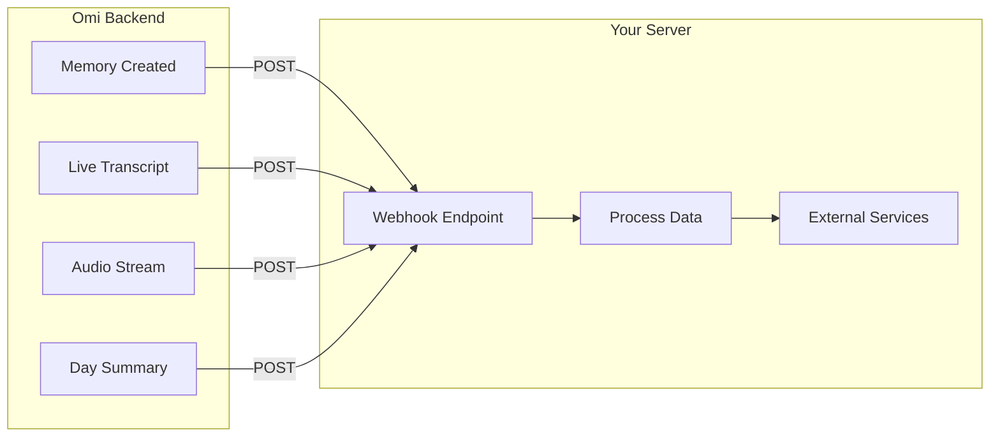

## What Are Integration Apps?

Integration apps allow Omi to interact with external services by sending data to your webhook endpoints. Unlike prompt-based apps, these require you to host a server.

<CardGroup cols={2}>
  <Card title="Memory Triggers" icon="bell">
    Run code when a memory is created
  </Card>
  <Card title="Real-Time Transcript" icon="bolt">
    Process live transcripts as they happen
  </Card>
  <Card title="Audio Streaming" icon="microphone">
    Receive raw audio bytes for custom processing
  </Card>
  <Card title="Day Summary" icon="calendar-day">
    Receive a daily recap of a user's conversations
  </Card>
</CardGroup>


```mermaid
flowchart LR
    subgraph Omi["Omi Backend"]
        M[Memory Created]
        T[Live Transcript]
        A[Audio Stream]
        D[Day Summary]
    end

    subgraph Your["Your Server"]
        W[Webhook Endpoint]
        P[Process Data]
        E[External Services]
    end

    M -->|POST| W
    T -->|POST| W
    A -->|POST| W
    D -->|POST| W
    W --> P
    P --> E
```

---

## Memory Creation Triggers

These apps are activated when Omi creates a new memory, allowing you to process or store the data externally.

<AccordionGroup>
  <Accordion title="How It Works" icon="gear">
    1. User completes a conversation
    2. Omi processes and creates a memory
    3. Your webhook receives the complete memory object
    4. Your server processes and responds

    The webhook receives the full conversation data including transcript, structured summary, action items, and metadata.
  </Accordion>
  <Accordion title="Example Use Cases" icon="lightbulb">
    - **Slack Integration**: Post conversation summaries to team channels
    - **CRM Updates**: Log customer interactions automatically
    - **Project Management**: Create tasks in Notion, Asana, or Jira
    - **Knowledge Base**: Build a searchable archive of conversations
    - **Analytics**: Track conversation patterns and insights
  </Accordion>
  <Accordion title="Video Tutorial" icon="video">
    <iframe
      width="560"
      height="315"
      src="https://www.youtube.com/embed/OOjWeGhuLeY?si=6Ya1GwqL4GSlq3mi"
      title="Memory Creation Triggers Tutorial"
      frameborder="0"
      allow="accelerometer; autoplay; clipboard-write; encrypted-media; gyroscope; picture-in-picture; web-share"
      referrerpolicy="strict-origin-when-cross-origin"
      allowfullscreen
    ></iframe>

    **Running FastAPI locally (no cloud deployment):**

    <iframe
      width="560"
      height="315"
      src="https://www.youtube.com/embed/bMU6fTLysRY?si=3cvXEsWAUwKEnjHn"
      title="Running FastAPI Locally"
      frameborder="0"
      allow="accelerometer; autoplay; clipboard-write; encrypted-media; gyroscope; picture-in-picture; web-share"
      referrerpolicy="strict-origin-when-cross-origin"
      allowfullscreen
    ></iframe>
  </Accordion>
</AccordionGroup>

### Webhook Payload

Your endpoint receives a POST request with the memory object:

`POST /your-endpoint?uid=user123`

```json
{
  "id": "memory_abc123",
  "created_at": "2024-07-22T23:59:45.910559+00:00",
  "started_at": "2024-07-21T22:34:43.384323+00:00",
  "finished_at": "2024-07-21T22:35:43.384323+00:00",
  "transcript_segments": [
    {
      "text": "Let's discuss the project timeline.",
      "speaker": "SPEAKER_00",
      "speakerId": 0,
      "speaker_name": "John",
      "is_user": false,
      "start": 10.0,
      "end": 15.0
    }
  ],
  "structured": {
    "title": "Project Timeline Discussion",
    "overview": "Brief overview of the conversation...",
    "emoji": "📅",
    "category": "work",
    "action_items": [
      {
        "description": "Send project proposal by Friday",
        "completed": false
      }
    ],
    "events": []
  },
  "apps_response": [],
  "discarded": false,
  "folder_id": "folder_uuid",
  "folder_name": "Work"
}
```

<Tip>
Check out the [Notion CRM Example](https://github.com/BasedHardware/Omi/blob/main/plugins/oauth/conversation_created.py) for a complete implementation.
</Tip>

---

## Real-Time Transcript Processors

Process conversation transcripts as they occur, enabling real-time analysis and actions.

<AccordionGroup>
  <Accordion title="How It Works" icon="gear">
    1. User starts speaking
    2. Omi transcribes in real-time
    3. Your webhook receives transcript segments as they're created
    4. Your server processes and can trigger immediate actions

    Segments arrive in multiple calls as the conversation unfolds, allowing for live reactions.
  </Accordion>
  <Accordion title="Example Use Cases" icon="lightbulb">
    - **Live Coaching**: Provide real-time feedback during presentations
    - **Fact-Checking**: Verify claims as they're made
    - **Smart Home**: Trigger actions based on spoken commands
    - **Sentiment Analysis**: Monitor emotional tone in real-time
    - **Translation**: Live translation of conversations
  </Accordion>
  <Accordion title="Video Tutorial" icon="video">
    <iframe
      width="560"
      height="315"
      src="https://www.youtube.com/embed/86D4v3n1o48?si=tQl-s9jikupjix0c"
      title="Real-Time Transcript Processing"
      frameborder="0"
      allow="accelerometer; autoplay; clipboard-write; encrypted-media; gyroscope; picture-in-picture; web-share"
      referrerpolicy="strict-origin-when-cross-origin"
      allowfullscreen
    ></iframe>
  </Accordion>
</AccordionGroup>

### Webhook Payload

Your endpoint receives transcript segments with session context:

`POST /your-endpoint?session_id=abc123&uid=user123`

```json
[
  {
    "text": "I think we should prioritize the mobile app.",
    "speaker": "SPEAKER_00",
    "speakerId": 0,
    "is_user": false,
    "start": 10.0,
    "end": 15.0
  },
  {
    "text": "Agreed, let's start with iOS.",
    "speaker": "SPEAKER_01",
    "speakerId": 1,
    "is_user": true,
    "start": 16.0,
    "end": 18.0
  }
]
```

### Implementation Tips

<Warning>
Real-time processors require careful design to avoid performance issues.
</Warning>

<CardGroup cols={2}>
  <Card title="Use session_id" icon="key">
    Track context across multiple calls using the session_id parameter
  </Card>
  <Card title="Avoid Redundancy" icon="copy">
    Implement logic to prevent processing the same segments twice
  </Card>
  <Card title="Accumulate Context" icon="layer-group">
    Build complete conversation context by storing segments
  </Card>
  <Card title="Handle Errors" icon="triangle-exclamation">
    Fail gracefully - don't block transcription with slow processing
  </Card>
</CardGroup>

<Tip>
See the [Real-time News Checker Example](https://github.com/BasedHardware/omi/blob/main/plugins/example/advanced/realtime.py) for a complete implementation.
</Tip>

---

## Real-Time Audio Bytes

Stream raw audio bytes from Omi directly to your endpoint for custom audio processing.

<AccordionGroup>
  <Accordion title="How It Works" icon="gear">
    1. User speaks into Omi device
    2. Raw PCM audio is streamed to your endpoint
    3. Your server processes the audio bytes directly
    4. Handle as needed (custom STT, VAD, feature extraction, etc.)

    Unlike transcript processors, you receive the actual audio data, not text.
  </Accordion>
  <Accordion title="Example Use Cases" icon="lightbulb">
    - **Custom ASR**: Use your own speech recognition models
    - **Voice Activity Detection**: Implement custom VAD logic
    - **Audio Features**: Extract spectrograms, embeddings, or other features
    - **Recording**: Store raw audio for later processing
    - **Real-time Translation**: Feed audio to translation services
  </Accordion>
</AccordionGroup>

### Technical Details

| Setting | Value |
|---------|-------|
| Trigger Type | `audio_bytes` |
| HTTP Method | POST |
| Content-Type | `application/octet-stream` |
| Audio Format | PCM16 (16-bit little-endian) |
| Bytes per Sample | 2 |

**Request format:**

`POST /your-endpoint?sample_rate=16000&uid=user123`

Body contains raw PCM16 audio bytes.

<Note>
To produce a playable WAV file, prepend a WAV header and concatenate the received chunks.
</Note>

### Configuring Delivery Frequency

You can control how often audio is sent via the Omi app Developer Settings:

```
url,seconds
```

For example: `https://your-endpoint.com/audio,5` sends audio every 5 seconds.

<Info>
For a complete implementation, see the [Audio Streaming Guide](/doc/developer/apps/AudioStreaming).
</Info>

---

## Day Summary

Receive a structured daily recap of a user's conversations, delivered at most once per day at the user's configured notification hour. The webhook only fires on days where the user actually had recorded, transcribed conversations — see *Delivery conditions* below.

<AccordionGroup>
  <Accordion title="How It Works" icon="gear">
    1. An hourly cron job runs at minute 0 of every UTC hour
    2. For each user whose local time matches their configured notification hour, Omi generates a comprehensive daily summary using an LLM
    3. Your webhook receives the summary
    4. Your server can store, display, or forward it to external services

    **Day selection logic:** If the user's local time is before noon (12:00), the summary covers the *previous* day's conversations; at noon or later it covers *today's* conversations.

    **Timezone requirement (scheduled delivery only):** The hourly cron job selects recipients by matching configured timezones to the current UTC hour, so users without a timezone are skipped by the schedule. The manual "Generate Summary" trigger described in the testing section falls back to UTC day boundaries and works without a configured timezone.

    **Delivery conditions (when the webhook does *not* fire):**
    - The user has no conversations for the selected day
    - All conversations for the day are either locked or have no transcribed speech
    - The user has no FCM push token registered. The cron path filters out token-less users when picking recipients, and the manual "Generate Summary" endpoint returns HTTP 400 in that case — the daily summary pipeline currently treats push delivery as a hard prerequisite for firing the webhook
    - A delivery for the same `(uid, date)` has already been started — Omi acquires an atomic Redis lock *before* the LLM call (TTL 2 hours), so any subsequent cron tick within that window is a no-op even if the earlier run hasn't finished or ended up skipping for one of the reasons above

    Treat days without a webhook delivery as "no recap available" rather than a failure — receivers should not assume the webhook fires every day.
  </Accordion>
  <Accordion title="Example Use Cases" icon="lightbulb">
    - **Personal CRM**: Log daily conversation highlights to a notes app or database
    - **Team Digest**: Post a Slack summary of a user's day every evening
    - **Journaling**: Auto-populate a daily journal with structured reflections
    - **Analytics Dashboard**: Aggregate daily stats across users
    - **Goal Tracking**: Surface action items and decisions for follow-up
  </Accordion>
</AccordionGroup>

### Webhook Payload

Your endpoint receives a POST request with the daily summary:

`POST /your-endpoint?uid=user123`

```json
{
  "uid": "user123",
  "created_at": "2024-01-15T22:00:00.123456+00:00",
  "summary": "{'id': '550e8400-...', 'date': '2024-01-15', 'headline': 'Productive day with three focused work sessions', ...}",
  "summary_json": {
    "id": "550e8400-e29b-41d4-a716-446655440000",
    "date": "2024-01-15",
    "headline": "Productive day with three focused work sessions",
    "overview": "...",
    "day_emoji": "💼",
    "stats": {
      "total_conversations": 3,
      "total_duration_minutes": 87,
      "action_items_count": 4
    },
    "highlights": [],
    "action_items": [],
    "unresolved_questions": [],
    "decisions_made": [],
    "knowledge_nuggets": [],
    "locations": []
  }
}
```

**Field reference:**

| Field | Type | Description |
|-------|------|-------------|
| `uid` | string | User identifier (also in query param) |
| `created_at` | string (ISO 8601 with `+00:00` offset) | Webhook send time in UTC |
| `summary_json` | object | **Recommended.** The daily summary as a real JSON object (schema below). Use this for any new integration. |
| `summary` | string | **Legacy.** The same payload serialized via Python's `str(...)`, kept for backward compatibility. See the migration note below. |

<Note>
**Use `summary_json` for new integrations.** The `summary` field stays on the wire so existing receivers don't break, but it's the legacy form: Python's `str(...)` on a `dict` produces a single-quoted Python literal (e.g. `"{'headline': '...'}"`) that **cannot** be parsed by `JSON.parse` and currently requires something Python-specific like `ast.literal_eval` to read. The new `summary_json` field carries the exact same payload as a real JSON object — every standard JSON parser handles it natively. Plan to migrate existing receivers to `summary_json`; the legacy `summary` field will be deprecated in a future release.
</Note>

The `summary_json` object has this shape (also reflects what `summary` represents once parsed):

```json
{
  "id": "550e8400-e29b-41d4-a716-446655440000",
  "date": "2024-01-15",
  "created_at": "2024-01-15T22:00:00.000000",
  "headline": "Productive day with three focused work sessions",
  "overview": "You had a productive day that included a project planning meeting, a deep-work coding session, and a team retrospective.",
  "day_emoji": "💼",
  "stats": {
    "total_conversations": 3,
    "total_duration_minutes": 87,
    "action_items_count": 4
  },
  "highlights": [
    {
      "topic": "Q2 Roadmap",
      "emoji": "🗺️",
      "summary": "Locked in the Q2 feature priorities with the product team.",
      "conversation_ids": ["conv_abc123"]
    }
  ],
  "action_items": [
    {
      "description": "Send project proposal to design team by Friday",
      "priority": "high",
      "completed": false,
      "source_conversation_id": "conv_abc123"
    }
  ],
  "unresolved_questions": [
    {
      "question": "Which deployment pipeline should we adopt?",
      "conversation_id": "conv_abc123"
    }
  ],
  "decisions_made": [
    {
      "decision": "Migrate analytics to BigQuery",
      "conversation_id": "conv_abc123"
    }
  ],
  "knowledge_nuggets": [
    {
      "insight": "GitHub Actions reusable workflows can take typed inputs since 2023",
      "conversation_id": "conv_abc123"
    }
  ],
  "locations": [
    {
      "name": "Home office",
      "latitude": 37.7749,
      "longitude": -122.4194,
      "time": "09:30"
    }
  ]
}
```

<Info>
The top-level `created_at` is the webhook send timestamp in UTC, with an explicit `+00:00` offset (e.g. `2024-01-15T22:00:00.123456+00:00`). The `created_at` *inside* `summary_json` (and inside the legacy `summary` string) is the timestamp when the summary object was built by the LLM pipeline; it is also UTC but emitted as a naive ISO 8601 string with no offset suffix. The two will be very close in time but are technically distinct timestamps.
</Info>

---

## Creating an Integration App

<Steps>
  <Step title="Choose Your Trigger Type" icon="toggle-on">
    Decide which integration type(s) you need:
    - **Memory Trigger**: Process completed conversations
    - **Real-Time Transcript**: React to live speech
    - **Audio Bytes**: Process raw audio
    - **Day Summary**: Receive a daily recap of conversations
  </Step>
  <Step title="Set Up Your Endpoint" icon="server">
    Create a webhook endpoint that can receive POST requests. For testing, use [webhook.site](https://webhook.site) or [webhook-test.com](https://webhook-test.com/).

    Your endpoint should:
    - Accept POST requests
    - Parse JSON body (or binary for audio)
    - Read `uid` from query parameters
    - Return 200 OK quickly
  </Step>
  <Step title="Implement Your Logic" icon="code">
    Process the incoming data and integrate with external services.

    **Example (Python/FastAPI):**
    ```python
    from fastapi import FastAPI, Request

    app = FastAPI()

    @app.post("/webhook")
    async def handle_memory(request: Request, uid: str):
        memory = await request.json()
        # Process memory data
        await send_to_slack(memory["structured"]["title"])
        return {"status": "ok"}
    ```
  </Step>
  <Step title="Test Your Integration" icon="flask">
    Use Developer Mode to test without creating new memories (see testing section below)
  </Step>
  <Step title="Submit Your App" icon="rocket">
    Publish through the Omi mobile app
  </Step>
</Steps>

---

## Testing Your Integration

<Steps>
  <Step title="Enable Developer Mode" icon="code">
    Open Omi app → Settings → Enable Developer Mode → Developer Settings
  </Step>
  <Step title="Set Webhook URL" icon="link">
    - **Memory Triggers**: Enter URL in "Memory Creation Webhook"
    - **Real-Time**: Enter URL in "Real-Time Transcript Webhook"
    - **Audio Bytes**: Enter URL (optionally with `,seconds` suffix) in "Audio Bytes Webhook"
    - **Day Summary**: Enter URL in "Day Summary Webhook"
  </Step>
  <Step title="Test Memory Triggers" icon="bell">
    Go to any memory → Tap 3-dot menu → Developer Tools → Trigger webhook with existing data
  </Step>
  <Step title="Test Real-Time" icon="bolt">
    Start speaking - your endpoint receives updates immediately
  </Step>
</Steps>

<Note>
The Day Summary webhook only fires on the scheduled cron path. The in-app "Generate Summary" trigger (Settings → Daily Summary → ⋮ menu) regenerates the summary on demand but does *not* currently POST to the developer webhook. The fastest way to validate a receiver is to enable the webhook, set its delivery hour to the next upcoming hour, and wait for the next cron tick.
</Note>

<Tip>
Use [webhook.site](https://webhook.site) to see exactly what data Omi sends before writing any code.
</Tip>

---

## App Submission Fields

When submitting your integration app:

| Field | Required | Description |
|-------|----------|-------------|
| **Webhook URL** | Yes | Your POST endpoint for receiving data |
| **Setup Completed URL** | No | GET endpoint returning `{"is_setup_completed": boolean}` |
| **Auth URL** | No | URL for user authentication (uid appended automatically) |
| **Setup Instructions** | No | Text or link explaining how to configure your app |

### Setup Instructions Best Practices

<CardGroup cols={2}>
  <Card title="Step-by-Step Guide" icon="list-ol">
    Clear numbered instructions for configuration
  </Card>
  <Card title="Screenshots" icon="image">
    Visual aids for complex setup steps
  </Card>
  <Card title="Authentication Flow" icon="key">
    If required, explain how to connect accounts
  </Card>
  <Card title="Troubleshooting" icon="screwdriver-wrench">
    Common issues and how to resolve them
  </Card>
</CardGroup>

<Info>
When users open your setup links, Omi automatically appends a `uid` query parameter. Use this to associate credentials with specific users.
</Info>

---

## Related Documentation

<CardGroup cols={2}>
  <Card title="Developer API" icon="code" href="/doc/developer/api">
    Access your own personal Omi data programmatically
  </Card>
  <Card title="Data Import APIs" icon="file-import" href="/doc/developer/apps/Import">
    Create conversations and memories via REST API
  </Card>
  <Card title="Audio Streaming Guide" icon="microphone" href="/doc/developer/apps/AudioStreaming">
    Detailed guide for processing raw audio bytes
  </Card>
  <Card title="Chat Tools" icon="wrench" href="/doc/developer/apps/ChatTools">
    Add custom tools users can invoke in chat
  </Card>
  <Card title="OAuth Setup" icon="key" href="/doc/developer/apps/Oauth">
    Add authentication flows to your apps
  </Card>
  <Card title="Notifications" icon="bell" href="/doc/developer/apps/Notifications">
    Send push notifications from your app
  </Card>
  <Card title="Prompt-Based Apps" icon="wand-magic-sparkles" href="/doc/developer/apps/PromptBased">
    Create apps without hosting a server
  </Card>
  <Card title="Apps Introduction" icon="puzzle-piece" href="/doc/developer/apps/Introduction">
    Overview of all app types
  </Card>
</CardGroup>
