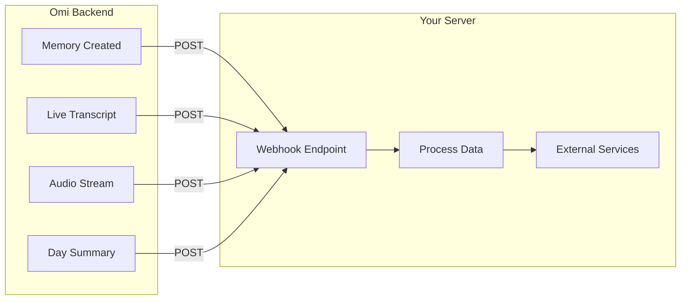

## What Are Integration Apps?

Integration apps allow Omi to interact with external services by sending data to your webhook endpoints. Unlike prompt-based apps, these require you to host a server.

<CardGroup cols={2}>
  <Card title="Memory Triggers" icon="bell">
    Run code when a memory is created
  </Card>
  <Card title="Real-Time Transcript" icon="bolt">
    Process live transcripts as they happen
  </Card>
  <Card title="Audio Streaming" icon="microphone">
    Receive raw audio bytes for custom processing
  </Card>
  <Card title="Day Summary" icon="calendar-day">
    Receive a daily recap of a user's conversations
  </Card>
</CardGroup>


```mermaid
flowchart LR
    subgraph Omi["Omi Backend"]
        M[Memory Created]
        T[Live Transcript]
        A[Audio Stream]
        D[Day Summary]
    end

    subgraph Your["Your Server"]
        W[Webhook Endpoint]
        P[Process Data]
        E[External Services]
    end

    M -->|POST| W
    T -->|POST| W
    A -->|POST| W
    D -->|POST| W
    W --> P
    P --> E
```

---

## Memory Creation Triggers

These apps are activated when Omi creates a new memory, allowing you to process or store the data externally.

<Note>
  This trigger also covers conversations uploaded from a Limitless Pendant. If an
  initial short fragment is discarded, Omi sends the event once later uploaded
  speech makes the conversation visible.
</Note>

<AccordionGroup>
  <Accordion title="How It Works" icon="gear">
    1. User completes a conversation
    2. Omi processes and creates a memory
    3. Your webhook receives the complete memory object
    4. Your server processes and responds

    The webhook receives the full conversation data including transcript, structured summary, action items, and metadata.
  </Accordion>
  <Accordion title="Example Use Cases" icon="lightbulb">
    - **Slack Integration**: Post conversation summaries to team channels
    - **CRM Updates**: Log customer interactions automatically
    - **Project Management**: Create tasks in Notion, Asana, or Jira
    - **Knowledge Base**: Build a searchable archive of conversations
    - **Analytics**: Track conversation patterns and insights
  </Accordion>
  <Accordion title="Video Tutorial" icon="video">
    <iframe
      width="560"
      height="315"
      src="https://www.youtube.com/embed/OOjWeGhuLeY?si=6Ya1GwqL4GSlq3mi"
      title="Memory Creation Triggers Tutorial"
      frameborder="0"
      allow="accelerometer; autoplay; clipboard-write; encrypted-media; gyroscope; picture-in-picture; web-share"
      referrerpolicy="strict-origin-when-cross-origin"
      allowfullscreen
    ></iframe>

    **Running FastAPI locally (no cloud deployment):**

    <iframe
      width="560"
      height="315"
      src="https://www.youtube.com/embed/bMU6fTLysRY?si=3cvXEsWAUwKEnjHn"
      title="Running FastAPI Locally"
      frameborder="0"
      allow="accelerometer; autoplay; clipboard-write; encrypted-media; gyroscope; picture-in-picture; web-share"
      referrerpolicy="strict-origin-when-cross-origin"
      allowfullscreen
    ></iframe>
  </Accordion>
</AccordionGroup>

### Webhook Payload

Your endpoint receives a POST request with the memory object:

`POST /your-endpoint?uid=user123`

```json
{
  "id": "memory_abc123",
  "created_at": "2024-07-22T23:59:45.910559+00:00",
  "started_at": "2024-07-21T22:34:43.384323+00:00",
  "finished_at": "2024-07-21T22:35:43.384323+00:00",
  "transcript_segments": [
    {
      "text": "Let's discuss the project timeline.",
      "speaker": "SPEAKER_00",
      "speakerId": 0,
      "speaker_name": "John",
      "is_user": false,
      "start": 10.0,
      "end": 15.0
    }
  ],
  "structured": {
    "title": "Project Timeline Discussion",
    "overview": "Brief overview of the conversation...",
    "emoji": "📅",
    "category": "work",
    "action_items": [
      {
        "description": "Send project proposal by Friday",
        "completed": false
      }
    ],
    "events": []
  },
  "apps_response": [],
  "discarded": false,
  "folder_id": "folder_uuid",
  "folder_name": "Work"
}
```

<Tip>
Check out the [Notion CRM Example](https://github.com/BasedHardware/Omi/blob/main/plugins/oauth/conversation_created.py) for a complete implementation.
</Tip>

---

## Real-Time Transcript Processors

Process conversation transcripts as they occur, enabling real-time analysis and actions.

<Note>
  This trigger requires an active live-listen session. Historical or
  store-and-forward uploads, including Limitless Pendant WAL uploads, do not
  replay transcript segments through the real-time webhook.
</Note>

<AccordionGroup>
  <Accordion title="How It Works" icon="gear">
    1. User starts speaking
    2. Omi transcribes in real-time
    3. Your webhook receives transcript segments as they're created
    4. Your server processes and can trigger immediate actions

    Segments arrive in multiple calls as the conversation unfolds, allowing for live reactions.
  </Accordion>
  <Accordion title="Example Use Cases" icon="lightbulb">
    - **Live Coaching**: Provide real-time feedback during presentations
    - **Fact-Checking**: Verify claims as they're made
    - **Smart Home**: Trigger actions based on spoken commands
    - **Sentiment Analysis**: Monitor emotional tone in real-time
    - **Translation**: Live translation of conversations
  </Accordion>
  <Accordion title="Video Tutorial" icon="video">
    <iframe
      width="560"
      height="315"
      src="https://www.youtube.com/embed/86D4v3n1o48?si=tQl-s9jikupjix0c"
      title="Real-Time Transcript Processing"
      frameborder="0"
      allow="accelerometer; autoplay; clipboard-write; encrypted-media; gyroscope; picture-in-picture; web-share"
      referrerpolicy="strict-origin-when-cross-origin"
      allowfullscreen
    ></iframe>
  </Accordion>
</AccordionGroup>

### Webhook Payload

Your endpoint receives transcript segments with session context:

`POST /your-endpoint?session_id=abc123&uid=user123`

```json
[
  {
    "text": "I think we should prioritize the mobile app.",
    "speaker": "SPEAKER_00",
    "speakerId": 0,
    "is_user": false,
    "start": 10.0,
    "end": 15.0
  },
  {
    "text": "Agreed, let's start with iOS.",
    "speaker": "SPEAKER_01",
    "speakerId": 1,
    "is_user": true,
    "start": 16.0,
    "end": 18.0
  }
]
```

### Implementation Tips

<Warning>
Real-time processors require careful design to avoid performance issues.
</Warning>

<CardGroup cols={2}>
  <Card title="Use session_id" icon="key">
    Track context across multiple calls using the session_id parameter
  </Card>
  <Card title="Avoid Redundancy" icon="copy">
    Implement logic to prevent processing the same segments twice
  </Card>
  <Card title="Accumulate Context" icon="layer-group">
    Build complete conversation context by storing segments
  </Card>
  <Card title="Handle Errors" icon="triangle-exclamation">
    Fail gracefully - don't block transcription with slow processing
  </Card>
</CardGroup>

---

## Real-Time Audio Bytes

Stream raw audio bytes from Omi directly to your endpoint for custom audio processing.

<Note>
  Audio-byte delivery requires an active live-listen session. Historical or
  store-and-forward uploads do not replay their audio through this webhook.
</Note>

<AccordionGroup>
  <Accordion title="How It Works" icon="gear">
    1. User speaks into Omi device
    2. Raw PCM audio is streamed to your endpoint
    3. Your server processes the audio bytes directly
    4. Handle as needed (custom STT, VAD, feature extraction, etc.)

    Unlike transcript processors, you receive the actual audio data, not text.
  </Accordion>
  <Accordion title="Example Use Cases" icon="lightbulb">
    - **Custom ASR**: Use your own speech recognition models
    - **Voice Activity Detection**: Implement custom VAD logic
    - **Audio Features**: Extract spectrograms, embeddings, or other features
    - **Recording**: Store raw audio for later processing
    - **Real-time Translation**: Feed audio to translation services
  </Accordion>
</AccordionGroup>

### Technical Details

| Setting | Value |
|---------|-------|
| Trigger Type | `audio_bytes` |
| HTTP Method | POST |
| Content-Type | `application/octet-stream` |
| Audio Format | PCM16 (16-bit little-endian) |
| Bytes per Sample | 2 |

**Request format:**

`POST /your-endpoint?sample_rate=16000&uid=user123`

Body contains raw PCM16 audio bytes.

<Note>
To produce a playable WAV file, prepend a WAV header and concatenate the received chunks.
</Note>

### Configuring Delivery Frequency

You can control how often audio is sent via the Omi app Developer Settings:

```
url,seconds
```

For example: `https://your-endpoint.com/audio,5` sends audio every 5 seconds.

<Info>
For a complete implementation, see the [Audio Streaming Guide](/doc/developer/apps/AudioStreaming).
</Info>

---

## Day Summary

Receive a structured daily recap of a user's conversations, delivered at most once per day at the user's configured notification hour. The webhook only fires on days where the user actually had recorded, transcribed conversations — see *Delivery conditions* below.

<AccordionGroup>
  <Accordion title="How It Works" icon="gear">
    1. An hourly cron job runs at minute 0 of every UTC hour
    2. For each user whose local time matches their configured notification hour, Omi generates a comprehensive daily summary using an LLM
    3. Your webhook receives the summary
    4. Your server can store, display, or forward it to external services

    **Day selection logic:** If the user's local time is before noon (12:00), the summary covers the *previous* day's conversations; at noon or later it covers *today's* conversations.

    **Timezone requirement (scheduled delivery only):** The hourly cron job selects recipients by matching configured timezones to the current UTC hour, so users without a timezone are skipped by the schedule. The manual "Generate Summary" trigger described in the testing section falls back to UTC day boundaries and works without a configured timezone.

    **Delivery conditions (when the webhook does *not* fire):**
    - The user has no conversations for the selected day
    - All conversations for the day are either locked or have no transcribed speech
    - The user has no FCM push token registered. The cron path filters out token-less users when picking recipients, and the manual "Generate Summary" endpoint returns HTTP 400 in that case — the daily summary pipeline currently treats push delivery as a hard prerequisite for firing the webhook
    - A delivery for the same `(uid, date)` has already been started — Omi acquires an atomic Redis lock *before* the LLM call (TTL 2 hours), so any subsequent cron tick within that window is a no-op even if the earlier run hasn't finished or ended up skipping for one of the reasons above

    Treat days without a webhook delivery as "no recap available" rather than a failure — receivers should not assume the webhook fires every day.
  </Accordion>
  <Accordion title="Example Use Cases" icon="lightbulb">
    - **Personal CRM**: Log daily conversation highlights to a notes app or database
    - **Team Digest**: Post a Slack summary of a user's day every evening
    - **Journaling**: Auto-populate a daily journal with structured reflections
    - **Analytics Dashboard**: Aggregate daily stats across users
    - **Goal Tracking**: Surface action items and decisions for follow-up
  </Accordion>
</AccordionGroup>

### Webhook Payload

Your endpoint receives a POST request with the daily summary:

`POST /your-endpoint?uid=user123`

```json
{
  "uid": "user123",
  "created_at": "2024-01-15T22:00:00.123456+00:00",
  "summary": "{'id': '550e8400-...', 'date': '2024-01-15', 'headline': 'Productive day with three focused work sessions', ...}",
  "summary_json": {
    "id": "550e8400-e29b-41d4-a716-446655440000",
    "date": "2024-01-15",
    "headline": "Productive day with three focused work sessions",
    "overview": "...",
    "day_emoji": "💼",
    "stats": {
      "total_conversations": 3,
      "total_duration_minutes": 87,
      "action_items_count": 4
    },
    "highlights": [],
    "action_items": [],
    "unresolved_questions": [],
    "decisions_made": [],
    "knowledge_nuggets": [],
    "locations": []
  }
}
```

**Field reference:**

| Field | Type | Description |
|-------|------|-------------|
| `uid` | string | User identifier (also in query param) |
| `created_at` | string (ISO 8601 with `+00:00` offset) | Webhook send time in UTC |
| `summary_json` | object | **Recommended.** The daily summary as a real JSON object (schema below). Use this for any new integration. |
| `summary` | string | **Legacy.** The same payload serialized via Python's `str(...)`, kept for backward compatibility. See the migration note below. |

<Note>
**Use `summary_json` for new integrations.** The `summary` field stays on the wire so existing receivers don't break, but it's the legacy form: Python's `str(...)` on a `dict` produces a single-quoted Python literal (e.g. `"{'headline': '...'}"`) that **cannot** be parsed by `JSON.parse` and currently requires something Python-specific like `ast.literal_eval` to read. The new `summary_json` field carries the exact same payload as a real JSON object — every standard JSON parser handles it natively. Plan to migrate existing receivers to `summary_json`; the legacy `summary` field will be deprecated in a future release.
</Note>

The `summary_json` object has this shape (also reflects what `summary` represents once parsed):

```json
{
  "id": "550e8400-e29b-41d4-a716-446655440000",
  "date": "2024-01-15",
  "created_at": "2024-01-15T22:00:00.000000",
  "headline": "Productive day with three focused work sessions",
  "overview": "You had a productive day that included a project planning meeting, a deep-work coding session, and a team retrospective.",
  "day_emoji": "💼",
  "stats": {
    "total_conversations": 3,
    "total_duration_minutes": 87,
    "action_items_count": 4
  },
  "highlights": [
    {
      "topic": "Q2 Roadmap",
      "emoji": "🗺️",
      "summary": "Locked in the Q2 feature priorities with the product team.",
      "conversation_ids": ["conv_abc123"]
    }
  ],
  "action_items": [
    {
      "description": "Send project proposal to design team by Friday",
      "priority": "high",
      "completed": false,
      "source_conversation_id": "conv_abc123"
    }
  ],
  "unresolved_questions": [
    {
      "question": "Which deployment pipeline should we adopt?",
      "conversation_id": "conv_abc123"
    }
  ],
  "decisions_made": [
    {
      "decision": "Migrate analytics to BigQuery",
      "conversation_id": "conv_abc123"
    }
  ],
  "knowledge_nuggets": [
    {
      "insight": "GitHub Actions reusable workflows can take typed inputs since 2023",
      "conversation_id": "conv_abc123"
    }
  ],
  "locations": [
    {
      "name": "Home office",
      "latitude": 37.7749,
      "longitude": -122.4194,
      "time": "09:30"
    }
  ]
}
```

<Info>
The top-level `created_at` is the webhook send timestamp in UTC, with an explicit `+00:00` offset (e.g. `2024-01-15T22:00:00.123456+00:00`). The `created_at` *inside* `summary_json` (and inside the legacy `summary` string) is the timestamp when the summary object was built by the LLM pipeline; it is also UTC but emitted as a naive ISO 8601 string with no offset suffix. The two will be very close in time but are technically distinct timestamps.
</Info>

---

## Verifying Webhook Signatures

Anyone who knows a user's `uid` can send your endpoint a request that looks like one of the payloads above. To prove a request really came from Omi, issue a **signing secret** for your destination and check the signature on every delivery before you trust `uid`.

### Getting a secret

<Steps>
  <Step title="Developer webhooks" icon="gear">
    In the Omi web app open **Settings → Developer → Webhooks**. The **Signing secret** row sits under the four webhook URLs. Click **Create secret**; the secret (`whsec_...`) is shown **once**, so copy it into your server's secret manager before closing the dialog. One secret signs every developer webhook you have configured.
  </Step>
  <Step title="Integration apps" icon="puzzle-piece">
    Open your app from **Connectors**, click **Edit**, and find **Webhook signing** in the **External Integration** section (it appears once the app exists). **Create secret** works the same way. Each app has its own secret, and only the app owner can manage it.
  </Step>
  <Step title="Rotate or delete" icon="rotate">
    **Rotate** issues a new secret immediately and keeps the current one valid for 24 hours, so you can update your server without dropping deliveries. Only the current and the previous secret are kept. **Delete** turns signing off; deliveries then carry no signature headers.
  </Step>
</Steps>

The same actions are available over the API with your normal Omi `Authorization` header:

| Destination | Endpoint |
|-------------|----------|
| Developer webhooks | `POST`, `GET`, `DELETE` `/v1/users/developer/webhook-signing-secret` |
| An integration app you own | `POST`, `GET`, `DELETE` `/v1/apps/{app_id}/webhook-signing-secret` |

`POST` issues the secret and returns it **once**; calling it again **rotates** (`previous_valid_until` in the response tells you how long the old secret keeps signing). `GET` reports whether a secret is configured. `DELETE` turns signing off.

Issue, rotate and delete are limited to 10 calls per hour per account across both destinations; a refused call answers `429` with a `Retry-After` header. Reading the status is not limited.

### What a signed delivery carries

| Header | Value |
|--------|-------|
| `X-Omi-Signature` | `t=<unix seconds>,v1=<hex HMAC-SHA256>`. During a rotation window there are two `v1=` entries, one per secret. |
| `X-Omi-Event` | The webhook type: `memory_created`, `realtime_transcript`, `audio_bytes`, `day_summary` or `button_event` |
| `X-Omi-Delivery` | A stable id for this delivery, repeated unchanged on every retry |
| `Idempotency-Key` | Developer webhooks: the same id as `X-Omi-Delivery`. Integration apps receive it as `X-Omi-Idempotency-Key` on memory deliveries. |

### The signed string

The signature is HMAC-SHA256, keyed with your secret, over these bytes, in this order:

1. the `t` value from the header, as decimal ASCII digits;
2. one `.` (ASCII 0x2E);
3. the `uid` Omi appended to the request's query string, as the decoded parameter value, UTF-8 encoded;
4. one `.`;
5. the raw request body, byte for byte.

So for `t=1760000000`, `?uid=abc123` and a JSON body, the signed bytes are `1760000000.abc123.{"id":...}`. Every delivery Omi sends today carries `uid`; if a future event has none, the segment is empty (`1760000000..<body>`). The signature covers `uid` on purpose: most bodies do not contain the user id, so without it a captured delivery could be replayed within the tolerance window with someone else's `uid` in the query string. A changed `uid` makes verification fail.

Verify against the exact body bytes you received: parsing the JSON and serializing it again will not match. Reject timestamps more than five minutes away from your clock so a captured delivery cannot be replayed later.

A destination without a secret receives exactly what it receives today, with none of these headers.

<Warning>
Two paths are **not** signed yet: chat-tool invocations (the `{uid, app_id, tool_name, ...}` POSTs described in [Chat Tools](/doc/developer/apps/ChatTools)) and the `audio_bytes_websocket` stream. Keep treating `uid` in those as unverified until signing lands for them.
</Warning>

### Verifying (Python)

`body` must be the raw request **bytes** (`await request.body()`), never a parsed-and-re-serialized object. `uid` is the value from the query string. The comparison runs on bytes so a hostile non-ASCII header yields `False` (your 401) rather than an exception (a 500).

```python
import hashlib
import hmac
import time

TOLERANCE_SECONDS = 300


def verify_omi_signature(headers, body: bytes, uid: str, secret: str) -> bool:
    if not isinstance(body, (bytes, bytearray)):
        return False
    timestamp, signatures = None, []
    for part in headers.get("X-Omi-Signature", "").split(","):
        key, _, value = part.strip().partition("=")
        if key == "t" and value.isascii() and value.isdigit():
            timestamp = int(value)  # isascii: "²".isdigit() is True and int("²") raises
        elif key == "v1" and value:
            signatures.append(value)
    if timestamp is None or not signatures:
        return False
    if abs(time.time() - timestamp) > TOLERANCE_SECONDS:
        return False  # stale or from the future: treat as a replay
    message = f"{timestamp}.{uid}.".encode("utf-8") + bytes(body)
    expected = hmac.new(secret.encode("utf-8"), message, hashlib.sha256).hexdigest().encode("ascii")
    return any(hmac.compare_digest(expected, candidate.encode("utf-8")) for candidate in signatures)
```

Used from the FastAPI handler shown below:

```python
import json
import os

from fastapi import FastAPI, HTTPException, Request

app = FastAPI()
OMI_WEBHOOK_SECRET = os.environ["OMI_WEBHOOK_SECRET"]


@app.post("/webhook")
async def handle_memory(request: Request, uid: str):
    body = await request.body()  # raw bytes: do not use request.json() here
    if not verify_omi_signature(request.headers, body, uid, OMI_WEBHOOK_SECRET):
        raise HTTPException(status_code=401, detail="Invalid Omi signature")
    memory = json.loads(body)  # only now is uid trustworthy
    return {"status": "ok"}
```

### Verifying (Node)

Same rules: the body must be the raw bytes (use a raw body parser, not a JSON one, on the webhook route), `uid` comes from the query string, and the comparison is constant-time on equal-length buffers.

```ts
import { createHmac, timingSafeEqual } from "node:crypto";
import express from "express";

const TOLERANCE_SECONDS = 300;

export function verifyOmiSignature(
  signatureHeader: string | undefined,
  body: Buffer,
  uid: string,
  secret: string,
): boolean {
  if (!signatureHeader || !Buffer.isBuffer(body)) return false;
  let timestamp: number | undefined;
  const signatures: string[] = [];
  for (const part of signatureHeader.split(",")) {
    const [key, ...rest] = part.trim().split("=");
    const value = rest.join("=");
    if (key === "t" && /^\d+$/.test(value)) timestamp = Number(value);
    else if (key === "v1" && value) signatures.push(value);
  }
  if (timestamp === undefined || signatures.length === 0) return false;
  if (Math.abs(Date.now() / 1000 - timestamp) > TOLERANCE_SECONDS) return false; // stale or future: replay
  const expected = Buffer.from(
    createHmac("sha256", secret).update(`${timestamp}.${uid}.`).update(body).digest("hex"),
  );
  return signatures.some((candidate) => {
    const given = Buffer.from(candidate);
    return given.length === expected.length && timingSafeEqual(expected, given);
  });
}

const app = express();
const OMI_WEBHOOK_SECRET = process.env.OMI_WEBHOOK_SECRET!;

// express.raw keeps req.body as the exact bytes Omi sent; express.json() would re-serialize them.
// Raise the default 100 kb limit: a memory_created body with a long transcript is larger, and a
// 413 from the body parser would reject the delivery before it is ever verified.
app.post("/webhook", express.raw({ type: "*/*", limit: "10mb" }), (req, res) => {
  const uid = String(req.query.uid ?? "");
  if (!verifyOmiSignature(req.header("X-Omi-Signature"), req.body, uid, OMI_WEBHOOK_SECRET)) {
    return res.status(401).json({ error: "Invalid Omi signature" });
  }
  const memory = JSON.parse(req.body.toString("utf8")); // only now is uid trustworthy
  return res.json({ status: "ok" });
});
```

### Retries and duplicate deliveries

Developer webhooks are retried after a network error, a 5xx, a 408 or a 429: up to three more attempts, roughly 1, 5 and 30 seconds later. Any other 4xx is treated as final and is not retried. Every attempt carries the same `Idempotency-Key` and `X-Omi-Delivery`, so keep a short-lived record of the ids you have processed and skip repeats. Each attempt is signed with a fresh timestamp. A developer webhook that fails 100 times in a row is switched off automatically and you receive a notification; fix the endpoint, then re-enable the webhook in Developer Settings.

---

## Creating an Integration App

<Steps>
  <Step title="Choose Your Trigger Type" icon="toggle-on">
    Decide which integration type(s) you need:
    - **Memory Trigger**: Process completed conversations
    - **Real-Time Transcript**: React to live speech
    - **Audio Bytes**: Process raw audio
    - **Day Summary**: Receive a daily recap of conversations
  </Step>
  <Step title="Set Up Your Endpoint" icon="server">
    Create a webhook endpoint that can receive POST requests. For testing, use [webhook.site](https://webhook.site) or [webhook-test.com](https://webhook-test.com/).

    Your endpoint should:
    - Accept POST requests
    - Verify `X-Omi-Signature` (see [Verifying Webhook Signatures](#verifying-webhook-signatures)) before trusting the request
    - Parse JSON body (or binary for audio)
    - Read `uid` from query parameters
    - Return 200 OK quickly
  </Step>
  <Step title="Implement Your Logic" icon="code">
    Process the incoming data and integrate with external services.

    **Example (Python/FastAPI):**
    ```python
    from fastapi import FastAPI, Request

    app = FastAPI()

    @app.post("/webhook")
    async def handle_memory(request: Request, uid: str):
        memory = await request.json()
        # Process memory data
        await send_to_slack(memory["structured"]["title"])
        return {"status": "ok"}
    ```
  </Step>
  <Step title="Test Your Integration" icon="flask">
    Use Developer Mode to test without creating new memories (see testing section below)
  </Step>
  <Step title="Submit Your App" icon="rocket">
    Publish through the Omi mobile app
  </Step>
</Steps>

---

## Testing Your Integration

### Locally, with no device

`omi-cli` ships the same requests Omi sends, so a receiver can be built and
debugged before any hardware is involved.

```bash
pipx install omi-cli

omi app events                  # what an app can receive
omi app serve                   # a receiver on http://127.0.0.1:8787
omi app send memory_created --to http://127.0.0.1:8787/webhook
```

`send` posts the sample body with the same query parameters, content type and
`Idempotency-Key` header the backend uses, prints the status and your response,
and exits non-zero when the response is not 2xx. With `--to` pointing at your
own endpoint, the day summary no longer waits for the delivery hour and the
real-time transcript no longer waits for someone to speak.

For `realtime_transcript` it also reports whether your reply would reach the
user, since Omi only shows a `message` longer than 5 characters, and only when
you answer 200.

Before submitting the app, check the URL you are submitting:

```bash
omi app verify --to https://your-app.example.com/webhook
```

`verify` posts every event and reports what Omi's delivery client would do with
your endpoint, including the parts that are invisible from the outside: a
private or loopback host is refused before any request is sent, a redirect is
never followed, and a response slower than 30 seconds is a failed delivery.
These are real deliveries, so use a staging URL if your app writes somewhere on
receipt.

### End to end, from the app

<Steps>
  <Step title="Enable Developer Mode" icon="code">
    Open Omi app → Settings → Enable Developer Mode → Developer Settings
  </Step>
  <Step title="Set Webhook URL" icon="link">
    - **Memory Triggers**: Enter URL in "Memory Creation Webhook"
    - **Real-Time**: Enter URL in "Real-Time Transcript Webhook"
    - **Audio Bytes**: Enter URL (optionally with `,seconds` suffix) in "Audio Bytes Webhook"
    - **Day Summary**: Enter URL in "Day Summary Webhook"
  </Step>
  <Step title="Test Memory Triggers" icon="bell">
    Go to any memory → Tap 3-dot menu → Developer Tools → Trigger webhook with existing data
  </Step>
  <Step title="Test Real-Time" icon="bolt">
    Start speaking - your endpoint receives updates immediately
  </Step>
</Steps>

<Note>
The Day Summary webhook only fires on the scheduled cron path. The in-app "Generate Summary" trigger (Settings → Daily Summary → ⋮ menu) regenerates the summary on demand but does *not* currently POST to the developer webhook. The fastest way to validate a receiver is to enable the webhook, set its delivery hour to the next upcoming hour, and wait for the next cron tick.
</Note>

<Tip>
Use [webhook.site](https://webhook.site) to see exactly what data Omi sends before writing any code.
</Tip>

---

## App Submission Fields

When submitting your integration app:

| Field | Required | Description |
|-------|----------|-------------|
| **Webhook URL** | Yes | Your POST endpoint for receiving data |
| **Setup Completed URL** | No | GET endpoint returning `{"is_setup_completed": boolean}` |
| **Auth URL** | No | URL for user authentication (uid appended automatically) |
| **Setup Instructions** | No | Text or link explaining how to configure your app |

### Setup Instructions Best Practices

<CardGroup cols={2}>
  <Card title="Step-by-Step Guide" icon="list-ol">
    Clear numbered instructions for configuration
  </Card>
  <Card title="Screenshots" icon="image">
    Visual aids for complex setup steps
  </Card>
  <Card title="Authentication Flow" icon="key">
    If required, explain how to connect accounts
  </Card>
  <Card title="Troubleshooting" icon="screwdriver-wrench">
    Common issues and how to resolve them
  </Card>
</CardGroup>

<Info>
When users open your setup links, Omi automatically appends a `uid` query parameter. Use this to associate credentials with specific users.
</Info>

---

## Related Documentation

<CardGroup cols={2}>
  <Card title="Developer API" icon="code" href="/doc/developer/api">
    Access your own personal Omi data programmatically
  </Card>
  <Card title="Data Import APIs" icon="file-import" href="/doc/developer/apps/Import">
    Create conversations and memories via REST API
  </Card>
  <Card title="Audio Streaming Guide" icon="microphone" href="/doc/developer/apps/AudioStreaming">
    Detailed guide for processing raw audio bytes
  </Card>
  <Card title="Chat Tools" icon="wrench" href="/doc/developer/apps/ChatTools">
    Add custom tools users can invoke in chat
  </Card>
  <Card title="OAuth Setup" icon="key" href="/doc/developer/apps/Oauth">
    Add authentication flows to your apps
  </Card>
  <Card title="Notifications" icon="bell" href="/doc/developer/apps/Notifications">
    Send push notifications from your app
  </Card>
  <Card title="Prompt-Based Apps" icon="wand-magic-sparkles" href="/doc/developer/apps/PromptBased">
    Create apps without hosting a server
  </Card>
  <Card title="Apps Introduction" icon="puzzle-piece" href="/doc/developer/apps/Introduction">
    Overview of all app types
  </Card>
</CardGroup>
