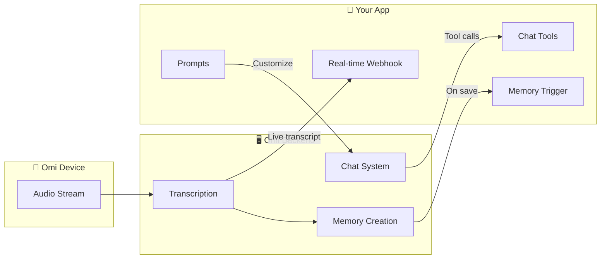

## What Are Omi Apps?

Omi apps are modular extensions that augment the core functionality of the Omi platform. They can modify AI behavior, analyze conversations, and connect with external services.

<CardGroup cols={2}>
  <Card title="Customize AI Behavior" icon="wand-magic-sparkles">
    Create custom AI personalities, alter conversation styles, or add specialized knowledge
  </Card>
  <Card title="Real-time Processing" icon="bolt">
    Process live transcripts as conversations happen
  </Card>
  <Card title="External Integrations" icon="plug">
    Connect Omi to Slack, Notion, GitHub, and any external service
  </Card>
  <Card title="Earn Revenue" icon="coins">
    Publish to the app store and monetize your creations
  </Card>
</CardGroup>

---

## Prompt-Based Apps

Customize how Omi thinks and responds - **no server required!**

<CardGroup cols={2}>
  <Card title="Chat Prompts" icon="comment" href="/doc/developer/apps/PromptBased">
    Alter Omi's conversational style and knowledge base. Create expert personas, custom assistants, or specialized advisors.

    **Example:** Make Omi communicate like a fitness coach or financial advisor
  </Card>
  <Card title="Memory Prompts" icon="brain" href="/doc/developer/apps/PromptBased">
    Customize how conversations are analyzed and summarized. Extract specific information based on your criteria.

    **Example:** Extract action items, key decisions, or meeting notes
  </Card>
</CardGroup>

<Tip>
Prompt-based apps are the easiest to create - just define your prompt and you're done!
</Tip>

---

## Integration Apps

Connect Omi to external services with webhooks and APIs.

<CardGroup cols={2}>
  <Card title="Memory Triggers" icon="bell" href="/doc/developer/apps/Integrations">
    Run your code when a memory is created. Perfect for syncing to external tools.

    **Example:** Post conversation summaries to Slack or update a CRM
  </Card>
  <Card title="Real-time Transcript" icon="bolt" href="/doc/developer/apps/Integrations">
    Process live audio transcripts as they happen. Enable real-time reactions.

    **Example:** Trigger smart home actions or live coaching feedback
  </Card>
  <Card title="Chat Tools" icon="wrench" href="/doc/developer/apps/ChatTools">
    Add custom tools that users can invoke in Omi chat.

    **Example:** "Send a message to #general in Slack" or "Create a GitHub issue"
  </Card>
  <Card title="Audio Streaming" icon="microphone" href="/doc/developer/apps/AudioStreaming">
    Process raw audio bytes for custom STT, VAD, or audio analysis.

    **Example:** Custom speech recognition or audio feature extraction
  </Card>
</CardGroup>

<Info>
Integration apps require a server endpoint (webhook) to receive data from Omi.
</Info>

---

## Quick Start: Build Your First App in 5 Minutes

Test the integration flow without writing any server code.

<Steps>
  <Step title="Create a Test Webhook" icon="link">
    Go to [webhook.site](https://webhook.site) and copy your unique URL.

    <Frame>
      
    </Frame>
  </Step>
  <Step title="Download the Omi App" icon="mobile">
    Get the app from the [App Store](https://apps.apple.com/us/app/friend-ai-wearable/id6502156163) or [Google Play](https://play.google.com/store/apps/details?id=com.friend.ios).
  </Step>
  <Step title="Create Your App" icon="plus">
    In the Omi app: **Explore → Create an App**

    <Note>
    If you don't see "Explore", go to Settings and select "Connect Device" first.
    </Note>
  </Step>
  <Step title="Configure & Install" icon="gear">
    1. Select a capability (e.g., "Real-time Transcript")
    2. Paste your webhook.site URL
    3. Install the app
  </Step>
  <Step title="Test It!" icon="play">
    Start speaking - watch real-time data appear on webhook.site!
  </Step>
</Steps>

---

## Example Apps

Learn from real apps built by the community.

<CardGroup cols={2}>
  <Card title="Hey Omi" icon="bell" href="https://h.omi.me/apps/hey-omi-01JCZJQWAZ1J6PYNDW4S15Y5JD">
    Ask questions and get answers via notification in real-time.

    [View Source Code →](https://github.com/BasedHardware/omi/blob/main/plugins/example/notifications/hey_omi.py)
  </Card>
  <Card title="Omi Mentor" icon="graduation-cap" href="https://h.omi.me/apps/omi-your-mentor-and-teacher-01JCPRSZ7FS40FHFNSJZEWR8R1">
    Proactive AI mentor that provides guidance during conversations.

    [View Source Code →](https://github.com/BasedHardware/omi/blob/main/plugins/example/notifications/mentor/main.py)
  </Card>
  <Card title="Slack Integration" icon="hashtag" href="https://h.omi.me/apps/01K7GFKJ2JJVYH7868HW81GY7X">
    Post conversation summaries and memories to Slack channels.

    [View Source Code →](https://github.com/BasedHardware/omi-slack-app)
  </Card>
  <Card title="Zapier" icon="zap" href="https://h.omi.me/apps/zapier">
    Connect Omi to 5000+ apps through Zapier automations.

    [View Source Code →](https://github.com/BasedHardware/omi/tree/main/plugins/example/zapier)
  </Card>
  <Card title="GitHub" icon="github" href="https://h.omi.me/apps/01K7BHKJR79KQQW7ZZGZX7GCGD">
    Create issues and manage PRs from your conversations.

    [View Source Code →](https://github.com/aaravgarg/omi-github-app)
  </Card>
  <Card title="RingCentral" icon="phone" href="https://h.omi.me/apps/01K7TCGJE6HQA7HS8S87R7585J">
    Integrate Omi with RingCentral communications.

    [View Source Code →](https://github.com/BasedHardware/omi-ringcentral-app)
  </Card>
</CardGroup>

---

## Next Steps

<CardGroup cols={3}>
  <Card title="Prompt Apps Guide" icon="wand-magic-sparkles" href="/doc/developer/apps/PromptBased">
    Create apps that customize AI personality and memory processing - no server required
  </Card>
  <Card title="Integration Guide" icon="plug" href="/doc/developer/apps/Integrations">
    Build webhooks for memory triggers and real-time transcript processing
  </Card>
  <Card title="Chat Tools Guide" icon="wrench" href="/doc/developer/apps/ChatTools">
    Add custom tools that users can invoke in Omi conversations
  </Card>
</CardGroup>

<CardGroup cols={2}>
  <Card title="Audio Streaming" icon="microphone" href="/doc/developer/apps/AudioStreaming">
    Process raw audio bytes for custom STT or audio analysis
  </Card>
  <Card title="Submit Your App" icon="rocket" href="/doc/developer/apps/Submitting">
    Publish your app to the Omi app store
  </Card>
</CardGroup>

---

## Video Tutorials

<AccordionGroup>
  <Accordion title="Memory Creation Triggers" icon="bell">
    Learn how to build apps that trigger when Omi creates a new memory.

    <iframe
      width="560"
      height="315"
      src="https://www.youtube.com/embed/OOjWeGhuLeY?si=6Ya1GwqL4GSlq3mi"
      title="Memory Creation Triggers Tutorial"
      frameborder="0"
      allow="accelerometer; autoplay; clipboard-write; encrypted-media; gyroscope; picture-in-picture; web-share"
      referrerpolicy="strict-origin-when-cross-origin"
      allowfullscreen
    ></iframe>
  </Accordion>
  <Accordion title="Real-time Transcript Processing" icon="bolt">
    Build apps that process live transcripts as conversations happen.

    <iframe
      width="560"
      height="315"
      src="https://www.youtube.com/embed/86D4v3n1o48?si=tQl-s9jikupjix0c"
      title="Real-time Transcript Processing Tutorial"
      frameborder="0"
      allow="accelerometer; autoplay; clipboard-write; encrypted-media; gyroscope; picture-in-picture; web-share"
      referrerpolicy="strict-origin-when-cross-origin"
      allowfullscreen
    ></iframe>
  </Accordion>
  <Accordion title="Running FastAPI Locally" icon="server">
    Set up a local development server without cloud deployment.

    <iframe
      width="560"
      height="315"
      src="https://www.youtube.com/embed/bMU6fTLysRY?si=3cvXEsWAUwKEnjHn"
      title="Running FastAPI Locally Tutorial"
      frameborder="0"
      allow="accelerometer; autoplay; clipboard-write; encrypted-media; gyroscope; picture-in-picture; web-share"
      referrerpolicy="strict-origin-when-cross-origin"
      allowfullscreen
    ></iframe>
  </Accordion>
</AccordionGroup>

---

## Related Documentation

<CardGroup cols={2}>
  <Card title="OAuth Setup" icon="key" href="/doc/developer/apps/Oauth">
    Add authentication flows to your integration apps
  </Card>
  <Card title="Notifications" icon="bell" href="/doc/developer/apps/Notifications">
    Send push notifications to users from your app
  </Card>
  <Card title="Integration Actions" icon="arrow-right-arrow-left" href="/doc/developer/apps/Integrations">
    Create memories and trigger actions from external sources
  </Card>
  <Card title="Chat System Architecture" icon="diagram-project" href="/doc/developer/backend/chat_system">
    Understand how the chat system works under the hood
  </Card>
</CardGroup>
