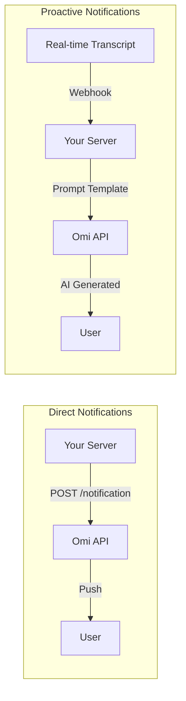

## Overview

Omi supports two types of notifications you can send to users:

<CardGroup cols={2}>
  <Card title="Direct Notifications" icon="message">
    Send immediate, exact-text messages to specific users
  </Card>
  <Card title="Proactive Notifications" icon="robot">
    AI-generated contextual messages based on real-time conversations
  </Card>
</CardGroup>



---

## Direct Notifications

Send immediate messages to specific users. Perfect for alerts, updates, and responses to user actions.

<AccordionGroup>
  <Accordion title="Use Cases" icon="lightbulb">
    - Task reminders and event notifications
    - Service updates or changes
    - Real-time alerts and warnings
    - Responses to user queries
    - New feature announcements
  </Accordion>
</AccordionGroup>

### API Reference

| Setting | Value |
|---------|-------|
| Method | `POST` |
| URL | `https://api.omi.me/v2/integrations/{app_id}/notification` |
| Auth | `Bearer <YOUR_APP_SECRET>` |

**Query Parameters:**

| Parameter | Required | Description |
|-----------|----------|-------------|
| `uid` | Yes | Target user's Omi ID |
| `message` | Yes | Notification text |

### Implementation

<Steps>
  <Step title="Get Credentials" icon="key">
    You'll need your App ID and App Secret from the Omi developer portal.

    ```bash
    export OMI_APP_ID="your_app_id"
    export OMI_APP_SECRET="your_app_secret"
    ```

    <Warning>
    Store credentials securely - never commit them to version control.
    </Warning>
  </Step>
  <Step title="Send Notification" icon="paper-plane">
    Make a POST request with the user ID and message:

    ```bash
    curl -X POST "https://api.omi.me/v2/integrations/${OMI_APP_ID}/notification?uid=USER_ID&message=Hello!" \
      -H "Authorization: Bearer ${OMI_APP_SECRET}" \
      -H "Content-Type: application/json"
    ```
  </Step>
  <Step title="Handle Response" icon="check">
    Check the response status code to confirm delivery.
  </Step>
</Steps>

### Code Examples

<Tabs>
  <Tab title="Node.js" icon="node-js">
    ```javascript
    const https = require('https');

    async function sendNotification(userId, message) {
      const appId = process.env.OMI_APP_ID;
      const appSecret = process.env.OMI_APP_SECRET;

      const url = new URL(`https://api.omi.me/v2/integrations/${appId}/notification`);
      url.searchParams.set('uid', userId);
      url.searchParams.set('message', message);

      const response = await fetch(url, {
        method: 'POST',
        headers: {
          'Authorization': `Bearer ${appSecret}`,
          'Content-Type': 'application/json'
        }
      });

      if (!response.ok) {
        throw new Error(`API Error: ${response.status}`);
      }

      return response.json();
    }

    // Usage
    sendNotification('user123', 'Your task is due in 1 hour!')
      .then(console.log)
      .catch(console.error);
    ```
  </Tab>
  <Tab title="Python" icon="python">
    ```python
    import os
    import requests

    def send_notification(user_id: str, message: str) -> dict:
        app_id = os.environ['OMI_APP_ID']
        app_secret = os.environ['OMI_APP_SECRET']

        response = requests.post(
            f'https://api.omi.me/v2/integrations/{app_id}/notification',
            params={'uid': user_id, 'message': message},
            headers={'Authorization': f'Bearer {app_secret}'}
        )
        response.raise_for_status()
        return response.json()

    # Usage
    send_notification('user123', 'Your task is due in 1 hour!')
    ```
  </Tab>
</Tabs>

---

## Proactive Notifications

Context-aware, AI-generated notifications that leverage user data during real-time conversations. You provide a prompt template, Omi generates the personalized message.

<Info>
Unlike direct notifications, proactive notifications require an app with specific capabilities and user-granted permissions.
</Info>

<AccordionGroup>
  <Accordion title="Use Cases" icon="lightbulb">
    - Real-time mentoring advice during meetings
    - Context-aware suggestions based on conversation topics
    - Personalized insights based on user's goals
    - Intelligent responses to specific phrases
    - Meeting action item reminders
  </Accordion>
  <Accordion title="How It Works" icon="gear">
    1. User installs your app and grants permissions
    2. During conversations, Omi sends transcripts to your webhook
    3. Your webhook analyzes the transcript and returns a prompt template
    4. Omi fills in user context (name, facts, etc.) and generates the notification
    5. User receives a personalized, contextual notification
  </Accordion>
</AccordionGroup>

### App Configuration

Your app needs these capabilities:

```json
{
  "name": "Your App Name",
  "capabilities": ["external_integration", "proactive_notification"],
  "external_integration": {
    "triggers_on": "transcript_processed",
    "webhook_url": "https://yourapp.com/webhook"
  },
  "proactive_notification": {
    "scopes": ["user_name", "user_facts", "user_context", "user_chat"]
  }
}
```

### Available Scopes

| Scope | Template Variable | Description |
|-------|------------------|-------------|
| `user_name` | `{{user_name}}` | User's display name |
| `user_facts` | `{{user_facts}}` | Known facts about the user |
| `user_context` | `{{user_context}}` | Relevant conversation context |
| `user_chat` | `{{user_chat}}` | Recent chat history with your app |

### Webhook Implementation

Your webhook receives real-time transcripts and returns notification prompts:

**Incoming Request:**
```
POST /your-webhook?session_id=abc123&uid=user123
```

**Request Body:**
```json
{
  "session_id": "abc123",
  "segments": [
    {"text": "What do you think about this approach?", "speaker": "SPEAKER_01", "is_user": false}
  ]
}
```

**Response (when you want to send a notification):**
```json
{
  "session_id": "abc123",
  "notification": {
    "prompt": "You are mentoring {{user_name}}. Based on {{user_facts}} and {{user_context}}, provide brief actionable advice in 50 words.",
    "params": ["user_name", "user_facts", "user_context"]
  }
}
```

**Response (when no notification needed):**
```json
{
  "session_id": "abc123"
}
```

### Complete Example

<Tabs>
  <Tab title="Python (FastAPI)" icon="python">
    ```python
    from fastapi import FastAPI
    from pydantic import BaseModel
    from typing import List, Optional

    app = FastAPI()

    class TranscriptSegment(BaseModel):
        text: str
        speaker: str
        is_user: bool

    class WebhookRequest(BaseModel):
        session_id: str
        segments: List[TranscriptSegment]

    @app.post("/webhook")
    def handle_transcript(data: WebhookRequest, uid: str, session_id: str):
        # Combine all segments into transcript
        transcript = " ".join([s.text for s in data.segments]).lower()

        # Detect trigger phrases
        if "what do you think" in transcript or "any advice" in transcript:
            return {
                "session_id": data.session_id,
                "notification": {
                    "prompt": """You are a helpful mentor for {{user_name}}.
                    Based on their goals ({{user_facts}}) and the current discussion ({{user_context}}),
                    provide specific, actionable advice in under 100 words.""",
                    "params": ["user_name", "user_facts", "user_context"]
                }
            }

        # No notification needed
        return {"session_id": data.session_id}
    ```
  </Tab>
  <Tab title="Node.js (Express)" icon="node-js">
    ```javascript
    const express = require('express');
    const app = express();
    app.use(express.json());

    app.post('/webhook', (req, res) => {
      const { session_id, segments } = req.body;

      // Combine segments into transcript
      const transcript = segments
        .map(s => s.text)
        .join(' ')
        .toLowerCase();

      // Detect trigger phrases
      if (transcript.includes('what do you think') || transcript.includes('any advice')) {
        return res.json({
          session_id,
          notification: {
            prompt: `You are a helpful mentor for {{user_name}}.
              Based on their goals ({{user_facts}}) and the discussion ({{user_context}}),
              provide specific advice in under 100 words.`,
            params: ['user_name', 'user_facts', 'user_context']
          }
        });
      }

      // No notification needed
      res.json({ session_id });
    });
    ```
  </Tab>
</Tabs>

### Testing

<Steps>
  <Step title="Enable Developer Mode" icon="code">
    Open Omi app → Settings → Developer Mode
  </Step>
  <Step title="Install Your App" icon="download">
    Install your app in Developer Mode and grant requested scopes
  </Step>
  <Step title="Set Webhook URL" icon="link">
    Configure your webhook URL in Developer Settings
  </Step>
  <Step title="Trigger Notifications" icon="microphone">
    Start a conversation and say trigger phrases (e.g., "what do you think?")
  </Step>
  <Step title="Verify" icon="check">
    Notification should appear within 30 seconds
  </Step>
</Steps>

<Note>
**Rate Limit:** 1 proactive notification per user per app every 30 seconds.
</Note>

---

## Best Practices

<CardGroup cols={2}>
  <Card title="Rate Limiting" icon="gauge">
    - Implement delays between notifications
    - Avoid duplicate messages
    - Group related notifications
  </Card>
  <Card title="Content Quality" icon="pen">
    - Keep messages concise and clear
    - Include relevant context
    - Use appropriate urgency levels
  </Card>
  <Card title="Error Handling" icon="triangle-exclamation">
    - Implement retry with exponential backoff
    - Log errors for debugging
    - Monitor delivery status
  </Card>
  <Card title="Security" icon="shield">
    - Store credentials securely
    - Validate user IDs before sending
    - Use HTTPS for all endpoints
  </Card>
</CardGroup>

---

## Troubleshooting

### Error Codes

| Code | Meaning | Solution |
|------|---------|----------|
| 401 | Unauthorized | Verify API credentials and Bearer token format |
| 404 | User not found | Check that user ID exists and has your app installed |
| 429 | Rate limited | Implement rate limiting with exponential backoff |
| 500 | Server error | Retry with backoff, check Omi status page |

<AccordionGroup>
  <Accordion title="Direct Notifications Not Sending" icon="circle-question">
    **Check these:**
    - API credentials are correct
    - User ID is valid
    - Bearer token is properly formatted
    - Request includes required headers
  </Accordion>
  <Accordion title="Proactive Notifications Not Appearing" icon="circle-question">
    **Check these:**
    - App has `proactive_notification` capability enabled
    - User has installed your app
    - User has granted requested scopes
    - Webhook is returning proper response format
    - Prompt is at least 5 characters
  </Accordion>
  <Accordion title="Notifications Not Contextual" icon="circle-question">
    **Solutions:**
    - Request additional scopes in app configuration
    - Include more template variables in your prompt
    - Make prompts more specific about using the context
  </Accordion>
</AccordionGroup>

---

## Related Documentation

<CardGroup cols={2}>
  <Card title="Integration Apps" icon="plug" href="/doc/developer/apps/Integrations">
    Build webhook-based integrations
  </Card>
  <Card title="OAuth Setup" icon="key" href="/doc/developer/apps/Oauth">
    Add authentication to your apps
  </Card>
  <Card title="Chat Tools" icon="wrench" href="/doc/developer/apps/ChatTools">
    Add custom tools to Omi chat
  </Card>
  <Card title="Submit Your App" icon="rocket" href="/doc/developer/apps/Submitting">
    Publish your app to the store
  </Card>
</CardGroup>
