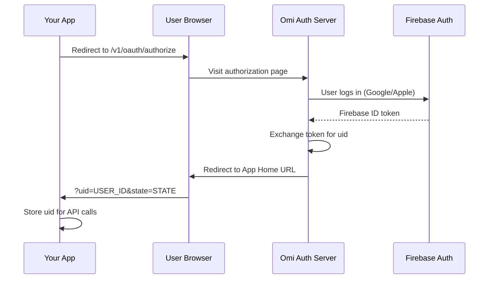

## Overview

Omi uses an OAuth 2.0-like flow to allow third-party applications to access user data with explicit consent. This ensures users maintain control over their data and what applications can access.



<CardGroup cols={2}>
  <Card title="User Consent" icon="shield-check">
    Users explicitly approve what data your app can access
  </Card>
  <Card title="Secure Token Exchange" icon="key">
    Firebase authentication ensures secure identity verification
  </Card>
</CardGroup>

---

## Prerequisites

Before implementing OAuth, ensure you have:

<Steps>
  <Step title="Register Your App" icon="id-card">
    Your app must be registered with Omi and have an **App ID**
  </Step>
  <Step title="Configure App Home URL" icon="link">
    Set your **App Home URL** in your app's settings - this is where users are redirected after authorization
  </Step>
  <Step title="HTTPS Required" icon="lock">
    Your App Home URL must use HTTPS
  </Step>
</Steps>

---

## OAuth Flow

<Steps>
  <Step title="Redirect User to Omi" icon="arrow-right">
    Your app redirects the user to Omi's authorization endpoint:

    ```
    https://api.omi.me/v1/oauth/authorize?app_id=YOUR_APP_ID&state=YOUR_STATE
    ```

    | Parameter | Required | Description |
    |-----------|----------|-------------|
    | `app_id` | Yes | Your application's unique ID |
    | `state` | No | Opaque value for CSRF protection and maintaining state |

    <Tip>
    Always use the `state` parameter to prevent CSRF attacks. Generate a random string and verify it when the user returns.
    </Tip>
  </Step>
  <Step title="User Authenticates & Consents" icon="user-check">
    On the Omi authorization page, the user:

    1. Logs in with their Firebase credentials (Google or Apple)
    2. Reviews the permissions your app is requesting
    3. Grants or denies access

    **Example permissions shown to users:**
    - "Engage in chat conversations with Omi"
    - "Access and manage your conversations"
    - "Process audio data in real-time"
    - "Create new conversations on your behalf"
    - "Access and read your stored memories"
  </Step>
  <Step title="Token Exchange" icon="arrows-rotate">
    After user approval, Omi's authorization page handles the token exchange internally:

    ```http
    POST https://api.omi.me/v1/oauth/token
    Content-Type: application/x-www-form-urlencoded

    firebase_id_token=FIREBASE_TOKEN&app_id=YOUR_APP_ID&state=YOUR_STATE
    ```

    **Response:**
    ```json
    {
      "uid": "USER_UNIQUE_ID",
      "redirect_url": "YOUR_APP_HOME_URL",
      "state": "YOUR_STATE_IF_PROVIDED"
    }
    ```

    <Note>
    This step is handled automatically by Omi's authorization page - you don't need to implement this yourself.
    </Note>
  </Step>
  <Step title="User Redirected to Your App" icon="arrow-left">
    The user's browser is redirected to your App Home URL with query parameters:

    ```
    https://your-app.com/callback?uid=USER_UNIQUE_ID&state=YOUR_STATE
    ```

    Your app should:
    1. Validate the `state` parameter matches what you sent
    2. Store the `uid` for making API calls on behalf of the user
  </Step>
</Steps>

---

## Handling the Callback

Example implementation for handling the OAuth callback:

<Tabs>
  <Tab title="Python (FastAPI)" icon="python">
    ```python
    from fastapi import FastAPI, Request, HTTPException
    from fastapi.responses import RedirectResponse
    import secrets

    app = FastAPI()

    # Store state tokens (use Redis in production)
    pending_states = {}

    @app.get("/start-oauth")
    async def start_oauth():
        # Generate CSRF token
        state = secrets.token_urlsafe(32)
        pending_states[state] = True

        # Redirect to Omi
        return RedirectResponse(
            f"https://api.omi.me/v1/oauth/authorize"
            f"?app_id=YOUR_APP_ID&state={state}"
        )

    @app.get("/callback")
    async def oauth_callback(uid: str, state: str):
        # Validate state
        if state not in pending_states:
            raise HTTPException(400, "Invalid state parameter")

        del pending_states[state]

        # Store uid for this user's session
        # Now you can make API calls with this uid
        return {"message": f"Successfully connected! User ID: {uid}"}
    ```
  </Tab>
  <Tab title="Node.js (Express)" icon="node-js">
    ```javascript
    const express = require('express');
    const crypto = require('crypto');

    const app = express();
    const pendingStates = new Map();

    app.get('/start-oauth', (req, res) => {
      // Generate CSRF token
      const state = crypto.randomBytes(32).toString('hex');
      pendingStates.set(state, true);

      // Redirect to Omi
      res.redirect(
        `https://api.omi.me/v1/oauth/authorize` +
        `?app_id=YOUR_APP_ID&state=${state}`
      );
    });

    app.get('/callback', (req, res) => {
      const { uid, state } = req.query;

      // Validate state
      if (!pendingStates.has(state)) {
        return res.status(400).send('Invalid state parameter');
      }

      pendingStates.delete(state);

      // Store uid for this user's session
      res.send(`Successfully connected! User ID: ${uid}`);
    });
    ```
  </Tab>
</Tabs>

---

## Automatic App Enablement

When a user completes the OAuth flow, Omi automatically attempts to enable your app for them.

<AccordionGroup>
  <Accordion title="Enablement Checks" icon="list-check">
    Omi performs several checks before enabling:

    | Check | Description |
    |-------|-------------|
    | **Privacy** | If app is private, only owner/testers can enable |
    | **Setup Completion** | If `setup_completed_url` is configured, it must return `true` |
    | **Payment** | If app is paid, user must have active subscription |

    If any check fails, the OAuth flow halts and shows an error to the user.
  </Accordion>
  <Accordion title="Setup Completion Check" icon="gear">
    If your app requires setup (e.g., connecting to external services), configure a `setup_completed_url`:

    **Request from Omi:**
    ```
    GET https://your-app.com/setup-status?uid=USER_ID
    ```

    **Expected Response:**
    ```json
    {
      "is_setup_completed": true
    }
    ```

    Return `false` if the user hasn't completed setup yet. Omi will show an appropriate message.
  </Accordion>
  <Accordion title="Install Count" icon="chart-line">
    When a user successfully enables your public app through OAuth, the public install count is incremented (if applicable).
  </Accordion>
</AccordionGroup>

---

## App Configuration

<CardGroup cols={2}>
  <Card title="App ID" icon="fingerprint">
    Unique identifier for your app, provided when you register
  </Card>
  <Card title="App Home URL" icon="house">
    Where users are redirected after authorization (must be HTTPS)
  </Card>
</CardGroup>

Configure these settings in the Omi developer portal or during app submission:

| Field | Location | Description |
|-------|----------|-------------|
| App ID | Auto-generated | Your unique application identifier |
| App Home URL | `external_integration.app_home_url` | Callback URL after OAuth (HTTPS required) |
| Setup Completed URL | `external_integration.setup_completed_url` | Optional endpoint to verify user setup |

---

## Security Best Practices

<CardGroup cols={2}>
  <Card title="Always Use State" icon="shield">
    Generate a cryptographically random `state` parameter and validate it on callback to prevent CSRF attacks
  </Card>
  <Card title="Validate Origin" icon="globe">
    Ensure the `uid` came from a legitimate OAuth flow, not a forged request
  </Card>
  <Card title="Secure Storage" icon="database">
    Store user `uid` values securely, treating them as sensitive credentials
  </Card>
  <Card title="HTTPS Only" icon="lock">
    Always use HTTPS for your App Home URL and all API communications
  </Card>
</CardGroup>

<Warning>
Never expose your App ID in client-side code where it could be extracted. While the App ID itself isn't secret, it should be treated as sensitive for your integration's integrity.
</Warning>

---

## Troubleshooting

<AccordionGroup>
  <Accordion title="User not redirected back" icon="circle-question">
    **Possible causes:**
    - App Home URL not configured or incorrect
    - App Home URL doesn't use HTTPS
    - User denied permissions

    **Solution:** Verify your App Home URL in the developer portal
  </Accordion>
  <Accordion title="State parameter mismatch" icon="circle-question">
    **Possible causes:**
    - State expired before user completed flow
    - State not properly stored server-side
    - CSRF attack attempt

    **Solution:** Implement proper session/state management with reasonable expiration
  </Accordion>
  <Accordion title="Setup completion check failing" icon="circle-question">
    **Possible causes:**
    - `setup_completed_url` returning `false` or error
    - Endpoint not accessible from Omi servers
    - JSON response malformed

    **Solution:** Test your endpoint directly and check server logs
  </Accordion>
</AccordionGroup>

---

## Related Documentation

<CardGroup cols={2}>
  <Card title="Integration Apps" icon="plug" href="/doc/developer/apps/Integrations">
    Build webhook-based integrations
  </Card>
  <Card title="Chat Tools" icon="wrench" href="/doc/developer/apps/ChatTools">
    Add custom tools to Omi chat
  </Card>
  <Card title="Notifications" icon="bell" href="/doc/developer/apps/Notifications">
    Send push notifications to users
  </Card>
  <Card title="Submit Your App" icon="rocket" href="/doc/developer/apps/Submitting">
    Publish your app to the store
  </Card>
</CardGroup>
