## Overview

Beyond publishing to the Omi app store, you can open-source your app by contributing it to the [BasedHardware/omi](https://github.com/BasedHardware/omi) repository. This gives your app maximum visibility, lets other developers learn from and build on your work, and contributes to the Omi ecosystem.

```mermaid
flowchart LR
    B[Build Your App] --> T[Test Locally]
    T --> F[Fork the Repo]
    F --> A[Add Your App]
    A --> PR[Open a PR]
    PR --> R[Review & Merge]
    R --> C[🎉 Community Access]
```



<CardGroup cols={2}>
  <Card title="Community Visibility" icon="users">
    Your app is discoverable by thousands of Omi developers
  </Card>
  <Card title="Contribution Rewards" icon="gift">
    Significant contributions earn free DevKit hardware
  </Card>
</CardGroup>

---

## Repository Structure

Open-source apps live in the `plugins/` directory:

```
omi/
├── plugins/
│   ├── your-app-name/
│   │   ├── README.md          # Required: documentation
│   │   ├── requirements.txt   # Python dependencies
│   │   ├── main.py            # Entry point
│   │   ├── .env.example       # Environment variable template
│   │   └── ...                # Your app code
```

<Info>
Each app should be a self-contained directory with everything needed to run it independently.
</Info>

---

## Step-by-Step Guide

<Steps>
  <Step title="Fork the Repository">
    Go to [github.com/BasedHardware/omi](https://github.com/BasedHardware/omi) and click **Fork** to create your own copy.

    ```bash
    git clone https://github.com/YOUR_USERNAME/omi.git
    cd omi
    ```
  </Step>

  <Step title="Create Your App Directory">
    Create a new folder under `plugins/` with a descriptive name:

    ```bash
    mkdir plugins/your-app-name
    cd plugins/your-app-name
    ```

    Use lowercase, hyphens for spaces (e.g., `meeting-summarizer`, `crm-sync`, `daily-journal`).
  </Step>

  <Step title="Add Your App Code">
    Structure your app with these files at minimum:

    | File | Required | Description |
    |------|----------|-------------|
    | `README.md` | ✅ | Documentation (see template below) |
    | `main.py` | ✅ | App entry point |
    | `requirements.txt` | ✅ | Python dependencies |
    | `.env.example` | ✅ | Environment variable template (no secrets!) |
    | `.gitignore` | Recommended | Ignore `.env`, `__pycache__/`, etc. |

    <Warning>
    **Never commit secrets, API keys, or credentials.** Use `.env.example` with placeholder values and add `.env` to `.gitignore`.
    </Warning>
  </Step>

  <Step title="Write a Great README">
    Your README is the first thing developers see. Include:

    ```markdown
    # Your App Name

    Brief description of what your app does.

    ## Features
    - Feature 1
    - Feature 2

    ## How It Works
    Explain the architecture and how it integrates with Omi.

    ## Setup

    ### Prerequisites
    - Python 3.8+
    - Any external service accounts needed

    ### Installation
    1. Clone the repo
    2. `pip install -r requirements.txt`
    3. Copy `.env.example` to `.env` and fill in your values
    4. Run `python main.py` or `fastapi run`

    ### Environment Variables
    | Variable | Description |
    |----------|-------------|
    | `API_KEY` | Your API key for X service |

    ## Registering with Omi
    Explain how to register the app (webhook URLs, etc.)

    ## Usage
    How users interact with the app once it's running.

    ## License
    MIT
    ```
  </Step>

  <Step title="Test Thoroughly">
    Before submitting, make sure:

    - [ ] App runs from a clean install following your README
    - [ ] All environment variables are documented in `.env.example`
    - [ ] No hardcoded secrets or API keys in the code
    - [ ] Webhooks handle errors gracefully
    - [ ] Code is clean and reasonably commented
  </Step>

  <Step title="Create a Branch and Commit">
    ```bash
    git checkout -b add-your-app-name
    git add plugins/your-app-name/
    git commit -m "feat: add your-app-name plugin"
    ```
  </Step>

  <Step title="Open a Pull Request">
    Push your branch and open a PR against `main`:

    ```bash
    git push origin add-your-app-name
    ```

    Then go to GitHub and create a Pull Request with:
    - **Title:** `feat: add [your-app-name] plugin`
    - **Description:** What the app does, how to use it, and any relevant context
    - **Screenshots/demo** (if applicable)
  </Step>
</Steps>

---

## PR Review Checklist

Our team will review your PR against these criteria:

<AccordionGroup>
  <Accordion title="Code Quality" icon="code">
    - Clean, readable code
    - No unnecessary dependencies
    - Proper error handling
    - No hardcoded secrets or credentials
  </Accordion>
  <Accordion title="Documentation" icon="book">
    - Complete README with setup instructions
    - `.env.example` with all required variables
    - Clear explanation of what the app does
  </Accordion>
  <Accordion title="Self-Contained" icon="box">
    - App runs independently from its directory
    - All dependencies listed in `requirements.txt`
    - No modifications to core Omi code
  </Accordion>
  <Accordion title="Community Guidelines" icon="heart">
    - Respects user privacy
    - No harmful or inappropriate content
    - Provides genuine value to users
  </Accordion>
</AccordionGroup>

---

## Tips for a Successful Contribution

<CardGroup cols={2}>
  <Card title="Start Simple" icon="seedling">
    A well-documented simple app is better than a complex, undocumented one
  </Card>
  <Card title="Show, Don't Tell" icon="photo-film">
    Include screenshots, GIFs, or a demo video in your README
  </Card>
  <Card title="Be Responsive" icon="comments">
    Respond to review feedback quickly to get your PR merged faster
  </Card>
  <Card title="Follow Existing Patterns" icon="copy">
    Look at existing apps in `plugins/` for style and structure inspiration
  </Card>
</CardGroup>

---

## Contribution Rewards

Significant open-source contributions earn rewards:

| Contributions | Reward |
|---------------|--------|
| 1 merged PR | Free DevKit device (necklace or glasses) |
| 2+ merged PRs | Additional DevKit + community recognition |

<Tip>
See the full [Contribution Guide](/doc/developer/Contribution) for details on rewards and bounties.
</Tip>

---

## Related Documentation

<CardGroup cols={2}>
  <Card title="Publish to App Store" icon="store" href="/doc/developer/apps/Submitting">
    Submit your app to the Omi app store (no code required)
  </Card>
  <Card title="Building Apps" icon="puzzle-piece" href="/doc/developer/apps/Introduction">
    Learn how to build Omi apps from scratch
  </Card>
  <Card title="Contribution Guide" icon="code-pull-request" href="/doc/developer/Contribution">
    General contribution guidelines and rewards
  </Card>
  <Card title="Integration Apps" icon="plug" href="/doc/developer/apps/Integrations">
    Build webhook-based integrations
  </Card>
</CardGroup>
