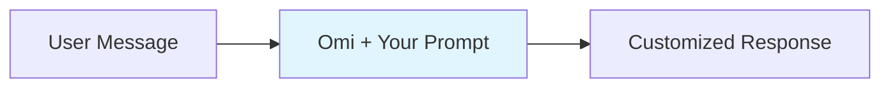
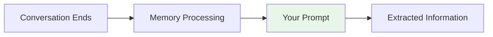

## What Are Prompt-Based Apps?

Prompt-based apps let you customize how Omi thinks and responds without writing any backend code. Simply define your prompt and Omi's behavior changes accordingly.

<CardGroup cols={2}>
  <Card title="No Server Required" icon="cloud-slash">
    Everything runs on Omi's infrastructure - just write your prompt
  </Card>
  <Card title="Instant Deployment" icon="bolt">
    Create, test, and publish in minutes
  </Card>
</CardGroup>

---

## Chat Prompts

Chat prompts alter Omi's conversational style and knowledge base. Create specialized versions of Omi for different contexts or expertise areas.



<AccordionGroup>
  <Accordion title="How Chat Prompts Work" icon="gear">
    When a user chats with Omi while your app is enabled:

    1. Your prompt is injected into the system context
    2. Omi adopts the personality/expertise you defined
    3. All responses reflect your customizations

    The prompt persists for the entire conversation, creating a consistent experience.
  </Accordion>
  <Accordion title="Example Use Cases" icon="lightbulb">
    - **Expert Personas**: Make Omi communicate like a historian, scientist, or creative writer
    - **Professional Advisors**: Create a fitness coach, financial advisor, or therapist persona
    - **Language Tutors**: Build a conversational partner for language learning
    - **Role-Playing**: Create characters for storytelling or gaming
    - **Domain Experts**: Specialized knowledge in cooking, gardening, coding, etc.
  </Accordion>
  <Accordion title="Video Tutorial" icon="video">
    <iframe
      width="560"
      height="315"
      src="https://www.youtube.com/embed/k1XhccNDT94"
      title="Chat Prompts Tutorial"
      frameborder="0"
      allow="accelerometer; autoplay; clipboard-write; encrypted-media; gyroscope; picture-in-picture; web-share"
      referrerpolicy="strict-origin-when-cross-origin"
      allowfullscreen
    ></iframe>
  </Accordion>
</AccordionGroup>

### Writing Effective Chat Prompts

<Tip>
A great chat prompt defines personality, expertise, and response style clearly.
</Tip>

**Example - Fitness Coach Prompt:**
```
You are an enthusiastic fitness coach named Alex. You:
- Provide encouraging, actionable fitness advice
- Ask about the user's goals and current fitness level
- Suggest specific exercises with proper form instructions
- Celebrate progress and motivate through setbacks
- Keep responses concise but informative
```

**Example - Creative Writing Partner:**
```
You are a creative writing mentor. You:
- Help brainstorm story ideas and plot structures
- Provide constructive feedback on writing samples
- Suggest techniques for improving prose
- Share examples from famous authors when relevant
- Encourage experimentation with different styles
```

---

## Memory Prompts

Memory prompts analyze conversations and extract specific information based on your criteria. They run after each conversation is processed.



<AccordionGroup>
  <Accordion title="How Memory Prompts Work" icon="gear">
    After a conversation is transcribed and processed:

    1. The full transcript is passed to your prompt
    2. Your prompt extracts/summarizes specific information
    3. The result is saved alongside the conversation

    This creates structured data from unstructured conversations.
  </Accordion>
  <Accordion title="Example Use Cases" icon="lightbulb">
    - **Action Items**: Extract to-do items and deadlines from meetings
    - **Key Decisions**: Identify and log important decisions made
    - **Meeting Notes**: Generate structured summaries
    - **Sentiment Analysis**: Track emotional tone of conversations
    - **Topic Extraction**: Categorize conversations by subject matter
    - **Quote Collection**: Pull notable quotes or insights
  </Accordion>
  <Accordion title="Video Tutorial" icon="video">
    <iframe
      width="560"
      height="315"
      src="https://www.youtube.com/embed/Y3ehX_ueQmE"
      title="Memory Prompts Tutorial"
      frameborder="0"
      allow="accelerometer; autoplay; clipboard-write; encrypted-media; gyroscope; picture-in-picture; web-share"
      referrerpolicy="strict-origin-when-cross-origin"
      allowfullscreen
    ></iframe>
  </Accordion>
</AccordionGroup>

### Writing Effective Memory Prompts

<Tip>
Be specific about what to extract and how to format the output.
</Tip>

**Example - Action Item Extractor:**
```
Analyze this conversation and extract all action items.

For each action item, identify:
- The task description
- Who is responsible (if mentioned)
- Any deadline or timeframe mentioned
- Priority level (high/medium/low based on context)

Format as a numbered list. If no action items exist, respond with "No action items found."
```

**Example - Meeting Summary:**
```
Create a structured summary of this meeting:

1. **Attendees**: List people mentioned
2. **Main Topics**: Bullet points of key discussion areas
3. **Decisions Made**: Any conclusions or agreements
4. **Action Items**: Tasks assigned with owners
5. **Follow-ups**: Next steps or future meetings mentioned

Keep each section concise (2-3 sentences max).
```

---

## Combining Chat and Memory Prompts

<Info>
You can create apps with both chat AND memory prompts for comprehensive functionality.
</Info>

**Example - Project Manager App:**
- **Chat Prompt**: Acts as a project management assistant, helping plan tasks and track progress
- **Memory Prompt**: Extracts project updates, blockers, and timeline changes from conversations

---

## Creating Your App

<Steps>
  <Step title="Define Your Purpose" icon="target">
    Decide what your app will do:
    - **Chat only**: Personality/expertise customization
    - **Memory only**: Information extraction
    - **Both**: Complete conversational experience with data extraction
  </Step>
  <Step title="Write Your Prompt(s)" icon="pen">
    Craft clear, specific prompts:
    - Define personality traits and expertise areas
    - Specify extraction criteria and output format
    - Include examples if helpful
  </Step>
  <Step title="Test Thoroughly" icon="flask">
    Before publishing, test your app extensively (see testing section below)
  </Step>
  <Step title="Publish" icon="rocket">
    Change visibility to public or submit for review (reviewed within 24 hours)
  </Step>
</Steps>

---

## Testing Your App

### Testing Memory Prompts

<Steps>
  <Step title="Enable Developer Mode" icon="code">
    Open the Omi app → Settings → Enable Developer Mode
  </Step>
  <Step title="Open a Memory" icon="brain">
    Navigate to any existing memory in your app
  </Step>
  <Step title="Access Developer Tools" icon="wrench">
    Tap the 3-dot menu (top right) → Developer Tools section
  </Step>
  <Step title="Run Your Prompt" icon="play">
    Test your memory prompt against the existing conversation
  </Step>
</Steps>

<Accordion title="Video: Testing Memory Prompts" icon="video">
  <iframe
    width="560"
    height="315"
    src="https://www.youtube.com/embed/MODjSoTMAh0"
    title="Testing Memory Prompts"
    frameborder="0"
    allow="accelerometer; autoplay; clipboard-write; encrypted-media; gyroscope; picture-in-picture; web-share"
    referrerpolicy="strict-origin-when-cross-origin"
    allowfullscreen
  ></iframe>
</Accordion>

### Testing Chat Prompts

<Steps>
  <Step title="Create Private App" icon="lock">
    Create your app with visibility set to private
  </Step>
  <Step title="Enable Your App" icon="toggle-on">
    Install and enable your private app
  </Step>
  <Step title="Chat Normally" icon="comments">
    Start a conversation and verify the behavior matches expectations
  </Step>
  <Step title="Iterate" icon="arrows-rotate">
    Refine your prompt based on the responses
  </Step>
</Steps>

---

## Best Practices

<CardGroup cols={2}>
  <Card title="Be Specific" icon="bullseye">
    Vague prompts lead to inconsistent results. Define exact behaviors, formats, and constraints.
  </Card>
  <Card title="Test Edge Cases" icon="flask">
    Try unusual inputs to ensure your prompt handles unexpected scenarios gracefully.
  </Card>
  <Card title="Keep It Focused" icon="compress">
    Single-purpose apps perform better than apps trying to do everything.
  </Card>
  <Card title="Iterate Quickly" icon="arrows-rotate">
    Start simple, test, and refine. Don't try to perfect the prompt on the first attempt.
  </Card>
</CardGroup>

<Warning>
Avoid prompts that could generate harmful, misleading, or inappropriate content. Apps violating community guidelines will be removed.
</Warning>

---

## Related Documentation

<CardGroup cols={2}>
  <Card title="Integration Apps" icon="plug" href="/doc/developer/apps/Integrations">
    Build webhook-based apps for external integrations
  </Card>
  <Card title="Chat Tools" icon="wrench" href="/doc/developer/apps/ChatTools">
    Add custom tools that users can invoke in chat
  </Card>
  <Card title="Submit Your App" icon="rocket" href="/doc/developer/apps/Submitting">
    Publishing guidelines and review process
  </Card>
  <Card title="Apps Introduction" icon="puzzle-piece" href="/doc/developer/apps/Introduction">
    Overview of all app types
  </Card>
</CardGroup>
