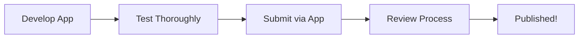

## Overview

Ready to share your app with the Omi community? Publishing is done directly through the Omi mobile app.

<CardGroup cols={2}>
  <Card title="Quick Review" icon="clock">
    Most apps are reviewed within 24 hours
  </Card>
  <Card title="Free to Publish" icon="gift">
    No fees to submit or list your app
  </Card>
</CardGroup>

---

## Before You Submit

<Steps>
  <Step title="Test Your App" icon="flask">
    Thoroughly test all functionality in Developer Mode:
    - Verify webhooks receive data correctly
    - Test with real conversations
    - Check error handling
    - Confirm notifications work (if applicable)
  </Step>
  <Step title="Prepare Your Listing" icon="pen">
    Create compelling app store content:
    - **App Name**: Clear, descriptive (max 30 characters)
    - **Description**: Explain what your app does and why it's useful
    - **Category**: Choose the most relevant category
    - **Icon**: Upload a distinctive app icon
  </Step>
  <Step title="Review Guidelines" icon="book">
    Ensure your app follows all community guidelines (see below)
  </Step>
  <Step title="Verify Endpoints" icon="server">
    For integration apps, confirm your server is:
    - Using HTTPS
    - Responding quickly (< 5 seconds)
    - Handling errors gracefully
    - Available 24/7
  </Step>
</Steps>

---

## How to Submit

<Steps>
  <Step title="Open Omi App" icon="mobile">
    Launch the Omi mobile app on your device
  </Step>
  <Step title="Navigate to Your App" icon="compass">
    Go to **Explore** → Find your app in **My Apps** or create a new one
  </Step>
  <Step title="Complete App Details" icon="file-lines">
    Fill in all required fields:
    - Name and description
    - Category selection
    - Capabilities and permissions
    - Webhook URLs (for integration apps)
  </Step>
  <Step title="Set Visibility to Public" icon="eye">
    Change your app's visibility from **Private** to **Public**
  </Step>
  <Step title="Submit for Review" icon="paper-plane">
    Tap **Submit** and wait for the review process
  </Step>
</Steps>

<Info>
You can continue to update and test your app while it's under review. Changes won't affect the review process.
</Info>

---

## Community Guidelines

<Warning>
Apps that violate these guidelines will be rejected or removed from the store.
</Warning>

<CardGroup cols={2}>
  <Card title="Respect for All" icon="heart">
    No content promoting hate, discrimination, or harassment of any kind
  </Card>
  <Card title="All Ages Welcome" icon="users">
    Consider a general audience - avoid explicit or adult content
  </Card>
  <Card title="Accuracy Matters" icon="check-circle">
    If providing facts or advice, strive for correctness and clarity
  </Card>
  <Card title="Privacy First" icon="shield">
    Respect user data, obtain clear consent, and follow data protection best practices
  </Card>
  <Card title="Keep it Legal" icon="scale-balanced">
    No facilitating illegal activities or violating terms of service
  </Card>
  <Card title="Transparency" icon="eye">
    Be clear about what your app does and what data it accesses
  </Card>
</CardGroup>

---

## Review Process

<AccordionGroup>
  <Accordion title="What We Check" icon="magnifying-glass">
    During review, we verify:

    | Check | Description |
    |-------|-------------|
    | **Functionality** | App works as described |
    | **Guidelines** | Follows community guidelines |
    | **Security** | No obvious security issues |
    | **Endpoints** | Webhooks respond correctly (integration apps) |
    | **Content** | Description is accurate and appropriate |
  </Accordion>
  <Accordion title="Review Timeline" icon="clock">
    - **Most apps**: Reviewed within 24 hours
    - **Complex integrations**: May take 2-3 days
    - **Weekends/holidays**: May experience delays

    You'll receive a notification when your app is approved or if changes are needed.
  </Accordion>
  <Accordion title="Common Rejection Reasons" icon="circle-xmark">
    Avoid these common issues:

    1. **Broken webhooks** - Endpoint returns errors or times out
    2. **Misleading description** - App doesn't do what it claims
    3. **Missing permissions** - Requesting more access than needed
    4. **Guideline violations** - Content issues
    5. **Poor user experience** - Confusing or broken functionality
  </Accordion>
  <Accordion title="After Rejection" icon="rotate">
    If your app is rejected:

    1. Review the feedback provided
    2. Make necessary changes
    3. Test thoroughly
    4. Resubmit for review

    There's no limit on resubmissions - we want to help you succeed!
  </Accordion>
</AccordionGroup>

---

## Best Practices for Success

<CardGroup cols={2}>
  <Card title="Write a Great Description" icon="pen-fancy">
    - Start with what the app does
    - Explain the value to users
    - Include usage examples
    - List any requirements
  </Card>
  <Card title="Choose the Right Category" icon="folder">
    - Productivity: Task management, notes, workflows
    - Health: Fitness, wellness, medical
    - Social: Communication, sharing
    - Entertainment: Fun, games, creativity
  </Card>
  <Card title="Design a Memorable Icon" icon="image">
    - Use simple, recognizable imagery
    - Ensure visibility at small sizes
    - Match your app's purpose
    - Avoid text-heavy designs
  </Card>
  <Card title="Plan for Maintenance" icon="wrench">
    - Monitor your webhook uptime
    - Respond to user feedback
    - Update for new Omi features
    - Keep your app fresh
  </Card>
</CardGroup>

---

## After Publishing

<Steps>
  <Step title="Monitor Performance" icon="chart-line">
    Track your app's install count and user engagement in the Omi app
  </Step>
  <Step title="Respond to Feedback" icon="comments">
    Users may reach out with questions or suggestions - be responsive!
  </Step>
  <Step title="Update Regularly" icon="arrows-rotate">
    Keep your app current with new features and improvements
  </Step>
  <Step title="Join the Community" icon="discord">
    Connect with other developers in the [Omi Discord](https://discord.gg/omi) for support and collaboration
  </Step>
</Steps>

<Tip>
Successful apps are ones that solve real problems for users. Focus on delivering value, and the installs will follow!
</Tip>

---

## Related Documentation

<CardGroup cols={2}>
  <Card title="Prompt-Based Apps" icon="wand-magic-sparkles" href="/doc/developer/apps/PromptBased">
    Create apps without a server
  </Card>
  <Card title="Integration Apps" icon="plug" href="/doc/developer/apps/Integrations">
    Build webhook-based integrations
  </Card>
  <Card title="Chat Tools" icon="wrench" href="/doc/developer/apps/ChatTools">
    Add custom tools to Omi chat
  </Card>
  <Card title="Apps Introduction" icon="puzzle-piece" href="/doc/developer/apps/Introduction">
    Overview of all app types
  </Card>
</CardGroup>
