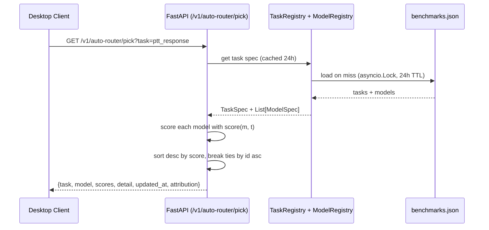

# Auto-router — Task-based model selection across Omi

> **Current: v5 (Settings UI).** Adds a `Settings → Auto-router` page so users
> can tune per-task weights (quality/latency/cost) without restarting the backend.
> v1 (framework) and v2 (auth + metrics + wiring) are preserved as the foundation.
>
> A foundational framework that picks the best model per task type using weighted
> scoring across quality / latency / cost, with a daily-refreshable benchmark input
> flow. **MVP, not a production routing replacement.**

## What it is

The auto-router answers one question: *"Given a task type, which model should we use right now?"*

It supports **5 task types** in v1:

| Task | quality | latency | cost | Why these weights |
|---|---|---|---|---|
| `ptt_response` | 0.4 | 0.5 | 0.1 | Real-time voice — latency-critical |
| `screenshot_understanding` | 0.6 | 0.2 | 0.2 | Vision-language — quality-critical |
| `screenshot_embedding` | 0.2 | 0.3 | 0.5 | Bulk retrieval — cost-critical |
| `general_assistant` | 0.5 | 0.3 | 0.2 | Balanced for general chat |
| `transcription` | 0.3 | 0.6 | 0.1 | STT — latency-critical |

For each task, it picks the model with the highest weighted score across the three dimensions. Weights are configurable per task; benchmark values are loaded from `backend/utils/auto_router/benchmarks.json` (deployment) or `benchmarks.example.json` (template).

## Scoring formula

For a candidate model `m` and task `t`:

```
total = t.quality_weight * m.quality_score
      + t.latency_weight * m.latency_score
      + t.cost_weight    * m.cost_score
```

Component scores are clamped to `[0.0, 1.0]` before weighting. `None` for any score is treated as `0` (a model not benchmarked for a dimension doesn't get a free pass on it). Weights are applied exactly as specified — the function does NOT renormalize, so weights summing to something other than 1.0 are honored as-is.

## Architecture



## Relationship to upstream `/v1/auto/model-pick`

The maintainer has shipped a narrower auto-router at `backend/routers/auto_model.py`. Key differences:

| | Upstream `/v1/auto/model-pick` | This PR `/v1/auto-router/pick` |
|---|---|---|
| **Task types** | 1 (realtime voice) | 5 (ptt, screenshot, embed, assistant, transcription) |
| **Scoring** | `0.65 * quality + 0.35 * speed` | `qw * q + lw * l + cw * c` (per-task weights) |
| **Cost dimension** | No (speed proxy) | Yes |
| **Per-task weights** | Hardcoded | Configurable per task |
| **Benchmarks** | Artificial Analysis (live) | `benchmarks.json` (mocked v1; AA-ready) |
| **Desktop client** | `AutoModelSelector.swift` (realtime voice only) | `AutoRouter.swift` (multi-task) |

This PR **does NOT modify or extend** the upstream auto-router. Both coexist; upstream keeps handling realtime-voice "Auto" mode; this new router is the broader framework. Future integration is possible (the upstream auto-router could become a special case of this broader framework) but out of scope for v1.

## Backend module layout

```
backend/utils/auto_router/
├── __init__.py              # public API exports
├── scoring.py               # ModelSpec, TaskSpec, score()
├── task_registry.py         # TaskRegistry (loads from JSON or defaults)
├── model_registry.py        # ModelRegistry (loads from JSON, empty default)
├── daily_refresh.py         # DailyRefreshCache[T] generic cache
├── benchmarks.example.json  # template data (committed)
└── README.md                # usage and extension guide

backend/routers/auto_router.py   # FastAPI router, GET /v1/auto-router/pick

backend/tests/unit/
├── test_auto_router_scoring.py            # NaN clamping + invariants
├── test_auto_router_task_registry.py
├── test_auto_router_model_registry.py
├── test_auto_router_daily_refresh.py
├── test_auto_router_endpoint.py           # pick endpoint + auth + metrics
├── test_auto_router_metrics.py            # PickHistory + MetricsCollector
└── test_auto_router_demo.py               # demo script runs + outputs
```

Total: see `cd backend && PYENV_VERSION=3.12.8 python -m pytest tests/unit/test_auto_router_*.py --collect-only -q | tail -1` for the current count.

## Desktop module layout

```
desktop/macos/Desktop/Sources/AutoRouter/
├── AutoRouterTask.swift   # enum (5 cases, snake_case rawValue)
└── AutoRouter.swift       # singleton with per-task UserDefaults cache

desktop/macos/Desktop/Tests/AutoRouterTests.swift   # 10 tests
```

The desktop module mirrors `RealtimeOmni/AutoModelSelector.swift` (singleton + UserDefaults + 24h TTL pattern) but is multi-task.

## Endpoint response shape

```json
{
  "task": "ptt_response",
  "model": "gemini-1-5-flash-8b-exp",
  "scores": {
    "gemini-1-5-flash-8b-exp": 0.715,
    "gpt-realtime-2": 0.78,
    "claude-sonnet-4-6": 0.658,
    "haiku-4-5": 0.778
  },
  "detail": {
    "weights": {"quality": 0.4, "latency": 0.5, "cost": 0.1},
    "candidates": [
      {"id": "gpt-realtime-2", "provider": "openai", "scores": {"quality": 0.85, "latency": 0.80, "cost": 0.60}},
      ...
    ],
    "reason": "selected haiku-4-5 (highest weighted score 0.7780)"
  },
  "updated_at": "2026-06-25T10:00:00Z",
  "attribution": "Mock benchmarks for development. See backend/utils/auto_router/benchmarks.example.json for the data format. Production deployment should use real measurements."
}
```

HTTP errors:
- `400` if `task` query parameter is not a known task name (response body has `code: "unknown_task"`, `message: "unknown task: <name>"`, and a `docs` pointer — does NOT list known tasks, to keep the response surface small)
- `422` if `task` query parameter is missing entirely

## Daily refresh mechanism

Both registries (TaskRegistry + ModelRegistry) are wrapped in a `DailyRefreshCache[T]` with a **24-hour TTL** and `asyncio.Lock()`. Behavior:

1. **First call after startup** (or after 24h): acquires lock, loads both registries from the benchmarks JSON, returns the result.
2. **Concurrent calls during a cache miss**: serialize on the lock. Only the first caller hits disk; subsequent callers wait, then read the freshly-loaded value (double-checked locking pattern).
3. **Loader raises (disk error, malformed JSON)**: returns the last good cached value if present (degraded mode, logged at WARNING), else propagates the exception (nothing to fall back to).

This mirrors the pattern in `backend/routers/auto_model.py` (`_cache_lock` + 24h `TTL_SECONDS`) — same TTL, same lock pattern, same fallback semantics.

## How to extend

### Add a new task type

1. Edit `benchmarks.example.json` (template, committed) AND `benchmarks.json` (deployment data, gitignored) — add a new task entry:

```json
{
  "name": "image_generation",
  "quality_weight": 0.7,
  "latency_weight": 0.2,
  "cost_weight": 0.1,
  "description": "Generate images from text prompts. Quality-critical."
}
```

2. Add candidate models under `models.image_generation` (see "Add a new model" below).
3. Verify weights sum to 1.0 (±0.001 tolerance). Loading fails with `TaskValidationError` if not.

### Add a new model

Edit the benchmarks JSON — add the model to the candidate list for one or more tasks:

```json
{
  "id": "claude-opus-5",
  "provider": "anthropic",
  "quality_score": 0.98,
  "latency_score": 0.50,
  "cost_score": 0.20
}
```

Scores are normalized to `[0.0, 1.0]`. Out-of-range values are clamped silently (logging at the scoring layer). Bad data should be fixed at the source.

### Add a new task to the desktop client

1. Add a new case to `AutoRouterTask` enum (with the matching `rawValue` snake_case).
2. The endpoint URL builder picks up the new task automatically (the enum's `rawValue` becomes the `task` query parameter).

### Wire into an actual Omi feature path (future work)

v1 deliberately does NOT wire into `ChatProvider`, `ModelQoS`, or `RealtimeHubController` — that's a follow-up. To wire in:

1. Decide which feature path needs task-aware model selection (e.g., "use the auto-router to pick the chat model when the user picks 'Auto' in ModelQoS settings").
2. In that path, call `AutoRouter.shared.pick(.generalAssistant)` (or whichever task) and use the returned model ID instead of the hardcoded `ModelQoS.Claude.defaultSelection`.
3. Cache the result (UserDefaults + 24h TTL is already handled by `AutoRouter`).
4. Add a fallback: if `AutoRouter.shared.pick` returns nil (no cached pick AND no network), fall back to the current default model.

## Out of scope (v1)

- **Wiring into `ChatProvider`, `ModelQoS`, `RealtimeHubController`** — deferred; this is a standalone MVP.

> **v2 update:** ChatProvider wiring is now done (see "v2 — Production-useful" below). `ModelQoS` and `RealtimeHubController` wiring is still v3+.

- **Real Artificial Analysis integration** — `benchmarks.json` is the source. AA key handling is a follow-up.
- **Modifying upstream `/v1/auto/model-pick`** — explicitly out of scope.
- **Per-user personalization** — all users get the same pick for a given task.

> **v2 update:** The `uid` is captured by the endpoint but not used. Per-user weight overrides is v3.

- **Online learning** — no feedback loop. Picks are pure functions of the current benchmarks file.
- **More than 5 task types** — bounded to the 5 from the v1 brief. Adding more is straightforward (one line in `task_registry.py`) but not done in v1.

## v2 — Production-useful

v2 builds on v1 with three additions: authentication, observability, and the first production wiring. This is still a foundation, not a full rollout — the goal is one wired path plus the metrics to measure it.

### What v2 adds

| Area | v1 | v2 |
|---|---|---|
| **Auth on `/v1/auto-router/pick`** | None (open) | Requires `Authorization: Bearer <token>` (matches upstream's `/v1/auto/model-pick`) |
| **Metrics endpoint** | None | `GET /v1/auto-router/metrics` — cache state + per-task state + pick history |
| **Pick history** | None | In-memory ring buffer (100 entries, FIFO) recording every successful pick |
| **Chat path wiring** | None (standalone) | `ChatProvider` consults `AutoRouter.shared.currentPick` when settings is empty or "Auto" |
| **Tests** | 142 backend + 15 desktop | 168 backend + 24 desktop |

### New endpoint: `GET /v1/auto-router/metrics`

```json
{
  "generated_at": "2026-06-25T13:00:00Z",
  "cache": {
    "last_loaded_at": "2026-06-25T10:00:00Z",
    "age_seconds": 10800,
    "is_fresh": true
  },
  "tasks": {
    "ptt_response": {
      "weights": {"quality": 0.4, "latency": 0.5, "cost": 0.1},
      "candidate_count": 4,
      "current_pick": "gemini-1-5-flash-8b-exp",
      "current_score": 0.865
    }
  },
  "pick_history": [
    {
      "timestamp": "2026-06-25T12:59:42Z",
      "task": "ptt_response",
      "model": "gemini-1-5-flash-8b-exp",
      "score": 0.865,
      "weights_used": {"quality": 0.4, "latency": 0.5, "cost": 0.1}
    }
  ]
}
```

- Auth: requires `Authorization: Bearer <token>` (same as `/v1/auto-router/pick`)
- `pick_history` is **process-local** and resets on restart. v3 may add Redis/DB persistence.
- The `tasks` block's `current_pick` is computed in-process from the live registries (what the picker WOULD return, not what it DID).

### Chat path wiring: `ChatModelRouter`

A new helper `desktop/macos/Desktop/Sources/Providers/ChatModelRouter.swift` decides which model to use for the chat path:

```
if selectedModel is empty or "Auto" (case-insensitive):
    if AutoRouter.shared.currentPick(for: .generalAssistant) is non-nil:
        use the router's pick
    else:
        fall back to ModelQoS.Claude.defaultSelection
else:
    use the user's selected model
```

**No behavior change for users with a specific model selected.** The auto-router only affects users with "Auto" or empty settings.

The helper is `static func decide(selectedModel:routerPick:fallback:)` — pure, synchronous, and testable. The caller (which is `@MainActor`) fetches `routerPick` and passes it in.

### Auth implementation

The auth dependency is a thin local wrapper:

```python
def auth_dependency(authorization: str = None) -> str:
    """Lazy-imports the upstream `get_current_user_uid`."""
    from utils.other.endpoints import get_current_user_uid
    return get_current_user_uid(authorization=authorization)
```

The lazy import keeps `firebase_admin` from being required at module load time (heavy dep, not needed for the auto-router unit tests that mock the auth dependency). In production, this delegates to the real upstream function.

The `uid` is captured but **not used in v2** — per-user personalization is v3.

### v2 still out of scope (v3+)

- **Real AA integration** — still mock JSON
- **Wiring for PTT, screenshot, transcription, embedding** — only chat is wired
- **Per-user personalization** — `uid` captured but unused
- **Persistent pick history** — in-memory only
- **Production observability integration** (Prometheus, etc.)

## Future work

1. **AA integration**: replace `benchmarks.json` with live data from `https://artificialanalysis.ai/api/v2/data/llms/models` (server-side, like upstream does).
2. **Wiring into existing feature paths**: see "Wire into an actual Omi feature path" above.
3. **Per-user personalization**: track per-user model performance (latency, quality signals) and adjust the scoring per user.
4. **Online evaluation harness**: shadow mode where the auto-router suggests a model but the current code path is used; measure whether suggestions improve outcomes.
5. **More task types**: image generation, translation, summarization, etc.

## References

- Spec: `.aidlc/spec.md` in the worktree
- Plan: `.aidlc/plan.md` in the worktree
- Backend README: `backend/utils/auto_router/README.md` (usage-focused)
- Upstream auto-router (DO NOT MODIFY): `backend/routers/auto_model.py`
- Upstream desktop client (DO NOT MODIFY): `desktop/macos/Desktop/Sources/RealtimeOmni/AutoModelSelector.swift`


## v4 — Persistent prefs

v3 stored per-user prefs in-memory — lost on backend restart. v4 persists them to Firestore so prefs survive restarts.

### What v4 adds

| Area | v3 | v4 |
|---|---|---|
| **Prefs storage** | In-memory dict (lost on restart) | Firestore (`users/{uid}.auto_router_prefs` sub-map) with 5-min Redis read cache |
| **Env var** | N/A | `AUTO_ROUTER_PREFS_BACKEND=memory|firestore` (firestore default) |
| **Firestore errors** | N/A | Read fail-open + WARNING; write fail-loud (503) |
| **Tests** | 336 (backend + desktop) | **~320 backend** (v4 adds 13 Firestore-specific; desktop unchanged) |

### Files added (v4)

- `utils/auto_router/user_prefs_store_protocol.py` — `UserPrefsStoreProtocol` + `StoredPrefs`
- `utils/auto_router/firestore_user_prefs_store.py` — `FirestoreUserPrefsStore`
- `utils/auto_router/prefs_store_factory.py` — env-var-based factory
- `fixtures/firestore_user_prefs_mock.py` — test mock (no external deps)
- `tests/unit/test_auto_router_user_prefs_store_protocol.py`
- `tests/unit/test_auto_router_firestore_user_prefs_store.py`
- `tests/unit/test_auto_router_prefs_store_factory.py`

### Why a factory

The router imports a factory, not a concrete store. The factory reads
`AUTO_ROUTER_PREFS_BACKEND` and returns the matching implementation.
This makes it trivial to switch backends at deploy time + test both
without code changes.

### Why shallow merge (`update()`) instead of deep merge (`set(merge=True)`)

Firestore's `set(merge=True)` does DEEP merge on nested maps. With deep
merge, PUT `{"overrides": {"a": ...}}` then `{"overrides": {"b": ...}}`
would keep BOTH `a` and `b` (deep merge preserves unspecified nested
fields). That contradicts the PUT semantics ("this is my complete prefs now").

`update()` does SHALLOW merge at the document level — the top-level
`auto_router_prefs` field is replaced entirely with the new value.
Nested `overrides` is part of the new value, replaced wholesale.

### Trade-offs accepted

- **In-memory backend (tests):** Prefs are lost on process restart. Documented in v3 spec.
- **Firestore quota:** Each `/prefs` PUT is 1 Firestore write + 1 cache invalidate. For production with many users setting prefs, this is well within free tier.
- **Cache TTL:** 5 minutes. If a user changes prefs on one device, another device sees the change within 5 minutes. v5 may lower this if real users hit the lag.
- **Cache invalidation is best-effort:** Redis errors are logged and swallowed. If Redis is down, the cache may serve stale data until TTL expires.

### Out of scope (v5+)

- Settings UI for prefs (per-task weight sliders)
- STT/embedding benchmarks data source
- Persistent Firestore emulator for tests (currently uses in-memory mock)
- Per-user prefs encryption
- Versioned prefs (rollback)

## v5 — Settings UI for prefs + STT/embedding benchmarks (current)

v5 lands the two features deferred from v4: a desktop Settings page for
the user's per-task weight overrides, and an expanded benchmark data set
covering STT and embedding tasks.

### Settings UI

`Settings → Auto-router` opens a new page (`AutoRouterSettingsView.swift`)
that lets the user override the per-task weights for all 5 task types:

- One card per task (Push-to-talk, Screenshot understanding,
  Screenshot embedding, Transcription, General assistant)
- Each card has 3 sliders (Quality, Latency, Cost) that auto-balance
  so the sum is always exactly 100% (matches backend's `TaskWeights`
  validation tolerance of 1e-3)
- "Reset to default" button per card (only shown when override differs
  from the task default)
- "Reset all overrides" button at the bottom
- Saves are debounced (~500ms) and go through `UserPrefsClient.shared.save`
  → `PUT /v1/auto-router/prefs` → Firestore

Architecture:

```
AutoRouterSettingsView (SwiftUI)
  ├── @StateObject viewModel: AutoRouterSettingsViewModel
  │     ├── @Published prefs: UserPrefs
  │     ├── @Published saveStatus: SaveStatus
  │     ├── @Published isLoading, errorState
  │     ├── debouncedSaveTask (500ms)
  │     └── binding(for:) → Binding<TaskWeights>
  └── ForEach(AutoRouterTask.allCases) → WeightSlider
        ├── @Binding weights
        ├── defaults: TaskWeights?
        └── onReset: () -> Void
```

### Expanded benchmark data (`benchmarks.example.json`)

v5 adds 4 model entries and updates one existing score to MTEB-based values:

**`transcription` (4 candidates, was 3):**

| Model | Provider | Quality | Latency | Cost |
|---|---|---|---|---|
| parakeet-stt-v2 | nvidia | 0.85 | 0.95 | 0.95 |
| deepgram-nova-2 | deepgram | 0.90 | 0.85 | 0.75 |
| whisper-large-v3 | openai | 0.88 | 0.65 | 0.70 |
| **assemblyai-universal** (v5 new) | assemblyai | 0.91 | 0.80 | 0.65 |

**`screenshot_embedding` (5 candidates, was 3):**

| Model | Provider | Quality | Latency | Cost |
|---|---|---|---|---|
| **text-embedding-3-small** (v5 updated) | openai | 0.82 | 0.85 | 0.95 |
| **text-embedding-3-large** (v5 new) | openai | 0.88 | 0.75 | 0.70 |
| **text-embedding-ada-002** (v5 new) | openai | 0.72 | 0.85 | 0.95 |
| voyage-large-2 | voyage | 0.90 | 0.60 | 0.70 |
| cohere-embed-english-v3 | cohere | 0.85 | 0.75 | 0.85 |

Score sources:

- **AssemblyAI Universal:** WER ~8.4% on LibriSpeech test-clean (public
  benchmark), ~800ms median latency (real-world), $0.00027/sec (public pricing)
- **OpenAI embeddings:** MTEB averages from the MTEB leaderboard
  snapshot (text-embedding-3-small = 62.3%, text-embedding-3-large = 64.6%,
  ada-002 = 61.0%); pricing from OpenAI's public pricing page

These are EDUCATED ESTIMATES curated from public sources, not proprietary
measurements. They are sufficient for development and demo. For production,
replace with your own measurements (latency from load tests, quality from
your eval set, cost from your actual usage).

## Configuration (production)

### `ADMIN_KEY` — when to set it

The `/v1/auto-router/metrics` and `/v1/auto-router/refresh-benchmarks`
endpoints are admin-gated by `X-Admin-Key`. The endpoint compares the
incoming key against `ADMIN_KEY` using `hmac.compare_digest` (constant-time).

**Behavior matrix:**

| `ADMIN_KEY` env var | `X-Admin-Key` header | Result |
|---|---|---|
| Unset | — | All admin endpoints return empty body + flag `admin_not_configured: true` |
| Set | Missing | 401 / empty body + flag `admin_required: true` |
| Set | Wrong | 401 / empty body + flag `admin_required: true` |
| Set | Correct | Full admin response |

**When to set `ADMIN_KEY` in production:**

- **Set it if** you want operators to inspect pick history, force a
  benchmarks refresh, or verify cache state. The pick history reveals
  which users picked which models — treat it like any other user-activity
  log.
- **Leave it unset if** the metrics endpoint is not part of your
  operational workflow. The auto-router's `/pick` and `/prefs` endpoints
  work without `ADMIN_KEY` — only the observability + admin actions are
  gated.

The fail-closed default (empty body + flag, instead of fail-open "show
everything") is intentional: it prevents configuration drift where an
operator forgets to set `ADMIN_KEY` in a new environment and
accidentally exposes per-user pick history.

### Other environment variables

| Variable | Default | Effect |
|---|---|---|
| `AUTO_ROUTER_PREFS_BACKEND` | `firestore` | Storage backend for user prefs. Set to `memory` for dev/testing (resets on restart). |
| `AUTO_ROUTER_ADMIN_KEY` | unset | Alias for `ADMIN_KEY` (matches the pattern used by other admin endpoints in this repo). |
| `BENCHMARKS_CACHE_PATH` | `<repo>/backend/utils/auto_router/benchmarks.json` | Where to cache successful AA responses. Gitignored. |
| `ASSEMBLYAI_API_KEY` | unset | Required for live AA benchmark fetching. Without it, falls back to `benchmarks.example.json` (curated mock data). |

### Out of scope (v6+)

- AA audio-models / text-embedding-models endpoints (if AA supports them)
- Settings UI for STT/embedding model choice (separate from auto-router prefs)
- Real-time prefs sync indicator (Firestore connection status)
- Prefs import/export
- AA schema versioning
