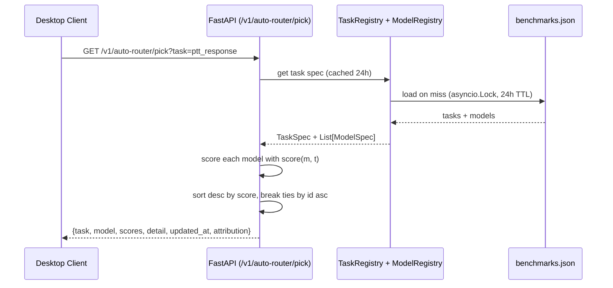

# Auto-router v1 — Task-based model selection across Omi

> Last updated: 2026-06-25 (PR #NEW — auto-router v1 standalone MVP)
>
> A foundational framework that picks the best model per task type using weighted
> scoring across quality / latency / cost, with a daily-refreshable benchmark input
> flow. **MVP, not a production routing replacement.**

## What it is

The auto-router answers one question: *"Given a task type, which model should we use right now?"*

It supports **5 task types** in v1:

| Task | quality | latency | cost | Why these weights |
|---|---|---|---|---|
| `ptt_response` | 0.4 | 0.5 | 0.1 | Real-time voice — latency-critical |
| `screenshot_understanding` | 0.6 | 0.2 | 0.2 | Vision-language — quality-critical |
| `screenshot_embedding` | 0.2 | 0.3 | 0.5 | Bulk retrieval — cost-critical |
| `general_assistant` | 0.5 | 0.3 | 0.2 | Balanced for general chat |
| `transcription` | 0.3 | 0.6 | 0.1 | STT — latency-critical |

For each task, it picks the model with the highest weighted score across the three dimensions. Weights are configurable per task; benchmark values are loaded from `backend/utils/auto_router/benchmarks.json` (deployment) or `benchmarks.example.json` (template).

## Scoring formula

For a candidate model `m` and task `t`:

```
total = t.quality_weight * m.quality_score
      + t.latency_weight * m.latency_score
      + t.cost_weight    * m.cost_score
```

Component scores are clamped to `[0.0, 1.0]` before weighting. `None` for any score is treated as `0` (a model not benchmarked for a dimension doesn't get a free pass on it). Weights are applied exactly as specified — the function does NOT renormalize, so weights summing to something other than 1.0 are honored as-is.

## Architecture



## Relationship to upstream `/v1/auto/model-pick`

The maintainer has shipped a narrower auto-router at `backend/routers/auto_model.py`. Key differences:

| | Upstream `/v1/auto/model-pick` | This PR `/v1/auto-router/pick` |
|---|---|---|
| **Task types** | 1 (realtime voice) | 5 (ptt, screenshot, embed, assistant, transcription) |
| **Scoring** | `0.65 * quality + 0.35 * speed` | `qw * q + lw * l + cw * c` (per-task weights) |
| **Cost dimension** | No (speed proxy) | Yes |
| **Per-task weights** | Hardcoded | Configurable per task |
| **Benchmarks** | Artificial Analysis (live) | `benchmarks.json` (mocked v1; AA-ready) |
| **Desktop client** | `AutoModelSelector.swift` (realtime voice only) | `AutoRouter.swift` (multi-task) |

This PR **does NOT modify or extend** the upstream auto-router. Both coexist; upstream keeps handling realtime-voice "Auto" mode; this new router is the broader framework. Future integration is possible (the upstream auto-router could become a special case of this broader framework) but out of scope for v1.

## Backend module layout

```
backend/utils/auto_router/
├── __init__.py              # public API exports
├── scoring.py               # ModelSpec, TaskSpec, score()
├── task_registry.py         # TaskRegistry (loads from JSON or defaults)
├── model_registry.py        # ModelRegistry (loads from JSON, empty default)
├── daily_refresh.py         # DailyRefreshCache[T] generic cache
├── benchmarks.example.json  # template data (committed)
└── README.md                # usage and extension guide

backend/routers/auto_router.py   # FastAPI router, GET /v1/auto-router/pick

backend/tests/unit/
├── test_auto_router_scoring.py            # 31 tests
├── test_auto_router_task_registry.py      # 21 tests
├── test_auto_router_model_registry.py     # 16 tests
├── test_auto_router_daily_refresh.py      # 13 tests
└── test_auto_router_endpoint.py           # 17 tests
```

Total: 98 backend tests, all passing.

## Desktop module layout

```
desktop/macos/Desktop/Sources/AutoRouter/
├── AutoRouterTask.swift   # enum (5 cases, snake_case rawValue)
└── AutoRouter.swift       # singleton with per-task UserDefaults cache

desktop/macos/Desktop/Tests/AutoRouterTests.swift   # 10 tests
```

The desktop module mirrors `RealtimeOmni/AutoModelSelector.swift` (singleton + UserDefaults + 24h TTL pattern) but is multi-task.

## Endpoint response shape

```json
{
  "task": "ptt_response",
  "model": "gemini-1-5-flash-8b-exp",
  "scores": {
    "gemini-1-5-flash-8b-exp": 0.715,
    "gpt-realtime-2": 0.78,
    "claude-sonnet-4-6": 0.658,
    "haiku-4-5": 0.778
  },
  "detail": {
    "weights": {"quality": 0.4, "latency": 0.5, "cost": 0.1},
    "candidates": [
      {"id": "gpt-realtime-2", "provider": "openai", "scores": {"quality": 0.85, "latency": 0.80, "cost": 0.60}},
      ...
    ],
    "reason": "selected haiku-4-5 (highest weighted score 0.7780)"
  },
  "updated_at": "2026-06-25T10:00:00Z",
  "attribution": "Mock benchmarks for development. See backend/utils/auto_router/benchmarks.example.json for the data format. Production deployment should use real measurements."
}
```

HTTP errors:
- `400` if `task` query parameter is not a known task name (response body lists known tasks in `detail`)
- `422` if `task` query parameter is missing entirely

## Daily refresh mechanism

Both registries (TaskRegistry + ModelRegistry) are wrapped in a `DailyRefreshCache[T]` with a **24-hour TTL** and `asyncio.Lock()`. Behavior:

1. **First call after startup** (or after 24h): acquires lock, loads both registries from the benchmarks JSON, returns the result.
2. **Concurrent calls during a cache miss**: serialize on the lock. Only the first caller hits disk; subsequent callers wait, then read the freshly-loaded value (double-checked locking pattern).
3. **Loader raises (disk error, malformed JSON)**: returns the last good cached value if present (degraded mode, logged at WARNING), else propagates the exception (nothing to fall back to).

This mirrors the pattern in `backend/routers/auto_model.py` (`_cache_lock` + 24h `TTL_SECONDS`) — same TTL, same lock pattern, same fallback semantics.

## How to extend

### Add a new task type

1. Edit `benchmarks.example.json` (template, committed) AND `benchmarks.json` (deployment data, gitignored) — add a new task entry:

```json
{
  "name": "image_generation",
  "quality_weight": 0.7,
  "latency_weight": 0.2,
  "cost_weight": 0.1,
  "description": "Generate images from text prompts. Quality-critical."
}
```

2. Add candidate models under `models.image_generation` (see "Add a new model" below).
3. Verify weights sum to 1.0 (±0.001 tolerance). Loading fails with `TaskValidationError` if not.

### Add a new model

Edit the benchmarks JSON — add the model to the candidate list for one or more tasks:

```json
{
  "id": "claude-opus-5",
  "provider": "anthropic",
  "quality_score": 0.98,
  "latency_score": 0.50,
  "cost_score": 0.20
}
```

Scores are normalized to `[0.0, 1.0]`. Out-of-range values are clamped silently (logging at the scoring layer). Bad data should be fixed at the source.

### Add a new task to the desktop client

1. Add a new case to `AutoRouterTask` enum (with the matching `rawValue` snake_case).
2. The endpoint URL builder picks up the new task automatically (the enum's `rawValue` becomes the `task` query parameter).

### Wire into an actual Omi feature path (future work)

v1 deliberately does NOT wire into `ChatProvider`, `ModelQoS`, or `RealtimeHubController` — that's a follow-up. To wire in:

1. Decide which feature path needs task-aware model selection (e.g., "use the auto-router to pick the chat model when the user picks 'Auto' in ModelQoS settings").
2. In that path, call `AutoRouter.shared.pick(.generalAssistant)` (or whichever task) and use the returned model ID instead of the hardcoded `ModelQoS.Claude.defaultSelection`.
3. Cache the result (UserDefaults + 24h TTL is already handled by `AutoRouter`).
4. Add a fallback: if `AutoRouter.shared.pick` returns nil (no cached pick AND no network), fall back to the current default model.

## Out of scope (v1)

- **Wiring into `ChatProvider`, `ModelQoS`, `RealtimeHubController`** — deferred; this is a standalone MVP.
- **Real Artificial Analysis integration** — `benchmarks.json` is the source. AA key handling is a follow-up.
- **Modifying upstream `/v1/auto/model-pick`** — explicitly out of scope.
- **Per-user personalization** — all users get the same pick for a given task.
- **Online learning** — no feedback loop. Picks are pure functions of the current benchmarks file.
- **More than 5 task types** — bounded to the 5 from the v1 brief. Adding more is straightforward (one line in `task_registry.py`) but not done in v1.

## Future work

1. **AA integration**: replace `benchmarks.json` with live data from `https://artificialanalysis.ai/api/v2/data/llms/models` (server-side, like upstream does).
2. **Wiring into existing feature paths**: see "Wire into an actual Omi feature path" above.
3. **Per-user personalization**: track per-user model performance (latency, quality signals) and adjust the scoring per user.
4. **Online evaluation harness**: shadow mode where the auto-router suggests a model but the current code path is used; measure whether suggestions improve outcomes.
5. **More task types**: image generation, translation, summarization, etc.

## References

- Spec: `.aidlc/spec.md` in the worktree
- Plan: `.aidlc/plan.md` in the worktree
- Backend README: `backend/utils/auto_router/README.md` (usage-focused)
- Upstream auto-router (DO NOT MODIFY): `backend/routers/auto_model.py`
- Upstream desktop client (DO NOT MODIFY): `desktop/macos/Desktop/Sources/RealtimeOmni/AutoModelSelector.swift`
