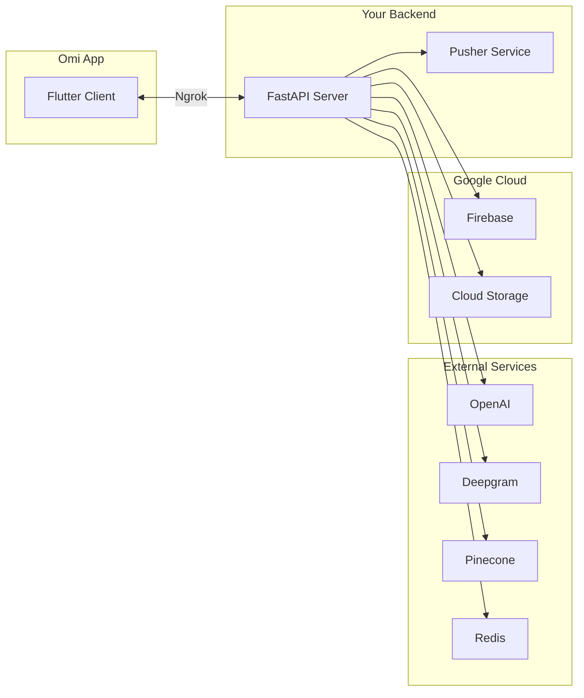

## Overview

The Omi backend powers all AI capabilities including transcription, conversation processing, chat, and integrations. This guide will help you set up a local development environment.



<Info>
If you just want to build apps or test features, you can use Omi's development backend instead. See the [App Setup Guide](/doc/developer/AppSetup) for the automatic setup option.
</Info>

---

## Video Walkthrough

<iframe
  width="560"
  height="315"
  src="https://www.youtube.com/embed/JyXQM0B0Gnc?si=_2W2GU5Qr7dn7gC7"
  title="Omi Backend Setup Video Guide"
  frameBorder="0"
  allow="accelerometer; autoplay; clipboard-write; encrypted-media; gyroscope; picture-in-picture"
  allowFullScreen
></iframe>

---

## Prerequisites

Before starting, gather these API keys and credentials:

<Card title="Required Services" icon="key">
  | Service | Purpose | Get Key |
  |---------|---------|---------|
  | OpenAI | AI language models | [Get Key](https://platform.openai.com/settings/organization/api-keys) |
  | Deepgram | Speech-to-text | [Get Key](https://console.deepgram.com/api-keys) |
  | Redis (Upstash) | Caching & sessions | [Get Key](https://console.upstash.com/) |
  | Pinecone | Vector database | [Get Key](https://app.pinecone.io/organizations/-/projects/-/api-keys) |
  | Hugging Face | Voice detection | [Get Key](https://huggingface.co/settings/tokens) |
</Card>

<Card title="Optional Services" icon="puzzle-piece">
  | Service | Purpose | Get Key |
  |---------|---------|---------|
  | Modal | Serverless deployment | [Get Key](https://modal.com/settings#tokens) |
  | GitHub | Firmware updates | [Get Key](https://github.com/settings/tokens) |
  | Google Maps | Location features | [Get Key](https://console.cloud.google.com/google/maps-apis/credentials) |
  | Typesense | Search functionality | [Get Key](https://cloud.typesense.org/clusters) |
  | Stripe | Payment processing | [Get Key](https://dashboard.stripe.com/apikeys) |
</Card>

<Tip>
New to backend development? Install [Homebrew](https://docs.brew.sh/Installation) (macOS/Linux) or [Chocolatey](https://chocolatey.org/install) (Windows) first - they make installing tools much easier.
</Tip>

---

## 1. Google Cloud & Firebase Setup

<Steps>
  <Step title="Install Google Cloud SDK" icon="download">
    <Tabs>
      <Tab title="macOS">
        ```bash
        brew install google-cloud-sdk
        ```
      </Tab>
      <Tab title="Windows">
        ```powershell
        choco install gcloudsdk
        ```
      </Tab>
      <Tab title="Linux/Nix">
        The SDK is usually pre-installed in Nix environments. Otherwise, follow the [official installation guide](https://cloud.google.com/sdk/docs/install).
      </Tab>
    </Tabs>
  </Step>
  <Step title="Enable Required APIs" icon="toggle-on">
    Go to the [Google Cloud Console](https://console.cloud.google.com/) and enable these APIs:

    <CardGroup cols={2}>
      <Card title="Cloud Resource Manager API" icon="sitemap" href="https://console.cloud.google.com/apis/library/cloudresourcemanager.googleapis.com">
        Required for project management
      </Card>
      <Card title="Firebase Management API" icon="fire" href="https://console.cloud.google.com/apis/library/firebase.googleapis.com">
        Required for Firebase integration
      </Card>
    </CardGroup>
  </Step>
  <Step title="Authenticate with Google Cloud" icon="key">
    Run these commands in your terminal, replacing `<project-id>` with your Google Cloud project ID:

    ```bash
    gcloud auth login
    gcloud config set project <project-id>
    gcloud auth application-default login --project <project-id>
    ```

    This generates credentials at `~/.config/gcloud/application_default_credentials.json`.
  </Step>
  <Step title="Copy Credentials to Backend" icon="copy">
    <Tabs>
      <Tab title="macOS/Linux">
        ```bash
        cp ~/.config/gcloud/application_default_credentials.json ./google-credentials.json
        ```
      </Tab>
      <Tab title="Windows">
        ```powershell
        copy %APPDATA%\gcloud\application_default_credentials.json google-credentials.json
        ```
      </Tab>
    </Tabs>
  </Step>
</Steps>

---

## 2. OAuth Authentication Setup

OAuth is required for user authentication. You need to configure both Google and Apple sign-in.

<Tabs>
  <Tab title="Google OAuth" icon="google">
    <Steps>
      <Step title="Create OAuth 2.0 Client">
        1. Go to [Google Cloud Console → Credentials](https://console.cloud.google.com/apis/credentials)
        2. Click **Create Credentials** → **OAuth 2.0 Client ID**
        3. Select **Web application** as the application type
        4. Set a name (e.g., "Omi Backend Auth")
      </Step>
      <Step title="Configure Authorized Origins">
        Under **Authorized JavaScript origins**, add:
        - `https://your-domain.com` (production)
        - `https://your-ngrok-domain.ngrok-free.app` (local development)
      </Step>
      <Step title="Configure Redirect URIs">
        Under **Authorized redirect URIs**, add:
        - `https://your-domain.com/v1/auth/callback/google`
        - `https://your-ngrok-domain.ngrok-free.app/v1/auth/callback/google`
      </Step>
      <Step title="Save Credentials">
        Click **Create** and save your **Client ID** and **Client Secret** for the `.env` file.
      </Step>
      <Step title="Configure Consent Screen">
        Go to **APIs & Services → OAuth consent screen**:
        - Fill in required app information
        - Add your domain to **Authorized domains**
        - Add scopes: `openid`, `email`, `profile`
      </Step>
    </Steps>
  </Tab>
  <Tab title="Apple OAuth" icon="apple">
    <Warning>
    Apple OAuth requires a paid Apple Developer account ($99/year).
    </Warning>

    <Steps>
      <Step title="Create App ID">
        1. Go to [Apple Developer Console → Identifiers](https://developer.apple.com/account/resources/identifiers/list)
        2. Create a new App ID with **Sign In with Apple** capability enabled
        3. Note your Bundle ID
      </Step>
      <Step title="Create Services ID">
        1. Create a new **Services ID** (this becomes your `APPLE_CLIENT_ID`)
        2. Configure **Sign In with Apple** for this Services ID
        3. Add authorized domains and return URLs:
           - `https://your-domain.com/v1/auth/callback/apple`
           - `https://your-ngrok-domain.ngrok-free.app/v1/auth/callback/apple`
      </Step>
      <Step title="Create Private Key">
        1. Go to **Keys** in Apple Developer Console
        2. Create a new key with **Sign In with Apple** enabled
        3. Download the `.p8` file and note the **Key ID**
        4. Note your **Team ID** from your Apple Developer account
      </Step>
      <Step title="Configure Firebase">
        1. Go to [Firebase Console](https://console.firebase.google.com/) → Authentication → Sign-in method
        2. Enable **Apple** and add your configuration:
           - Client ID: Your Services ID
           - Team ID: Your Apple Developer Team ID
           - Key ID: From your private key
           - Private Key: Contents of your .p8 file
      </Step>
    </Steps>

    <Note>
    Your Apple environment variables will be:
    - `APPLE_CLIENT_ID`: Your Services ID
    - `APPLE_TEAM_ID`: Your Apple Developer Team ID
    - `APPLE_KEY_ID`: The Key ID from step 3
    - `APPLE_PRIVATE_KEY`: The full contents of your .p8 file (including BEGIN/END lines)
    </Note>
  </Tab>
</Tabs>

---

## 3. Backend Installation

<Steps>
  <Step title="Clone the Repository" icon="code-branch">
    ```bash
    git clone https://github.com/BasedHardware/Omi.git
    cd Omi/backend
    ```
  </Step>
  <Step title="Install System Dependencies" icon="box">
    <Tabs>
      <Tab title="macOS">
        ```bash
        brew install python git ffmpeg opus
        ```
      </Tab>
      <Tab title="Windows">
        ```powershell
        choco install python git.install ffmpeg
        ```
        <Note>Opus is included in Windows 10 version 1903 and above.</Note>
      </Tab>
      <Tab title="Linux/Nix">
        Python, Git, and FFmpeg are typically pre-installed. Install opus via your package manager if needed.
      </Tab>
    </Tabs>
  </Step>
  <Step title="Set Up Python Virtual Environment" icon="python">
    <Tip>
    Using a virtual environment is strongly recommended to avoid dependency conflicts.
    </Tip>

    ```bash
    # Create virtual environment (use Python 3.9-3.12)
    python -m venv venv
    ```

    <Tabs>
      <Tab title="macOS/Linux">
        ```bash
        source venv/bin/activate
        ```
      </Tab>
      <Tab title="Windows">
        ```powershell
        venv\Scripts\activate
        ```
      </Tab>
    </Tabs>

    You should see `(venv)` at the beginning of your command prompt.
  </Step>
  <Step title="Install Python Dependencies" icon="download">
    ```bash
    pip install PyOgg
    pip install -r requirements.txt
    ```
  </Step>
  <Step title="Create Environment File" icon="file">
    ```bash
    cp .env.template .env
    ```

    Edit `.env` and fill in your API keys (see [Environment Variables](#environment-variables) below).
  </Step>
</Steps>

---

## 4. Optional Services

<AccordionGroup>
  <Accordion title="Pusher Service (for webhooks)" icon="bell">
    Skip this if you don't need webhook functionality.

    ```bash
    cd pusher
    cp .env.template .env
    ```

    Edit the `.env` file and set `SERVICE_ACCOUNT_JSON` to your Google credentials string.

    Start the service:
    ```bash
    cd ..
    uvicorn pusher.main:app --reload --env-file .env --port 8000
    ```

    Optionally expose via Ngrok for external access.
  </Accordion>
  <Accordion title="Typesense (for search)" icon="magnifying-glass">
    Skip this if you don't need search functionality.

    1. Create an account on [Typesense](https://typesense.org/)
    2. Create a collection named `conversations` using the schema in `typesense/conversations.schema`
    3. Install the [Firebase Typesense extension](https://console.firebase.google.com/project/_/extensions/install?ref=typesense/firestore-typesense-search@2.0.0-rc.1)

    Configuration for the extension:
    | Setting | Value |
    |---------|-------|
    | Firestore Collection Path | `users/{userId}/conversations` |
    | Firestore Collection Fields | `structured,created_at,discarded,started_at,id,finished_at,geolocation,userId` |

    <Note>
    If you have existing data, create a `typesense_sync` collection and add a document named `backfill` with `{'trigger': true}`.
    </Note>
  </Accordion>
</AccordionGroup>

---

## 5. Running the Backend

<Steps>
  <Step title="Set Up Ngrok Tunnel" icon="tunnel">
    Ngrok exposes your local backend to the internet so the Omi app can connect.

    1. Sign up at [ngrok.com](https://ngrok.com/) and install Ngrok
    2. Authenticate with your account
    3. Start the tunnel:

    ```bash
    ngrok http --domain=your-domain.ngrok-free.app 8000
    ```

    Note the public URL (e.g., `https://your-domain.ngrok-free.app`).
  </Step>
  <Step title="Start the Backend Server" icon="play">
    ```bash
    uvicorn main:app --reload --env-file .env --port 8000
    ```

    | Flag | Purpose |
    |------|---------|
    | `--reload` | Auto-restart on code changes |
    | `--env-file .env` | Load environment variables |
    | `--host 0.0.0.0` | Listen on all interfaces (optional) |
    | `--port 8000` | Port to listen on |
  </Step>
  <Step title="Connect the Omi App" icon="link">
    In your Omi app's `.dev.env` file, set:

    ```
    API_BASE_URL=https://your-domain.ngrok-free.app/
    ```

    <Warning>
    Don't forget the trailing `/` in the URL!
    </Warning>

    Make sure your OAuth redirect URIs in Google Cloud Console and Apple Developer Console include your Ngrok URL.
  </Step>
  <Step title="When You're Done" icon="stop">
    Deactivate the virtual environment:

    ```bash
    deactivate
    ```

    To resume later, just activate the virtual environment again.
  </Step>
</Steps>

---

## Troubleshooting

<AccordionGroup>
  <Accordion title="SSL certificate errors during model downloads" icon="lock">
    Add this to `utils/stt/vad.py`:

    ```python
    import ssl
    ssl._create_default_https_context = ssl._create_unverified_context
    ```
  </Accordion>
  <Accordion title="API key issues" icon="key">
    - Double-check all API keys in your `.env` file
    - Ensure there are no trailing spaces or quotes around values
    - Verify keys are active and not expired
  </Accordion>
  <Accordion title="Ngrok connection issues" icon="globe">
    - Ensure your Ngrok tunnel is running
    - Verify the URL is correctly set in the Omi app
    - Check that OAuth redirect URIs match your Ngrok URL
  </Accordion>
  <Accordion title="Module not found errors" icon="box-open">
    Try reinstalling dependencies:

    ```bash
    pip install -r requirements.txt --upgrade --force-reinstall
    ```
  </Accordion>
  <Accordion title="Virtual environment not activating" icon="terminal">
    - On Windows, you may need to enable script execution: `Set-ExecutionPolicy -ExecutionPolicy RemoteSigned -Scope CurrentUser`
    - Make sure you're using Python 3.9-3.12
  </Accordion>
</AccordionGroup>

---

## Environment Variables

Complete reference for all `.env` variables:

<Tabs>
  <Tab title="Required" icon="asterisk">
    | Variable | Description |
    |----------|-------------|
    | `OPENAI_API_KEY` | OpenAI API key for AI models |
    | `DEEPGRAM_API_KEY` | Deepgram API key for transcription |
    | `HUGGINGFACE_TOKEN` | Hugging Face token for voice detection models |
    | `REDIS_DB_HOST` | Redis host address |
    | `REDIS_DB_PORT` | Redis port number |
    | `REDIS_DB_PASSWORD` | Redis password (blank if none) |
    | `PINECONE_API_KEY` | Pinecone API key for vector database |
    | `PINECONE_INDEX_NAME` | Name of your Pinecone index |
    | `GOOGLE_APPLICATION_CREDENTIALS` | Path to `google-credentials.json` |
    | `ADMIN_KEY` | Temporary key for local dev (e.g., `123`) |
    | `ENCRYPTION_SECRET` | At least 32 bytes for encrypting user data |
  </Tab>
  <Tab title="OAuth" icon="user-shield">
    | Variable | Description |
    |----------|-------------|
    | `GOOGLE_CLIENT_ID` | Google OAuth 2.0 Client ID |
    | `GOOGLE_CLIENT_SECRET` | Google OAuth 2.0 Client Secret |
    | `APPLE_CLIENT_ID` | Apple Services ID |
    | `APPLE_TEAM_ID` | Apple Developer Team ID |
    | `APPLE_KEY_ID` | Apple private key ID |
    | `APPLE_PRIVATE_KEY` | Apple .p8 file contents (with BEGIN/END lines) |
    | `BASE_API_URL` | Your backend URL (e.g., Ngrok URL) |
  </Tab>
  <Tab title="Storage" icon="database">
    | Variable | Description |
    |----------|-------------|
    | `BUCKET_SPEECH_PROFILES` | GCS bucket for speech profiles |
    | `BUCKET_PLUGIN_LOGOS` | GCS bucket for app logos |
    | `BUCKET_BACKUPS` | GCS bucket for backups |
  </Tab>
  <Tab title="Optional" icon="puzzle-piece">
    | Variable | Description |
    |----------|-------------|
    | `GITHUB_TOKEN` | GitHub token for firmware updates |
    | `WORKFLOW_API_KEY` | Custom key for workflow integrations |
    | `HOSTED_PUSHER_API_URL` | URL of your pusher service |
    | `TYPESENSE_HOST` | Typesense server URL |
    | `TYPESENSE_API_KEY` | Typesense API key |
    | `NO_SOCKET_TIMEOUT` | Set `True` to disable socket timeout |
  </Tab>
</Tabs>

<Warning>
The `ENCRYPTION_SECRET` in `.env.template` is for development only. **Generate a new secure key for production!**
</Warning>

---

## Code Formatting

We use `black` for code formatting with a line length of 120 characters.

```bash
pip install black
```

To auto-format on commit, install the pre-commit hook from the repository root:

```bash
ln -s -f ../../scripts/pre-commit .git/hooks/pre-commit
```

---

## Related Documentation

<CardGroup cols={2}>
  <Card title="App Setup" icon="mobile" href="/doc/developer/AppSetup">
    Set up the Flutter app for development
  </Card>
  <Card title="Backend Deep Dive" icon="magnifying-glass" href="/doc/developer/backend/backend_deepdive">
    Understand the backend architecture
  </Card>
  <Card title="Chat System" icon="comments" href="/doc/developer/backend/chat_system">
    Learn how the chat feature works
  </Card>
  <Card title="Storing Conversations" icon="database" href="/doc/developer/backend/StoringConversations">
    How conversations and memories are stored
  </Card>
</CardGroup>

---

## Need Help?

<CardGroup cols={2}>
  <Card title="GitHub Issues" icon="github" href="https://github.com/BasedHardware/omi/issues">
    Report bugs or request features
  </Card>
  <Card title="Discord Community" icon="discord" href="http://discord.omi.me">
    Get help from the community
  </Card>
</CardGroup>
