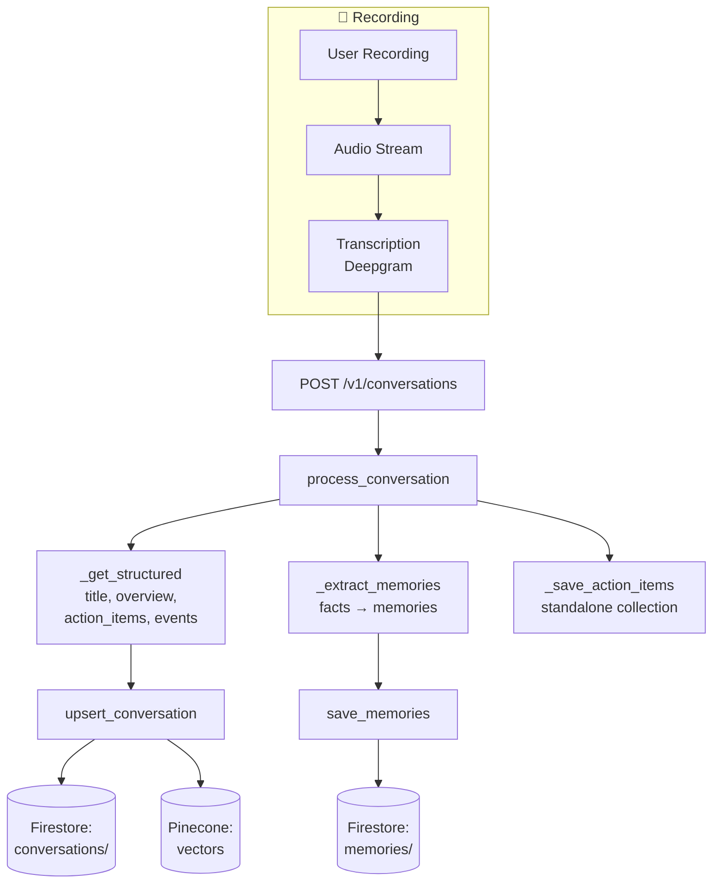

## Overview

Omi uses a **dual-collection architecture** for storing user data:

<CardGroup cols={2}>
  <Card title="Conversations" icon="comments">
    **Primary storage** for recorded interactions - transcripts, audio, structured summaries
  </Card>
  <Card title="Memories" icon="brain">
    **Secondary storage** for extracted facts/learnings FROM conversations
  </Card>
</CardGroup>

This separation allows for efficient retrieval of both full conversation context and quick access to key facts about the user.

## Architecture Diagram



## Firestore Structure

```
users/
├── {uid}/
│   ├── conversations/                    # PRIMARY - Recorded interactions
│   │   └── {conversation_id}/
│   │       ├── id
│   │       ├── created_at
│   │       ├── started_at
│   │       ├── finished_at
│   │       ├── source
│   │       ├── language
│   │       ├── status
│   │       ├── structured
│   │       ├── transcript_segments
│   │       ├── geolocation
│   │       ├── photos/ (subcollection)
│   │       ├── audio_files
│   │       ├── apps_results
│   │       ├── discarded
│   │       ├── visibility
│   │       ├── is_locked
│   │       └── data_protection_level
│   │
│   ├── memories/                         # SECONDARY - Extracted facts
│   │   └── {memory_id}/
│   │       ├── id
│   │       ├── uid
│   │       ├── conversation_id
│   │       ├── content
│   │       ├── category
│   │       ├── tags
│   │       ├── visibility
│   │       ├── created_at
│   │       ├── updated_at
│   │       ├── reviewed
│   │       ├── user_review
│   │       ├── scoring
│   │       └── data_protection_level
│   │
│   └── action_items/                     # Standalone action items
│       └── {action_item_id}/
│           ├── description
│           ├── completed
│           ├── conversation_id
│           ├── created_at
│           ├── due_at
│           └── completed_at
```

---

## Part 1: Storing Conversations

### Processing Flow

<Steps>
  <Step title="API Request" icon="paper-plane">
    The app sends a POST request to `/v1/conversations` with transcript data
  </Step>
  <Step title="Processing" icon="gear">
    `process_conversation()` in `utils/conversations/process_conversation.py` handles the logic
  </Step>
  <Step title="Structure Extraction" icon="wand-magic-sparkles">
    LLM extracts title, overview, action items, and events from the transcript
  </Step>
  <Step title="Storage" icon="database">
    `upsert_conversation()` in `database/conversations.py` saves to Firestore
  </Step>
  <Step title="Vector Embedding" icon="magnifying-glass">
    Conversation is embedded and stored in Pinecone for semantic search
  </Step>
</Steps>

### Conversation Model Fields

| Field | Type | Description |
|-------|------|-------------|
| `id` | string | Unique conversation identifier |
| `created_at` | datetime | When the conversation record was created |
| `started_at` | datetime | When the actual conversation started |
| `finished_at` | datetime | When the conversation ended |
| `source` | enum | Source device (omi, phone, desktop, openglass, etc.) |
| `language` | string | Language code of the conversation |
| `status` | enum | Processing status: `in_progress`, `processing`, `completed`, `failed` |
| `structured` | object | Extracted structured information (see below) |
| `transcript_segments` | array | List of transcript segments |
| `geolocation` | object | Location data (latitude, longitude, address) |
| `photos` | array | Photos captured during conversation |
| `audio_files` | array | Audio file references |
| `apps_results` | array | Results from summarization apps |
| `external_data` | object | Data from external integrations |
| `discarded` | boolean | Whether conversation was marked as low-quality |
| `visibility` | enum | `private`, `shared`, or `public` |
| `is_locked` | boolean | Whether conversation is locked from editing |
| `data_protection_level` | string | `standard` or `enhanced` (encrypted) |

### Structured Information

The `structured` field contains LLM-extracted information:

| Field | Type | Description |
|-------|------|-------------|
| `title` | string | Short descriptive title for the conversation |
| `overview` | string | Summary of key points discussed |
| `emoji` | string | Emoji representing the conversation |
| `category` | enum | Category (personal, work, health, etc.) |
| `action_items` | array | Tasks or to-dos mentioned |
| `events` | array | Calendar events to be created |

### Transcript Segments

Each segment in `transcript_segments` includes:

| Field | Type | Description |
|-------|------|-------------|
| `text` | string | Transcribed text content |
| `speaker` | string | Speaker label (e.g., "SPEAKER_00") |
| `start` | float | Start time in seconds |
| `end` | float | End time in seconds |
| `is_user` | boolean | Whether spoken by the device owner |
| `person_id` | string | ID of identified person (if matched) |

### Action Items

Action items are stored both inline (in `structured.action_items`) and in a standalone collection:

| Field | Type | Description |
|-------|------|-------------|
| `description` | string | The action item text |
| `completed` | boolean | Whether the item is done |
| `created_at` | datetime | When extracted |
| `due_at` | datetime | Optional due date |
| `completed_at` | datetime | When marked complete |
| `conversation_id` | string | Source conversation |

### Events

Calendar events extracted from conversations:

| Field | Type | Description |
|-------|------|-------------|
| `title` | string | Event title |
| `description` | string | Event description |
| `start` | datetime | Start date/time |
| `duration` | integer | Duration in minutes |
| `created` | boolean | Whether added to calendar |

---

## Part 2: Extracting & Storing Memories

Memories are **facts about the user** extracted from conversations. They represent learnings, preferences, habits, and other personal information.

### Memory Extraction Process

During `process_conversation()`, the system:

<Steps>
  <Step title="Analyze Transcript" icon="magnifying-glass-chart">
    Reviews the conversation transcript for personal information
  </Step>
  <Step title="Extract Facts" icon="lightbulb">
    Identifies facts worth remembering about the user (~15 words max)
  </Step>
  <Step title="Store with Link" icon="link">
    Saves to `memories` collection with a link back to the source conversation
  </Step>
</Steps>

### Memory Model Fields

| Field | Type | Description |
|-------|------|-------------|
| `id` | string | Unique memory identifier |
| `uid` | string | User ID |
| `conversation_id` | string | Source conversation (links back) |
| `content` | string | The actual fact/learning (max ~15 words) |
| `category` | enum | `interesting`, `system`, or `manual` |
| `tags` | array | Categorization tags |
| `visibility` | string | `private` or `public` |
| `created_at` | datetime | When memory was created |
| `updated_at` | datetime | Last modification time |
| `reviewed` | boolean | Whether user has reviewed |
| `user_review` | boolean | User's approval (true/false/null) |
| `edited` | boolean | Whether user edited the content |
| `scoring` | string | Ranking score for retrieval |
| `manually_added` | boolean | Whether user created manually |
| `is_locked` | boolean | Prevent automatic deletion |
| `app_id` | string | Source app (if from integration) |
| `data_protection_level` | string | Encryption level |

### Memory Categories

<CardGroup cols={3}>
  <Card title="Interesting" icon="star">
    Notable facts about the user: hobbies, opinions, stories
  </Card>
  <Card title="System" icon="gear">
    Preferences and patterns: work habits, sleep schedule
  </Card>
  <Card title="Manual" icon="pen">
    User-created memories: explicitly added facts
  </Card>
</CardGroup>

<Note>
Legacy categories (`core`, `hobbies`, `lifestyle`, `interests`, `habits`, `work`, `skills`, `learnings`, `other`) are automatically mapped to the new primary categories for backward compatibility.
</Note>

### Memory Extraction Rules

The system follows these guidelines when extracting memories:
- Maximum ~15 words per memory
- Must pass the "shareability test" - would this be worth telling someone?
- Maximum 2 `interesting` + 2 `system` memories per conversation
- No duplicate or near-duplicate facts
- Skip mundane details (eating, sleeping, commuting)

---

## Part 3: Data Protection & Encryption

Both conversations and memories support encryption for sensitive data.

<Tabs>
  <Tab title="Standard" icon="unlock">
    ### Standard Protection Level

    No encryption, stored as plaintext. This is the default for most users.

    - Fastest read/write performance
    - Data visible in Firestore console
    - Suitable for general use
  </Tab>
  <Tab title="Enhanced" icon="lock">
    ### Enhanced Protection Level

    AES encryption for sensitive fields. Provides additional security for sensitive conversations.

    **Encrypted Fields:**
    - **Conversations**: `transcript_segments` (the actual transcript text)
    - **Memories**: `content` (the memory text)

    <Warning>
    Enhanced encryption adds processing overhead to read/write operations.
    </Warning>
  </Tab>
</Tabs>

### Implementation

```python
# Conversations: database/conversations.py
def _prepare_conversation_for_write(conversation_data, data_protection_level):
    if data_protection_level == 'enhanced':
        # Encrypt transcript_segments before storage
        ...

def _prepare_conversation_for_read(conversation_data, data_protection_level):
    if data_protection_level == 'enhanced':
        # Decrypt transcript_segments after retrieval
        ...
```

---

## Part 4: Vector Embeddings

Conversations are also stored as vector embeddings in Pinecone for semantic search.

### What Gets Embedded

| Data | Embedded? | Stored in Metadata? |
|------|-----------|---------------------|
| Title | Yes | No |
| Overview | Yes | No |
| Action Items | Yes | No |
| Full Transcript | No (too large) | No |
| People Mentioned | No | Yes |
| Topics | No | Yes |
| Entities | No | Yes |
| created_at | No | Yes |

### Vector Creation

Vectors are created in a background thread after conversation processing:

```python
# utils/conversations/process_conversation.py
threading.Thread(
    target=save_structured_vector,
    args=(uid, conversation)
).start()
```

The `save_structured_vector()` function:
1. Generates embedding from `conversation.structured` (title + overview + action_items + events)
2. Extracts metadata via LLM (people, topics, entities, dates)
3. Upserts to Pinecone with metadata filters

<Warning>
Vectors are created ONCE during initial processing. Reprocessed conversations do NOT update their vectors.
</Warning>

---

## Key Code Locations

| Component | File Path |
|-----------|-----------|
| **Conversation Model** | `backend/models/conversation.py` |
| **Memory Model** | `backend/models/memories.py` |
| **Process Conversation** | `backend/utils/conversations/process_conversation.py` |
| **Database - Conversations** | `backend/database/conversations.py` |
| **Database - Memories** | `backend/database/memories.py` |
| **Router - Conversations** | `backend/routers/conversations.py` |
| **Router - Memories** | `backend/routers/memories.py` |
| **Vector Database** | `backend/database/vector_db.py` |

---

## API Endpoints

### Conversations

| Method | Endpoint | Description |
|--------|----------|-------------|
| POST | `/v1/conversations` | Process and store a new conversation |
| GET | `/v1/conversations` | List user's conversations |
| GET | `/v1/conversations/{id}` | Get specific conversation |
| PATCH | `/v1/conversations/{id}/title` | Update conversation title |
| DELETE | `/v1/conversations/{id}` | Delete a conversation |

### Memories

| Method | Endpoint | Description |
|--------|----------|-------------|
| POST | `/v3/memories` | Create a manual memory |
| GET | `/v3/memories` | List user's memories |
| PATCH | `/v3/memories/{id}` | Edit a memory |
| DELETE | `/v3/memories/{id}` | Delete a memory |
| PATCH | `/v3/memories/{id}/visibility` | Change memory visibility |

---

## Related Documentation

<CardGroup cols={2}>
  <Card title="Chat System Architecture" icon="comments" href="/doc/developer/backend/chat_system">
    How conversations are retrieved for chat using LangGraph
  </Card>
  <Card title="Real-time Transcription" icon="microphone" href="/doc/developer/backend/transcription">
    WebSocket-based real-time speech-to-text
  </Card>
  <Card title="Backend Deep Dive" icon="server" href="/doc/developer/backend/backend_deepdive">
    General backend architecture overview
  </Card>
  <Card title="Backend Setup" icon="gear" href="/doc/developer/backend/Backend_Setup">
    Environment setup and configuration
  </Card>
</CardGroup>
