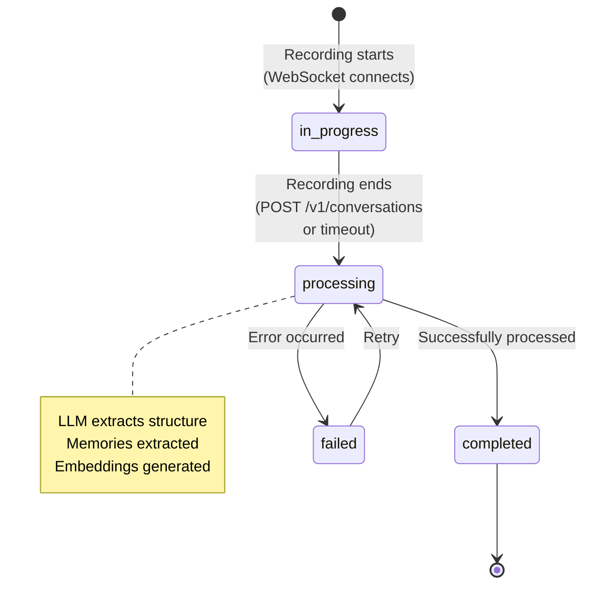

## Understanding the Omi Ecosystem

Omi is a multimodal AI assistant designed to understand and interact with users in a way that's both intelligent and human-centered. The backend plays a crucial role in this by:

- **Processing and analyzing data:** Converting audio to text, extracting meaning, and creating structured information from user interactions.
- **Storing conversations and extracting memories:** Building a rich knowledge base of user conversations and extracted facts that Omi can draw upon to provide context and insights.
- **Facilitating intelligent chat:** Understanding user requests, retrieving relevant conversations, and generating personalized responses using an agentic AI system.
- **Integrating with external services:** Extending Omi's capabilities and connecting it to other tools and platforms.

This deep dive will walk you through the **core elements** of Omi's backend, providing a clear roadmap for developers and enthusiasts alike to understand its inner workings.

<Tabs>
  <Tab title="Quick Start" icon="rocket">
    Jump to the [Quick Reference](#quick-reference) table to find what you need fast.
  </Tab>
  <Tab title="Full Deep Dive" icon="book">
    Read through the complete documentation below to understand the architecture.
  </Tab>
  <Tab title="Visual Guides" icon="diagram-project">
    See the [System Architecture](#system-architecture) flowchart and other diagrams throughout.
  </Tab>
</Tabs>

## System Architecture

```mermaid
flowchart TD
    subgraph Client
        App["🔵 Omi App<br/>(Flutter)"]
    end

    subgraph API["API Endpoints"]
        WS["/v4/listen<br/>WebSocket"]
        Conv["/v1/conversations<br/>REST"]
        Chat["/v2/messages<br/>REST"]
    end

    subgraph Routers
        Trans["routers/transcribe.py"]
        ConvR["routers/conversations.py"]
        ChatR["routers/chat.py"]
    end

    subgraph Processing
        DG["Deepgram API<br/>Speech-to-Text"]
        PC["process_conversation()"]
        LG["LangGraph<br/>Agentic System"]
    end

    subgraph Storage["Data Storage"]
        FS[("Firestore<br/>Conversations & Memories")]
        Pine[("Pinecone<br/>Vector Embeddings")]
        Redis[("Redis<br/>Cache & Metadata")]
        GCS[("Google Cloud Storage<br/>Binary Files")]
    end

    App --> WS
    App --> Conv
    App --> Chat

    WS --> Trans
    Conv --> ConvR
    Chat --> ChatR

    Trans --> DG
    ConvR --> PC
    ChatR --> LG

    PC --> FS
    PC --> Pine
    PC --> GCS
    LG --> FS
    LG --> Pine
    LG --> Redis
    Trans --> GCS
```



## Quick Reference

<CardGroup cols={3}>
  <Card title="Conversations DB" icon="comments" href="#1-databaseconversationspy-the-conversation-guardian">
    Firestore CRUD operations for storing and retrieving conversations
  </Card>
  <Card title="Vector Search" icon="magnifying-glass" href="#2-databasevector_dbpy-the-embedding-expert">
    Pinecone embeddings for semantic similarity search
  </Card>
  <Card title="LLM Processing" icon="brain" href="#3-utilsllm-directory-the-ai-maestro">
    OpenAI integrations for structure extraction and chat
  </Card>
  <Card title="Cloud Storage" icon="cloud" href="#4-utilsotherstoragepy-the-cloud-storage-manager">
    Google Cloud Storage for audio files
  </Card>
  <Card title="Redis Cache" icon="bolt" href="#5-databaseredis_dbpy-the-data-speedster">
    High-speed caching for profiles and preferences
  </Card>
  <Card title="Transcription" icon="microphone" href="#6-routerstranscribepy-the-real-time-transcription-engine">
    Real-time speech-to-text with multiple STT services
  </Card>
</CardGroup>

| Need to... | Go to |
|------------|-------|
| Store a conversation | `database/conversations.py` |
| Query similar conversations | `database/vector_db.py` |
| Process LLM calls | `utils/llm/` directory |
| Handle real-time audio | `routers/transcribe.py` |
| Manage caching | `database/redis_db.py` |
| Understand chat system | [Chat System Architecture](/doc/developer/backend/chat_system) |
| Learn data models | [Storing Conversations](/doc/developer/backend/StoringConversations) |

## The Flow of Information

Let's trace the journey of a typical interaction with Omi, focusing on how audio recordings are transformed into stored conversations:

<Steps>
  <Step title="User Initiates Recording" icon="microphone">
    The user starts a recording session using the Omi app, capturing a conversation or their thoughts.
  </Step>
  <Step title="WebSocket Connection" icon="plug">
    The Omi app establishes a real-time connection with the backend at the `/v4/listen` endpoint in `routers/transcribe.py`.
  </Step>
  <Step title="Audio Streaming" icon="wave-pulse">
    The app streams audio data continuously through the WebSocket to the backend.
  </Step>
  <Step title="Deepgram Processing" icon="ear-listen">
    The backend forwards audio to Deepgram API for real-time speech-to-text conversion.
  </Step>
  <Step title="Live Feedback" icon="comment-dots">
    Transcription results stream back through the backend to the app, displaying words as the user speaks.
  </Step>
  <Step title="Conversation Creation" icon="floppy-disk">
    During the WebSocket connection, the backend creates an "in_progress" conversation stub in Firestore. As audio streams, transcript segments are continuously added to Firestore in real-time. When recording ends, the app sends a POST request to `/v1/conversations` with an empty body (`{}`). The backend retrieves the in-progress conversation from Firestore and processes it.
  </Step>
  <Step title="LLM Processing" icon="wand-magic-sparkles">
    The `process_conversation` function uses OpenAI to extract:
    - **Title & Overview** - Summarizes the conversation
    - **Action Items** - Tasks and to-dos mentioned
    - **Events** - Calendar-worthy moments
    - **Memories** - Facts about the user
  </Step>
  <Step title="Storage" icon="database">
    - **Firestore**: Stores the full conversation document with transcript segments and metadata
    - **Pinecone**: Stores the vector embedding for semantic search
    - **Redis**: Caches frequently accessed data (speech profile durations, enabled apps, user names) for performance
    - **Google Cloud Storage**: Stores binary files (speech profile audio, conversation recordings, photos)
  </Step>
</Steps>

### What Gets Extracted

| Field | Description |
|-------|-------------|
| `title` | A short, descriptive title |
| `overview` | Concise summary of main points |
| `category` | Work, personal, etc. |
| `action_items` | Tasks or to-dos mentioned |
| `events` | Calendar-worthy events |
| `memories` | Facts about the user (stored separately) |

<Tip>
Use the Quick Reference table above to jump directly to the component you need. Each section below includes key functions and usage patterns.
</Tip>

## Core Components

Now that you understand the general flow, let's dive deeper into the key modules and services that power Omi's backend.

### 1. `database/conversations.py`: The Conversation Guardian

This module is responsible for managing the interaction with Firebase Firestore, Omi's main database for storing conversations and related data.

**Key Functions:**

- `upsert_conversation`: Creates or updates a conversation document in Firestore, ensuring efficient storage and handling of updates.
- `get_conversation`: Retrieves a specific conversation by its ID.
- `get_conversations`: Fetches a list of conversations for a user, allowing for filtering, pagination, and optional inclusion of discarded conversations.
- **Photo Functions:** Handles the storage and retrieval of photos associated with conversations.

**Firestore Structure:**

Each conversation is stored as a document in Firestore with the following fields:

```python
class Conversation(BaseModel):
    id: str  # Unique ID
    created_at: datetime  # Creation timestamp
    started_at: Optional[datetime]
    finished_at: Optional[datetime]

    source: Optional[ConversationSource]  # omi, phone, desktop, openglass, etc.
    language: Optional[str]
    status: ConversationStatus  # in_progress, processing, completed, failed

    structured: Structured  # Contains extracted title, overview, action items, etc.
    transcript_segments: List[TranscriptSegment]
    geolocation: Optional[Geolocation]
    photos: List[ConversationPhoto]

    apps_results: List[AppResult]
    external_data: Optional[Dict]

    discarded: bool
    deleted: bool
    visibility: str  # private, shared, public

    # See StoringConversations.mdx for complete field reference
```

#### Conversation Lifecycle



**Processing Triggers:**
- **Manual:** App sends `POST /v1/conversations` with empty body to trigger immediate processing
- **Automatic:** Backend automatically processes conversations after a timeout period (`conversation_timeout` parameter, default 120 seconds of silence)
- Both paths use the same `process_conversation()` function to extract structure, memories, and embeddings

### 2. `database/vector_db.py`: The Embedding Expert

This module manages the interaction with Pinecone, a vector database used to store and query conversation embeddings.

**Key Functions:**

- `upsert_vector`: Adds or updates a conversation embedding in Pinecone.
- `upsert_vectors`: Efficiently adds or updates multiple embeddings.
- `query_vectors`: Performs similarity search to find conversations relevant to a user query.
- `delete_vector`: Removes a conversation embedding.

**Pinecone's Role:**

Pinecone's specialized vector search capabilities are essential for:

- **Contextual Retrieval:** Finding conversations that are semantically related to a user's request, even if they don't share exact keywords.
- **Efficient Search:** Quickly retrieving relevant conversations from a large collection.
- **Scalability:** Handling the growing number of conversation embeddings as the user creates more conversations.

### 3. `utils/llm/` Directory: The AI Maestro

This directory contains modules where the power of OpenAI's LLMs is harnessed for a wide range of tasks. It's the core of Omi's intelligence!

**Key Files:**

- `clients.py`: LLM client configurations and embedding models
- `chat.py`: Chat-related prompts and processing
- `conversation_processing.py`: Conversation analysis and structuring

**Key Functionalities:**

- **Conversation Processing:**
    - Determines if a conversation should be discarded.
    - Extracts structured information from transcripts (title, overview, categories, etc.).
    - Runs apps on conversation data.
- **External Integration Processing:**
    - Creates structured summaries from photos and descriptions (OpenGlass).
    - Processes data from external sources to generate conversations.
- **Chat and Retrieval:**
    - Generates initial chat messages.
    - Analyzes chat conversations to determine if context is needed.
    - Extracts relevant topics and dates from chat history.
    - Retrieves and summarizes relevant conversation content for chat responses.
- **Emotional Processing:**
    - Analyzes conversation transcripts for user emotions.
    - Generates emotionally aware responses based on context and user facts.
- **Fact Extraction:** Identifies and extracts new facts (memories) about the user from conversation transcripts.

**OpenAI Integration:**

- The LLM modules leverage OpenAI's models (GPT-4o and others) for language understanding, generation, and reasoning.
- `text-embedding-3-large` is used to generate vector embeddings for conversations and user queries.

**Why this is Essential:**

- **The Brain of Omi:** These modules enable Omi's core AI capabilities, including natural language understanding, content generation, and context-aware interactions.
- **Conversation Enhancement:** They enrich raw data by extracting meaning and creating structured information.
- **Personalized Responses:** They help Omi provide responses tailored to individual users, incorporating their unique facts, conversations, and emotional states.
- **Extensibility:** The app system and integration with external services make Omi highly versatile.

<Info>
For detailed chat system architecture including LangGraph routing and the agentic tool system, see [Chat System Architecture](/doc/developer/backend/chat_system).
</Info>

### 4. `utils/other/storage.py`: The Cloud Storage Manager

This module handles interactions with Google Cloud Storage (GCS), specifically for managing user speech profiles.

**Key Functions:**

- **`upload_profile_audio(file_path: str, uid: str)`:**
    - Uploads a user's speech profile audio recording to the GCS bucket specified by the `BUCKET_SPEECH_PROFILES` environment variable.
    - Organizes audio files within the bucket using the user's ID (`uid`).
    - Returns the public URL of the uploaded file.
- **`get_profile_audio_if_exists(uid: str) -> str`:**
    - Checks if a speech profile already exists for a given user ID in the GCS bucket.
    - Downloads the speech profile audio to a local temporary file if it exists and returns the file path.
    - Returns `None` if the profile does not exist.

**Usage:**

- The `upload_profile_audio` function is called when a user uploads a new speech profile recording through the `/v3/upload-audio` endpoint (defined in `routers/speech_profile.py`).
- The `get_profile_audio_if_exists` function is used to retrieve a user's speech profile when needed, for example, during speaker identification in real-time transcription or post-processing.

### 5. `database/redis_db.py`: The Data Speedster

<Note>
Redis is optional for local development. The backend will work without it, but features like speech profiles and app preferences caching will be disabled.
</Note>

Redis is an in-memory data store known for its speed and efficiency. The `database/redis_db.py` module handles Omi's interactions with Redis, which is primarily used for caching, managing user
settings, and storing user speech profiles.

**Data Stored and Retrieved from Redis:**

- **User Speech Profile Metadata:**
    - **Storage:** When a user uploads a speech profile, the audio file is stored in Google Cloud Storage, while the duration is cached in Redis for quick access.
    - **Retrieval:** During real-time transcription or post-processing, the speech profile duration is retrieved from Redis cache, while the actual audio file is loaded from Google Cloud Storage when needed for speaker identification.
- **Enabled Apps:**
    - **Storage:** A set of app IDs is stored for each user, representing the apps they have enabled.
    - **Retrieval:** When processing a conversation or handling a chat request, the backend checks Redis to see which apps are enabled for the user.
- **App Reviews:**
    - **Storage:** Reviews for each app (score, review text, date) are stored in Redis, organized by app ID and user ID.
    - **Retrieval:** When displaying app information, the backend retrieves reviews from Redis.
- **Cached User Names:**
    - **Storage:** User names are cached in Redis to avoid repeated lookups from Firebase.
    - **Retrieval:** The backend first checks Redis for a user's name before querying Firestore, improving performance.

**Key Functions:**

| Function | Purpose |
|----------|---------|
| `set_speech_profile_duration` | Cache speech profile duration (audio stored in GCS) |
| `get_speech_profile_duration` | Retrieve cached speech profile duration |
| `set_user_has_soniox_speech_profile` | Mark that user has Soniox speech profile |
| `get_user_has_soniox_speech_profile` | Check if user has Soniox speech profile |
| `enable_app`, `disable_app` | Manage app enable/disable states |
| `get_enabled_apps` | Get user's enabled apps |
| `get_app_reviews` | Retrieve reviews for an app |
| `cache_user_name`, `get_cached_user_name` | Cache and retrieve user names |

<Note>
**Storage Separation:** Redis is used for caching metadata (durations, flags, enabled apps) to improve performance. The actual speech profile audio files are stored in Google Cloud Storage via `utils/other/storage.py`. This separation ensures Redis remains fast and lightweight while GCS handles binary file storage.
</Note>

**Why Redis is Important:**

- **Performance:** Caching data in Redis significantly improves the backend's speed, as frequently accessed data can be retrieved from memory very quickly.
- **User Data Management:** Redis provides a flexible and efficient way to manage user-specific metadata, such as app preferences, speech profile durations, and enabled apps.
- **Real-time Features:** The low-latency nature of Redis makes it ideal for supporting real-time features like live transcription and instant app interactions.
- **Scalability:** As the number of users grows, Redis helps maintain performance by reducing the load on primary databases (Firestore) and storage systems (GCS).

### 6. `routers/transcribe.py`: The Real-Time Transcription Engine

This module is the powerhouse behind Omi's real-time transcription capabilities, allowing the app to convert spoken audio into text as the user is speaking. It leverages WebSockets for bidirectional
communication with the Omi app and multiple STT services (Deepgram, Soniox, Speechmatics) for accurate and efficient transcription.

#### 1. WebSocket Communication

<Warning>
WebSocket connections require proper authentication. The `uid` parameter must be a valid Firebase user ID, and connections without proper auth will be rejected.
</Warning>

- **`/v4/listen` Endpoint:** The Omi app initiates a WebSocket connection with the backend at the `/v4/listen` endpoint, which is defined in the `websocket_endpoint` function of `routers/transcribe.py`.
- **Bidirectional Communication:** WebSockets enable a two-way communication channel, allowing:
    - The Omi app to stream audio data to the backend continuously.
    - The backend to send back transcribed text segments as they become available from Deepgram.
- **Real-Time Feedback:** This constant back-and-forth ensures that users see their words being transcribed in real-time, creating a more interactive and engaging experience.

#### 2. STT Service Integration

Omi supports multiple Speech-to-Text (STT) services with automatic selection based on language support:

- **Deepgram** (Nova-2, Nova-3 models) - Primary service for most languages
- **Soniox** (stt-rt-preview model) - Used for specific language combinations
- **Speechmatics** - Additional fallback option

The backend automatically selects the appropriate STT service using `get_stt_service_for_language()` in `utils/stt/streaming.py`, which considers language support and the configured service priority order (set via `STT_SERVICE_MODELS` environment variable).

**Processing Functions:**
- **`process_audio_dg()`** - Manages interaction with Deepgram API (found in `utils/stt/streaming.py`)
- **`process_audio_soniox()`** - Manages interaction with Soniox API
- **`process_audio_speechmatics()`** - Manages interaction with Speechmatics API

The audio chunks streamed from the Omi app are sent to the selected STT service API for transcription. The service's speech recognition models process the audio and return text results in real-time.

**Deepgram Options Configuration:** The `process_audio_dg` function configures various Deepgram options:

<AccordionGroup>
  <Accordion title="punctuate" icon="period">
    Automatically adds punctuation to transcribed text for readability. Essential for creating natural-looking transcripts.
  </Accordion>
  <Accordion title="no_delay" icon="bolt">
    Minimizes latency for real-time feedback. This is essential for live transcription where users expect to see words appear as they speak.
  </Accordion>
  <Accordion title="language" icon="globe">
    Sets the language for transcription (e.g., 'en', 'es', 'fr'). The user can specify their preferred language when starting a recording.
  </Accordion>
  <Accordion title="interim_results" icon="spinner">
    Controls whether to send interim (partial) transcription results or only final results. Set to `False` in production for cleaner output.
  </Accordion>
  <Accordion title="diarize" icon="users">
    Enables speaker diarization - identifying different speakers in the audio. Critical for multi-person conversations to attribute text to the correct speaker.
  </Accordion>
  <Accordion title="encoding & sample_rate" icon="sliders">
    Audio format settings for Deepgram compatibility. These must match the audio format being sent from the app.
  </Accordion>
</AccordionGroup>

#### 3. Transcription Flow

```mermaid
sequenceDiagram
    participant App as 📱 Omi App
    participant Backend as 🖥️ Backend
    participant STT as 🎧 STT Service<br/>(Deepgram/Soniox/Speechmatics)

    App->>Backend: Connect WebSocket /v4/listen
    Backend-->>App: Connection accepted

    loop Real-time Transcription
        App->>Backend: Audio chunk (binary)
        Backend->>STT: Forward audio
        STT-->>Backend: Transcription result
        Backend-->>App: Text segment + speaker
        Note right of App: Display words<br/>as user speaks
    end

    App->>Backend: Close connection
    Backend-->>App: Session ended
```



The numbered breakdown of this flow:

1. **App Streams Audio:** The Omi app captures audio from the user's device and continuously sends chunks of audio data through the WebSocket to the backend's `/v4/listen` endpoint.
2. **Backend Receives and Selects STT Service:** The backend's `websocket_endpoint` function receives the audio chunks and selects the appropriate STT service (Deepgram, Soniox, or Speechmatics) based on the language using `get_stt_service_for_language()`.
3. **Backend Forwards to STT:** The backend immediately forwards audio chunks to the selected STT service using the corresponding processing function (`process_audio_dg`, `process_audio_soniox`, or `process_audio_speechmatics`).
4. **STT Processes:** The STT service's speech recognition models transcribe the audio data in real-time.
5. **Results Sent Back:** The STT service sends the transcribed text segments back to the backend as they become available.
6. **Backend Relays to App:** The backend immediately sends these transcription results back to the Omi app over the WebSocket connection.
7. **App Displays Transcript:** The Omi app updates the user interface with the newly transcribed text, providing instant feedback.

#### 4. Key Considerations

- **Speaker Identification:** The code uses the STT service's speaker diarization feature (available in Deepgram, Soniox, and Speechmatics) to identify different speakers in the audio. This information is included in the transcription results, allowing the app to display who said what.
- **User Speech Profile Integration:** If a user has uploaded a speech profile, the backend can use this information (duration cached in Redis, audio file stored in Google Cloud Storage) to improve the accuracy of speaker identification.
- **Latency Management:** Real-time transcription requires careful attention to latency to ensure a seamless user experience. The `no_delay` option in Deepgram and the efficient handling of data in the backend are essential for minimizing delays.
- **Error Handling:** The code includes error handling mechanisms to gracefully handle any issues that may occur during the WebSocket connection or STT service transcription process.

#### 5. Example Code Snippet (Simplified):

```python
from fastapi import APIRouter, WebSocket

# ... other imports ...

router = APIRouter()


@router.websocket("/v4/listen")
async def websocket_endpoint(websocket: WebSocket, uid: str, language: str = 'en', ...):
    await websocket.accept()  # Accept the WebSocket connection

    # Start STT transcription (service selected automatically based on language)
    transcript_socket = await process_audio_dg(uid, websocket, language, ...)
    # Note: Could also be process_audio_soniox() or process_audio_speechmatics()
    # depending on language support

    # Receive and process audio chunks from the app
    async for data in websocket.iter_bytes():
        transcript_socket.send(data)

        # ... other logic for speaker identification, error handling, etc. 
```

## Related Documentation

For more detailed information on specific subsystems:


<CardGroup cols={2}>
  <Card title="Storing Conversations & Memories" icon="database" href="/doc/developer/backend/StoringConversations">
    Complete data model and storage architecture for conversations and extracted memories
  </Card>
  <Card title="Chat System Architecture" icon="comments" href="/doc/developer/backend/chat_system">
    LangGraph routing, agentic tools, and vector search deep dive
  </Card>
  <Card title="Transcription Details" icon="microphone" href="/doc/developer/backend/transcription">
    Detailed transcription pipeline and Deepgram configuration
  </Card>
  <Card title="Backend Setup" icon="gear" href="/doc/developer/backend/Backend_Setup">
    Environment setup, dependencies, and local development guide
  </Card>
</CardGroup>

---

## Need Help?

<CardGroup cols={2}>
  <Card title="GitHub Issues" icon="github" href="https://github.com/BasedHardware/omi/issues">
    Report bugs or request features
  </Card>
  <Card title="Discord Community" icon="discord" href="http://discord.omi.me">
    Get help from the community
  </Card>
  <Card title="Contribution Guide" icon="code-branch" href="https://docs.omi.me/developer/Contribution/">
    Learn how to contribute to Omi
  </Card>
  <Card title="Full Documentation" icon="book" href="https://docs.omi.me/">
    Browse the complete docs
  </Card>
</CardGroup>
