## Overview

Omi's chat system is a sophisticated **agentic AI pipeline** that enables users to have intelligent conversations about their recorded memories, calendar events, health data, and more. This document provides a complete technical understanding of how questions flow through the system.

<CardGroup cols={3}>
  <Card title="Classifies" icon="filter">
    Determines if context is needed
  </Card>
  <Card title="Routes" icon="route">
    Simple, Agentic, or Persona path
  </Card>
  <Card title="Tools" icon="wrench">
    22+ integrated data sources
  </Card>
  <Card title="Retrieves" icon="magnifying-glass">
    Vector search & metadata filters
  </Card>
  <Card title="Cites" icon="link">
    Links to source conversations
  </Card>
  <Card title="Streams" icon="tower-broadcast">
    Real-time thinking & response
  </Card>
</CardGroup>

## System Architecture Diagram


## The Three Routing Paths

<Tabs>
  <Tab title="No Context" icon="comment">
    ### Path 1: No Context Conversation

    **When triggered:** Simple greetings, general advice, brainstorming questions

    **Classification criteria** (from `requires_context()` function):
    - Greetings: "Hi", "Hello", "How are you?"
    - General knowledge: "What's the capital of France?"
    - Advice without personal context: "Tips for productivity"

    **Processing:**
    ```python
    # Location: backend/utils/retrieval/graph.py
    def no_context_conversation(state: ChatState, config: RunnableConfig):
        # Direct LLM call without tool access
        # Fast response, no memory retrieval
    ```

    <Tip>
    This path provides the fastest responses since no external data retrieval is needed.
    </Tip>
  </Tab>
  <Tab title="Agentic" icon="robot">
    ### Path 2: Agentic Context-Dependent Conversation

    **When triggered:** Questions requiring personal data, temporal queries, integration lookups

    **Classification criteria:**
    - References to "my", "I", personal data
    - Temporal references: "yesterday", "last week", "this morning"
    - Questions about conversations, memories, calendar, health
    - Requests involving connected services

    **Processing:**
    ```python
    # Location: backend/utils/retrieval/agentic.py
    # LangGraph ReAct agent with full tool access
    # LLM autonomously decides which tools to call
    # Can make multiple tool calls to gather comprehensive context
    ```

    <Info>
    This is the most powerful path - the LLM can call 22+ tools to gather comprehensive context before answering.
    </Info>
  </Tab>
  <Tab title="Persona" icon="mask">
    ### Path 3: Persona Question

    **When triggered:** Questions directed at persona-based apps (e.g., "Ask Einstein")

    **Processing:**
    - Uses the app's configured `persona_prompt`
    - Character-consistent responses
    - May have limited tool access based on app configuration

    <Note>
    Persona apps can customize which tools are available, allowing for focused conversational experiences.
    </Note>
  </Tab>
</Tabs>

## Classification Logic

The `requires_context()` function determines the routing path:

```python
# Location: backend/utils/retrieval/graph.py
def requires_context(messages: list) -> bool:
    """
    Uses GPT-4-mini for fast classification.

    Returns True if question needs:
    - Personal memories/conversations
    - Calendar/email/health data
    - Temporal context
    - User-specific information
    """
```

## The Agentic Tool System

### How Tool Calling Works

The LangGraph ReAct agent follows this cycle:

<Steps>
  <Step title="Receive Question" icon="inbox">
    System prompt provides tool descriptions, user's timezone, and citation instructions
  </Step>
  <Step title="Decide Tools" icon="brain">
    LLM autonomously decides which tool(s) to call based on question intent
  </Step>
  <Step title="Execute Tools" icon="play">
    Tool calls are executed and results returned to the agent
  </Step>
  <Step title="Synthesize or Continue" icon="arrows-rotate">
    Agent synthesizes response OR makes additional tool calls if more context needed
  </Step>
  <Step title="Generate Answer" icon="message">
    Final answer generated with proper `[1][2]` citations linking to source conversations
  </Step>
</Steps>

### Available Tools (22+)

<Info>
Tools are loaded dynamically based on user's enabled integrations and installed apps.
</Info>

<AccordionGroup>
  <Accordion title="Conversation & Memory Tools" icon="comments">
    Core tools for retrieving user's conversations and extracted memories.

    | Tool | Purpose | Key Parameters |
    |------|---------|----------------|
    | `get_conversations_tool` | Retrieve by date range | `start_date`, `end_date`, `limit`, `include_transcript` |
    | `search_conversations_tool` | Semantic search | `query`, `start_date`, `end_date`, `limit` |
    | `get_memories_tool` | Personal facts about user | `limit`, `offset` |
  </Accordion>

  <Accordion title="Action Item Tools" icon="check-circle">
    Manage tasks and to-dos extracted from conversations.

    | Tool | Purpose |
    |------|---------|
    | `get_action_items_tool` | Retrieve pending tasks |
    | `create_action_item_tool` | Create new task |
    | `update_action_item_tool` | Mark complete/update |
  </Accordion>

  <Accordion title="Calendar Tools (Google Calendar)" icon="calendar">
    Full CRUD operations on user's Google Calendar.

    | Tool | Purpose |
    |------|---------|
    | `get_calendar_events_tool` | Fetch events by date/person |
    | `create_calendar_event_tool` | Create meetings with attendees |
    | `update_calendar_event_tool` | Modify existing events |
    | `delete_calendar_event_tool` | Cancel meetings |
  </Accordion>

  <Accordion title="Integration Tools" icon="plug">
    Connect to external services for richer context.

    | Tool | Service | Purpose |
    |------|---------|---------|
    | `get_gmail_messages_tool` | Gmail | Search emails |
    | `get_whoop_sleep_tool` | Whoop | Sleep data |
    | `get_whoop_recovery_tool` | Whoop | Recovery scores |
    | `get_whoop_workout_tool` | Whoop | Workout history |
    | `search_notion_pages_tool` | Notion | Search workspace |
    | `get_twitter_tweets_tool` | Twitter/X | Recent tweets |
    | `get_github_pull_requests_tool` | GitHub | Open PRs |
    | `get_github_issues_tool` | GitHub | Open issues |
    | `perplexity_web_search_tool` | Perplexity | Web search |
  </Accordion>

  <Accordion title="Dynamic App Tools" icon="puzzle-piece">
    Third-party apps can define custom tools that become available when users enable them.

    ```python
    # Location: backend/utils/retrieval/tools/app_tools.py
    def load_app_tools(uid: str) -> List[Callable]:
        """
        Loads tools from user's enabled apps.
        Each app can define chat_tools in its configuration.
        """
    ```

    <Tip>
    See [Chat Tools for Apps](/doc/developer/apps/ChatTools) to learn how to build custom tools.
    </Tip>
  </Accordion>
</AccordionGroup>

### Safety Guards

```python
# Maximum 10 tool calls per question (prevents runaway loops)
# Maximum 500K tokens in context (prevents context overflow)
# 30-second timeout per external API call
```

## Vector Search Deep Dive

```mermaid
sequenceDiagram
    participant Agent as 🤖 LLM Agent
    participant Tool as 🔧 Vector Search Tool
    participant Embed as 📊 OpenAI Embeddings
    participant Pine as 🌲 Pinecone
    participant Fire as 🔥 Firestore

    Agent->>Tool: search_conversations_tool(query, dates)
    Tool->>Embed: embed_query("John project discussion")
    Embed-->>Tool: [0.012, -0.034, 0.056, ...] (3,072 dims)
    Tool->>Pine: query(vector, uid filter, date range)
    Pine-->>Tool: [conv_id_456, conv_id_789] ranked by similarity
    Tool->>Fire: get_conversations_by_id(ids)
    Fire-->>Tool: Full conversation data
    Tool-->>Agent: Formatted context with citations
```



### Configuration

| Setting | Value |
|---------|-------|
| Database | Pinecone (serverless) |
| Embedding Model | `text-embedding-3-large` (OpenAI) |
| Vector Dimensions | 3,072 |
| Namespace | `"ns1"` |
| Vector ID Format | `{uid}-{conversation_id}` |

### What Gets Embedded vs Stored as Metadata

| Data | Embedded? | Metadata? |
|------|-----------|-----------|
| Title | Yes | No |
| Overview/Summary | Yes | No |
| Action Items | Yes | No |
| Full Transcript | No (too large) | No |
| People Mentioned | No | Yes |
| Topics | No | Yes |
| Entities | No | Yes |
| Dates Mentioned | No | Yes |
| `created_at` | No | Yes (Unix timestamp) |

### Vector Creation (Write Path)

```python
# Location: backend/utils/conversations/process_conversation.py
# Triggered after conversation processing completes

def save_structured_vector(uid: str, conversation: Conversation):
    """
    1. Generate embedding from conversation.structured
       (title + overview + action_items + events)
    2. Extract metadata via LLM (people, topics, entities, dates)
    3. Upsert to Pinecone with metadata
    """
```

<Note>
Vectors are created ONCE during initial processing, not on every edit. Reprocessed conversations do NOT create new vectors.
</Note>

### Vector Query (Read Path)

```python
# Location: backend/database/vector_db.py

def query_vectors(query: str, uid: str, starts_at: int, ends_at: int, k: int):
    """
    1. Embed query using text-embedding-3-large
    2. Query Pinecone with uid filter and optional date range
    3. Return top-k conversation IDs ranked by similarity
    """

def query_vectors_by_metadata(uid, vector, dates_filter, people, topics, entities, dates, limit):
    """
    Advanced query with metadata filters.
    Includes fallback: if no results with filters, retries without them.
    """
```

## Memories System

Memories are distinct from Conversations. They are **structured facts** extracted about the user over time.

### Memory Categories

| Category | Examples |
|----------|----------|
| `interesting` | Hobbies, opinions, stories |
| `system` | Preferences, habits |
| `manual` | User-defined facts |

### Extraction Rules

```python
# From backend/utils/llm/chat.py

# Maximum 15 words per memory
# Must pass "shareability test" - worth telling someone
# Max 2 interesting + 2 system memories per conversation
# NO duplicate/near-duplicate facts
# NO mundane details (eating, sleeping, commuting)
```

### Memory Retrieval in Chat

```python
# Tool: get_memories_tool
# Returns formatted list of known facts about user
# Used when questions ask "What do you know about me?"
```

## Chat Sessions & Context

### Session Structure

```python
# Location: backend/database/chat.py

# Chat sessions group related messages
# Each session tracks:
# - message_ids: List of message IDs
# - file_ids: Uploaded files for this session
# - openai_thread_id: For file-based chat
```

### Context Window

```python
# Last 10 messages included in context
# Enables follow-up questions without re-stating context
# Older messages summarized or excluded
```

### Citation System

The LLM generates citations in `[1][2]` format:

```python
# Citation rules:
# - No space before citation: "discussed this[1]" not "discussed this [1]"
# - Citations map to conversation IDs
# - Post-processing extracts citations → memories_id field
# - Frontend displays linked conversation cards
```

## System Prompt Structure

The main system prompt includes:

```python
# Location: backend/utils/llm/chat.py - _get_agentic_qa_prompt()

# 1. Current datetime in user's timezone
# 2. Tool usage instructions
# 3. DateTime formatting rules for tool calls
# 4. Conversation retrieval strategies (5-step strategy)
# 5. Citation format instructions
# 6. Memory extraction guidelines
```

### DateTime Formatting Rules

<Warning>
Critical for correct tool behavior. All dates must use ISO format with timezone.
</Warning>

```python
# Good: "2024-01-19T00:00:00-08:00"
# Bad: "yesterday", "last week" (must be converted)

# The system prompt instructs the LLM to convert relative
# references to absolute ISO timestamps before tool calls
```

### Conversation Retrieval Strategy

The system prompt guides the LLM through a 5-step strategy:

1. **Assess the question** - Determine type (temporal, topic, person, etc.)
2. **Choose primary tool** - `get_conversations` for date-based, `vector_search` for topic-based
3. **Apply filters** - Use start_date/end_date when temporal bounds are known
4. **Request transcripts** - Only when detailed content is needed
5. **Cite sources** - Always cite conversations used in the answer

## LLM Models Used

| Model | Use Case | Location |
|-------|----------|----------|
| `gpt-4.1-mini` | Fast classification, date extraction | `requires_context()`, filters |
| `gpt-4.1` | Medium complexity, initial QA | QA with RAG context |
| `gpt-5.1` | Agentic workflows with tool calling | Main chat agent |
| `text-embedding-3-large` | Vector embeddings (3,072 dims) | Pinecone queries |
| Gemini Flash 1.5 | Persona responses | Via OpenRouter |
| Claude 3.5 Sonnet | Persona responses | Via OpenRouter |

## Streaming Response Format

The backend streams responses in Server-Sent Events (SSE) format:

```
think: Searching conversations        # Tool call indicator
data: Yesterday you discussed...      # Response text chunks
done: {base64 encoded JSON}           # Final message with metadata
```

The Flutter app parses these to show:
- Loading indicators with tool names
- Streaming response text
- Final message with linked memories

## Key File Locations

| Component | File Path |
|-----------|-----------|
| Chat Router | `backend/routers/chat.py` |
| LangGraph Router | `backend/utils/retrieval/graph.py` |
| Agentic System | `backend/utils/retrieval/agentic.py` |
| Tools Directory | `backend/utils/retrieval/tools/` |
| Conversation Tools | `backend/utils/retrieval/tools/conversation_tools.py` |
| Memory Tools | `backend/utils/retrieval/tools/memory_tools.py` |
| Calendar Tools | `backend/utils/retrieval/tools/calendar_tools.py` |
| App Tools Loader | `backend/utils/retrieval/tools/app_tools.py` |
| LLM Clients | `backend/utils/llm/clients.py` |
| Chat Prompts | `backend/utils/llm/chat.py` |
| Vector Database | `backend/database/vector_db.py` |

## Example: Question Flow

**User asks:** "What did I discuss with John yesterday about the project?"

<Steps>
  <Step title="Classification" icon="filter">
    `requires_context()` → **TRUE** (temporal + person + topic reference)

    Route to: `agentic_context_dependent_conversation`
  </Step>
  <Step title="Agent Decides Tools" icon="brain">
    System prompt provides: current datetime, tool descriptions

    Agent thinks: *"Need conversations from yesterday about project with John"*

    Agent calls: `search_conversations_tool`
    - `query`: "John project discussion"
    - `start_date`: "2024-01-19T00:00:00-08:00"
    - `end_date`: "2024-01-19T23:59:59-08:00"
  </Step>
  <Step title="Tool Execution" icon="gear">
    1. Embed query → `[0.012, -0.034, 0.056, ...]`
    2. Query Pinecone with uid filter + date range
    3. Fetch full conversations from Firestore
    4. Format for LLM context
  </Step>
  <Step title="Response Generation" icon="pen">
    LLM synthesizes answer with citations:

    *"Yesterday you discussed the Q1 roadmap with John[1]. He mentioned the frontend refactoring is ahead of schedule[1][2]..."*
  </Step>
  <Step title="Post-Processing" icon="wand-magic-sparkles">
    1. Extract citations → `memories_id: ["conv_456", "conv_789"]`
    2. Save message to Firestore
    3. Stream final response with linked conversation cards
  </Step>
</Steps>

## Related Documentation

<CardGroup cols={2}>
  <Card title="Chat Tools for Apps" icon="puzzle-piece" href="/doc/developer/apps/ChatTools">
    Learn how to build custom chat tools for your Omi apps
  </Card>
  <Card title="Storing Conversations" icon="database" href="/doc/developer/backend/StoringConversations">
    How conversations and memories are stored
  </Card>
  <Card title="Backend Deep Dive" icon="server" href="/doc/developer/backend/backend_deepdive">
    General backend architecture overview
  </Card>
  <Card title="Real-time Transcription" icon="microphone" href="/doc/developer/backend/transcription">
    WebSocket transcription and STT providers
  </Card>
</CardGroup>
