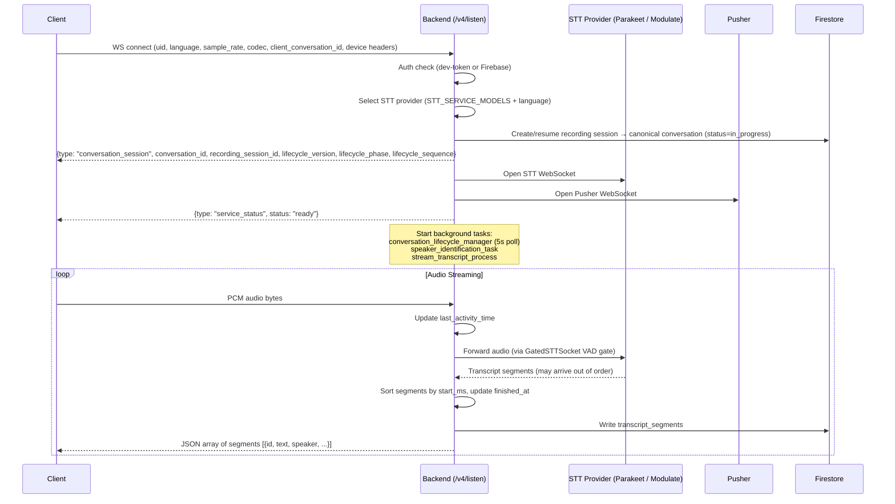
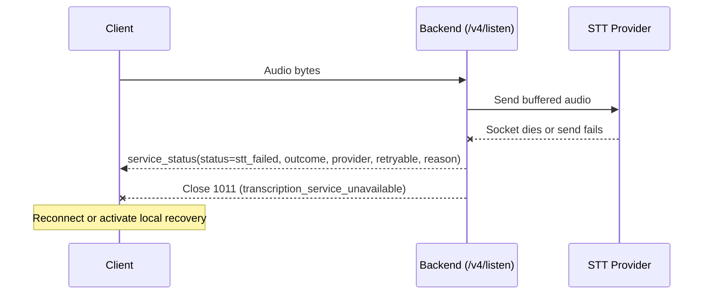
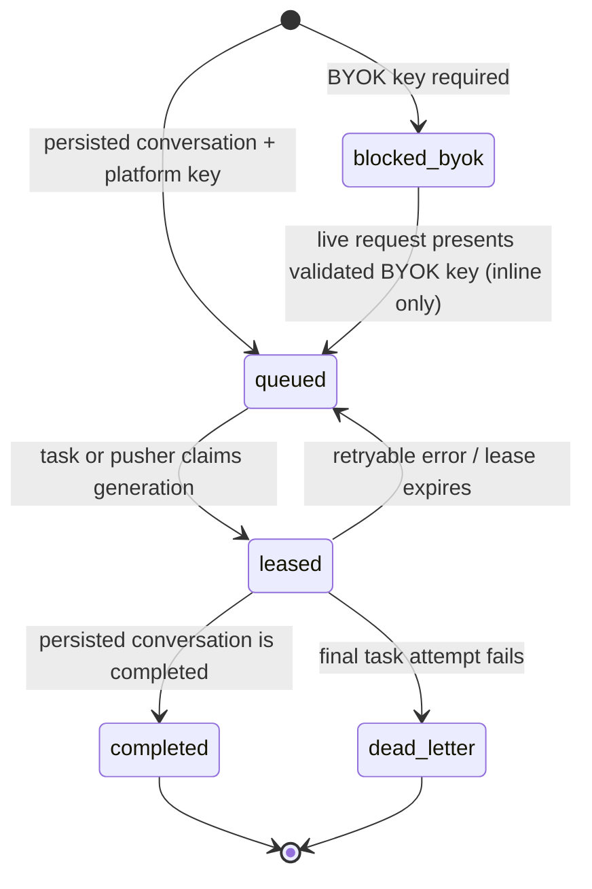
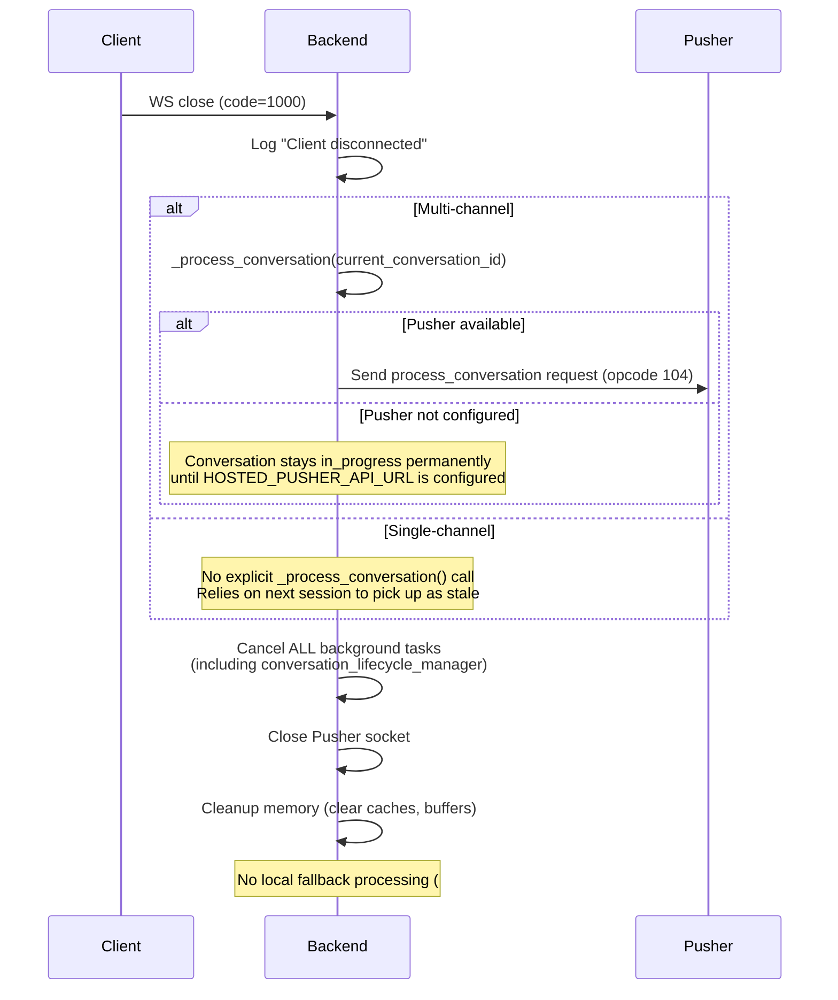
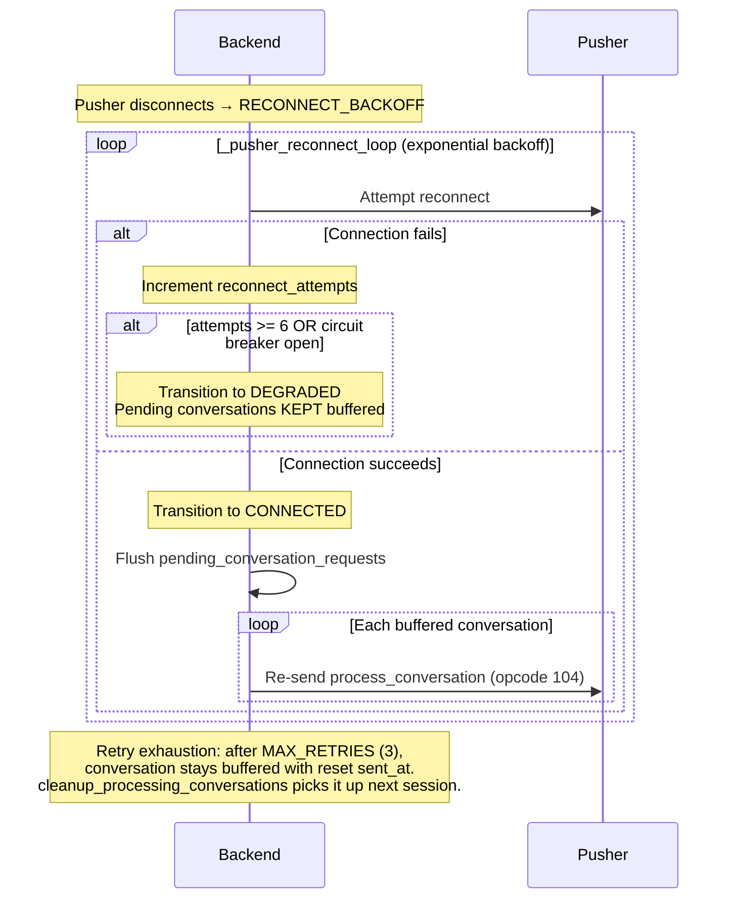
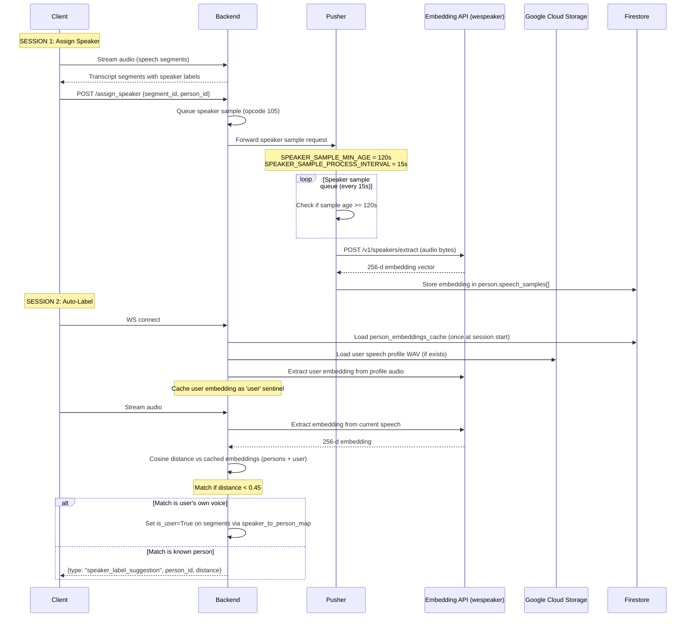
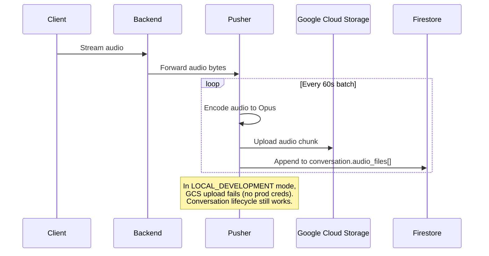

# Listen + Pusher Pipeline — Sequence Diagrams

> Last updated: 2026-07-15 (durable recording-session bindings, fenced late-content recovery, and ordered lifecycle envelopes)
>
> These diagrams document the real behavior observed during E2E testing with
> live services (backend, pusher, STT providers, embedding API). Update when the
> pipeline changes.

## 1. Connection + Streaming + Transcription

The STT provider is selected at session start via `STT_SERVICE_MODELS` env var
(e.g., `parakeet,modulate-velma-2`). The first provider supporting the
requested language wins. Listen startup loads transcription preferences once and
reuses the embedded user language for translation targeting, avoiding a second
user-preference read on WebSocket startup. All providers implement the
`STTSocket` ABC and are wrapped by the universal `GatedSTTSocket` VAD gate.

Segments buffered in `realtime_segment_buffers` are sorted by `start` time
before processing — this corrects non-deterministic WebSocket arrival order
from providers like Modulate whose internal parallelism can deliver shorter
utterances before longer ones.

Every `/v4/listen` stream receives a durable, user-scoped `recording_session`
resource before it creates or resumes a conversation. A client-generated
`client_conversation_id` remains that resource's ID when present; legacy
clients receive a server-generated UUID. The resource atomically binds the
recording to exactly one conversation, so reconnects return the original
canonical mapping rather than falling back to a user-global Redis pointer.

The backend emits a `conversation_session` event carrying that recording
identity:

```json
{
  "type": "conversation_session",
  "conversation_id": "<uuid>",
  "recording_session_id": "<client_conversation_id>",
  "status": "in_progress",
  "lifecycle_version": 1,
  "lifecycle_phase": "in_progress",
  "lifecycle_sequence": 0
}
```

`conversation_session`, `memory_processing_started`, and `memory_created`
carry the same versioned envelope. Clients must accept an envelope only when
the recording and conversation IDs match their local session and the sequence
is higher than the last accepted sequence. The phase is part of the contract:
`in_progress`, then `processing`, then a terminal `completed`/`failed`/
`discarded`. Older events without the envelope retain the legacy identity and
timestamp compatibility path only.

`RECORDING_SESSION_MODE=dual_write` is the safe default: it persists and
compares the durable binding while preserving the legacy proposed route on a
mismatch. `shadow` has the same routing behavior for validation-only rollout;
`enforce` promotes the canonical durable binding and rejects durable-store
failures. Mapping conflicts, stale-event discards, and legacy fallback paths
use shared fallback telemetry for the cutover gate.
The resource contains only IDs, phase, sequence, schema version, and
timestamps; it never stores transcript content, credentials, or raw WebSocket
payloads.

The same recording ID is always a retry of its original generation: after a
terminal result the backend returns that canonical binding and its terminal
envelope instead of rebinding it. A silence or status rollover on a live
WebSocket receives a fresh server-generated recording ID and can therefore
bind a new conversation without mutating the terminal generation. If an
empty-generation cleanup wins the Firestore transaction race against buffered
STT segments or photos, the late write is fenced rather than recreating the
terminal parent; the listen handler opens one fresh generation and replays that
buffer once. The first-segment `started_at` value commits in that same content
transaction, so this recovery cannot leave a timestamp-only write behind.

## Capture-device provenance

Every capture client with WebSocket-upgrade header support sends
`X-App-Platform` and `X-Device-Id-Hash` on `/v4/listen`. The backend records
that provenance on the conversation stub, allowing extracted canonical
memories to participate in the **This device** filter. Browsers cannot attach
custom upgrade headers, so `/v4/web/listen` carries the hash in its required
first auth message; the backend fixes its platform to `web` before creating
the conversation. Missing provenance remains unknown rather than being
assigned to a different device.



### Terminal STT provider failure

Provider initialization failure, a latched dead provider socket, or an audio
send failure is terminal for the current client WebSocket. The backend first
awaits a bounded `service_status` event (`status=stt_failed`, semantic
`outcome`, provider, retryability, and one of the documented reason codes), then
closes the client with code 1011 and reason
`transcription_service_unavailable`.

The send boundary clears its local audio buffer only after the provider socket
accepts the chunk. On failure, the bytes remain in that buffer until normal
session teardown frees it; they are never cleared while the client connection
stays open and appears healthy. The client close is the recovery signal for
mobile and desktop reconnect/fallback logic. The backend deliberately does not
replace a provider socket in-session because maintaining transcript timestamp
continuity across that handoff requires a separate state model.



## 2. Conversation Lifecycle (Silence Timeout Path)

This is the normal path when the client stays connected but stops speaking.

**Key design rule (#6061):** Listen NEVER processes conversations locally.
All conversation processing routes through pusher or the dedicated durable
finalizer worker. Before either handoff, listen persists a Firestore
finalization job. The legacy live pusher path claims that same job; when the
durable dispatch flag is enabled, Cloud Tasks wakes the worker using only the
opaque job id and generation. `pending_conversation_requests` remains a
low-latency reconnect aid, not the durable source of truth.

Before a job can become `completed`, the finalizer atomically claims a durable
fanout boundary with a persistent idempotency key. It passes that key to the
integration endpoint and records `fanout_status=completed` only after the
call returns. Lease recovery retries the same key, so a crash after an
integration call cannot silently drop fanout or create an unkeyed duplicate.

```mermaid
sequenceDiagram
    participant Client
    participant Backend as Backend
    participant Pusher
    participant OpenAI as OpenAI (LLM)
    participant Firestore

    Note over Client: Client stops sending audio<br/>(silence keepalive OK — doesn't update finished_at)

    loop conversation_lifecycle_manager (every 5s)
        Backend->>Firestore: Check finished_at on current conversation
        Note over Backend: If now() - finished_at >= conversation_timeout (120s)
    end

    Backend->>Backend: _process_conversation(conversation_id)
    alt Finalizer configured
        Backend->>Firestore: Transaction: finalization job queued + status=processing
        alt LISTEN_FINALIZATION_DISPATCH_MODE=inline
            Backend->>Pusher: Send process_conversation request + job lease (opcode 104)
        else LISTEN_FINALIZATION_DISPATCH_MODE=cloud_tasks
            Backend->>Cloud Tasks: Named task {job_id, dispatch_generation}
            Cloud Tasks->>Finalizer: OIDC-protected run handler
        end
        Backend->>Firestore: Create new stub conversation
    else Pusher not configured (HOSTED_PUSHER_API_URL unset)
        Note over Backend: Skip processing — conversation stays in_progress permanently.<br/>Pusher is required for conversation processing in production.
    end

    alt Pusher connected
        Pusher->>OpenAI: Generate title, overview, category, emoji, action_items
        OpenAI-->>Pusher: Structured data
        Pusher->>Firestore: Write structured data + set status=completed
        Pusher->>OpenAI: Extract memories
        Pusher->>Firestore: Save embedding vector
        Pusher-->>Backend: Opcode 201 (conversation processed callback)
        Backend-->>Client: {type: "memory_processing_started", recording_session_id, conversation_id, lifecycle_version, lifecycle_phase, lifecycle_sequence, memory: {...}}
        Backend-->>Client: {type: "memory_created", recording_session_id, conversation_id, lifecycle_version, lifecycle_phase, lifecycle_sequence, memory: {...}}
    else Pusher disconnected (RECONNECT_BACKOFF / DEGRADED)
        Note over Backend: Live request buffered in pending_conversation_requests;<br/>durable job remains recoverable by the reconciler
    end
```

### 2.1 Durable finalization ownership

`conversation_finalization_jobs/{job_id}` is the finalization ledger. It is
created atomically with the `in_progress → processing` transition and is keyed
by `(uid, conversation_id, finalization_revision)`. A task is a named,
at-least-once wake-up only; duplicate delivery, reconnect replay, and manual
reconciliation must first acquire the Firestore lease.



The job and task payload never contain transcript text, raw BYOK keys, headers,
or raw exception text. `blocked_byok` is an explicit recovery state: durable
offline BYOK is not supported without a separately reviewed credential broker;
the worker must never silently use Omi keys.

See [Listen finalization jobs](./listen_finalization_jobs) for configuration,
replay, metrics, and the operational runbook.

## 3. Disconnect Path

What happens when the WS connection closes.



**Teardown invariant:** flush any remaining multi-channel mix via `audio_bytes_send` **before** `pusher_close()` so `ListenPusherSession._flush()` can deliver tail audio to pusher.

## 3.1 Pusher Reconnect & Pending Flush

When pusher reconnects after a disconnection, all buffered conversations are replayed.



## 4. Speaker ID Lifecycle (2-Session Flow)

Speaker identification requires two sessions: one to store the embedding, one
to match against it. The user's own voice is also identified via their speech
profile embedding (loaded at session start alongside person embeddings).



## 5. Private Cloud Sync (Audio Upload)

When `private_cloud_sync_enabled` is set for the user.



### Conversation playback artifact

At conversation completion (`process_conversation`, and `_finalize_sync_audio_files` for offline sync), an `audio-merge` Cloud Task (schema_version 2, name `amc-{conversation_id}-{fingerprint}`) builds **one dense per-conversation MP3** — `playback/{uid}/{conversation_id}/conversation.mp3` — containing only captured audio: intra-part gaps (<90s) stay silence-filled, inter-part gaps (>90s) are collapsed. The handler stamps the conversation doc with `conversation_audio`: a spans manifest (`{file_id, wall_offset, artifact_offset, len}` per part, wall offsets relative to `started_at` — the `TranscriptSegment.start` basis), both durations (`duration` = wall clock, `captured_duration` = audio only), and the `audio_files_fingerprint` it was built from.

Staleness is fingerprint-driven: when late chunks change `audio_files` (pusher batch flush after completion, offline sync, conversation merge), the stamped fingerprint no longer matches and both the call sites and the `/v1/sync/audio/{id}/urls` poll re-enqueue a rebuild under a new task name (defeating the named-task tombstone). `/urls` returns the artifact as a top-level `conversation_audio` object alongside the per-part `audio_files` list, which remains for older app versions.

## 6. Event Wire Protocol

### Server → Client (JSON over WS text frames)

| Type | Format | Example |
|------|--------|---------|
| Transcripts | JSON array | `[{id, text, speaker, speaker_id, is_user, start, end}, ...]` |
| Events | JSON object | `{type: "...", ...}` |
| Keepalive | Plain text | `"ping"` (not JSON — filter before parsing) |

### Event Types

| Event | Fields | When |
|-------|--------|------|
| `service_status` | `{type, status: "ready"}` | After WS connect, services initialized |
| `conversation_session` | `{type, conversation_id, recording_session_id?, status}` | Exact recording-to-conversation binding; identified clients require IDs to match |
| `memory_processing_started` | `{type, recording_session_id?, memory: {id, ...}}` | Conversation sent to pusher for LLM; only emitted for the listen session's current conversation |
| `memory_created` | `{type, recording_session_id?, memory: {id, structured: {title, overview, ...}}}` | LLM processing complete; only emitted for the listen session's current conversation |
| `speaker_label_suggestion` | `{type, person_id, person_name, distance, segments}` | Speaker matched via embedding |

### Client → Server

| Type | Format | Notes |
|------|--------|-------|
| Audio | Binary frames | PCM16LE bytes |
| Silence keepalive | `b'\x00' * 320` | Resets `last_activity_time` but NOT `finished_at` |

## 7. Timing Constants

| Constant | Value | Location | Purpose |
|----------|-------|----------|---------|
| `conversation_timeout` | 120s (min) | `routers/listen/runtime.py` | Silence before lifecycle triggers |
| `last_activity_time` timeout | 90s | `routers/listen/runtime.py` | WS inactivity disconnect |
| `SPEAKER_SAMPLE_MIN_AGE` | 120s | pusher.py | Wait before extracting embedding (skipped on shutdown) |
| `SPEAKER_SAMPLE_PROCESS_INTERVAL` | 15s | pusher.py | Queue poll interval |
| `WS_RECEIVE_TIMEOUT` | 300s | `pusher.py`, `routers/listen/contracts.py` | No-data timeout on WebSocket receive; detects dead connections |
| `BG_DRAIN_TIMEOUT` | 30s | `pusher.py`, `routers/listen/contracts.py` | Grace period for background tasks to drain after disconnect before force-cancel |
| `lifecycle_manager` poll | 5s | `routers/listen/conversations.py` | Check `finished_at` interval |
| Pusher audio batch | 60s | pusher | GCS upload batch size |
| Speaker match threshold | 0.45 | `routers/listen/speakers.py` | Cosine distance cutoff |
| `PENDING_REQUEST_TIMEOUT` | 120s | `routers/listen/conversations.py` | Timeout before retrying a pending request |
| `MAX_RETRIES_PER_REQUEST` | 3 | `routers/listen/conversations.py` | Max retries before keeping buffered |
| `PUSHER_MAX_RECONNECT_ATTEMPTS` | 6 | `utils/listen_pusher_session.py` | Reconnect attempts before DEGRADED |
| `MAX_PENDING_REQUESTS` | 100 | `routers/listen/contracts.py` | Max buffered conversations per session |

## 8. WebSocket Task Supervision

`routers/listen/runtime.py` and `pusher.py` use an `asyncio.wait(FIRST_COMPLETED)` supervisor loop instead of `asyncio.gather()` to manage background tasks. This prevents ghost connections where a hung background task blocks cleanup forever.

**Supervisor exits on:**
- Client disconnect (receive task completes)
- Background task crash (exception)
- Lifetime task normal completion (e.g. heartbeat inactivity timeout)

**Supervisor re-waits on:**
- Finite task normal completion (e.g. `process_pending_conversations`, `speaker_identification_task`)

After supervisor exit, remaining tasks drain with `BG_DRAIN_TIMEOUT` (30s) before force-cancel. The connection gauge (`inc`/`dec`) is always paired in `try`/`finally`.
