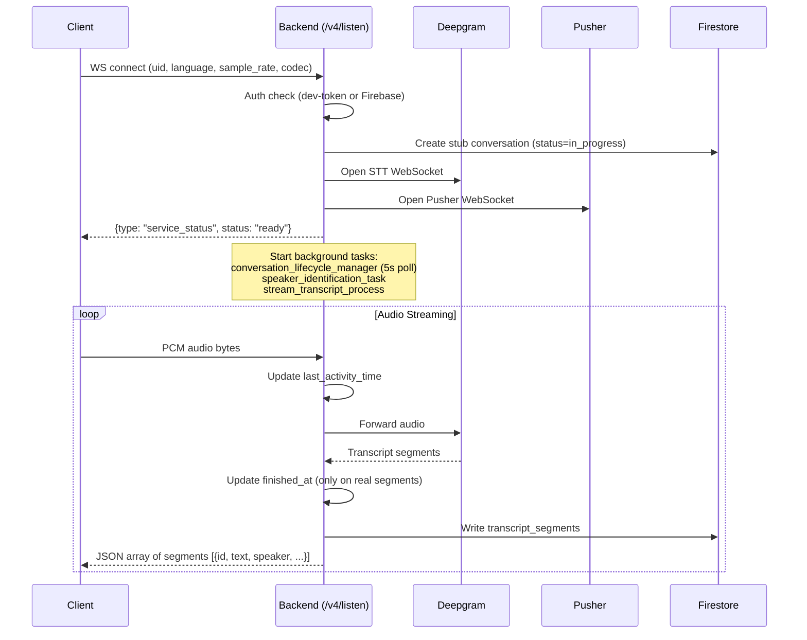
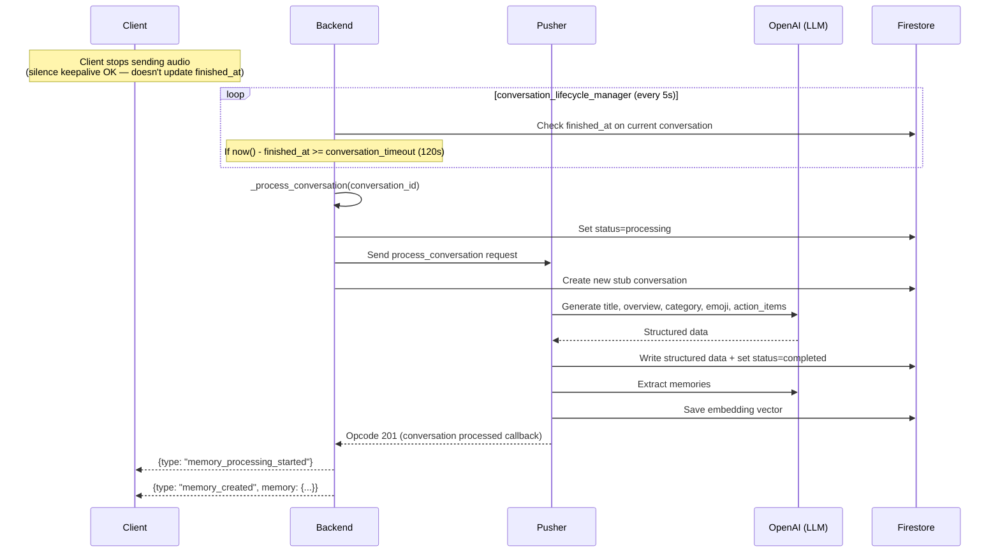
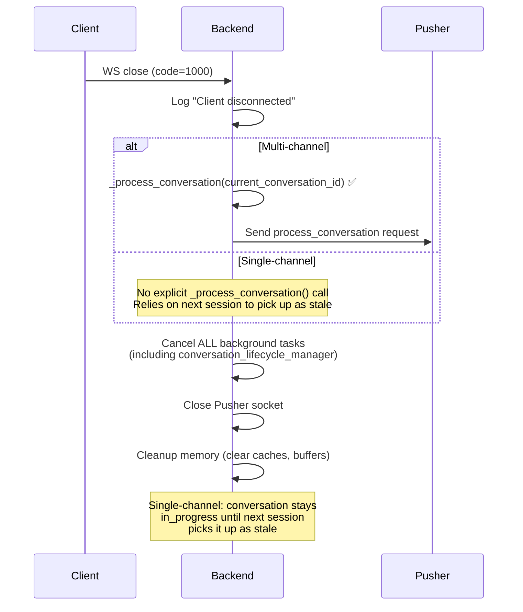
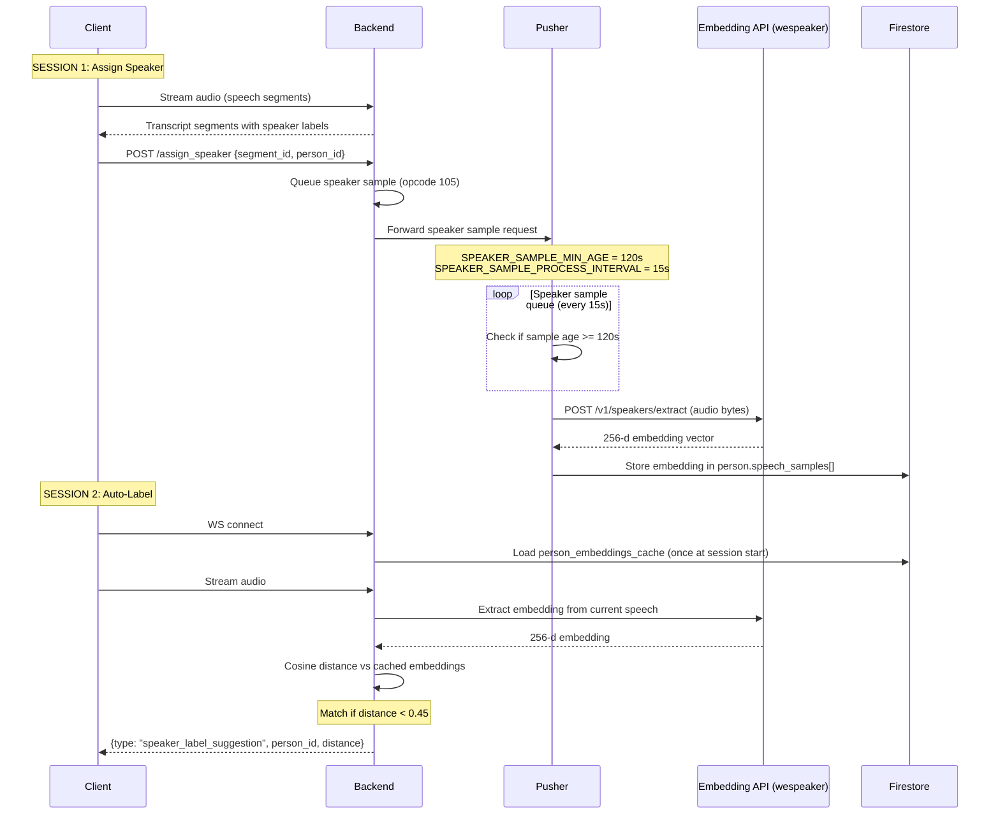
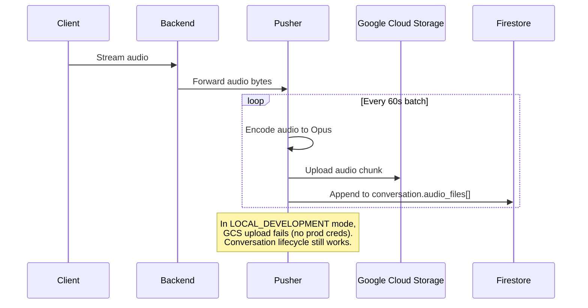

# Listen + Pusher Pipeline — Sequence Diagrams

> Last updated: 2026-03-16 (PR #5624 E2E testing)
>
> These diagrams document the real behavior observed during E2E testing with
> live services (backend, pusher, Deepgram, embedding API). Update when the
> pipeline changes.

## 1. Connection + Streaming + Transcription

## 2. Conversation Lifecycle (Silence Timeout Path)

This is the normal path when the client stays connected but stops speaking.

## 3. Disconnect Path

What happens when the WS connection closes.

## 4. Speaker ID Lifecycle (2-Session Flow)

Speaker identification requires two sessions: one to store the embedding, one
to match against it.

## 5. Private Cloud Sync (Audio Upload)

When `private_cloud_sync_enabled` is set for the user.

## 6. Event Wire Protocol

### Server → Client (JSON over WS text frames)

| Type | Format | Example |
|------|--------|---------|
| Transcripts | JSON array | `[{id, text, speaker, speaker_id, is_user, start, end}, ...]` |
| Events | JSON object | `{type: "...", ...}` |
| Keepalive | Plain text | `"ping"` (not JSON — filter before parsing) |

### Event Types

| Event | Fields | When |
|-------|--------|------|
| `service_status` | `{type, status: "ready"}` | After WS connect, services initialized |
| `memory_processing_started` | `{type}` | Conversation sent to pusher for LLM |
| `memory_created` | `{type, memory: {id, structured: {title, overview, ...}}}` | LLM processing complete |
| `speaker_label_suggestion` | `{type, person_id, person_name, distance, segments}` | Speaker matched via embedding |

### Client → Server

| Type | Format | Notes |
|------|--------|-------|
| Audio | Binary frames | PCM16LE bytes |
| Silence keepalive | `b'\x00' * 320` | Resets `last_activity_time` but NOT `finished_at` |

## 7. Timing Constants

| Constant | Value | Location | Purpose |
|----------|-------|----------|---------|
| `conversation_timeout` | 120s (min) | transcribe.py | Silence before lifecycle triggers |
| `last_activity_time` timeout | 90s | transcribe.py | WS inactivity disconnect |
| `SPEAKER_SAMPLE_MIN_AGE` | 120s | pusher.py:39 | Wait before extracting embedding |
| `SPEAKER_SAMPLE_PROCESS_INTERVAL` | 15s | pusher.py:40 | Queue poll interval |
| `lifecycle_manager` poll | 5s | transcribe.py:1683 | Check `finished_at` interval |
| Pusher audio batch | 60s | pusher | GCS upload batch size |
| Speaker match threshold | 0.45 | transcribe.py | Cosine distance cutoff |

