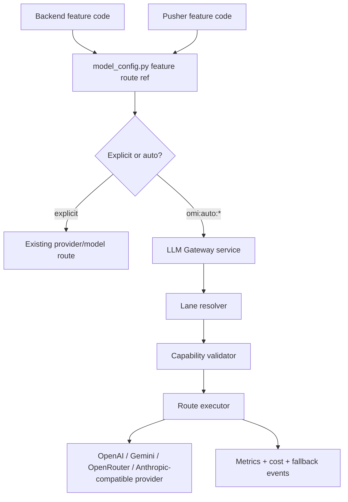

# LLM Gateway Architecture

> Status: implemented architecture in progress.
>
> Implemented so far: separate FastAPI service skeleton, unauthenticated `/health`, repo-local config schemas/loader, checked-in `omi:auto:chat-structured` lane artifacts, internal service-auth helpers, and request-level credential context helpers.

## Decision

Build a separate **LLM Gateway** service in this repo. Backend, pusher, and later desktop-facing relay surfaces call it through an OpenAI-compatible HTTP surface instead of choosing providers directly for auto-routed work.

The gateway is intentionally narrow:

- Accept explicit model IDs exactly as before, or `omi:auto:*` lane IDs.
- Resolve an auto lane to a versioned route artifact.
- Validate request capabilities before execution.
- Execute the primary provider/model and compatible fallbacks.
- Return a normal provider-compatible response while recording route/fallback/cost metrics.

Do not build a user-facing router product. Do not add sliders, per-user routing preferences, Firestore routing prefs, desktop route caches, or a public `/pick` endpoint for product clients.

The existing realtime `backend/routers/auto_model.py` and desktop `AutoModelSelector` path are legacy context, not the template for this service. New gateway work must not add a public picker endpoint, must not fetch benchmark data in the request path, and must not expand desktop-side routing caches.

## First Pilot

The first lane is:

```text
omi:auto:chat-structured
```

This is **not** the primary user chat interface. The primary chat interface is `/v2/messages`, backed by the retrieval and agentic chat graph documented in [Chat System Architecture](/doc/developer/backend/chat_system).

`chat-structured` is for non-streaming structured extraction and classification work, such as memory extraction, chat extraction helpers, conversation post-processing structure, and schema-bound feature decisions. It is the safest first lane because it has clear success checks: JSON/schema validity, parser repair rate, extraction precision/recall, latency, and cost.

Primary user chat should follow later as a separate lane, likely:

```text
omi:auto:chat-fast-memory
omi:auto:chat-smart-tools
```

Those lanes involve streaming, tool use, retrieval quality, citations, and user-visible response behavior, so they need a stronger evaluation and rollback story.

## Why A Separate Service

The current backend keeps model/provider routing in `backend/utils/llm/model_config.py`, constructs clients in `backend/utils/llm/providers.py`, and exposes callers through `backend/utils/llm/clients.py`. That remains the source of truth for feature routing, but the new auto-route execution brain should be isolated as a service because:

- backend and pusher both run LLM workloads and should share one runtime policy;
- route artifacts need deploy-time validation and runtime fallback independent of product code;
- route observability needs one consistent set of labels;
- future surfaces can call the same OpenAI-compatible gateway without learning provider details;
- rollback must be config-only and not require desktop or mobile releases.

The service boundary should look like this:



## Language And Framework

Use **Python 3.11 + FastAPI + Pydantic + httpx**.

Reasons:

- The backend is already Python 3.11 and FastAPI.
- Existing auth, logging, sanitizer, executor, test, and deployment patterns are Python.
- Existing LLM provider knowledge lives in Python modules.
- Pydantic is already the natural schema/validation tool for FastAPI.
- `httpx.AsyncClient` matches backend async I/O rules and avoids blocking the event loop.

Do not make the gateway a Swift, Rust, Node, Go, or Kubernetes-controller project for v1. Those choices would increase operational and review burden without helping the first `chat-structured` lane.

Current service layout:

```text
backend/llm_gateway/
  main.py
  config/
    lanes.yaml
    route_artifacts.yaml
    feature_bundles.yaml
  routers/
    openai_compatible.py
    admin.py
  gateway/
    schemas.py
    config_loader.py
```

Planned modules:

```text
backend/llm_gateway/gateway/
  validator.py
  resolver.py
  executor.py
  providers.py
  metrics.py
  errors.py
```

Keep it a separate service entrypoint. Do not place a parallel `utils/auto_router` package under the main backend and do not wire a public task picker into `backend/main.py`.

Implemented internal service auth uses `Authorization: Bearer <LLM_GATEWAY_SERVICE_TOKEN>` plus `X-Omi-Service-Caller`. The default allowlist is low-cardinality service names `backend` and `pusher`; optional `X-Omi-User-Uid` and `X-Omi-Tenant-Id` populate request context only. `/health` remains unauthenticated. Future `/ready` and `/v1/chat/completions` routes should depend on these helpers instead of Firebase user auth.

Credential context is request-level metadata. It records credential mode, caller, and provider-key presence or approved key references without exposing raw key material in model dumps or repr output. BYOK credential failures such as missing key, invalid auth, quota, rate-limit, and unsupported provider are visible errors and are not fallback-eligible by default.

## Deployment Shape

For v1, build the gateway as a separate FastAPI app in the backend tree, using the same Python toolchain and dependency-lock workflow as the main backend.

Preferred rollout:

1. Add the app entrypoint and unit tests without any production traffic.
2. Add a local run command and Docker/Helm wiring for a separately named service.
3. Add `/ready` startup/readiness validation that fails closed unless active and LKG route config is valid.
4. Add service-to-service auth from backend and pusher to the gateway.
5. Route one structured feature through the gateway in shadow mode.
6. Promote only after the route artifact has an Omi eval report and rollback has been tested.

Do not start by embedding the gateway router into `backend/main.py`. That would make the gateway look separate in code while still sharing the main backend process, lifecycle, scaling, and blast radius.

## Major Library Choices

Use:

- **FastAPI** for HTTP endpoints and service lifecycle.
- **Pydantic** for lane, artifact, request, and validation schemas.
- **httpx.AsyncClient** for provider HTTP calls and gateway-to-provider calls.
- **OpenAI Python SDK only where it materially reduces request/stream parsing risk.** Prefer direct `httpx` for the gateway core so we preserve request/response metadata, timeouts, headers, and streaming behavior consistently.
- **Prometheus-compatible metrics** following existing backend observability conventions.
- **pytest** for deterministic resolver, validator, and executor tests.

Avoid for v1:

- LangChain inside the gateway execution path. Existing product code can keep using LangChain, but the gateway should speak provider HTTP contracts directly so it can preserve OpenAI-compatible request/response shapes and streaming semantics.
- Firestore/Redis as routing config stores. All lane and route artifacts live in repo files for v1.
- LiteLLM, Portkey, Envoy AI Gateway, or Kong as the gateway foundation.
- Runtime benchmark fetching, including Artificial Analysis calls, inside request handling.

## Open Source Position

We should learn from existing gateways, but not build on top of them for v1.

| Project | Use For | Do Not Use For |
|---|---|---|
| LiteLLM | Provider normalization ideas, error mapping, cost accounting examples, OpenAI-compatible proxy behavior | Canonical gateway foundation, admin dashboard, virtual keys, spend product, broad registry |
| Portkey Gateway | Config-driven fallback/routing patterns and composable fallback examples | User prefs, hosted-control-plane assumptions, its config DSL as our source of truth |
| Envoy AI Gateway | Edge gateway inspiration if Omi later standardizes on Envoy/Kubernetes AI traffic policy | Application route brain or first implementation substrate |
| Kong AI Gateway | Mature edge/platform concepts | Omi route artifacts or feature-to-lane semantics |

Current public docs describe LiteLLM as a self-hosted OpenAI-compatible gateway for 100+ providers with virtual keys, spend tracking, guardrails, load balancing, and dashboard features. Portkey similarly focuses on broad model routing, guardrails, fallbacks, and hosted/enterprise gateway workflows. Envoy AI Gateway provides OpenAI-compatible and Anthropic-compatible routing with provider fallback and load balancing, but assumes an Envoy/Kubernetes operating model.

Those are useful references, but they are broader than Omi's target. Omi needs a small internal service that preserves `model_config.py` as the feature route source and promotes route artifacts through Omi evals.

Reference links checked while writing this spec:

- [LiteLLM](https://github.com/BerriAI/litellm)
- [LiteLLM proxy docs](https://docs.litellm.ai/docs/)
- [Portkey Gateway](https://github.com/Portkey-AI/gateway)
- [Envoy AI Gateway supported endpoints](https://aigateway.envoyproxy.io/docs/0.5/capabilities/llm-integrations/supported-endpoints/)

## API Surface

MVP endpoint:

```http
POST /v1/chat/completions
```

Requests may use either an explicit model:

```json
{
  "model": "gpt-4.1-mini",
  "messages": []
}
```

For v1, explicit-model execution through the gateway is not a generic arbitrary-model proxy. Explicit routes either stay on the existing backend clients or are sent to the gateway as an internal provider-qualified route resolved by `model_config.py`. A bare model string is not enough because Omi's source of truth is `(provider, model)`, not model name alone.

Or an Omi lane:

```json
{
  "model": "omi:auto:chat-structured",
  "messages": [],
  "response_format": {
    "type": "json_schema",
    "json_schema": {
      "name": "memory_extraction",
      "strict": true,
      "schema": {}
    }
  },
  "metadata": {
    "omi_feature": "memories",
    "prompt_version": "memory_extraction.v17",
    "parser_version": "memory_schema.v9"
  }
}
```

Normal responses return the requested lane ID:

```json
{
  "model": "omi:auto:chat-structured",
  "choices": []
}
```

Internal debug may expose route IDs through admin-only headers:

```http
X-Omi-Lane-Id: omi:auto:chat-structured
X-Omi-Route-Id: route.chat_structured.2026_06_27.001
X-Omi-Fallback-Used: false
```

Provider/model details stay internal by default.

## Config Model

All config is checked into this repo for v1.

Implemented config files:

```text
backend/llm_gateway/config/lanes.yaml
backend/llm_gateway/config/route_artifacts.yaml
backend/llm_gateway/config/feature_bundles.yaml
```

`backend/llm_gateway/gateway/config_loader.py` loads those files by default, validates cross-file references, rejects duplicate route IDs, validates active/LKG compatibility, rejects dev/mock evidence in prod mode, and validates route artifact digests.

Lane config:

```yaml
lane_id: omi:auto:chat-structured
surface: openai.chat_completions
capabilities:
  text_input: true
  streaming: false
  structured_output: json_schema
  tools: false
objective:
  quality: 0.60
  latency: 0.20
  cost: 0.20
active_route: route.chat_structured.2026_06_27.001
last_known_good: route.chat_structured.2026_06_20.001
```

Route artifact:

```yaml
route_artifact_id: route.chat_structured.2026_06_27.001
lane_id: omi:auto:chat-structured
primary:
  provider: openai
  model: gpt-4.1-mini
fallbacks:
  - provider: openai
    model: gpt-5.4-mini
timeouts:
  request_ms: 8000
retry:
  max_attempts: 1
capabilities:
  structured_output: json_schema
  streaming: false
evidence:
  benchmark_snapshot: bench.aa.2026_06_27
  eval_report: eval.memory_extraction.2026_06_27
rollout:
  stage: shadow
credential_policy:
  mode: omi_paid
  allow_byok_to_omi_paid_fallback: false
fallback_policy:
  fallback_on:
    - timeout_before_output
    - provider_429_omi_paid
    - provider_5xx_omi_paid
  never_fallback_on:
    - byok_auth
    - byok_quota
    - byok_rate_limit
    - missing_byok_key
    - capability_mismatch
    - invalid_config
artifact_digest: sha256:<computed-by-validation>
```

Feature bundle:

```yaml
feature: memories
lane_id: omi:auto:chat-structured
prompt_version: memory_extraction.v17
parser_version: memory_schema.v9
eval_suite: memory_precision_recall.v5
promotion_gates:
  schema_valid_rate: ">= 99.5%"
  precision_regression: "none"
  recall_delta: ">= 0"
  p95_latency_ms: "<= LKG + 10%"
  cost_per_success: "<= LKG + 15%"
```

Route artifacts are immutable. Promotion creates a new artifact and updates the lane pointer. Rollback updates the lane pointer back to LKG.

Validation rejects duplicate `route_artifact_id` values and exposes a content digest for every artifact. Checked-in artifacts should include `artifact_digest`; if the artifact content changes without changing the digest, validation fails. Once an artifact ID has shipped, changing its content is treated as invalid operational behavior; create a new artifact ID instead.

## Integration With Existing Backend Code

`backend/utils/llm/model_config.py` remains the feature routing source. Add typed route refs behind it:

```python
@dataclass(frozen=True)
class ExplicitRouteRef:
    model: str
    provider: str

@dataclass(frozen=True)
class AutoLaneRouteRef:
    lane_id: str
```

Existing APIs must keep working:

- `get_model(feature)`
- `get_provider(feature)`
- `get_llm(feature)`
- `get_route_options(feature, model, provider)`

For auto lanes, product code should not call `get_provider()` expecting a concrete provider. The initial migration should keep existing tuple behavior for all current features, then add explicit new helpers:

```python
get_route_ref(feature) -> ExplicitRouteRef | AutoLaneRouteRef
is_auto_lane_id(model: str) -> bool
```

Backend callers that use `get_llm(feature)` can be migrated feature by feature. For the first pilot, route only one structured feature through the gateway and keep all other features explicit.

## BYOK Policy

BYOK failures fail visibly by default.

If a request is using a user-provided provider key and that key is invalid, rate-limited, out of quota, or rejected by the provider, the gateway returns a clear typed error. It must not silently fall back to an Omi-paid provider route unless a route artifact explicitly allows that behavior and the product owner has approved it.

The gateway must not reuse current backend BYOK fallback behavior where unsupported BYOK chat clients or failed embedding calls can fall back to Omi-paid credentials. That behavior may remain in legacy callers until migrated, but the gateway contract is stricter.

Gateway requests carry a `CredentialContext` owned by service-authenticated backend/pusher callers. Desktop and mobile clients never call the gateway directly and never send raw BYOK credentials directly to it. The initial implementation must choose one of these internal patterns before live traffic:

- backend forwards a short-lived BYOK credential envelope to the gateway over service-authenticated transport;
- gateway receives a key reference and resolves it through an approved internal secret path.

The route artifact credential policy controls whether a route is `omi_paid` or `byok`, whether BYOK-to-Omi-paid fallback is allowed, and which failure classes are fallback eligible.

Default behavior:

| Failure | Behavior |
|---|---|
| BYOK invalid key | visible auth error |
| BYOK quota/rate limit | visible provider/key error |
| BYOK unsupported provider for route | capability/config error |
| Omi-paid primary timeout before output | retry/fallback if route policy allows |
| Omi-paid primary schema invalid | repair attempt or compatible fallback if route policy allows |

## Service Auth

`/health` may be unauthenticated.

`/ready` and `/v1/chat/completions` require internal service authentication. The first allowed callers are backend and pusher. Requests must propagate enough caller, tenant, user, BYOK, and usage context for accounting and policy enforcement, but must not expose provider keys in logs or metrics.

Desktop, mobile, and third-party product clients must not call the gateway directly in v1.

## Capability Validation

Before execution, validate:

- surface: chat completions for MVP;
- streaming: false for `chat-structured` MVP;
- tools: false for `chat-structured` MVP;
- structured output mode: JSON schema or parser-compatible JSON;
- input modalities: text only for MVP;
- provider/model supports requested response format;
- route artifact lane matches requested lane;
- active and LKG artifacts are valid at startup;
- LKG matches requested lane, surface, capabilities, structured-output mode, and credential mode.

Runtime fail-open means active route failure may use LKG only for failure classes allowed by the route artifact. Deploy/startup fail-closed means invalid LKG or invalid config prevents the service from starting. Do not use LKG for BYOK credential failures, capability mismatches, missing BYOK keys, or invalid config.

## Observability

Record metrics with these dimensions:

```text
lane_id
route_artifact_id
requested_model
surface
feature_id
prompt_version
parser_version
provider
model
fallback_used
fallback_reason
error_class
streaming
byok
cohort
```

Do not log raw prompts, transcripts, screenshots, memory contents, provider response bodies, or BYOK keys. Use existing sanitizer patterns for error bodies and user text.

## Implementation Sequence

1. Add this doc and an implementation checklist. Done.
2. Add `llm_gateway` service skeleton with health endpoint. Done.
3. Add Pydantic schemas for lane config, route artifacts, feature bundles, capability declarations, retries, timeouts, rollout, evidence, credential policy, fallback policy, and LKG. Done.
4. Add service-auth and credential-policy contracts.
5. Add resolver tests with no network calls.
6. Add capability validator tests for `chat-structured`.
7. Add provider executor with fake providers and fallback/error normalization tests.
8. Add `/v1/chat/completions` non-streaming support behind service auth.
9. Add `/ready`, local run command, service URL configuration, and separate-process deployment wiring before shadow traffic.
10. Add gateway client helper in main backend so selected `model_config.py` features can call the gateway.
11. Route one low-risk structured feature to `omi:auto:chat-structured` in shadow mode.
12. Add Omi eval reports and promote only after schema validity, extraction quality, latency, and cost gates pass.

## Shadow Safety

Shadow mode must be explicitly bounded before any live user content goes through the gateway:

- feature-owner/privacy approval for the feature being shadowed;
- sampling limits and a kill switch;
- cost cap;
- no BYOK shadow by default;
- no provider expansion beyond the current production provider class without approval;
- no persistence of raw prompts or raw responses;
- metrics-only comparison unless an approved eval store exists.

Prefer offline replay/eval before live shadow for memory- or transcript-heavy workloads.

## Explicit Non-Goals

- No desktop Settings UI.
- No quality/latency/cost sliders.
- No per-user routing preferences.
- No Firestore or Redis routing prefs.
- No desktop-side model/route cache.
- No public `/v1/auto-router/pick`.
- No new public `/v1/auto/model-pick`.
- No request-path benchmark fetching.
- No production route from mock benchmark data.
- No benchmark-only promotion.
- No wholesale LiteLLM, Portkey, Envoy AI Gateway, or Kong adoption.

## Maintainer Checklist

Before broad production traffic:

- explicit model routing remains backward compatible;
- `model_config.py` still owns feature-to-route mapping;
- gateway config validation fails closed on invalid prod config;
- active route has valid LKG;
- route artifacts are immutable;
- BYOK failure does not silently fall back to Omi-paid traffic;
- `/v1/chat/completions` requires internal service auth;
- LKG/fallback is limited to artifact-approved failure classes;
- mock benchmarks cannot load in prod;
- Omi eval report exists;
- shadow/canary completed;
- rollback is config-only;
- observability includes route, fallback, latency, errors, and cost.
