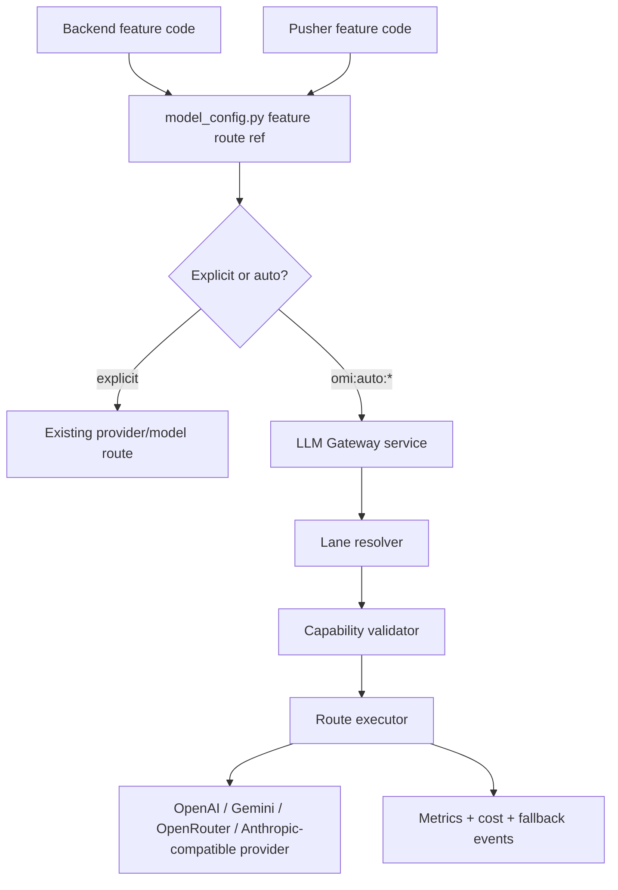

# LLM Gateway Architecture

## Decision

Build a separate **LLM Gateway** service in this repo. Backend, pusher, and later desktop-facing relay surfaces call it through an OpenAI-compatible HTTP surface instead of choosing providers directly for auto-routed work.

The gateway is intentionally narrow:

- Accept explicit model IDs exactly as before, or `omi:auto:*` lane IDs.
- Resolve an auto lane to a versioned route artifact.
- Validate request capabilities before execution.
- Execute the primary provider/model and compatible fallbacks.
- Return a normal provider-compatible response while recording route/fallback/cost metrics.

Do not build a user-facing router product. Do not add sliders, per-user routing preferences, Firestore routing prefs, desktop route caches, or a public `/pick` endpoint for product clients.

The existing realtime `backend/routers/auto_model.py` and desktop `AutoModelSelector` path are legacy context, not the template for this service. New gateway work must not add a public picker endpoint, must not fetch benchmark data in the request path, and must not expand desktop-side routing caches.

## Chat-Structured Lane

The first lane is:

```text
omi:auto:chat-structured
```

For v1, this is the only supported OpenAI-compatible chat-completions interface. It is structured and non-streaming. The broader streaming product chat path remains `/v2/messages`, backed by the retrieval and agentic chat graph documented in [Chat System Architecture](/doc/developer/backend/chat_system).

`chat-structured` is for non-streaming structured extraction and classification work, such as memory extraction, chat extraction helpers, conversation post-processing structure, and schema-bound feature decisions. It is the safest first lane because it has clear success checks: JSON/schema validity, parser repair rate, extraction precision/recall, latency, and cost.

Backend structured callers can route non-BYOK requests through the gateway and fall back to their existing provider path if the gateway misses or fails. This keeps gateway adoption isolated from user-visible behavior changes unless a feature explicitly promotes the gateway result to authoritative serving.

Non-BYOK requests call `/v1/chat/completions` with `model: "omi:auto:chat-structured"`, text-only messages, and a JSON schema response format. The caller sends low-cardinality feature metadata, not raw user text in logs or telemetry. Service auth uses the existing bearer-token contract; backend callers read `OMI_LLM_GATEWAY_SERVICE_TOKEN` first and then `LLM_GATEWAY_SERVICE_TOKEN` for local compatibility.

BYOK requests skip gateway routing until BYOK forwarding is implemented for the lane. The application-level fallback is the safety mechanism: any gateway HTTP error, timeout, unsupported capability response, malformed JSON, missing or invalid content, Pydantic validation failure, or unexpected exception falls back to the existing legacy provider path and returns that result. Caller fallback does not depend on gateway route/LKG fallback; if the gateway internally returns an error after trying its configured policy, the caller still treats that as a miss and uses the existing path.

The backend exposes the Prometheus counter `llm_gateway_chat_extraction_requests_total{feature,outcome,reason}` for structured gateway callers. Outcomes are bounded classes such as `success`, `fallback`, and `skipped`; reasons are bounded classes such as `ok`, `timeout`, `request_error`, `http_503`, `invalid_json`, `schema_validation`, `unexpected_error`, and `byok`.

## Deployment

Development gateway deploys continue automatically from `main`. Production deployment is manual-only through the dedicated workflow and requires the independent production service-token secret before Helm can run.

Gateway deploys must go through `backend/scripts/deploy-llm-gateway.sh`. The helper validates backend/gateway env wiring, deploys backend secrets through `backend/scripts/deploy-backend-secrets.sh`, adopts known gateway ingress resources if they predate Helm ownership, and then runs the Helm upgrade. Do not copy raw `helm upgrade` commands into workflows; that bypasses the required secret/env preflight.

Primary user chat should follow later as a separate lane, likely:

```text
omi:auto:chat-fast-memory
omi:auto:chat-smart-tools
```

Those lanes involve streaming, tool use, retrieval quality, citations, and user-visible response behavior, so they need a stronger evaluation and rollback story.

## Why A Separate Service

The current backend keeps model/provider routing in `backend/utils/llm/model_config.py`, constructs clients in `backend/utils/llm/providers.py`, and exposes callers through `backend/utils/llm/clients.py`. That remains the source of truth for feature routing, but the new auto-route execution brain should be isolated as a service because:

- backend and pusher both run LLM workloads and should share one runtime policy;
- route artifacts need deploy-time validation and runtime fallback independent of product code;
- route observability needs one consistent set of labels;
- future surfaces can call the same OpenAI-compatible gateway without learning provider details;
- rollback must be config-only and not require desktop or mobile releases.

The service boundary should look like this:



## Language And Framework

Use **Python 3.11 + FastAPI + Pydantic + httpx**.

Reasons:

- The backend is already Python 3.11 and FastAPI.
- Existing auth, logging, sanitizer, executor, test, and deployment patterns are Python.
- Existing LLM provider knowledge lives in Python modules.
- Pydantic is already the natural schema/validation tool for FastAPI.
- `httpx.AsyncClient` matches backend async I/O rules and avoids blocking the event loop.

Do not make the gateway a Swift, Rust, Node, Go, or Kubernetes-controller project for v1. Those choices would increase operational and review burden without helping the first `chat-structured` lane.

Current service layout:

```text
backend/scripts/dev-serve-llm-gateway.sh
backend/scripts/validate-llm-gateway-env.py
backend/scripts/smoke-llm-gateway.py
backend/llm_gateway/
  main.py
  config/
    lanes.yaml
    route_artifacts.yaml
    feature_bundles.yaml
  routers/
    health.py
    openai_compatible.py
    dependencies.py
  gateway/
    schemas.py
    config_loader.py
    auth.py
    credentials.py
    errors.py
    validator.py
    resolver.py
    executor.py
    metrics.py
```

Keep it a separate service entrypoint. Do not place a parallel `utils/auto_router` package under the main backend and do not wire a public task picker into `backend/main.py`.

Implemented internal service auth uses `Authorization: Bearer <LLM_GATEWAY_SERVICE_TOKEN>` plus `X-Omi-Service-Caller`. The default allowlist is low-cardinality service names `backend` and `pusher`; optional `X-Omi-User-Uid` and `X-Omi-Tenant-Id` populate request context only. `/health` remains unauthenticated. `/ready` and `/v1/chat/completions` depend on these helpers instead of Firebase user auth.

Credential context is request-level metadata. It records credential mode, caller, and provider-key presence or approved key references without exposing raw key material in model dumps or repr output. BYOK credential failures such as missing key, invalid auth, quota, rate-limit, and unsupported provider are visible errors and are not fallback-eligible by default.

## Deployment Shape

For v1, build the gateway as a separate FastAPI app in the backend tree, using the same Python toolchain and dependency-lock workflow as the main backend.

Promotion model:

1. Start with no live product traffic while service startup, readiness, config validation, and service auth are verified.
2. Route non-embedding features through the gateway in shadow mode (`OMI_LLM_GATEWAY_DEV_SHADOW_ALL_*` and feature shadow flags).
3. Promote **dev** to gateway-serving with `OMI_LLM_GATEWAY_FEATURE_MODE=gateway`. When serving is on, turn shadow flags **off** so callers do not double-hit the gateway. Keep hard direct surfaces (BYOK, Anthropic agentic chat, Assistants/file chat, omni realtime) on providers via `OMI_LLM_GATEWAY_ALLOW_DIRECT_MODEL_EXCEPTION=true`. Backend wraps gateway clients with legacy fallback on hard transport failures (timeout / 5xx / connection).
4. Run prod shadow before prod serving when the feature touches user content or user-visible behavior. Prod serving also requires `OMI_LLM_GATEWAY_ALLOW_PROD_FEATURE_MODE=true` and an explicit gateway URL.
5. Promote prod serving only after rollback has been tested and the route artifact has suitable eval evidence.

**Dev serving rollback (config-only):** unset `OMI_LLM_GATEWAY_FEATURE_MODE` (or set it to anything other than `gateway`/`true`/`1`/`yes`) on Cloud Run `backend` / `backend-sync` / `backend-integration` and GKE `backend-listen`. Optionally restore shadow flags. Do not set feature mode on prod without the prod allow env.

Do not start by embedding the gateway router into `backend/main.py`. That would make the gateway look separate in code while still sharing the main backend process, lifecycle, scaling, and blast radius.

Local development runs the gateway as its own process:

```bash
cd backend && ./scripts/dev-serve-llm-gateway.sh
```

The script derives a per-worktree port from `scripts/dev-instance.sh` and defaults to `PYTHON_PORT + 1000`. Override with `LLM_GATEWAY_PORT=<port>` when needed. Backend callers use repo-local configuration through `OMI_LLM_GATEWAY_URL`; `utils.llm.gateway_client.get_llm_gateway_base_url()` defaults to `http://127.0.0.1:9080` for the primary checkout and strips trailing slashes from explicit values.

## Deployment Configuration

The deployed gateway is a separate internal GKE service, not a public client endpoint. The Helm release name is:

```text
<env>-omi-llm-gateway
```

Backend-listen calls the gateway through Kubernetes DNS:

```text
dev:  http://dev-omi-llm-gateway.dev-omi-backend.svc.cluster.local:8080
prod: http://prod-omi-llm-gateway.prod-omi-backend.svc.cluster.local:8080
```

Cloud Run callers use the private internal load-balancer address `http://172.16.160.108`, reserved as `prod-omi-self-hosted-llm-ip-address`. The production gateway chart owns the internal ingress and backend config for that address; do not point Cloud Run at Kubernetes DNS.

Repo wiring:

- gateway chart: `backend/charts/llm-gateway/`
- manual workflow: `.github/workflows/gcp_llm_gateway.yml`
- backend caller env: `backend/charts/backend-listen/{dev,prod}_omi_backend_listen_values.yaml`
- shared secret mapping: `backend/charts/backend-secrets/{dev,prod}_omi_backend_secrets_values.yaml`

Backend-listen env:

| Env | Value |
|---|---|
| `OMI_LLM_GATEWAY_URL` | Internal service URL above |
| `OMI_LLM_GATEWAY_SERVICE_TOKEN` | `*-omi-backend-secrets` key `OMI_LLM_GATEWAY_SERVICE_TOKEN` |
| `OMI_LLM_GATEWAY_FEATURE_MODE` | `gateway` routes non-BYOK `get_llm` traffic through per-feature `omi:auto:*` lanes |
| `OMI_LLM_GATEWAY_ALLOW_PROD_FEATURE_MODE` | Required and set to `true` on prod callers; prevents an accidental production route flip without an explicit checked-in enablement |
| `OMI_LLM_GATEWAY_ALLOW_DIRECT_MODEL_EXCEPTION` | When `true`, acknowledged direct surfaces (BYOK, agentic, file chat, omni realtime) stay on providers |
| `OMI_LLM_GATEWAY_DEV_SHADOW_ALL_ENABLED` | Broad dev shadow kill switch; keep `false` while feature mode is serving |
| `OMI_LLM_GATEWAY_CONVERSATION_STRUCTURE_SHADOW_ENABLED` | Feature-level shadow kill switch for conversation structure extraction |
| `OMI_LLM_GATEWAY_CONVERSATION_STRUCTURE_SHADOW_SAMPLE_RATE` | Deterministic sample rate from `0.0` to `1.0` for conversation structure shadow traffic |
| `OMI_LLM_GATEWAY_CONVERSATION_ACTION_ITEMS_SHADOW_ENABLED` | Feature-level shadow kill switch for conversation action-item extraction |
| `OMI_LLM_GATEWAY_CONVERSATION_ACTION_ITEMS_SHADOW_SAMPLE_RATE` | Deterministic sample rate from `0.0` to `1.0` for conversation action-item shadow traffic |

Gateway env:

| Env | Value |
|---|---|
| `OMI_LLM_GATEWAY_PROD` | `true` |
| `OMI_LLM_GATEWAY_SERVICE_TOKEN` | same `*-omi-backend-secrets` key `OMI_LLM_GATEWAY_SERVICE_TOKEN` |
| `LLM_GATEWAY_ALLOWED_CALLERS` | `backend` |
| `OPENAI_API_KEY` | existing `*-omi-backend-secrets` key `OPENAI_API_KEY` |
| `ANTHROPIC_API_KEY` | existing `*-omi-backend-secrets` key `ANTHROPIC_API_KEY` (required for managed Messages lanes) |
| `GEMINI_API_KEY` | existing `*-omi-backend-secrets` key `GEMINI_API_KEY` (required for gemini-backed feature lanes) |
| `OPENROUTER_API_KEY` | existing `*-omi-backend-secrets` key `OPENROUTER_API_KEY` (required for openrouter-backed feature lanes) |
| `METRICS_SECRET` | existing `*-omi-backend-secrets` key `METRICS_SECRET` |

ExternalSecrets expect a GCP Secret Manager secret named `OMI_LLM_GATEWAY_SERVICE_TOKEN` in both projects:

```text
dev:  based-hardware-dev / OMI_LLM_GATEWAY_SERVICE_TOKEN
prod: based-hardware     / OMI_LLM_GATEWAY_SERVICE_TOKEN
```

Do not use remote config for service-to-service credentials. Rotate the service token through Secret Manager and ExternalSecrets, not through app config.

The chart exposes only a `ClusterIP` service. `/health` is unauthenticated. Kubernetes liveness/startup/readiness probes call `/health`; the deployment workflow then runs an in-cluster authenticated smoke test against `/ready` and `/v1/chat/completions` with `Authorization: Bearer ...` plus `X-Omi-Service-Caller: backend`.

Before any deploy, validate the values files:

```bash
python backend/scripts/validate-llm-gateway-env.py \
  backend/charts/backend-listen/dev_omi_backend_listen_values.yaml \
  backend/charts/llm-gateway/dev_omi_llm_gateway_values.yaml
```

Backend runtime env also has a cross-plane validator backed by
`backend/deploy/runtime_env.yaml`. Run it without Cloud Run state to validate
checked-in GKE config against the manifest:

```bash
python backend/scripts/validate-backend-runtime-env.py --env dev
```

Run it against live Cloud Run revisions before traffic shift when changing
backend runtime env, secret bindings, or internal service discovery:

```bash
python backend/scripts/validate-backend-runtime-env.py --env dev --check-live-cloud-run
```

The manifest separates checked-in non-secret values, checked-in secret binding
names, and platform-specific service discovery. Secret values stay in Secret
Manager. Provisional values mark known migration gaps that require presence but
do not yet have a final stable endpoint; use `--strict-provisional` once the
endpoint is finalized.

Post-deploy smoke check, from inside the GKE network or a pod with cluster DNS access:

```bash
python backend/scripts/smoke-llm-gateway.py \
  --url http://dev-omi-llm-gateway.dev-omi-backend.svc.cluster.local:8080 \
  --token "$OMI_LLM_GATEWAY_SERVICE_TOKEN"
```

DEV readiness order:

1. Create or verify `OMI_LLM_GATEWAY_SERVICE_TOKEN` in `based-hardware-dev` Secret Manager.
2. Run the values validation command above.
3. Run focused gateway unit tests and preflight checks.
4. Manually dispatch `gcp_llm_gateway.yml` to `development`.
5. Run `/ready` and chat-completions smoke checks.
6. Deploy backend-listen values only after gateway smoke passes, so backend callers do not point at a missing service.

PROD readiness order:

1. Create or verify an independent `OMI_LLM_GATEWAY_SERVICE_TOKEN` in `based-hardware` Secret Manager.
2. Confirm DEV smoke passed with the same image/commit.
3. Run the prod values validation command.
4. Manually dispatch `gcp_llm_gateway.yml` to `prod`.
5. Run prod `/ready` and chat-completions smoke checks from the prod GKE network.
6. Deploy backend-listen and the Cloud Run callers after gateway prod smoke passes; keep `OMI_LLM_GATEWAY_ALLOW_DIRECT_MODEL_EXCEPTION=true` so acknowledged direct surfaces retain their existing provider routes.

## Major Library Choices

Use:

- **FastAPI** for HTTP endpoints and service lifecycle.
- **Pydantic** for lane, artifact, request, and validation schemas.
- **httpx.AsyncClient** for provider HTTP calls and gateway-to-provider calls.
- **OpenAI Python SDK only where it materially reduces request/stream parsing risk.** Prefer direct `httpx` for the gateway core so we preserve request/response metadata, timeouts, headers, and streaming behavior consistently.
- **Prometheus-compatible metrics** following existing backend observability conventions.
- **pytest** for deterministic resolver, validator, and executor tests.

Avoid for v1:

- LangChain inside the gateway execution path. Existing product code can keep using LangChain, but the gateway should speak provider HTTP contracts directly so it can preserve OpenAI-compatible request/response shapes and streaming semantics.
- Firestore/Redis as routing config stores. All lane and route artifacts live in repo files for v1.
- LiteLLM, Portkey, Envoy AI Gateway, or Kong as the gateway foundation.
- Runtime benchmark fetching, including Artificial Analysis calls, inside request handling.

## Open Source Position

We should learn from existing gateways, but not build on top of them for v1.

| Project | Use For | Do Not Use For |
|---|---|---|
| LiteLLM | Provider normalization ideas, error mapping, cost accounting examples, OpenAI-compatible proxy behavior | Canonical gateway foundation, admin dashboard, virtual keys, spend product, broad registry |
| Portkey Gateway | Config-driven fallback/routing patterns and composable fallback examples | User prefs, hosted-control-plane assumptions, its config DSL as our source of truth |
| Envoy AI Gateway | Edge gateway inspiration if Omi later standardizes on Envoy/Kubernetes AI traffic policy | Application route brain or first implementation substrate |
| Kong AI Gateway | Mature edge/platform concepts | Omi route artifacts or feature-to-lane semantics |

Current public docs describe LiteLLM as a self-hosted OpenAI-compatible gateway for 100+ providers with virtual keys, spend tracking, guardrails, load balancing, and dashboard features. Portkey similarly focuses on broad model routing, guardrails, fallbacks, and hosted/enterprise gateway workflows. Envoy AI Gateway provides OpenAI-compatible and Anthropic-compatible routing with provider fallback and load balancing, but assumes an Envoy/Kubernetes operating model.

Those are useful references, but they are broader than Omi's target. Omi needs a small internal service that preserves `model_config.py` as the feature route source and promotes route artifacts through Omi evals.

Reference links checked while writing this spec:

- [LiteLLM](https://github.com/BerriAI/litellm)
- [LiteLLM proxy docs](https://docs.litellm.ai/docs/)
- [Portkey Gateway](https://github.com/Portkey-AI/gateway)
- [Envoy AI Gateway supported endpoints](https://aigateway.envoyproxy.io/docs/0.5/capabilities/llm-integrations/supported-endpoints/)

## API Surface

MVP endpoint:

```http
POST /v1/chat/completions
```

Requests may use either an explicit model:

```json
{
  "model": "gpt-4.1-mini",
  "messages": []
}
```

For v1, explicit-model execution through the gateway is not a generic arbitrary-model proxy. Explicit routes either stay on the existing backend clients or are sent to the gateway as an internal provider-qualified route resolved by `model_config.py`. A bare model string is not enough because Omi's source of truth is `(provider, model)`, not model name alone.

Or an Omi lane:

```json
{
  "model": "omi:auto:chat-structured",
  "messages": [],
  "response_format": {
    "type": "json_schema",
    "json_schema": {
      "name": "RequiresContext",
      "strict": true,
      "schema": {}
    }
  },
  "metadata": {
    "omi_feature": "chat_extraction.requires_context",
    "prompt_version": "chat_extraction.requires_context.v1",
    "parser_version": "RequiresContext.v1"
  }
}
```

Normal responses return the requested lane ID:

```json
{
  "model": "omi:auto:chat-structured",
  "choices": []
}
```

Internal debug may expose route IDs through admin-only headers:

```http
X-Omi-Lane-Id: omi:auto:chat-structured
X-Omi-Route-Id: route.chat_structured.2026_06_27.001
X-Omi-Fallback-Used: false
```

Provider/model details stay internal by default.

## Config Model

All config is checked into this repo for v1.

Implemented config files:

```text
backend/llm_gateway/config/lanes.yaml
backend/llm_gateway/config/route_artifacts.yaml
backend/llm_gateway/config/feature_bundles.yaml
```

`backend/llm_gateway/gateway/config_loader.py` loads those files by default, validates cross-file references, rejects duplicate route IDs, validates active/LKG compatibility, rejects dev/mock evidence in prod mode, and validates route artifact digests.

Lane config:

```yaml
lane_id: omi:auto:chat-structured
surface: openai.chat_completions
capabilities:
  text_input: true
  streaming: false
  structured_output: json_schema
  tools: false
objective:
  quality: 0.60
  latency: 0.20
  cost: 0.20
active_route: route.chat_structured.2026_06_27.001
last_known_good: route.chat_structured.2026_06_20.001
```

Route artifact:

```yaml
route_artifact_id: route.chat_structured.2026_06_27.001
lane_id: omi:auto:chat-structured
primary:
  provider: openai
  model: gpt-4.1-mini
fallbacks:
  - provider: openai
    model: gpt-4.1-mini
timeouts:
  request_ms: 8000
retry:
  max_attempts: 1
capabilities:
  structured_output: json_schema
  streaming: false
evidence:
  benchmark_snapshot: bench.omi.chat_structured.2026_06_27
  eval_report: eval.chat_extraction_requires_context.2026_06_27
rollout:
  stage: shadow
  percent: 0
credential_policy:
  mode: omi_paid
  allow_byok_to_omi_paid_fallback: false
fallback_policy:
  fallback_on:
    - timeout_before_output
    - provider_429_omi_paid
    - provider_5xx_omi_paid
  never_fallback_on:
    - byok_auth
    - byok_quota
    - byok_rate_limit
    - missing_byok_key
    - capability_mismatch
    - invalid_config
artifact_digest: sha256:<computed-by-validation>
```

Feature bundle:

```yaml
feature: chat_extraction.requires_context
lane_id: omi:auto:chat-structured
prompt_version: chat_extraction.requires_context.v1
parser_version: RequiresContext.v1
eval_suite: chat_extraction_requires_context.v1
promotion_gates:
  schema_valid_rate: ">= 99.5%"
  classification_agreement_delta: ">= 0"
  false_negative_regression: "none"
  p95_latency_ms: "<= LKG + 10%"
  cost_per_success: "<= LKG + 15%"
```

Route artifacts are immutable. Promotion creates a new artifact and updates the lane pointer. Rollback updates the lane pointer back to LKG.

Validation rejects duplicate `route_artifact_id` values and exposes a content digest for every artifact. Checked-in artifacts should include `artifact_digest`; if the artifact content changes without changing the digest, validation fails. Once an artifact ID has shipped, changing its content is treated as invalid operational behavior; create a new artifact ID instead.

## Integration With Existing Backend Code

`backend/utils/llm/model_config.py` remains the feature routing source. Add typed route refs behind it:

```python
@dataclass(frozen=True)
class ExplicitRouteRef:
    feature: str
    model: str
    provider: str
    options: dict[str, object]

@dataclass(frozen=True)
class AutoLaneRouteRef:
    feature: str
    lane_id: str
```

Existing APIs must keep working:

- `get_model(feature)`
- `get_provider(feature)`
- `get_llm(feature)`
- `get_route_options(feature, model, provider)`

For auto lanes, product code should not call `get_provider()` expecting a concrete provider. The initial migration should keep existing tuple behavior for all current features, then add explicit new helpers:

```python
get_route_ref(feature) -> ExplicitRouteRef | AutoLaneRouteRef
is_auto_lane_id(model: str) -> bool
```

Implemented route refs are additive only. `get_route_ref(feature)` currently returns an `ExplicitRouteRef` for every existing feature by default, including pinned routes, profile routes, fallback routes, and provider/model construction options from `get_route_options(feature, model, provider)`. `AutoLaneRouteRef` is available behind an intentionally empty feature-to-lane mapping in `model_config.py` so a later ticket can map selected features to `omi:auto:chat-structured` without changing the legacy helpers.

Backend callers that use `get_llm(feature)` can be migrated feature by feature. Route refs do not change return values from `get_model(feature)`, `get_provider(feature)`, or `get_llm(feature)`. Gateway-enabled callers should use explicit application-level fallback until a feature has passed its lane-specific promotion gates.

## BYOK Policy

BYOK failures fail visibly by default.

If a request is using a user-provided provider key and that key is invalid, rate-limited, out of quota, or rejected by the provider, the gateway returns a clear typed error. It must not silently fall back to an Omi-paid provider route unless a route artifact explicitly allows that behavior and the product owner has approved it.

The gateway must not reuse current backend BYOK fallback behavior where unsupported BYOK chat clients or failed embedding calls can fall back to Omi-paid credentials. That behavior may remain in legacy callers until migrated, but the gateway contract is stricter.

Gateway requests carry a `CredentialContext` owned by service-authenticated backend/pusher callers. Desktop and mobile clients never call the gateway directly and never send raw BYOK credentials directly to it. The initial implementation must choose one of these internal patterns before live traffic:

- backend forwards a short-lived BYOK credential envelope to the gateway over service-authenticated transport;
- gateway receives a key reference and resolves it through an approved internal secret path.

The route artifact credential policy controls whether a route is `omi_paid` or `byok`, whether BYOK-to-Omi-paid fallback is allowed, and which failure classes are fallback eligible.

Default behavior:

| Failure | Behavior |
|---|---|
| BYOK invalid key | visible auth error |
| BYOK quota/rate limit | visible provider/key error |
| BYOK unsupported provider for route | capability/config error |
| Omi-paid primary timeout before output | retry/fallback if route policy allows |
| Omi-paid primary schema invalid | repair attempt or compatible fallback if route policy allows |

## Service Auth

`/health` may be unauthenticated.

`/ready` and `/v1/chat/completions` require internal service authentication. The first allowed callers are backend and pusher. Requests must propagate enough caller, tenant, user, BYOK, and usage context for accounting and policy enforcement, but must not expose provider keys in logs or metrics.

Desktop, mobile, and third-party product clients must not call the gateway directly in v1.

## Request Validation And Route Resolution

Implemented v1 route resolution is intentionally narrow:

- `is_auto_lane_id(model)` recognizes only the `omi:auto:` namespace.
- `omi:auto:chat-structured` is the only supported auto lane.
- unknown `omi:auto:*` lanes return a typed model-not-found error.
- bare provider model names such as `gpt-4o-mini` are not direct gateway routes in v1 and return a typed unsupported-model error.
- the resolver maps the supported lane to its configured `active_route` and `last_known_good` route artifact.
- runtime route checks defensively reject active/LKG lane, surface, capability, and credential-mode mismatches as invalid config.

Before execution, the validator accepts only OpenAI chat-completions-shaped requests with:

- `model: "omi:auto:chat-structured"`;
- non-empty text `messages`;
- `stream` absent or false;
- no tool use;
- `response_format.type: "json_schema"`;
- a `response_format.json_schema.schema` object.

The validator rejects streaming, tools, missing or invalid messages, non-text or multimodal content, and structured-output modes other than JSON schema for this lane. These failures are typed gateway exceptions, not ad hoc strings, so future HTTP endpoint code can map them to OpenAI-compatible error envelopes.

Runtime fail-open means active route failure may use LKG only for failure classes allowed by the route artifact. Deploy/startup fail-closed means invalid LKG or invalid config prevents the service from starting. Do not use LKG for BYOK credential failures, capability mismatches, missing BYOK keys, or invalid config.

## HTTP Surface

`GET /ready` is implemented as a service-authenticated readiness check. It loads the same repo-local gateway config used by the route dependency, validates active/LKG artifacts through `load_gateway_config(prod_mode=True)`, and returns lane IDs plus route artifact count. Config validation failures return 503 with a generic message.

`POST /v1/chat/completions` is implemented as an OpenAI-compatible non-streaming route for internal services:

- requires service auth;
- accepts the same request shape validated by the resolver;
- builds an Omi-managed request credential context for the current v1 lane;
- resolves `model: "omi:auto:chat-structured"` to the checked-in active route;
- calls the executor and returns the provider response payload with `model` rewritten to the requested lane ID;
- forwards supported OpenAI chat-completions controls such as `temperature`, `max_tokens`, `max_completion_tokens`, `seed`, `top_p`, penalties, `stop`, and `user`;
- maps typed gateway exceptions to OpenAI-style error envelopes with `error.message`, `error.type`, `error.param`, and `error.code`;
- rejects unknown auto lanes, bare provider model names, streaming, tools, unsupported capabilities, and unknown top-level request parameters before provider execution.

Background callers can use the gateway for latency-insensitive structured decisions and post-processing work, then fall back to their legacy LLM path if the gateway returns invalid output, times out, or fails. Shadow callers still use the legacy result for product behavior while emitting bounded comparison metrics.

The default provider registry includes the OpenAI-compatible adapter for the checked-in `openai` provider route. It is cached per process, closed during FastAPI lifespan shutdown, uses `OPENAI_API_KEY`, optional `OPENAI_BASE_URL`, and optional `OPENAI_MAX_RESPONSE_BYTES`, posts to `/chat/completions` with `httpx.AsyncClient`, and fails closed with `invalid_route_config` when the managed key is absent or rejected. Tests can still override the registry with fake providers.

## Provider Execution

Implemented executor behavior is non-streaming only:

- the caller passes a resolved route plus a request-level `CredentialContext`;
- the executor sends an OpenAI-compatible chat-completions payload to the active route primary provider first;
- the provider-facing payload replaces the lane model with the selected provider model and forces `stream: false`;
- the caller-facing response payload keeps the normal provider response shape but reports `model` as the requested lane ID, such as `omi:auto:chat-structured`;
- selected route artifact, provider, provider model, fallback reason, and LKG usage are returned only on the executor result metadata, not embedded into the response payload.

Fallback is deliberately narrow:

- active route fallbacks are attempted only when the route policy allows the normalized failure class;
- LKG is attempted only through `select_lkg_route_for_failure`, so active route policy remains the single gate for runtime LKG;
- BYOK missing key, auth, quota, rate limit, unsupported provider, capability mismatch, and invalid config failures fail visibly and do not fall back by default;
- Omi-paid timeout before output, provider 429, and provider 5xx may fall back only when the route artifact allows those classes;
- streaming-after-first-token recovery is unsupported for MVP. The executor assumes no partial output exists and does not try to recover or replay partial responses.

The current provider abstraction is an async protocol plus:

- `OpenAICompatibleChatCompletionProvider` for live non-streaming OpenAI-compatible calls;
- in-memory fake providers for unit tests.

The live adapter does not log raw provider response bodies, prompts, transcripts, screenshots, memory contents, or BYOK keys. It bounds successful response bodies, validates that success responses look like OpenAI chat completions, maps missing Omi-managed keys and provider 401/403 responses to config failure, provider 429 to Omi-paid rate-limit failure, provider 5xx/network failures to Omi-paid provider failure, and provider 4xx request failures to capability mismatch.

## Observability

Gateway-side Prometheus metrics are exposed on `/metrics` with `METRICS_SECRET` bearer auth. The main gateway request metrics are:

```text
llm_gateway_requests_total
llm_gateway_request_latency_seconds
```

Labels are bounded and low-cardinality: `lane_id`, `route_artifact_id`, `provider`, `model`, `used_lkg`, `fallback_used`, `fallback_reason`, `outcome`, and `error_class`.

The backend caller also exposes `llm_gateway_chat_extraction_requests_total{feature,outcome,reason}` for app-level success/fallback/skipped behavior.
The same backend observability helper emits a privacy-safe Cloud Logging line
containing `llm_gateway_backend_event` with the same low-cardinality dimensions
plus `kind`, `field`, `route`, and `service`. This gives rollout owners a stable
query surface even when backend caller metrics are hard to inspect per runtime
surface.

Gateway terminal errors and request rejections emit warning-level, privacy-safe
Cloud Logging lines. `llm_gateway_terminal` includes only the opaque request ID,
route metadata, credential source, and bounded `error_class` / `failure_class`;
it never includes provider bodies, prompts, or credentials. Successful terminal
events remain metrics and info-level logs to avoid turning normal traffic into
an operational alert stream.

Shadow-only features can also emit privacy-safe comparison buckets through
`llm_gateway_chat_extraction_comparisons_total{feature,field,outcome}`. These
metrics compare derived properties such as category match, empty/non-empty
status, length ratio, and normalized similarity bands. They must not store raw
transcripts, prompts, titles, overviews, memories, or provider responses.

Do not log raw prompts, transcripts, screenshots, memory contents, provider
response bodies, conversation IDs, UIDs, or BYOK keys. Use existing sanitizer
patterns for error bodies and user text.

## Shadow Safety

Shadow mode must be explicitly bounded before any live user content goes through the gateway:

- feature-owner/privacy approval for the feature being shadowed;
- sampling limits and a kill switch;
- cost cap;
- no BYOK shadow by default;
- no provider expansion beyond the current production provider class without approval;
- no persistence of raw prompts or raw responses;
- metrics-only comparison unless an approved eval store exists.

Prefer offline replay/eval before live shadow for memory- or transcript-heavy workloads.

Shadow callers must not put gateway latency on the authoritative product path. Run the legacy or serving result first, then schedule shadow work through the shared executor pools or another bounded background path. A gateway timeout, provider outage, disabled feature flag, or sampled-out request should affect only shadow metrics, never the returned product result.

## Explicit Non-Goals

- No desktop Settings UI.
- No quality/latency/cost sliders.
- No per-user routing preferences.
- No Firestore or Redis routing prefs.
- No desktop-side model/route cache.
- No public `/v1/auto-router/pick`.
- No new public `/v1/auto/model-pick`.
- No request-path benchmark fetching.
- No production route from mock benchmark data.
- No benchmark-only promotion.
- No wholesale LiteLLM, Portkey, Envoy AI Gateway, or Kong adoption.

## Maintainer Checklist

Before broad production traffic:

- explicit model routing remains backward compatible;
- `model_config.py` still owns feature-to-route mapping;
- gateway config validation fails closed on invalid prod config;
- active route has valid LKG;
- route artifacts are immutable;
- BYOK failure does not silently fall back to Omi-paid traffic;
- `/v1/chat/completions` requires internal service auth;
- LKG/fallback is limited to artifact-approved failure classes;
- mock benchmarks cannot load in prod;
- Omi eval report exists;
- shadow/canary completed;
- rollback is config-only;
- observability includes route, fallback, latency, errors, and cost.
