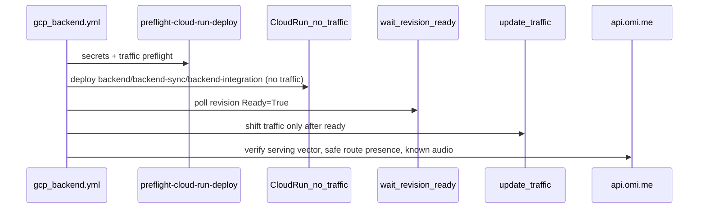

## Scope

This runbook covers the `gcp_backend.yml` workflow for prod backend deploys. It exists to prevent wedged Cloud Run services where `spec.traffic` points at a failed revision while `status.traffic` still serves an older good revision.

Product hotfix code changes are separate from deploy-process fixes. Land deploy hardening on `main` first; branch product fixes from current `main`, not stale hotfix forks.

## Workflows

Dispatch [Deploy Backend to Cloud RUN](https://github.com/BasedHardware/omi/actions/workflows/gcp_backend.yml) with:

| Input | Values | When to use |
|---|---|---|
| `mode` | `deploy` (default) | Normal image build + rollout |
| `mode` | `repair-traffic-only` | Restore `spec.traffic` to the currently serving revision without deploying |
| `deploy_targets` | `cloud-run-only` (default) | The only production deploy target; promotes the four validated Cloud Run revisions |
| `deploy_targets` | `all` | Development only; production dispatch rejects it before credentials or mutations |

## Pre-deploy checklist (prod)

Run hermetic checks locally or in CI before dispatch:

```bash
cd backend
CLOUD_RUN_VPC_NETWORK=offline-check-network \
CLOUD_RUN_VPC_SUBNET=offline-check-subnet \
  ./scripts/pre-deploy-check.sh
```

For live read-only validation with `gcloud` auth:

```bash
./scripts/pre-deploy-check.sh --live prod based-hardware
```

1. Confirm the last deploy did not wedge traffic. If unsure, run `mode: repair-traffic-only` first.
2. Verify runtime env locally:
   ```bash
   cd backend
   python3 scripts/validate-backend-runtime-env.py --env prod --check-workflows
   ```
3. For secret bindings in `backend/deploy/runtime_env.yaml`, preflight checks Secret Manager before creating revisions:
   ```bash
   python3 scripts/preflight-cloud-run-deploy.py \
     --env prod --project based-hardware --region us-central1 --check-secrets --check-traffic
   ```

## Deploy flow (mode: deploy)



Prod deploys auto-repair `spec.traffic != status.traffic` before creating revisions. Traffic shifts only after new revisions are `Ready=True`.

## Traffic repair

If a deploy fails after creating a non-ready revision:

1. Run `mode: repair-traffic-only` to align `spec.traffic` with `status.traffic`.
2. Inspect the workflow summary Cloud Run status report for the exact serving revision and repair command.
3. Retry `mode: deploy` only after repair succeeds and preflight passes.

Manual repair command format:

```bash
gcloud run services update-traffic backend \
  --project=based-hardware --region=us-central1 \
  --to-revisions=<serving-revision>=100 --quiet
```

## Cloud Run-only hotfixes

The only normal production dispatch is `environment=prod`, `mode=deploy`,
`deploy_targets=cloud-run-only`, and the exact admitted 40-character
`release_sha`. The workflow validates no-traffic revisions and their rendered
runtime contract, snapshots traffic, promotes exact revisions, verifies the
serving release vector, then runs the authenticated smoke through
`https://api.omi.me`. A failed shift, vector check, route-presence assertion,
or known-audio smoke restores and verifies the saved Cloud Run snapshot.

`deploy_targets=all` remains available for development only. Production
`backend-listen`, GKE, and backend-secret changes use their dedicated approved
workflows rather than this rollback-scoped Cloud Run deploy.

## Runtime env source of truth

Cloud Run env and secret bindings are declared in `backend/deploy/runtime_env.yaml` and rendered by `backend/scripts/render_backend_runtime_env.py`. After changing the manifest, run `./scripts/pre-deploy-check.sh`.

Prod Cloud Run intentionally omits `SERVICE_ACCOUNT_JSON` and `POSTHOG_PROJECT_API_KEY` bindings (#9164): those secrets are absent in prod Secret Manager and the runtime falls back to ADC / disables PostHog telemetry.

### Dev batch STT topology

The `backend`, `backend-sync`, and `backend-integration` services own their routed pre-recorded STT selection and every provider dependency in `backend/deploy/runtime_env.yaml`. Dev Parakeet must use the isolated `http://parakeet.omiapi.com` endpoint—never production `parakeet.omi.me`; prod uses `http://parakeet.omi.me`. Serving policy is literal `modulate-velma-2,parakeet`, and the runtime validator requires both `MODULATE_API_KEY` and `HOSTED_PARAKEET_API_URL` for rendered and live Cloud Run revisions.

After a dev revision is serving, run the opt-in smoke check with a valid dev authorization header:

```bash
python3 backend/scripts/smoke_dev_cloud_run_parakeet_batch_stt.py \
  --execute --authorization "Bearer <dev-token>"
```

It is dry-run by default, rejects production hosts, synthesizes a deterministic spoken fixture on macOS (or accepts `--pcm-file` elsewhere), and requires the batch endpoint to report a Parakeet transcript.

## Related issue

Deploy hardening tracked in [GitHub issue #9164](https://github.com/BasedHardware/omi/issues/9164).
