## Overview

Omi's transcription system provides **real-time speech-to-text** conversion with speaker identification, multiple language support, and seamless integration with the conversation processing pipeline.

```mermaid
flowchart LR
    subgraph Client["📱 Omi App"]
        Audio[Audio Capture]
    end

    subgraph Backend["🖥️ Backend"]
        WS["/v4/listen<br/>WebSocket"]
        Decode[Audio Decoder]
    end

    subgraph STT["🎧 STT Providers"]
        DG[Deepgram Nova-3]
        Soniox[Soniox]
        SM[Speechmatics]
    end

    Audio -->|Binary stream| WS
    WS --> Decode
    Decode --> DG
    Decode -.->|Fallback| Soniox
    Decode -.->|Fallback| SM
    DG -->|Transcript| WS
    WS -->|JSON segments| Audio
```



<Tabs>
  <Tab title="Quick Start" icon="rocket">
    Connect to `/v4/listen` WebSocket with your user token and start streaming audio. Transcripts arrive in real-time as JSON.
  </Tab>
  <Tab title="Full Documentation" icon="book">
    Read through for complete endpoint details, configuration options, and message formats.
  </Tab>
  <Tab title="Key Concepts" icon="lightbulb">
    - Multiple STT providers with automatic fallback
    - Speech profile for user identification
    - Dual-socket architecture for speaker training
    - [External Custom STT](#external-custom-stt-service) for your own transcription service
  </Tab>
</Tabs>

## WebSocket Endpoint

<Warning>
WebSocket connections require Firebase authentication. The `uid` parameter must be a valid user ID obtained through Firebase Auth.
</Warning>

### Endpoint URL

```
wss://api.omi.me/v4/listen?uid={uid}&language={lang}&sample_rate={rate}&codec={codec}
```

### Query Parameters

<AccordionGroup>
  <Accordion title="uid (required)" icon="user">
    **Type:** `string`

    User ID obtained from Firebase authentication. Required for all connections.
  </Accordion>

  <Accordion title="language" icon="globe">
    **Type:** `string` | **Default:** `'en'`

    Language code for transcription. Supports:
    - Standard codes: `'en'`, `'es'`, `'fr'`, `'de'`, `'ja'`, `'zh'`, etc.
    - Multi-language: `'multi'` for automatic language detection (uses Soniox)
  </Accordion>

  <Accordion title="sample_rate" icon="wave-pulse">
    **Type:** `integer` | **Default:** `8000`

    Audio sample rate in Hz. Common values: `8000`, `16000`, `44100`, `48000`
  </Accordion>

  <Accordion title="codec" icon="file-audio">
    **Type:** `string` | **Default:** `'pcm8'`

    Audio codec. Supported options:
    - `pcm8` - 8-bit PCM (default)
    - `pcm16` - 16-bit PCM
    - `opus` - Opus codec (16kHz)
    - `opus_fs320` - Opus with 320 frame size
    - `aac` - AAC codec
    - `lc3` - LC3 codec
    - `lc3_fs1030` - LC3 with 1030 frame size
  </Accordion>

  <Accordion title="channels" icon="sliders">
    **Type:** `integer` | **Default:** `1`

    Number of audio channels. Use `1` for mono, `2` for stereo.
  </Accordion>

  <Accordion title="include_speech_profile" icon="microphone-lines">
    **Type:** `boolean` | **Default:** `true`

    Enable speaker identification using the user's stored speech profile. When enabled, the system uses a dual-socket architecture for improved speaker detection.
  </Accordion>

  <Accordion title="conversation_timeout" icon="clock">
    **Type:** `integer` | **Default:** `120` | **Range:** `2-14400`

    Seconds of silence before the conversation is automatically processed. After this timeout, the conversation is saved and LLM processing begins.
  </Accordion>

  <Accordion title="stt_service" icon="server">
    **Type:** `string` | **Optional**

    Explicitly specify STT service. Options: `deepgram`, `soniox`, `speechmatics`. If not specified, the system selects based on language.
  </Accordion>

  <Accordion title="custom_stt" icon="code">
    **Type:** `string` | **Default:** `'disabled'`

    Enable custom STT mode. When set to `'enabled'`, the backend accepts app-provided transcripts instead of using STT services. Useful for apps with their own transcription.
  </Accordion>

  <Accordion title="source" icon="mobile">
    **Type:** `string` | **Optional**

    Conversation source identifier. Examples: `'omi'`, `'openglass'`, `'phone'`
  </Accordion>
</AccordionGroup>

## Audio Codecs

The system supports multiple audio codecs with automatic decoding:

| Codec | Sample Rate | Description | Use Case |
|-------|-------------|-------------|----------|
| `pcm8` | 8kHz | 8-bit PCM | Default, low bandwidth |
| `pcm16` | 16kHz | 16-bit PCM | Better quality |
| `opus` | 16kHz | Opus encoded | Efficient compression |
| `opus_fs320` | 16kHz | Opus 320 frame | Alternative frame size |
| `aac` | Variable | AAC encoded | iOS compatibility |
| `lc3` | Variable | LC3 codec | Bluetooth audio |
| `lc3_fs1030` | Variable | LC3 1030 frame | Alternative LC3 |

<Info>
All audio is internally converted to 16-bit linear PCM before being sent to STT providers.
</Info>

## STT Service Selection

The system automatically selects the best STT provider based on language:


### Provider Capabilities

| Provider | Languages | Model | Best For |
|----------|-----------|-------|----------|
| **Deepgram Nova-3** | 30+ | `nova-3` | Primary English, major languages |
| **Deepgram Nova-2** | 40+ | `nova-2-general` | Broader language support |
| **Soniox** | 95+ | Real-time | Multi-language, auto-detection |
| **Speechmatics** | 50+ | Real-time | Additional coverage |

## Deepgram Configuration

When using Deepgram, the following options are configured:

| Option | Value | Purpose |
|--------|-------|---------|
| `punctuate` | `true` | Automatic punctuation insertion |
| `no_delay` | `true` | Minimize latency for real-time feedback |
| `endpointing` | `300` | 300ms silence to detect sentence boundaries |
| `interim_results` | `false` | Only return final transcripts |
| `smart_format` | `true` | Format numbers, dates, currencies |
| `profanity_filter` | `false` | Keep all words unfiltered |
| `diarize` | `true` | Enable speaker identification |
| `filler_words` | `false` | Remove "um", "uh", etc. |
| `encoding` | `linear16` | 16-bit PCM encoding |

## External Custom STT Service

Build your own transcription/diarization WebSocket service that integrates with Omi.

```mermaid
flowchart LR
    subgraph App["📱 Omi App"]
        Capture[Audio Capture]
    end

    subgraph Custom["🎧 Your STT Service"]
        WS[WebSocket Server]
    end

    subgraph Backend["🖥️ Omi Backend"]
        API["/v4/listen"]
    end

    Capture -->|Binary audio| WS
    WS -->|JSON transcripts| Capture
    Capture -->|suggested_transcript| API
```



### Your Service Receives

| Message | Format | Description |
|---------|--------|-------------|
| Audio frames | Binary | Raw audio bytes (codec configured by app, typically `opus` 16kHz) |
| `{"type": "CloseStream"}` | JSON | End of audio stream |

### Your Service Sends

**Format:** JSON object with `segments` array

```json
{
  "segments": [
    {
      "text": "Hello, how are you?",
      "speaker": "SPEAKER_00",
      "start": 0.0,
      "end": 1.5
    },
    {
      "text": "I'm doing great, thanks!",
      "speaker": "SPEAKER_01",
      "start": 1.6,
      "end": 3.2
    }
  ]
}
```

### Segment Fields

| Field | Type | Required | Description |
|-------|------|----------|-------------|
| `text` | `string` | Yes | Transcribed text |
| `speaker` | `string` | No | Speaker label (`SPEAKER_00`, `SPEAKER_01`, etc.) |
| `start` | `float` | No | Start time in seconds |
| `end` | `float` | No | End time in seconds |

### Requirements

<Warning>
- Response **must be an object** with `segments` key. Raw arrays `[{...}]` will fail.
- Do **not** include a `type` field, or set it to `"Results"`. Other values are ignored.
- Connection closes after **90 seconds** of inactivity.
</Warning>

## Speech Profile & Dual-Socket Architecture

<Note>
When a user has a speech profile, the system uses a sophisticated dual-socket architecture for improved speaker identification.
</Note>

### How It Works

```mermaid
sequenceDiagram
    participant App as 📱 Omi App
    participant Backend as 🖥️ Backend
    participant Socket1 as 🎧 Deepgram Socket 1
    participant Socket2 as 🎧 Deepgram Socket 2

    Note over Backend: User has speech profile<br/>(duration: 30 seconds)

    App->>Backend: Connect WebSocket
    Backend->>Socket1: Create (for live audio)
    Backend->>Socket2: Create (for profile training)

    loop First 30 seconds
        App->>Backend: Audio chunk
        Backend->>Socket2: Send to profile socket
        Socket2-->>Backend: Transcript (training)
    end

    Note over Backend: Profile duration elapsed
    Backend->>Socket2: Close socket

    loop Remaining session
        App->>Backend: Audio chunk
        Backend->>Socket1: Send to live socket
        Socket1-->>Backend: Transcript with speaker IDs
        Backend-->>App: Segments (is_user: true/false)
    end
```



### Speech Profile Benefits

1. **User Identification**: Audio from the first ~30 seconds trains speaker recognition
2. **Speaker Attribution**: System identifies which segments are from the device owner
3. **Improved Accuracy**: Better speaker diarization in multi-person conversations

## Transcription Flow

<Steps>
  <Step title="Connection Established" icon="plug">
    WebSocket connection accepted, user validated, STT provider selected based on language.
  </Step>
  <Step title="Audio Streaming" icon="wave-pulse">
    App sends binary audio chunks. Backend decodes based on codec parameter.
  </Step>
  <Step title="STT Processing" icon="microphone">
    Decoded audio sent to Deepgram/Soniox. Provider returns word-level transcripts with speaker IDs.
  </Step>
  <Step title="Segment Creation" icon="align-left">
    Words grouped into segments. Same-speaker consecutive words merged. Timing adjusted for speech profile offset.
  </Step>
  <Step title="Real-time Delivery" icon="paper-plane">
    JSON segments streamed back to app immediately. UI updates as user speaks.
  </Step>
  <Step title="Conversation Lifecycle" icon="clock">
    Background task monitors silence. After `conversation_timeout`, conversation is processed and saved.
  </Step>
</Steps>

## Message Formats

### Incoming Messages (App → Backend)

<Tabs>
  <Tab title="Audio Data" icon="volume-high">
    **Format:** Binary

    Raw audio bytes encoded according to the `codec` parameter. Sent continuously during recording.

    ```
    [Binary audio chunk - varies by codec]
    ```

    **Keep-alive:** Messages of 2 bytes or less are treated as heartbeat pings.
  </Tab>

  <Tab title="Speaker Assignment" icon="user-check">
    **Format:** JSON

    Assign a known person to detected speakers:

    ```json
    {
      "type": "speaker_assigned",
      "speaker_id": 1,
      "person_id": "person-uuid-here",
      "person_name": "John",
      "segment_ids": ["seg-uuid-1", "seg-uuid-2"]
    }
    ```
  </Tab>

  <Tab title="Custom Transcript" icon="keyboard">
    **Format:** JSON

    When `custom_stt=enabled`, apps can provide their own transcripts:

    ```json
    {
      "type": "suggested_transcript",
      "segments": [
        {
          "text": "Hello there",
          "speaker": "SPEAKER_00",
          "speaker_id": 0,
          "start": 0.0,
          "end": 1.5,
          "is_user": true,
          "person_id": "known-person-uuid-or-null"
        }
      ],
      "stt_provider": "custom-provider-name"
    }
    ```

    See [External Custom STT Service](#external-custom-stt-service) for building your own transcription service.
  </Tab>

  <Tab title="Image Chunk" icon="image">
    **Format:** JSON

    For OpenGlass and visual captures:

    ```json
    {
      "type": "image_chunk",
      "id": "temp-image-id",
      "index": 0,
      "total": 3,
      "data": "base64-encoded-chunk"
    }
    ```
  </Tab>
</Tabs>

### Outgoing Messages (Backend → App)

<Tabs>
  <Tab title="Transcript Segments" icon="align-left">
    **Format:** JSON Array

    Real-time transcript segments as they're detected:

    ```json
    [
      {
        "id": "uuid-string",
        "text": "Hello there",
        "speaker": "SPEAKER_00",
        "speaker_id": 0,
        "is_user": true,
        "person_id": null,
        "start": 0.0,
        "end": 1.5,
        "speech_profile_processed": true,
        "stt_provider": "deepgram"
      }
    ]
    ```
  </Tab>

  <Tab title="Service Status" icon="circle-check">
    **Format:** JSON

    Connection and service status updates:

    ```json
    {
      "type": "service_status",
      "status": "ready",
      "status_text": "Service Ready"
    }
    ```
  </Tab>

  <Tab title="Speaker Suggestion" icon="user-plus">
    **Format:** JSON

    System suggests a known person for a detected speaker:

    ```json
    {
      "type": "speaker_label_suggestion",
      "speaker_id": 1,
      "person_id": "person-uuid",
      "person_name": "John",
      "segment_id": "segment-uuid"
    }
    ```
  </Tab>

  <Tab title="Conversation Created" icon="comments">
    **Format:** JSON

    Sent when conversation timeout triggers processing:

    ```json
    {
      "type": "memory_created",
      "memory": {
        "id": "conversation-uuid",
        "structured": {
          "title": "Meeting Discussion",
          "overview": "..."
        }
      },
      "messages": []
    }
    ```
  </Tab>

  <Tab title="Translations" icon="language">
    **Format:** JSON

    When translation is enabled:

    ```json
    {
      "type": "translation",
      "segments": [
        {
          "id": "segment-uuid",
          "translations": [
            {"lang": "es", "text": "Hola ahí"}
          ]
        }
      ]
    }
    ```
  </Tab>
</Tabs>

## Transcript Segment Model

Each transcript segment contains:

| Field | Type | Description |
|-------|------|-------------|
| `id` | `string` | Unique UUID for the segment |
| `text` | `string` | Transcribed text content |
| `speaker` | `string` | Speaker label (`"SPEAKER_00"`, `"SPEAKER_01"`, etc.) |
| `speaker_id` | `integer` | Numeric speaker ID (0, 1, 2...) |
| `is_user` | `boolean` | `true` if spoken by device owner |
| `person_id` | `string?` | UUID of identified person (if matched) |
| `start` | `float` | Start time in seconds |
| `end` | `float` | End time in seconds |
| `speech_profile_processed` | `boolean` | Whether speech profile was used for identification |
| `stt_provider` | `string?` | Name of STT provider used |

## Connection Lifecycle


### Lifecycle Events

<Steps>
  <Step title="Open" icon="door-open">
    1. WebSocket accepted
    2. User authentication verified
    3. Language/STT service selected
    4. STT connections initialized (with retry logic)
    5. Speech profile loaded in background
    6. Heartbeat task started (10s interval)
  </Step>
  <Step title="Stream" icon="wave-pulse">
    1. Audio received and decoded
    2. Sent to STT provider(s)
    3. Results collected in buffers
    4. Processed every 600ms
    5. Segments sent to client
    6. Speaker suggestions generated
  </Step>
  <Step title="Close" icon="door-closed">
    1. Usage statistics recorded
    2. All STT sockets closed
    3. Client WebSocket closed (code 1000/1001)
    4. Buffers and collections cleared
  </Step>
</Steps>

## Error Handling & Retry Logic

The system includes robust error handling:

| Error Type | Handling |
|------------|----------|
| **STT Connection Failed** | Exponential backoff retry (1s → 32s, 3 attempts) |
| **Provider Error** | Automatic fallback to next provider |
| **Decode Error** | Log and skip corrupted audio chunk |
| **WebSocket Error** | Clean close with appropriate code |

<Warning>
If all STT providers fail after retries, the connection will be closed with an error message. The app should handle reconnection.
</Warning>

## Key File Locations

| Component | Path |
|-----------|------|
| WebSocket Handler | `backend/routers/transcribe.py` |
| Deepgram Integration | `backend/utils/stt/streaming.py` |
| Soniox Integration | `backend/utils/stt/streaming.py` |
| Audio Decoding | `backend/routers/transcribe.py` |
| Speech Profile | `backend/utils/stt/speech_profile.py` |
| VAD (Voice Activity) | `backend/utils/stt/vad.py` |
| Transcript Model | `backend/models/transcript_segment.py` |

## Related Documentation

<CardGroup cols={2}>
  <Card title="Backend Deep Dive" icon="server" href="/doc/developer/backend/backend_deepdive">
    Complete backend architecture overview
  </Card>
  <Card title="Storing Conversations" icon="database" href="/doc/developer/backend/StoringConversations">
    How conversations and memories are stored
  </Card>
  <Card title="Chat System" icon="comments" href="/doc/developer/backend/chat_system">
    How the AI chat system uses transcriptions
  </Card>
  <Card title="Backend Setup" icon="gear" href="/doc/developer/backend/Backend_Setup">
    Environment setup and configuration
  </Card>
</CardGroup>
