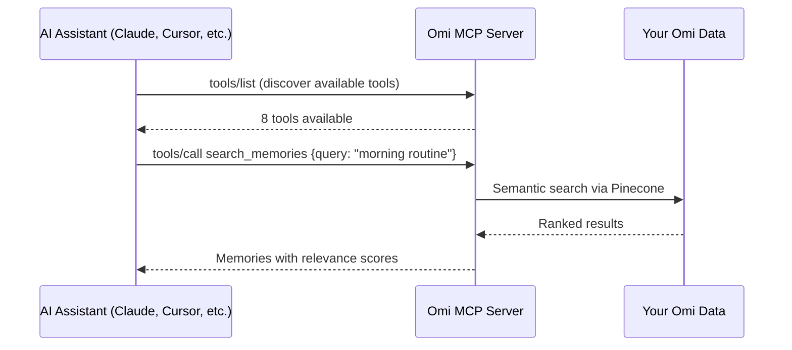

## What is MCP?

The [Model Context Protocol](https://modelcontextprotocol.io/) (MCP) is an open standard that lets AI assistants like Claude, Cursor, and other tools interact with external data sources. Omi's MCP server gives these assistants direct access to your memories and conversations.

<CardGroup cols={3}>
  <Card title="Search & Retrieve" icon="magnifying-glass">
    Semantic search across your memories and conversations
  </Card>
  <Card title="Manage Memories" icon="brain">
    Create, edit, and delete memories
  </Card>
  <Card title="Access Conversations" icon="comments">
    Browse and search full conversation transcripts
  </Card>
</CardGroup>

---

## How It Works

Your AI assistant connects to the Omi MCP server, discovers available tools, and calls them as needed during your conversations. All data stays within your Omi account — the MCP server authenticates via your personal API key.

---

## Available Tools

| Tool | Description |
|------|-------------|
| `get_memories` | List memories with optional category filtering |
| `search_memories` | Semantic search across memories |
| `create_memory` | Create a new memory |
| `edit_memory` | Edit an existing memory |
| `delete_memory` | Delete a memory |
| `get_conversations` | List conversations with date/category filters |
| `search_conversations` | Semantic search across conversations |
| `get_conversation_by_id` | Get full conversation with transcript |

See the [Tools Reference](/doc/developer/mcp/tools) for full parameter documentation.

---

## Comparison with Developer API

| Feature | MCP | Developer API |
|---------|-----|---------------|
| **Purpose** | AI assistant integration | Direct HTTP API access |
| **Access** | Read/write with AI context | Read & write user data |
| **Search** | Semantic search built-in | Filter-based queries |
| **Use Case** | Claude Desktop, Cursor, AI agents | Custom apps, dashboards |
| **Best For** | AI-powered workflows | Batch operations, integrations |

<Info>
For programmatic access without AI assistants, use the [Developer API](/doc/developer/api/overview) instead.
</Info>
