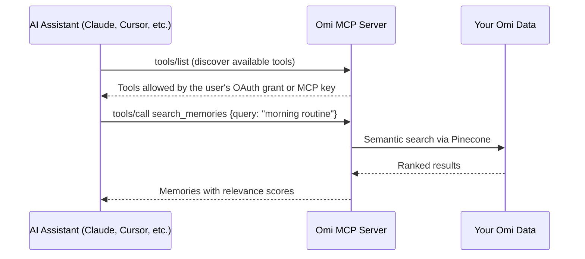

## What is MCP?

The [Model Context Protocol](https://modelcontextprotocol.io/) (MCP) is an open standard that lets AI assistants like Claude, Cursor, and other tools interact with external data sources. Omi's MCP server gives these assistants direct access to your memories and conversations.

<CardGroup cols={3}>
  <Card title="Search & Retrieve" icon="magnifying-glass">
    Semantic search across your memories and conversations
  </Card>
  <Card title="Manage Memories" icon="brain">
    Create, edit, and delete memories
  </Card>
  <Card title="Access Conversations" icon="comments">
    Browse and search full conversation transcripts
  </Card>
</CardGroup>

---

## How It Works

```mermaid
sequenceDiagram
    participant A as AI Assistant (Claude, Cursor, etc.)
    participant M as Omi MCP Server
    participant D as Your Omi Data

    A->>M: tools/list (discover available tools)
    M-->>A: Tools allowed by the user's OAuth grant or MCP key
    A->>M: tools/call search_memories {query: "morning routine"}
    M->>D: Semantic search via Pinecone
    D-->>M: Ranked results
    M-->>A: Memories with relevance scores
```

Your AI assistant connects to the Omi MCP server, discovers the tools allowed by its
authorization, and calls them as needed during your conversations. The hosted server
supports OAuth access tokens (the default for supported ChatGPT and Claude cloud flows)
and manually provisioned `omi_mcp_...` keys for compatible clients and local servers.

The same hosted MCP connection works across Claude, Claude Code, ChatGPT, Codex, and any compatible client. It exposes the user's Omi context as scoped tools: durable memories, conversations, people, action items, goals, chat history, daily summaries, and synced screen activity. The server's initialization instructions tell clients to retrieve task-specific evidence, confirm important claims against source records, and avoid writes unless the user clearly requested them.

When the Omi macOS app connects Claude Code or Codex, it also installs a small `omi` skill in that client's personal skills directory. The skill contains routing guidance only—never credentials or user data—and Omi preserves an existing user-authored skill with the same name.

---

## Available Tools

| Tool | Description |
|------|-------------|
| `get_memories` | List memories with optional category filtering |
| `search_memories` | Semantic search across memories |
| `create_memory` | Create a new memory |
| `edit_memory` | Edit an existing memory |
| `delete_memory` | Delete a memory |
| `get_conversations` | List conversations with date/category filters |
| `search_conversations` | Semantic search across conversations |
| `get_conversation_by_id` | Get full conversation with transcript |
| `get_user_profile` | Get Omi's cached high-level user summary |
| `get_x_posts`, `search_x_posts` | Browse or search imported X posts and bookmarks |
| `get_action_items`, `search_action_items` | Browse or search tasks |
| `create_action_item`, `update_action_item`, `complete_action_item`, `delete_action_item` | Manage tasks |
| `get_goals` | Retrieve active or historical goals |
| `get_chat_messages` | Retrieve recent Omi chat history |
| `get_people` | Retrieve recognized people and speaker samples |
| `get_screen_activity` | Retrieve or summarize synced screen activity |
| `get_daily_summaries` | Retrieve Omi's daily summaries |

See the [Tools Reference](/doc/developer/mcp/tools) for full parameter documentation.

---

## Comparison with Developer API

| Feature | MCP | Developer API |
|---------|-----|---------------|
| **Purpose** | AI assistant integration | Direct HTTP API access |
| **Access** | Read/write with AI context | Read & write user data |
| **Search** | Semantic search built-in | Filter-based queries |
| **Use Case** | Claude Desktop, Cursor, AI agents | Custom apps, dashboards |
| **Best For** | AI-powered workflows | Batch operations, integrations |

<Info>
For programmatic access without AI assistants, use the [Developer API](/doc/developer/api/overview) instead.
</Info>
