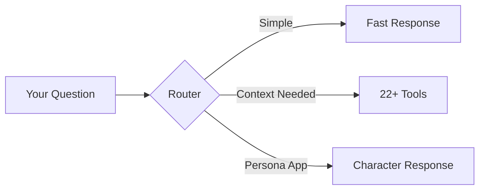

## How Your Questions Get Processed

When you ask Omi a question, it goes through an intelligent routing system that determines the best way to answer:



<Info>
Understanding these paths helps you frame questions that get the richest, most relevant answers.
</Info>

<Tabs>
  <Tab title="Simple Chat" icon="comment">
    **For:** Greetings, general advice, brainstorming

    Questions like "Hi!", "What's a good book to read?", or "Tips for productivity" get fast, direct responses without searching your memories.

    **Examples:**
    - "Hello!"
    - "What's a good productivity tip?"
    - "Help me brainstorm ideas for..."
  </Tab>
  <Tab title="Agentic (Context-Rich)" icon="robot">
    **For:** Personal data, temporal queries, integration lookups

    Questions like "What did I discuss yesterday?", "Show my calendar", or "What are my goals?" trigger the full agentic system with access to 22+ tools.

    **Examples:**
    - "What did I discuss yesterday?"
    - "Show my calendar for tomorrow"
    - "What are my goals?"
  </Tab>
  <Tab title="Persona" icon="mask">
    **For:** Character-based apps

    If you're chatting with a persona app (like "Ask Einstein"), responses come from that character's perspective.

    **Examples:**
    - Asking Einstein about physics
    - Getting advice from a custom coach persona
  </Tab>
</Tabs>

## Prompting Strategies

<AccordionGroup>
  <Accordion title="Be Specific with Time" icon="clock">
    Omi excels at temporal queries. The system converts relative time references to precise date ranges.

    <Tip>
    Use natural time expressions - the system understands them perfectly.
    </Tip>

    **Great examples:**
    - "What did I discuss yesterday?"
    - "Summarize my last 3 days"
    - "What happened this morning?"
    - "Conversations from last week"
    - "What did I talk about on Monday?"

    **Less effective:**
    - Vague timeframes without anchors ("a while ago")
    - Very broad ranges ("everything from this year")
  </Accordion>

  <Accordion title="Use Natural Language for Topics" icon="magnifying-glass">
    Omi uses **semantic search** - it finds conversations by meaning, not just keywords. Ask naturally!

    **Great examples:**
    - "What have I discussed about my health?"
    - "Conversations about career growth"
    - "Times I talked about feeling stressed"
    - "Discussions involving my manager"
    - "What have I said about the project launch?"

    **Why it works:** The system embeds your question and finds conversations with similar meaning, even if they use different words.
  </Accordion>

  <Accordion title="Ask About Yourself" icon="user">
    Omi builds a knowledge base of facts about you across all conversations. Tap into it!

    **Great examples:**
    - "What do you know about me?"
    - "What are my goals?"
    - "Who do I talk to most?"
    - "What are my preferences?"
    - "What hobbies have I mentioned?"

    **Why it works:** This triggers the memories system, which stores structured facts extracted from your conversations.
  </Accordion>

  <Accordion title="Leverage Your Integrations" icon="plug">
    If you've connected services, ask about them directly.

    <CardGroup cols={2}>
      <Card title="Google Calendar" icon="calendar">
        - "What meetings do I have today?"
        - "When is my next meeting with Sarah?"
        - "Schedule a meeting with John at 3 PM tomorrow"
      </Card>
      <Card title="Gmail" icon="envelope">
        - "Show my recent emails about the project"
        - "Emails from John this week"
      </Card>
      <Card title="Whoop (Health)" icon="heart-pulse">
        - "How was my sleep last night?"
        - "What's my recovery score today?"
        - "Show my workouts this week"
      </Card>
      <Card title="GitHub" icon="github">
        - "My open pull requests"
        - "Issues assigned to me"
      </Card>
    </CardGroup>
  </Accordion>
</AccordionGroup>

## Example Questions by Category

| Category | Great Questions | Why They Work |
|----------|-----------------|---------------|
| **Time-Based** | "What did I do yesterday?", "Summarize my week" | Clear time bounds trigger precise date filtering |
| **Topic Search** | "What have I said about AI?", "My health discussions" | Semantic search finds conceptually related conversations |
| **People** | "Conversations with John", "What did Sarah mention?" | People filter in search + vector similarity |
| **Action Items** | "What tasks do I have?", "What do I need to do?" | Direct access to action item system |
| **Personal Facts** | "What's my favorite food?", "Where do I work?" | Memory retrieval of stored facts |
| **Analysis** | "How productive was I this month?", "Patterns in my week" | Multi-tool orchestration for comprehensive answers |
| **Calendar** | "My meetings tomorrow", "When am I free this week?" | Calendar integration for schedule awareness |

## Pro Tips

<Tip>
These advanced strategies are based on how the system is designed internally.
</Tip>

<CardGroup cols={2}>
  <Card title="Combine Time + Topic" icon="filter">
    Narrow results by specifying both when and what:
    - "What did I discuss about the project **last week**?"
    - "Conversations about health **this month**"
    - "What did John say **yesterday**?"
  </Card>
  <Card title="Ask Follow-ups" icon="reply">
    The system remembers your last 10 messages:
    - First: "What did I discuss yesterday?"
    - Follow-up: "Tell me more about the second one"
    - Follow-up: "What action items came from that?"
  </Card>
  <Card title="Be Direct" icon="bolt">
    Skip pleasantries when you need information:
    - **Better:** "My tasks for today"
    - **Slower:** "Hey, could you maybe show me..."
  </Card>
  <Card title="Use Relative Dates" icon="calendar-day">
    Relative dates work better than absolute:
    - **Better:** "yesterday", "last 3 days", "this morning"
    - **Slower:** "January 15th, 2024"
  </Card>
  <Card title="Request Summaries" icon="list">
    Trigger comprehensive retrieval:
    - "Summarize my week"
    - "Overview of yesterday's conversations"
    - "Key themes from last month"
  </Card>
  <Card title="Ask for Specific Counts" icon="hashtag">
    When you want thorough results:
    - "Show me my last 10 conversations"
    - "What are my top 5 priorities?"
  </Card>
</CardGroup>

## What NOT to Ask

<Warning>
Some question patterns don't work well due to system design.
</Warning>

| Avoid | Why | Better Alternative |
|-------|-----|---------------------|
| "Tell me everything" | Too broad, hits context limits | "Summarize my last week" |
| "Search all my data" | No specific intent to optimize for | "What topics do I discuss most?" |
| Extremely old queries | Vectors may not exist for old conversations | Focus on recent conversations |
| Breaking persona character | Confuses persona apps | Stay in character with persona apps |
| Questions about other users | Privacy boundaries | Focus on your own data |

## Integration-Specific Tips

<Tabs>
  <Tab title="Google Calendar" icon="calendar">
    Best practices for calendar queries:

    | Action | Example Query |
    |--------|---------------|
    | Check schedule | "What meetings do I have today?" or "Am I free at 3 PM?" |
    | Find meetings | "When is my next meeting with [name]?" |
    | Create events | "Schedule a meeting with John tomorrow at 2 PM about project review" |
    | Modify events | "Move my 3 PM meeting to 4 PM" |
  </Tab>
  <Tab title="Gmail" icon="envelope">
    Best practices for email queries:

    | Action | Example Query |
    |--------|---------------|
    | Search by sender | "Emails from John this week" |
    | Search by topic | "Recent emails about the contract" |
    | Combine filters | "Emails from Sarah about the project in the last 3 days" |
  </Tab>
  <Tab title="Whoop" icon="heart-pulse">
    Best practices for health queries:

    | Data Type | Example Query |
    |-----------|---------------|
    | Sleep | "How was my sleep last night?" or "Sleep quality this week" |
    | Recovery | "What's my recovery score today?" |
    | Workouts | "Show my workouts this week" or "How much strain yesterday?" |
    | Trends | "How has my sleep been this month?" |
  </Tab>
  <Tab title="GitHub" icon="github">
    Best practices for development queries:

    | Action | Example Query |
    |--------|---------------|
    | PRs | "My open pull requests" or "PRs I need to review" |
    | Issues | "Issues assigned to me" or "Open issues in [repo]" |
    | Create | "Create an issue for the login bug in [repo]" |
  </Tab>
  <Tab title="Notion" icon="book">
    Best practices for Notion queries:

    | Action | Example Query |
    |--------|---------------|
    | Search | "Search my notes about [topic]" |
    | Find pages | "Find my page about product roadmap" |
  </Tab>
</Tabs>

## Understanding Citations

When Omi answers questions using your conversations, it includes numbered citations like `[1]` and `[2]`. These link to the source conversations.

- **Tap citations** in the app to view the full conversation
- **Multiple citations** mean information came from multiple conversations
- **No citations** means the answer came from general knowledge or your stored memories (facts about you)

## Quick Reference Card

### Best Question Patterns:

```
Time-based:    "What did I [verb] [time period]?"
Topic-based:   "What have I discussed about [topic]?"
Person-based:  "Conversations with [name]" or "What did [name] say?"
Action items:  "What tasks do I have?" or "My to-dos"
Personal:      "What do you know about my [aspect]?"
Calendar:      "My meetings [time period]"
Summary:       "Summarize my [time period]"
```

### Power Combinations:

```
Time + Topic:   "What did I discuss about [topic] [time period]?"
Time + Person:  "Conversations with [name] [time period]"
Topic + Person: "What did [name] say about [topic]?"
All three:      "What did [name] and I discuss about [topic] [time period]?"
```

## Related Documentation

<CardGroup cols={2}>
  <Card title="Chat System Architecture" icon="server" href="/doc/developer/backend/chat_system">
    Technical deep dive into how the chat system works
  </Card>
  <Card title="Building Chat Tools" icon="puzzle-piece" href="/doc/developer/apps/ChatTools">
    Create custom tools for your Omi apps
  </Card>
  <Card title="Storing Conversations" icon="database" href="/doc/developer/backend/StoringConversations">
    How your conversations and memories are stored
  </Card>
  <Card title="Real-time Transcription" icon="microphone" href="/doc/developer/backend/transcription">
    How live transcription works under the hood
  </Card>
</CardGroup>
