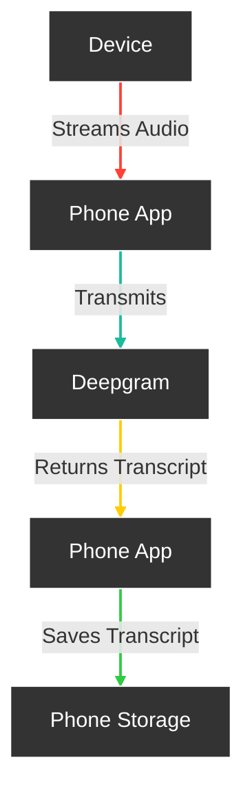

# Introduction

Friend is an AI wearable device that records everything you say, giving you proactive feedback and advice. Use these docs to unlock the full potential of Friend and build using the power of recall.

## Features

- Real-Time AI Audio Processing: Leverage powerful on-device AI capabilities for real-time audio analysis.

- Low-powered Bluetooth: Capture audio for 24h+ on a small button battery

- Open-Source Software: Access and contribute to the pin’s software stack, designed with openness and community collaboration in mind. -Wearable Design: Experience unparalleled convenience with ergonomic and lightweight design, perfect for everyday wear

## How it works

## Structure

There are 3 different apps in these repositories located in different branches and folders. Our goal is to merge them into one big project.

Folder "AppStandalone": Standalone version of the app that doesn't require any hardware to use it.

Folder "AppWithWearable": Wearable-connected version of the app that requires the "Friend necklace" to use it.

Folder "AppWithWearableReactNative": Wearable-connected version of the app that is built in React native

## Hardware Buying Guide (<$20 total)

- Board: Seeed Studio XIAO nRF52840 Sense | $15 on [Seedstudio](https://www.seeedstudio.com/Seeed-XIAO-BLE-Sense-nRF52840-p-5253.html) and $24 on [Amazon](https://amzn.to/3TZD1pO) and also [link for europe ](https://amzn.eu/d/3eG6gaA) and [India](https://robu.in/product/seeed-studio-xiao-nrf52840-sense-tinyml-tensorflow-lite-imu-microphone-bluetooth5-0/) | <$15/unit

- Rechargeable Battery on [Amazon](https://amzn.to/3TXlE9f) $7
- Slider switch | $7 for 30+ units [on Amazon](https://www.amazon.com/Tnuocke-Vertical-Position-Latching-SS12F15-G5/dp/B099N3HFPG/ref=sr_1_2?dib=eyJ2IjoiMSJ9.vWYaZHNA7Z38_YnK7oxLKHvVPX-koqNn5CYGqZXKURCQso_zrAwckot4_h8c77Kgy2-m8FcrQymrZff0rlZIGdECJFA5Rwc5EQObrZ5wDb9zjnwVjonhSZfHlyM-KkJKO4_E6mKcC_I0vZg2vS1PBPkNSAXj9H9pTVK3D2iVtuoMNsxvAEwrYUPx3gYOiIjMOzJYoj8aHPmy2W1R4bWcPWp8IvhbO1GO29TT0jVE97U.ZavNMHkM9KYGMLSB_3DREpSJjhQ16_cjqOpo7aPAfHY&dib_tag=se&keywords=slider%2Bswitch&qid=1711332053&sr=8-2&th=1) and also [link for europe ](https://amzn.eu/d/9U0gjPB) but you only need one | <$1/unit

- Wires. I didn't try [these ones ](https://www.amazon.com/dp/B09X4629C1)but they should work

- 3D-print design of the case is located [here](https://github.com/BasedHardware/Friend/tree/main/assets/3d_printing_designs)

[Next Step: Getting Started →](https://basedhardware.github.io/Friend/get_started/Setup/){: .btn .btn-purple }