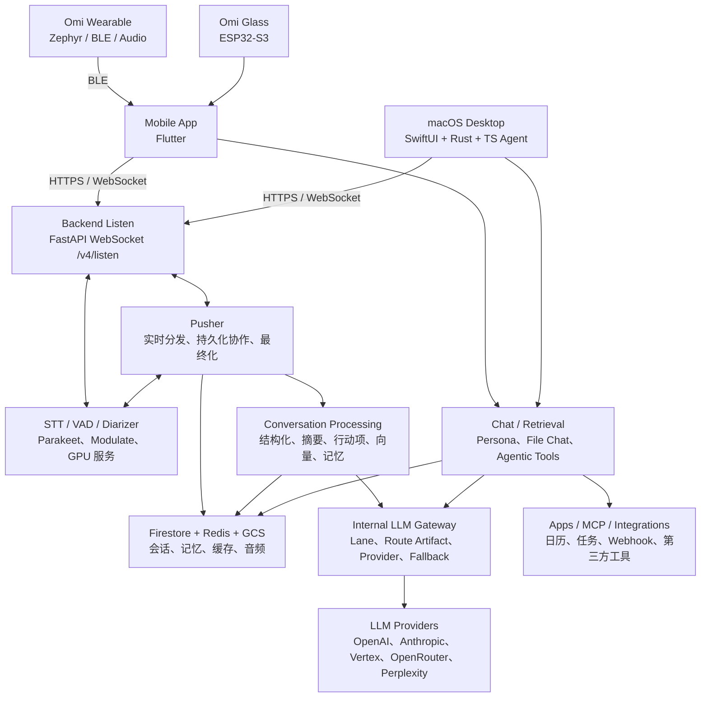
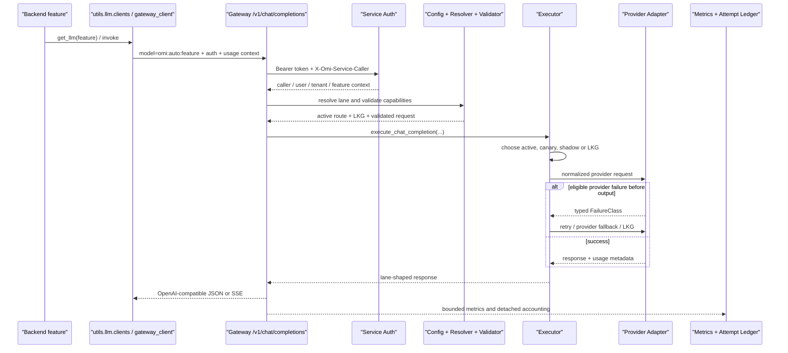

# Omi 开源项目代码学习指南

> 适合第一次进入 Omi 单体仓库，希望建立全局心智模型，并重点读懂 Backend 与 LLM Gateway 的开发者。

## 版本与阅读口径

本文基于以下材料交叉核对：

- 本地仓库提交：`9aa2d1045273855066a9c9991b766f420a5b39c1`，提交时间 2026-07-19。
- [BasedHardware/Omi 官方 GitHub 仓库](https://github.com/BasedHardware/Omi)。
- [Omi 官方 LLM Gateway 文档](https://docs.omi.me/doc/developer/backend/llm_gateway)，核对日期 2026-07-22。
- 仓库内的产品原则、组件指南、架构文档和实际生产代码。

Omi 迭代很快，模型名、路由产物、部署状态和目录数量会变化。本文优先解释稳定的边界、所有权和调用链；出现具体模型名时，都应理解为上述本地提交的快照，而不是永久 API 合同。

## 先记住一句话

Omi 是一个“持续捕获个人上下文，再把它变成可检索、可行动记忆”的开源系统。

它不是单纯的录音转写 App，也不是一个套壳聊天机器人。产品主循环写在 [`PRODUCT.md`](../../PRODUCT.md) 中：

```text
Capture → Understand → Remember → Retrieve → Act
捕获       理解          记忆         检索       行动
```

后面读到的硬件、Flutter、桌面端、转写、会话处理、记忆、RAG、工具调用和 LLM Gateway，都在服务这条主循环。

## 1. 全局架构



这个图里最容易混淆的三点是：

1. **客户端不直接拥有“记忆真相”**。移动端和桌面端主要负责捕获、展示与交互，权威的会话、记忆和任务数据由 Python Backend 管理。
2. **桌面 Rust Backend 不是第二套产品 Backend**。它负责桌面控制面、provider proxy、实时会话、屏幕活动等；产品 CRUD 仍属于 Python Backend。
3. **LLM Gateway 不是面向用户的模型选择器**。它是内部服务，用稳定的功能 lane 隔离不断变化的 provider/model 选择。

## 2. 仓库地图

| 目录 | 技术栈 | 主要职责 | 建议入口 |
| --- | --- | --- | --- |
| [`app/`](../../app/) | Dart / Flutter | iOS、Android 伴侣 App；BLE 设备、实时捕获、会话、记忆、聊天、应用市场 | [`app/lib/main.dart`](../../app/lib/main.dart)、[`app/lib/core/app_shell.dart`](../../app/lib/core/app_shell.dart) |
| [`desktop/macos/Desktop/`](../../desktop/macos/Desktop/) | Swift / SwiftUI | macOS UI、麦克风与屏幕体验、浮动控制条、系统集成 | [`desktop/macos/README.md`](../../desktop/macos/README.md) |
| [`desktop/macos/Backend-Rust/`](../../desktop/macos/Backend-Rust/) | Rust | 桌面控制和 provider proxy；桌面聊天、实时 token、TTS、屏幕活动 | [`ARCHITECTURE.md`](../../desktop/macos/Backend-Rust/ARCHITECTURE.md) |
| [`desktop/macos/agent/`](../../desktop/macos/agent/) | TypeScript | 多 provider agent runtime 与工具执行 | [`agent/src/ARCHITECTURE.md`](../../desktop/macos/agent/src/ARCHITECTURE.md) |
| [`backend/`](../../backend/) | Python 3.11 / FastAPI | 权威产品 API、转写、会话、记忆、聊天、同步、Apps、MCP、任务和后台作业 | [`backend/main.py`](../../backend/main.py)、[`backend/AGENTS.md`](../../backend/AGENTS.md) |
| [`backend/llm_gateway/`](../../backend/llm_gateway/) | Python / FastAPI / Pydantic / httpx | Omi 内部 LLM lane 路由、能力校验、provider 执行、fallback、记账和指标 | [`backend/llm_gateway/main.py`](../../backend/llm_gateway/main.py) |
| [`omi/firmware/`](../../omi/firmware/) | C / Zephyr RTOS | Omi 可穿戴设备的音频、BLE、电池、离线存储和设备控制 | [`omi/firmware/README.md`](../../omi/firmware/README.md) |
| [`omiGlass/`](../../omiGlass/) | C / ESP32-S3 | Omi Glass 的摄像头和音频固件 | 目录内构建配置与源码 |
| [`mcp/`](../../mcp/) | Python | 把 Omi 的 Conversations 和 Memories 暴露为 MCP 工具 | [`mcp/README.md`](../../mcp/README.md) |
| [`sdks/`](../../sdks/) | Python / Swift / React Native | 面向第三方开发者的客户端 SDK | 各 SDK 的 `README.md` |
| [`plugins/`](../../plugins/) | 多语言 | Omi Apps、集成示例、插件 SDK 和模板 | 先看 [`plugins/omi-plugin-sdk/`](../../plugins/omi-plugin-sdk/) |
| [`web/`](../../web/) | Next.js 等 | Web App、管理后台、Persona 开源站点 | 各子项目 `package.json` |
| [`docs/`](../) | MDX / OpenAPI | 官方开发者文档、产品不变量、架构与运行手册 | [`docs/doc/developer/backend/`](../doc/developer/backend/) |

### Backend 内部的分层

Backend 的依赖方向是：

```text
database/ → utils/ → routers/ → main.py
```

- `database/`：Firestore、Redis、向量库和各领域的持久化。
- `models/`：Pydantic 数据模型和领域状态。
- `utils/`：业务逻辑、LLM、STT、会话、记忆、检索和基础设施适配。
- `routers/`：FastAPI 的 HTTP/WebSocket 边界，负责鉴权、输入输出和编排。
- `main.py`：加载环境、初始化 Firebase、注册四十多个 router 和生命周期任务。

先理解这条依赖方向，读代码时就不容易在 router、业务逻辑和持久化之间迷路。

## 3. 五段产品主循环如何落到代码

| 产品阶段 | 代码所有者 | 关键入口 | 输出 |
| --- | --- | --- | --- |
| Capture | 固件、Flutter、Desktop、Listen | [`routers/transcribe.py`](../../backend/routers/transcribe.py)、[`routers/listen/`](../../backend/routers/listen/) | 音频帧、转写片段、设备来源 |
| Understand | STT、Pusher、Conversation Processing | [`routers/pusher.py`](../../backend/routers/pusher.py)、[`process_conversation.py`](../../backend/utils/conversations/process_conversation.py) | 说话人、标题、摘要、事件、行动项 |
| Remember | Conversation DB、Memory System、向量/KG | [`utils/memory/`](../../backend/utils/memory/)、[`database/memories.py`](../../backend/database/memories.py) | 短期/长期记忆、向量、知识图谱 |
| Retrieve | Chat Graph、Agentic Tools、RAG | [`utils/retrieval/graph.py`](../../backend/utils/retrieval/graph.py)、[`utils/retrieval/tools/`](../../backend/utils/retrieval/tools/) | 与问题相关的会话、记忆、文件和外部数据 |
| Act | Action Items、Apps、MCP、Integrations | [`routers/action_items.py`](../../backend/routers/action_items.py)、[`routers/apps.py`](../../backend/routers/apps.py)、[`routers/mcp_sse.py`](../../backend/routers/mcp_sse.py) | 任务、通知、第三方操作和自动化 |

## 4. 第一条核心链路：从声音到一条完成的 Conversation

### 4.1 客户端与 WebSocket 入口

硬件把音频通过 BLE 交给 Flutter App；桌面端也可以从麦克风捕获。客户端随后连接：

```text
WS /v4/listen
WS /v4/web/listen
```

[`backend/routers/transcribe.py`](../../backend/routers/transcribe.py) 现在只是稳定的公开 facade。真正的长连接实现已经拆到 [`backend/routers/listen/`](../../backend/routers/listen/)：

- `contracts.py`：请求和会话状态。
- `runtime.py`：会话总编排，入口是 `run_listen_session()`。
- `receiver.py`：接收、解码 PCM/Opus/LC3 等音频。
- `transcripts.py`：转写片段缓存与处理。
- `speakers.py`：说话人匹配。
- `conversations.py`：实时 Conversation 生命周期。
- `persistence.py`：持久化边界。

这是一个很典型的重构结果：公开入口保持小而稳定，复杂并发被拆成有明确所有权的组件。

### 4.2 Listen、STT 与 Pusher

Listen 会把音频交给选定的 STT 路径，并通过内部二进制 WebSocket 协议与 Pusher 协作。Pusher 的入口是：

```text
WS /v1/trigger/listen
```

[`backend/routers/pusher.py`](../../backend/routers/pusher.py) 同时管理多类长期任务：

- 批量发送实时 transcript 与 webhook。
- 向需要音频的集成分发音频。
- 上传私有云音频分片。
- 提取说话人样本。
- 接管持久化后的 Conversation finalization。

Pusher 不只是“消息转发器”。它是实时数据分发与耐久 finalization 之间的桥。

### 4.3 Durable finalization

会话结束不能只依赖“某个 WebSocket 最后发成功一次”。连接随时会断，所以当前实现把 finalization 建模为 Firestore 中可 claim、可 fence、可重试、可 dead-letter 的耐久作业。

核心边界包括：

- [`database/conversation_finalization_jobs.py`](../../backend/database/conversation_finalization_jobs.py)：作业和租约状态。
- [`services/conversation_finalization.py`](../../backend/services/conversation_finalization.py)：调度与恢复。
- [`utils/conversations/finalizer.py`](../../backend/utils/conversations/finalizer.py)：持久化会话的最终化入口。
- [`utils/conversations/lifecycle.py`](../../backend/utils/conversations/lifecycle.py)：Conversation 状态迁移。

重要思想是：**Firestore 状态迁移是权威结果，WebSocket 回执只是尽力通知。** 这避免了连接关闭后，已经成功处理的会话被错误地标记为失败或重复处理。

### 4.4 Conversation enrichment

[`process_conversation()`](../../backend/utils/conversations/process_conversation.py) 是同步的 enrichment coordinator。它大致做这些事：

1. 检查套餐、延迟处理和 reprocess 条件。
2. 获取会议和人物上下文。
3. 调 LLM 生成结构化标题、摘要、类别、事件与行动项。
4. **先持久化完成态 Conversation。**
5. 只有持久化成功后，才触发文件夹分配、Apps、向量、记忆、行动项、目标更新、音频产物和 webhook。

这里的关键合同是“先提交权威状态，再产生派生副作用”。如果一次处理结果被更新的状态 fence 掉，就不能继续生成记忆、向量或 webhook。

## 5. 第二条核心链路：从用户问题到带工具的回答

主聊天入口是：

```text
POST /v2/messages
```

[`backend/routers/chat.py`](../../backend/routers/chat.py) 会：

1. 做鉴权、速率和套餐额度检查。
2. 持久化用户消息与 chat session。
3. 读取最近消息和附件上下文。
4. 调用 `execute_chat_stream()`。
5. 用 SSE 连续发送思考状态、文本 chunk 和最终 `done:` 帧。
6. 把 AI 消息、引用、工具结果和 LangSmith 元数据写回数据库。

[`backend/utils/retrieval/graph.py`](../../backend/utils/retrieval/graph.py) 当前有三条主要路由：

```text
Persona App → Persona Chat
有文件上下文 → File Chat
其他情况 → Anthropic Agentic Chat
```

默认 agentic 路径位于 [`backend/utils/retrieval/agentic.py`](../../backend/utils/retrieval/agentic.py)。模型可以调用 Omi 核心工具和动态 App 工具，例如：

- Conversations、Memories、Action Items。
- Calendar、Gmail、Apple Health、Screen Activity。
- 文件、网页、Perplexity 搜索。
- 用户偏好、通知设置和第三方 App 工具。

它还包含几个生产级约束：首事件 deadline、进度 heartbeat、总时长上限、工具调用上限、上下文 token 上限、取消清理和引用收集。读聊天代码时，不要只看 prompt；流式生命周期和工具边界同样是核心业务。

## 6. Memory：为什么看起来比普通 CRUD 复杂

Omi 正在同时维护 legacy memory 与 canonical memory。入口仍是：

```text
GET /v3/memories
```

但实际可能走三条路径：

1. **Direct canonical**：命中受控 cohort，直接读取权威 `memory_items`。
2. **Composed projection**：验证 rollout、generation、projection、cursor 和预算后读取兼容投影。
3. **Legacy**：未启用 canonical read 时走旧存储。

完整地图在 [`backend/utils/memory/ARCHITECTURE.md`](../../backend/utils/memory/ARCHITECTURE.md)。初学时先记住：

- canonical ledger 才是新系统的权威状态。
- projection、vector 和 knowledge graph 是可重建的派生读模型。
- 路由和投影验证是 fail-closed，不能为了“有结果”偷偷混入 legacy 数据。
- legacy 保留用于回滚，不能只因新代码上线就删除。

这套复杂度来自“个人记忆不能静默丢失或双写分叉”的产品原则，而不是为了抽象而抽象。

## 7. LLM Gateway 深入理解

### 7.1 它解决什么问题

如果每个调用点都直接写死 `provider + model`，会出现这些问题：

- Backend、Pusher、Desktop 的模型策略逐渐分叉。
- 换模型必须改产品代码并重新发布。
- fallback、BYOK、安全和指标在各调用点重复实现。
- 无法把一次模型选择与评测证据、灰度阶段和回滚指针绑定。

LLM Gateway 把产品稳定标识和供应商实现解耦：

```text
产品功能 feature
    ↓
稳定 lane：omi:auto:<feature>
    ↓
不可变 route artifact
    ↓
primary / fallback provider + model
```

“给某个用户展示模型滑杆”“公开 `/pick` 接口”“请求时在线抓 benchmark”都不是它的目标。

### 7.2 设计起点与当前实现的差异

官方文档从 `omi:auto:chat-structured` 这个低风险、非流式、JSON Schema lane 开始讲。这仍然是理解 route artifact、promotion gate 和结构化输出的最好例子。

但当前本地实现已经扩展：配置加载器实际得到：

```text
41 lanes
42 route artifacts
43 feature bundles
2 API surfaces: openai.chat_completions、anthropic.messages
```

当前还包含：

- 根据 `model_config.py` 自动生成的 per-feature lanes。
- OpenAI、OpenRouter、Perplexity、Vertex Gemini、Anthropic provider registry。
- OpenAI-compatible 非流式与流式 chat completions。
- 原生 Anthropic `/v1/messages`，保留 streaming 与 tools 合同。
- 服务认证的 `/v1/images/generations`。
- 每次 provider attempt 的 token/cache/cost 记账。

所以正确读法是：**官方文档提供设计原则，当前代码展示这些原则扩展到完整 feature inventory 后的形态。**

### 7.3 配置有两类来源

#### A. 产品侧模型配置

[`backend/utils/llm/model_config.py`](../../backend/utils/llm/model_config.py) 是 feature → `(model, provider)` 的源头。它定义：

- `premium`、`max`、`byok` QoS profiles。
- pinned features。
- provider 专属能力与参数。
- structured-output feature 清单。

#### B. Gateway 侧不可变路由配置

[`backend/llm_gateway/config/`](../../backend/llm_gateway/config/) 包含：

- `lanes.yaml`：显式 lane、能力、目标权重、active 和 LKG 指针。
- `route_artifacts.yaml`：primary、fallback、timeout、retry、rollout、evidence、credential 和 fallback policy。
- `feature_bundles.yaml`：prompt/parser/eval 版本与 promotion gates。
- `generated_route_overrides.yaml`：只改变 Gateway 自动生成的路由，不改变 legacy 产品路由。
- `cost_rate_cards.yaml`：版本化成本估算。

[`config_loader.py`](../../backend/llm_gateway/gateway/config_loader.py) 会先从 `model_config.py` 生成每个 feature 的 lane/artifact/bundle，再合并显式 YAML，最后做跨文件校验。

这种设计允许团队先在 Gateway 中验证新模型，而不立即改变 legacy direct-provider 行为。

### 7.4 一次 OpenAI-compatible 请求的完整链路



对应代码顺序：

1. [`clients.py:get_llm()`](../../backend/utils/llm/clients.py) 判断 `OMI_LLM_GATEWAY_FEATURE_MODE`。
2. [`gateway_client.py`](../../backend/utils/llm/gateway_client.py) 生成 `omi:auto:<feature>`、Gateway URL、service token 和用户归因 header。
3. [`routers/openai_compatible.py`](../../backend/llm_gateway/routers/openai_compatible.py) 接收 `/v1/chat/completions`。
4. [`gateway/auth.py`](../../backend/llm_gateway/gateway/auth.py) 验证 service token 与 caller allowlist。
5. [`gateway/resolver.py`](../../backend/llm_gateway/gateway/resolver.py) 只接受已配置的 `omi:auto:*` lane，并找到 active 与 LKG。
6. [`gateway/validator.py`](../../backend/llm_gateway/gateway/validator.py) 检查 message、stream、tools、JSON Schema 和允许转发的参数。
7. [`gateway/executor.py`](../../backend/llm_gateway/gateway/executor.py) 选择 serving route，执行 retry、provider fallback 与 LKG fallback。
8. [`gateway/providers.py`](../../backend/llm_gateway/gateway/providers.py) 调具体 provider，并统一响应与错误分类。
9. [`gateway/accounting.py`](../../backend/llm_gateway/gateway/accounting.py) 和 [`accounting_sink.py`](../../backend/llm_gateway/gateway/accounting_sink.py) 记录 attempt ledger。

### 7.5 Active、Shadow、Canary 与 LKG

Route artifact 的 rollout 决定它是否真的接流量：

- `disabled` / `shadow`：不服务，直接使用 LKG。
- `canary`：根据 route ID 与请求 messages 的稳定 hash 做确定性采样。
- `active`：100% 服务。

当前 `chat-structured` 的 active artifact 仍是 `shadow / 0%`，因此实际 serving route 是 LKG。两个 artifact 在本地快照中都使用 OpenAI `gpt-5.4-nano`，但它们仍是独立、不可变、带 digest 的操作对象。

Route artifact 一旦发布，不能原地改内容。正确升级方式是创建新 ID、验证 digest 与 evidence，再移动 lane pointer；回滚则把 pointer 指回 LKG。

### 7.6 两层 fallback，不要混为一谈

#### Gateway 内部 fallback

Gateway 可以在 route policy 允许时：

1. 重试同一 provider。
2. 尝试 route 内的 fallback provider/model。
3. active route 失败后尝试 LKG route。

典型可 fallback 类别是：

- `timeout_before_output`
- Omi-paid provider 429
- Omi-paid provider 5xx

能力不匹配、无效配置和 BYOK 凭证问题不能偷偷 fallback。

#### Backend 到 legacy provider 的临时 fallback

[`gateway_serving.py`](../../backend/utils/llm/gateway_serving.py) 还包了一层 gateway-first / legacy-direct fallback，但只允许真正的 Gateway transport 故障：

- timeout
- network / connection / remote protocol error
- proxy 502 / 504
- process-local circuit 已打开

Gateway 的配置、鉴权、能力错误不会被 legacy provider 掩盖。流式请求一旦已经输出第一个 chunk，也绝不能从头在 legacy provider 重放，否则用户会看到重复或矛盾内容。

### 7.7 BYOK 边界

BYOK 的默认原则是“用户自己的 key 出错，就把错误说清楚”，而不是偷偷花 Omi 的钱继续请求。

- Desktop/Mobile 不直接调用 Gateway。
- Backend 通过服务认证的内部 envelope 转发 provider key。
- 原始 key 被排除在 Pydantic dump、`repr`、日志和指标之外。
- missing key、auth、quota、rate limit、unsupported provider 都是可见错误。
- Vertex Gemini 使用 Workload Identity / ADC，不接受 Gemini Developer API key 伪装成 Vertex credential。
- BYOK → Omi-paid fallback 默认禁止。

### 7.8 Service Auth 与健康检查

内部请求需要：

```text
Authorization: Bearer <OMI_LLM_GATEWAY_SERVICE_TOKEN>
X-Omi-Service-Caller: backend | pusher
```

还可以携带低敏感度归因：user UID、tenant ID、feature。`/health` 不鉴权，只证明进程活着；`/ready` 需要服务认证并验证配置与必需 provider 凭证。

### 7.9 Observability 与记账

Gateway 的可观测性围绕低基数标签设计：

- lane、route artifact、provider、model。
- 是否 streaming、阶段、fallback 与 failure class。
- first-byte latency、terminal marker、finish reason、输出大小 bucket。
- credential source 与 bounded feature。

流式成功要求真的看到 provider 协议终止标记，例如 OpenAI `[DONE]` 或 Anthropic `message_stop`；干净 EOF 不自动算成功。

每次到达 provider 的 attempt 可以写入 Firestore `llm_gateway_attempts`。Ledger 保存归因、route/provider/model、token、cache、计费单位和 micro-USD 估算，但不保存 prompt、completion、provider body、header 或 API key。写入从响应路径分离，失败可观测但不拖慢或打断模型响应。

### 7.10 部署边界

LLM Gateway 是独立 FastAPI 进程和独立 GKE 服务，不嵌在 `backend/main.py` 中：

- GKE 内调用者使用 Kubernetes DNS。
- Cloud Run 调用者使用内部负载均衡地址，不能使用 cluster DNS。
- Helm chart 位于 [`backend/charts/llm-gateway/`](../../backend/charts/llm-gateway/)。
- 部署必须经过 [`backend/scripts/deploy-llm-gateway.sh`](../../backend/scripts/deploy-llm-gateway.sh) 的身份、secret 和环境校验。
- prod feature mode 还需要独立的显式 allow 开关，防止误把生产流量切进 Gateway。

## 8. 推荐的源码阅读顺序

### 第一轮：只建立地图

1. [`README.md`](../../README.md)
2. [`PRODUCT.md`](../../PRODUCT.md)
3. [`backend/AGENTS.md`](../../backend/AGENTS.md) 的 Directory Structure 与 Service Map
4. [`backend/main.py`](../../backend/main.py)
5. [`app/lib/main.dart`](../../app/lib/main.dart)
6. [`desktop/macos/README.md`](../../desktop/macos/README.md)

目标：知道每个进程负责什么，不深入实现。

### 第二轮：跟一条真实数据链

1. [`routers/transcribe.py`](../../backend/routers/transcribe.py)
2. [`routers/listen/runtime.py`](../../backend/routers/listen/runtime.py)
3. [`routers/pusher.py`](../../backend/routers/pusher.py)
4. [`utils/conversations/finalizer.py`](../../backend/utils/conversations/finalizer.py)
5. [`utils/conversations/process_conversation.py`](../../backend/utils/conversations/process_conversation.py)
6. [`database/conversations.py`](../../backend/database/conversations.py)

目标：解释一段声音如何变成完成会话、摘要、记忆和行动项。

### 第三轮：跟一条聊天链

1. [`routers/chat.py`](../../backend/routers/chat.py) 的 `/v2/messages`
2. [`utils/retrieval/graph.py`](../../backend/utils/retrieval/graph.py)
3. [`utils/retrieval/agentic.py`](../../backend/utils/retrieval/agentic.py)
4. [`utils/retrieval/tools/`](../../backend/utils/retrieval/tools/)
5. [`database/chat.py`](../../backend/database/chat.py)

目标：解释模型如何拿到个人上下文、调用工具、流式返回并形成引用。

### 第四轮：专攻 LLM Gateway

按下面顺序读，尽量不要跳：

1. [`docs/doc/developer/backend/llm_gateway.mdx`](../doc/developer/backend/llm_gateway.mdx)
2. [`utils/llm/model_config.py`](../../backend/utils/llm/model_config.py)
3. [`llm_gateway/config/README.md`](../../backend/llm_gateway/config/README.md)
4. `lanes.yaml`、`route_artifacts.yaml`、`generated_route_overrides.yaml`
5. [`gateway/schemas.py`](../../backend/llm_gateway/gateway/schemas.py)
6. [`gateway/config_loader.py`](../../backend/llm_gateway/gateway/config_loader.py)
7. [`gateway/resolver.py`](../../backend/llm_gateway/gateway/resolver.py)
8. [`gateway/validator.py`](../../backend/llm_gateway/gateway/validator.py)
9. [`gateway/executor.py`](../../backend/llm_gateway/gateway/executor.py)
10. [`gateway/providers.py`](../../backend/llm_gateway/gateway/providers.py)
11. [`routers/openai_compatible.py`](../../backend/llm_gateway/routers/openai_compatible.py)
12. [`utils/llm/gateway_serving.py`](../../backend/utils/llm/gateway_serving.py)

目标：能在纸上画出一次请求的 route、credential、fallback 和 telemetry 生命周期。

## 9. 本地运行与验证

### 最轻量：运行 macOS 客户端连接开发后端

```bash
cd desktop/macos
OMI_APP_NAME="omi-learning" ./run.sh --yolo
```

使用命名为 `omi-*` 的开发 bundle，避免影响生产安装的 Omi App。

### Mobile App

```bash
cd app
bash setup.sh ios              # 或 android
flutter run --flavor dev
```

### Backend 离线 harness

```bash
PROVIDER_MODE=offline make dev-up
```

如果只运行 Python Backend：

```bash
cd backend
./scripts/sync-python-deps.sh
source .venv/bin/activate
uvicorn main:app --host 0.0.0.0 --port 8080
```

### LLM Gateway 本地进程

```bash
cd backend
./scripts/dev-serve-llm-gateway.sh
```

默认主 checkout URL 是 `http://127.0.0.1:9080`。`/health` 只检查进程；认证后的 `/ready` 还会检查配置和当前启用的 managed provider 凭证。不要把真实 service token 写进命令历史或文档。

### 已验证的 Gateway 单测

本文分析时运行了：

```bash
cd backend
.venv/bin/python -m pytest \
  tests/unit/test_llm_gateway_config.py \
  tests/unit/test_llm_gateway_resolver.py \
  tests/unit/test_llm_gateway_executor.py \
  tests/unit/test_llm_gateway_auth.py -q
```

结果：`75 passed`。

它们覆盖配置交叉引用、route resolution、rollout/canary、retry/fallback、BYOK 隔离和 service auth，是学习 Gateway 行为最划算的一组测试。

## 10. 三个动手练习

### 练习一：打印当前 lane 清单

在 `backend/` 中运行：

```bash
.venv/bin/python - <<'PY'
from llm_gateway.gateway.config_loader import load_gateway_config

config = load_gateway_config(prod_mode=True)
for lane_id, lane in sorted(config.lanes.items()):
    route = config.route_artifacts[lane.active_route]
    print(lane_id, lane.surface.value, route.primary.provider, route.primary.model, route.rollout.stage.value)
PY
```

观察哪些 lane 来自 `model_config.py`，哪些是显式特殊 lane；再对照 `generated_route_overrides.yaml` 看 Gateway-only 模型策略如何覆盖 legacy profile。

### 练习二：手工推演一次失败

选 `omi:auto:chat-structured`，依次回答：

1. active artifact 是否有资格 serving？
2. 实际选中 active 还是 LKG？
3. provider timeout 属于哪个 `FailureClass`？
4. route 内是否允许 retry/provider fallback？
5. Backend 是否还允许 legacy fallback？
6. 如果流已输出一个 chunk，哪些 fallback 必须禁止？

然后用 `test_llm_gateway_executor.py` 和 `test_gateway_serving_streaming.py` 验证答案。

### 练习三：从产品功能追到 provider

选一个 feature，例如 `conv_structure`：

```text
process_conversation.py
  → utils/llm/conversation_processing.py
  → clients.get_llm("conv_structure")
  → model_config.py
  → feature_auto_lane_id("conv_structure")
  → Gateway config_loader.py
  → generated_route_overrides.yaml
  → executor.py
  → providers.py
```

分别在 Gateway feature mode 关闭、开启、有 BYOK key 三种情况下，写出它会选择的路径。这个练习能一次串起产品层、路由层和凭证层。

## 11. 初学时可以暂时略过什么

第一次阅读不必立刻深入：

- Helm、GKE、Cloud Run workflow 的全部细节。
- Firestore index reconciliation 和部署 admission。
- 每个历史 migration。
- 数十个 Apps/Plugins 的具体业务。
- Canonical Memory rollout 的每个 gate。
- 所有 provider 的 token/cache 成本细节。

先把三条链讲清楚：

1. 音频如何变成 Conversation。
2. Conversation 如何变成 Memory/Action Item/Vector。
3. 用户问题如何通过工具和个人上下文变成回答。

然后再深入 Gateway、Memory rollout 或某个客户端，学习效率会高很多。

## 12. 常用术语

| 术语 | 含义 |
| --- | --- |
| Conversation | 一段已经持久化、可结构化和检索的会话，是核心领域对象 |
| Segment | 带时间戳和说话人的转写片段 |
| Memory | 从会话或用户输入提炼的个人事实/观察；新系统分 canonical 权威状态与投影 |
| Pusher | 实时 transcript/audio 分发与 durable finalization 协作服务 |
| Lane | 稳定的功能级 LLM 路由 ID，例如 `omi:auto:conv-structure` |
| Route Artifact | 不可变的 provider/model、能力、rollout、fallback、evidence 配置快照 |
| LKG | Last Known Good，当前 route 不 serving 或发生合格失败时的已知良好路由 |
| BYOK | Bring Your Own Key，用户自带 provider API key |
| Shadow | 调用候选路径做比较但不让它成为权威用户结果 |
| Canary | 按稳定 hash 让一部分请求使用新 route |
| Fail-closed | 验证失败时拒绝服务，不偷偷切到可能破坏正确性或安全性的旧路径 |
| Agentic Chat | 模型自主选择 Omi/第三方工具，循环获取证据后生成回答 |

## 13. 延伸阅读

- [官方 GitHub README](https://github.com/BasedHardware/Omi)
- [官方 Backend Deep Dive](https://docs.omi.me/doc/developer/backend/backend_deepdive)
- [官方 Chat System Architecture](https://docs.omi.me/doc/developer/backend/chat_system)
- [官方 Real-time Transcription](https://docs.omi.me/doc/developer/backend/transcription)
- [官方 Listen + Pusher Pipeline](https://docs.omi.me/doc/developer/backend/listen_pusher_pipeline)
- [官方 LLM Gateway](https://docs.omi.me/doc/developer/backend/llm_gateway)
- [`backend/utils/conversations/ARCHITECTURE.md`](../../backend/utils/conversations/ARCHITECTURE.md)
- [`backend/utils/llm/ARCHITECTURE.md`](../../backend/utils/llm/ARCHITECTURE.md)
- [`backend/utils/memory/ARCHITECTURE.md`](../../backend/utils/memory/ARCHITECTURE.md)

如果只保留一个学习策略：**始终沿一次真实请求读代码，不要按目录逐文件扫。** Omi 的价值与复杂度都藏在跨进程、跨状态和失败恢复的边界上。
