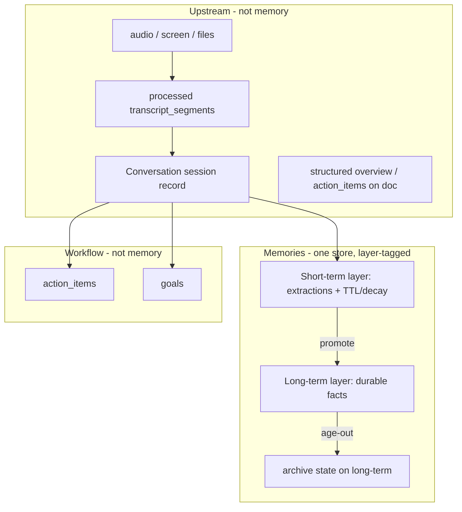

# Canonical Memory Domain Model

> **Normative reference (WS-A).** This document is the single source of truth for the
> canonical memory vocabulary, Memories record schema, and legal state-combination matrix.
> It supersedes scattered V17-era docs for domain terminology. Implementation types live
> in `backend/models/memory_domain.py`.

## Glossary

| Term | Means | Lifecycle | Default-visible? |
|------|-------|-----------|------------------|
| **Conversation** | Persisted **session record** at `users/{uid}/conversations`: processed `transcript_segments`, session metadata (`structured`, `apps_results`), audio/photo linkage. Upstream of memory. | `in_progress` → `processing` → `completed`; user can delete whole session | N/A — Conversations tab, not Memories |
| **Capture session** | Ephemeral listen/recording window (WebSocket lifetime). For voice paths, **1:1 with a Conversation** stub created at listen start. Use this term when distinguishing runtime capture from the persisted record. | Ends when recording stops | N/A |
| **Raw input** | True source capture: audio in GCS, screenshots/files. Conversation docs hold **processed** transcripts (STT, diarization, speaker attribution) — not pristine raw audio/text. | Retained per recording/privacy policy | N/A — never surfaced as "memory" |
| **Short-term memory** (Layer 1) | Structured extractions in **Memories**, tagged `layer=short_term`. Observations tied to a source (usually a Conversation via `evidence[].source_id`). | Born on extraction; **TTL/decay**; **promoted** to Long-term or expires | Yes |
| **Long-term memory** (Layer 2) | Durable facts in **Memories**, tagged `layer=long_term` (e.g. "Name is David Zhang", "Based in Seattle"). | Promotion/consolidation or direct user assertion; may **age to Archive** | Yes |
| **Archive** | Aged-out long-term (`layer=archive` or terminal state); kept for recall but not shown by default. | Terminal unless explicitly resurfaced | No (explicit opt-in only) |
| **Workflow** | Action items and goals — task state, due dates, integrations, progress. **Not** memory layers. | Task: pending → done; Goal: active → ended | Yes (dedicated UX) |

### Session vs Conversation (do not conflate)

| | **Conversation** | **Session** (informal) |
|---|---|---|
| **Exists in code?** | Yes — `Conversation` model, Firestore collection, API, UI | No persisted memory-domain type; overloaded elsewhere (`ChatSession`, auth session, focus session) |
| **Role** | Concrete session record for transcript/audio capture | Abstract provenance boundary or ephemeral capture window |
| **Relationship** | For voice/listen: capture session creates → Conversation doc | Memory extractions cite Conversation as `source_id` |
| **Merge with Memories?** | **No** — stays upstream | N/A |

**Unrelated "session" domains (do not conflate with Conversation):** `ChatSession` (AI chat),
`StoredFocusSession` (desktop focus/screen), auth/checkout/MCP protocol sessions.

### "Archive" is overloaded — disambiguate

| Use of "archive" | Means | Canonical handling |
|------------------|-------|--------------------|
| **`layer=archive`** | Aged-out long-term memory, kept for recall, hidden by default | The **only** product meaning of "archive" |
| `L1MemoryArchiveItem` / working-memory "archive" | A **processing-pipeline** extraction artifact (`working_memory.py`) | Internal only; rename per terminology retirement; **not** the product Archive layer |
| Audio / conversation retention "archive" | Raw-input storage/retention policy | Upstream (not memory); never `layer=archive` |

### Boundary rules

- **Memories** is one store; **layer** (`short_term` / `long_term` / `archive`) is a field on each
  record. Layer drives lifecycle, TTL, promotion, and UI badges — not which collection you query.
- **Conversations** are never Memories. No merge of Conversations tab into Memories.
- **Promotion** is an explicit Short-term → Long-term transition (corroboration, consolidation,
  or user assertion) within Memories — audited, not a silent flag flip.
- Non-durable / rejected extractions stay Short-term or are pruned; they never reach Long-term.
- **Workflow** (`action_items`, `goals`) is extracted from the same seam as Memories but stored
  separately. Long-term may absorb a *fact about* a commitment; the task/goal row stays in workflow.
- Conversation delete cascades to evidence tombstoning on linked Short-term items (`tombstone_source`).

---

## Prior terminology retirement map (§1.1)

### Old → new term map

| Old / internal | Canonical |
|----------------|-----------|
| `layer 1`, `L1`, "extracted conversation" | **Short-term memory** (`layer=short_term`) |
| `layer 2`, `L2`, durable `memories` rows | **Long-term memory** (`layer=long_term`) |
| `V17`, "new memory system" | (drop the codename) the canonical system |
| `memory_items` + `short_term` + legacy `memories` | **One Memories store** with layer field (canonical cohort) |
| bare "session" in memory docs | **Conversation** (persisted) or **capture session** (ephemeral) |
| `action_items`, `goals` | **Workflow** — unchanged collections |

### Production systems → canonical mapping

| Era | What it is | Key identifiers today | Canonical mapping | Disposition |
|-----|------------|----------------------|-------------------|-------------|
| **Legacy flat memories** | Original production store + extractor | `users/{uid}/memories`, `MemoryDB`, `new_memories_extractor`, `/v3/memories` | **Long-term** in unified Memories (`layer=long_term`) | **Migrate** → **Retire** store |
| **Legacy categories** | Old taxonomy on legacy rows | `core`, `hobbies`, `lifestyle`, `work`, `skills`, `learnings`, … | **Keep** as `category` metadata; UI filters use primary four (`interesting`, `system`, `manual`, `workflow`) | **Keep** (not layers) |
| **Shadow short_term** | Interim shadow write path | `users/{uid}/short_term`, `OMI_MEMORY_SHORT_TERM_SHADOW_ENABLED` | **Short-term** in unified Memories (`layer=short_term`) | **Fold** → **Retire** collection |
| **V17 product memory** | Tiered store + ledger | `memory_items`, `MemoryTier`, `memory_commits`, `v17_*` modules | **Canonical Memories store** | **Rename** modules; store becomes canonical |
| **V17 rollout modes** | Gradual rollout control | `off` / `shadow` / `write` / `read`, `V17_MODE`, `V17_MEMORY_ENABLED_USERS`, `memory_control/state` | **`MemorySystem`** + `resolve_memory_system(uid)` | **Collapse** |
| **`tier` product field** | V17 item field | `short_term` / `long_term` / `archive` on `memory_items` | **`layer`** (same semantics) | **Rename** API + clients |
| **`memory_reads.py`** | Merges legacy + shadow for reads | split-brain reader shim | Single Memories query by `layer` | **Retire** |

Normative reference (locked 2026-06-18): [`docs/epics/v17_memory_normative_architecture.md`](../epics/v17_memory_normative_architecture.md)
— product tiers are exactly `short_term`, `long_term`, `archive`; `context_only` is **not** a tier.

### Internal pipeline jargon (do not expose as product language)

V17 introduced **L1/L2 as processing stages** — **not** the same as product Short-term/Long-term.

| Internal term (retire in product/docs) | Code locations | Means | Canonical term |
|----------------------------------------|----------------|-------|----------------|
| **L1**, `L1MemoryArchiveItem`, `WorkingMemoryObservation` | `working_memory.py`, `v17_memory_contracts.py` | Working-memory / archive extraction candidates | **Working observation** or **short-term candidate** |
| **L2**, `L2MemoryRoute`, `durable_memory_patch*` | `l2_memory_routes.py`, `durable_memory_patches.py` | Durable synthesis / promotion routing | **Promotion proposal** / **consolidation route** |
| **`LifecycleState.working`** | `v17_memory_contracts.py` | In-flight extraction state | Internal only; not a product layer |
| **`context_only`** | projections, route hints | Processing outcome | **Not a tier** — normalize to **Archive** or non-default outcome |
| **`processing_state`** | `pending` / `processed` / `blocked` | Item processing pipeline | **Keep** internal; separate from `layer` |
| **`status`** | `active` / `superseded` / `tombstoned` | Record lifecycle | **Keep**; distinct from `layer` |

### Parallel extraction / benchmark (do not become product stores)

| System | Location | Relationship |
|--------|----------|--------------|
| **`memory_ingestion` pipeline** | `backend/utils/memory_ingestion/` | Benchmark-oriented extraction (`WorkingMemoryCandidate`, `working_memory_candidate.v1`). Align `source_type`; not a separate product store |
| **Benchmark v10–v15** | `omi-ingestion-benchmark` repo | Memory cards, L1 spike, L2 evidence packaging. Feeds `durable_memory_patches` via drift guard. **Benchmark-only** — never leak `v13`/`v14` into production domain |

### Adjacent domains (not memory layers)

| System | Store / module | Disposition |
|--------|----------------|-------------|
| **Conversations** | `users/{uid}/conversations` | Upstream session records |
| **Action items / goals** | `action_items`, `goals` | Workflow — unchanged |
| **Knowledge graph** | Neo4j / `knowledge_graph.py` | Derived from long-term facts; invalidation on delete/reprocess (WS-J) |
| **Trends** | `trends_db` | Separate derived index from conversations |
| **Legacy conversation shims** | `plugins_results`, `processing_memory_id` | Mirrored from `apps_results` / `processing_conversation_id`; **retire** when old clients age out |

### API surface consolidation

| API today | Role | After migration |
|-----------|------|-----------------|
| `/v3/memories` | Primary legacy REST | **Keep** route shape for parity; dispatch via `MemoryService` |
| `/v17/memory/search`, `/vector/search`, `/archive/search` | V17-specific reads | **Fold** into canonical memory API; drop `v17` path prefix |
| `/v1/mcp/memories`, `/v1/tools/memories` | Surface adapters | Route through seam (WS-L) |

No active `/v1` or `/v2` memories REST API — `/v3` is the legacy product surface.

### Prior terminology retirement table

| Retire | Replace with | WS |
|--------|--------------|-----|
| `V17`, `v17_*` modules, `v17mem:` vector prefix (stored IDs — migrate per rollout Q5) | `memory` / `canonical_memory` / neutral vector IDs | WS-G, WS-J |
| `tier` (product field on items) | `layer` | WS-G, WS-F |
| `L1`, `L2`, `layer1`, `layer2` in **product/UI** context | **Short-term** / **Long-term** / **promotion** | WS-G, WS-F |
| `L1MemoryArchiveItem`, `WorkingMemoryObservation` in **docs/comments** | working observation / short-term candidate | WS-G |
| `durable_memory_patch`, `L2MemoryRoute` in **docs/comments** | promotion proposal / consolidation route | WS-G |
| `context_only` as a user-visible tier | Archive or internal processing outcome only | WS-B, WS-G |
| V17 rollout `off` / `shadow` / `write` / `read` | `MemorySystem = { legacy, canonical }` + cohort record | WS-E |
| `memory_items` collection name (optional) | `memories` or neutral canonical name (decide in WS-G) | WS-G |
| `plugins_results`, `processing_memory_id` | Already mirrored — document sunset timeline | WS-D |
| Legacy `category` values (`core`, `hobbies`, …) | Keep in DB; map to primary four in UI filters | WS-F |

### Frozen legacy names (do NOT rename)

These read like memory-domain terms but are **fossils from when "memory" meant "conversation"** or are
externally-observable API strings. WS-G must **not** "correct" them toward the canonical vocabulary.

| Frozen name | Where | What it actually is | Action |
|-------------|-------|---------------------|--------|
| `WebhookType.memory_created` (+ payload `conversation_to_dict`) | `utils/webhooks.py`, developer webhook config | Developer-facing webhook that fires on **Conversation** creation, ships a Conversation payload | **Keep string**; document as legacy alias of "conversation created"; deprecation path only via versioned webhook, never an in-place rename |
| `UsageHistoryType.memory_created_external_integration` | `utils/app_integrations.py` | Usage/billing event keyed off Conversation creation | **Keep string**; freeze for analytics/billing continuity |
| `plugins_results`, `processing_memory_id` | conversation docs | Mirror of `apps_results` / `processing_conversation_id` | **Keep**; sunset only when old clients age out |

---

## Canonical Memories record schema (§1.2)

The single record shape every canonical-cohort store/client converges on.

| Field | Type | Meaning | Notes |
|-------|------|---------|-------|
| `id` | string | Stable record id | Neutral scheme (no `v17mem:`); see rollout §10 Q5 |
| `content` | string | The fact/observation text | — |
| `layer` | `short_term` \| `long_term` \| `archive` | **Product lifecycle layer**; drives UI badge, default visibility, TTL | The only axis users/clients see |
| `status` | `active` \| `superseded` \| `tombstoned` | **Record lifecycle**; non-`active` excluded from normal reads | Distinct from `layer` |
| `processing_state` | `pending` \| `processed` \| `blocked` | **Internal pipeline** state | Never surfaced to clients |
| `category` | legacy taxonomy value | Metadata only (`core`/`hobbies`/… → primary four in UI) | **Not** a layer |
| `evidence[]` | array of `{ source_type, source_id, … }` | Provenance; for voice paths `source_id` = Conversation id | Drives cascade/tombstone on Conversation delete |
| `source_id` | string | Primary upstream source (usually a Conversation) | Indexed for cascade |
| `promotion` | `{ from_layer, to_layer, reason, at, by }` \| null | **Audit record** of Short→Long transitions | Promotion is never a silent flag flip |
| `ttl` / `expires_at` | timestamp \| null | Short-term decay deadline | Null for long-term/archive |
| `created_at` / `updated_at` | timestamp | — | — |

`LifecycleState.working` is an **in-flight extraction state**, not a stored field on this record — it
exists only inside the extraction pipeline and resolves to a `layer` before the record is durable.

---

## Legal state-combination matrix (§1.3)

The state axes are orthogonal but **not** freely combinable. Only these combinations are legal;
anything else is a bug a validator should reject.

| `layer` | legal `status` | legal `processing_state` | Default-visible read? |
|---------|----------------|--------------------------|------------------------|
| `short_term` | `active`, `superseded`, `tombstoned` | `pending`, `processed`, `blocked` | `active` + `processed` only |
| `long_term` | `active`, `superseded`, `tombstoned` | `processed` (must be settled before promotion) | `active` + `processed` only |
| `archive` | `active`, `tombstoned` | `processed` | **No** — explicit opt-in only |

### Rules

- **Promotion requires `processing_state=processed`** — a `pending`/`blocked` item never reaches `long_term`.
- `archive` items are **never `superseded`** (terminal) — they tombstone or are resurfaced.
- `status=tombstoned` overrides visibility at **every** layer (hard-excluded from default reads).
- `context_only` is **not** a value on any axis — normalize to `layer=archive` or a non-default outcome (§1.1).
- A read surface requesting `layer=archive` still honors `status` filtering.

Implementation: `is_legal_state_combination()` and `assert_legal_state()` in `backend/models/memory_domain.py`.
