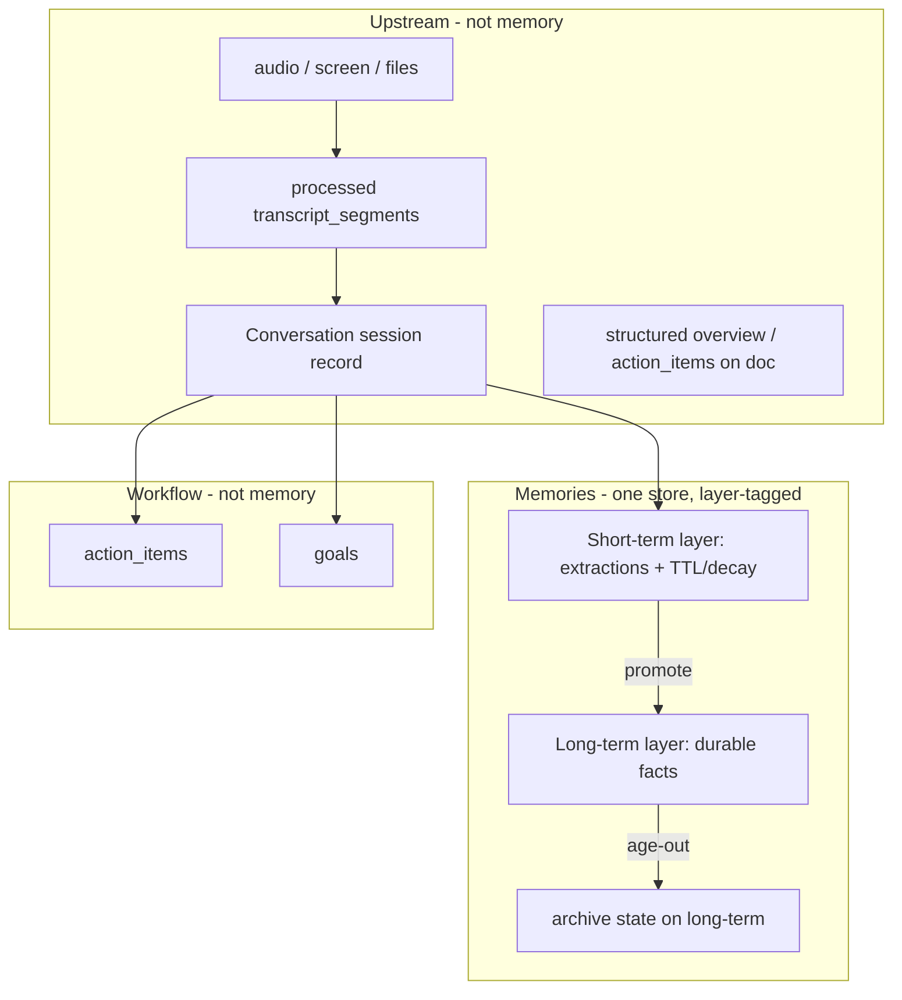

# Canonical Memory Domain Model

> **Normative reference (WS-A).** This document is the single source of truth for the
> canonical memory vocabulary, Memories record schema, and legal state-combination matrix.
> It supersedes scattered legacy codename-era docs for domain terminology. Implementation types live
> in `backend/models/memory_domain.py`.
>
> **Runtime architecture (capture → consolidate → promote → read):**
> [docs/doc/developer/backend/canonical_memory_architecture.md](../doc/developer/backend/canonical_memory_architecture.md)
> (visual: [HTML companion](../doc/developer/backend/canonical_memory_architecture.html)).

## Glossary



| Term | Means | Lifecycle | Default-visible? |
|------|-------|-----------|------------------|
| **Conversation** | Persisted **session record** at `users/{uid}/conversations`: processed `transcript_segments`, session metadata (`structured`, `apps_results`), audio/photo linkage. Upstream of memory. | `in_progress` → `processing` → `completed`; user can delete whole session | N/A — Conversations tab, not Memories |
| **Capture session** | Ephemeral listen/recording window (WebSocket lifetime). For voice paths, **1:1 with a Conversation** stub created at listen start. Use this term when distinguishing runtime capture from the persisted record. | Ends when recording stops | N/A |
| **Raw input** | True source capture: audio in GCS, screenshots/files. Conversation docs hold **processed** transcripts (STT, diarization, speaker attribution) — not pristine raw audio/text. | Retained per recording/privacy policy | N/A — never surfaced as "memory" |
| **Short-term memory** (Layer 1) | Structured extractions in **Memories**, tagged `layer=short_term`. Observations tied to a source (usually a Conversation via `evidence[].source_id`). | Born on extraction; **TTL/decay**; **promoted** to Long-term or expires | Yes |
| **Long-term memory** (Layer 2) | Durable facts in **Memories**, tagged `layer=long_term` (e.g. "Name is David Zhang", "Based in Seattle"). | Promotion/consolidation or direct user assertion; may **age to Archive** | Yes |
| **Archive** | Aged-out long-term (`layer=archive` or terminal state); kept for recall but not shown by default. | Terminal unless explicitly resurfaced | No (explicit opt-in only) |
| **Workflow** | Action items and goals — task state, due dates, integrations, progress. **Not** memory layers. | Task: pending → done; Goal: active → ended | Yes (dedicated UX) |

### Session vs Conversation (do not conflate)

| | **Conversation** | **Session** (informal) |
|---|---|---|
| **Exists in code?** | Yes — `Conversation` model, Firestore collection, API, UI | No persisted memory-domain type; overloaded elsewhere (`ChatSession`, auth session, focus session) |
| **Role** | Concrete session record for transcript/audio capture | Abstract provenance boundary or ephemeral capture window |
| **Relationship** | For voice/listen: capture session creates → Conversation doc | Memory extractions cite Conversation as `source_id` |
| **Merge with Memories?** | **No** — stays upstream | N/A |

**Unrelated "session" domains (do not conflate with Conversation):** `ChatSession` (AI chat),
`StoredFocusSession` (desktop focus/screen), auth/checkout/MCP protocol sessions.

### "Archive" is overloaded — disambiguate

| Use of "archive" | Means | Canonical handling |
|------------------|-------|--------------------|
| **`layer=archive`** | Aged-out long-term memory, kept for recall, hidden by default | The **only** product meaning of "archive" |
| `L1MemoryArchiveItem` / working-memory "archive" | A **processing-pipeline** extraction artifact (`working_memory.py`) | Internal only; rename per terminology retirement; **not** the product Archive layer |
| Audio / conversation retention "archive" | Raw-input storage/retention policy | Upstream (not memory); never `layer=archive` |

### Boundary rules

- **Memories** is one store; **layer** (`short_term` / `long_term` / `archive`) is a field on each
  record. Layer drives lifecycle, TTL, promotion, and UI badges — not which collection you query.
- A client cache record without an authoritative canonical lifecycle is **not** an implicit
  Long-term memory. Canonical product surfaces may read only explicitly layered records;
  untiered legacy and local-pending records remain a compatibility/provenance concern until
  an authoritative read or create receipt supplies their lifecycle.
- **Conversations** are never Memories. No merge of Conversations tab into Memories.
- **Promotion** is an explicit Short-term → Long-term transition (corroboration, consolidation,
  or user assertion) within Memories — audited, not a silent flag flip.
- Non-durable / rejected extractions stay Short-term or are pruned; they never reach Long-term.
- **Workflow** (`action_items`, `goals`) is extracted from the same seam as Memories but stored
  separately. Long-term may absorb a *fact about* a commitment; the task/goal row stays in workflow.
- Conversation delete cascades to evidence tombstoning on linked Short-term items (`tombstone_source`).

---

## Prior terminology retirement map (§1.1)

### Old → new term map

| Old / internal | Canonical |
|----------------|-----------|
| `layer 1`, `L1`, "extracted conversation" | **Short-term memory** (`layer=short_term`) |
| `layer 2`, `L2`, durable `memories` rows | **Long-term memory** (`layer=long_term`) |
| `memory`, "new memory system" | (drop the codename) the canonical system |
| `memory_items` + `short_term` + legacy `memories` | **One Memories store** with layer field (canonical cohort) |
| bare "session" in memory docs | **Conversation** (persisted) or **capture session** (ephemeral) |
| `action_items`, `goals` | **Workflow** — unchanged collections |

### Production systems → canonical mapping

| Era | What it is | Key identifiers today | Canonical mapping | Disposition |
|-----|------------|----------------------|-------------------|-------------|
| **Legacy flat memories** | Original production store + extractor | `users/{uid}/memories`, `MemoryDB`, `new_memories_extractor`, `/v3/memories` | **Long-term** in unified Memories (`layer=long_term`) | **Migrate** → **Retire** store |
| **Legacy categories** | Old taxonomy on legacy rows | `core`, `hobbies`, `lifestyle`, `work`, `skills`, `learnings`, … | **Keep** as `category` metadata; UI filters use primary four (`interesting`, `system`, `manual`, `workflow`) | **Keep** (not layers) |
| **Shadow short_term** *(retired)* | Was interim shadow write path (`OMI_MEMORY_SHORT_TERM_SHADOW_ENABLED`) | `users/{uid}/short_term` collection may still hold historical rows | **Short-term** in unified Memories (`layer=short_term`) | **Retired** write path; collection cleanup is separate |
| **Canonical product memory** | Tiered store + ledger | `memory_items`, `MemoryTier`, `memory_commits`, neutral `memory_*` modules | **Canonical Memories store** | **Rename** complete; store is canonical |
| **Rollout modes** | Gradual rollout control | `off` / `shadow` / `write` / `read`, `MEMORY_MODE` (compat), `MEMORY_ENABLED_USERS`, `memory_control/state` | **`MemorySystem`** + `resolve_memory_system(uid)` | **Collapse** |
| **`tier` product field** | Persisted item field | `short_term` / `long_term` / `archive` on `memory_items` | **`layer`** (same semantics) | **Rename** API + clients |
| **`memory_reads.py`** | Merges legacy + shadow for reads | split-brain reader shim | Single Memories query by `layer` | **Retire** |

Normative reference (locked 2026-06-18): [`docs/epics/memory_normative_architecture.md`](../epics/memory_normative_architecture.md)
— product tiers are exactly `short_term`, `long_term`, `archive`; `context_only` is **not** a tier.

### Internal pipeline jargon (do not expose as product language)

The legacy pipeline introduced **L1/L2 as processing stages** — **not** the same as product Short-term/Long-term.

| Internal term (retire in product/docs) | Code locations | Means | Canonical term |
|----------------------------------------|----------------|-------|----------------|
| **L1**, `L1MemoryArchiveItem`, `WorkingMemoryObservation` | `working_memory.py`, `memory_contracts.py` | Working-memory / archive extraction candidates | **Working observation** or **short-term candidate** |
| **L2**, `L2MemoryRoute`, `durable_memory_patch*` | `l2_memory_routes.py`, `durable_memory_patches.py` | Durable synthesis / promotion routing | **Promotion proposal** / **consolidation route** |
| **`LifecycleState.working`** | `memory_contracts.py` | In-flight extraction state | Internal only; not a product layer |
| **`context_only`** | projections, route hints | Processing outcome | **Not a tier** — normalize to **Archive** or non-default outcome |
| **`processing_state`** | `pending` / `processed` / `blocked` | Item processing pipeline | **Keep** internal; separate from `layer` |
| **`status`** | `active` / `superseded` / `tombstoned` | Record lifecycle | **Keep**; distinct from `layer` |

### Parallel extraction / benchmark (do not become product stores)

| System | Location | Relationship |
|--------|----------|--------------|
| **`memory_ingestion` pipeline** | `backend/utils/memory_ingestion/` | Benchmark-oriented extraction (`WorkingMemoryCandidate`, `working_memory_candidate.v1`). Align `source_type`; not a separate product store |
| **Benchmark v10–v15** | `omi-ingestion-benchmark` repo | Memory cards, L1 spike, L2 evidence packaging. Feeds `durable_memory_patches` via drift guard. **Benchmark-only** — never leak `v13`/`v14` into production domain |

### Adjacent domains (not memory layers)

| System | Store / module | Disposition |
|--------|----------------|-------------|
| **Conversations** | `users/{uid}/conversations` | Upstream session records |
| **Action items / goals** | `action_items`, `goals` | Workflow — unchanged |
| **Knowledge graph** | Neo4j / `knowledge_graph.py` | Derived from long-term facts; invalidation on delete/reprocess (WS-J) |
| **Trends** | `trends_db` | Separate derived index from conversations |
| **Legacy conversation shims** | `plugins_results`, `processing_memory_id` | Mirrored from `apps_results` / `processing_conversation_id`; **retire** when old clients age out |

### API surface consolidation

| API today | Role | After migration |
|-----------|------|-----------------|
| `/v3/memories` | Primary legacy REST | **Keep** route shape for parity; dispatch via `MemoryService` |
| `/memory/memory/search`, `/vector/search`, `/archive/search` | Canonical-memory reads (legacy `/memory/` prefix retained pending sign-off) | **Fold** into neutral memory API; drop `memory` path prefix when clients migrate |
| `/v1/mcp/memories`, `/v1/tools/memories` | Surface adapters | Route through seam (WS-L) |

No active `/v1` or `/v2` memories REST API — `/v3` is the legacy product surface.

### Prior terminology retirement table

| Retire | Replace with | WS |
|--------|--------------|-----|
| `memvec:` vector prefix (stored IDs — migrate per rollout Q5) | `memory` / `canonical_memory` / neutral vector IDs | WS-G, WS-J |
| `tier` (product field on items) | `layer` | WS-G, WS-F |
| `L1`, `L2`, `layer1`, `layer2` in **product/UI** context | **Short-term** / **Long-term** / **promotion** | WS-G, WS-F |
| `L1MemoryArchiveItem`, `WorkingMemoryObservation` in **docs/comments** | working observation / short-term candidate | WS-G |
| `durable_memory_patch`, `L2MemoryRoute` in **docs/comments** | promotion proposal / consolidation route | WS-G |
| `context_only` as a user-visible tier | Archive or internal processing outcome only | WS-B, WS-G |
| Rollout `off` / `shadow` / `write` / `read` | `MemorySystem = { legacy, canonical }` + cohort record | WS-E |
| `memory_items` collection name (optional) | `memories` or neutral canonical name (decide in WS-G) | WS-G |
| `plugins_results`, `processing_memory_id` | Already mirrored — document sunset timeline | WS-D |
| Legacy `category` values (`core`, `hobbies`, …) | Keep in DB; map to primary four in UI filters | WS-F |

### Frozen legacy names (do NOT rename)

These read like memory-domain terms but are **fossils from when "memory" meant "conversation"** or are
externally-observable API strings. WS-G must **not** "correct" them toward the canonical vocabulary.

| Frozen name | Where | What it actually is | Action |
|-------------|-------|---------------------|--------|
| `WebhookType.memory_created` (+ payload `conversation_to_dict`) | `utils/webhooks.py`, developer webhook config | Developer-facing webhook that fires on **Conversation** creation, ships a Conversation payload | **Keep string**; document as legacy alias of "conversation created"; deprecation path only via versioned webhook, never an in-place rename |
| `UsageHistoryType.memory_created_external_integration` | `utils/app_integrations.py` | Usage/billing event keyed off Conversation creation | **Keep string**; freeze for analytics/billing continuity |
| `plugins_results`, `processing_memory_id` | conversation docs | Mirror of `apps_results` / `processing_conversation_id` | **Keep**; sunset only when old clients age out |

---

## Canonical Memories record schema (§1.2)

The single record shape every canonical-cohort store/client converges on.

| Field | Type | Meaning | Notes |
|-------|------|---------|-------|
| `id` | string | Stable record id | Neutral scheme (no `memvec:`); see rollout §10 Q5 |
| `content` | string | The fact/observation text | — |
| `layer` | `short_term` \| `long_term` \| `archive` | **Product lifecycle layer**; drives UI badge, default visibility, TTL | The only axis users/clients see |
| `status` | `active` \| `superseded` \| `tombstoned` | **Record lifecycle**; non-`active` excluded from normal reads | Distinct from `layer` |
| `processing_state` | `pending` \| `processed` \| `blocked` | **Internal pipeline** state | Never surfaced to clients |
| `category` | legacy taxonomy value | Metadata only (`core`/`hobbies`/… → primary four in UI) | **Not** a layer |
| `evidence[]` | array of `{ source_type, source_id, … }` | Provenance; for voice paths `source_id` = Conversation id | Drives cascade/tombstone on Conversation delete |
| `source_id` | string | Primary upstream source (usually a Conversation) | Indexed for cascade |
| `promotion` | `{ from_layer, to_layer, reason, at, by }` \| null | **Audit record** of Short→Long transitions | Promotion is never a silent flag flip |
| `ttl` / `expires_at` | timestamp \| null | Short-term decay deadline | Null for long-term/archive |
| `created_at` / `updated_at` | timestamp | — | — |

`LifecycleState.working` is an **in-flight extraction state**, not a stored field on this record — it
exists only inside the extraction pipeline and resolves to a `layer` before the record is durable.

---

## Legal state-combination matrix (§1.3)

The state axes are orthogonal but **not** freely combinable. Only these combinations are legal;
anything else is a bug a validator should reject.

| `layer` | legal `status` | legal `processing_state` | Default-visible read? |
|---------|----------------|--------------------------|------------------------|
| `short_term` | `active`, `superseded`, `tombstoned` | `pending`, `processed`, `blocked` | `active` + `processed` only |
| `long_term` | `active`, `superseded`, `tombstoned` | `processed` (must be settled before promotion) | `active` + `processed` only |
| `archive` | `active`, `tombstoned` | `processed` | **No** — explicit opt-in only |

### Rules

- **Promotion requires `processing_state=processed`** — a `pending`/`blocked` item never reaches `long_term`.
- `archive` items are **never `superseded`** (terminal) — they tombstone or are resurfaced.
- `status=tombstoned` overrides visibility at **every** layer (hard-excluded from default reads).
- Physical storage may carry `status=hidden` (canonical pipeline outcome for secret/rejected items). It has
  **no** §1.3 axis value — boundary-map to `tombstoned` at validation/materialization
  (`physical_status_to_record_status()` in `memory_domain.py`). Persisted rows keep `hidden`; canonical
  validation treats them as tombstoned (same default-read exclusion).
- `context_only` is **not** a value on any axis — normalize to `layer=archive` or a non-default outcome (§1.1).
- A read surface requesting `layer=archive` still honors `status` filtering.

Implementation: `is_legal_state_combination()` and `assert_legal_state()` in `backend/models/memory_domain.py`.

---

## Upstream boundary (§ WS-D)

> **Normative lock (WS-D).** Conversations are upstream session records — never Memories.
> This section documents the **current** extraction seam as implemented today. WS-I will
> route writes through `MemoryService` but must preserve these boundaries.

### Rule

**Conversations** (`users/{uid}/conversations`, `database/conversations.py`) are persisted
**session records**: processed `transcript_segments`, session metadata (`structured`,
`apps_results`), audio/photo linkage, and status. They are **never** stored as, surfaced as,
or merged into Memories.

On a Conversation document:

| Field | Role | Memory? |
|-------|------|---------|
| `transcript_segments` | Processed STT input to extraction | **No** — upstream processed input |
| `structured` (`title`, `overview`, `action_items`, `events`, …) | Derived session artifacts from post-processing | **No** — session summary, not extracted facts |
| `apps_results` | Per-app plugin output on the session | **No** — derived session artifacts |
| `plugins_results`, `processing_memory_id` | Legacy mirrors of `apps_results` / `processing_conversation_id` | **No** — frozen legacy names (§1.1) |

Memories are **extracted facts** written to separate stores (`users/{uid}/memories`, and
interim shadow `users/{uid}/short_term`) with provenance pointing *back* at the Conversation.

### Firestore store separation

| Domain | Collection constant | Module |
|--------|---------------------|--------|
| Conversation (upstream) | `conversations` | `database/conversations.py` |
| Long-term memories (interim) | `memories` | `database/memories.py` |
| Short-term shadow (interim) | `short_term` | `database/short_term_memories.py` |
| Workflow — action items | `action_items` | `database/action_items.py` |
| Workflow — goals | `goals` | `database/goals.py` |

No code path may point the Conversation store and a Memory store at the same collection name.
Enforced by `backend/tests/unit/test_upstream_boundary.py`.

### Single extraction seam

When a Conversation completes post-processing, `process_conversation()` in
`backend/utils/conversations/process_conversation.py` fans out **one upstream record** into
**separate downstream destinations**:

```
Conversation (completed)
  ├─► Memories        _extract_memories → _extract_memories_inner
  │                     → new_memories_extractor / extract_memories_from_text
  │                     → memories_db.save_memories (+ optional short_term shadow)
  ├─► action_items    _save_action_items
  │                     → action_items_db.create_action_items_batch
  └─► goals           _update_goal_progress
                        → extract_and_update_goal_progress (utils/llm/goals.py)
```

The three WS-D fan-out calls (`_extract_memories`, `_save_action_items`, `_update_goal_progress`)
are submitted separately from `process_conversation()` at lines ~946 and ~948–949 via
`submit_with_context(postprocess_executor, …)` — the Conversation is **decomposed**, not
persisted verbatim as a memory row.

`action_items` and `goals` are **Workflow** domains: downstream of the same seam, stored in
their own collections, not inside Memories. Long-term memory may later absorb a *fact about* a
commitment; the task/goal row stays in workflow.

### How memories cite their source Conversation

Extraction builds `MemoryDB` rows via `MemoryDB.from_memory()` (`models/memories.py`):

- **`conversation_id`** — primary upstream link (set to `conversation.id`).
- **`evidence[].source_id`** — provenance id (also `conversation.id` for voice paths;
  `source_type="conversation"`, `source_signal="transcription"`).
- Legacy mirror **`memory_id`** — set equal to `conversation_id` in `MemoryDB.__init__` for
  older query paths (e.g. `get_memory_ids_for_conversation` filters on `memory_id`).

**Conversation delete cascade** keys on this provenance: `memories_db.delete_memories_for_conversation`
→ `ripple_source_deletion(uid, conversation_id)` tombstones evidence where
`evidence[].source_id == conversation_id` and retracts facts with no surviving evidence; shadow
short-term rows are tombstoned via `short_term_db.tombstone_source(uid, source_id)`.

Action items link via **`conversation_id`** on each `action_items` row (`_save_action_items`).

### What this forbids

1. **No Conversation-as-Memory persistence** — no code path may write a Conversation document
   (or its full `dict()`) into `memories` / `short_term` / canonical Memories as a memory row.
2. **No Conversation-as-Memory reads** — memory read surfaces must not return a raw Conversation
   doc shaped as a memory item.
3. **No Conversations tab merge** — merging the Conversations timeline into the Memories tab is
   permanently out of scope; Conversations stay upstream.
4. **No workflow-in-memory** — `action_items` and `goals` remain separate workflow collections;
   they are not memory layers.

WS-I (write convergence) may relocate *where* memory rows are written (`MemoryService`), but must
preserve: separate stores, separate fan-out, extracted-fact payloads (not session records), and
provenance via `conversation_id` / `evidence[].source_id`.

---

## Ratified rollout decisions (§10) — locked 2026-06-23

Authoritative record of the §10 blocking decisions. Ratified by product owner before WS-I start.

| # | Decision | **Ratified choice** | Notes / implications |
|---|----------|---------------------|----------------------|
| Q1 | Write convergence for `process_conversation` | **Hard cutover** | Canonical-cohort extraction writes go to the canonical store **only** — no legacy write/fallback for canonical users. (Override of the dual-write default.) |
| Q2 | Interim split-brain tolerance | **None — disallowed** | A canonical-cohort user must read AND write the canonical store. Consequence: WS-I must also route that cohort's **reads** to canonical (cannot leave reads on legacy), else the user loses freshly written memories. |
| Q3 | Promotion trigger Short→Long | **Batch-or-daily** | Short-term promotes to Long-term in batches once enough accumulate to process a full batch, OR once per day, whichever comes first. (Implemented in WS-B, not WS-I.) |
| Q4 | Backfill dedup (both stores) | **Hash-based idempotency key** | Deterministic id derived from source so re-runs never duplicate. (WS-C.) |
| Q5 | Vector ID strategy | **Neutral prefix** | Drop `memvec:`; canonical items use neutral vector IDs. (WS-J/WS-G.) |
| Q6 | API field name for layer axis | **`layer`** | Desktop aliases `tier` during WS-G. |
| Q7 | Reprocess semantics | **Full retract** | Reprocess/sync-merge retracts conversation-sourced items across ALL stores + vectors before re-extract. |
| Q8 | Conversation-delete cascade | **Server-default `cascade=true` + fix clients** | Belt-and-suspenders; desktop currently omits the flag. (WS-J/WS-K.) |

**WS-I scope consequence of Q1+Q2:** WS-I is NOT a dual-write add-on. For the canonical cohort it must
make the `CanonicalMemoryBackend` real for **both write and read**, route `process_conversation`
extraction to canonical-only, and route the cohort's read path (at least `/v3` GET) to canonical — so a
canonical user is fully self-consistent. The canonical cohort stays **empty in production**
(`CANONICAL_MEMORY_USERS` empty in `memory_system.py`); only explicitly-added test users are affected. Legacy-cohort behavior
must remain byte-unchanged.

### Backfill & reversibility directive (locked 2026-06-23)

- **Backfill is NON-DESTRUCTIVE.** Legacy `memories` / `short_term` rows are **retained** for a migrated
  user, not moved or deleted. WS-C copies legacy → canonical (`layer=long_term`) idempotently
  (hash key, Q4); the legacy data stays intact as a fallback.
- **Reversibility:** because legacy data is preserved, flipping a user `canonical → legacy` is a pure
  routing change with the original data fully available — no restore step needed.
- **Clean cut-over / decommission (WS-H) is GATED:** legacy stores are deleted ONLY once **all** users
  are fully migrated and verified. Until then, legacy is the durable fallback. No agent may run WS-H
  (legacy store deletion) without explicit owner sign-off at full-migration time.
- **Consequence for Q1 cutover:** "cutover" governs the *write/read routing* for a canonical user
  (their NEW writes go canonical-only), not destruction of their pre-existing legacy data.

---

## Delete / privacy matrix (WS-J)

Status legend: ✅ handled in code today · ⚠️ gated / needs sign-off · 🔜 future wave · — not applicable

| Trigger | legacy `memories` | canonical `memory_items` | `memory_evidence` | `memory_operations` | Pinecone ns2 (legacy `{uid}-{id}`) | Pinecone ns2 (canonical neutral `mem_…`) | Pinecone ns2 (legacy `memvec:…`) | `review_queue` | Neo4j KG | WS-M keyword index |
|---------|-------------------|--------------------------|-------------------|---------------------|-------------------------------------|------------------------------------------|-------------------------------|--------------|----------|-------------------|
| **Conversation delete, `cascade=false`** (current server default) | — (no cascade) | — | — | — | — | — | — | — | — | — |
| **Conversation delete, `cascade=true`** | ✅ `ripple_source_deletion` / tombstone evidence | ✅ `MemoryService.retract_conversation_memories` (canonical cohort only) | ✅ tombstone in retract | — | ✅ `delete_memory_vector` for retracted legacy ids | ✅ purge outbox via retract (`neutral_vector_id_for_memory`) | 🔜 legacy `memvec:` vectors not purged on cascade yet | 🔜 no cascade purge wired | 🔜 `invalidate_kg_for_memory_retraction` logs deferral | 🔜 TBD (WS-M) |
| **Account delete** | ✅ Firestore recursive wipe + `delete_memory_vectors_batch` | ✅ Firestore recursive wipe | ✅ Firestore recursive wipe | ✅ Firestore recursive wipe | ✅ `_purge_derived_user_data` | ✅ `purge_canonical_derived_user_data` (canonical cohort only) | 🔜 not enumerated on account delete | ✅ subcollection wipe | ✅ `knowledge_nodes` / `knowledge_edges` wiped | 🔜 TBD (WS-M) |
| **Reprocess / sync-merge (Q7 full retract)** | ✅ legacy path in `_extract_memories_inner` | ✅ `retract_conversation_sourced_memories` | ✅ evidence tombstone in retract | — | ✅ legacy delete in reprocess inner | ✅ purge outbox in retract | 🔜 apply `vector_sync` still writes `memvec:` (carry-forward WS-G) | 🔜 | 🔜 KG hook defers to rebuild | 🔜 TBD (WS-M) |
| **Supersede / tombstone (single memory)** | ✅ `invalidate_memory` / ripple | ✅ `delete_canonical_memory` | ✅ per-item tombstone | ✅ via apply path | ✅ router delete | ✅ purge outbox | 🔜 | 🔜 | 🔜 | 🔜 TBD (WS-M) |
| **Archive transition** | 🔜 legacy archive path | 🔜 canonical archive workers | — | — | 🔜 archive vector filter exists; purge on transition not wired | 🔜 | 🔜 | — | — | 🔜 TBD (WS-M) |

### Q8 — conversation-delete cascade default (⚠️ gated)

**Ratified (Q8):** server-default `cascade=true` + client parity (desktop omits flag today).

**Shipped (WS-J):** default remains **`cascade=false`** — intentional; flipping the default is a
production behavior change for every user and requires explicit owner sign-off while asleep.

**Characterization test:** `test_conversation_delete_cascade_default_is_false` in
`backend/tests/unit/test_ws_j_delete_privacy.py`.

**When approved:** change `Query(False)` → `Query(True)` in `routers/conversations.py` and land
desktop client fix (WS-K).

### Q5 — neutral vector id (canonical)

Canonical purge paths use `neutral_vector_id_for_memory` (`mem_…` = `memory_id`). Legacy apply
`vector_sync` / repair worker still upserts `memvec:…` via `deterministic_memory_vector_id` —
**carry-forward to WS-G**; do not break existing `memvec:` vectors in shared Pinecone ns2.

---

## Client device identity (provenance)

Devices are **capture surfaces only** — provenance metadata, not memory authority or dedup keys.

| Field / header | Shape | Notes |
|----------------|-------|-------|
| `client_device_id` | `{platform}_{hash}` | Same shape as FCM `device_key` in `notifications.py` |
| `hash` | sha256 → first 8 hex chars | From a stable per-install id (Keychain UUID on macOS; persisted local install id on Windows; IDFV/Android id on mobile) |
| `X-Device-Id-Hash` | HTTP / WS upgrade header (first auth message for browser WS) | Raw hash component only |
| `X-App-Platform` | `macos` / `windows` / `ios` / `android` / `web` | Platform component |
| `X-App-Version` | optional | Stored on registry `client_devices` doc |

**Nullability:** all device fields optional. Absent headers or legacy data ⇒ `client_device_id=null` ⇒ UI shows **unknown device**. Device id is **never** folded into `evidence_id` hash inputs (legacy dedup must stay byte-identical when device is absent).

**Registry:** `users/{uid}/client_devices/{client_device_id}` — `platform`, `device_class`, `label`, `first_seen_at`, `last_seen_at`, `app_version`. Upsert throttled like `record_user_platform()`.

**Provenance path:** Conversation (`client_device_id`, `client_platform`) → `Evidence.client_device_id` / `MemoryEvidence.client_device_id` (not in `artifact_ref` or `evidence_id` hash inputs) → optional denormalized `capture_device_ids` / `primary_capture_device` on `MemoryItem` → retrieval filter `device_scope=current|all|explicit` (canonical memory users only; see `X-Omi-Memory-Device-Scope-Supported` response header).
