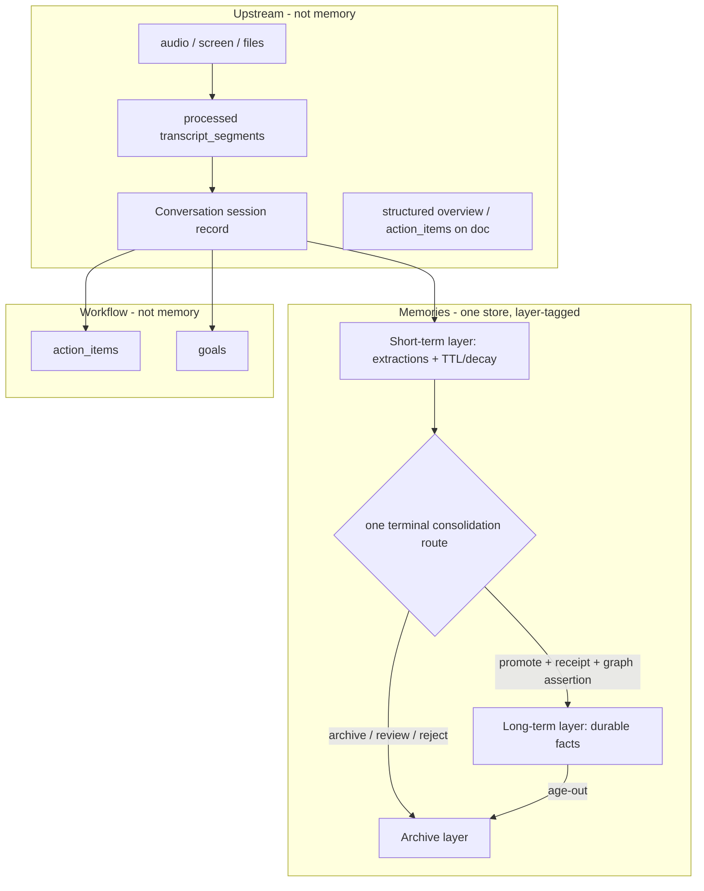

# Canonical Memory Domain Model

> **Normative reference (WS-A).** This document is the single source of truth for the
> canonical memory vocabulary, Memories record schema, and legal state-combination matrix.
> It supersedes scattered legacy codename-era docs for domain terminology. Implementation types live
> in `backend/models/memory_domain.py`.
>
> **Runtime architecture (capture → route once → atomically admit → read):**
> [docs/doc/developer/backend/canonical_memory_architecture.md](../doc/developer/backend/canonical_memory_architecture.md)
> (visual: [HTML companion](../doc/developer/backend/canonical_memory_architecture.html)).

## Glossary


```mermaid
flowchart TD
  subgraph upstream [Upstream - not memory]
    A[audio / screen / files]
    Conv[Conversation session record]
    Transcript[processed transcript_segments]
    Derived[structured overview / action_items on doc]
  end
  subgraph memories [Memories - one store, layer-tagged]
    ST[Short-term layer: extractions + TTL/decay]
    Route{one terminal consolidation route}
    LT[Long-term layer: durable facts]
    AR[Archive layer]
  end
  subgraph workflow [Workflow - not memory]
    Tasks[action_items]
    Goals[goals]
  end

  A --> Transcript
  Transcript --> Conv
  Conv --> ST
  Conv --> Tasks
  Conv --> Goals
  ST --> Route
  Route -- promote + receipt + graph assertion --> LT
  Route -- archive / review / reject --> AR
  LT -- age-out --> AR
```

| Term | Means | Lifecycle | Default-visible? |
|------|-------|-----------|------------------|
| **Conversation** | Persisted **session record** at `users/{uid}/conversations`: processed `transcript_segments`, session metadata (`structured`, `apps_results`), audio/photo linkage. Upstream of memory. | `in_progress` → `processing` → `completed`; user can delete whole session | N/A — Conversations tab, not Memories |
| **Capture session** | Ephemeral listen/recording window (WebSocket lifetime). For voice paths, **1:1 with a Conversation** stub created at listen start. Use this term when distinguishing runtime capture from the persisted record. | Ends when recording stops | N/A |
| **Raw input** | True source capture: audio in GCS, screenshots/files. Conversation docs hold **processed** transcripts (STT, diarization, speaker attribution) — not pristine raw audio/text. | Retained per recording/privacy policy | N/A — never surfaced as "memory" |
| **Short-term memory** (Layer 1) | Broad new intake in **Memories**, tagged `layer=short_term`. Observations and explicit submissions retain source evidence (usually a Conversation via `evidence[].source_id`). | Every new memory starts here; **TTL/decay**; exactly one consolidation route settles it | Yes when eligible |
| **Long-term memory** (Layer 2) | Durable synthesized facts in **Memories**, tagged `layer=long_term` (e.g. "Name is David Zhang", "Based in Seattle"). | Only an atomic `promote` route with a server-authored admission receipt and per-memory graph assertion may enter; may **age to Archive** | Yes |
| **Archive** | Aged-out long-term (`layer=archive` or terminal state); kept for recall but not shown by default. | Terminal unless explicitly resurfaced | No (explicit opt-in only) |
| **Workflow** | Action items and goals — task state, due dates, integrations, progress. **Not** memory layers. | Task: pending → done; Goal: active → ended | Yes (dedicated UX) |

### Session vs Conversation (do not conflate)

| | **Conversation** | **Session** (informal) |
|---|---|---|
| **Exists in code?** | Yes — `Conversation` model, Firestore collection, API, UI | No persisted memory-domain type; overloaded elsewhere (`ChatSession`, auth session, focus session) |
| **Role** | Concrete session record for transcript/audio capture | Abstract provenance boundary or ephemeral capture window |
| **Relationship** | For voice/listen: capture session creates → Conversation doc | Memory extractions cite Conversation as `source_id` |
| **Merge with Memories?** | **No** — stays upstream | N/A |

**Unrelated "session" domains (do not conflate with Conversation):** `ChatSession` (AI chat),
`StoredFocusSession` (desktop focus/screen), auth/checkout/MCP protocol sessions.

### "Archive" is overloaded — disambiguate

| Use of "archive" | Means | Canonical handling |
|------------------|-------|--------------------|
| **`layer=archive`** | Aged-out long-term memory, kept for recall, hidden by default | The **only** product meaning of "archive" |
| `L1MemoryArchiveItem` / working-memory "archive" | A **processing-pipeline** extraction artifact (`working_memory.py`) | Internal only; rename per terminology retirement; **not** the product Archive layer |
| Audio / conversation retention "archive" | Raw-input storage/retention policy | Upstream (not memory); never `layer=archive` |

### Boundary rules

- **Memories** is one store; **layer** (`short_term` / `long_term` / `archive`) is a field on each
  record. Layer drives lifecycle, TTL, promotion, and UI badges — not which collection you query.
- A client cache record without an authoritative canonical lifecycle is **not** an implicit
  Long-term memory. Canonical product surfaces may read only explicitly layered records;
  untiered legacy and local-pending records remain a compatibility/provenance concern until
  an authoritative read or create receipt supplies their lifecycle.
- **Conversations** are never Memories. No merge of Conversations tab into Memories.
- **Every new intake is Short-term**, including conversation extraction,
  explicit first-party memory, import, API, plugin, and integration writes.
  Historical migration/backfill is a separate, explicit policy and cannot
  expose a reusable direct-to-Long-term path.
- Canonical conversation capture accepts only quote references grounded in one
  transcript segment. Extraction failure preserves prior source state; a
  successful empty reprocess fully retracts prior conversation-sourced state.
- **Consolidation owns the only terminal route** for pending Short-term:
  exactly one of `promote`, `archive`, `review`, or `reject`. Incomplete,
  duplicate, or unknown item-addressed output mutates nothing.
- **Promotion** is the audited Short-term → Long-term route within Memories.
  The server binds the current item revision, content, evidence, supersedes
  set, and graph plan into an admission receipt and commits the Long-term item
  plus `memory_graph_assertions/{memory_id}` atomically. Promotion conserves
  authoritative subject identity and attribution; it cannot rewrite a known
  third-party subject as the user.
- No generic batch/daily pass, call-site promotion, or user-asserted fast track
  may bypass consolidation.
- Non-durable/rejected routes settle in Archive or hidden/review state; they
  never reach Long-term.
- Default reads include eligible Short-term + Long-term, then collapse aliases
  by canonical lineage so a logical memory appears once.
- Keyword, vector, compatibility, and shared-graph indexes are outbox-retried
  projections of canonical state, not mutation authorities. Restricted items
  are delete-only: their content never reaches keyword, compatibility,
  embedding, or vector providers, while ID-scoped deletes purge prior state.
- Maintenance drains existing outbox work before parsing rows and drains new
  commit events afterward. A reclaimed expired-processing event repairs current
  authoritative provider state before acknowledgement.
- Canonical graph assertions are derived-state authority. Bounded reads return
  only edges whose endpoints are in the returned node page and mark filtering
  as truncation; public canonical or retained-assertion delete/rebuild requests
  return HTTP 409.
- **Workflow** (`action_items`, `goals`) is extracted from the same seam as Memories but stored
  separately. Long-term may absorb a *fact about* a commitment; the task/goal row stays in workflow.
- Conversation delete cascades to evidence tombstoning on linked Short-term items (`tombstone_source`).

---

## Prior terminology retirement map (§1.1)

### Old → new term map

| Old / internal | Canonical |
|----------------|-----------|
| `layer 1`, `L1`, "extracted conversation" | **Short-term memory** (`layer=short_term`) |
| `layer 2`, `L2`, durable `memories` rows | **Long-term memory** (`layer=long_term`) |
| `memory`, "new memory system" | (drop the codename) the canonical system |
| `memory_items` + `short_term` + legacy `memories` | **One memory authority** with a read-only historical adapter |
| bare "session" in memory docs | **Conversation** (persisted) or **capture session** (ephemeral) |
| `action_items`, `goals` | **Workflow** — unchanged collections |

### Production systems → canonical mapping

| Era | What it is | Key identifiers today | Canonical mapping | Disposition |
|-----|------------|----------------------|-------------------|-------------|
| **Legacy flat memories** | Original production store + extractor | `users/{uid}/memories`, `MemoryDB`, `new_memories_extractor`, `/v3/memories` | Grandfathered historical Long-term compatibility; no fabricated promotion | **Read-only adapter**; lazy materialization on mutation |
| **Legacy categories** | Old taxonomy on legacy rows | `core`, `hobbies`, `lifestyle`, `work`, `skills`, `learnings`, … | **Keep** as `category` metadata; UI filters use primary four (`interesting`, `system`, `manual`, `workflow`) | **Keep** (not layers) |
| **Shadow short_term** *(retired)* | Was interim shadow write path (`OMI_MEMORY_SHORT_TERM_SHADOW_ENABLED`) | `users/{uid}/short_term` collection may still hold historical rows | **Short-term** in unified Memories (`layer=short_term`) | **Retired** write path; collection cleanup is separate |
| **Canonical product memory** | Tiered store + ledger | `memory_items`, `MemoryTier`, `memory_commits`, neutral `memory_*` modules | **Canonical Memories store** | **Rename** complete; store is canonical |
| **Rollout modes** | Retired per-user rollout control | `off` / `shadow` / `write` / `read`, `MEMORY_ENABLED_USERS`, `MemorySystem` | Global incident/readiness controls plus account-generation fences | **Retire selector and UID inventory** |
| **`tier` product field** | Persisted item field | `short_term` / `long_term` / `archive` on `memory_items` | **`layer`** (same semantics) | **Rename** API + clients |
| **`memory_reads.py`** | Merges legacy + shadow for reads | split-brain reader shim | Single Memories query by `layer` | **Retire** |

Normative reference (locked 2026-06-18): [`docs/epics/memory_normative_architecture.md`](../epics/memory_normative_architecture.md)
— product tiers are exactly `short_term`, `long_term`, `archive`; `context_only` is **not** a tier.

### Internal pipeline jargon (do not expose as product language)

The legacy pipeline introduced **L1/L2 as processing stages** — **not** the same as product Short-term/Long-term.

| Internal term (retire in product/docs) | Code locations | Means | Canonical term |
|----------------------------------------|----------------|-------|----------------|
| **L1**, `L1MemoryArchiveItem`, `WorkingMemoryObservation` | `working_memory.py`, `memory_contracts.py` | Working-memory / archive extraction candidates | **Working observation** or **short-term candidate** |
| **L2**, `L2MemoryRoute`, `durable_memory_patch*` | `l2_memory_routes.py`, `durable_memory_patches.py` | Durable synthesis / promotion routing | **Promotion proposal** / **consolidation route** |
| **`LifecycleState.working`** | `memory_contracts.py` | In-flight extraction state | Internal only; not a product layer |
| **`context_only`** | projections, route hints | Processing outcome | **Not a tier** — normalize to **Archive** or non-default outcome |
| **`processing_state`** | `pending` / `processed` / `blocked` | Item processing pipeline | **Keep** internal; separate from `layer` |
| **`status`** | `active` / `superseded` / `tombstoned` | Record lifecycle | **Keep**; distinct from `layer` |

### Parallel extraction / benchmark (do not become product stores)

| System | Location | Relationship |
|--------|----------|--------------|
| **`memory_ingestion` pipeline** | `backend/utils/memory_ingestion/` | Benchmark-oriented extraction (`WorkingMemoryCandidate`, `working_memory_candidate.v1`). Align `source_type`; not a separate product store |
| **Benchmark v10–v15** | `omi-ingestion-benchmark` repo | Memory cards, L1 spike, L2 evidence packaging. Feeds `durable_memory_patches` via drift guard. **Benchmark-only** — never leak `v13`/`v14` into production domain |

### Adjacent domains (not memory layers)

| System | Store / module | Disposition |
|--------|----------------|-------------|
| **Conversations** | `users/{uid}/conversations` | Upstream session records |
| **Action items / goals** | `action_items`, `goals` | Workflow — unchanged |
| **Knowledge graph** | `memory_graph_assertions` + shared graph / `knowledge_graph.py` | Per-memory assertions commit with Long-term admission; shared nodes/edges are a referentially closed, bounded read-side projection and legacy merge; public assertion-backed delete/rebuild returns HTTP 409 |
| **Trends** | `trends_db` | Separate derived index from conversations |
| **Legacy conversation shims** | `plugins_results`, `processing_memory_id` | Mirrored from `apps_results` / `processing_conversation_id`; **retire** when old clients age out |

### API surface consolidation

| API today | Role | After migration |
|-----------|------|-----------------|
| `/v3/memories` | Primary legacy REST | **Keep** route shape for parity; dispatch via `MemoryService` |
| `/memory/memory/search`, `/vector/search`, `/archive/search` | Canonical-memory reads (legacy `/memory/` prefix retained pending sign-off) | **Fold** into neutral memory API; drop `memory` path prefix when clients migrate |
| `/v1/mcp/memories`, `/v1/tools/memories` | Surface adapters | Route through seam (WS-L) |

No active `/v1` or `/v2` memories REST API — `/v3` is the legacy product surface.

### Prior terminology retirement table

| Retire | Replace with | WS |
|--------|--------------|-----|
| `memvec:` revision-scoped vector IDs | One user-scoped `memproj:` provider ID derived from `(uid, memory_id)` | WS-G, WS-J |
| `tier` (product field on items) | `layer` | WS-G, WS-F |
| `L1`, `L2`, `layer1`, `layer2` in **product/UI** context | **Short-term** / **Long-term** / **promotion** | WS-G, WS-F |
| `L1MemoryArchiveItem`, `WorkingMemoryObservation` in **docs/comments** | working observation / short-term candidate | WS-G |
| `durable_memory_patch`, `L2MemoryRoute` in **docs/comments** | promotion proposal / consolidation route | WS-G |
| `context_only` as a user-visible tier | Archive or internal processing outcome only | WS-B, WS-G |
| Per-UID rollout `off` / `shadow` / `write` / `read` | Universal repository + global incident/readiness controls | INV-MEM-5 |
| `memory_items` collection name (optional) | `memories` or neutral canonical name (decide in WS-G) | WS-G |
| `plugins_results`, `processing_memory_id` | Already mirrored — document sunset timeline | WS-D |
| Legacy `category` values (`core`, `hobbies`, …) | Keep in DB; map to primary four in UI filters | WS-F |

### Frozen legacy names (do NOT rename)

These read like memory-domain terms but are **fossils from when "memory" meant "conversation"** or are
externally-observable API strings. WS-G must **not** "correct" them toward the canonical vocabulary.

| Frozen name | Where | What it actually is | Action |
|-------------|-------|---------------------|--------|
| `WebhookType.memory_created` (+ payload `conversation_to_dict`) | `utils/webhooks.py`, developer webhook config | Developer-facing webhook that fires on **Conversation** creation, ships a Conversation payload | **Keep string**; document as legacy alias of "conversation created"; deprecation path only via versioned webhook, never an in-place rename |
| `UsageHistoryType.memory_created_external_integration` | `utils/app_integrations.py` | Usage/billing event keyed off Conversation creation | **Keep string**; freeze for analytics/billing continuity |
| `plugins_results`, `processing_memory_id` | conversation docs | Mirror of `apps_results` / `processing_conversation_id` | **Keep**; sunset only when old clients age out |

---

## Canonical Memories record schema (§1.2)

The single record shape every store/client converges on. Historical adapter
rows carry an explicit grandfathered admission marker internally; they do not
pretend to have a canonical promotion receipt or graph assertion.

| Field | Type | Meaning | Notes |
|-------|------|---------|-------|
| `id` | string | Stable canonical record id | Provider projections derive a separate user-scoped ID; see rollout §10 Q5 |
| `content` | string | The fact/observation text | — |
| `layer` | `short_term` \| `long_term` \| `archive` | **Product lifecycle layer**; drives UI badge, default visibility, TTL | The only axis users/clients see |
| `status` | `active` \| `superseded` \| `tombstoned` | **Record lifecycle**; non-`active` excluded from normal reads | Distinct from `layer` |
| `processing_state` | `pending` \| `processed` \| `blocked` | **Internal pipeline** state | Never surfaced to clients |
| `category` | legacy taxonomy value | Metadata only (`core`/`hobbies`/… → primary four in UI) | **Not** a layer |
| `evidence[]` | array of `{ source_type, source_id, … }` | Provenance; for voice paths `source_id` = Conversation id | Drives cascade/tombstone on Conversation delete |
| `source_ids` | string array | Exact projection of `evidence[].source_id` / `conversation_id` values | `array_contains` index drives bounded source replacement |
| `canonical_memory_id` | string \| null | Alias/lineage target for a consolidated logical memory | Default reads dedupe on this lineage |
| `promotion` | route audit + `admission_receipt` + `graph_plan` \| null | **Admission record** of Short→Long transitions | Receipt is server-authored and revision/content/evidence-fenced |
| `ledger_commit_id` / `ledger_sequence` | string / integer \| null | Atomic canonical commit fence | Required for active Long-term |
| `graph_ready` / `graph_assertion_id` / `graph_plan_hash` | boolean / string / string | Version-fenced per-memory graph admission | Required for newly admitted active Long-term |
| `ttl` / `expires_at` | timestamp \| null | Short-term decay deadline | Null for long-term/archive |
| `created_at` / `updated_at` | timestamp | — | — |

`LifecycleState.working` is an **in-flight extraction state**, not a stored field on this record — it
exists only inside the extraction pipeline and resolves to a `layer` before the record is durable.

---

## Legal state-combination matrix (§1.3)

The state axes are orthogonal but **not** freely combinable. Only these combinations are legal;
anything else is a bug a validator should reject.

| `layer` | legal `status` | legal `processing_state` | Default-visible read? |
|---------|----------------|--------------------------|------------------------|
| `short_term` | `active`, `superseded`, `tombstoned` | `pending`, `processed`, `blocked` | `active` + `processed` only |
| `long_term` | `active`, `superseded`, `tombstoned` | `processed` (must be settled before promotion) | `active` + `processed` only |
| `archive` | `active`, `tombstoned` | `processed` | **No** — explicit opt-in only |

### Rules

- **Promotion requires `processing_state=processed`** — a `pending`/`blocked`
  item never reaches `long_term`.
- Every new active `long_term` admission requires a valid server-authored
  promotion receipt and matching per-memory graph assertion in the same ledger
  transaction. Legacy migration state is not a new admission.
- Every pending item is conserved through one terminal consolidation route;
  there is no independent generic or fast-track promotion transition.
- `archive` items are **never `superseded`** (terminal) — they tombstone or are resurfaced.
- `status=tombstoned` overrides visibility at **every** layer (hard-excluded from default reads).
- Physical storage may carry `status=hidden` (canonical pipeline outcome for secret/rejected items). It has
  **no** §1.3 axis value — boundary-map to `tombstoned` at validation/materialization
  (`physical_status_to_record_status()` in `memory_domain.py`). Persisted rows keep `hidden`; canonical
  validation treats them as tombstoned (same default-read exclusion).
- `context_only` is **not** a value on any axis — normalize to `layer=archive` or a non-default outcome (§1.1).
- A read surface requesting `layer=archive` still honors `status` filtering.

Implementation: `is_legal_state_combination()` and `assert_legal_state()` in `backend/models/memory_domain.py`.

---

## Upstream boundary (§ WS-D)

> **Normative lock (WS-D).** Conversations are upstream session records — never Memories.
> This section documents the **current** extraction seam as implemented today. WS-I will
> route writes through `MemoryService` but must preserve these boundaries.

### Rule

**Conversations** (`users/{uid}/conversations`, `database/conversations.py`) are persisted
**session records**: processed `transcript_segments`, session metadata (`structured`,
`apps_results`), audio/photo linkage, and status. They are **never** stored as, surfaced as,
or merged into Memories.

On a Conversation document:

| Field | Role | Memory? |
|-------|------|---------|
| `transcript_segments` | Processed STT input to extraction | **No** — upstream processed input |
| `structured` (`title`, `overview`, `action_items`, `events`, …) | Derived session artifacts from post-processing | **No** — session summary, not extracted facts |
| `apps_results` | Per-app plugin output on the session | **No** — derived session artifacts |
| `plugins_results`, `processing_memory_id` | Legacy mirrors of `apps_results` / `processing_conversation_id` | **No** — frozen legacy names (§1.1) |

Memories are **extracted facts** written to separate stores (`users/{uid}/memories`, and
interim shadow `users/{uid}/short_term`) with provenance pointing *back* at the Conversation.

### Firestore store separation

| Domain | Collection constant | Module |
|--------|---------------------|--------|
| Conversation (upstream) | `conversations` | `database/conversations.py` |
| Long-term memories (interim) | `memories` | `database/memories.py` |
| Short-term shadow (interim) | `short_term` | `database/short_term_memories.py` |
| Workflow — action items | `action_items` | `database/action_items.py` |
| Workflow — goals | `goals` | `database/goals.py` |

No code path may point the Conversation store and a Memory store at the same collection name.
Enforced by `backend/tests/unit/test_upstream_boundary.py`.

### Single extraction seam

When a Conversation completes post-processing, `process_conversation()` in
`backend/utils/conversations/process_conversation.py` fans out **one upstream record** into
**separate downstream destinations**:

```
Conversation (completed)
  ├─► Memories        _extract_memories → _extract_memories_inner
  │                     → new_memories_extractor / extract_memories_from_text
  │                     → memories_db.save_memories (+ optional short_term shadow)
  ├─► action_items    _save_action_items
  │                     → action_items_db.create_action_items_batch
  └─► goals           _update_goal_progress
                        → extract_and_update_goal_progress (utils/llm/goals.py)
```

The three WS-D fan-out calls (`_extract_memories`, `_save_action_items`, `_update_goal_progress`)
are submitted separately from `process_conversation()` at lines ~946 and ~948–949 via
`submit_with_context(postprocess_executor, …)` — the Conversation is **decomposed**, not
persisted verbatim as a memory row.

`action_items` and `goals` are **Workflow** domains: downstream of the same seam, stored in
their own collections, not inside Memories. Long-term memory may later absorb a *fact about* a
commitment; the task/goal row stays in workflow.

### How memories cite their source Conversation

Extraction builds `MemoryDB` rows via `MemoryDB.from_memory()` (`models/memories.py`):

- **`conversation_id`** — primary upstream link (set to `conversation.id`).
- **`evidence[].source_id`** — provenance id (also `conversation.id` for voice paths;
  `source_type="conversation"`, `source_signal="transcription"`).
- Legacy mirror **`memory_id`** — set equal to `conversation_id` in `MemoryDB.__init__` for
  older query paths (e.g. `get_memory_ids_for_conversation` filters on `memory_id`).

Canonical capture additionally requires every persisted
`evidence[].quote_refs[]` quote to occur in one processed transcript segment.
Extraction validates the complete replacement set before retracting prior
state: a genuinely empty provider result is authoritative, while any emitted
candidate without a unique quote binding fails the replacement and preserves
the prior source cohort.

Canonical replacement reads only the indexed `source_ids` cohort in bounded
cursor pages. When withdrawing a source-owned canonical survivor, the same
control-fenced transaction reactivates any superseded Long-term item backed by
independent active evidence, restores its graph assertion, and emits upsert
projection events. Independent provenance therefore cannot remain stranded
behind a tombstoned survivor.

**Conversation delete cascade** keys on this provenance: `memories_db.delete_memories_for_conversation`
→ `ripple_source_deletion(uid, conversation_id)` tombstones evidence where
`evidence[].source_id == conversation_id` and retracts facts with no surviving evidence; shadow
short-term rows are tombstoned via `short_term_db.tombstone_source(uid, source_id)`.

Action items link via **`conversation_id`** on each `action_items` row (`_save_action_items`).

### What this forbids

1. **No Conversation-as-Memory persistence** — no code path may write a Conversation document
   (or its full `dict()`) into `memories` / `short_term` / canonical Memories as a memory row.
2. **No Conversation-as-Memory reads** — memory read surfaces must not return a raw Conversation
   doc shaped as a memory item.
3. **No Conversations tab merge** — merging the Conversations timeline into the Memories tab is
   permanently out of scope; Conversations stay upstream.
4. **No workflow-in-memory** — `action_items` and `goals` remain separate workflow collections;
   they are not memory layers.

WS-I (write convergence) may relocate *where* memory rows are written (`MemoryService`), but must
preserve: separate stores, separate fan-out, extracted-fact payloads (not session records), and
provenance via `conversation_id` / `evidence[].source_id`.

---

## Ratified universal-authority decisions (§10) — Q1/Q2/Q4 superseded 2026-08-11

Authoritative record of the §10 blocking decisions. Ratified by product owner before WS-I start.

| # | Decision | **Ratified choice** | Notes / implications |
|---|----------|---------------------|----------------------|
| Q1 | Write convergence for `process_conversation` | **Universal canonical write** | Every authenticated account writes new intake through canonical apply. There is no legacy writer, dual-write, or UID enrollment path. |
| Q2 | Historical compatibility | **One authority, two physical formats** | `memory_items` owns memory policy. Historical `users/{uid}/memories` rows are read-only adapter input, never a fallback authority. Canonical overrides/tombstones suppress historical rows before exposure. |
| Q3 | Terminal route trigger for pending Short-term | **Every bounded pending set** | Each enabled maintenance pass deterministically selects a server-bounded eligible set and routes every selected item exactly once through consolidation. Overflow remains immediately eligible on the next Scheduler run, with no 24-hour watermark delay. `promote` performs atomic Long-term admission; there is no separate batch/daily or fast-track promotion pass. |
| Q4 | Historical data availability | **No general backfill** | Existing rows remain physically readable. Mutation lazily materializes only the addressed row with stable identity and deterministic idempotency; reading causes no write, LLM call, embedding, or graph admission. |
| Q5 | Provider projection ID strategy | **User-scoped stable ID** | Typesense and Pinecone use one `memproj:` hash of `(uid, memory_id)` while metadata retains `memory_id` for canonical hydration. (WS-J/WS-G.) |
| Q6 | API field name for layer axis | **`layer`** | Desktop aliases `tier` during WS-G. |
| Q7 | Reprocess semantics | **Full retract after successful extraction** | Extraction failure preserves prior state. A successful result replaces the source across all stores and vectors; an empty result therefore performs a full retract. |
| Q8 | Conversation-delete cascade | **Server-default `cascade=true` + fix clients** | Belt-and-suspenders; desktop currently omits the flag. (WS-J/WS-K.) |

**Scope consequence of Q1+Q2:** universal convergence is not a dual-write add-on
and not a mass migration. `MemoryService` applies one policy for all accounts
and all origins. New writes are canonical-only; historical rows are merged at
read time and can be changed only by deterministic per-item materialization.
Runtime controls remain global incident/cost/readiness switches and integrity
fences; they never grant product entitlement or select a different account
system. The implementation and removal ledger is
[`docs/epics/universal_memory_task_convergence.md`](../epics/universal_memory_task_convergence.md).

### Historical compatibility and reversibility directive (supersedes the 2026-06-23 backfill directive)

- **Historical storage is non-destructive.** Existing `memories` and retired
  `short_term` documents remain physically retained and are not prerequisites
  for universal product availability.
- **Reading is pure.** The historical adapter never copies, embeds, promotes,
  graphs, or otherwise mutates a row during list, fetch, search, export, chat,
  MCP, or tool access.
- **Mutation is lazy and bounded.** Editing or deleting an old row first creates
  its deterministic canonical successor/override or tombstone, then performs
  idempotent physical cleanup. A cleanup failure cannot resurrect the row.
- **Rollback floor:** after universal canonical writes begin, rollback must keep
  a reader that understands both physical formats. Legacy-only routing would
  hide new data and is forbidden.
- **Physical deletion remains separately gated.** This convergence does not
  authorize deleting either store. Production evidence and explicit owner
  approval are required before physical retirement.

---

## Delete / privacy matrix (WS-J)

Status legend: ✅ handled in code today · ⚠️ gated / needs sign-off · 🔜 future wave · — not applicable

| Trigger | legacy `memories` | canonical `memory_items` | `memory_evidence` | `memory_operations` | Pinecone ns2 (legacy `{uid}-{id}`) | Pinecone ns2 (canonical `memproj:<hash(uid,memory_id)>`) | Pinecone ns2 (retired `memvec:…`) | `review_queue` | Neo4j KG | WS-M keyword index |
|---------|-------------------|--------------------------|-------------------|---------------------|-------------------------------------|------------------------------------------|-------------------------------|--------------|----------|-------------------|
| **Conversation delete, `cascade=false`** (current server default) | — (no cascade) | — | — | — | — | — | — | — | — | — |
| **Conversation delete, `cascade=true`** | ✅ historical suppression + bounded cleanup | ✅ atomic complete-source replacement (universal) | ✅ scrubbed tombstone in replacement | ✅ replacement ledger operation | ✅ `delete_memory_vector` for retracted legacy ids | ✅ user-scoped purge outbox | — no new writes | ✅ bounded indexed purge + authoritative read fence | ✅ citation prune, retried by projection delivery | ✅ delete outbox |
| **Account delete** | ✅ Firestore recursive wipe + `delete_memory_vectors_batch` | ✅ Firestore recursive wipe | ✅ Firestore recursive wipe | ✅ Firestore recursive wipe | ✅ `_purge_derived_user_data` | ✅ UID-authoritative provider purge even with no Firestore items | — no new writes | ✅ subcollection wipe | ✅ `knowledge_nodes` / `knowledge_edges` wiped | ✅ UID purge |
| **Reprocess / sync-merge (Q7 full retract)** | ✅ legacy path in `_extract_memories_inner` | ✅ atomic complete-source replacement | ✅ scrubbed tombstone in replacement | ✅ replacement ledger operation | ✅ legacy delete in reprocess inner | ✅ user-scoped purge outbox | — no new writes | ✅ bounded indexed purge | ✅ citation prune | ✅ delete outbox |
| **Supersede / tombstone (single memory)** | ✅ `invalidate_memory` / ripple | ✅ complete non-tombstoned canonical lineage | ✅ scrub embedded evidence; preserve shared standalone evidence only for survivors | ✅ atomic deletion ledger operation | ✅ router delete | ✅ user-scoped purge outbox | — no new writes | ✅ atomic current-review redaction + bounded cleanup | ✅ citation prune | ✅ delete outbox |
| **Archive transition** | 🔜 legacy archive path | ✅ consolidation `archive` / `review` route | — | ✅ canonical apply operation | 🔜 legacy archive purge not wired | ✅ delete outbox | — no new writes | ✅ created only for the `review` route | — | ✅ delete outbox |

Canonical review IDs include the source item revision. Resolution validates that
revision together with its source commit and content hash in the same
transaction that mutates the canonical item and redacts the queue row.
Authoritative review reads fail closed when a delayed projection still points
at a stale or tombstoned item.

Canonical delete-all uses bounded tombstone transactions followed by a
control-fenced rescan loop. It succeeds only after observing a stable empty set
of non-tombstoned items; repeated concurrent writes produce an error instead of
a partial-success response.

Canonical account deletion is fenced by the durable top-level wipe record.
Normal projection delivery becomes delete-only while the fence is active, and
provider purge fails retryably until all leased projection work has drained.

### Q8 — conversation-delete cascade default (⚠️ gated)

**Ratified (Q8):** server-default `cascade=true` + client parity (desktop omits flag today).

**Shipped (WS-J):** default remains **`cascade=false`** — intentional; flipping the default is a
production behavior change for every user and requires explicit owner sign-off while asleep.

**Characterization test:** `test_conversation_delete_cascade_default_is_false` in
`backend/tests/unit/test_ws_j_delete_privacy.py`.

**When approved:** change `Query(False)` → `Query(True)` in `routers/conversations.py` and land
desktop client fix (WS-K).

### Q5 — user-scoped provider id (canonical)

Typesense and Pinecone use the same stable `memproj:` hash of `(uid, memory_id)` as their external
document/vector ID. Canonical `memory_id` remains unchanged in provider metadata and is the only
hydration key. No bare-`memory_id` or revision-scoped compatibility write or read fallback is
emitted.

Migration cleanup is metadata-authoritative rather than ID-authoritative. Before an ordinary
Typesense/Pinecone upsert or Pinecone repair, the writer deletes rows matching `(uid, memory_id)`,
which removes both a legacy bare-ID row and any prior `memproj:` row without touching another
user's projection. Per-memory privacy deletion uses the same fence. Rebuild and account deletion
purge by `uid`, even when Firestore no longer enumerates an item, so orphaned legacy rows cannot
survive. Provider cleanup failure fails the projection operation; the durable outbox retries
instead of acknowledging a partial migration.

---

## Client device identity (provenance)

Devices are **capture surfaces only** — provenance metadata, not memory authority or dedup keys.

| Field / header | Shape | Notes |
|----------------|-------|-------|
| `client_device_id` | `{platform}_{hash}` | Same shape as FCM `device_key` in `notifications.py` |
| `hash` | sha256 → first 8 hex chars | From a stable per-install id (Keychain UUID on macOS; persisted local install id on Windows; IDFV/Android id on mobile) |
| `X-Device-Id-Hash` | HTTP / WS upgrade header (first auth message for browser WS) | Raw hash component only |
| `X-App-Platform` | `macos` / `windows` / `ios` / `android` / `web` | Platform component |
| `X-App-Version` | optional | Stored on registry `client_devices` doc |

**Nullability:** all device fields optional. Absent headers or legacy data ⇒ `client_device_id=null` ⇒ UI shows **unknown device**. Device id is **never** folded into `evidence_id` hash inputs (legacy dedup must stay byte-identical when device is absent).

**Registry:** `users/{uid}/client_devices/{client_device_id}` — `platform`, `device_class`, `label`, `first_seen_at`, `last_seen_at`, `app_version`. Upsert throttled like `record_user_platform()`.

**Provenance path:** Conversation (`client_device_id`, `client_platform`) → `Evidence.client_device_id` / `MemoryEvidence.client_device_id` (not in `artifact_ref` or `evidence_id` hash inputs) → optional denormalized `capture_device_ids` / `primary_capture_device` on `MemoryItem` → universal retrieval filter `device_scope=current|all|explicit` (see `X-Omi-Memory-Device-Scope-Supported` response header).
