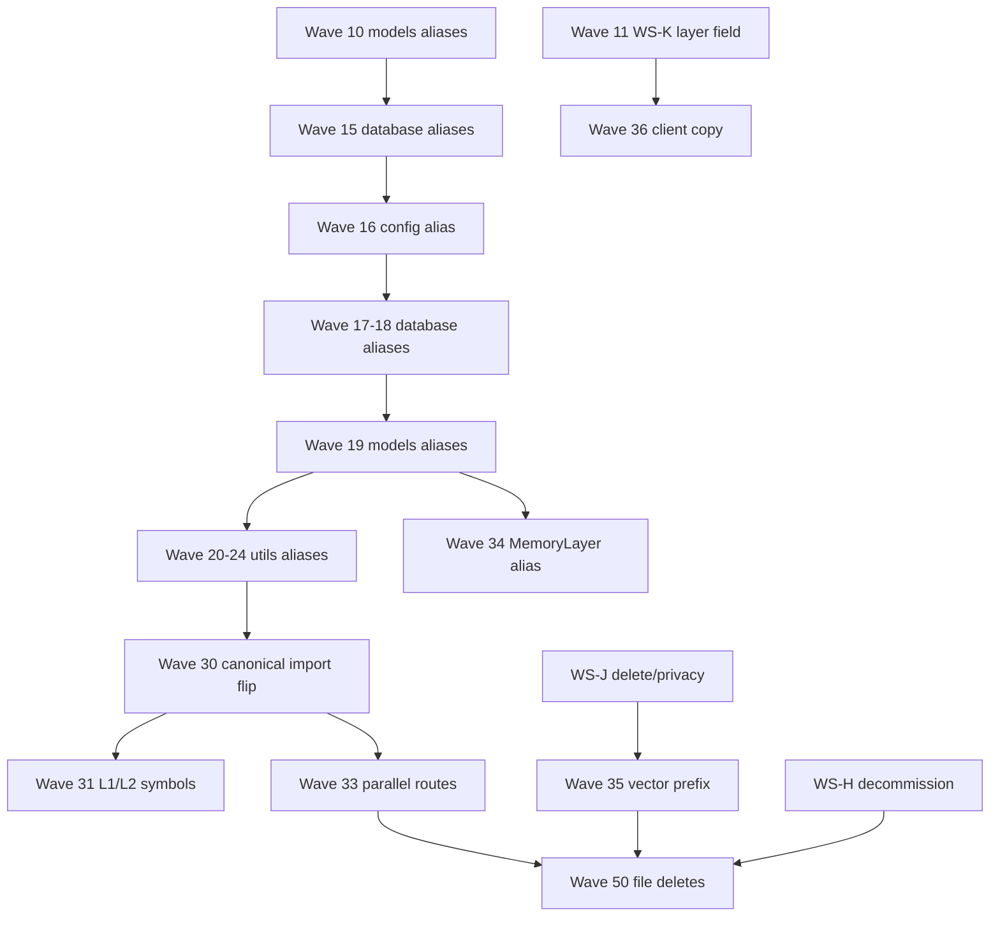

# WS-G Rename Execution Plan

> **Historical:** 'v17' was the internal codename for the canonical memory system; fully renamed to neutral vocabulary on 2026-06-24.

> **Branch:** `memory-canonical-rollout`  
> **Worktree:** `/Users/dazheng/workspace/omi-memory-rollout`  
> **Authoritative term map:** `.cursor/plans/canonical_memory_domain_rollout.plan.md` §1, §1.1  
> **Strategy:** alias-first additive shims → per-group call-site flips → optional file moves last. **Never big-bang.**

---

## 0. Already landed (skip)

| Wave | Date | Scope | Files |
|------|------|-------|-------|
| **10** | 2026-06-24 | Finding-J `hidden`→`tombstoned` mapper + `models/` alias shims | `models/memory_domain.py` (mapper), `models/product_memory.py`, `models/memory_contracts.py`, tests |
| **15** | 2026-06-24 | `database/` alias shims | `database/memory_collections.py`, `database/memory_apply_store.py`, `database/memory_vector_metadata.py`, `tests/unit/test_ws_g_module_aliases.py` |
| **11 (WS-K)** | 2026-06-24 | Additive API `layer` field on `MemoryDB` (derived from `memory_tier`) | `models/memories.py`, `tests/unit/test_ws_k_layer_field.py` — **not** a rename; storage stays `tier` |

Executors must **not** re-do Waves 10/15 or re-touch persisted Firestore `tier` / `MemoryItem.tier`.

---

## 1. Inventory summary (2026-06-23 audit)

### 1.1 `v17_*` modules/files (`backend/`, excluding `scripts/`)

| Location | Count | Files |
|----------|------:|-------|
| `config/` | 1 | `v17_memory.py` |
| `database/` | 10 | `v17_collections.py`, `v17_memory_apply_store.py`, `v17_vector_metadata.py`, `v17_non_active_memory_routes.py`, `v3_compatibility_projection.py`, `app_key_memory_grants.py`, `v17_vector_repair_outbox.py`, `memory_vector_repair_outbox_telemetry.py`, `vector_repair_outbox_worker.py`, `v17_vector_repair_pinecone_adapter.py` |
| `models/` | 5 | `product_memory.py`, `v17_memory_contracts.py`, `v17_memory_apply.py`, `v17_memory_search_gateway.py`, `v17_memory_operations.py` |
| `routers/` | 2 | `memory_product.py`, `memory_admin.py` |
| `jobs/` | 1 | `short_term_lifecycle_worker.py` |
| `utils/memory/` (top-level `v17_*.py`) | 39 | See §1.2 |
| `utils/memory/v3_f6/` (subpackage) | 17 | `__init__.py`, `aggregate.py`, `audit.py`, `config.py`, … |
| **Total `v17_*` named modules** | **58** | Excludes `scripts/` (53 readiness/proof scripts) and `__pycache__` |

**Reference counts:**
- **288** Python files under `backend/` contain the substring `v17_` (includes tests).
- **182** Python files import a `v17_*` module directly.
- **262** repo-wide paths match `**/v17_*` (includes `docs/epics/v17_*`, `docs/runbooks/memory-v3-*`, scripts).

### 1.2 `utils/memory/v17_*.py` (39 files) + importers

| Module | Direct importers (approx.) | Notes |
|--------|---------------------------|-------|
| `product_memory_read_service.py` | 8+ | Product search read path |
| `v17_vector_search_service.py` | 6+ | Vector search + repair |
| `v3_production_runtime.py` | 5+ | Env-driven rollout runtime |
| `v3_memory_read_service.py` | 4+ | V3 GET composition |
| `v17_chat_memory_adapter.py` | 4+ | Chat tool boundary |
| `v17_developer_memory_adapter.py` | 3+ | Developer API |
| `memory_read_api.py` | 3+ | Working-memory read API |
| `default_read_rollout.py` | 3+ | Rollout gate decisions |
| `memory_patch_adapter.py` | 2+ | Durable patch → apply |
| `v17_projections.py` | 2+ | Ledger projections |
| `product_authorization.py` | 2+ | Consumer scopes |
| `v17_non_active_route_*` (2) | 2+ each | Audit-only routes |
| `v3_*` cluster (22 top-level + f6) | cross-import heavy | V3 GET/evidence/canary |

Canonical-path code already importing neutral modules: `canonical_memory_adapter.py`, `legacy_backfill.py`, `short_term_promotion.py`, `atom_keyword_index.py`, `kg_graph_traversal.py` — **flip targets for later B-waves**.

### 1.3 `database/v17_*` importer counts

| Module | Importers | Alias shim |
|--------|----------:|------------|
| `v17_collections` | 26 | ✅ `memory_collections.py` |
| `v17_memory_apply_store` | 7 | ✅ `memory_apply_store.py` |
| `v17_vector_metadata` | 5 | ✅ `memory_vector_metadata.py` |
| `v17_vector_repair_outbox` | 10 | ❌ |
| `v17_non_active_memory_routes` | 9 | ❌ |
| `v3_compatibility_projection` | 4 | ❌ |
| `vector_repair_outbox_worker` | 4 | ❌ |
| `app_key_memory_grants` | 2 | ❌ |
| `v17_vector_repair_*` (telemetry, pinecone) | 2 each | ❌ |

### 1.4 `models/v17_*` importer counts

| Module | Importers | Alias shim |
|--------|----------:|------------|
| `product_memory` | 54 | ✅ partial (`product_memory.py` — subset of symbols) |
| `v17_memory_contracts` | 23 | ✅ partial (`memory_contracts.py` — subset) |
| `v17_memory_apply` | 12 | ❌ |
| `v17_memory_search_gateway` | 11 | ❌ |
| `v17_memory_operations` | 9 | ❌ |

### 1.5 `/memory/` HTTP routes (registered in `main.py`)

| Method | Path | Router file | Bucket |
|--------|------|-------------|--------|
| GET | `/memory/memory/search` | `routers/memory_product.py` | **B** (shipped clients) |
| GET | `/memory/memory/vector/search` | same | **B** |
| GET | `/memory/memory/archive/search` | same | **B** |
| GET | `/memory/admin/users/{uid}/read-rollout-decision` | `routers/memory_admin.py` | **B** (admin) |
| GET | `/memory/admin/users/{uid}/non-active-route-report` | same | **B** |
| POST | `/memory/admin/users/{uid}/short-term-lifecycle/run` | same | **B** |

**Client usage:** Desktop Swift codebase has **zero** hardcoded `/memory/` URL strings (grep 2026-06-23). Primary product surface remains `/v3/memories`. `/memory/memory/*` is backend/admin/integration surface — still **do not remove without parallel routes + deprecation window**.

### 1.6 `memvec:` vector ID prefix

| Location | Role | Bucket |
|----------|------|--------|
| `database/v17_vector_metadata.py` | `MEMORY_VECTOR_ID_PREFIX = "memvec"`; `deterministic_memory_vector_id()` | **D** (stored Pinecone IDs) |
| `database/v17_vector_repair_pinecone_adapter.py` | Upserts via `deterministic_memory_vector_id` | **D** |
| `database/vector_db.py` | Parses legacy + `memvec:` + neutral `mem_…` | **B** (read compat — keep) |
| `utils/memory/canonical_memory_adapter.py` | Canonical path uses neutral `mem_…`; comment notes memory apply still emits `memvec:` | **D** |
| Tests | `test_memory_vector_*.py`, `test_ws_j_delete_privacy.py` | keep during transition |

**Risk:** Changing the prefix without backfill orphans vectors in Pinecone `ns2`. Coordinate with **WS-J**; treat as **data migration**, not a rename-only WS-G wave.

### 1.7 `tier` → `layer` surfaces

| Surface | Field(s) | Bucket | Notes |
|---------|----------|--------|-------|
| Firestore `memory_items` docs | `tier` | **D — OUT OF SCOPE** | Plan explicitly freezes storage field |
| `MemoryItem.tier` / `MemoryTier` enum | `tier` | **D** (storage) / **B** (type rename) | Enum rename is churn; alias `MemoryLayer` first |
| `MemoryDB` API (`/v3/memories`) | `memory_tier` + computed `layer` | **A done (WS-K)** | `layer` additive; keep `memory_tier` |
| `canonical_memory_adapter` | emits `"tier"` in some payloads | **B** | Flip to `layer` when clients ready |
| Pinecone metadata filters | `memory_tier` | **D** | Indexed metadata — migration |
| Desktop `APIClient.swift` | decodes `layer` > `tier` > `memory_tier` | **B** (client) | `MemoryTier` type + `MemoryLayer` typealias landed |
| Desktop `MemoriesPage.swift` | UI still says "tier" in filters | **B** (product copy) | WS-F scope |
| Flutter | no `memory_tier`/`layer` in memory models yet | **B** | `docs/memory/ws_k_client_parity.md` |

### 1.8 L1/L2 processing jargon (NOT product layer names)

| Symbol / file | Bucket | Suggested canonical name |
|---------------|--------|--------------------------|
| `L1MemoryArchiveItem` (`v17_memory_contracts.py`) | **B** | `WorkingObservationArchiveItem` |
| `WorkingMemoryObservation` | **B** | `WorkingObservation` |
| `L1MemoryArchiveItems` (`working_memory.py`) | **B** | `WorkingObservationBatch` |
| `L2MemoryRoute` | **B** | `PromotionRoute` |
| `L2MemoryRouteResponse` (`l2_memory_routes.py`) | **B** | `PromotionRouteResponse` |
| `durable_memory_patch*` (`durable_memory_patches.py`) | **B** | `promotion_proposal*` |
| `durable_memory_patch.v1` schema string | **C** | Frozen schema version literal |
| `utils/llm/working_memory.py` | **B** | `working_observations.py` (file rename late) |
| `utils/llm/l2_memory_routes.py` | **B** | `promotion_routes.py` |
| `utils/llm/durable_memory_patches.py` | **B** | `promotion_proposals.py` |

**Recommendation:** Alias new names in `models/memory_contracts.py` first (A), then flip `working_memory.py` / `l2_memory_routes.py` importers (B). **Do not rename** `durable_memory_patch.v1` schema literal — external benchmark contract.

### 1.9 memory rollout env flags

**Primary env vars (production):**

| Env var | Read in | Bucket |
|---------|---------|--------|
| `MEMORY_MODE` | `config/v17_memory.py`, `v3_production_runtime.py`, `routers/memories.py` | **B** |
| `MEMORY_ENABLED_USERS` | same | **B** |
| `V17_BACKFILL_ENABLED` | `config/v17_memory.py` | **B** |
| `V17_BACKFILL_DAILY_LIMIT` | same | **B** |
| `V17_ARCHIVE_OPT_IN_ENABLED` | same | **B** |
| `V3_GET_ENABLED` | `v3_production_runtime.py`, dev-cloud proof | **B** |
| `MEMORY_VECTOR_REPAIR_OUTBOX_WORKER_ENABLED` | worker entrypoint | **B** |
| + ~30 more `V17_*` proof/readiness vars | scripts/tests | **defer** |

**Critical invariant (WS-E):** `MEMORY_MODE` / `MEMORY_ENABLED_USERS` must **NOT** feed `resolve_memory_system()` — they govern legacy-cohort read composition only.

**Rename approach:** Add `MEMORY_ROLLOUT_*` aliases in `config/memory_rollout.py` that read new names with fallback to `V17_*`. Deploy config keeps old names until ops cutover. Code symbols (`MemoryRolloutMode` → `MemoryRolloutMode`) are **B** after config alias lands.

### 1.10 Frozen names (bucket **C** — DO NOT TOUCH)

#### `WebhookType.memory_created`

| File | Occurrences |
|------|------------|
| `backend/utils/webhooks.py` | 7 |
| `backend/routers/users.py` | 2 |

#### `UsageHistoryType.memory_created_external_integration`

| File | Occurrences |
|------|------------|
| `backend/utils/app_integrations.py` | 2 |
| `backend/utils/apps.py` | 1 |
| `backend/models/app.py` | 1 |
| `backend/database/apps.py` | 1 |

#### `plugins_results`

| File | Occurrences |
|------|------------|
| `backend/models/conversation.py` | 4 |
| `backend/testing/e2e/test_migration_safety.py` | 9 |
| `backend/tests/unit/test_conversation_*.py` | 12+ |
| `backend/utils/conversations/render.py` | 2 |
| `plugins/*` | 6 |
| `app/lib/backend/schema/conversation.dart` | 1 |

#### `processing_memory_id`

| File | Occurrences |
|------|------------|
| `backend/models/conversation.py` | 3 |
| `backend/models/message_event.py` | 3 |
| `backend/tests/unit/test_conversation_*.py` | 4 |
| `plugins/chatgpt/gpt_schema.example.yaml` | 1 |

#### Analytics / PostHog event keys

No memory-domain PostHog `capture()` event names were found in `backend/` production code (readiness tests explicitly assert `posthog` absent from memory proof manifests). **Rule:** do not rename any existing analytics event strings if discovered later; map new states additively.

#### Other frozen literals

- `durable_memory_patch.v1` / `durable_memory_patch_proposal.v1` schema version strings (benchmark contract)
- `durable_memory_patch` source tag in `memory_patch_adapter.py` (persisted operation metadata — treat as **C** until backfill)

---

## 2. Bucket distribution (rename targets)

| Bucket | Meaning | Approx. targets |
|--------|---------|----------------|
| **A** | Pure alias re-export; zero call-site edits | ~45 new shim files (remaining modules) |
| **B** | Call-site / symbol / route churn | ~288 files referencing `v17_`; 6 HTTP routes; L1/L2 symbols; env symbol renames |
| **C** | Frozen — skip | 4 name families + schema literals (§1.10) |
| **D** | Data migration — separate WS-J / WS-H | Firestore `tier` field; `memory_items` collection; `memvec:` vectors; Pinecone `memory_tier` metadata |

---

## 3. Alias-first strategy (per group)

```
For each module group G:
  1. Land additive alias module(s) re-exporting G's public API (bucket A).
  2. Extend test_ws_g_module_aliases.py with import-parity assertions.
  3. Run full memory suite in ONE process (backend/test.sh memory subset).
  4. Later wave: flip NEW canonical-path code to import alias (bucket B, small PR).
  5. Later wave: flip remaining importers group-by-group (bucket B).
  6. Last: optional file rename v17_* → neutral (bucket B, highest risk) — may defer to WS-H.
```

**Never** combine alias landing + mass import flip + file rename in one PR.

---

## 4. Ordered execution waves

> Wave numbers continue from 15. Each wave = one reviewable PR, green `test_ws_g_module_aliases.py` + memory suite.

### Wave 16 — Config alias shim ⭐ **RECOMMENDED NEXT**

| Item | Detail |
|------|--------|
| **Bucket** | A |
| **Files to add** | `backend/config/memory_rollout.py` → re-export `MemoryRolloutMode`, `MemoryRolloutConfig`, `MemoryRolloutState`, `MemoryRolloutCapabilities`, `parse_enabled_users`, `from_env` from `config/v17_memory.py` |
| **Old → new mapping** | `config.v17_memory` → `config.memory_rollout` (import path only) |
| **Blast radius** | 0 runtime change |
| **Tests** | Extend `test_ws_g_module_aliases.py`; `pytest tests/unit/test_ws_g_module_aliases.py tests/unit/test_memory_domain.py -q` |
| **Dependencies** | None (follows Wave 15 ordering: config → database) |
| **Risk** | Low |

### Wave 17 — Database alias shims (batch 1)

| Item | Detail |
|------|--------|
| **Bucket** | A |
| **Files to add** | `database/memory_non_active_routes.py` → `v17_non_active_memory_routes`; `database/memory_compatibility_projection.py` → `v3_compatibility_projection`; `database/memory_app_key_grants.py` → `app_key_memory_grants` |
| **Blast radius** | 0; 15 combined importers |
| **Tests** | `test_ws_g_module_aliases.py` + `test_memory_non_active_route_*` + `test_memory_app_key_grant_store.py` |
| **Dependencies** | Wave 16 optional |

### Wave 18 — Database alias shims (vector repair family)

| Item | Detail |
|------|--------|
| **Bucket** | A |
| **Files to add** | `database/memory_vector_repair_outbox.py`, `memory_vector_repair_outbox_worker.py`, `memory_vector_repair_outbox_telemetry.py`, `memory_vector_repair_pinecone_adapter.py` |
| **Blast radius** | 0; repair worker path |
| **Tests** | `test_memory_vector_repair_outbox*.py`, `test_ws_j_delete_privacy.py` |
| **Dependencies** | Wave 17 |
| **Risk** | Low-Medium (repair worker is production-adjacent; alias-only is safe) |

### Wave 19 — Models alias shims (remaining 3)

| Item | Detail |
|------|--------|
| **Bucket** | A |
| **Files to add** | `models/memory_apply.py` → `v17_memory_apply`; `models/memory_search_gateway.py` → `v17_memory_search_gateway`; `models/memory_operations.py` → `v17_memory_operations` |
| **Extend** | `models/product_memory.py` + `models/memory_contracts.py` to re-export remaining high-traffic symbols if missing (`MemoryItem`, `L1MemoryArchiveItem`, etc.) |
| **Blast radius** | 0; 32 importers |
| **Tests** | `test_ws_g_module_aliases.py`, `test_memory_atomic_apply.py`, `test_memory_memory_contracts.py` |

### Wave 20 — Utils/memory alias shims (core read path)

| Item | Detail |
|------|--------|
| **Bucket** | A |
| **Files to add** | `utils/memory/product_memory_read_service.py`, `memory_read_api.py`, `vector_search_service.py`, `default_read_rollout.py`, `projections.py` |
| **Mapping** | `product_memory_read_service` → `product_memory_read_service`, etc. |
| **Blast radius** | 0; touches read hot path names only |
| **Tests** | `test_memory_product_memory_read_service.py`, `test_memory_read_api.py`, `test_memory_vector_search_service.py`, `test_default_read_rollout_decision.py` |
| **Dependencies** | Waves 17–19 |

### Wave 21 — Utils/memory alias shims (surface adapters)

| Item | Detail |
|------|--------|
| **Bucket** | A |
| **Files to add** | `utils/memory/chat_memory_adapter.py`, `developer_memory_adapter.py`, `patch_adapter.py`, `product_authorization.py`, `non_active_route_report.py`, `non_active_route_audit.py` |
| **Tests** | `test_memory_chat_memory_adapter.py`, `test_memory_developer_memory_adapter.py`, `test_memory_patch_adapter.py`, `test_memory_product_authorization.py` |

### Wave 22 — Utils/memory alias shims (V3 GET cluster part 1)

| Item | Detail |
|------|--------|
| **Bucket** | A |
| **Files to add** | 8 shims: `v3_memory_read_service`, `v3_production_runtime`, `v3_request_adapter`, `v3_response_adapter`, `v3_route_planner`, `v3_composed_get_service`, `v3_control_state_adapter`, `v3_limited_rollout_config` |
| **Blast radius** | 0; `/v3/memories` memory read composition |
| **Tests** | `test_memory_v3_*` suite (20+ modules in `test.sh`) |

### Wave 23 — Utils/memory alias shims (V3 GET cluster part 2 + f6)

| Item | Detail |
|------|--------|
| **Bucket** | A |
| **Files to add** | Remaining `v3_*` top-level shims (14) + `utils/memory/v3_f6/` package alias re-exporting `v3_f6/` |
| **Tests** | `test_memory_v3_f6_*`, dev-cloud readiness tests |
| **Risk** | Medium coupling — split if any import cycle; keep alias-only |

### Wave 24 — Jobs + routers alias shims

| Item | Detail |
|------|--------|
| **Bucket** | A |
| **Files to add** | `jobs/short_term_lifecycle_worker.py` → `short_term_lifecycle_worker`; `routers/memory_product.py` → `memory_product`; `routers/memory_admin.py` → `memory_admin` |
| **Note** | Router alias modules do **not** change URL paths yet |
| **Tests** | `test_memory_product_memory_router.py`, `test_memory_non_active_route_admin_endpoint.py`, `test_memory_short_term_lifecycle_worker.py` |

---

### Wave 30 — Flip canonical-path imports (bucket B, bounded)

| Item | Detail |
|------|--------|
| **Bucket** | B |
| **Files** | `canonical_memory_adapter.py`, `legacy_backfill.py`, `short_term_promotion.py`, `atom_keyword_index.py`, `kg_graph_traversal.py`, `memory_service.py`, `memory_system.py` (~7 files) |
| **Change** | `from database.v17_collections` → `from database.memory_collections`, etc. |
| **Blast radius** | Small — canonical cohort only; prod inert while cohort empty |
| **Tests** | Full memory suite one process (156+ tests per Wave 13 baseline) |
| **Dependencies** | Waves 16–24 aliases exist |

### Wave 31 — L1/L2 symbol aliases in `memory_contracts` (bucket A→B)

| Item | Detail |
|------|--------|
| **Bucket** | A then B |
| **A:** Add to `models/memory_contracts.py`: `WorkingObservation = WorkingMemoryObservation`, `WorkingObservationArchiveItem = L1MemoryArchiveItem`, `PromotionRoute = L2MemoryRoute` |
| **B:** Flip `utils/llm/working_memory.py`, `l2_memory_routes.py`, `memory_read_api.py` to use aliases |
| **Do NOT rename** | `durable_memory_patch.v1` schema string |
| **Tests** | `test_memory_memory_contracts.py`, `test_memory_working_memory_extractor.py`, `test_memory_l2_memory_routes.py`, `test_memory_durable_memory_patches.py` |

### Wave 32 — Env var dual-read (bucket B)

| Item | Detail |
|------|--------|
| **Bucket** | B |
| **Files** | `config/v17_memory.py` (or new `memory_rollout.py` implementation layer) |
| **Change** | `MEMORY_MODE` reads with fallback to `MEMORY_MODE`; same for `MEMORY_ENABLED_USERS` / `MEMORY_ENABLED_USERS` |
| **Blast radius** | Deploy configs must set one or both; no behavior change if only old vars set |
| **Tests** | `test_v3_production_runtime_wiring.py`, `test_memory_service_parity.py` |
| **Risk** | Medium — ops coordination; **do not** rename deployed env keys until runbook updated |

### Wave 33 — Parallel HTTP routes (bucket B, **HIGH RISK**)

| Item | Detail |
|------|--------|
| **Bucket** | B |
| **Files** | `routers/memory_product.py` (or `routers/memory_product.py`) |
| **Change** | Register **duplicate** handlers: `/memory/search`, `/memory/vector/search`, `/memory/archive/search` delegating to same functions as `/memory/memory/*` |
| **Keep** | `/memory/memory/*` routes until deprecation window ends |
| **Tests** | `test_memory_product_memory_router.py` + new route registration tests |
| **Risk** | **HIGH** — external integrators may bookmark `/memory/` paths; desktop uses `/v3/memories` today |
| **Recommendation** | Worth doing for API cleanliness; **not** worth removing `/memory/` until WS-H |

### Wave 34 — `MemoryTier` → `MemoryLayer` type alias expansion (bucket B)

| Item | Detail |
|------|--------|
| **Bucket** | B |
| **Files** | `models/product_memory.py`, `models/product_memory.py`, `models/memory_domain.py` |
| **Change** | `MemoryLayer = MemoryTier` alias; new code uses `MemoryLayer`; keep `MemoryTier` name |
| **Out of scope** | Firestore field rename |
| **Tests** | `test_memory_domain.py`, `test_ws_k_layer_field.py` |

### Wave 35 — Vector prefix neutralization for **new** writes (bucket D)

| Item | Detail |
|------|--------|
| **Bucket** | D (WS-J) |
| **Files** | `v17_memory_apply_store.py`, `canonical_memory_adapter.py`, `v17_vector_repair_pinecone_adapter.py` |
| **Change** | Canonical apply uses `mem_…` IDs; memory repair path keeps `memvec:` until backfill |
| **Risk** | **CRITICAL** — orphaned vectors if flipped without backfill |
| **Recommendation** | Defer until cohort non-empty + repair job proven; not a cosmetic rename |

### Wave 36 — Client product language (bucket B, WS-F/WS-K)

| Item | Detail |
|------|--------|
| **Bucket** | B |
| **Files** | `desktop/.../MemoriesPage.swift`, `APIClient.swift`; Flutter memory models (per `ws_k_client_parity.md`) |
| **Change** | UI copy Short-term/Long-term; optional `MemoryTier` → `MemoryLayer` Swift rename |
| **Tests** | `ServerMemoryV17DecodingTests`, local desktop build |
| **Risk** | Medium — requires named-bundle verification |

### Wave 40+ — Call-site flips (remaining ~175 importers)

Split by directory across multiple PRs:
- `tests/unit/test_memory_*` (141 files) — **low risk** but noisy; batch rename test module names last
- `routers/`, `utils/conversations/` — medium
- `scripts/v17_*` (53) — **defer** to WS-H or archive; readiness scripts are not production paths

### Wave 50 — File renames / delete `v17_*` modules (bucket B, WS-H gated)

Only after:
- All importers flipped to aliases
- Cohort fully on canonical system
- `/memory/` routes deprecated with telemetry showing zero traffic

**Honest assessment:** Full file deletion of 58 `v17_*` modules is **WS-H work**, not pre-decommission WS-G.

---

## 5. Wave summary table

| Phase | Waves | New files (approx.) | Bucket | Cumulative |
|-------|------:|--------------------:|--------|------------|
| Already done | 10, 15 | 5 shims | A | 5 |
| Config + DB + models aliases | 16–19 | 10 shims | A | 15 |
| Utils + jobs + routers aliases | 20–24 | ~30 shims | A | ~45 |
| Canonical import flips | 30 | 0 new; ~7 edited | B | — |
| L1/L2 + env + routes | 31–33 | 0–3 | B | — |
| Type/API/client | 34, 36 | 0 | B | — |
| Data migration | 35 | 0 | D | — |
| Mass importer flips | 40+ | 0 | B | ~175 files |
| File deletes | 50+ | -58 | B | WS-H |

**Total planned alias waves (executable now):** 9 (Waves 16–24)  
**Total new alias shim files:** ~40  
**A/B/C/D distribution (actionable targets):** A ~45, B ~250, C ~20 frozen occurrences, D ~4 storage/vector fields

---

## 6. Test strategy (every wave)

### Minimum bar (alias waves 16–24)

```bash
cd backend
pytest tests/unit/test_ws_g_module_aliases.py -q
pytest tests/unit/test_memory_domain.py tests/unit/test_ws_k_layer_field.py -q
# Group-specific tests per wave (see §4)
pytest tests/unit/test_ws_i_write_convergence.py tests/unit/test_ws_l_surface_routing.py -q  # seam regression
```

### Full memory suite (import-flip waves 30+)

```bash
cd backend && ./test.sh  # or memory subset lines 33–120+
```

**Ordering-sensitive:** Run `ws_i → ws_l` and full suite in **one process** (Wave 11 isolation lesson).

### New tests

- Import-parity: extend `test_ws_g_module_aliases.py` every alias wave (required).
- Optional: `test_ws_g_no_memory_imports_in_canonical_modules.py` once Wave 30 lands — grep guard for canonical-only modules.

---

## 7. Top risks and honest deferrals

| Risk | Severity | Mitigation |
|------|----------|------------|
| `/memory/memory/*` route removal breaks integrators | **HIGH** | Parallel routes (Wave 33); keep `/memory/` until WS-H |
| `memvec:` prefix change orphans Pinecone vectors | **CRITICAL** | WS-J backfill; dual-prefix read in `vector_db.py` already exists |
| Firestore `tier` field rename | **CRITICAL** | **Do not do** — API alias only |
| `MEMORY_MODE` wired into `resolve_memory_system` | **HIGH** | Frozen invariant; code review gate |
| Renaming 53 `scripts/v17_*` | **LOW value** | Defer — not production; archive with docs |
| Renaming 141 `test_memory_*` modules | **LOW value / high noise** | Defer to end; behavior tests matter not names |
| `MemoryTier` enum rename in API | **MEDIUM** | Alias `MemoryLayer`; keep `MemoryTier` until clients migrated |
| L1/L2 symbol rename breaks benchmark drift guard | **MEDIUM** | Keep schema literals frozen; rename Python symbols only |
| Concurrent edit on shared plan file | **PROCESS** | This doc is the execution source; plan file is separate |

### Not worth the churn (before WS-H)

- Renaming `memory_items` Firestore collection
- Mass-renaming `scripts/v17_*` readiness tooling
- Renaming test file prefixes `test_memory_*`
- Removing `MemoryItem` class name (keep until store unified)

---

## 8. Cross-wave dependencies



---

## 9. Recommended first executable wave

**Wave 16 — `config/memory_rollout.py` alias shim**

Rationale:
- Follows locked ordering config → database → utils → routers → clients
- Wave 15 explicitly deferred config because flags were scattered — now centralized in `config/v17_memory.py`
- Single file, zero call-site churn, pure bucket **A**
- Unblocks Wave 32 env dual-read with a neutral import target

---

## 10. Doc / inventory hygiene (non-blocking)

- Archive `docs/epics/v17_*` (20 files) → pointer to `docs/memory/domain_model.md`
- Update `docs/memory/current_state_map.md` per wave (when that doc exists)
- Do **not** edit `.cursor/plans/canonical_memory_domain_rollout.plan.md` from WS-G execution PRs

---

*Generated 2026-06-23 by WS-G scoping pass on `memory-canonical-rollout` worktree.*
