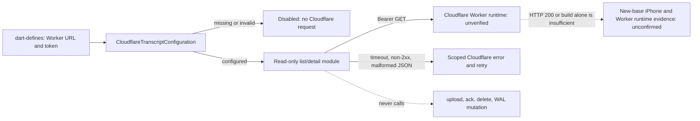

# Spec: Cloudflareセルフホスト会話最小縦スライス

## Configuration

- `BRAINBASE_SELF_HOSTED_WORKER_URL`: Workerのabsolute HTTPS URL。loopbackのHTTPは開発テストのみ許可する。
- `BRAINBASE_SELF_HOSTED_WORKER_TOKEN`: Bearer token。空ならCloudflare一覧・詳細・adapterは無効で、ログや例外に値を出さない。
- `BRAINBASE_SELF_HOSTED_SYNC`: `true` のときだけadapterを有効にする。URLまたはtoken欠落時は無効扱いにする。

## Worker read contract

| Operation | Request | Success | Failure |
| --- | --- | --- | --- |
| list sessions | `GET /v1/transcript-sessions?limit=<n>&cursor=<cursor>` | `sessions` と任意の `next_cursor` | 非2xx、不正JSON、循環cursor、timeoutは値を含まないエラー |
| transcript detail | `GET /v1/upload-sessions/{id}/transcript` | `session` と `chunks` | 非2xx、不正JSON、timeoutは値を含まないエラー |

一覧はcursorを重複なく最後まで追い、各session要素はobjectかつ空でない `id` を必須にする。詳細はobjectの `session` とobject要素だけの `chunks` を必須にし、各chunkは整数の `sequence` と文字列の `text` を持つ。違反は `CloudflareTranscriptApiException` として扱い、詳細chunksはsequence昇順で表示する。Worker正本の文字数は `transcript_char_count` とし、Flutterは旧response互換のため `character_count` を明示的なfallbackとしてのみ読む。tokenはHTTP header以外へ出力しない。

## Adapter contract

- 将来の入力は既存WALが既に永続化した、再送可能なファイル/metadataであるが、このPRでは受け取らない。
- 設定が無効なら `disabled`、設定済みでも `deferred` として何もしない。
- adapter例外は録音経路へ伝播させない。uploadを実装しないため、Worker成功・WAL retry・ローカルWAL終端化をこのPRでは主張しない。
- Worker upload endpoint/ack schemaは別repoのWorker契約と合わせ、新baseの実Worker/iPhone evidenceが得られる後続sliceまで実装を有効化しない。

この最小sliceで実装するadapterは設定を検査して `disabled` または `deferred` を返すno-op seamだけである。`LocalWalSyncImpl` への接続、ファイルupload、ack、ローカルWALの削除は実装しない。

## UI contract

- Cloudflare設定が有効なとき、Omi会話が0件でも会話画面からCloudflare transcript一覧へ遷移できる。設定無効時のOmi 0件empty stateは従来どおり入口を表示しない。
- 一覧はloading、空、error、session status、recorded time、文字数を表す。
- 行を選ぶと詳細で時系列順のtranscript textを表示する。
- 設定無効・ネットワーク失敗は既存Omi会話一覧を壊さず、Cloudflare画面だけで明示する。

## Diagrams

### threat_model

## Slice alignment and release boundary

- Story、Spec、ADR、local overlay runbookは同じ製品slice、すなわちCloudflare transcriptのread-only一覧/詳細とWAL no-op boundaryを正本として記述する。生成l10nはARBからの機械生成であり、独立した製品laneではない。
- Worker deployはこのPRで実行しない。URL/tokenのdart-definesが未設定なら機能は無効であり、request・data write・WAL mutationを行わない。
- rollbackはdefinesの除去で無効化するか、Provider/Conversationsの薄い接続点だけをrevertする。Workerや既存WALの状態を変更しない。
- HTTP 200、build、hermetic testは必要な局所証拠であってE2E完了ではない。新baseでのWorker runtimeとiPhone経路は別証跡を要し、現時点では `未確認` である。画面のscoped errorとcontract testは失敗を観測する範囲であり、production telemetryやdeploy完了を主張しない。

## Verification

1. API/model/provider/unit tests: pagination、session/chunk shape、順序、timeout、HTTP failure、token非露出、設定無効。
2. Widget test: 有効時の入口、一覧、詳細、error/empty、Cloudflare無効時の既存Omi/daily-summary header。
3. analyzer ratchet: 新しいwarning/infoを増やさない。
4. 実機E2EとWorker APIは独立して記録する。ここでテストが緑でも実機/Worker/deploy成功とはしない。音声upload/ack/deleteと新base iPhone E2EはこのPRの受入対象外である。
