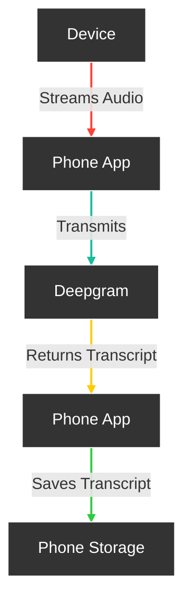

```mermaid
graph TD;
   A[Device] -- Streams Audio --> B[Phone App];
   B -- Transmits --> C[Deepgram];
   C -- Returns Transcript --> D[Phone App];
   D -- Saves Transcript --> E[Phone Storage];

classDef lightMode fill:#FFFFFF, stroke:#333333, color:#333333;
classDef darkMode fill:#333333, stroke:#FFFFFF, color:#FFFFFF;

classDef lightModeLinks stroke:#333333;
classDef darkModeLinks stroke:#FFFFFF;

class A,B,C,D,E lightMode
class A,B,C,D,E darkMode

linkStyle 0 stroke:#FF4136, stroke-width:2px
linkStyle 1 stroke:#1ABC9C, stroke-width:2px
linkStyle 2 stroke:#FFCC00, stroke-width:2px
linkStyle 3 stroke:#2ECC40, stroke-width:2px
```
