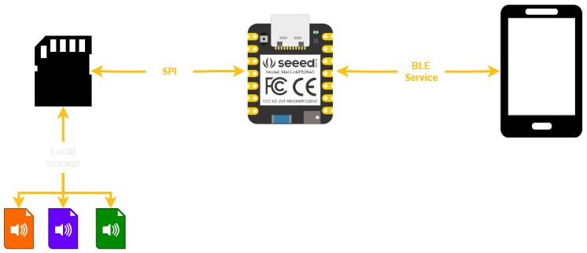
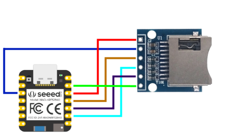

# Redundant local storage

    

 

This solution integrates a microSD memory to provide redundant storage on the device. The redundant storage ensures that the audio files are temporarily saved on the microSD until it is confirmed that they have been correctly transferred to the mobile application. Once the transfer is validated, the data stored on the microSD is deleted, thus ensuring efficient and secure information management. This feature uses a microSD module that operates via SPI, functioning as a bridge between the “XIAO-nRF52840 Sense” board and the micro-SD memory. A notification service is also added to the mobile application to alert if the delayed data has arrived correctly.
</>

## MicroSD Card Module Pin Configuration - SPI

    

The micro-SD card module communicates via the SPI communication protocol. You can connect it to the XIAO-nRF52840 Sense using the default SPI pins. You can buy this module in [Amazon](https://www.amazon.com/RedTagCanada-Storage-Expansion-Soldered-Arduino/dp/B09LTMLJ12/ref=sr_1_61?crid=186EM4TGBRTT&dib=eyJ2IjoiMSJ9.ysWkCOQcBTdneiBpSvvAKKrtj7srmVoT71imrzeFa0enSmZvw0bG4MnVgIHU80dJ1zWteuQVzG4TlX2TxajJ8cVh79vZ1S1Eu3v5B0XQIuI-qvzZg566tzu60kRMY-mrgCmq7vkAS5yNwVG-lAFufuAdS2GNjGKbPUImbbQkh58zZ5YdNiGHNQXyScVS9l3o.81e3AigkNOWHioavXqN1PWDc-NdvahtwwMaEmpgkarc&dib_tag=se&keywords=micro%2Bsd%2Bcard%2Bbreakout&qid=1719634567&sprefix=micro%2Bsd%2Bcard%2Bbre%2Caps%2C210&sr=8-61&th=1)

|  Pin  | SD Card Module | XIAO-nRF52840 |
|-------|----------------|---------------|
|   1   |      3V3       |     VDD       |
|   2   |      CS        |     P1.12     |
|   3   |      MOSI      |     P1.15     |
|   4   |      CLK       |     P1.13     |
|   5   |      MISO      |     P1.14     |
|   6   |      GND       |     GND       |
 
## Preparing the microSD Card

To ensure that the microSD card is in FAT32 format. You can use the software [SD Card Formatter](https://www.sdcard.org/downloads/formatter/) (compatible with Windows and Mac OS).